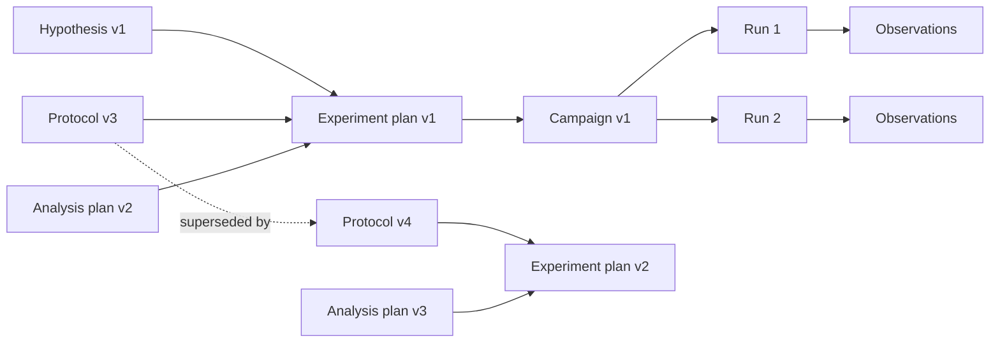
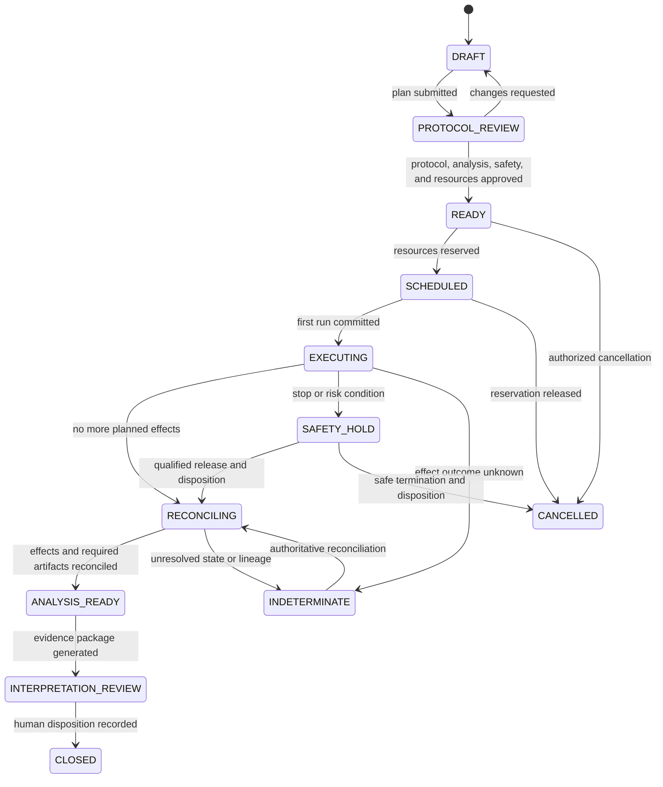

# Hypothesis, Protocol, Experiment State, and Planning

Scientific work is recoverable only when the system stores the evolving research objects and their relationships outside the conversation. The central design is a versioned hypothesis–protocol–run graph with deterministic transitions and explicit human decisions.

## 1. State is not memory

The durable control store contains the canonical state of a research run. Prompt context and model memory are projections of that state. A restart, model swap, or compaction must not change:

- which hypothesis and predictions were active before data were observed;
- which protocol and analysis-plan versions were approved;
- which samples, lots, instruments, and environments were bound;
- which effects were intended, dispatched, and reconciled;
- which deviations, exclusions, and stop conditions occurred;
- which observations support each evidence item; or
- which decisions were made by which authority.

Follow the repository's [agent state and event contract](../../runtime/agent-state-and-event-contracts.md) and [durable execution guide](../../runtime/durable-execution.md).

## 2. Research question and hypothesis contract

### 2.1 Research question

A research question should define population or system, intervention or factors, comparison, outcomes or measurands, conditions, and intended scope. Not every field applies to every discipline, so use domain profiles rather than forcing clinical vocabulary.

Minimum record:

| Field | Purpose |
|---|---|
| `question_id` and `version` | Stable reference and change history |
| `statement` | Human-readable question |
| `system_scope` | Materials, organisms, simulations, or phenomena covered |
| `outcomes` | Intended measurands or computed targets |
| `constraints` | Safety, ethics, data-use, resource, time, and facility boundaries |
| `owner` | Accountable investigator |
| `source_refs` | Proposal, grant, protocol, or cited evidence |

### 2.2 Hypothesis version

Each active hypothesis records:

- a falsifiable statement;
- predicted direction, pattern, or model behavior under specified conditions;
- plausible alternative hypotheses and known confounders;
- evidence rules for `SUPPORTED`, `NOT_SUPPORTED`, and `INCONCLUSIVE`;
- the planned comparison and unit of analysis;
- whether the work is `EXPLORATORY`, `CONFIRMATORY`, or `REPLICATION`;
- creation time relative to data access;
- scope of inference and known limitations; and
- author, reviewer, version, and supersession relationship.

For confirmatory work, seal the hypothesis, design, exclusions, and decision rules before outcome data are exposed to the agent. Exploratory work remains legitimate, but must be labeled and should not be retroactively described as confirmatory.

### 2.3 Assessment is not status inflation

The agent may calculate or propose a `HypothesisAssessment`, but a human owns the final scientific interpretation. Allowed proposed outcomes are:

| Outcome | Meaning |
|---|---|
| `supports_under_design` | Recorded evidence meets the predeclared support rule under this design |
| `does_not_support_under_design` | It does not meet that rule |
| `inconclusive` | Quality, uncertainty, power, controls, deviations, or conflicting evidence prevent the planned assessment |
| `not_assessable` | The required experiment or analysis was not validly completed |

Avoid `proved`, `disproved`, `confirmed universally`, or a bare `success` status.

## 3. Protocol and analysis-plan versioning

The protocol and analysis plan are independently versioned because a scientifically material analysis change can occur without a laboratory step change and vice versa.



A new protocol version does not mutate already-started runs. The system may let an in-progress run finish under its pinned version when policy permits, cancel or safety-hold it through a governed transition, or create a new run under the new version. It may not silently upgrade the old run.

### Change classes

| Change | Required treatment |
|---|---|
| Editorial, no executable or interpretive effect | New source revision; deterministic comparison can propose equivalence, human policy decides |
| Parameter inside an already approved run-specific choice | Record selected value and authorizer |
| Executable step, range, material, instrument, control, stop condition, or analysis rule | New version and revalidation |
| Hazard, containment, scale, temperature/pressure envelope, biological system, or waste handling | New safety review; agent cannot approve |
| Change made after outcome data are visible | Preserve timing and rationale; treat confirmatory claim accordingly |

## 4. Campaign state machine

The campaign is the semantic unit linking one design to one or more runs. It does not mirror a vendor scheduler state.



`CLOSED` does not mean a hypothesis was supported. It means an accountable disposition was recorded and required effects, materials, and artifacts were addressed.

## 5. Experiment-run state machine

An individual run uses more granular physical boundaries:

| State | Meaning | Permitted transition owner |
|---|---|---|
| `PROPOSED` | Run instance generated but not validated | Planner |
| `VALIDATING` | Protocol, sample, resources, units, and constraints checked | Deterministic validator |
| `AWAITING_APPROVAL` | One or more decisions required | Workflow |
| `APPROVED` | Approval bound to exact manifest and freshness conditions | Policy engine |
| `QUEUED` | Resource reservation or scheduler wait | Scheduler adapter |
| `PREPARING` | Reversible setup; no physical commit | Gateway/operator |
| `ARMED` | Final readiness snapshot sealed | Gateway plus fresh authorization |
| `RUNNING` | Physical or computational effect committed | Authoritative controller/scheduler observation |
| `COLLECTING` | Outputs may still arrive | Adapter |
| `RECONCILING` | Intent, controller state, artifacts, and material state compared | Reconciler |
| `VALIDATED` | Required outputs and controls passed declared checks | Result validator |
| `INVALID` | Run completed but is not eligible for planned inference | Validator plus governed disposition |
| `INDETERMINATE` | Completion or material state cannot be established | Reconciler |
| `SAFETY_HOLD` | Safety stop or unresolved hazard | Independent safety pathway |
| `CANCELLED` | No more execution; physical state still reconciled | Workflow/operator |

Never transition `RUNNING → VALIDATED` directly. Operational completion, artifact completeness, and scientific validity are separate facts.

## 6. Readiness snapshot

Immediately before `ARMED`, create an immutable readiness snapshot. It binds:

```yaml
run_id: run-...
attempt_id: attempt-...
manifest_hash: sha256:...
question_version: ...
hypothesis_version: ...
protocol_version: ...
analysis_plan_version: ...
sample_snapshot_hash: sha256:...
material_lot_snapshot_hash: sha256:...
instrument_asset_id: ...
instrument_method_hash: sha256:...
adapter_and_protocol_versions: ...
calibration_and_maintenance_refs: [...]
environment_or_container_digest: ...
operator_and_training_refs: [...]
parameter_envelope_hash: sha256:...
safety_policy_version: ...
approval_bundle_hash: sha256:...
expected_artifact_manifest_hash: sha256:...
budget_and_reservation_refs: [...]
created_at: ...
expires_at: ...
```

This example is a logical contract, not a universal schema. Every referenced object must be authorized for the current actor and project.

### Readiness invalidation

Re-arm or stop when any bound fact changes materially, including:

- protocol, method, analysis, adapter, firmware, or policy version;
- sample identity, status, quantity, custody, or container;
- material lot release or expiration;
- instrument calibration, maintenance, cleanliness, occupancy, or interlock state;
- operator identity or training status;
- data-use or access restriction;
- environment digest, code, dependency lock, or workflow manifest;
- resource reservation, time window, cost estimate, or approval expiry; or
- required control or expected artifact set.

## 7. Typed experiment plan

The model may propose a plan, but a deterministic compiler turns the approved design into a graph of typed nodes:

```yaml
node_id: measure-control-01
kind: instrument_run
depends_on: [prepare-control-01]
capability: facility-a.reader.run
inputs:
  sample_ref: aliquot-...
  method_ref: method-...
parameters:
  plate_layout_ref: artifact-...
preconditions:
  - sample.status == RESERVED
  - instrument.calibration.status == VALID
effect_class: physical
parallelism_key: instrument-asset-id
expected_outputs:
  - role: native_raw
  - role: run_log
stop_conditions_ref: protocol-...#stops
approval_policy_ref: policy-...
```

Plan validation checks:

- acyclic dependencies and reachable closure;
- exact identifiers and versions;
- allowed node and capability types;
- quantity and unit dimensionality;
- factor levels, controls, replicates, randomization, blocking, and blinding where applicable;
- sample consumption and material mass balance;
- exclusive instrument and container constraints;
- safe parallelism and ordering;
- expected artifacts and validators;
- timeout and cancellation behavior;
- budget and reservation coverage; and
- required human decisions.

## 8. Planning strategy

### 8.1 Deterministic outer workflow

Use a constrained workflow, not an open-ended autonomous loop:

1. qualify request and authority;
2. resolve research object versions;
3. retrieve only relevant, authorized evidence;
4. ask the model for a typed proposal or ambiguity list;
5. compile and validate the plan;
6. route design, protocol, safety, and budget decisions;
7. execute eligible nodes through queues and adapters;
8. reconcile effects and validate artifacts;
9. propose evidence assessment;
10. obtain human disposition and close.

### 8.2 When the model helps

The model is useful for finding missing design information, mapping approved prose to a candidate typed protocol, proposing alternatives and confounders, selecting relevant evidence from a governed corpus, explaining validator failures, drafting investigation or deviation records, and suggesting follow-up experiments as proposals.

Use code, constraint solvers, statistics packages, domain validators, or human expertise for calculations, design validity, safety classification, and authority.

### 8.3 Parallel work

Parallelize only nodes whose material, instrument, data, and interpretive dependencies are independent. A deterministic scheduler enforces:

- instrument exclusivity and cleanup boundaries;
- sample/aliquot reservations and nonnegative quantity;
- material lot and environmental constraints;
- project budgets and facility quotas;
- concurrency limits for external services; and
- join conditions that distinguish failed, missing, invalid, and indeterminate results.

Multiple model agents are not the default. An independent critic or verifier is warranted only when local evaluation shows a measurable reduction in a defined failure mode and both agents remain within the same authority boundary.

## 9. Approval binding

An approval is valid only for the exact object and conditions reviewed. Store:

| Field | Why |
|---|---|
| Decision and approver role | Establish authority exercised |
| Subject type, ID, version, and hash | Prevent approval drift |
| Effect class and allowed parameters | Prevent reuse for a stronger action |
| Sample/material/instrument scope | Prevent substitution |
| Policy and risk-classification version | Make the decision reproducible |
| Evidence and unresolved warnings shown | Show informed basis |
| Creation, expiry, and single-/multi-use semantics | Prevent replay |
| Required co-approvals | Enforce separation of duties |
| Revocation and supersession | Make later changes effective |

The gateway verifies freshness immediately before commit. A stale approval does not become fresh because the model says the change is immaterial.

## 10. Events and transition integrity

Each state transition appends an event with:

- `event_id`, `run_id`, `attempt_id`, and monotonic run sequence;
- prior and resulting state;
- event type and schema version;
- actor or service identity and delegation chain;
- authoritative source and source event/version where applicable;
- protocol, policy, behavior-manifest, and adapter versions;
- effect ID when relevant;
- artifact references rather than large payloads;
- controller time and ingest time;
- trace/span correlation; and
- reason, evidence refs, and integrity signature or hash-chain metadata as required.

Reject illegal transitions with compare-and-set semantics. Keep rejected transition attempts in security or audit telemetry without treating them as run events.

## 11. Cancellation semantics

Cancellation is a request, not a rewind.

| Boundary | Behavior |
|---|---|
| Before effect intent | Stop planning and release reservations |
| Intent persisted, not dispatched | Mark cancelled and prove no dispatch |
| Dispatched, controller says not accepted | Reconcile and close |
| Accepted but not physically started | Use controller-supported cancel if safe |
| Physically running | Follow protocol and local safe-stop procedure; do not assume immediate halt |
| Outcome unknown | Enter `INDETERMINATE`; block downstream use |
| Material changed or consumed | Record actual disposition; no fictional compensation |

Emergency intervention always follows the facility procedure and local controls, not the agent cancellation API.

## 12. Common state failures

- Treating the ELN page, prompt transcript, or scheduler job as the run record.
- Updating a plan after data arrive without preserving the old version and timing.
- Conflating a retry attempt with a biological or experimental replicate.
- Reusing an approval after sample, instrument, method, or policy substitution.
- Marking cancellation complete while the physical process is still running.
- Deriving sample identity from file name or well position alone.
- Treating a successful control-plane request as a successful scientific run.
- Omitting inconclusive and indeterminate states to simplify dashboards.

## Sources and navigation

Reproducibility definitions and design evidence are reviewed in the [research packet](../../research/packets/scientific-research-agent-blueprint.md). Continue with [04 — Samples, measurements, artifacts, lineage, and reproducibility](04-samples-measurements-artifacts-lineage-and-reproducibility.md), return to [02 — Architecture and integrations](02-reference-architecture-integrations-and-runtime.md), or return to the [overview](README.md).
