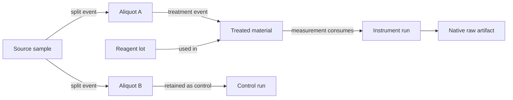
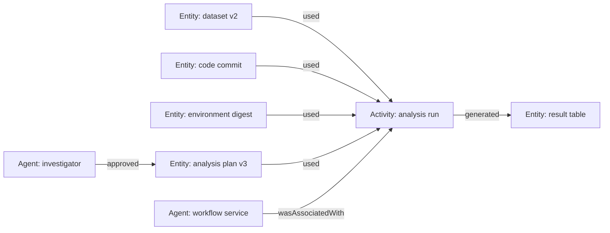

# Samples, Measurements, Artifacts, Lineage, and Reproducibility

The agent is only as trustworthy as the chain from physical subject or computational input to raw observation, derived evidence, and result package. This guide defines that chain without pretending one metadata standard fits every scientific discipline.

## 1. Identity before inference

Use locally authoritative identifiers for projects, protocols, samples, aliquots, containers, materials, instruments, methods, runs, artifacts, and people. Human-readable names are labels, not keys.

Identifier rules:

- preserve the original system and identifier namespace;
- use an internal stable ID only as a cross-system join key, not as a replacement authority;
- store redirects, merges, splits, and deaccession events explicitly;
- bind identifiers to tenant, project, and facility scope;
- verify barcode or machine-readable identifier at the last responsible physical boundary;
- never infer sample identity from position, filename, appearance, embedding similarity, or expected sequence; and
- quarantine conflicting identity rather than choosing the most likely record.

For shareable physical samples, an [IGSN ID](https://support.datacite.org/docs/igsn-ids) can provide a global persistent identifier. It does not replace the local LIMS, and it is not an identifier for digital data.

## 2. Sample and material lineage

Represent lineage as append-only events and a validated material graph.



Minimum lineage event fields:

| Field | Requirement |
|---|---|
| Event identity | Stable event ID and schema version |
| Subject identities | Source and resulting sample/container/material IDs |
| Event kind | Create, collect, split, pool, transfer, treat, consume, dispose, correct |
| Quantity | Value, machine-readable unit, uncertainty or tolerance where relevant |
| Location/custody | From/to location and responsible actor |
| Protocol step | Exact run, protocol version, node, and effect ID |
| Time | Event time, ingest time, timezone/clock source |
| Inputs | Reagent lots, consumables, environment, instrument |
| Receipt | Controller, barcode, balance, operator, or system observation |
| Status | Proposed, observed, reconciled, disputed, corrected |

### Lineage invariants

- a sample cannot be both disposed and available;
- consumption cannot make known remaining quantity negative;
- a pooled sample has explicit contributors and proportions or an `unknown` declaration;
- a split links every child to its source and records loss or residual;
- a correction appends a new event and points to the erroneous event;
- physical identity conflicts block downstream inference;
- sample status is rechecked immediately before consumption; and
- a failed or cancelled action still records actual material disposition.

Not all quantity can be measured precisely. Preserve `unknown`, lower/upper bounds, measurement method, and uncertainty rather than manufacturing exact mass balance.

## 3. Measurement record

A number and a unit are not enough. A minimum measurement observation should include:

```yaml
observation_id: obs-...
measurand:
  concept_id: domain-vocabulary:...
  description: ...
value:
  representation: scalar | vector | image | spectrum | categorical
  artifact_ref: artifact-...
unit:
  code: "..."
  display: "..."
subject:
  sample_or_system_ref: ...
  aliquot_or_region_ref: ...
method:
  protocol_step_ref: ...
  instrument_method_ref: ...
instrument:
  asset_id: ...
  configuration_hash: sha256:...
  software_and_firmware: ...
  calibration_ref: ...
conditions:
  environment_observation_refs: [...]
time:
  acquisition_started_at: ...
  acquisition_ended_at: ...
  ingested_at: ...
quality_flags: [...]
uncertainty_ref: uncertainty-...
raw_artifact_ref: artifact-...
```

This is an implementation-neutral logical schema. Domain profiles should add the information needed to interpret a specific technique.

## 4. Units, measurands, and conversions

Use a machine-readable unit system such as [UCUM](https://ucum.org/ucum) where it fits, but preserve the source representation. Unit validation must include:

- dimensional compatibility;
- scale and offset conversions;
- significant digits and instrument resolution;
- whether the quantity is absolute, relative, normalized, or logarithmic;
- basis such as mass, volume, count, dry weight, area, or time;
- temperature and pressure reference conditions where relevant;
- locale-independent decimal and missing-value semantics; and
- domain-specific units or arbitrary units with explicit definitions.

The model may explain a conversion; deterministic code performs it. Never silently normalize away a basis or reference condition.

## 5. Uncertainty and metrological traceability

### 5.1 Uncertainty record

Store the uncertainty model separately from the displayed result:

| Field | Meaning |
|---|---|
| Measurand definition | What exactly is being estimated |
| Estimate and unit | Reported quantity |
| Standard or expanded uncertainty | Value plus declared form |
| Coverage factor/probability | When expanded uncertainty is used |
| Contributors | Calibration, repeatability, environment, model, sampling, processing |
| Correlations | Dependencies among contributors |
| Method and software version | GUM-compatible or domain-specific procedure |
| Input evidence | Calibration certificate, replicate observations, reference material |
| Validity scope | Conditions under which the estimate applies |

Do not invent uncertainty when the source did not quantify it. Use `not_estimated`, explain why, and prevent downstream presentation that implies a known precision.

### 5.2 Traceability claims

[NIST's metrological traceability guidance](https://www.nist.gov/metrology/metrological-traceability) emphasizes that a **measurement result**, not an instrument or laboratory by itself, is traceable through a documented unbroken calibration chain in which each link contributes uncertainty.

Therefore:

- “instrument calibrated” is one observation, not proof of result traceability;
- bind the calibration reference, status at acquisition time, method, environment, and uncertainty chain;
- preserve reference-material lot and certificate where used;
- flag expired, out-of-scope, missing, or later-invalidated calibration; and
- let a qualified metrologist or domain owner approve any formal traceability claim.

The [BIPM/JCGM Guides](https://www.bipm.org/en/publications/guides) are version-sensitive; the GUM family now includes later supplements and a 2026 amendment. Pin the procedure actually used.

## 6. Raw, normalized, and derived artifacts

| Tier | Meaning | Mutation rule |
|---|---|---|
| Native raw | Original vendor/device/sensor output and run logs | Immutable; never regenerated in place |
| Preservation copy | Lossless package or archive of native raw | Immutable and hash-linked |
| Normalized | Standards-based or analysis-friendly representation | New artifact with converter/version and loss report |
| Derived | Cleaned data, features, images, tables, models | New artifact with full transformation lineage |
| Evidence package | Selected derived outputs plus validation and uncertainty | Versioned; references all inputs |
| Human report | Interpretation and decisions | Governed separately; may cite evidence package |

Normalization does not confer correctness. For every conversion, store:

- source and destination media types and schema versions;
- converter name, version, configuration, and code digest;
- exact input and output hashes;
- validation report;
- unsupported or dropped fields;
- precision/rounding changes; and
- a link to the native raw artifact.

Allotrope, AnIML, ISA, or another community format may be appropriate for a technique, but only a loss and conformance test can establish that for the local export.

## 7. Artifact envelope

Each artifact reference should expose at least:

```yaml
artifact_id: artifact-...
version: 1
role: native_raw | normalized | derived | manifest | report | log
content:
  sha256: ...
  byte_length: ...
  media_type: ...
  schema_or_format_version: ...
producer:
  run_id: ...
  attempt_id: ...
  tool_or_instrument_ref: ...
  behavior_or_environment_ref: ...
provenance:
  input_artifact_refs: [...]
  activity_ref: ...
access:
  tenant: ...
  project: ...
  classification: ...
  policy_ref: ...
lifecycle:
  created_at: ...
  retention_class: ...
  legal_hold: false
  deletion_state: active
integrity:
  ingest_validation: passed | failed | pending
  signature_ref: ...
```

Use atomic publish semantics: upload to a staging object, verify length/hash/schema, then make the immutable version visible. A partially uploaded artifact cannot satisfy a workflow dependency.

## 8. Provenance graph

Use [W3C PROV](https://www.w3.org/TR/prov-overview/) concepts—entities, activities, and agents—as a portable foundation, then add domain profiles.



Do not reduce provenance to “created by the agent.” Preserve the human, service, code, instrument, and source roles. When exporting an [RO-Crate](https://www.researchobject.org/ro-crate/specification) or [Workflow Run RO-Crate](https://www.researchobject.org/workflow-run-crate/), pin the profile and base-specification versions and test compatibility; current versions can lag one another.

## 9. Computational reproducibility manifest

At minimum, record:

- research question, hypothesis, protocol, and analysis-plan versions;
- exact input artifact IDs, versions, hashes, and access conditions;
- source code commit and dirty-state patch or explicit clean status;
- workflow language and engine version;
- package/dependency lock files;
- container or environment digest and base images;
- hardware/accelerator architecture when results depend on it;
- compiler, numerical library, driver, solver, and license versions where relevant;
- locale, timezone, environment variables that affect computation, and thread/concurrency settings;
- random algorithm and every seed or seed derivation;
- numeric tolerances and convergence criteria;
- command or typed job manifest;
- logs, exit status, resource usage, and output manifest;
- deviations and manual steps; and
- validator and comparison results.

### Levels of computational repeatability

| Level | Claim |
|---|---|
| Re-executable | The packaged workflow can run in the target environment |
| Artifact-identical | Declared outputs have identical content hashes |
| Numerically equivalent | Outputs meet declared numeric tolerances |
| Scientifically consistent | Domain conclusions agree under a declared comparison |

Do not promise bitwise identity when parallelism, hardware, floating-point libraries, nondeterministic algorithms, or external services prevent it. Record the achieved level and evidence.

## 10. Experimental reproducibility and replicability

The [National Academies](https://www.nationalacademies.org/read/25303/chapter/3) distinguishes computational reproducibility using the same data/code/conditions from replicability using new data to address the same question. Preserve this distinction.

A result package should identify:

- technical versus biological or independent experimental replicates where the domain uses those concepts;
- randomization, blocking, blinding, and allocation records where applicable;
- controls and their acceptance results;
- exclusions, missing data, protocol deviations, and timing relative to decisions;
- sample size or stopping rationale;
- observed effect estimate and uncertainty, not only a threshold decision;
- analysis multiplicity or exploratory selection;
- materials, resource identifiers, and authentication evidence where applicable; and
- what would be required for an independent replication.

Failure to replicate does not automatically establish misconduct or prove the original result false. The system must preserve methodological, sampling, contextual, and uncertainty explanations for human evaluation.

## 11. Result package

A release candidate contains:

```text
result-package/
  manifest
  question-and-hypothesis
  protocol-and-analysis-plan
  run-and-deviation-records
  sample-and-material-lineage
  instrument-or-compute-environment
  raw-artifact-index
  transformations-and-provenance
  validation-and-control-results
  estimates-and-uncertainty
  proposed-assessment
  human-decisions
  access-license-retention-metadata
  integrity-signatures-or-hashes
```

This is a logical layout; RO-Crate, Workflow Run RO-Crate, ISA, a domain repository schema, or an institutional package may implement it. Never copy sensitive artifacts into a general package merely to make it self-contained; controlled references can be the correct representation.

## 12. Repository deposit

Prefer a domain- or data-type-specific established repository when policy requires or supports it. Evaluate persistent identifiers, sustainability, metadata, curation, access controls, provenance, export format, retention, and sensitive-data handling. The current [NIH repository selection guidance](https://www.grants.nih.gov/policy-and-compliance/policy-topics/sharing-policies/dms/selecting-a-data-repository) offers useful characteristics but applies to NIH-supported research and is not a universal mandate.

The agent may validate a deposit package, create a private draft deposit if authorized, compare metadata with the result manifest, and monitor asynchronous ingest and PID assignment.

It may not choose away consent, confidentiality, sovereignty, IP, export-control, funder, or institutional constraints. A data owner approves repository, access tier, license, embargo, title/claims, and public release.

## 13. FAIR without overclaiming

The [FAIR principles](https://doi.org/10.1038/sdata.2016.18) are high-level guidance for making data findable, accessible, interoperable, and reusable. They are not a single implementation, security model, or compliance certificate.

Report concrete properties instead:

- PID and resolvable metadata;
- declared access process and restrictions;
- community schema and vocabulary versions;
- provenance and license;
- machine-readable format plus native raw preservation;
- validator results; and
- retention and stewardship owner.

## 14. Artifact and lineage failure matrix

| Failure | Detection | Safe response |
|---|---|---|
| Barcode conflicts with LIMS | Last-boundary scan comparison | Quarantine sample and run; human identity investigation |
| Split event missing | Graph/mass-balance invariant | Block child use; reconcile custody and quantities |
| Native file truncated | Length/hash/parser/expected-finalization checks | Keep partial immutable; refetch or rerun only by decision |
| Converter drops metadata | Golden-file and round-trip/loss test | Reject normalized artifact; retain raw |
| Unit basis omitted | Schema/domain validator | Mark observation unusable for planned inference |
| Calibration expires in queue | Fresh readiness check | Return to approval/readiness; do not start |
| Scheduler exits zero but output corrupt | Output manifest and domain validator | Mark operationally complete, scientifically invalid |
| Clock drift reorders observations | Clock-health and dual-time comparison | Preserve both times; bound uncertainty; investigate |
| Artifact access revoked | Authorization check at retrieval | Remove from context/index; hold dependent work |
| Public deposit partially accepted | Deposit reconciliation | Keep draft; do not announce PID or release |

## 15. Review checklist

- Can every reported value be traced to immutable raw observation or declared manual source?
- Are subject, sample, aliquot, container, lot, instrument, method, and run identities explicit?
- Are units, bases, reference conditions, precision, and missing values unambiguous?
- Is uncertainty estimated, cited, or explicitly unavailable?
- Are native raw and normalized representations both retained when normalization may lose meaning?
- Are code, environment, workflow, seeds, tolerances, and manual steps pinned?
- Are exclusions, controls, deviations, and negative/inconclusive results visible?
- Is the achieved reproducibility level tested rather than asserted?
- Does repository release have the correct human approval and access classification?

## Sources and navigation

Standards, definitions, and version conflicts are documented in the [research packet](../../research/packets/scientific-research-agent-blueprint.md). Continue with [05 — Instruments, simulations, tools, effects, and recovery](05-instruments-simulations-tools-effects-and-recovery.md), return to [03 — Hypothesis and experiment state](03-hypothesis-protocol-experiment-state-and-planning.md), or return to the [overview](README.md).

