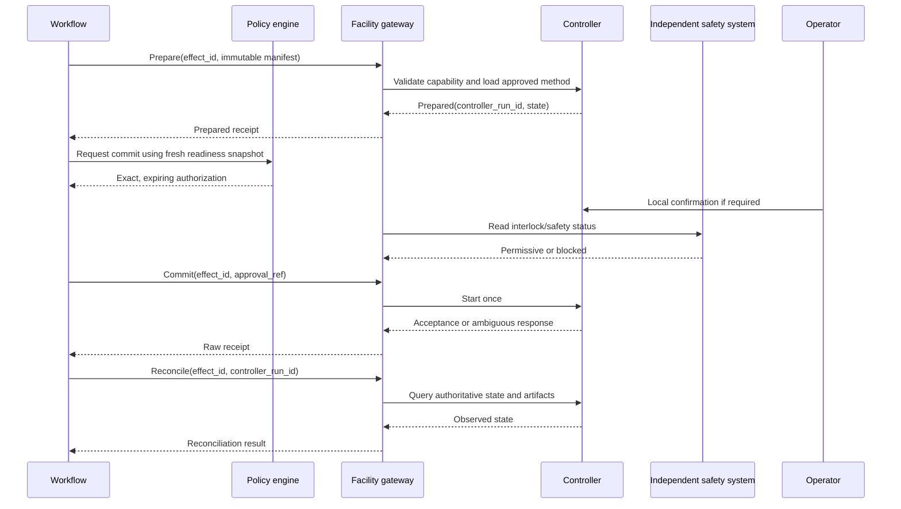
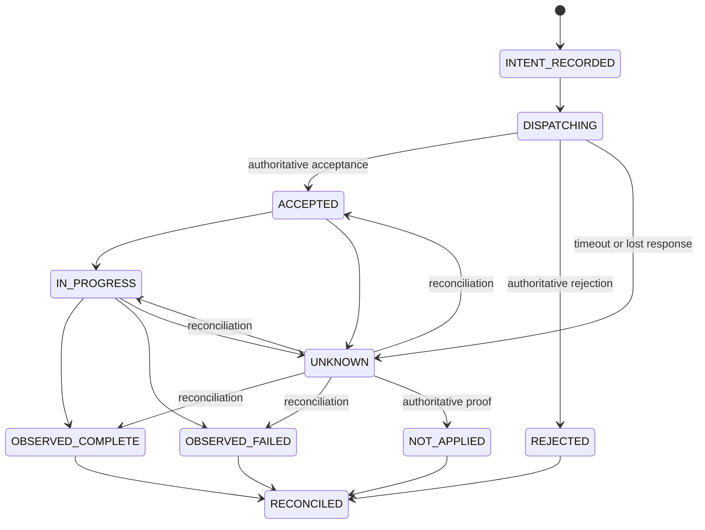

# Instruments, Simulations, Tools, Effects, and Recovery

The safest useful implementation assumes every external action can fail before, during, or after the point at which the caller knows whether it happened. Physical effects add irreversible material and safety consequences. This guide makes those boundaries explicit.

## 1. Capability classes

Classify each tool operation before exposing it to the agent:

| Class | Examples | Retry posture | Approval posture |
|---|---|---|---|
| Read | Query sample, inspect controller state, fetch artifact metadata | Bounded retry with freshness and rate limits | Normal authorization |
| Pure compute | Parse file, validate schema, calculate deterministic transform | Retry using immutable inputs | Pre-approved environment and budget |
| Reversible digital | Create draft, reserve slot, stage upload | Idempotency key plus reconciliation | Policy-dependent |
| Consequential digital | Submit expensive job, change governed metadata, publish artifact | Intent ledger and exact approval | Fresh human approval for release or high cost |
| Physical prepare | Load method, reserve device, prepare run without committing material change | Reconcile controller state | Protocol-bound; operator may be required |
| Physical commit | Start acquisition/process, dispense, move or consume sample | **Never blind retry**; reconcile-only | Fresh, exact approval and independent interlocks |
| Safety-critical | Release interlock, change containment/safety limit, emergency control | Not exposed to model | Qualified local authority only |

Do not let a generic “execute” capability hide the difference among these classes.

## 2. Tool contract for scientific work

In addition to the canonical [tool contract](../../tools/tool-contracts.md), every scientific capability declares:

- exact input and output schema versions;
- effect class and physical/material consequences;
- authoritative target identity and supported firmware/API/profile versions;
- allowed protocol step and parameter envelope;
- unit, precision, range, and cross-field constraints;
- readiness predicates and how their freshness is measured;
- operator, training, safety, and approval prerequisites;
- command acceptance, start, completion, abort, and cleanup semantics;
- concurrency and exclusivity rules;
- whether operation, attempt, controller-run, and effect IDs can be supplied or queried;
- timeout semantics at transport, controller, process, and artifact layers;
- retry, deduplication, cancellation, and reconciliation behavior;
- expected raw artifacts and telemetry;
- error taxonomy and safe state; and
- observability, audit, and data-classification fields.

If the vendor interface cannot distinguish accepted, running, completed, and failed, constrain the adapter to the semantics it can prove. Do not manufacture strong guarantees in the wrapper.

## 3. Prepare, arm, commit, reconcile

Use explicit phases for physical work:



The safety system supplies an independent permissive signal where the facility design supports it. The agent does not compute, simulate, or override that signal.

### Commit fence

Immediately before commit, the gateway rechecks:

- effect and manifest hashes match the approval;
- protocol and policy versions remain active;
- sample, material, container, and location are unchanged and eligible;
- instrument identity, method, firmware, calibration, maintenance, cleaning, and occupancy are current;
- operator and training requirements are met;
- local safety/interlock state is permissive;
- parameter values and combinations are inside the approved envelope;
- reservation, time, cost, and material budgets remain valid; and
- the effect has no known prior commit.

Any mismatch returns to readiness review. The model cannot categorize a mismatch as harmless.

## 4. Effect ledger

Store effect intent before dispatch:

```yaml
effect_id: effect-...
effect_class: physical
semantic_operation: instrument.run.start
target_ref: instrument-asset-...
run_id: run-...
attempt_id: attempt-...
manifest_hash: sha256:...
authorization_ref: approval-...
requested_by: workflow-service
requested_at: ...
state: INTENT_RECORDED
dispatches: []
receipts: []
observations: []
reconciliation:
  state: PENDING
  next_check_at: ...
```

Recommended effect states:



An operationally reconciled effect may still produce an invalid scientific run. That is a later validation decision.

## 5. Idempotency and retry rules

### 5.1 Identifier scopes

Keep these identifiers distinct:

| Identifier | Meaning |
|---|---|
| `campaign_id` | One approved design across runs |
| `run_id` | One intended experimental unit or simulation run |
| `attempt_id` | One execution attempt for that intended run |
| `effect_id` | One semantic external state change |
| `dispatch_id` | One transport attempt |
| `controller_run_id` | Target system's local run or job identity |
| `replicate_id` | A scientifically planned replicate, never a retry |

### 5.2 Digital effects

For APIs with native idempotency, send a stable effect key scoped to the endpoint and target. If native idempotency is absent, use the effect ledger, target-side searchable metadata when supported, and reconciliation.

Do not assume a scheduler job ID makes submission idempotent. A useful semantic fingerprint includes intended run ID, explicit attempt ID, protocol/analysis version, immutable job-manifest hash, and target scheduler. Deliberate reruns receive a new attempt; planned replicates receive new run and replicate IDs.

### 5.3 Physical effects

Many physical operations cannot be repeated safely:

- dispensing twice does not equal dispensing once;
- acquiring twice may consume or alter a sample;
- moving a container twice can produce a different location or error;
- starting a thermal, pressure, mechanical, chemical, or biological process twice can be hazardous;
- cancelling does not undo material transformation.

Therefore, after a timeout or connection loss:

1. do not redispatch;
2. mark the effect `UNKNOWN`;
3. query by effect ID, controller run ID, time window, target, and manifest metadata supported by the controller;
4. inspect controller state, device logs, raw artifact landing zone, sample/material state, and operator observations;
5. classify `NOT_APPLIED`, `ACCEPTED`, `IN_PROGRESS`, `OBSERVED_COMPLETE`, `OBSERVED_FAILED`, or still `UNKNOWN`;
6. block downstream material use while unresolved; and
7. require the configured human disposition if authoritative evidence remains insufficient.

Only `NOT_APPLIED` plus a fresh commit decision can create a new dispatch. A model confidence score is not evidence that an effect did or did not occur.

## 6. Reconciliation evidence

Use the strongest source combination available:

| Effect | Reconciliation evidence |
|---|---|
| Start instrument run | Controller run record, method hash, start time, target state, raw-file creation, operator observation |
| Dispense or transfer | Controller log, balance/volume observation if available, source/destination barcode, resulting material state |
| Move sample | Source/destination scan, storage position state, custody event |
| Submit simulation | Scheduler record, immutable job manifest, cluster/account, output manifest |
| Create ELN draft | Current authoritative record with stable ID/version and creator |
| Upload artifact | Finalized object hash/length and repository version |
| Publish deposit | Repository release state, resolved PID, version, access tier, and human release decision |

Never reconcile solely from the same client response that was uncertain. Prefer authoritative target state and independent observations.

## 7. Compensation and recovery

Compensation means a new governed action that addresses consequences. It is not a rollback fantasy.

| Original effect | Possible compensation | What cannot be undone |
|---|---|---|
| Draft record created | Archive or mark superseded | Audit history |
| Compute job submitted | Cancel if supported; delete derived staging output per policy | Consumed compute/time |
| Artifact released incorrectly | Deprecate, tombstone, correct metadata, incident response | Prior access or citation |
| Sample moved | Move back after identity and condition check | Excursion or custody history |
| Sample consumed | Quarantine remainder, record disposition, plan replacement | Consumed material |
| Material transformed | Safe termination, containment, cleanup, investigation | Physical transformation |
| Instrument method started | Protocol-defined safe stop and reconciliation | Partial exposure/acquisition and wear |

Recovery always preserves the original intent, attempt, observations, and failure. It creates new events and effects.

## 8. Instrument integration

### 8.1 Gateway boundary

The site-local gateway should:

- bind logical target IDs to an asset registry;
- expose only allowlisted, typed capabilities;
- translate into the exact vendor, SiLA, or OPC UA LADS profile;
- enforce rate, concurrency, payload, method, and parameter limits;
- verify local identity and controller state;
- read independent readiness/interlock status but never bypass it;
- attach effect IDs where the target supports metadata;
- collect native receipts, telemetry, and raw artifacts;
- maintain a bounded offline/recovery queue only for operations proven safe to defer; and
- fail closed if schema, firmware, capability, or policy versions drift.

Do not install a general shell, unrestricted vendor SDK, or model-generated protocol interpreter on the instrument network.

### 8.2 Read-only before write

Validate an instrument adapter in this order:

1. passive metadata and state reads;
2. replayed vendor fixtures and captured logs;
3. digital twin or vendor simulator;
4. qualified instrument read-only observation;
5. prepare/load without commit using non-hazardous setup;
6. shadow a human-operated low-risk run;
7. supervised commit on a non-scarce, non-hazardous test article;
8. narrow production template with rollback and operator presence; and
9. only then consider bounded campaign execution.

Any material interface, firmware, method, policy, or controller upgrade returns to the relevant validation step.

## 9. Simulations and computational experiments

Use the existing workflow engine or scheduler rather than building one into the agent.

### 9.1 Job manifest

Pin:

- code commit and dirty state;
- data artifact versions and hashes;
- workflow specification and engine version;
- dependency lock and container/environment digest;
- solver, compiler, numerical library, accelerator/driver, and license where relevant;
- parameters with types and units;
- seeds and seed algorithm;
- convergence criteria, tolerances, and stopping conditions;
- CPU, memory, GPU, storage, wall-time, and monetary limits;
- expected outputs and validation schema;
- network and external-service policy; and
- checkpoint/resume semantics.

For portable workflows, [CWL](https://www.commonwl.org/v1.2/Workflow.html) can express a vendor-neutral DAG, but structural validity does not establish scientific correctness. Pin `cwlVersion` and runner behavior.

### 9.2 Completion layers

| Layer | Question |
|---|---|
| Admission | Was the job accepted under quota and policy? |
| Scheduling | Was it assigned resources? |
| Process | Did the process exit and with what status? |
| Artifact | Are expected outputs complete, finalized, and hash-valid? |
| Domain | Do numerical, schema, control, and convergence checks pass? |
| Scientific | Is the output eligible for the planned evidence assessment? |

Slurm `COMPLETED`, Kubernetes Job completion, or process exit zero answers only part of the process layer.

### 9.3 Checkpointing

Checkpoint only when the application format is atomic, versioned, validated, and compatible with the pinned environment. A scheduler requeue is a new attempt, not necessarily a new run. Record which output segments originated from which attempt.

## 10. Tool-result envelope

Adapters return structured observations, never unqualified prose:

```yaml
tool_call_id: call-...
effect_id: effect-...
adapter_id: ...
adapter_version: ...
target_ref: ...
started_at: ...
ended_at: ...
status: succeeded | failed | partial | unknown
effect_observation: accepted | rejected | in_progress | completed | not_applied | unknown
source_receipt_ref: artifact-...
data:
  schema_version: ...
  artifact_refs: [...]
warnings: [...]
retry:
  classification: safe_read_retry | reconcile_only | do_not_retry
  retry_after: ...
integrity:
  source_version: ...
  validation: passed | failed
```

The control plane stores the raw receipt and a normalized result. The normalized result never replaces native evidence.

## 11. Error taxonomy

| Error class | Example | Default action |
|---|---|---|
| Invalid request | Unit mismatch, unsupported parameter | Reject; return to plan |
| Stale readiness | Calibration, sample, approval, or policy changed | Revalidate and reapprove |
| Authorization denied | Actor or project not allowed | Stop; security/audit record |
| Resource contention | Instrument occupied, quota full | Queue with expiry and backpressure |
| Transient read failure | Metadata query timeout | Bounded retry with jitter |
| Ambiguous effect | Lost response after start | `UNKNOWN`; reconcile only |
| Controller fault | Hardware or method error | Safe state, collect logs, operator runbook |
| Safety trip | Interlock or protocol stop | `SAFETY_HOLD`; local procedure |
| Artifact failure | Missing, corrupt, or incomplete output | Reconcile; mark run invalid if unresolved |
| Semantic mismatch | Result shape or method does not match plan | Block evidence; investigation |
| Adapter drift | New schema/firmware behavior | Disable capability; contract revalidation |

Retry policy is set by this classification, not by HTTP status alone.

## 12. Stop conditions

Protocol-defined stop conditions are compiled into deterministic monitors wherever possible. Examples include controller alarms, bounds, control failure, resource exhaustion, missing identity, invalid calibration, artifact corruption, or unexpected state transitions.

The model may detect a suspicious pattern and request review or a conservative stop. It must not suppress, widen, or reinterpret a deterministic stop. If monitoring data are missing, follow the protocol's declared fail-safe action.

## 13. Recovery checklist for an unknown physical effect

1. Freeze redispatch and dependent sample/material use.
2. Mark the run and effect `INDETERMINATE`; preserve all receipts and times.
3. Notify the operator/instrument owner according to severity.
4. Establish current safe physical state through local procedure.
5. Query authoritative controller records and raw-data landing zones.
6. Reconcile sample identity, quantity, location, and condition.
7. Bound clock skew and correlate gateway/controller/operator events.
8. Classify the effect only from evidence; otherwise keep it unknown.
9. Obtain human disposition for sample, run, cleanup, and any new attempt.
10. Mine the failure into a replay fixture and update the adapter or runbook after review.

## 14. Anti-patterns

- `try { startRun() } catch { startRun() }`.
- Treating a timeout as a failure-to-apply.
- One tool named `run_experiment` with free-text parameters.
- Giving the model a vendor SDK, shell, PLC write, or unrestricted OPC UA browse/write session.
- Mapping every vendor command to a generic standard while discarding native semantics.
- Treating controller receipt, scheduler exit zero, or raw-file presence as scientific validity.
- Reusing the same identifier for a retry and a replicate.
- Calling compensation a rollback for consumed or transformed material.
- Allowing cloud unavailability to disable an emergency stop or containment control.

## Sources and navigation

Interface standards, scheduler semantics, and workflow sources are reviewed in the [research packet](../../research/packets/scientific-research-agent-blueprint.md). Continue with [06 — Context, memory, security, safety, and data governance](06-context-memory-security-safety-and-data-governance.md), return to [04 — Samples and reproducibility](04-samples-measurements-artifacts-lineage-and-reproducibility.md), or return to the [overview](README.md).

