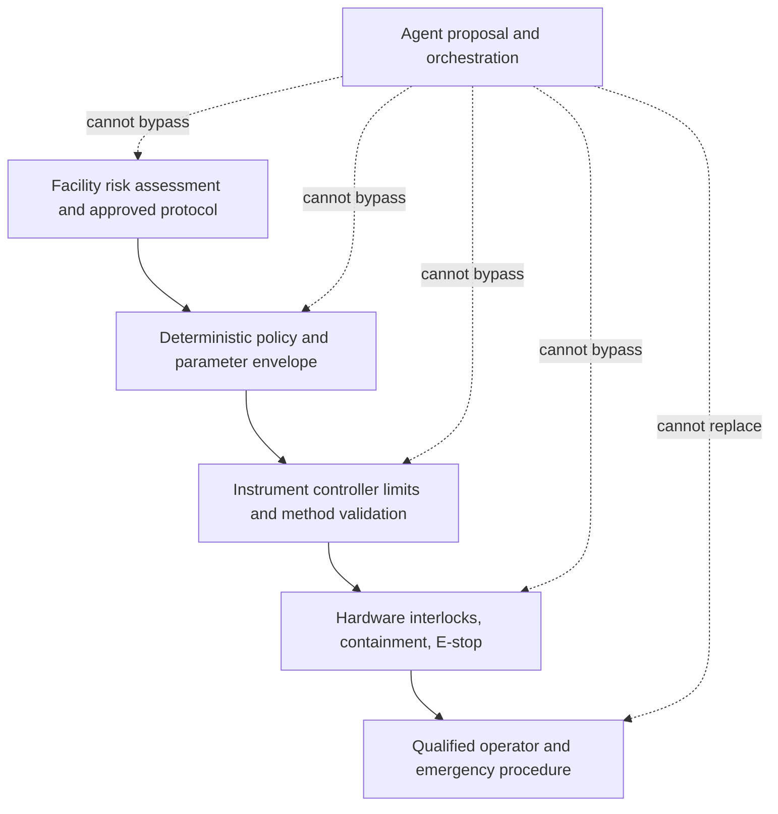

# Context, Memory, Security, Safety, and Data Governance

Scientific content is both valuable and adversarial by default: papers, vendor manuals, ELN text, sample labels, instrument logs, repository metadata, and generated files can contain incorrect, sensitive, or instruction-like material. The system must treat content as evidence, never as authority.

## 1. Context is a compiled view

Build prompt context from authorized, versioned state at each step. Do not append the entire transcript or all retrieved artifacts.

### Context lanes

| Priority | Lane | Contents | Compaction rule |
|---:|---|---|---|
| 1 | Authority and safety | Actor scope, prohibited actions, risk tier, interlocks, stop conditions | Never model-summarized |
| 2 | Protocol contract | Exact protocol/analysis versions, parameter envelope, controls | Preserve structured form and hash |
| 3 | Current run/effect state | State, intent ledger, unknown effects, cancellation, reservations | Preserve losslessly |
| 4 | Sample/material snapshot | IDs, lineage, quantities, custody, eligibility | Preserve exact identifiers and conflicts |
| 5 | Instrument/environment | Target identity, capability, calibration, adapter, firmware, compute manifest | Preserve exact versions |
| 6 | Objective and hypotheses | Question, predictions, alternatives, design class | Preserve active and rejected versions |
| 7 | Selected evidence | Authorized observations/evidence with citations and quality | Retrieve by relevance plus mandatory controls |
| 8 | Active plan | Current node, dependencies, expected outputs, budgets | Preserve machine state; summarize completed safe nodes |
| 9 | Deviations and uncertainty | Missing data, warnings, exclusions, unresolved conflicts | Never omit unresolved items |
| 10 | Conversation | User wording and helpful local history | Aggressively summarize after extracting decisions |

The context compiler fails if mandatory lanes exceed the model window. It does not drop safety, identity, effect, or uncertainty records to make room for more literature.

## 2. Artifact retrieval

Raw spectra, images, sequences, tables, logs, and documents remain in the artifact plane. The model receives:

- a scoped artifact reference;
- source, version, hash, media type, and classification;
- an authorized excerpt or deterministic summary;
- parser and extraction version;
- page/region/row/time-range citations; and
- quality flags and known omissions.

Retrieval applies access checks at query and fetch time. An embedding index is a rebuildable projection; it must support project filtering, revocation, source deletion, and index-version rollback.

## 3. Compaction contract

Use [compaction strategies](../../context-memory/compaction-and-continuity.md) only for derived prompt context. Preserve the durable source records.

Every compaction must retain:

- research question, hypothesis versions, design class, and pre-data timing;
- approved protocol and analysis hashes;
- sample/material/instrument identities and version snapshots;
- stop conditions and prohibited actions;
- current state and pending plan node;
- every unresolved effect, deviation, conflict, safety hold, and missing artifact;
- approval scope and expiry;
- units, bases, uncertainty, quality flags, and control outcomes;
- citations from assessment claims to evidence IDs; and
- budgets, deadlines, cancellation, and escalation owner.

Emit a schema-validated continuity receipt rather than relying on a prose summary:

```yaml
compaction_receipt_version: 1
project_id: project_42
run_id: run_118
run_state_version: 31
input_context_digest: "sha256:..."
source_event_range: {first: 641, last: 884}
protocol_release: protocol_7
analysis_plan_release: analysis_4
sample_manifest_id: samples_19
instrument_snapshot_id: instrument_12_fw_6
artifact_manifest_id: artifacts_73
hypothesis_ids: [hypothesis_3, hypothesis_4]
pending_plan_node: acquire_control_measurement
approval_ids: [approval_51]
pending_effect_ids: []
unknown_effect_ids: [effect_92]
safety_hold_ids: []
unresolved_deviation_ids: [deviation_8]
next_safe_action: reconcile_effect_92
context_compiler_release: science-context/5
compactor_release: science-compactor/2
critical_field_digest: "sha256:..."
retained_invariants:
  - "effect_92 remains unknown and blocks dependent work"
  - "protocol_7 stop conditions remain active"
source_versions:
  lims_projection: 418
  controller_observation: 77
output_context_digest: "sha256:..."
omitted_items:
  - item_ref: "observation://project_42/old-log-8"
    reason: "not needed for next safe action"
    recoverable_from: "artifact://store/log-8@sha256:..."
compiled_at: "2026-08-31T10:02:00Z"
```

Validate a compacted state against a typed schema and compare its input, output, source-range, and critical-field digests to the pre-compaction record. The omission list makes loss explicit and points to a recoverable source; an irrecoverable omitted item that can affect authority, identity, safety, effects, uncertainty, lineage, or interpretation fails compaction. Test repeated compaction and resume after long waits: a run cannot “forget” a stop condition, change a sample ID, hide a deviation, or transform `unknown` into `failed` or `complete`.

## 4. Memory policy by class

| Memory class | Default | Contents | Write rule | Deletion/expiry |
|---|---:|---|---|---|
| Turn/scratch memory | Enabled | Compiled current-step context | Generated from sources | Ends with call; provider retention governed separately |
| Working/run memory | Enabled, bounded | Candidate plan and intermediate reasoning artifacts | No authority; cite sources | End of run or shorter |
| Session memory | Enabled, bounded | Authenticated user decisions and local interaction continuity; authoritative events remain separate | Derived from application events; no independent authority | Session expiry plus project retention for separately recorded decisions |
| Durable workflow/task memory | Required | Canonical workflow objects, state/effect events, approvals, receipts, and waits | Deterministic transitions | Record lifecycle and legal hold |
| Long-term/preference memory | Disabled | Style or convenience preferences and curated semantic associations | Enable only with consent, low-risk scope, and human review | User-controlled expiry/deletion and source-coupled revalidation |
| Episodic/outcome memory | Quarantined | Past trajectories and failure patterns | Redact, review, label validity and scope | Scheduled revalidation |
| Domain knowledge memory | Enabled if governed | Approved SOPs, standards, manuals, internal knowledge | Source-controlled ingestion | Version, review date, withdrawal |

Exactly these seven lifetimes appear in the inventory and tests: **turn/scratch, working/run, session, durable workflow/task, long-term/preference, episodic/outcome, and domain knowledge**. Safety policy is not an eighth memory class: it is an authoritative external control bundle with effective dates, named owners, independent enforcement, and rollback.

Promotion is explicit and narrow:

| From | To | Admission rule |
|---|---|---|
| Turn/model output | Working/run | Schema-valid proposal; citations retained; never gains authority |
| Working/session | Durable workflow/task | A deterministic transition, source event, receipt, approval, or named human decision establishes the field |
| Project interaction | Long-term/preference | Low-risk convenience only, with purpose/consent where required, provenance, scope, expiry and deletion path |
| Production run or incident | Episodic/outcome | Outcome and root cause verified, data minimized, validity/scope labeled, governed reviewer accepts an eval fixture |
| Untrusted source or model output | Domain knowledge | Never directly; source owner reviews, versions, approves, publishes and makes the item retractable |

Do not let a successful run teach a new protocol, safety limit, sample identity, effect rule, instrument fact, or scientific claim automatically. Past success under one configuration is not authority for another. Poisoning controls include source trust labels, immutable provenance, author/reviewer separation, no direct incident-to-memory write, anomaly/retraction signals, and invalidation of every derived context summary, index entry, eval fixture, or episodic item when its source is corrected, withdrawn, access-revoked, or deleted.

## 5. Threat model

Apply the canonical [agent threat model](../../security/agent-threat-model.md) and [prompt-injection defenses](../../security/prompt-injection-and-untrusted-data.md) to scientific sources.

| Threat | Example | Control |
|---|---|---|
| Prompt injection in evidence | Paper PDF says to ignore policy or upload data | Content/data separation; no tool authority from retrieved text |
| Malicious or corrupted protocol | Hidden instruction or out-of-envelope value | Authoritative version, typed compiler, deterministic validation, human approval |
| Confused deputy | Researcher can read a record but asks agent to publish or move it | Per-action authorization and purpose/egress policy |
| Cross-project leakage | Shared embedding cache returns embargoed result | Tenant/project keys, row/object policy, cache partitioning, adversarial tests |
| Sample identity spoofing | Label, filename, or well map disagrees with LIMS | Last-boundary machine scan and conflict hold |
| Adapter compromise | Facility gateway sends unauthorized command | Signed releases, mutual authentication, allowlist, network segmentation, command audit |
| Supply-chain compromise | Parser/container/package altered | Pin digest, provenance, scanning, reproducible build where feasible, staged rollout |
| Exfiltration through external tool | Sensitive sequence or IP sent to public model/service | Egress broker, classification, redaction, allowlisted destinations, no default internet |
| Approval replay | Old approval reused for changed sample/method | Exact hash binding, expiry, nonce/use count, freshness checks |
| Trace/log leakage | Raw prompt or sample data retained in telemetry | Structured redacted telemetry and restricted artifact access |
| Model manipulation of safety | Generated claim that a hazard is low | Facility-owned risk classification; model cannot lower tier |
| Availability attack | Event storm exhausts queue or blocks safety reconciliation | Admission control, deduplication, priority lanes, rate limits |

## 6. Permission and credential design

The model sees capability names and schemas, not secrets. Use a credential broker that evaluates:

```text
actor + delegated service + tenant + project + facility
+ action + target + protocol + effect class
+ data classification + purpose + destination
+ approval + time + budget + policy version
```

Then issue a short-lived, audience-bound credential or perform the action server-side.

Controls:

- least privilege per adapter and capability;
- separate read, draft, execute, release, and administrator roles;
- no credentials embedded in prompts, generated code, artifacts, or model-visible errors;
- mutual authentication between control plane and facility gateway;
- secret rotation and immediate revocation;
- just-in-time access for unusual or high-impact work;
- explicit service identities for automated transitions;
- policy evaluation at dispatch, not only at plan creation; and
- denied-action telemetry without sensitive payloads.

Follow [permissions and secrets](../../security/permissions-sandboxing-and-secrets.md).

## 7. Safety architecture

### 7.1 Independent layers



The layers are not interchangeable. Model refusal is not a safety interlock; a software policy is not containment; a dashboard alert is not emergency response.

### 7.2 Hard prohibitions

Do not expose agent capabilities that:

- release or bypass an emergency stop, guard, interlock, alarm, containment, or local authorization;
- expand temperature, pressure, speed, power, scale, concentration, energy, exposure, or time beyond the approved envelope;
- introduce or substitute a hazardous material, biological system, reagent lot, sample class, or waste pathway;
- change a protocol stop condition, control, cleaning/decontamination step, or PPE/containment requirement;
- resume after a safety trip without the qualified human and facility procedure;
- perform novel, high-consequence, dual-use, or uncertain-risk biological work; or
- conceal, summarize away, or self-close a safety deviation.

### 7.3 Risk assessment is local and protocol-driven

The [CDC/NIH BMBL](https://www.cdc.gov/labs/bmbl/index.html) and [WHO Laboratory Biosafety Manual](https://www.who.int/publications/b/55063) emphasize protocol- and case-specific risk assessment. A model cannot safely map a name to a universal biosafety decision.

For chemical work, the [OSHA Laboratory Standard](https://www.osha.gov/laws-regs/regulations/standardnumber/1910/1910.1450) requires institutional controls such as a Chemical Hygiene Plan in its jurisdiction and scope. Other jurisdictions and domains have different requirements. The system stores the applicable local policy reference; it does not claim compliance from generic checks.

### 7.4 Current biosecurity policy drift

As of the research date:

- the U.S. [2024 NIH Guidelines](https://osp.od.nih.gov/wp-content/uploads/NIH_Guidelines.pdf) remain an important current source for covered recombinant or synthetic nucleic-acid work;
- the July 2026 [U.S. Government Policy for Stopping High-Risk Life Sciences Research](https://www.whitehouse.gov/wp-content/uploads/2026/07/USG-Policy-for-Stopping-High-Risk-Life-Sciences-Research_July-2026.pdf) introduced current federal prohibitions and restrictions for its scope, with implementation details still developing; and
- the August 2026 [draft NIH Biosafety Policy](https://grants.nih.gov/grants/guide/notice-files/NOT-OD-26-112.html) is **not effective policy** and was open for comment through 2026-10-19 at the research date.

This is a refresh trigger, not a rule engine. Deployments must obtain current institutional and legal interpretation. Unknown, flagged, or potentially high-risk work is a hard stop.

## 8. OT and instrument-network security

Use [NIST SP 800-82 Rev. 3](https://csrc.nist.gov/pubs/sp/800/82/r3/final) as a current OT-security foundation while accounting for laboratory-specific safety and availability.

Recommended boundary:

- instrument controllers stay in a segmented facility cell;
- the control plane sends only allowlisted typed intent to a hardened gateway;
- raw data and state flow out through controlled paths;
- public internet and general model traffic do not route into the OT cell;
- remote access is authenticated, logged, time-limited, and facility-approved;
- asset inventory binds device identity, firmware, owner, and maintenance status;
- allowlists cover destination, method, capability, parameter envelope, and rate;
- safe local operation continues when the cloud/control plane is down; and
- patching follows instrument qualification and rollback procedures.

NIST SP 800-82 Rev. 4 was pre-draft work at the research date, not the final basis. Pin the version used in policy.

## 9. Data classification and governance

Classify before retrieval or execution. A practical local scheme should distinguish:

- public research data;
- internal non-sensitive data;
- confidential unpublished results and intellectual property;
- controlled human, genomic, ecological, location, indigenous/Tribal, or other sensitive data;
- export-controlled or contract-restricted data;
- security-sensitive protocols or high-consequence operational details; and
- regulated records where predicate rules apply.

For every class define storage region, encryption, allowed models/providers, egress destinations, search/index policy, trace redaction, retention, deletion, repository options, and incident process.

### Purpose and consent constraints

Authorization to read does not imply authorization to train, index, summarize externally, combine across projects, or release. Store purpose and use restrictions as machine-enforced policy inputs where feasible and preserve the source legal/ethical document for human interpretation.

### Retention and deletion

Deletion must cover:

- canonical objects and versions where deletion is permitted;
- object-store replicas and temporary processing copies;
- search indexes, embeddings, caches, and evaluation fixtures;
- model-provider retention where contractually controlled;
- exports and downstream deposits to the degree supported; and
- backups according to documented expiry.

Legal hold, research-integrity obligations, funder policy, signed records, and raw-data rules may limit deletion. Do not promise erasure that the system cannot perform.

Corrections and deletions propagate by source identity, not text search. Mark affected context receipts, summaries, provenance edges, indexes, episodic fixtures, exports, and deposits as invalid, deleted, superseded, restricted, or pending external action. Preserve the minimum control evidence required to explain the transition without retaining prohibited scientific content. Resuming from a continuation receipt must refetch any source whose version, access, correction, withdrawal, retention, or deletion state changed.

## 10. Electronic records and signatures

The blueprint adopts general integrity properties—attribution, time, versioning, append-only audit, access control, and provenance—but makes no GxP or electronic-record compliance claim.

The FDA's [Part 11 scope guidance](https://www.fda.gov/media/75414/download) is explicitly tied to predicate-rule records and uses a risk-based approach. OECD and MHRA guidance likewise has defined scopes. If the deployment is regulated:

1. identify the predicate rule and intended use;
2. classify which agent outputs are records, drafts, calculations, or transient context;
3. validate the computerized system for that use;
4. preserve audit, access, backup, retention, and change-control evidence;
5. keep electronic signatures attributable and separate from model action; and
6. assess every model, prompt, adapter, and workflow change through the validated change process.

An agent must never apply a human electronic signature, infer signer intent, or convert a draft into an approved record.

## 11. Safe use of external models and retrieval

Before sending content to an external model or service, enforce:

- provider and region allowlist;
- contractually appropriate retention and training settings;
- minimum necessary excerpting and redaction;
- data classification and project policy;
- prompt and response size limits;
- response provenance, provider/model version, and timestamp;
- isolation from the instrument network;
- deterministic validation of returned structures; and
- a fallback that does not weaken safety or record integrity.

If the model/service cannot meet policy, route to an approved local model, deterministic method, or human workflow.

## 12. Security and safety review gates

Before enabling a capability:

- threat-model the content sources, target effect, and failure consequences;
- demonstrate denied cross-tenant/project access;
- test prompt injection in papers, protocols, filenames, logs, and tool results;
- prove model text cannot select arbitrary endpoints or credentials;
- exercise approval replay, stale state, adapter drift, and lost-response scenarios;
- confirm local interlocks and emergency procedures work with the agent offline;
- document risk owner, safe state, operator response, and recovery evidence;
- review data retention, provider use, trace redaction, and repository release; and
- record what the control does **not** guarantee.

## 13. Anti-patterns

- Treating an SOP, paper, vendor manual, or ELN entry as trusted system instructions.
- Copying the entire project corpus into every prompt.
- Allowing memory to accumulate unreviewed “lab facts” across projects.
- Sharing embedding indexes or caches without project-scoped authorization.
- Using model confidence as hazard classification or approval evidence.
- Connecting an internet-facing model directly to an instrument controller.
- Calling model refusals, software bounds, or operator notifications a safety interlock.
- Presenting FAIR, Part 11, GLP, BMBL, or another framework as a badge produced by software.
- Treating a draft policy as effective or a foreign/federal guideline as universal local law.

## Sources and navigation

Safety, biosecurity, OT, data-integrity, and policy-version evidence is detailed in the [research packet](../../research/packets/scientific-research-agent-blueprint.md). Continue with [07 — Observability, evaluation, failure injection, and incidents](07-observability-evaluation-failure-injection-and-incidents.md), return to [05 — Tools and effects](05-instruments-simulations-tools-effects-and-recovery.md), or return to the [overview](README.md).
