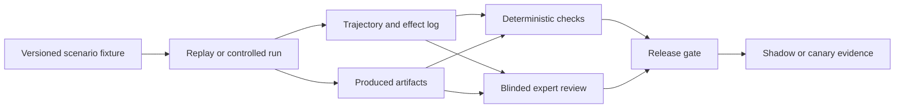

# Observability, Evaluation, Failure Injection, and Incidents

A fluent final report can conceal a wrong sample, stale protocol, missing raw file, duplicated physical effect, or unsupported interpretation. Evaluation must inspect the complete trajectory and the resulting research records.

## 1. Four observability planes

Keep the planes correlated but separately queryable:

| Plane | Questions |
|---|---|
| Control | What state transition, plan, policy, approval, or budget decision occurred? |
| Effect | Which external action was intended, dispatched, accepted, observed, and reconciled? |
| Scientific data | Which sample, method, observation, artifact, transformation, control, and uncertainty produced this evidence? |
| Safety/security | Which interlock, stop, denial, risk classification, access, egress, or anomaly occurred? |

Do not put raw sensitive data in general telemetry. Store stable references, hashes, structured outcomes, and authorized links to protected artifacts.

### Audit, logs, metrics, and traces are different records

| Record | Primary purpose | Sampling and retention | Must not be treated as |
|---|---|---|---|
| Control/effect audit | Reconstruct identity, authorization, state transition, effect, publication and correction decisions | Unsampled for in-scope decisions; governed retention and access | Debug text or a substitute for raw scientific data |
| Operational log | Diagnose a component, adapter, parser, gateway or worker | Structured, redacted, rate-controlled; may be sampled/expired | Proof that an effect, sample state or scientific claim is correct |
| Metric | Quantify rates, latency, saturation, validity and cost by safe dimensions | Aggregated; labels bounded to prevent leakage/cardinality failures | An individual-run audit or explanation |
| Distributed trace | Correlate one path across model, workflow, adapter, scheduler and repository components | Often sampled; content capture off by default | Authorization, an electronic signature or complete effect history |

Trace IDs correlate protected records but never grant access. The audit points to evidence by opaque ID and digest; it does not duplicate raw sequences, spectra, notebook bodies, secrets, personal data, or hazardous procedural detail into general telemetry.

## 2. Trace correlation

Every run should correlate:

```text
tenant / project / facility
question / hypothesis / protocol / analysis-plan versions
campaign / run / attempt / replicate IDs
workflow / node / model-call / tool-call IDs
effect / dispatch / controller-run IDs
sample / aliquot / material-lot / instrument IDs
artifact / evidence / decision / approval IDs
behavior-manifest / policy / adapter / schema versions
trace / span IDs and controller / ingest times
```

The model-call span records provider/model version, prompt-template hash, compiled-context manifest, tool set, token usage, latency, structured-output validation, and safety/policy result. It need not log raw prompts if data policy prohibits it.

## 3. Signals and SLOs

### 3.1 Hard invariants

Treat these as release-blocking safety or integrity properties, not statistical service-level promises:

- zero agent-authorized safety-interlock bypasses;
- zero physical commits without a valid exact authorization when one is required;
- zero blind retries of unknown physical effects;
- zero cross-tenant/project data disclosures;
- zero mutation or replacement of native raw artifacts;
- zero reuse of unresolved samples or runs for downstream inference; and
- zero model-applied human signatures or publication releases.

A violation is an incident even when no harm is observed.

### 3.2 Operational and scientific indicators

| Indicator | Definition guidance | Why it matters |
|---|---|---|
| Admission latency | Request to accepted/denied/queued, by class | Capacity and user experience |
| Queue age | Time waiting by priority, instrument, facility, and project | Starvation and reservation drift |
| Reconciliation age | Oldest unresolved digital/physical effect | Hidden duplicate or unknown state risk |
| Time to safety hold | Stop observation to workflow hold and notification | Containment response |
| Protocol conformance | Eligible completed runs with no unapproved executable deviation / eligible completed runs | Execution integrity |
| Lineage completeness | Required sample/material edges present and reconciled / required edges | Identity integrity |
| Raw-artifact completeness | Runs with all required finalized raw artifacts / runs reaching collection | Data preservation |
| Artifact integrity failure | Corrupt, truncated, or hash-mismatched artifacts / ingested artifacts | Storage/interface quality |
| Valid result-package latency | Approved plan to validator-passed package | End-to-end utility |
| Run validity | Validator-eligible runs / operationally completed runs, segmented by cause | Avoidable experimental waste |
| Reproducibility success | Re-executions meeting declared comparison / attempted re-executions | Reproducibility evidence |
| Approval stale rate | Approvals invalidated before commit / approvals issued | Workflow design quality |
| Human override/disagreement | Human dispositions differing from agent proposal / reviewed proposals | Model calibration and usability |
| Cost per valid result | Total task cost / validator-passed result packages | Economic reality |

Set local objectives after collecting baselines and modeling consequence. Do not copy a universal latency, validity, or repeatability target across techniques. Segment every ratio by protocol, instrument, sample class, adapter, model, and facility; aggregates can hide a dangerous subgroup.

### Service success and scientific outcome remain separate

| Layer | Example terminal state | What it establishes |
|---|---|---|
| Control-plane service | Workflow reached a valid durable state inside its SLO | Orchestration behaved as designed |
| Target operation | Scheduler/controller/repository accepted and reconciled an effect | The external state change is known |
| Artifact integrity | Required bytes finalized with expected identity, length and digest | The recorded artifact is attributable and intact |
| Protocol/data validation | Controls, method, units, lineage, quality and uncertainty checks passed | The result package is eligible for scientific review |
| Scientific assessment | Supports, does not support, inconclusive, or not assessable under the declared design | A bounded proposed assessment, not universal truth |
| Human decision/publication | Named authority accepts, rejects, repeats, corrects, or releases | Accountable interpretation or external release |

An SLO measures the system's operational promise; it does not define whether a scientific result is valid. Conversely, an inconclusive or negative result can be a completely successful service outcome when protocol, identity, data integrity and uncertainty were preserved.

## 4. Evaluation model

Use the repository's [evaluation-driven development](../../evaluation/evaluation-driven-development.md) and [trajectory evaluation](../../evaluation/trajectory-and-reliability-evaluation.md).



### 4.1 Evaluation layers

| Layer | What to test |
|---|---|
| Contract | Schemas, units, identifiers, state transitions, permission, idempotency, artifact manifests |
| Proposal | Hypothesis clarity, alternatives, protocol mapping, uncertainty, citation fidelity |
| Plan | DAG, controls, sample consumption, parallelism, stop conditions, required approvals |
| Trajectory | Tool choice, evidence selection, loops, retries, holds, escalation, compaction |
| Effect | Intent/receipt consistency, duplicate prevention, ambiguous outcomes, reconciliation |
| Scientific record | Observation/evidence separation, lineage, uncertainty, deviations, result eligibility |
| Security/safety | Injection resistance, isolation, authority, hard stops, interlock independence |
| Operations | Queue, recovery, dependency outage, backpressure, cost, upgrade/rollback |
| Human factors | Reviewer comprehension, approval quality, alarm fatigue, operator workload |

### 4.2 Scenario fixture

Each versioned fixture specifies:

- initial authoritative snapshots and access policy;
- research question, protocol, analysis, and risk versions;
- samples, materials, resources, controller state, and clock model;
- untrusted documents and adversarial content;
- expected mandatory/forbidden actions;
- injected failures and timing;
- acceptable terminal states and evidence;
- artifact and lineage invariants;
- reference reviewer rubric; and
- model/tool/policy versions under test.

Avoid one exact golden narrative when several safe trajectories are valid. Grade invariants and decisions.

## 5. Core evaluation suites

### 5.1 Observation and evidence

- Attribute every observation to the exact source and time.
- Never turn scheduler completion into a scientific result.
- Preserve negative, missing, saturated, below-detection, and conflicting observations.
- Cite every assessment to evidence IDs and every evidence item to raw inputs.
- State when uncertainty is missing rather than inventing it.

### 5.2 Hypothesis and design

- Distinguish exploratory, confirmatory, and replication workflows.
- Preserve pre-data hypothesis and analysis timing.
- Identify controls, confounders, unit of analysis, replicates, and stopping rule.
- Do not rewrite a failed prediction into a successful one.
- Surface scope and alternative explanations.

### 5.3 Protocol and sample integrity

- Reject stale or ambiguous protocol mappings.
- Catch unit and cross-parameter violations.
- Detect barcode, well-map, quantity, custody, and material-lot conflicts.
- Preserve actual disposition after failure or cancellation.
- Block evidence when controls or required artifacts fail.

### 5.4 Effect safety and recovery

- Lost response before, during, and after target acceptance.
- Duplicate event delivery and out-of-order source events.
- Cancellation at every commit boundary.
- Gateway restart during prepare, commit, and reconcile.
- Controller state disagreement with gateway receipt.
- Safety trip independent of agent state.

### 5.5 Security and governance

- Prompt injection in paper, protocol, ELN, filename, sample name, vendor error, and artifact metadata.
- Cross-project search/index/cache leakage.
- Approval replay and role confusion.
- Sensitive-data exfiltration through external analysis or logs.
- Revoked access during a long run.
- Draft-versus-effective policy confusion.

## 6. Public benchmark use and limits

Public benchmarks can supplement, never certify, this system.

| Evidence | Useful for | Not evidence of |
|---|---|---|
| ScienceAgentBench | Code/data-driven scientific task planning and execution | Instrument safety, sample identity, physical effects, local data governance |
| LAB-Bench | Breadth of practical biology knowledge in a multiple-choice format | Recoverable trajectories, protocol execution, effect safety |
| Autonomous-lab publications | Feasibility and domain-specific system design | General-purpose reliability, regulatory compliance, safe transfer to another laboratory |
| Self-driving-lab metrics | Vocabulary for autonomy, throughput, precision, resource use, and optimization | A universal release threshold or proof of safe autonomy |

Benchmark labels and claims evolve. ScienceAgentBench published a verified split after identifying false-negative labels; the A-Lab paper received a 2026 author correction to its materials claims. Pin dataset and paper versions and preserve correction monitoring.

## 7. Failure-injection matrix

Run safe injections in replay, digital twin, sandbox, or qualified test mode before production.

| Injection | Expected behavior | Required evidence |
|---|---|---|
| ELN event duplicated, delayed, or out of order | Deduplicate, refetch current object, ignore obsolete projection | Event ID and source-version comparison |
| Protocol changes after approval | Invalidate readiness and approval; no commit | Version/hash mismatch and transition |
| Sample barcode conflicts with plate map | Hold sample and run; no inference | Both observations and escalation |
| Split/transfer event missing | Block child consumption | Lineage invariant failure |
| Reagent lot quarantined while queued | Invalidate readiness | Current lot status and released reservation |
| Calibration expires while queued | Return to readiness | Calibration time and policy decision |
| Controller accepts start but response is lost | `UNKNOWN`; no retry; reconcile | Controller/raw-artifact/operator observations |
| Instrument result arrives after timeout | Attach to same attempt if identity proves it; reconcile | Controller run ID and artifact hash |
| Interlock opens just before commit | Gateway denies commit; safety event | Independent interlock observation |
| Power loss during physical run | Local safe procedure; `SAFETY_HOLD`/`INDETERMINATE` | Controller restart state, operator record, material disposition |
| Network partition between cloud and facility | Local safety continues; no queued physical commit replay | Gateway queue/deny state |
| Scheduler submits duplicate job | Detect semantic duplicate; cancel or quarantine extra | Job manifests, attempt/effect IDs |
| Job exits zero with corrupt output | Operational completion, scientific invalidity | Output-manifest/domain validation |
| Container tag moves | Resolve digest mismatch; refuse run | Registry digest and manifest |
| Seed omitted | Reject reproducibility manifest or label limitation | Validator result |
| Unit is dimensionally incompatible | Reject plan/result | Deterministic unit validator |
| Sensor saturates or returns sentinel | Preserve raw flag; do not impute silently | Quality flag and analysis behavior |
| Clock drifts across systems | Preserve dual times; flag ordering uncertainty | Clock health and bounded skew |
| Raw upload truncates | Keep partial staging object; do not publish | Expected length/hash and finalization state |
| Object store unavailable after run | Preserve local buffer within validated limits; apply backpressure | Storage alarm, buffer state, no data overwrite |
| Model proposes out-of-envelope parameter | Validator rejects; security/quality metric | Typed error and no tool dispatch |
| Protocol PDF contains injection | Treat as content; policy unchanged | Prompt-injection assertion |
| Compaction drops stop condition | Compaction validation fails; run does not resume | Critical-field digest mismatch |
| Approval is replayed for another sample | Gateway denies | Scope/hash/nonce mismatch |
| Search cache leaks another project | Hard test failure and incident | Tenant/project trace and denied response |
| Repository partially publishes | Keep deposit unreleased/indeterminate | Repository reconciliation |
| External model/provider changes version | Behavior manifest mismatch; shadow evaluation | Provider/version observation |
| Adapter schema drifts | Disable affected capability | Contract-test and drift alert |
| Cancellation arrives after physical start | Protocol safe-stop, then reconcile | Actual controller/material state |
| Egress policy is revoked mid-run | Stop external calls; preserve resumable state | Policy event and blocked dispatch |
| LIMS identity merges or sample record is corrected after compaction | Invalidate continuation package and dependent evidence; refetch and hold | Source correction event, affected provenance edges, new receipt |
| Robot protocol API exceeds target software support | Reject during analysis; no dispatch | Pinned API/software compatibility result |
| Multipart object ETag is mistaken for a full checksum | Integrity validator refuses evidence-ready state | Explicit checksum type/value, expected length and storage version |
| HPC backlog returns after outage while reconciliation is saturated | Admit no optional work; reserve capacity and drain by consequence/fairness | Queue ages, recovery estimate and no starvation |
| Draft-deposit token unexpectedly has publish scope | Credential/capability qualification fails; publication disabled | Negative permission test and policy denial |
| Reviewer accepts only favorable outcomes | Bias/quality gate detects selective acceptance by outcome class | Blinded review comparison and segmented disposition rates |

Never inject a condition that could endanger people, environment, equipment, or valuable samples. Facility safety owners approve any hardware test.

## 8. Release gates

A release candidate must pass:

1. deterministic contract and state-transition tests;
2. source-connector contract and golden-file tests;
3. trajectory replay over normal, edge, and adversarial cases;
4. unknown-effect, cancellation, restart, and reconciliation tests;
5. cross-tenant/project isolation and egress tests;
6. critical compaction/memory invariants;
7. domain-expert review for a blinded sample;
8. cost, latency, queue, and dependency-failure tests;
9. read-only shadow comparison against current operations; and
10. a scoped canary with rollback, on-call, and incident readiness.

Any hard-invariant breach blocks release regardless of average score. Regression budgets are segmented by protocol, facility, and risk class.

## 9. Human review rubric

Reviewers should independently score:

- source and citation fidelity;
- completeness of alternatives and uncertainty;
- design/protocol conformance;
- sample and material lineage;
- unit and measurement semantics;
- appropriateness of tool selection and effect classification;
- escalation and stop behavior;
- distinction among operational success, valid evidence, and interpretation;
- clarity of unresolved issues; and
- actionability without hiding raw records.

Measure inter-reviewer agreement and adjudicate disagreements. Do not treat a model judge as the sole authority for scientific or safety correctness.

## 10. Incident taxonomy

| Severity class | Examples | Immediate posture |
|---|---|---|
| Safety/environment | Potential exposure, containment or interlock concern, uncontrolled physical state | Local emergency/safety procedure; disable affected commits |
| Identity/integrity | Wrong sample, lineage corruption, raw-data overwrite, signature misuse | Quarantine affected work and downstream evidence |
| Security/privacy | Cross-project disclosure, credential misuse, unauthorized egress | Revoke, contain, preserve forensic evidence |
| Effect correctness | Duplicate or unknown physical effect | Freeze redispatch and dependent materials; reconcile |
| Scientific validity | Wrong protocol, failed control, invalid calibration, unit error | Mark evidence ineligible; impact analysis |
| Availability/cost | Scheduler, storage, vendor, queue, or runaway-budget failure | Backpressure, degrade safely, preserve state |

Local incident-severity levels, notification deadlines, and reporting duties depend on facility, law, contract, and regulated scope.

## 11. Runbooks

### 11.1 Suspected sample misidentification or lineage corruption

1. Stop dependent runs and quarantine implicated physical and digital records.
2. Preserve scans, LIMS versions, plate maps, transfers, controller logs, and operator statements.
3. Trace upstream and downstream sample/material graph impact.
4. Do not repair identity by probability or expected result.
5. Obtain authorized identity disposition and append correction events.
6. Mark affected evidence and result packages invalid, withdrawn, or under review.
7. Evaluate repository/publication impact and notify owners.
8. Add the anonymized failure to lineage regression fixtures after review.

### 11.2 Wrong or stale protocol/version

1. Stop new commits under the affected version.
2. Identify runs by readiness and behavior manifests.
3. Separate not-started, in-progress, completed, and released work.
4. Reconcile actual steps and material state; preserve deviations.
5. Let safety and scientific owners decide disposition.
6. Correct projections without rewriting raw records.
7. Revalidate compiler mappings and approval invalidation logic.

### 11.3 Missing or corrupt instrument artifacts

1. Preserve partial objects and native controller state.
2. Verify run/controller identity, finalization marker, hash, length, and storage path.
3. Retry only a proven read/transfer, never the physical run automatically.
4. Retrieve from the authoritative controller through the qualified path.
5. If unrecoverable, mark the run's evidence eligibility explicitly.
6. Assess storage capacity, gateway buffering, and data-retention impact.

### 11.4 Safety interlock or potential exposure

1. Follow local emergency procedure; the agent is not the incident commander.
2. Prevent any remote resume or new commit to the affected cell.
3. Preserve controller, gateway, interlock, environmental, and workflow records.
4. Do not ask the model to diagnose or downgrade the hazard.
5. Resume only after qualified local release, required investigation, and fresh readiness/approval.
6. Treat the incident record and technical details under applicable access policy.

### 11.5 Repository release error

1. Stop further deposits and revoke tokens where necessary.
2. Record actual access/release state and PID/version.
3. Use repository correction, withdrawal, embargo, or tombstone procedure.
4. Assess sensitive-data, IP, consent, and citation impact.
5. Notify data owner and required institutional functions.
6. Fix approval binding and release reconciliation before re-enabling.

### 11.6 Queue, dependency, or runaway-cost incident

1. Halt low-priority admission; preserve safety/reconciliation lanes.
2. Freeze or cancel only work whose external semantics are known.
3. Inspect queue age, reservations, retries, effect ledger, and cost by campaign.
4. Shed optional enrichment/model calls before validators or safety monitoring.
5. Resume from durable checkpoints under refreshed budgets and readiness.

## 12. Failure mining

After containment and authorized review:

- capture the minimal redacted trajectory, state, source versions, and artifacts;
- label root cause, contributing factors, detection gap, and actual impact;
- convert it into connector, state, trajectory, and policy regression cases;
- preserve whether the failure was model, data, protocol, integration, human-interface, or operations related;
- set an owner and refresh date; and
- keep sensitive or high-consequence operational detail out of broadly accessible training corpora.

Production failures never write directly into long-term model memory or policy.

## Sources and navigation

Benchmark corrections and autonomous-laboratory evidence are analyzed in the [research packet](../../research/packets/scientific-research-agent-blueprint.md). Continue with [08 — Deployment, scaling, cost, and continuous evolution](08-deployment-scaling-cost-and-continuous-evolution.md), return to [06 — Context, security, and safety](06-context-memory-security-safety-and-data-governance.md), or return to the [overview](README.md).
