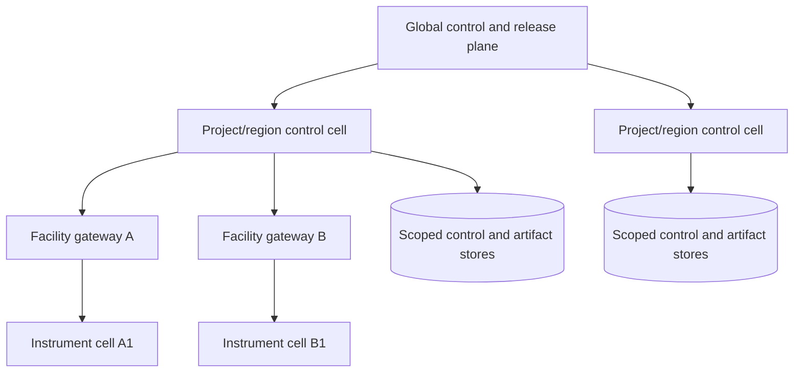

# Deployment, Scaling, Cost, and Continuous Evolution

Production maturity is the ability to preserve authority, safety, identity, and recoverability under load, outage, change, and organizational complexity. It is not the number of instruments or models connected.

## 1. Deployment evolution

| Maturity | Recommended shape | Avoid |
|---|---|---|
| Retrospective prototype | Local or isolated service, read-only exports, versioned fixtures | Live credentials and instrument writes |
| Bounded MVP | One project, modular control plane, relational store, object storage, sandbox compute | Premature service split |
| Reliable v1 | Durable workflows, adapter gateway, effect ledger, approval UI, observability | Prompt transcript as state |
| Production facility | Segregated facility gateway, policy service, HA control/data stores, on-call | Direct cloud-to-instrument traffic |
| Multi-project scale | Project/tenant policy, fair queues, cell isolation, centralized release controls | Shared unscoped caches/indexes |
| Multi-facility evolution | Facility cells, version compatibility matrix, region/data-residency policy | One universal instrument model |

The smallest production-capable design may still be one well-structured application plus a site gateway. Split for a real isolation, scaling, validation, or ownership need.

## 2. Cell-based topology



Use cells to limit blast radius and satisfy data residency or facility ownership. The global plane may distribute signed behavior/policy releases and aggregate redacted health metrics. It should not hold universal credentials or bypass local facility policy.

## 3. Tenancy and isolation

Define explicit scopes:

- organization or tenant;
- research project/program;
- facility/site;
- instrument cell;
- data classification and residency;
- protocol/risk class; and
- user/service role.

Isolation applies to database rows, object prefixes/buckets, encryption keys, queues, caches, indexes, prompts, evaluations, traces, credentials, cost attribution, and support access.

Choose stronger physical isolation for regulated, high-sensitivity, contractual, sovereignty, or high-consequence workloads. Record exceptions such as a shared core facility instrument with per-run cleanup, identity, data, and authorization boundaries.

## 4. Admission control and resource reservation

An accepted plan should be feasible, not merely syntactically valid.

Admission considers:

- protocol and risk eligibility;
- required human/operator availability;
- sample and material reservation, expiry, and stability window;
- instrument capability, calibration, maintenance, occupancy, and cleanup;
- compute, accelerator, storage, network, license, and external API quota;
- artifact-ingest and reconciliation capacity;
- model tokens/calls and monetary budget;
- expected duration, deadline, and cancellation cost; and
- project/facility fairness.

Use leases with explicit expiry for reservations. Recheck all physical readiness at commit; a queue reservation is not a safety approval.

## 5. Queue architecture

Apply the canonical [queue architecture](../../operations/queues-scheduling-and-backpressure.md) with scientific resource keys.

Recommended lanes:

| Lane | Priority and behavior |
|---|---|
| Safety/stop observations | Highest; never blocked behind model or enrichment work |
| Effect reconciliation | High; bounds unknown physical/digital state |
| Operator approvals and interventions | High with expiry and reminders |
| Physical run preparation/commit | Resource-keyed, admission-controlled, no generic retry |
| Artifact ingest and integrity | High after a physical run to protect data |
| Compute/simulation | Budgeted, preemptible or checkpointable when supported |
| Model planning/analysis | Rate/cost limited, degradable |
| Enrichment/indexing/report formatting | Lowest; shed first |

Partition by facility/instrument or another true contention key while preserving per-run ordering. Use weighted fair scheduling and quotas so a large campaign cannot starve small projects or reconciliation.

### Backpressure signals

- oldest reconciliation age;
- artifact landing-zone or local gateway buffer occupancy;
- instrument queue age versus sample stability window;
- database/workflow lag;
- operator approval backlog;
- scheduler/API/provider quota;
- storage, network, and parser capacity;
- per-project cost burn; and
- incident or maintenance state.

When pressure rises, stop admitting new physical work before raw-data capture, safety monitoring, or reconciliation capacity is endangered.

## 6. Safe degradation

| Failure | Degrade to | Never do |
|---|---|---|
| Model unavailable | Deterministic workflow, saved draft, human review | Skip policy or validation |
| Public retrieval unavailable | Approved internal corpus or defer | Invent references |
| ELN/LIMS unavailable | Read-only cached projection with staleness warning; no dependent physical commit | Treat cache as current authority |
| Scheduler unavailable | Keep job intent queued with expiry | Repeatedly submit through alternate unknown path |
| Artifact store impaired | Apply physical admission stop; use validated bounded local buffer | Overwrite or discard raw data |
| Facility gateway disconnected | Local safety/controller continues; control plane holds | Replay queued physical commits on reconnect |
| Observability impaired | Stop higher-risk admission according to policy | Continue blind physical execution |
| Policy/identity service unavailable | Fail closed for effects and sensitive reads | Use model judgment |

## 7. Capacity planning

Model the complete work graph rather than requests per second:

```text
demand =
  admitted campaigns
  × runs per campaign
  × attempts and expected failure/recovery
  × instrument/setup/cleanup time
  × raw and derived artifact volume
  × analysis compute and model calls
  × approval/operator touch time
  × retention duration
```

Capacity constraints include sample stability windows, instrument changeover, decontamination/cleanup, license seats, operator shifts, local buffer, and repository ingest—not just API throughput.

Use observed service times and distributions per protocol/instrument. Model tail behavior, maintenance, and correlated facility outages. Load-test with synthetic metadata and safe simulations, never hazardous live work.

## 8. Cost engineering

The total cost of a valid result is:

```text
materials and consumables
+ scarce sample opportunity cost
+ instrument acquisition, maintenance, setup, and occupancy
+ operator, reviewer, safety, and data-steward time
+ compute, accelerators, workflow licenses, storage, and egress
+ model and third-party API use
+ failed runs, cleanup, reruns, and incident work
+ retention, repository deposit, validation, and compliance operations
```

Token cost can be small relative to a wasted sample or instrument slot. Attribute cost by campaign, run, attempt, node, artifact tier, provider, instrument, and project.

### Budget controls

- estimate cost ranges before approval and show uncertainty;
- reserve hard resources and set soft/hard monetary ceilings;
- cap model turns, tokens, retrieved bytes, and third-party calls;
- set compute wall-time, memory, accelerator, and storage quotas;
- require new approval when the plan crosses a material/cost threshold;
- stop optional enrichment before scientific validation;
- expose sunk versus avoidable future cost during cancellation; and
- calculate cost per **valid** result, not per scheduler completion.

## 9. Reliability and disaster recovery

### 9.1 Availability priorities

Prioritize in this order:

1. local human and hardware safety;
2. accurate current physical state and ability to stop safely;
3. preservation of raw data and effect evidence;
4. durable run, approval, and lineage state;
5. reconciliation and operator visibility;
6. new work admission; and
7. convenience features and generated reports.

### 9.2 Backups and restore tests

Back up control/event stores, configuration, behavior manifests, audit metadata, and artifact metadata according to classification and retention. Use object-store versioning/immutability where appropriate. A backup claim is incomplete until restore tests prove:

- referential integrity among runs, effects, samples, evidence, and artifacts;
- hashes and signatures still verify;
- encryption keys and access policies recover safely;
- deletion/legal-hold state is preserved;
- facility gateways can reconcile work spanning the outage; and
- recovered search indexes can be rebuilt from canonical sources.

Define local recovery point and recovery time objectives from consequence analysis. Do not give safety-critical local operation a cloud recovery dependency.

### 9.3 Recovery load and facility re-entry

Service restoration creates work: unresolved effects, buffered controller observations, artifact uploads, ELN/LIMS events, expired reservations and approvals, scheduler callbacks, deletion/correction events, and user queries all return together. Estimate rather than hide it:

```text
recovery_work =
  unresolved_effects × reconciliation_calls
  + buffered_events × validation_and_refetch_cost
  + incomplete_artifacts × integrity_and_transfer_cost
  + resumed_jobs × output_validation_cost
  + invalidated_readiness × replan_and_human_review_cost
```

Restore by consequence: local safety and controller visibility, effect reconciliation, raw-artifact preservation, identity/lineage, durable state, then new work. Reserve provider quotas, storage bandwidth, workers and operator attention for recovery. Do not replay physical commits or assume an old approval/reservation survives the outage. Each instrument/facility re-enters only after controller state, clocks, maintenance/calibration, local buffers, sample/material disposition, gateway compatibility and emergency paths are rechecked.

Declare recovery complete only when unknown-effect age, buffer occupancy, artifact integrity, source-projection lag, queue fairness and reconciliation mismatch return inside measured bounds. An RTO that restores an API while leaving unbounded physical uncertainty is not an adequate research-operations recovery objective.

## 10. Observability operations

Dashboards should segment by facility, instrument, protocol, project, adapter, model, risk, and release. Provide views for:

- active and stale approvals;
- armed/running/unknown/safety-held effects;
- reconciliation age and operator owner;
- sample/material conflicts and quarantine;
- raw-artifact finalization/integrity;
- queue age and stability-window risk;
- external dependency/schema/firmware drift;
- hard-invariant violations and denied commands;
- cost burn and forecast; and
- release canary comparison.

Alert on actionable symptoms with a named owner and runbook. Suppress duplicate noise without hiding distinct physical runs.

## 11. Behavior manifest and releases

Every run pins a behavior manifest:

```yaml
behavior_manifest_id: behavior-...
model:
  provider: ...
  model: ...
  resolved_version: ...
  inference_settings_digest: ...
prompts:
  planner_resolver_reporter_hashes: [...]
tools:
  contract_bundle_hash: ...
adapters:
  capability_manifest_digest: ...
  provider_api_schema_sdk_firmware_versions: {...}
policy:
  authority_safety_data_egress_bundle_hashes: [...]
state_and_schema:
  versions: {...}
retrieval:
  corpus_and_index_versions: [...]
  parser_reranker_and_converter_versions: [...]
runtime:
  orchestrator_context_compactor_versions: ...
scientific_validation:
  unit_lineage_uncertainty_and_artifact_bundle: ...
evaluations:
  required_suite_version: ...
release:
  bundle_digest: ...
  rollback_target: ...
```

The manifest is illustrative. Capture every component capable of changing behavior or interpreting a record. Diff bundles semantically as well as by hash: a scope expansion, parser change, policy effective date, removed stop condition, new beta API, firmware change, relaxed validator or repository permission may be more consequential than a model change.

### Release path

1. contract/unit checks and static policy tests;
2. fixture replay including prior failures;
3. adversarial security/safety suite;
4. reproducibility and cost comparison;
5. shadow on current read-only traffic;
6. canary at A0/A1;
7. simulator and no-material dry-run before any physical capability;
8. one low-risk, non-scarce supervised template if physical capability is in scope;
9. gradual scope expansion by facility/protocol; and
10. rollback or freeze on hard invariant, segmented regression, or unexplained drift.

Model, prompt, adapter, workflow, schema, instrument firmware, parser, policy, and corpus changes all follow release control. A vendor's silent model alias change is a release event once detected.

Shadow means no external mutation. A digital canary uses disposable/sandbox targets or reversible drafts. A physical canary is never an arbitrary fraction of normal traffic: it is one named facility, instrument, qualified template, low-risk test article, operator, approval, recovery plan and evidence review. Rollback stops new admission and returns compatible future runs to the prior bundle; it does not undo a physical transformation, erase an effect receipt or reinterpret historical data. In-flight work stays pinned, drains, migrates through an explicit compatibility decision, or enters hold.

## 12. Long-running work and upgrades

- Pin the behavior manifest for a run or defined checkpoint interval.
- Do not upgrade an executing physical step mid-effect.
- Evaluate whether a security/safety policy change invalidates existing readiness or requires immediate hold.
- Use explicit state and schema migrations with reversible deployment paths.
- Maintain an adapter/firmware/API compatibility matrix.
- Revalidate normalized data converters against golden native files.
- Keep old readers for retained historical artifacts when required.
- Record exactly which version produced every decision and transformation.

If a critical vulnerability requires emergency change, favor containment and hold over an unvalidated hot swap to physical execution.

## 13. Multi-facility operations

Do not assume protocols transfer unchanged. For each facility profile validate:

- local risk assessment and authority roles;
- instrument asset/method/firmware and adapter;
- units, timezone, clocks, locale, and environmental monitoring;
- sample identifiers, storage, custody, and waste/disposition;
- operator training and working hours;
- emergency/incident pathways;
- data residency, provider, and repository policy; and
- local validation criteria and acceptable reproducibility tolerance.

Use a common semantic core with explicit site extensions. A locally equivalent method is a reviewed mapping, not a string match.

## 14. Continuous failure mining

Maintain a governed failure library containing:

- sanitized scenario and affected versions;
- root cause and contributing conditions;
- expected safe trajectory and forbidden actions;
- detector and missing detector;
- recovery and impact evidence;
- applicable facilities/protocols; and
- owner, review date, and retirement criteria.

Intake is a controlled record, not an automatic learning signal:

```yaml
failure_candidate:
  candidate_id: "failure-..."
  source_refs: ["incident://...", "run://..."]
  affected_behavior_bundle: "sha256:..."
  observed_operational_state: "..."
  authoritative_scientific_disposition: "valid|invalid|inconclusive|pending"
  suspected_root_cause: "..."
  privacy_and_hazard_handling: "..."
  representativeness_limits: ["..."]
  proposed_fixture_and_invariants: "..."
  reviewer_and_expiry: "..."
```

Promote a failure into mandatory regression tests before broad rollout only after effect/sample/artifact outcomes and the scientific disposition are verified. Positive user feedback, an operationally completed run, a publishable result, or model agreement is not by itself a trustworthy label. Do not fine-tune, change prompts/policy, or update memory directly from incident content without privacy, security, scientific-validity, bias, representativeness and contamination review.

## 15. Operations checklist

- Are physical safety and stop capability independent of cloud availability?
- Can one project, facility, adapter, or model release be disabled without global outage?
- Do priority lanes preserve safety, raw capture, and reconciliation under saturation?
- Are queues scoped by real contention resources and fairness policy?
- Can operators see actual controller state and unknown effects?
- Does capacity include cleanup, sample stability, staff, storage, and dependency tails?
- Is total cost measured per valid result package?
- Are backups restored and cross-record hashes verified regularly?
- Is every behavior-changing component pinned, evaluated, canaried, and rollbackable?
- Are schema, API, firmware, policy, and repository changes active refresh triggers?

## Sources and navigation

Operational decisions are connected to primary sources and canonical repository guidance in the [research packet](../../research/packets/scientific-research-agent-blueprint.md). Continue with [09 — Zero-to-production stages and exit gates](09-zero-to-production-stages-and-exit-gates.md), return to [07 — Evaluation and incidents](07-observability-evaluation-failure-injection-and-incidents.md), or return to the [overview](README.md).
