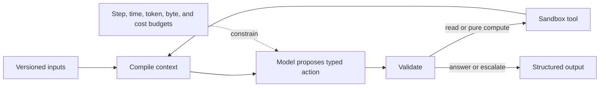
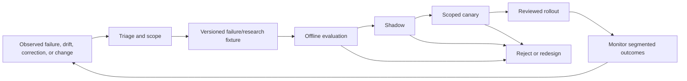

# Zero-to-Production Stages and Exit Gates

This roadmap implements the repository's seven-stage blueprint registry for the scientific-research workload. Each stage earns a bounded capability through evidence. Later stages do not automatically mean more physical autonomy; a production-quality A1/A2 system may be the correct endpoint.

## 1. Progression rules

1. Never use live physical work to discover basic product, state, or retry semantics.
2. A stage is complete only when its exit evidence is stored and reviewed.
3. Hard safety, identity, security, and effect-integrity failures block progression regardless of average quality.
4. Expand one dimension at a time: protocol, instrument, facility, project, effect class, or autonomy.
5. A new instrument technique or materially different protocol may restart integration validation at an earlier stage.
6. Preserve all observed limitations and keep a rollback path to the prior authority level.
7. Memory is explicitly enabled or disabled by class at every stage.

## 2. Stage overview

| Stage | Product outcome | Maximum default authority | Physical effects |
|---:|---|---|---|
| 0 | Qualified workload and deterministic baseline | A0 | None |
| 1 | Bounded read-only reasoning loop | A0 | None |
| 2 | Useful single-project MVP | A1/A2 | None |
| 3 | Reliable v1 with durable digital effects | A2 | Shadow only |
| 4 | Production-ready service; optional supervised low-risk capability | A2, optional A3 | One qualified template, supervised |
| 5 | Scaled and resilient facility/project cells | A2, optional bounded A4 | Only already qualified templates |
| 6 | Continuously evaluated and safely evolving system | No automatic increase | No expansion without a fresh staged program |

## 3. Stage 0 — Qualify the workload and deterministic baseline

**Goal:** prove the problem is suitable for an agent and establish a non-agent baseline before building orchestration.

| Contract dimension | Stage 0 requirement |
|---|---|
| Architecture | Offline research workspace; read-only snapshots; deterministic parsers, validators, and reference workflow; no live connectors |
| Authority | A0 advice only; no credentials capable of mutation; investigator owns every output |
| Inputs | A representative, de-identified or appropriately governed historical set of protocols, records, datasets, artifacts, and known outcomes |
| Outputs | Task definition, boundary/authority matrix, source map, deterministic readiness/result baseline, annotated failure taxonomy, evaluation rubric |
| State | Versioned fixture and annotation records; no chat transcript as truth |
| Events | Evaluation events only: fixture loaded, rule executed, reviewer disposition |
| Effects | None outside the isolated evaluation workspace |
| Approvals | Data access and research-use approval; domain, safety, and data-owner review of proposed scope |
| Recovery | Restart from immutable fixture; reproduce baseline outputs; preserve annotation versions |
| Evaluations | Inter-reviewer agreement, deterministic baseline precision/recall by failure class, data leakage review, cost/time baseline |
| Memory | Ephemeral context enabled; durable fixture metadata enabled; user and long-term semantic memory disabled |

### Stage 0 work

1. Select one narrow workflow with a named investigator and system owners.
2. Document current manual flow, authoritative sources, decisions, delays, failure modes, and total cost.
3. Separate deterministic checks from judgment tasks.
4. Inventory hazards, data classes, regulations/policies, and excluded work.
5. Define observation, evidence, hypothesis, decision, effect, sample, artifact, and result records.
6. Create representative normal, edge, negative, and known-failure fixtures.
7. Build simple schema/unit/hash/lineage checks before using a model.
8. Measure whether the model-addressable remainder is valuable enough to justify the system.
9. Inventory every proposed source/effect operation using the capability qualification questions in [11 — Integration qualification and worked research flows](11-integration-qualification-and-worked-flows.md); do not certify writes at this stage.

### Stage 0 exit gates

- [ ] The target is not a literature-only, clinical-trial, unrestricted hazardous-lab, or publication-approval workflow.
- [ ] Human authorities and all source-of-truth systems are named.
- [ ] Deterministic validation catches known unit, identity, artifact, protocol, and control failures at an acceptable documented rate.
- [ ] A representative fixture set and blinded review rubric exist.
- [ ] The team can state the value beyond the deterministic baseline.
- [ ] No required use depends on model authority over safety or scientific truth.
- [ ] Data access, retention, and external-model restrictions are approved.
- [ ] Known limitations and a stop decision are documented.

**Do not advance** if the workload requires open-ended physical action, the sources cannot establish identity/provenance, or success cannot be evaluated independently.

## 4. Stage 1 — Bounded single-agent loop

**Goal:** show that a model can improve read-only or pure-compute work inside a small deterministic loop.

| Contract dimension | Stage 1 requirement |
|---|---|
| Architecture | One bounded agent loop; context compiler; read-only source fixtures; sandboxed pure-compute tools; strict structured output |
| Authority | A0; model may propose and explain but cannot write source systems or dispatch external jobs |
| Inputs | One approved question/protocol package and selected authorized artifacts with citations |
| Outputs | Structured ambiguity list, protocol mapping proposal, evidence table, readiness assessment, or analysis proposal |
| State | In-memory working state plus append-only evaluation trajectory; exact source/artifact versions |
| Events | Model call, retrieval, validation, budget, refusal/escalation, and terminal outcome |
| Effects | Pure isolated computation only; outputs remain evaluation artifacts |
| Approvals | User starts a run; investigator reviews every proposed scientific/design statement |
| Recovery | Step/time/token caps; repeated-state detection; deterministic restart from fixture and seed where supported |
| Evaluations | Output plus trajectory grading, citation fidelity, injection, uncertainty, protocol mapping, negative-result handling, cost/latency |
| Memory | Ephemeral and run-working memory enabled; session event log retained for evaluation; cross-run/user/semantic memory disabled |

### Stage 1 loop

### Required adversarial cases

- instructions embedded in papers, protocols, filenames, tables, and tool results;
- missing or conflicting sample/protocol identifiers;
- negative, inconclusive, or censored observations;
- unit mismatch and misleading precision;
- insufficient evidence for requested interpretation;
- retrieval access denial or source withdrawal;
- prompt/context overflow and compaction attempt; and
- repeated tool loop.

### Stage 1 exit gates

- [ ] The model beats the deterministic/manual baseline on a predeclared useful dimension without unacceptable regressions.
- [ ] Every factual scientific statement has an inspectable source/evidence reference.
- [ ] Observation, evidence, hypothesis, and decision proposals remain distinct.
- [ ] Structured-output and protocol/unit validators fail closed.
- [ ] Prompt injection cannot widen tools or permissions.
- [ ] Unknown and inconclusive cases escalate rather than become confident answers.
- [ ] Loop budgets and repeated-state termination work.
- [ ] Cost and reviewer effort per accepted output are measured.

**Do not advance** if quality depends on hidden chain-of-thought, uncited memory, broad context dumping, or reviewers routinely reconstruct missing provenance.

## 5. Stage 2 — Useful MVP

**Goal:** deliver value to one project using draft writes and sandboxed digital execution while preserving source authority.

| Contract dimension | Stage 2 requirement |
|---|---|
| Architecture | Modular API/UI, relational run store, immutable object storage, one or two official source adapters, sandbox scheduler, policy/credential broker |
| Authority | A1 drafts and A2 sandbox/pure-compute execution; no instrument writes or public release |
| Inputs | Live authorized ELN/protocol/LIMS reads, pinned code/data, one supported workflow/profile |
| Outputs | Draft ELN record, validated experiment/simulation plan, submitted sandbox job, reconciled artifact set, draft result package |
| State | Durable campaign/run/node state, hypothesis/protocol/analysis versions, sample projection, artifact manifest, digital effect ledger |
| Events | State transitions, source refetch, policy/approval, job/artifact effects, model/tool calls, validations |
| Effects | Reversible drafts, reservations, and sandbox job submission with idempotency/reconciliation |
| Approvals | Exact plan approval before expensive compute; human review before draft becomes governed record |
| Recovery | Durable checkpoint at every wait/effect; API event deduplication; job and upload reconciliation; no transcript-only resume |
| Evaluations | Connector contract tests, stale/out-of-order events, duplicate job/upload, restart at each boundary, reproducibility manifest replay |
| Memory | Ephemeral, working, session event, and durable run state enabled; curated domain corpus enabled; user and unreviewed cross-run memory disabled |

### MVP scope constraints

- one project and one data classification;
- one protocol family and analysis profile;
- one scheduler/sandbox environment;
- source writes limited to drafts or comments;
- immutable references resolved before execution;
- no automatic repository release; and
- no physical instrument control.

### Stage 2 exit gates

- [ ] Users complete a real workflow with less avoidable effort and no hidden manual reconstruction.
- [ ] Source events are deduplicated and followed by authorized refetch.
- [ ] Every digital effect has intent, receipt, and reconciled target state.
- [ ] Scheduler completion is separately validated from scientific outputs.
- [ ] Result packages include code/data/environment/protocol/analysis/artifact manifests.
- [ ] Draft records cannot overwrite approved/signed source records.
- [ ] Restarts during source fetch, job submit, upload, and approval waits are tested.
- [ ] Project-scoped access, cache, index, trace, and deletion behavior pass review.
- [ ] Cost caps include compute, storage, external APIs, model use, and reviewer time.
- [ ] Every live operation has a dated capability declaration, target-account negative permission tests, pinned versions, owner, expiry and outage behavior.

**Do not advance** if users bypass the system to repair identities/effects, if unknown digital outcomes are retried blindly, or if artifact lineage is incomplete.

## 6. Stage 3 — Reliable v1

**Goal:** make digital orchestration dependable under concurrency, outage, and connector change; shadow laboratory work without physical commit authority.

| Contract dimension | Stage 3 requirement |
|---|---|
| Architecture | Durable workflow engine, admission queues, policy service, effect/reconciliation workers, HA control store, artifact pipeline, read-only facility gateway |
| Authority | A2 in approved projects; facility integration remains read-only/shadow; no autonomous physical commit |
| Inputs | Multiple protocol versions, live ELN/LIMS events, scheduler/workflow jobs, instrument state/raw outputs from human-operated runs |
| Outputs | Reconciled digital workflows, shadow readiness and command proposals, lineage-complete result packages, operational dashboards |
| State | Full campaign/run/effect state machines, compare-and-set transitions, readiness snapshots, approval lifecycle, indeterminate/safety-hold states |
| Events | Ordered internal run sequence plus source events with independent time/version; trace correlation across all planes |
| Effects | Durable digital effects; read-only instrument observation; shadow commands never dispatched |
| Approvals | Role- and scope-bound digital approvals with expiry/revocation; shadow comparison records operator decision |
| Recovery | Automated safe-read retries, reconcile-only effect recovery, DLQ/quarantine, dependency degradation, restore test |
| Evaluations | Long-run compaction, queue/backpressure, dependency outage, schema drift, effect ambiguity, cancellation, shadow agreement and disagreement |
| Memory | Same as Stage 2 plus reviewed episodic failure fixtures; long-term semantic/user memory remains off by default |

### Reliability work

- introduce priority lanes for safety observations, reconciliation, artifact ingest, compute, and model work;
- implement error taxonomy and retry policy by effect class;
- add source/API/schema/firmware compatibility matrices;
- observe human-operated instrument runs and compare the agent's proposed plan/readiness/effect classification;
- measure false allow, false block, missed deviation, and operator workload;
- restore the entire research graph from backup; and
- run incident tabletop exercises.

### Stage 3 exit gates

- [ ] No unresolved effect can disappear from dashboards, compaction, or resume.
- [ ] Duplicate/out-of-order events and connector outages preserve correct projections.
- [ ] Queue saturation protects reconciliation and raw-data capture.
- [ ] Backup restore preserves referential integrity, hashes, approvals, lineage, and deletion/hold state.
- [ ] Shadow operation catches real readiness/deviation cases at a reviewed rate and does not hide subgroup failures.
- [ ] All hard-invariant scenarios pass in replay and digital twin.
- [ ] On-call owners and runbooks cover unknown effect, identity, artifact, safety, security, and cost incidents.
- [ ] Release behavior manifests and rollback are operational.

**Do not advance to physical capability** if shadow disagreements are unexplained, the controller cannot reconcile acceptance/state, the facility gateway is not isolated, or local safety owners have not approved the design.

## 7. Stage 4 — Production readiness

**Goal:** operate as a supported production service and, only if justified, enable one supervised, pre-authorized low-risk physical run template.

| Contract dimension | Stage 4 requirement |
|---|---|
| Architecture | Production control/data plane, segregated site gateway, qualified adapter, independent controller/interlocks, approval/operator UI, SLOs and on-call |
| Authority | A2 production default; optional A3 for one fixed low-risk template, instrument, facility, sample class, and parameter envelope |
| Inputs | Approved immutable manifest, fresh source snapshots, qualified instrument/method, operator and safety readiness |
| Outputs | Governed digital records; optional supervised physical run with native raw data, effect reconciliation, lineage, validation, and human disposition |
| State | Production event/effect stores, signed/pinned behavior/readiness manifests, incident and audit references |
| Events | Site gateway/controller/interlock/operator observations correlated with control-plane state; all clock uncertainty explicit |
| Effects | One prepare/arm/commit/reconcile physical capability; no generic method editing, material substitution, or blind retry |
| Approvals | Exact expiring run approval; required operator confirmation; facility safety and instrument-owner qualification; human result/release decisions |
| Recovery | Local safe stop independent of cloud; unknown-effect runbook; physical admission stop on storage/observability failure; manual disposition |
| Evaluations | Qualified simulator/test article, shadow then canary, lost response at commit, interlock trip, power/network loss, artifact failure, operator usability |
| Memory | Production durable state/corpus/failure fixtures enabled; personal and automatic scientific semantic memory disabled; retention and deletion enforced |

### Optional physical canary sequence

1. Run adapter contract tests and replay.
2. Use vendor simulator or digital twin.
3. Prepare without commit.
4. Shadow a qualified operator.
5. Use a non-hazardous, non-scarce test article.
6. Require operator presence and one exact approval.
7. Execute one run; reconcile every effect and artifact.
8. Conduct independent review before expanding count.

### Stage 4 exit gates

- [ ] Production threat model, facility risk assessment, authority map, and operating procedure are approved by named owners.
- [ ] The model has no route to safety controls, arbitrary controller commands, credentials, or endpoints.
- [ ] Hardware/controller limits and local stop work with cloud/control plane unavailable.
- [ ] Commit checks exact manifest, sample, method, instrument, calibration, interlock, operator, approval, time, and budgets.
- [ ] A lost commit response never produces an automatic retry.
- [ ] Raw capture, sample disposition, and reconciliation survive gateway/control-plane restart.
- [ ] Canary uses a qualified low-risk template and independent human review.
- [ ] Security, data-governance, backup, incident, SLO, cost, and change-control evidence is complete.
- [ ] The exact physical capability passed simulator, no-material dry-run, operator shadow, lost-response reconciliation and one supervised test-article exercise.
- [ ] The organization accepts remaining limitations without calling the system generally autonomous, safe, or compliant.

If physical execution is not necessary, satisfy the production operational gates at A2 and skip the physical subsection.

## 8. Stage 5 — Scale and resilience

**Goal:** support more projects, protocols, instruments, and facilities without weakening isolation, fairness, safety, or evidence quality.

| Contract dimension | Stage 5 requirement |
|---|---|
| Architecture | Project/region control cells, facility gateways, fair resource queues, federated policy, regional artifact stores, compatibility registry, centralized release evidence |
| Authority | A2 broadly by policy; optional A4 only for repeated instances of already qualified low-risk templates; no protocol/hazard expansion |
| Inputs | Multiple projects/facilities with explicit site profiles, data-residency policy, instrument/version matrix, resource forecasts |
| Outputs | Fairly scheduled, isolated, reproducible campaigns with per-cell SLO/cost/incident evidence |
| State | Cell-local run/effect authority, globally unique references where needed, explicit replication of non-sensitive metadata only |
| Events | Cell-scoped ordered streams; redacted global aggregates; cross-cell transfer events are governed effects |
| Effects | Capability scoped to facility/instrument/protocol; reservations and material budgets prevent unsafe concurrency |
| Approvals | Policy-derived routing and separation of duties; bulk approval only for exact template/envelope and bounded count/time/material |
| Recovery | Cell isolation, failover without duplicate effects, bounded gateway buffers, disaster restore, regional/facility outage playbooks |
| Evaluations | Load/soak, noisy-neighbor, cross-cell leakage, correlated dependency outage, fair scheduling, scale cost, site-transfer reproducibility |
| Memory | All memory and indexes partitioned by scope; curated cross-site knowledge only after governance review; deletion propagates through projections |

### Scaling safeguards

- shard by a true authority or contention boundary, not arbitrary throughput;
- keep an effect's single writer/reconciler in one cell;
- never fail over a physical commit by replaying it in another cell;
- stop admission before local raw-data buffers or operator capacity saturate;
- require site-specific method equivalence and safety review;
- segment model/eval metrics so minority protocols or facilities cannot be hidden; and
- include sample stability, cleanup, staff, and storage in scheduling.

### Stage 5 exit gates

- [ ] Noisy-neighbor tests preserve safety, reconciliation, raw ingest, and fairness.
- [ ] Cross-tenant/project/facility isolation passes adversarial access and cache/index tests.
- [ ] Cell failure and recovery do not duplicate digital or physical effects.
- [ ] Global control-plane outage cannot bypass or disable local safety.
- [ ] Site/profile/version compatibility is machine-enforced and reviewed.
- [ ] Data-residency and governed cross-cell transfer are evidenced.
- [ ] Capacity and cost models match observed tail behavior within documented error.
- [ ] Multi-site comparison records method differences and achieved reproducibility level.
- [ ] Bulk/bounded campaign authority has quotas, expiry, pause/kill, and operator oversight.

## 9. Stage 6 — Continuous evolution

**Goal:** learn from failures and scientific/technical change without allowing silent behavior or authority drift.

| Contract dimension | Stage 6 requirement |
|---|---|
| Architecture | Automated evaluation/replay pipeline, correction/policy/API monitors, shadow/canary deployment, signed behavior manifests, governed failure library |
| Authority | Unchanged by default; each new effect class, protocol family, instrument, or facility repeats the relevant earlier stages |
| Inputs | Production incidents, disagreements, drift signals, source corrections, new policies/standards, adapter/firmware/model changes |
| Outputs | Versioned regressions, refreshed research decisions, release evidence, deprecations, migration and rollback plans |
| State | Immutable historical manifests plus explicit migrations; no retroactive rewrite of past runs |
| Events | Change proposal, evidence review, evaluation, approval, rollout, rollback, deprecation, source correction, policy effective-date events |
| Effects | New releases first shadowed; executing runs stay pinned; emergency tightening may hold work but never silently widen authority |
| Approvals | Platform, domain, data, facility, and safety owners approve relevant change dimensions; model self-approval forbidden |
| Recovery | Automatic rollback for operational regressions; hold-and-review for integrity/safety issues; historical readers retained as required |
| Evaluations | Prior failures, fresh adversarial cases, subgroup drift, correction impact, long-run reproducibility, cost and human-factor regression |
| Memory | Failure library is redacted, scoped, reviewed, versioned, and expiring; no direct incident-to-memory or incident-to-policy write |

### Continuous-evolution loop

### Exit gates for a mature continuous process

- [ ] Every production behavior is attributable to a manifest and release evidence.
- [ ] Source corrections, policy effective dates, API/schema/firmware changes, and model drift trigger review.
- [ ] Historical runs remain interpretable under their original versions.
- [ ] Failures become redacted, reviewed regression fixtures before a fix rolls out.
- [ ] Shadow/canary/rollback paths are routinely exercised.
- [ ] Segmented quality, safety, cost, and human-override trends have named owners.
- [ ] Stale protocols, corpora, adapters, models, evaluations, and memory entries are deprecated on schedule.
- [ ] Authority expansion always returns to the appropriate earlier stage and facility review.

Stage 6 has no permanent finish. The exit gate is a functioning, evidenced change system.

## 10. Evidence package for every stage gate

Store:

- scope and authority statement;
- architecture and data-flow version;
- source, adapter, instrument, workflow, and behavior compatibility matrix;
- test/evaluation suite version and results by subgroup;
- hard-invariant results;
- incident and unresolved-risk review;
- cost, latency, queue, and human-effort measures;
- data-governance and security assessment;
- safety/facility approval where applicable;
- rollback/disable procedure and owner; and
- decision, approvers, conditions, expiry, and next allowed scope.

## 11. Stage anti-patterns

- Jumping from a good benchmark result to live instrument control.
- Calling a sandbox notebook a production control plane.
- Treating more model agents as a maturity milestone.
- Enabling long-term memory before durable state and deletion work.
- Expanding instrument/protocol/facility scope in one release.
- Using average accuracy to waive an identity, safety, or isolation failure.
- Granting A4 because A3 worked once.
- Treating Stage 6 automation as permission for self-modifying policy or protocols.

## Sources and navigation

The stage decisions and benchmark/safety limitations are traceable in the [research packet](../../research/packets/scientific-research-agent-blueprint.md). Continue with [10 — Implementation schemas, checklists, and anti-patterns](10-implementation-schemas-checklists-and-anti-patterns.md) and [11 — Integration qualification and worked research flows](11-integration-qualification-and-worked-flows.md), return to [08 — Deployment and evolution](08-deployment-scaling-cost-and-continuous-evolution.md), or return to the [overview](README.md).
