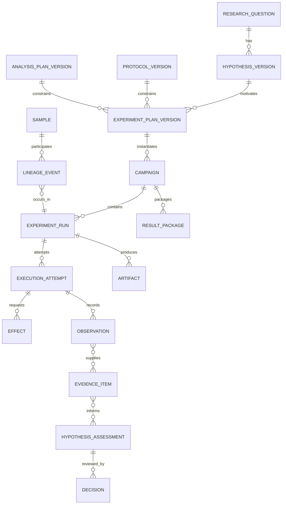

# Implementation Schemas, Checklists, and Anti-Patterns

This field guide collects the minimum contracts needed to implement the blueprint. The examples are logical schemas, not vendor APIs or universal scientific metadata standards. Add a versioned domain profile for each technique and validate it with the relevant experts.

## 1. Record relationship map



Do not encode these relationships only inside artifact filenames or prose.

## 2. Shared envelope

All durable records should carry a common envelope:

```yaml
record_id: globally-or-scope-unique-id
record_type: protocol_version
schema_version: "1.0"
tenant_id: ...
project_id: ...
facility_id: ...
version: 4
created_at: ...
created_by:
  actor_id: ...
  actor_type: human | service
  delegation_ref: ...
source:
  system: ...
  record_id: ...
  version: ...
  fetched_at: ...
integrity:
  content_hash: sha256:...
  signature_ref: ...
classification:
  data_class: ...
  policy_ref: ...
lifecycle:
  status: active
  supersedes: ...
  retention_class: ...
  legal_hold: false
```

Nullable fields and identity rules must be explicit in the actual schema. The source version and content hash are both useful: some systems expose one but not the other.

## 2.1 Exact identity snapshot

Bind one readiness/attempt to exact source identities rather than display labels:

```yaml
identity_snapshot_id: identity-snapshot-...
project:
  tenant_id: ...
  authoritative_project_id: ...
  access_policy_version: ...
samples:
  - sample_id: ...
    aliquot_id: ...
    container_id: ...
    lims_revision: ...
    last_boundary_scan_event: ...
    quantity_basis: ...
materials:
  - material_id: ...
    lot_id: ...
    inventory_revision: ...
instrument:
  facility_asset_id: ...
  controller_identity: ...
  firmware_driver_adapter_versions: [...]
  method_calibration_maintenance_refs: [...]
protocol_and_analysis:
  protocol_release_and_hash: ...
  analysis_release_and_hash: ...
measurement_contract:
  measurand_method_unit_basis_uncertainty_refs: [...]
artifacts:
  expected_manifest_id: ...
  native_storage_version_and_digest_policy: ...
effects:
  permitted_semantic_effect_ids: [...]
  reconciliation_capability_refs: [...]
source_event_high_watermarks: {...}
snapshot_created_at: ...
expires_at: ...
snapshot_digest: sha256:...
```

Any changed sample/material state, access policy, protocol/analysis release, instrument compatibility, calibration, method, safety hold, expected artifact, or approval invalidates the snapshot. A later source timestamp does not authorize “latest wins” across conflicting authorities.

## 3. Hypothesis version

```yaml
hypothesis_id: hyp-...
version: 2
question_ref: question-...@3
class: exploratory | confirmatory | replication
statement: ...
predictions:
  - condition: ...
    expected_observation: ...
    direction_or_pattern: ...
alternatives:
  - statement: ...
    distinguishing_evidence: ...
confounders: [...]
assessment_rules:
  supports_ref: analysis-plan-...#rule-1
  does_not_support_ref: analysis-plan-...#rule-2
  inconclusive_conditions: [...]
scope_of_inference: ...
authorship:
  proposed_by: ...
  reviewed_by: ...
timing:
  sealed_at: ...
  outcome_data_available_at: ...
status: active | supported | not_supported | inconclusive | superseded | withdrawn
```

The `status` is a governed disposition, not a field the model writes after seeing a result.

## 4. Protocol constraint profile

```yaml
protocol_ref: protocol-...@7
content_hash: sha256:...
applicability:
  facilities: [...]
  instrument_profiles: [...]
  sample_classes: [...]
parameters:
  temperature:
    type: quantity
    unit: Cel
    minimum: ...
    maximum: ...
    precision: ...
  duration:
    type: quantity
    unit: s
    minimum: ...
    maximum: ...
cross_constraints:
  - rule_id: constraint-...
    expression_ref: deterministic-policy-...
preconditions:
  - rule_ref: calibration-valid-for-method
controls:
  - control_ref: control-...
    acceptance_ref: analysis-plan-...#control-rule
stop_conditions:
  - condition_ref: controller-alarm
    action: safety_hold
deviation_policy:
  allow_record_only: [...]
  require_approval: [...]
  force_stop: [...]
outputs:
  expected_artifact_manifest_ref: ...
safety:
  risk_assessment_ref: ...
  envelope_hash: sha256:...
  local_procedure_ref: ...
```

Use an actual safe expression language or compiled policy. Never execute a model-authored expression or arbitrary code in the gateway.

## 5. Run manifest

```yaml
run_id: run-...
replicate_id: replicate-...
campaign_ref: campaign-...@1
hypothesis_ref: hyp-...@2
experiment_plan_ref: plan-...@5
protocol_ref: protocol-...@7
analysis_plan_ref: analysis-...@4
samples:
  - sample_ref: aliquot-...
    source_version: ...
    intended_role: treatment | control | blank | reference
    reserved_quantity: {value: ..., unit: ...}
materials:
  - lot_ref: lot-...
instrument_or_compute:
  target_ref: ...
  method_or_job_hash: sha256:...
  adapter_or_runner_version: ...
parameters: {...}
randomization_and_blinding_refs: [...]
expected_outputs_ref: artifact-manifest-...
budgets:
  material: ...
  instrument_time: ...
  compute: ...
  monetary: ...
approval_policy_ref: ...
behavior_manifest_ref: ...
manifest_hash: sha256:...
```

Hash a canonical serialization and record the canonicalization method. A hash over unstable key ordering or display text is not a dependable binding.

## 6. Observation and evidence contracts

### Observation

```yaml
observation_id: obs-...
observation_type: measurement | controller_state | barcode_scan | job_state | human_observation
subject_refs: [...]
source:
  system_or_device_ref: ...
  native_record_ref: ...
  source_version: ...
time:
  source_time: ...
  ingest_time: ...
  clock_status: synchronized | bounded_skew | unknown
value_ref: artifact-...
unit_and_measurand_ref: ...
method_ref: ...
quality_flags: [...]
raw_artifact_ref: ...
integrity_status: passed | failed | pending
```

### Evidence item

```yaml
evidence_id: evidence-...
claim_class: validation | estimate | comparison | quality_assessment
input_observation_refs: [...]
input_artifact_refs: [...]
activity:
  method_ref: ...
  code_digest: ...
  environment_digest: ...
  parameters: {...}
result_ref: artifact-...
estimate:
  value: ...
  unit: ...
uncertainty_ref: ...
quality_and_limitations: [...]
validator:
  schema_version: ...
  outcome: passed | failed | inconclusive
created_at: ...
```

An evidence item never deletes or cleans up its observations.

## 7. Decision and approval contracts

### Decision

```yaml
decision_id: decision-...
decision_type: approve_plan | accept_deviation | disposition_run | assess_hypothesis | release_package
subject_ref: ...
subject_hash: sha256:...
proposal_ref: ...
decision: approved | rejected | changes_required | inconclusive | withdrawn
decided_by:
  actor_id: ...
  role_exercised: ...
evidence_refs: [...]
alternatives_considered: [...]
uncertainty_and_conflicts: [...]
reason: ...
created_at: ...
```

### Approval bundle

```yaml
approval_id: approval-...
effect_class: physical
subject_ref: run-...
subject_hash: sha256:...
allowed_capability: facility-a.reader.start
allowed_target_ref: instrument-...
allowed_sample_refs: [...]
parameter_envelope_hash: sha256:...
policy_version: ...
risk_assessment_ref: ...
approvers:
  - actor_id: ...
    role_exercised: investigator
  - actor_id: ...
    role_exercised: instrument_owner
issued_at: ...
expires_at: ...
max_uses: 1
use_count: 0
nonce: ...
revocation_state: active
```

The gateway checks the actual current subject, not a user-supplied copy of these fields.

## 8. Effect and reconciliation contracts

### Effect intent

```yaml
effect_id: effect-...
operation: instrument.run.start
effect_class: physical
run_ref: run-...
attempt_ref: attempt-...
target_ref: instrument-...
manifest_hash: sha256:...
approval_ref: approval-...
created_at: ...
state: intent_recorded
```

### Dispatch and raw receipt

```yaml
dispatch_id: dispatch-...
effect_ref: effect-...
adapter_ref: adapter-...@3.2.1
protocol_version: ...
sent_at: ...
transport_deadline: ...
native_receipt_ref: artifact-...
normalized_outcome: accepted | rejected | unknown
controller_run_id: ...
```

### Reconciliation result

```yaml
reconciliation_id: reconcile-...
effect_ref: effect-...
observed_target_state: completed | failed | in_progress | not_applied | unknown
evidence_refs:
  - controller-observation-...
  - raw-artifact-...
  - operator-observation-...
sample_material_disposition_refs: [...]
reconciled_at: ...
reconciled_by: service-or-human
remaining_uncertainty: [...]
next_action: close | wait | safety_hold | human_disposition
```

## 9. Result assessment contract

The model returns a proposed assessment in a deliberately constrained shape:

```yaml
assessment_id: assessment-...
hypothesis_ref: hyp-...@2
result_package_ref: result-package-...@1
proposed_outcome: supports_under_design | does_not_support_under_design | inconclusive | not_assessable
evidence_for: [...]
evidence_against: [...]
failed_or_missing_controls: [...]
deviations_and_exclusions: [...]
uncertainty_and_scope: [...]
alternative_explanations: [...]
recommended_human_questions: [...]
model_and_context_manifest_ref: ...
status: proposal_only
```

Reject uncited evidence IDs, nonexistent references, hidden changes to assessment rules, and prohibited certainty language.

## 10. Core deterministic invariants

### State and effects

- One effect ID represents one semantic state change.
- A physical effect in `UNKNOWN` cannot be dispatched again.
- A cancelled run cannot transition directly to validated.
- A run cannot become analysis-ready with unresolved required effects or artifacts.
- An approval's subject hash must match the committed run manifest.
- A replicate ID is never reused as an attempt ID.

### Protocol and authority

- Every executable node references one exact active protocol version.
- Every physical parameter is typed, unit-bearing where applicable, and inside the cross-validated envelope.
- Policy denies on missing or conflicting risk, identity, or approval information.
- The model cannot change role, project, data class, risk tier, or allowed capability.

### Sample and artifact integrity

- Sample identity conflicts force hold.
- Known quantity cannot go negative.
- Every derived artifact has inputs, activity, code/tool version, and output hash.
- Native raw artifact versions are immutable.
- An incomplete staging object cannot satisfy an expected output.
- A converter cannot claim lossless output without a passed loss/conformance test.

### Scientific claims

- Every evidence item resolves to observations or artifacts.
- Every assessment cites evidence and declared rules.
- Missing uncertainty is represented as missing, not zero.
- Operational completion is not scientific validity.
- Agent assessments remain proposals until a human decision.

## 11. Preflight checklist

### Research and protocol

- [ ] Question, hypothesis, design class, predictions, alternatives, and scope are versioned.
- [ ] Protocol and analysis plan are exact, approved, active, and content-hashed.
- [ ] Controls, replicates, exclusions, stopping rules, and expected artifacts are explicit.
- [ ] Changes made after outcome exposure are recorded.

### Samples and materials

- [ ] Machine-readable identity matches the authoritative LIMS at the last physical boundary.
- [ ] Source, aliquot, container, location, custody, quantity, and lineage are valid.
- [ ] Material lots are released, in date, compatible, and reserved.
- [ ] Stability windows and disposition plan cover the scheduled duration.

### Instrument or compute

- [ ] Target asset/environment and method/job are immutable and supported.
- [ ] Calibration, maintenance, cleaning, firmware, adapter, and capacity are valid.
- [ ] Units, ranges, combinations, tolerances, seeds, and resource limits pass deterministic checks.
- [ ] Expected native raw and validation outputs are declared.

### Authority and safety

- [ ] Actor/project/facility/action permissions and purpose are current.
- [ ] Risk assessment and local procedure cover the exact work.
- [ ] Approvals bind the current manifest and have not expired or been revoked.
- [ ] Required operator/training and independent interlocks are present.
- [ ] Unknown-risk, hazardous, or high-consequence work is excluded from agent execution.

### Operations and data

- [ ] Storage, ingest, reconciliation, queue, operator, and budget capacity are reserved.
- [ ] Data classification, provider, egress, retention, and trace policies are satisfied.
- [ ] Effect and attempt identifiers are allocated and no prior commit exists.
- [ ] Stop, cancellation, outage, and unknown-effect runbooks are reachable.

## 12. Post-run checklist

- [ ] Every effect intent has an authoritative reconciled outcome or visible owner/hold.
- [ ] Actual sample/material identity, quantity, location, condition, and disposition are recorded.
- [ ] Native raw files, controller logs, and expected outputs are finalized and integrity-checked.
- [ ] Deviations, alarms, missing data, saturation, exclusions, failed controls, and manual steps are preserved.
- [ ] Derived artifacts link to immutable inputs, code/tool/environment, parameters, and validators.
- [ ] Units, measurands, uncertainty, calibration, and quality flags are complete.
- [ ] Scheduler/process completion is separated from artifact/domain validation.
- [ ] Result package can be inspected or rerun to the declared reproducibility level.
- [ ] Agent assessment is labeled proposal and human interpretation/disposition is recorded.
- [ ] Draft ELN/repository outputs remain unreleased until separate approval.
- [ ] Costs, resource use, reviewer effort, and avoidable failure causes are attributed.

## 13. Design-review checklist

- [ ] Is the model used only where judgment is needed?
- [ ] Can every model step fail without corrupting canonical state?
- [ ] Does each external system keep a clear source-of-truth role?
- [ ] Are digital and physical effects classified separately?
- [ ] Can a lost response be reconciled without redispatch?
- [ ] Are safety controls independent of model, cloud, and prompt context?
- [ ] Does context compilation preserve authority, stop conditions, unknown effects, identity, and uncertainty?
- [ ] Are memory classes explicitly enabled, scoped, reviewed, and deletable?
- [ ] Do evaluation and incident fixtures cover the complete trajectory?
- [ ] Can one protocol/instrument/project/release be disabled without broad outage?

## 14. Audit queries the system must answer

Within a bounded operational time, an authorized reviewer should be able to answer:

1. Which exact question, hypothesis, protocol, and analysis versions governed this result?
2. Which samples, materials, lots, containers, instruments, methods, and people participated?
3. What did the model propose, and what did deterministic policy or a human decide?
4. Which external effects were attempted, and how was each outcome established?
5. Was any outcome ever unknown, retried, corrected, or safety-held?
6. Where are native raw artifacts and how is their integrity verified?
7. Which transformations, code, environment, seeds, units, and uncertainty methods produced the evidence?
8. Which deviations, exclusions, failed controls, and conflicting observations exist?
9. Who approved execution, deviation, interpretation, signature, and release—and for exactly what scope?
10. Which model, prompt, tool, adapter, policy, schema, and corpus versions were active?
11. What data left the project boundary and under which policy?
12. Which downstream results or deposits depend on a sample, artifact, protocol, adapter, or result later found invalid?

If these require reading chat transcripts or guessing identifiers, the implementation is not production-ready.

## 15. Anti-pattern catalog

| Anti-pattern | Why it fails | Replacement |
|---|---|---|
| Autonomous scientist framing | Hides human authority and epistemic limits | Bounded research operations contract |
| Free-text `run_experiment` tool | No enforceable effect or parameter semantics | Typed, versioned capabilities |
| Model as protocol interpreter at execution time | Ambiguity reaches physical action | Reviewed compilation to typed protocol |
| Direct database/instrument access | Bypasses source audit, policy, and controller semantics | Official API through scoped adapter/gateway |
| Generic retry middleware | Duplicates non-idempotent effects | Per-class retry plus effect reconciliation |
| Job completed equals experiment succeeded | Ignores artifacts, controls, and scientific validity | Layered completion and domain validation |
| Chat history as state | Loses versions, effects, and recovery | Durable state/event/effect stores |
| Sample names as identity | Collisions and substitutions | Authoritative machine-readable IDs |
| One canonical lab schema | Discards technique-specific semantics | Semantic core plus versioned domain profiles |
| Normalized-only storage | Conversion can lose native meaning | Preserve native raw plus conversion lineage |
| Auto-learning from success | Bakes in confounding, error, or unsafe scope | Reviewed failure/knowledge curation |
| Model confidence as uncertainty | Not measurement/statistical uncertainty | Domain method and explicit missingness |
| Safety by prompt | Model can fail or be injected | Independent policy, controller, hardware, operator |
| Bulk context and memory | Leakage and instruction conflicts | Least-context compiler and explicit memory policy |
| One accuracy dashboard | Hides subgroup and hard-invariant failures | Segmented trajectory/effect/scientific metrics |
| Public benchmark certification | Benchmark lacks local effects and governance | Local replay, digital twin, shadow, canary |
| Compliance badge | Standards have scope and validation requirements | Intended-use assessment and evidence |
| Auto-publish on completion | Execution approval is not release authority | Separate data-owner/investigator release decision |

## 16. Definition of ready for production

The system is ready only for its explicitly qualified scope when:

- architecture, authority, data flow, and source ownership are documented;
- all record/effect contracts and invariants are implemented and tested;
- the selected stage's exit gates are evidenced;
- domain, data, security, facility, instrument, and safety owners accept the residual risks;
- operators can understand and recover state without model assistance;
- the disable, rollback, restore, reconciliation, and incident paths are exercised;
- all behavior-changing components are pinned and evaluated; and
- claims are limited to the actual protocols, instruments, facilities, data classes, and effect classes tested.

## Sources and navigation

Use the [research packet](../../research/packets/scientific-research-agent-blueprint.md) to verify source versions and unresolved limitations. Return to [09 — Zero-to-production stages](09-zero-to-production-stages-and-exit-gates.md) or the [blueprint overview](README.md).
