# Integration Qualification and Worked Research Flows

> **Status:** research-backed Pass 2 guide  
> **Research current through:** 2026-08-31  
> **Prerequisites:** [Reference architecture](02-reference-architecture-integrations-and-runtime.md), [tools and effect recovery](05-instruments-simulations-tools-effects-and-recovery.md), and [production stages](09-zero-to-production-stages-and-exit-gates.md)

This guide turns the architecture into an integration admission program. A connector is not qualified because OAuth succeeded, a vendor demo ran, or an API returned `2xx`. Qualification attaches to one operation, one effective principal, one source/effect role, one target deployment class, one pinned version set, and one tested recovery contract.

The first useful release should remain read-only. Physical execution is an optional later capability, not the definition of a successful research agent.

## The capability is the unit of admission

“Benchling integration,” “robot connector,” and “HPC tool” are too broad to authorize. Read, draft, reserve, submit, cancel, arm, start, stop, deposit, and publish have different consequences.

```yaml
scientific_capability:
  capability_id: "facility-a.instrument-17.run.start.v1"
  operation: "instrument.run.start"
  authority_level: "A3"
  effect_class: "physical"
  source_or_effect_role: "effect_target"
  provider_product: "site-qualified-controller"
  provider_api_profile: "sila2-feature-set-2026-08"
  adapter_build_digest: "sha256:..."
  target_scope:
    tenant: "research-org"
    facility: "facility-a"
    instrument_asset_id: "asset-17"
    protocol_template_id: "protocol-8"
    protocol_release: 12
  effective_principal: "workload://science-control/facility-a"
  required_claims: ["project:p-41", "instrument:asset-17", "action:run.start"]
  input_schema_digest: "sha256:..."
  output_schema_digest: "sha256:..."
  allowed_parameter_envelope_digest: "sha256:..."
  preconditions:
    - "fresh approval bound to run manifest"
    - "local interlocks healthy"
    - "sample and material snapshots current"
  retry_policy: "never blind retry; reconcile only"
  reconciliation_query: "instrument.run.read_by_effect_or_controller_id"
  cancellation_semantics: "protocol-safe-stop; not rollback"
  evidence_suite: "qualification/instrument-17/start/9"
  certified_at: "2026-08-31T00:00:00Z"
  expires_at: "2026-11-29T00:00:00Z"
  owner: "instrument-platform-team"
  kill_switch: "capability://facility-a/instrument-17/start/disable"
```

The manifest is server-owned. The model cannot select a credential, endpoint, facility, firmware, protocol release, target identifier, effect identity, callback destination, retry mode, or reconciliation query.

## Qualification evidence shared by every adapter

| Dimension | Required proof |
|---|---|
| Ownership | System owner, scientific owner, data owner, incident owner, disable and re-enable authority |
| Effective identity | Human/service delegation chain, tenant/project/facility binding, expiry, revocation, positive and negative object/field/action tests |
| Source role | Authoritative object, signed record, mutable source, cached projection, observation, derived evidence, or effect target |
| Version surface | Provider product/plan, API path/header, schema, SDK, adapter, firmware, method, parser, regional endpoint and deprecation monitor |
| Identity semantics | Stable native IDs, revision IDs, aliases, merges/splits, tombstones, reuse rules, physical label binding and conflict behavior |
| State and time | Native state machine, terminal/transient/unknown states, source/event/ingest time, clock uncertainty, conditional update and propagation lag |
| Effects | Exact intent, request, preconditions, idempotency behavior, acceptance evidence, partial/asynchronous outcomes, cancellation and compensation |
| Events | Raw-body authentication, event identity, duplicate/retry/reorder/loss behavior, gap recovery, schema evolution and authoritative refetch |
| Data integrity | Hash algorithm and scope, length, finalization marker, native raw preservation, multipart behavior, corruption and incomplete-upload recovery |
| Safety and privacy | Hazard/data classification, independent interlocks, egress, secrets, retention, deletion, legal hold, facility and jurisdiction restrictions |
| Operations | Timeouts, quotas, rate limits, backpressure, local buffering, dependency outage, catch-up load, SLO, dashboard, audit and runbook |

A write is disabled when the target cannot answer whether the effect occurred after a lost response. For a physical effect, lack of authoritative reconciliation is a design stop, not a prompt-engineering problem.

## Exact identity and version set

Every plan and result package carries the identities below. A human-readable label is descriptive; it is never the join key.

| Object | Exact identity | Version or state evidence | Conflict rule |
|---|---|---|---|
| Project/study | Tenant plus authoritative project/study ID | Project revision, protocol jurisdiction and access-policy version | Hold cross-project or withdrawn access |
| Sample/material | LIMS sample/aliquot/container/lot IDs plus last-boundary scan | Entity revision, lineage event sequence, quantity basis, custody, condition and disposition | Quarantine on label/LIMS/position mismatch |
| Instrument | Facility asset ID plus controller/server identity | Firmware, driver, adapter, method, calibration, maintenance and capability-profile versions | No commit on unqualified combination |
| Protocol | Immutable protocol release ID and content digest | Approval decision, allowed envelope, effective interval and supersession state | Recompile and reapprove after material change |
| Analysis | Analysis-plan release plus code/workflow/environment digests | Parser, library, container, seed and parameter versions | Do not compare results across hidden version drift |
| Measurement | Measurement ID bound to run, attempt, sample, measurand and method | Acquisition/source time, unit/basis, uncertainty method, quality flags and correction chain | Preserve conflicting observations; do not overwrite |
| Artifact | Artifact ID plus content digest, length and media type | Native/normalized/derived role, storage version ID, finalization and parser/converter versions | Partial or mismatched artifact is not evidence-ready |
| Effect | Semantic effect ID plus target-native operation/run/job/deposit ID | Intent version, dispatch attempts, raw receipts, observed state and reconciliation revision | One semantic intent; unknown never becomes a new intent |

Identifiers are scoped. A Git commit identifies content in a repository, not a container environment; a DOI identifies a deposited research object/version under repository rules, not a physical sample; an IGSN can identify a material sample, not the sample's current LIMS location or disposition.

## Provider and platform qualification notes

These are representative adapters, not endorsed defaults. Always certify the deployment actually used.

### ELN, LIMS, and protocol systems

| Surface | Current evidence and qualification focus | Important limit |
|---|---|---|
| Benchling ELN/platform | Benchling documents tenant-bound app authentication, app-manifest versioning, late/out-of-order events, refetch behavior, stability classes and an evolving V3 surface. Qualify exact stable endpoint/event operations; keep alpha/beta away from critical paths unless their volatility is explicitly accepted. | A tenant's schemas, permissions, GxP/legacy-app mode, signatures and workflows are configuration-specific. Event payload is not current record truth. |
| openBIS ELN/LIMS/SDMS-style deployment | Current 7.x documentation describes a transition in which V3 APIs continue while the DSS component is deprecated and AFS capabilities evolve. Pin server release, API/client library and data-service path. | Historical 20.10 documentation is useful background but not evidence for a current deployment. Migration and local data model dominate behavior. |
| protocols.io or another protocol repository | Qualify protocol URI/DOI, immutable version, visibility, component/instruction identity, export shape and approval mapping. | A published or versioned protocol is not automatically institution-approved or safe for the local sample, scale, instrument or facility. |

An ELN draft, signed entry, approved protocol and source-system audit are separate objects. The agent may create an authorized draft; it never applies a human signature or edits a signed record silently.

### Scientific data management and object storage

SciCat 3.1.0 documentation describes a metadata catalogue in which raw/derived dataset records link to external storage; its data model distinguishes metadata, lifecycle, original/archive datablocks, jobs and published data. This is a useful SDMS/catalog pattern, not a guarantee that the bytes exist or are intact. Qualify catalogue API/version, owner/access groups, dataset PID, metadata schema, file inventory/checksums, storage retrieval job and publication workflow separately.

For an S3-compatible artifact adapter, qualify the actual service and SDK. Amazon S3 currently documents conditional operations, explicit checksum algorithms and object version IDs. Do not treat an ETag as a universal full-object checksum: multipart and other cases have different semantics. A valid upload response still needs the expected digest/length, immutable manifest, version ID where used, finalization marker and successful authorized read-back before the artifact becomes evidence-ready.

### Instrument gateways and laboratory robotics

SiLA 2 features and OPC UA LADS profiles can reduce interface ambiguity, but neither standard supplies the local protocol, safety case, identity mapping or complete sample/consumable semantics. Certify the exact feature/profile, server/device implementation, firmware, command state machine and recovery query.

Opentrons illustrates why version sets must be explicit. Its official Protocol API versioning is separate from robot software and app versions; as checked on 2026-08-31, the documentation lists Protocol API 2.29 with different supported ranges for Flex and OT-2. A protocol analysis or simulator pass establishes compatibility with that software model, not correct deck setup, labware identity, liquid properties, containment, calibration or physical safety.

Robotics admission progresses through read-only inventory, offline analysis, vendor simulation, dry-run with no valuable/hazardous material, operator shadow, and one fixed supervised test article. Never expose arbitrary coordinates, command strings, scripts, file paths or labware definitions to the model.

### Simulation, workflow, and HPC

At the research date, SchedMD's official REST reference reports Slurm 26.05.3 and OpenAPI paths using `v0.0.45`. Pin both server and REST/data-parser plugin versions: mismatches are a compatibility risk. A submitted job ID is a digital effect receipt; `COMPLETED` with zero exit status is operational completion only.

A simulation result becomes evidence-eligible only after checking immutable inputs, code/environment, seed policy, resource limits, expected outputs, content hashes, domain validators, numerical warnings, convergence/quality criteria and declared uncertainty. Cancellation may stop future compute while leaving partial artifacts and costs; record those rather than pretending the job never existed.

### Repository and notebook adapters

Jupyter Server's Contents and REST APIs expose files, directories, notebooks and checkpoints. A checkpoint is not a governed source commit, environment capture, complete execution history or scientific approval. Stage notebook changes to an isolated workspace, strip secrets/output where policy requires, validate cells and artifacts, then commit through the repository's reviewed workflow.

GitHub's REST API is date-versioned. The current official page lists `2026-03-10` and `2022-11-28` as supported at the research date; requests without the version header still default to the older version. Pin `X-GitHub-Api-Version`, use an installation/service principal with exact repository permissions, resolve mutable refs to commit SHA, and qualify branch protection, checks/status, merge and release effects separately.

### Identity, safety, and publication handoff

The identity adapter returns an authenticated actor/service/delegation binding and current claims; it does not reveal authenticators to the model. Project membership does not imply facility training, instrument authorization, protocol approval, data-release rights or authorship. Every effect rechecks the relevant current intersections.

Safety-system adapters are normally read-only deny/hold sources: effective institutional policy, protocol risk decision, training, maintenance, interlock and emergency-state projections. They cannot replace local EHS, biosafety, chemical hygiene, radiation safety, animal/ethics, export-control or other named authorities. The model cannot classify unknown work down to “low risk.”

Publication is a separate effect boundary. Zenodo's official API distinguishes `deposit:write` from `deposit:actions`; draft upload permission need not grant publish. DataCite Metadata Schema 4.7 is current at the research date, but the chosen repository's metadata, PID, versioning, embargo, license, access, sensitive-data and correction rules still control. Default to a private draft/deposit handoff. Named humans approve authorship, claims, license, release and publication.

## Read and effect qualification pipeline

```mermaid
flowchart LR
    I[Inventory operation and owner] --> V[Pin product, plan, API, schema and identity]
    V --> N[Positive and negative read tests]
    N --> F[Fault, concurrency, drift and deletion tests]
    F --> R[Read-only replay and shadow]
    R --> D[Draft or sandbox digital effect]
    D --> Q[Reconciliation and cancellation proof]
    Q --> P[Qualified production digital capability]
    P -->|optional physical need| T[Simulator and no-material dry-run]
    T --> O[Operator shadow and fixed test article]
    O --> C[One supervised physical canary]
    C --> E[Expiring bounded capability]
```



Promotion gates are noncompensating:

1. **Isolation:** zero unauthorized tenant/project/object/field reads in negative tests.
2. **Identity:** exact sample, material, instrument, protocol, analysis, artifact and effect joins; no label- or filename-based repair.
3. **Schema:** new fields and event types do not become model-visible or mutate state automatically.
4. **Integrity:** native raw bytes, expected hashes/lengths and correction lineage survive ingest, restart and restore.
5. **Effects:** one semantic intent, exact approval where required, durable receipt and authoritative reconciliation; no blind retry.
6. **Safety:** local interlocks, operator stop and institutional holds work without model or cloud availability.
7. **Operations:** quota, backpressure, outage, catch-up load, owner, SLO, audit and kill switch are exercised.

## Worked flow one — retrospective evidence package

**Goal:** determine whether completed runs can answer a bounded research question without changing source systems.

1. Bind the authorized project and seal the question, inclusion/exclusion criteria and analysis plan.
2. Read ELN protocol/run references, LIMS sample/material lineage, SDMS file manifests and repository commit/environment manifests.
3. Refetch current objects rather than trusting event/search payloads. Preserve source revisions and denied/missing records.
4. Compile the minimum context. Treat notebook text, filenames, vendor metadata and papers as untrusted evidence.
5. Validate sample joins, protocol versions, units, controls, raw artifacts, hashes, exclusions and uncertainty.
6. Run the pinned analysis in an isolated environment. Preserve operational, validator and scientific-assessment states independently.
7. Create a draft evidence package with observation/evidence links, limitations and unresolved conflicts. A human owns interpretation.

**Pass gate:** another reviewer can reconstruct every included/excluded run and reproduce the declared computational level from immutable references. No source mutation or publication occurs.

## Worked flow two — simulation before scarce resources

**Goal:** evaluate a proposed design using bounded computation before consuming a sample or instrument slot.

1. Freeze hypothesis, exploratory/confirmatory class, proposed protocol, analysis plan, parameter space, stopping rule and budget.
2. Resolve input datasets, code commit, container/environment, runner, libraries, seeds and numerical settings to immutable identifiers.
3. Run deterministic preflight for units, parameter ranges, mesh/data adequacy, license/egress and resource ceilings.
4. Persist one `simulation.submit` effect intent, then submit to a pinned Slurm/CWL/other qualified adapter.
5. If the response is lost, query by semantic intent/job identity; do not create a new job until the first outcome is resolved.
6. Validate output manifest, logs, warnings, convergence, domain checks, checksums and uncertainty. Scheduler success alone never passes.
7. Compare the result to predeclared decision criteria and route a proposal—not a scientific conclusion—to the investigator.

**Pass gate:** restart at submit, cancel and artifact-finalization boundaries converges to one job intent and one attributable artifact set; cost and limitations are reported even for an invalid scientific result.

## Worked flow three — one supervised low-risk instrument run

**Goal:** execute exactly one approved, fixed, locally classified low-risk measurement after simulation/shadow evidence exists.

1. Verify the workflow is not hazardous, biological high-consequence, radiological, unknown-risk, human-subject/clinical, or outside approved chemical/material/facility bounds.
2. Bind exact project, protocol/analysis releases, sample/aliquot/container/material lots, instrument asset/firmware/method/calibration, operator and behavior manifest.
3. Reserve resources, scan identity at the last physical boundary and compile a readiness snapshot with expiry.
4. Run adapter analysis and a no-valuable-material dry-run. Require fresh operator and exact run approval.
5. Persist the physical effect intent before commit. The facility gateway rechecks interlocks and the parameter envelope, then submits one controller command.
6. On timeout, enter `INDETERMINATE` or `SAFETY_HOLD`; block the sample and downstream analysis. Reconcile controller state, sensor history, raw-artifact creation and operator observation.
7. A cancellation after start invokes the protocol-defined safe stop. It does not erase material transformation, cleanup, exposure or partial data.
8. Finalize native raw artifacts, actual sample disposition, deviations and measurement records. Human review determines evidence eligibility.

**Pass gate:** lost response, gateway restart, interlock trip and artifact-store outage never cause a duplicate start or lost sample state; local stop remains independent of the cloud.

## Worked flow four — evidence package to publication handoff

**Goal:** prepare a repository-ready draft without allowing the agent to approve claims, authorship or public release.

1. Freeze the reviewed result package: question, hypothesis versions, protocol/analysis, deviations, sample/material/instrument lineage, raw/derived artifacts, code/environment and uncertainty.
2. Run completeness, integrity, access, sensitive-data, license, third-party-rights and repository-profile validators.
3. Resolve author/ORCID, affiliation, funder, related-object, sample PID and contributor-role proposals from authoritative sources; route conflicts to humans.
4. Create one private draft deposit with minimum scopes. Upload immutable artifacts conditionally and verify hashes/lengths after finalization.
5. Reconcile a lost upload/deposit response before another attempt. Do not infer a DOI/version from a local filename or stale draft.
6. Generate a readable review diff covering claims, included/excluded artifacts, embargo/access, license, authorship, identifiers and known limitations.
7. A named release authority executes publication using a separately gated capability. Record repository receipt, PID/version, landing-page verification and correction/retraction route.

**Pass gate:** the agent cannot publish with draft credentials, and reviewers can trace every deposited byte and metadata claim to the approved package. A partial or ambiguous publication remains held and reconciled.

## Effect cancellation and ambiguous-outcome runbook

| Effect class | Before acceptance | After acceptance or ambiguity | Completion evidence |
|---|---|---|---|
| ELN draft/comment | Cancel intent if provider proves no write | Refetch target and match semantic intent/content; correct append-only where required | Exact source record/revision and audit event |
| Compute job | Cancel pending intent | Query job; cancel only the same job; preserve partial artifacts/cost | Scheduler terminal state plus validated output manifest |
| Artifact upload | Abort known multipart/staging operation | Inspect object/version/checksum/finalization; never overwrite an unknown good object | Expected digest, length, storage version and authorized read-back |
| Physical start/move/dispense | Withdraw while still unarmed | Apply local protocol safe stop; quarantine material; never repeat to “make sure” | Controller/sensor/raw-artifact/operator evidence and material disposition |
| Draft deposit | Discard only known draft | Query deposit/version/files; hold on ambiguity | Repository draft ID, file manifest and metadata revision |
| Public release | Cancel only before provider acceptance | Treat as potentially public; restrict/withdraw/correct through repository governance | Public PID/version/landing page or authoritative provider non-release |

Immediate response to an unknown effect:

1. freeze the semantic intent and prohibit a replacement intent;
2. stop dependent work and preserve current samples/materials/artifacts;
3. query the target with provider-native and local correlation IDs;
4. compare controller/provider state, immutable receipts, artifacts and operator observations;
5. classify `succeeded`, `failed_with_proof`, `partially_succeeded`, `still_unknown`, or `requires_human_disposition`;
6. update source projections and sample/material disposition through authorized records; and
7. resume only after readiness and approvals are recalculated.

## Exercises and measurable gates

### Exercise A — certify a read adapter

Choose one ELN, LIMS or SDMS read. Test authorized record, wrong project, hidden field, deleted object, stale event, pagination gap, `429`, timeout, schema addition and credential revocation.

**Pass:** every allowed read retains native ID/revision/freshness; every negative case denies or returns typed unavailable/conflict state; no secret or unauthorized field reaches model context, cache, trace or eval output.

### Exercise B — qualify a simulation submit

Make the scheduler accept a job while dropping the response, emit delayed state, complete with zero exit and corrupt one required artifact.

**Pass:** one job intent exists, no blind duplicate is created, operational completion is preserved, scientific result eligibility fails, and restart/reconciliation converges.

### Exercise C — preserve physical uncertainty

In a safe simulator or approved test setup, lose the start response, restart the gateway, deliver an interlock event and delay the raw artifact.

**Pass:** the state becomes indeterminate/held, no repeat start occurs, local stop remains available, and sample plus artifact disposition is complete before resume.

### Exercise D — prevent accidental publication

Use separate draft and publish principals. Inject a lost upload response, changed metadata, embargo conflict and stale author list.

**Pass:** draft credentials cannot publish; ambiguous upload is reconciled; metadata conflict blocks release; the final review diff and human release receipt are complete.

### Exercise E — survive version drift and recovery load

Change an event field, robot/API compatibility level, scheduler REST plugin and object-store checksum behavior while a backlog exists.

**Pass:** affected capabilities disable independently, in-flight records remain interpretable, reconciliation drains before new work, and recovery does not starve another project or exceed validated local buffers.

## Final qualification checklist

- [ ] Every operation has a dated, expiring capability manifest and named owners.
- [ ] Product, tenant, plan, region, API, schema, SDK, adapter, firmware, method and parser versions are pinned where applicable.
- [ ] Actor/service, project, facility, sample, material, instrument, protocol, analysis, artifact and effect identities are exact.
- [ ] Negative object/field/action tests prove least privilege and isolation.
- [ ] Read projections preserve native states, revisions, timestamps, uncertainty and conflicts.
- [ ] Events are authenticated, deduplicated, reorder-tolerant and backed by authoritative refetch/gap recovery.
- [ ] Digital and physical effects have one semantic intent, typed receipts, cancellation semantics and a tested reconciliation query.
- [ ] Native raw data and correction lineage are preserved; multipart/ETag/checksum assumptions are tested.
- [ ] Local safety authorities, hardware interlocks, operator stop and emergency procedures remain independent.
- [ ] Draft, signature, interpretation, authorship and publication permissions are separate.
- [ ] Outage, backpressure, catch-up load, restore, kill switch and provider/version drift have measured exercises.

## Primary sources

- [Benchling stability policy](https://docs.benchling.com/docs/stability)
- [Benchling V3 API overview](https://docs.benchling.com/docs/v3-api-overview)
- [Benchling app versioning](https://docs.benchling.com/docs/managing-and-sharing-benchling-apps)
- [openBIS 7.x V3 API transition](https://openbis.readthedocs.io/en/7.x/software-developer-documentation/apis/java-javascript-v3-api.html)
- [SciCat overview and version](https://www.scicatproject.org/)
- [SciCat data model](https://www.scicatproject.org/documentation/Development/v4.x/Data_Model.html)
- [SiLA standards](https://sila-standard.com/standards/)
- [OPC UA LADS Part 1](https://reference.opcfoundation.org/specs/OPC-30500-1)
- [Opentrons Protocol API versioning](https://docs.opentrons.com/python-api/versioning/)
- [Slurm REST API](https://slurm.schedmd.com/rest_api.html)
- [Slurm job state codes](https://slurm.schedmd.com/job_state_codes.html)
- [Jupyter Server REST API](https://jupyter-server.readthedocs.io/en/stable/developers/rest-api.html)
- [GitHub REST API versions](https://docs.github.com/en/rest/about-the-rest-api/api-versions)
- [Amazon S3 conditional requests](https://docs.aws.amazon.com/AmazonS3/latest/userguide/conditional-requests.html)
- [Amazon S3 object integrity](https://docs.aws.amazon.com/AmazonS3/latest/userguide/checking-object-integrity.html)
- [Zenodo REST API](https://developers.zenodo.org/)
- [DataCite Metadata Schema](https://support.datacite.org/docs/datacite-metadata-schema)

Return to the [overview](README.md), continue with [implementation schemas](10-implementation-schemas-checklists-and-anti-patterns.md), or inspect the [research packet](../../research/packets/scientific-research-agent-blueprint.md).
