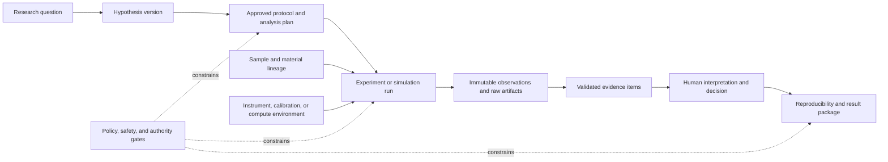

# Scientific Research and Laboratory Operations Agent Blueprint

> **Status:** research-backed production blueprint; Pass 2 complete; not a validated laboratory system or compliance claim  
> **Research date:** 2026-08-31  
> **Scope:** non-clinical scientific research that combines computational work with bounded laboratory operations

This area describes how to build an agent that helps a research team move from a question to a reproducible result package without giving a language model control over scientific truth or laboratory safety.

The agent may organize hypotheses, compile approved protocols into executable plans, coordinate simulations and low-risk instrument runs, reconcile records, validate artifacts, and assemble evidence. It does **not** approve protocols, reinterpret safety boundaries, authorize hazardous actions, decide that a result is scientifically true, or publish on behalf of investigators.

## The boundary that defines this agent

The scientific-research agent is not a literature-only Deep Research agent, a clinical-trial agent, an unrestricted wet-lab robot, or an automated paper author. Its distinctive responsibility is to preserve the relationship among:

1. a versioned research question and hypothesis;
2. an approved protocol and analysis plan;
3. samples, materials, instruments, simulations, and execution attempts;
4. raw observations and derived evidence;
5. uncertainty, deviations, decisions, and reproducibility artifacts; and
6. explicitly authorized digital or physical effects.

The arrows are provenance relationships, not proof. A successful instrument command or scheduler job is an operational observation. It becomes usable evidence only after identity, protocol, artifact, unit, calibration, and domain checks pass. A human investigator owns scientific interpretation.

## Non-negotiable operating contract

The production design inherits the repository's canonical separation of [brain, policy, hands, and session state](../../runtime/execution-boundaries.md), [durable run control](../../runtime/durable-execution.md), [agent state and event contracts](../../runtime/agent-state-and-event-contracts.md), and [effect reconciliation](../../reliability/idempotency-and-side-effects.md).

For this workload, that means:

- the model proposes or classifies; deterministic services enforce protocol, safety, authorization, budgets, schemas, and state transitions;
- the ELN, LIMS, instrument controller, scheduler, code repository, and artifact repository keep their source-of-truth roles;
- every protocol, hypothesis, analysis plan, tool contract, model, policy, sample snapshot, and environment is versioned or content-addressed;
- raw observations are immutable; corrections and reinterpretations append new records;
- observation, evidence, hypothesis, decision, and effect are different record types;
- physical effects are never assumed idempotent and are never blindly retried;
- an ambiguous instrument or sample effect enters `INDETERMINATE` or `SAFETY_HOLD` until reconciled;
- local hardware interlocks, emergency stops, containment controls, and operators remain independent of the agent;
- humans retain protocol changes, hazardous actions, result interpretation, external release, authorship, and publication approval.

## Authority at a glance

| Action | Agent may do | Required authority |
|---|---|---|
| Summarize approved internal records | Yes, with citations and access checks | Existing read entitlement |
| Propose a hypothesis, design, analysis, or protocol change | Yes, explicitly labeled proposal | Investigator review before adoption |
| Compile an approved protocol into a typed run plan | Yes | Policy validation; human approval for configured risk tiers |
| Run simulations or sandboxed analyses | Yes within pinned resources and budget | Approved code/data scope |
| Start a pre-authorized low-risk instrument run | Only after the production gates in this blueprint | Fresh run approval plus independent controller interlocks |
| Retry an uncertain physical command | No | Reconcile first; operator or instrument owner decides |
| Change temperature, pressure, scale, containment, biological system, hazardous material, or stop criteria outside the approved envelope | No | New protocol and safety review |
| Release an emergency stop or safety interlock | Never | Qualified local personnel and facility procedure |
| Declare scientific truth, approve a conclusion, sign a record, or publish | Never | Named human investigator or authorized signatory |

## Evidence grammar

The system must never collapse these classes into one free-text answer:

| Class | Meaning | Example | Can mutate another class? |
|---|---|---|---|
| `observation` | What a source recorded | Detector signal, job exit code, barcode scan | No; append only |
| `evidence_item` | A validated transformation or assessment of observations | Baseline-corrected peak with method and uncertainty | Creates a new item; preserves inputs |
| `hypothesis_version` | A falsifiable claim and its predictions | Treatment changes response relative to control | Superseded, never silently overwritten |
| `decision` | A bounded choice by an identified authority | Repeat run, accept deviation, stop campaign | Produces an event and may authorize an effect |
| `digital_effect` | External digital state change | Create ELN draft, submit compute job | Requires intent, receipt, and reconciliation |
| `physical_effect` | Change to material or equipment state | Start run, move aliquot, dispense material | Requires stronger gates; often irreversible |

## Blueprint map

| Guide | Use it to answer |
|---|---|
| [01 — Mission, boundary, requirements, and authority](01-mission-boundary-requirements-and-authority.md) | What is this system allowed to do, and who remains accountable? |
| [02 — Reference architecture, integrations, and runtime](02-reference-architecture-integrations-and-runtime.md) | Which component owns which fact or action, and how do systems connect? |
| [03 — Hypothesis, protocol, experiment state, and planning](03-hypothesis-protocol-experiment-state-and-planning.md) | How does a question become an approved, recoverable run plan? |
| [04 — Samples, measurements, artifacts, lineage, and reproducibility](04-samples-measurements-artifacts-lineage-and-reproducibility.md) | How are identities, units, uncertainty, provenance, and result packages preserved? |
| [05 — Instruments, simulations, tools, effects, and recovery](05-instruments-simulations-tools-effects-and-recovery.md) | How are physical and digital actions authorized, executed, and reconciled? |
| [06 — Context, memory, security, safety, and data governance](06-context-memory-security-safety-and-data-governance.md) | What reaches the model, what persists, and which controls remain independent? |
| [07 — Observability, evaluation, failure injection, and incidents](07-observability-evaluation-failure-injection-and-incidents.md) | How is behavior measured and how are failures contained? |
| [08 — Deployment, scaling, cost, and continuous evolution](08-deployment-scaling-cost-and-continuous-evolution.md) | How does the service run across projects, facilities, and upgrades? |
| [09 — Zero-to-production stages and exit gates](09-zero-to-production-stages-and-exit-gates.md) | What must be true at stages 0 through 6? |
| [10 — Implementation schemas, checklists, and anti-patterns](10-implementation-schemas-checklists-and-anti-patterns.md) | Which minimum records and review checks should an implementation use? |
| [11 — Integration qualification and worked research flows](11-integration-qualification-and-worked-flows.md) | How are real ELN/LIMS/SDMS, instrument, robotics, HPC, storage, repository, identity, safety, and publication capabilities admitted and exercised? |
| [Research packet](../../research/packets/scientific-research-agent-blueprint.md) | Which sources, contradictions, limitations, and decisions support the blueprint? |

## System-of-record decisions

| Concern | Source of truth | Agent-owned projection |
|---|---|---|
| Approved protocol and signed notebook record | Protocol system or ELN | Immutable reference, version, hash, and allowed envelope |
| Sample identity, location, status, and inventory | LIMS or sample registry | Read-optimized snapshot plus observed lineage events |
| Instrument state and safety | Local controller and facility systems | Capability snapshot and effect receipts |
| Compute job state | Existing scheduler or workflow engine | Semantic run state and output validation |
| Code and environment | Version control, package/container registries | Pinned reproducibility manifest |
| Raw and derived artifacts | Immutable object store or repository | Metadata, hashes, provenance graph, and access policy |
| Research run and effect state | Agent control plane | Durable event log and materialized state |
| Scientific interpretation | Human investigator and governed record | Proposed assessment and cited evidence only |

An adapter may cache a source, but it must not become a silent second authority. Webhook events are invalidation hints: deduplicate them, refetch current state, compare versions, and then update the projection.

## Recommended reading paths

**Product or research lead:** README → 01 → 03 → 09 → 07.  
**Platform or integration engineer:** README → 02 → 11 → 05 → 06 → 08 → 10.  
**Laboratory or safety owner:** README → 01 → 11 → 05 → 06 → 07.  
**Data steward or reproducibility reviewer:** README → 04 → 11 → 06 → 10 → research packet.

## Adoption rule

Start at Stage 0 with retrospective, read-only work. Earn write authority through evidence. Physical authority is optional, narrow, and late: many valuable deployments should remain simulation-, analysis-, and documentation-only permanently.

No stage in this blueprint makes a system generally safe, scientifically valid, or compliant. A real deployment still needs domain-specific validation, facility risk assessment, instrument qualification, institutional policy, and named accountable humans.

## Canonical companion guides

- [Tool contracts](../../tools/tool-contracts.md) and [tool-result contracts](../../tools/tool-results-artifacts-and-provenance.md)
- [Context engineering](../../context-memory/context-engineering.md), [memory architecture](../../context-memory/memory-architecture.md), and [compaction](../../context-memory/compaction-and-continuity.md)
- [Agent threat model](../../security/agent-threat-model.md), [prompt-injection defense](../../security/prompt-injection-and-untrusted-data.md), and [permissions](../../security/permissions-sandboxing-and-secrets.md)
- [Failure taxonomy](../../reliability/failure-taxonomy.md), [trajectory evaluation](../../evaluation/trajectory-and-reliability-evaluation.md), and [observability](../../evaluation/observability-and-tracing.md)
- [Queue architecture](../../operations/queues-scheduling-and-backpressure.md), [deployment](../../operations/deployment-release-and-incident-response.md), [scaling](../../operations/scaling-capacity-and-slos.md), and [cost engineering](../../operations/model-routing-cost-and-latency.md)
