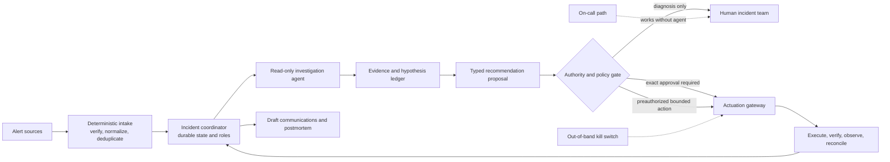
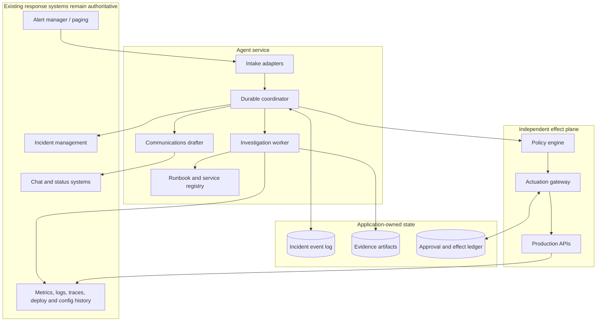
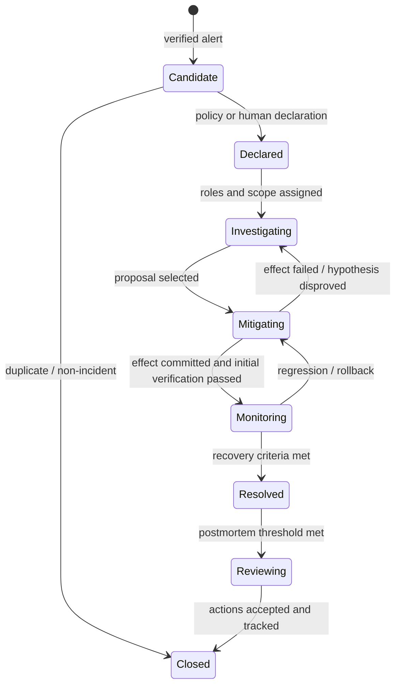

# Production SRE Incident-Response Agent Blueprint

> **Research date:** 2026-08-31  
> **Status:** Production design reference; validate every integration and authority rule in the target environment  
> **Scope:** Alert enrichment, incident coordination, diagnosis, recommendation, tightly gated remediation, communications, and learning—not replacement of the incident commander or on-call organization

## Bottom line

Build the first useful version as a **read-only incident investigator**. Keep alert delivery and the normal on-call path independent of the agent. Give the agent typed, bounded evidence tools; an authoritative incident record; a structured hypothesis ledger; and the ability to draft recommendations with citations. Do not let a model turn confidence into execution authority.

If remediation is later justified by incident-specific evaluation, put it behind a separate deterministic actuation gateway. That gateway—not the model or agent framework—owns authorization, exact-effect approval, current-state validation, idempotency, concurrency control, execution receipts, verification, rollback, and reconciliation after ambiguous outcomes.

The architecture deliberately separates five things that are often blurred:

| Concept | Meaning | What it must not imply |
|---|---|---|
| Diagnosis | A source-backed account of what may be happening | Permission to change anything |
| Recommendation | A typed proposal, risks, rollback, and verification plan | Approval or a shell command to execute |
| Approval | A time-bounded delegation for one canonical effect or action set | General permission for the incident |
| Execution | A policy-valid commit through the effect gateway | Success merely because an API returned `2xx` |
| Verification | Evidence that the intended condition improved without unacceptable harm | Proof of root cause |

## Non-negotiable production invariants

1. **The agent is not the incident commander.** Incident Command, Operations, Communications, and Planning remain organizational roles with explicit human ownership and handoffs.
2. **The agent is not on the critical paging path.** If the model provider, agent service, vector store, or evidence integrations fail, responders still receive the original alert and can operate normally.
3. **Untrusted evidence is data, never instruction.** Logs, tickets, dashboards, runbooks, chat, web pages, and tool output can contain prompt injection or stale operational advice.
4. **Read authority and write authority are separate identities.** A diagnostic worker has no ambient production mutation credential.
5. **Every claim points to evidence.** Record source, query, target, occurrence time, observation time, ingestion time, freshness, trust, and an immutable artifact reference or digest.
6. **Every effect has a stable identity.** Retrying a model turn, workflow step, or HTTP request cannot create a second effect.
7. **Unknown outcomes are explicit.** After a timeout or crash, reconcile by operation ID before retrying; never infer “not applied” from “no response.”
8. **Approvals bind to exact effects.** Canonical parameters, target, environment, preconditions, policy/risk version, approver, expiry, and maximum scope are part of the approval.
9. **Recovery precedes complete causal certainty.** A reversible, evidence-supported mitigation may be correct while the root-cause hypothesis remains open.
10. **Record observable decisions, not hidden reasoning.** Persist evidence references, hypotheses, tests, alternatives, policy decisions, actions, and outcomes. Do not require or expose private chain-of-thought.
11. **The same policy applies under pressure.** Severity may select a previously authorized policy profile, but cannot silently bypass authentication, isolation, or effect accounting.
12. **Automation can always be stopped out of band.** Credential revocation, circuit breakers, and the actuation kill switch must not depend on the model or its control loop.

## Choose the authority level deliberately

| Level | Agent capability | Suitable starting scope | Required evidence before promotion |
|---|---|---|---|
| **D0 — Diagnose** | Gather evidence, maintain timeline and hypotheses, cite uncertainty | Default production launch | Replay and shadow results; evidence quality; no cross-tenant access; graceful tool failure |
| **D1 — Recommend** | Produce typed mitigation, rollback, verification, and communications drafts | Mature read-only deployment | Runbook selection accuracy; unsupported-claim rate; human usefulness; plan completeness |
| **D2 — Approved execute** | Commit only an exact, current, human-approved proposal | Reversible runbook steps with bounded blast radius | Approval binding; policy revalidation; effect idempotency; crash recovery; rollback drills |
| **D3 — Bounded automatic** | Execute a small preauthorized action class under hard budgets | Only low-risk, reversible, well-observed actions | Repeated fault-injection success; low harmful-action rate; circuit breakers; automatic rollback |
| **D4 — Broad autonomous response** | Open-ended diagnosis and remediation | Not the default target of this blueprint | A separate safety case; most organizations should not pursue it |

Promote one **action class** at a time, not “the agent.” Restarting a single stateless canary and changing a global routing policy have different authority levels even if the same model proposes both.

## Guide map

| Guide | The decision it helps make |
|---|---|
| [Requirements, authority, and threat model](requirements-authority-and-threat-model.md) | What the system may do, must never do, and must defend against |
| [Alert intake, deduplication, and incident state](alert-intake-deduplication-and-incident-state.md) | How alerts become durable incidents without losing identity or provenance |
| [Evidence, timelines, hypotheses, and runbooks](evidence-timelines-hypotheses-and-runbooks.md) | How investigation stays source-backed, falsifiable, and useful under pressure |
| [Architecture, runtime, model, and framework choices](architecture-runtime-model-and-framework-choices.md) | Which system shape and implementation stack fit each authority level |
| [Tool contracts, permissions, and isolation](tool-contracts-permissions-and-isolation.md) | How to make evidence and effect boundaries enforceable |
| [Remediation, approvals, effects, and rollback](remediation-approvals-effects-and-rollback.md) | How an approved proposal becomes one safe, verifiable effect |
| [Roles, on-call, communications, and postmortems](incident-roles-on-call-communications-and-postmortems.md) | How the agent supports—rather than disrupts—the response organization |
| [Observability, evaluation, and failure injection](observability-evaluation-and-failure-injection.md) | How to measure safety and capability before increasing authority |
| [Cost, scaling, deployment, and roadmap](cost-scaling-deployment-and-roadmap.md) | How to ship incrementally and operate the service through alert storms |

The [research packet](../../research/packets/sre-incident-response-agent-blueprint.md) records the source inventory, dated version baseline, evidence tensions, and refresh triggers behind these guides.

## Reference system boundary

### What is authoritative

| Data | Authoritative owner | Agent copy |
|---|---|---|
| Alert delivery and escalation | Paging/incident platform | Verified envelope and source IDs |
| Incident phase, roles, decisions, and relationships | Incident event store, synchronized with incident platform | Materialized view for prompting |
| Raw operational telemetry | Observability/deployment/configuration systems | Immutable query result or digest with freshness metadata |
| Hypotheses and recommendations | Incident event store | Model-generated records with evidence references |
| Approval and effect status | Approval/effect ledger | Read-only projection |
| Published external communication | Status/communications platform | Source message ID and approved content digest |
| Model transcript | No operational authority | Debug artifact with retention and redaction policy |

The transcript is not the database. A framework checkpoint is not automatically an audit ledger. A trace is not automatically resumable state. A vector index is not the canonical incident record.

## Category boundary and handoff

This blueprint owns **service restoration coordination**: intake of reliability alerts, declaration support, human command state, cross-domain evidence synthesis, mitigation choice, communications, and learning. It may request work from specialist control planes; it does not inherit their credentials or domain authority.

| Adjacent blueprint | It owns | SRE incident-response agent owns | Required handoff |
|---|---|---|---|
| [Infrastructure operations](../infrastructure-operations-agent/README.md) | Compute, cluster, host, storage, and cloud/platform desired state | Incident priority, acceptable service risk, and recovery objective | Incident ID, exact resource/action request, risk budget, expiry, verification signals; infrastructure returns operation ID and authoritative outcome |
| [Network operations](../network-operations-agent/README.md) | Routing, DNS, network certificates, load balancers, traffic policy, and path evidence | Impact scope and the decision that connectivity mitigation is worth its service risk | A bounded diagnostic question or sealed network proposal; network returns path evidence or its own effect receipt |
| [Database operations](../database-operations-agent/README.md) | SQL, schema, backup/restore, replication, failover, and data integrity | Incident coordination and the service-level recovery criterion | Database target identity, requested recovery objective, data-loss/downtime tolerance, expiry; database authority decides the safe operation |
| [Security investigation](../security-investigation-agent/README.md) | Malicious-activity triage, evidence custody, containment strategy, eradication, and attribution | Reliability incident state and customer-impact coordination | Preserve evidence, freeze conflicting automation, state suspected compromise and affected scope; security owns containment authority |
| [DevOps and deployment](../devops-deployment-agent/README.md) | Artifact promotion, deployment state, rollout control, release freeze, and release recovery | Whether an incident-delegated deployment mitigation serves the recovery objective | Incident role/delegate, immutable revision, exact rollback/pause request, expiry, observation window; deployment returns rollout/effect state |

One incident can cross several domains. Compose separately authorized operations linked by the same incident ID; never create an “incident super-role” with the union of infrastructure, network, database, security, and deployment permissions.

## Architecture variants

| Variant | What it adds | When to use | Principal limit |
|---|---|---|---|
| **A. Read-only copilot** | Intake, evidence queries, timeline, hypotheses, drafts | Start here; organizations with immature runbooks or telemetry | Humans still translate recommendations into effects |
| **B. Durable coordinator** | Long-lived incident workflow, roles, timers, approvals, handoffs | Multi-hour incidents, asynchronous evidence, redeploy-safe operations | Durability alone does not make effects safe |
| **C. Gated remediation** | Independent policy/actuation gateway and exact approvals | Reversible, well-specified D2 runbooks | More integration and verification work |
| **D. Bounded automatic actions** | Preauthorized D3 action classes with budgets and rollback | High-volume, low-risk, repeatedly evaluated mitigations | Safety case is action-specific and can decay |

Variants are cumulative only where useful. A small organization may run Variant A with a thin service indefinitely. A workflow engine, graph library, agent SDK, and tool protocol solve different problems and may be combined; none removes the need for application-owned security and effect semantics.

## Smallest useful implementation

The first release needs only six capabilities:

1. accept a verified alert copy **after** the ordinary paging path;
2. resolve one service from the catalog and fetch its owner, SLO, current runbook metadata, and recent changes;
3. run two or three bounded, read-only telemetry queries;
4. persist evidence, a short timeline, hypotheses, and unknowns in the incident record;
5. post one cited enrichment through the incident platform; and
6. stop with `needs_human`, `insufficient_evidence`, `tool_unavailable`, or `budget_exhausted` when it cannot help safely.

Use an ordinary service, relational database, queue, object store, and typed adapters. Do **not** add a vector database, workflow engine, MCP layer, multi-agent topology, or production write path until a measured need appears. Deterministic alerting and reviewed runbooks may remain the best solution for known failure modes; the model is justified only where heterogeneous evidence and uncertainty make fixed automation insufficient.

## A minimal useful incident loop

Incident merge and split are explicit relationships, not destructive rewrites. Evidence, decisions, and effects keep their original incident and correlation identities.

## Build-versus-framework decision

Use the smallest layer that solves a demonstrated problem:

| Need | Practical default | Do not mistake it for |
|---|---|---|
| A bounded D0 evidence loop | Thin custom loop plus typed provider client | Durable workflow or policy engine |
| Provider adapters, tool calling, traces | Agent SDK/framework | Authorization, audit, or exactly-once effects |
| Explicit investigation states and human interrupts | Graph/state-machine library | Crash-safe timers and commits unless proven |
| Hours-long waits, approvals, retries, and redeploy recovery | Durable workflow engine | Semantic idempotency or current-state validation |
| Cross-tool discovery and invocation | A pinned tool protocol such as MCP | Trust, tenant isolation, or effect safety |
| Production mutation | Dedicated actuation gateway | A generic `run_shell` tool |

See [Custom Loop vs Framework vs Workflow Engine](../../comparisons/custom-loop-vs-framework-vs-workflow-engine.md), [Durable Execution](../../runtime/durable-execution.md), and [Agent State and Event Contracts](../../runtime/agent-state-and-event-contracts.md) for the underlying runtime patterns.

## Launch checklist

Before exposing the agent to a real page:

- [ ] The ordinary page, escalation, incident declaration, and response channels work when the agent is unavailable.
- [ ] Incoming signatures, replay windows, tenant binding, and source identities are verified before parsing content.
- [ ] Delivery deduplication, alert fingerprinting, notification grouping, and incident correlation are separate mechanisms.
- [ ] Read tools enforce tenant, service, environment, time range, row/byte, sensitivity, and rate limits outside the prompt.
- [ ] Retrieved content is labeled and treated as untrusted.
- [ ] The incident event log, evidence artifacts, hypothesis ledger, approval ledger, and effect ledger have explicit owners and retention.
- [ ] No diagnostic identity can mutate production.
- [ ] Every recommendation carries evidence, assumptions, blast radius, preconditions, verification, abort, and rollback information.
- [ ] Every mutation has a canonical plan, stable operation ID, exact authorization, commit-time revalidation, receipt, and reconciliation path.
- [ ] External communications require fact and audience checks; speculative causal claims are labeled or removed.
- [ ] Incident-specific replay, shadow, fault-injection, security, cost, and repeated stochastic evaluations pass by authority level.
- [ ] Operators have an out-of-band kill switch, credential revocation procedure, and manual takeover path.

## Version and limitation note

The research baseline includes NIST SP 800-61 Rev. 3 (April 2025), CloudEvents 1.0.2, W3C Trace Context Recommendation (2021), OpenTelemetry semantic conventions 1.44.0, Prometheus Alertmanager 0.32.1, the final MCP 2025-11-25 specification, the draft MCP 2026-07-28 release candidate, OWASP’s 2026 Agentic Applications list, and current vendor documentation as of the research date. These versions establish a review point, not a promise of compatibility. Do not deploy against release-candidate protocol behavior without explicit compatibility tests and an upgrade/rollback decision.

Refresh this blueprint when an incident or near miss violates an invariant; an integration changes authentication, event, retry, approval, or dry-run semantics; a model or harness changes; a benchmark reveals a new failure mode; or an action class is promoted to greater authority.

## Core sources

- [Google SRE: Managing Incidents](https://sre.google/sre-book/managing-incidents/)
- [Google SRE Workbook: Incident Response](https://sre.google/workbook/incident-response/)
- [Google SRE: Effective Troubleshooting](https://sre.google/sre-book/effective-troubleshooting/)
- [Google SRE: AI in Reliability Engineering—2026 Practitioner’s Guide](https://sre.google/resources/practices-and-processes/ai-engineering-reliable-operations/)
- [NIST SP 800-61 Rev. 3](https://doi.org/10.6028/NIST.SP.800-61r3)
- [PagerDuty Incident Response Documentation](https://response.pagerduty.com/)
- [Prometheus Alertmanager](https://prometheus.io/docs/alerting/latest/alertmanager/)
- [OWASP Top 10 for Agentic Applications 2026](https://genai.owasp.org/resource/owasp-top-10-for-agentic-applications-for-2026/)
