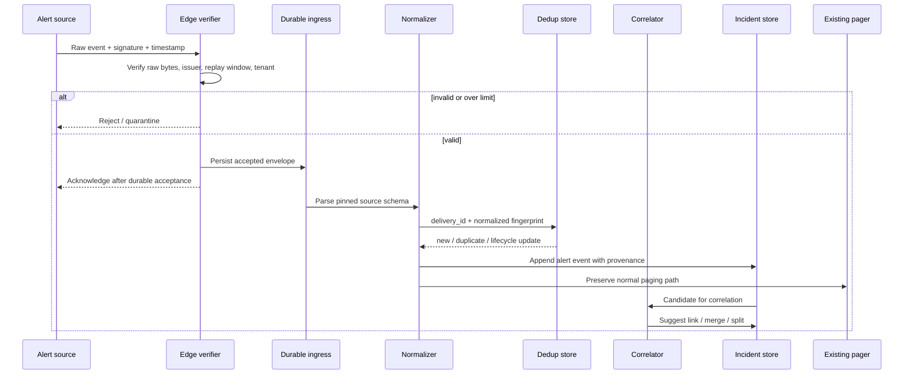

# Alert Intake, Deduplication, and Incident State

> **Research date:** 2026-08-31  
> **Primary decision:** Preserve distinct identities for delivery, alert, notification, correlation, and incident state.

## 1. Why this layer is deterministic

Alert intake is an adversarial, bursty protocol problem. Signature verification, replay rejection, normalization, durable acceptance, deduplication windows, routing, and backpressure should not depend on a model. The model may help correlate ambiguous symptoms after intake, but it must not decide whether a forged event is trusted or whether a transport retry creates a second durable fact.

Prometheus Alertmanager deduplicates alerts, groups them, routes notifications, silences them, and applies inhibition. PagerDuty’s Events API can deduplicate events with a case-sensitive `dedup_key` within a service integration. Those mechanisms are useful, but neither is equivalent to semantic incident correlation. An agent that collapses these layers will eventually hide a distinct incident or multiply one effect.

## 2. Keep the identifiers separate

| Identifier | Answers | Example owner | Reuse rule |
|---|---|---|---|
| `delivery_id` | Is this the same webhook/message delivery? | Transport adapter | Same signed event/retry only |
| `source_alert_id` | Which alert object did the source create? | Alerting system | Source-defined lifecycle |
| `alert_fingerprint` | Are labels and condition semantically the same alert? | Intake normalization policy | Stable normalized rule/labels/environment |
| `dedup_key` | Which trigger/acknowledge/resolve updates belong together? | Paging integration | Integration-specific and case-sensitive where specified |
| `notification_group_id` | Which alerts share one notification cadence? | Alert manager | Routing/grouping policy |
| `correlation_group_id` | Which signals may share a failure mechanism? | Correlator | Revisable hypothesis, never destructive |
| `incident_id` | Which declared coordination record owns roles and decisions? | Incident system | Durable until closure |
| `relationship_id` | Was an incident merged, split, caused by, or related to another? | Incident event store | Append-only relation history |
| `run_id` / `attempt_id` | Which orchestration and retry produced work? | Coordinator | New attempt, same logical run where appropriate |
| `operation_id` | Which one intended production effect is this? | Actuation gateway | Stable across retries and recovery |
| `trace_id` / `span_id` | Which technical request path is correlated? | Telemetry | Observability only; not business identity |

W3C Trace Context propagates request trace identity. CloudEvents standardizes an event envelope. Neither supplies incident correlation, approval semantics, or effect idempotency; model those explicitly.

## 3. Intake pipeline



### Required stages

1. **Verify before parsing:** validate signature on the original bytes, accepted algorithm/version, timestamp or nonce, replay window, sender/issuer, audience, tenant, content type, and size.
2. **Durably accept:** acknowledge only after the event can survive a process crash. Use the source’s retry contract; bounded duplicates are expected.
3. **Normalize without erasing:** retain the raw artifact/digest and source schema version while mapping to the application envelope.
4. **Deduplicate delivery:** atomically insert or detect `delivery_id`. A duplicate may still update receipt counters but must not repeat downstream effects.
5. **Apply alert lifecycle:** trigger, acknowledge, suppress, and resolve are state transitions on the source alert—not new incidents by default.
6. **Route independently:** the agent can enrich the incident asynchronously; it cannot delay paging.
7. **Correlate conservatively:** propose an incident link with reasons and confidence. Allow humans and deterministic rules to split or merge later.

### Pin an adapter manifest

Do not implement a generic “webhook receiver” and assume sources behave alike. Keep a tested manifest per deployed adapter:

| Field | Example question |
|---|---|
| Source/version and schema | Which webhook/API revision and event types are accepted? Are unknown fields tolerated? |
| Authentication | HMAC over raw bytes, mTLS, OAuth audience, IP restriction, or another mechanism? How is secret rotation handled? |
| Delivery identity | Which field/header remains stable across retries or redelivery? |
| Acknowledgment deadline | How quickly must durable acceptance return, and which response codes cause retry/drop? |
| Retry/redelivery | Automatic retry schedule, maximum age, manual redelivery, ordering, and duplicate behavior |
| Lifecycle semantics | How do trigger, acknowledge, resolve, reopen, merge, split, and delete behave? |
| Gaps and truncation | Can events be dropped, details omitted, subscriptions disabled, batches truncated, or delivery throttled? |
| Recovery query | Which read API can fill a detected delivery gap, and for how long? |
| Rate and size limits | Published limit plus the locally tested safe envelope |
| Ownership and test date | Named owner, fixture digest, deployed version, and last successful contract test |

Current examples show why this matters:

- PagerDuty v3 webhooks are at-least-once; `X-Webhook-Id` is stable across attempts. PagerDuty documents ordered delivery for an extension/incident pair, retry for specified temporary errors for up to 48 hours, and possible subscription disablement after repeated dropped deliveries. Persist then return `202`; monitor the subscription and reconcile gaps from the incident API.
- Prometheus Alertmanager HA deliberately fails open and favors duplicate notifications over missed alerts. Its generic webhook payload includes a `groupKey`, per-alert `fingerprint`, `truncatedAlerts`, and lifecycle status. Treat duplicates and truncation as ordinary states, not exceptional corruption.
- GitHub supplies a globally unique `X-GitHub-Delivery`, signs the raw body when a secret is configured, may deliver out of order, and does **not** automatically redeliver a failed webhook. A change-feed adapter therefore needs a scheduled failed-delivery audit or authoritative history query; waiting for an automatic retry loses evidence.

These are dated examples, not a portable abstraction. Re-run fixture, authentication, timeout, retry, ordering, truncation, and gap-recovery tests against the deployed plan/version before relying on any adapter.

### A practical event envelope

```json
{
  "event_id": "evt_...",
  "event_type": "alert.triggered",
  "schema_version": 3,
  "source": "prometheus/prod-us",
  "source_alert_id": "...",
  "delivery_id": "...",
  "tenant_id": "...",
  "service_id": "checkout-api",
  "environment": "prod",
  "severity": "critical",
  "occurred_at": "...",
  "observed_at": "...",
  "ingested_at": "...",
  "alert_fingerprint": "sha256:...",
  "trace_context": {"traceparent": "..."},
  "payload_artifact": "artifact://...",
  "payload_digest": "sha256:..."
}
```

The envelope should be based on an application schema, even if CloudEvents is used on the wire. Validate enum and timestamp semantics; do not accept arbitrary labels into routing or authorization policy.

## 4. Deduplication, grouping, and correlation

| Mechanism | Typical key | Time behavior | Failure if over-aggressive | Failure if under-aggressive |
|---|---|---|---|---|
| Delivery dedup | Signed event/message ID | Transport retry window | Drop legitimate reused IDs from a broken source | Duplicate processing |
| Alert fingerprint | Rule + stable labels + environment | Alert lifecycle | Hide distinct target or symptom | Alert cardinality explosion |
| Notification grouping | Configured group labels | `group_wait` / repeat cadence | Delay or hide distinct urgent notifications | Page flood |
| Inhibition/silence | Matcher plus source condition or operator rule | Policy interval | Suppress an independent failure | Redundant pages |
| Incident correlation | Topology, timing, changes, shared dependencies, causal evidence | Revisable across incident | Anchor on a false shared cause | Fragment response and duplicate mitigation |

Prometheus documents that grouping waits can collect related alerts and that inhibition suppresses a target when a matching source alert is firing. This is notification behavior, not proof of common causality. PagerDuty documents `dedup_key` behavior within the integration that receives it; the same key across different integrations does not establish one incident.

### Correlation features

Use a scored, explainable feature set rather than raw semantic similarity alone:

- exact tenant, environment, and service identity;
- shared dependency or recent topology edge;
- overlapping occurrence windows, adjusted for ingestion lag;
- common deployment/configuration/change identifier;
- matching SLO or user journey;
- correlated trace exemplars;
- known suppression/maintenance relationship;
- historical co-occurrence, with recency and validation metadata;
- contradictory evidence such as different regions, error modes, or recovery times.

The correlator outputs a proposal: candidate incident, feature contributions, contradictions, and expiry. It never rewrites original alert identities. Record human merge/split corrections as training and evaluation data after privacy review.

## 5. Incident state and event contracts

Use an append-oriented domain event log plus materialized views. The event log is not necessarily a general event-sourcing platform; it is a reliable record of state transitions and actor intent.

### Core aggregates

| Aggregate | Minimum fields |
|---|---|
| Incident | ID, tenant, title, phase, severity, declared/resolved times, commander, operations lead, communications lead, scribe/planning owner, impacted services/journeys, current authority profile, state version |
| Alert link | Source IDs, fingerprint, lifecycle, relation to incident, correlation reasons, linked/unlinked actor and time |
| Timeline event | Occurred/observed/recorded time, type, actor, source, summary, evidence/effect references, visibility |
| Evidence | Query and target, interval, source, trust, freshness, artifact/digest, sensitivity, result status |
| Hypothesis | Claim, support, contradiction, predicted observations, next test, confidence, status, owner |
| Proposal | Canonical plan, target, parameters, risks, preconditions, approval class, verification, abort, rollback, expiry |
| Approval | Proposal digest, policy/state versions, approver/delegation, scope, decision, expiry, consumed state |
| Effect | Operation ID, proposal/approval, attempt, provider request, status, receipt, verification, rollback relation |
| Communication | Audience, source facts, draft digest, reviewer, published message ID, correction relation |

### Contract invariants and a decision record

All domain records use a shared envelope: `record_id`, `record_type`, `schema_version`, `tenant_id`, `incident_id`, `actor`, `occurred_at`, `recorded_at`, `state_version`, `causation_id`, `correlation_id`, `visibility`, and `payload`. Producers reject unknown major schema versions; consumers ignore documented additive fields. State-changing commands carry `expected_state_version` and a stable `command_id` so a delivery retry yields the prior result rather than a second transition.

```yaml
record_type: incident.decision.recorded
schema_version: 2
record_id: dec_01J...
tenant_id: tenant_a
incident_id: inc_01J...
command_id: cmd_01J...       # stable across delivery retries
expected_state_version: 41
actor:
  subject: user_123
  incident_role: incident_commander
  assurance: phishing-resistant-mfa
occurred_at: "2026-08-31T14:24:00Z"
recorded_at: "2026-08-31T14:24:02Z"
payload:
  decision: "Use a two-instance rollback canary"
  decision_class: mitigation_selection
  status: active
  evidence_ids: [ev_142, ev_151]
  hypothesis_ids: [hyp_17]
  proposal_id: prop_8
  alternatives:
    - option: "Continue observation"
      rejection_reason: "Impact is still growing"
  authority_basis: "IC selected objective; Operations owns technical execution"
  assumptions: ["At least eight healthy prior-version instances remain"]
  review_trigger: "canary guardrail breach or 10-minute observation complete"
  supersedes: null
```

The decision record does not approve the proposal. The approval and effect records refer to it but keep separate authority and lifecycle. Corrections and reversals append `decision.corrected`, `decision.superseded`, or `decision.revoked`; they never edit the original record in place.

### State transition rules

- Only allowed actors and policies may change phase, severity, or role ownership.
- Transitions use optimistic concurrency or a compare-and-set on `state_version`.
- Corrections append a correction event; they do not silently edit historical events.
- Incident merge/split creates relationship events and migration views. Effects retain their original incident ID.
- `resolved` means recovery criteria are met, not necessarily that root cause is certain.
- Reopening creates an explicit event and preserves the prior recovery decision.

## 6. Ordering and time semantics

Operational data is late and out of order. Store at least:

- `occurred_at`: when the source says the event happened;
- `observed_at`: when the collecting system observed it;
- `ingested_at`: when the incident platform accepted it;
- `recorded_at`: when this domain record was committed.

Never sort solely by arrival time. Show uncertainty when source clocks are untrusted. Preserve the original timezone/offset where useful, normalize to UTC for computation, and record clock-skew signals. OpenTelemetry’s log data model distinguishes event time from observation time; follow that distinction even when an integration provides only one.

## 7. Storm behavior and backpressure

During an alert storm, the agent should become less expensive and more conservative while the on-call path remains intact:

1. Reserve capacity for already-declared high-severity incidents.
2. Coalesce investigation work by incident candidate and evidence query, not just by alert count.
3. Apply per-tenant, per-source, and global admission limits.
4. Prioritize deterministic enrichment and cached service context before model calls.
5. Bound model turns, tool calls, query intervals, bytes, and artifact retention.
6. Defer low-severity summarization and historical-similarity searches.
7. Surface dropped/deferred enrichment explicitly; never imply “no evidence.”
8. Protect downstream telemetry and incident APIs with concurrency limits and circuit breakers.

## 8. Intake acceptance tests

- A valid webhook retry is acknowledged but produces one durable alert transition.
- A duplicate arrives after a worker crash but before acknowledgment; processing remains single-logical-event.
- An event with a valid body but invalid raw-byte signature is rejected.
- A signed event outside the replay window is quarantined.
- Same fingerprint in two tenants never shares an incident, cache entry, or artifact.
- Same PagerDuty-style dedup key on two integrations remains source-distinct.
- Alertmanager grouping changes notification cadence without altering incident correlation.
- Out-of-order resolve then trigger produces a policy-defined lifecycle and an audit warning.
- A fingerprint collision can be split without deleting evidence or effect history.
- Agent/model outage does not delay the source page.
- A PagerDuty-style webhook is delivered twice with one `X-Webhook-Id`; only one domain command is applied.
- A source disables or drops webhook delivery; the gap detector reconciles authoritative history and marks the interval incomplete until caught up.
- An Alertmanager webhook reports `truncatedAlerts > 0`; the incident shows incomplete alert coverage and retrieves or links the missing source state.
- A GitHub change webhook fails once; scheduled delivery audit detects the failure instead of assuming automatic redelivery.
- Alert storm shedding preserves high-severity intake and exposes deferred work.
- Clock skew is visible and does not silently invert the evidence timeline.

## 9. Sources and related guides

- [Prometheus Alertmanager overview](https://prometheus.io/docs/alerting/latest/alertmanager/)
- [Prometheus Alertmanager configuration](https://prometheus.io/docs/alerting/latest/configuration/)
- [Prometheus Alertmanager high availability](https://prometheus.io/docs/alerting/latest/high_availability/)
- [PagerDuty Event Management](https://support.pagerduty.com/main/docs/event-management)
- [PagerDuty Incidents](https://support.pagerduty.com/main/docs/incidents)
- [PagerDuty webhook behavior](https://github.com/PagerDuty/developer-docs/blob/main/docs/webhooks/02-Behavior.md)
- [PagerDuty webhook signature verification](https://github.com/PagerDuty/developer-docs/blob/main/docs/webhooks/04-Signatures.md)
- [CloudEvents specification](https://github.com/cloudevents/spec)
- [GitHub webhook best practices](https://docs.github.com/en/webhooks/using-webhooks/best-practices-for-using-webhooks)
- [GitHub failed webhook delivery](https://docs.github.com/en/webhooks/using-webhooks/handling-failed-webhook-deliveries)
- [W3C Trace Context](https://www.w3.org/TR/trace-context/)
- [OpenTelemetry Logs data model](https://opentelemetry.io/docs/specs/otel/logs/data-model/)
- [Agent State and Event Contracts](../../runtime/agent-state-and-event-contracts.md)
- [Run Controls](../../runtime/run-controls.md)
