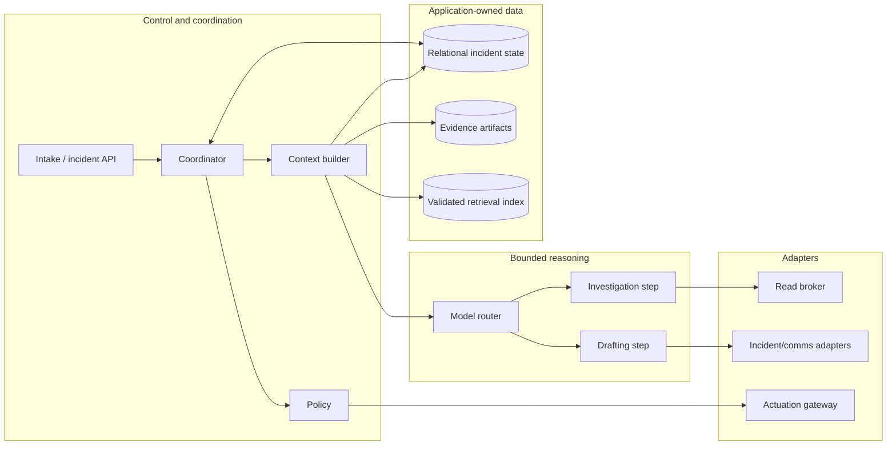
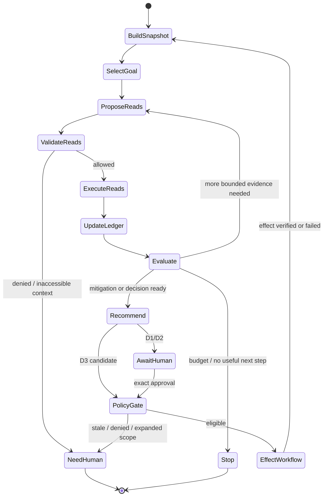

# Architecture, Runtime, Model, and Framework Choices

> **Research date:** 2026-08-31  
> **Primary decision:** Use a simple read-only service first; add durable workflow and isolated actuation only when authority and incident duration require them.

## 1. Recommended architecture

For most teams, the best practical production shape is a **modular service with deterministic boundaries**, not a society of agents:

- deterministic intake and event normalization;
- one incident coordinator over application-owned durable state;
- one investigation worker that may fan out bounded read tools in parallel;
- deterministic context assembly and policy enforcement;
- a model-backed reasoning step for hypotheses, query selection, summaries, and recommendations;
- a separate communications drafting path;
- an independently deployed actuation gateway only for D2/D3 actions.

Split these into independently deployed services only when scaling, security, ownership, or availability boundaries justify it. A modular monolith plus queue, relational database, and object store is a credible D0/D1 starting point.

## 2. Variant selection

| Requirement | Thin custom loop | Agent SDK/framework | Graph/state machine | Durable workflow | Independent gateway |
|---|---:|---:|---:|---:|---:|
| Bounded D0 evidence turn | Excellent | Good | Optional | Usually unnecessary | No |
| Provider/tool adapter convenience | Manual | Excellent | Good | Weak | No |
| Explicit branching and interrupts | Manual | Varies | Excellent | Good | No |
| Multi-hour approval wait | Fragile | Varies | Varies | Excellent | No |
| Resume across crash/redeploy | Must build | Varies | Varies | Excellent when configured correctly | Effect state still separate |
| Semantic effect idempotency | Must build | Must build | Must build | Must build | Own here |
| Authorization and blast radius | Must build | Must build | Must build | Must build | Own here |
| Audit-grade effect receipt | Must build | Must build | Must build | Orchestrates | Own here |

### Decision rule

- **D0/D1, short turns:** use a thin custom loop or a small SDK integration.
- **Complex but bounded investigation:** add an explicit graph when state transitions and human interrupts are hard to reason about in ordinary code.
- **Incidents spanning process lifetimes:** add durable workflow for timers, waits, retries, cancellation, and resume.
- **Any production mutation:** add the gateway regardless of orchestration choice.
- **Tool protocol:** use one only when interoperability pays for the extra trust and version boundary.

A hybrid is often appropriate: SDK for model/tool mechanics, durable workflow for incident lifecycle, ordinary application code for domain state, and the gateway for effects. “Hybrid” does not mean every layer is mandatory.

## 3. Framework convenience versus application guarantees

| A framework may provide | The application must still prove |
|---|---|
| Tool schema declaration | Semantic validation, authorization, tenant binding, data classification, and effect class |
| Checkpoint or thread persistence | Canonical domain state, schema migration, replay semantics, retention, and audit integrity |
| Automatic tool retry | Retry safety, idempotency key reuse, ambiguity reconciliation, and retry budget |
| Human-in-the-loop pause | Exact approval binding, approver authority, expiry, separation of duties, and commit-time revalidation |
| Tracing | Incident/effect correlation, secret redaction, evidence provenance, sampling, and retention |
| Guardrail or policy hook | Enforcement outside model control, fail-closed behavior, and policy versioning |
| Multi-agent handoff | Ownership, shared-state consistency, cancellation, cost budget, and conflict resolution |
| Memory/retrieval | Source authority, tenant filters, freshness, deletion, poisoning defense, and evaluation |
| MCP/tool discovery | Server trust, authorization, version pinning, output validation, and effect safety |
| Structured output | Correct meaning, current state, completeness, and authorization |

Do not place safety-critical invariants only in prompts, callbacks that a path can bypass, or provider-specific conversation state.

## 4. Control-loop shape

Set hard limits on model turns, built-in and custom tool calls, parallelism, elapsed time, tokens, query bytes, targets, retries, and cost. Terminal states include `completed`, `needs_human`, `insufficient_evidence`, `budget_exhausted`, `cancelled`, `policy_denied`, `tool_unavailable`, and `effect_outcome_unknown`.

The model selects among safe operations. Deterministic code validates and executes them. A loop never treats “no further tool call” as evidence that a mutation succeeded.

## 5. Language and runtime choice

Choose the language the operating team can secure, profile, test, and support at 03:00. Do not introduce a polyglot architecture merely because model examples favor Python.

| Situation | Practical fit | Notes |
|---|---|---|
| Integration-heavy API/coordinator; team strong in web/backend TypeScript | TypeScript on a supported Node.js LTS | Strong schemas and ecosystem; validate runtime cancellation and workflow SDK behavior |
| Data/ML-heavy evidence analysis; mature Python operations | Supported Python release | Excellent analytics and provider libraries; isolate CPU-heavy or untrusted processing |
| High-throughput, low-overhead intake or gateway; strong Go team | Supported Go release | Good concurrency and static deployment; model ecosystem may require more adapter work |
| Existing JVM/.NET operational platform | Existing supported runtime | Reuse identity, telemetry, reliability, and on-call knowledge instead of adding a new stack |

A reasonable greenfield baseline for an integration-heavy team is one TypeScript/Node service, a relational database, a queue, and object storage. Add an isolated Python worker only when a real analytics dependency warrants it. Add Go for the gateway only when performance/security ownership justifies a separate service. These are examples, not universal recommendations.

### Runtime requirements

- structured concurrency and cancellation propagation;
- per-operation deadlines and bounded connection pools;
- graceful shutdown that stops new work and durably hands off in-flight work;
- schema migrations for domain state and model/tool contracts;
- workload identity and secretless short-lived credentials where possible;
- deterministic time and ID injection in tests;
- memory/CPU limits for adapters and artifact processing;
- OpenTelemetry-compatible logs, metrics, and traces without making telemetry the source of truth.

See [Choosing an Agent Runtime Language](../../languages/choosing-an-agent-runtime-language.md).

## 6. Model portfolio and routing

Do not use a model where deterministic code is more reliable:

| Work | Preferred mechanism |
|---|---|
| Signature validation, dedup, routing, time math, policy, approvals, state transitions, aggregation | Deterministic code |
| Alert/title extraction against a fixed schema | Deterministic parser first; small model only for genuinely unstructured sources |
| Evidence summarization and communications draft | Fast, lower-cost model after sensitivity policy |
| Cross-source hypothesis formation and recommendation | More capable reasoning model with bounded read tools |
| Risk/authority decision | Deterministic policy using typed proposal; model may annotate hazards |
| Query execution, effect commit, receipt verification | Typed tools and provider APIs |

Route using task, tenant/data rules, severity, latency budget, context size, availability, evaluated quality, and action risk. Do not route based only on the model’s self-reported confidence. Pin model identifiers or controlled aliases, record the full harness version, and run regression/canary evaluation before changing either.

Current official OpenAI guidance, used here only as a vendor example, directs reasoning, tool-calling, and multi-turn workflows to the Responses API and recommends explicit autonomy/approval boundaries plus representative quality, latency, token, and cost evaluation. The API exposes structured outputs, tool selection, parallel-call control, output limits, and a `max_tool_calls` limit for built-in tools. These controls do not validate operational meaning or authorize an effect; custom-tool fan-out still needs application limits. Revalidate the exact model and API contract before implementation.

### Context and provider controls

- Send the minimum sensitive evidence necessary; prefer private/regional deployment options when policy requires them.
- Set explicit output and tool-call limits.
- Treat provider conversation storage as optional transport state, not the incident record.
- Treat provider-managed compaction or truncation as a derived working view. Automatic truncation can drop older items; safety-critical incident state must be recompiled from canonical records and verified after compaction.
- Record provider, model, release/snapshot, parameters, prompt bundle, tool registry, and policy versions.
- Use provider failover only after evaluating semantic and safety differences. A fallback model can be worse than `needs_human`.
- Do not require raw or hidden chain-of-thought. Persist concise observable decision summaries and evidence links.

## 7. Single agent versus multiple agents

Default to one coordinator and one investigation policy with deterministic parallel reads. Add specialized agents only if evaluation shows a specific improvement, such as independent evidence critique or communications isolation.

| Pattern | Potential value | Production cost/risk |
|---|---|---|
| Parallel read fan-out | Reduces evidence latency | Query load and context merge; easy to bound deterministically |
| Independent hypothesis critic | May reduce anchoring | Extra latency/cost; shared evidence can still share bias |
| Separate communications drafter | Different audience policy and data access | State consistency and approval workflow |
| Competing remediation agents | Diversity | Conflict resolution, duplicated effects, confusing authority; generally avoid |
| Hierarchical “incident commander agent” | Superficially mirrors roles | Misrepresents human accountability and adds coordination failure modes |

Human incident roles do not need one software agent each. Model topology and organization topology solve different problems.

## 8. Protocol choice and MCP boundary

MCP can standardize tool discovery and invocation across adapters. As of the research date, `2025-11-25` is the latest final protocol release; its Tasks capability is explicitly experimental. `2026-07-28` is an official release candidate whose stateless-core changes remain draft and whose SDK adoption varies. Do not describe or deploy RC behavior as a stable baseline. In every version, MCP still does not make a tool trusted or an effect safe.

If MCP is used:

- pin the protocol version and server/tool registry;
- run negotiation and conformance fixtures for the exact client/server SDK versions; fail closed on an unsupported version instead of silently changing semantics;
- validate server identity and authorization audience;
- never pass upstream tokens through to downstream resources;
- treat tool descriptions, annotations, `_meta`, and results as untrusted input;
- enforce tenant, read/write class, targets, budgets, and schemas at an application broker;
- convert protocol calls into application operation IDs and receipts;
- keep approval, durable incident state, and semantic idempotency outside the protocol session;
- test reconnect/session or stateless behavior for the pinned revision, task authorization/context binding where experimental Tasks are used, cancellation, duplicate delivery, version negotiation, and late results.

For a small number of internal APIs, ordinary typed adapters may be simpler and safer.

## 9. Deployment topology

Use separate security identities and, when warranted, separate network zones:

1. **Ingress identity:** accept verified source events; cannot query telemetry or mutate production.
2. **Read-broker identity:** can perform scoped, bounded reads; cannot mutate.
3. **Coordinator identity:** can update incident records and enqueue work; has no production credential.
4. **Actuation identity:** exists only in the isolated gateway and is scoped by action class/target.
5. **Communications identity:** can draft internally; publication capability is separately gated by audience.

High availability should protect intake and durable state first. Model calls and historical retrieval can degrade. Prefer at-least-once delivery plus application idempotency; “exactly once” infrastructure claims do not remove semantic duplicate handling.

## 10. Architecture review checklist

- [ ] The model can be removed and manual response still works.
- [ ] Domain state can be reconstructed without provider conversation history.
- [ ] A retry after any crash cannot duplicate an effect.
- [ ] A framework upgrade cannot bypass policy or silently change state semantics.
- [ ] Read and write identities are distinct and auditable.
- [ ] Every long wait and human interrupt survives restart or explicitly times out safely.
- [ ] Model, prompt, tool, policy, runbook, and schema versions are traceable.
- [ ] Fallback models and degraded modes are evaluated, not assumed equivalent.
- [ ] Multi-agent complexity has a measured benefit and a defined conflict policy.
- [ ] Protocol or framework metadata is treated as untrusted at the boundary.

## 11. Sources and related guides

- [Google SRE: AI in Reliability Engineering—2026 Practitioner’s Guide](https://sre.google/resources/practices-and-processes/ai-engineering-reliable-operations/)
- [MCP 2025-11-25 final specification](https://modelcontextprotocol.io/specification/2025-11-25)
- [MCP 2025-11-25 Tasks](https://modelcontextprotocol.io/specification/2025-11-25/basic/utilities/tasks) — experimental
- [MCP releases](https://github.com/modelcontextprotocol/modelcontextprotocol/releases) — records `2026-07-28` as an RC/draft at the research date
- [MCP 2025-11-25 authorization](https://modelcontextprotocol.io/specification/2025-11-25/basic/authorization)
- [OpenAI model selection and agent guidance](https://developers.openai.com/api/docs/guides/latest-model)
- [OpenAI Responses API reference](https://developers.openai.com/api/reference/cli/resources/responses/methods/create)
- [Custom Loop vs Framework vs Workflow Engine](../../comparisons/custom-loop-vs-framework-vs-workflow-engine.md)
- [Durable Execution](../../runtime/durable-execution.md)
- [Run Controls](../../runtime/run-controls.md)
- [Model Routing, Cost, and Latency](../../operations/model-routing-cost-and-latency.md)
