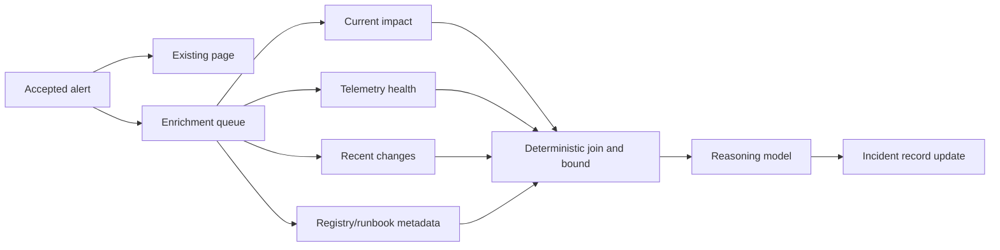

# Cost, Scaling, Deployment, and Roadmap

> **Research date:** 2026-08-31  
> **Primary decision:** Ship usefulness before authority, preserve capacity during storms, and promote action classes only through evidence-backed gates.

## 1. Performance objectives

An incident agent has several latency budgets, not one:

| Budget | Starts | Ends | Degraded behavior |
|---|---|---|---|
| Intake acceptance | Event received | Durable accepted/rejected response | Queue after verification; never wait for model |
| Page delivery | Alert policy fires | Human receives page | Existing path, independent of agent |
| First useful enrichment | Durable incident candidate | Cited scope/change/runbook evidence visible | Return deterministic context and explicit pending/failed sources |
| Investigation turn | Goal selected | Hypothesis/evidence update | Bound tools/model calls and stop with next human question |
| Proposal preparation | Mitigation chosen | Canonical plan/dry-run/risk ready | Human-only procedure when provider or policy data is incomplete |
| Approval | Proposal ready | Exact decision or expiry | Timers/escalation; no automatic inference |
| Effect commit | Valid commit request | Receipt, definitive failure, or unknown outcome | Reconcile; never blind retry |
| Verification | Effect receipt | Postcondition/guardrail decision | Remain in observation or escalate |

Google reports a roughly two-minute target for one internal AI alert-enrichment system. Treat that as an attributed design example, not a universal objective. Set budgets from the organization’s page urgency, evidence-source latency, human workflow, and SLOs.

## 2. Critical path and parallelism

Keep these off the critical paging path:

- model calls;
- historical incident retrieval;
- expensive logs/traces search;
- postmortem synthesis;
- communications polish;
- nonessential topology enrichment.

After durable intake, run independent bounded reads in parallel when downstream capacity allows: current impact, telemetry health, recent changes, ownership, and runbook metadata. Use deterministic aggregation to reduce prompt size. Do not parallelize effect commits that share a conflict domain.



## 3. Cost model

Measure cost per incident and phase:

```text
total_cost = model_input + model_output + provider_tool_calls
           + telemetry_queries + workflow/state + artifact_storage
           + indexing/retrieval + human_review + evaluation/amortized_operations
```

Model token price is only one component. Unbounded observability queries can cost more and harm production telemetry systems. Human time remains important: a cheap but noisy agent can be operationally expensive.

### Cost controls

- Precompute stable service ownership, topology, SLO, and reviewed runbook metadata.
- Cache only stable, scoped data with tenant-aware keys, freshness, and invalidation.
- Use deterministic filtering/deduplication/aggregation before model context.
- Route extraction and drafting to evaluated lower-cost models; reserve capable reasoning for ambiguous decisions.
- Store large artifacts once and reference them; do not resend raw logs each turn.
- Set incident, turn, query, model, tenant, and global budgets.
- Deduplicate equivalent evidence queries across alerts in the same incident.
- Summarize canonical state incrementally, but regenerate when source version changes.
- Shed low-severity/history work before high-severity current evidence.
- Attribute retries and fallback calls separately; hidden retry cost masks reliability problems.

### Budget exhaustion

When a budget is reached, persist `budget_exhausted` with what was attempted, current evidence, unknowns, and the most valuable next human action. Never silently downgrade query coverage or switch to a weaker model for a high-risk decision unless that degraded route has been evaluated and surfaced.

## 4. Capacity and storm planning

Plan for correlated bursts, not average alert volume.

| Resource | Protect with | Shed/degrade first |
|---|---|---|
| Intake and durable queue | Reserved capacity, per-source/tenant limits, simple verification | Rich normalization of low-priority optional fields |
| Incident database | Bounded transactions, indexed IDs, append batches, admission limits | High-frequency derived summary refresh |
| Observability backends | Query broker, interval/target/byte limits, coalescing, circuit breaker | Historical broad searches and high-cardinality raw scans |
| Model provider | Severity queues, concurrency/token caps, timeout, optional second route | Low-severity summaries and repeated refinements |
| Runbook/index | Precomputed metadata, scoped cache | Semantic similarity expansion |
| Actuation gateway | Separate pool, strict admission, conflict-domain serialization | No safety checks are shed; deny new effects if dependencies fail |

Backpressure must propagate as typed status. An alert storm is precisely when a model-generated “no issue found” based on dropped queries is most dangerous.

### Queue ordering

Consider:

1. already-declared critical incidents with active customer impact;
2. verification/rollback observation for committed effects;
3. new high-severity candidates;
4. human-requested bounded evidence;
5. lower-severity enrichment;
6. historical similarity and post-incident generation.

Fairness prevents one tenant or incident from consuming all capacity. Reserve effect verification capacity separately; never starve knowledge about a change already made.

### Capacity worksheet and overload states

Measure from replay and load tests rather than tokens alone. For each class `k`:

```text
required_concurrency_k >= peak_admitted_arrival_rate_k × p95_service_time_k
downstream_qps_k       >= required_concurrency_k × calls_per_run_k / p95_service_time_k
queue_age_budget_k      < useful_result_deadline_k - p95_service_time_k
```

Add headroom for a correlated burst and a dependency slowdown; do not use average incident arrival. Cap concurrency again at each downstream’s safe query/API limit. Publish the smaller of local capacity and downstream capacity as admission capacity.

Use explicit, hysteretic modes:

| Mode | Entry signal | Work admitted | Exit signal |
|---|---|---|---|
| Normal | Backlog and dependency health within budget | Full evaluated D0/D1 scope | — |
| Constrained | Forecast queue age or provider/query saturation approaches budget | Declared incidents, effect verification, deterministic context; reduce history and refinements | Healthy below lower threshold for a sustained window |
| Storm | Severe correlated burst, one-tenant flood, or dependency collapse | Existing critical incidents, source intake, verification/rollback; defer new low-severity model work | Backlog drain plus dependency recovery and operator acknowledgment |
| Safety freeze | Policy/identity/effect ledger/audit uncertainty or critical invariant violation | Reads and manual handoff only; no new effects | Owner completes reconciliation and explicitly clears freeze |

Persist mode changes as domain events and show them in incident output. A mode must never silently reduce evidence coverage or switch to a model/action class that was not evaluated.

## 5. Reliability and recovery

### Dependency policy

| Failure | System behavior |
|---|---|
| Model provider unavailable | Page/manual response continues; deterministic context remains; no new model-derived mutation |
| Observability source unavailable | Mark evidence unavailable; use other sources; no false negative |
| Incident platform unavailable | Buffer within bounded durable queue; expose degraded coordination; preserve manual channel |
| Agent database unavailable | Stop canonical state updates and new effects; do not substitute trace/provider state |
| Retrieval index unavailable | Continue without historical memory |
| Policy service unavailable | Fail closed for effects; reads may continue under locally valid read policy if designed |
| Effect ledger unavailable | No new commit; reconcile once restored |
| Communications platform unavailable | Queue approved digest with expiry or hand off manually; do not repeatedly publish |

Runbooks for the agent service itself must cover queue draining, poison events, provider outage, stale caches, credential revocation, model rollback, policy rollback, effect reconciliation, and disabling enrichment without disabling paging.

### Operator runbooks for degraded modes

#### Model provider unavailable or over budget

1. Confirm paging and deterministic intake are healthy.
2. Open the model circuit; stop retries/fallback fan-out and record the affected route/version.
3. Publish deterministic ownership, SLO, recent-change, runbook links, and explicit `model_unavailable` status.
4. Use a fallback only if the same task/authority/data route passed evaluation; otherwise set `needs_human`.
5. Drain queued calls only while their incident/task deadlines remain useful. Expire stale work.
6. Exit after a canary request, budget check, and backlog-age check pass; preserve failed samples for evaluation.

#### Telemetry or collector blackout

1. Check source and pipeline health, including receive/refuse, queue occupancy, export failures, and lag.
2. Mark the affected interval/source `unavailable` or `partial`; invalidate cached “green” conclusions.
3. Narrow queries and use independent sources such as direct journey probes, change history, or provider state within policy.
4. Block recovery verification and automatic target expansion if required signals are unavailable.
5. Protect the telemetry backend with query admission; do not amplify its outage with broad retries.
6. Backfill only if source semantics permit it, then append corrected evidence rather than rewriting earlier uncertainty.

#### Incident platform or ChatOps unavailable

1. Continue the organization’s manual bridge/page process; display the authoritative fallback location.
2. Keep canonical events in the local durable store with remote-sync status and expiry.
3. Do not guess roles/on-call or publish stale queued external updates.
4. On recovery, fetch remote versions, reconcile by remote ID and command ID, and require human resolution for field conflicts.
5. Resume only current messages; mark expired drafts and missed cadence explicitly.

#### Policy, identity, audit, or effect ledger unavailable

1. Enter `safety_freeze`; reject every new commit before credential issuance.
2. Reconcile in-flight/unknown effects using the last durable operation IDs; preserve verification capacity.
3. Revoke actuation credentials if integrity may be compromised and activate the out-of-band kill switch when needed.
4. Continue permitted reads and manual response without representing the gateway as healthy.
5. Restore from a verified state, check ledger/audit continuity, exercise one non-production canary, and require the gateway owner to clear the freeze.

#### Poison event or corrupt state projection

1. Quarantine by delivery/record ID without dropping the surrounding partition.
2. Rebuild the projection from the append-oriented log and compare digests/state version.
3. If the canonical log is uncertain, stop incident writes/effects and export the raw record for manual continuity.
4. Fix the adapter/schema with a replay fixture; never hand-edit history to make the projection pass.

Every runbook names an owner, trigger, safe actions, forbidden actions, recovery evidence, communication path, and last exercise. Exercise loss of an entire agent region/zone: restore the incident store and artifact/ledger references to declared RPO/RTO, then prove paging, manual command, unknown-effect reconciliation, and credential revocation still work.

## 6. Deployment and release design

### Environments

- Use isolated development/sandbox targets and synthetic or privacy-safe fixtures.
- Make staging behavior representative for identity, policy, provider adapters, and workflow recovery.
- Keep production data out of lower environments unless explicitly transformed and governed.
- Keep replay effect adapters non-mutating by construction.
- Make tenant and environment visible in every proposal and approval surface.

### Release order


Promotion applies to a version tuple and scope:

- application release;
- model provider and pinned model/route;
- prompt/context compiler;
- tool registry and adapters;
- workflow/framework/runtime;
- policy and approval rules;
- runbook version;
- action class, environment, service cohort, and blast-radius budget.

Changing one can invalidate evaluation. Record compatibility explicitly.

### Canary dimensions

- internal or noncritical services first;
- one tenant/service/region/action class at a time;
- low maximum targets and concurrency;
- human approval even if future state is intended to be automatic;
- shadow the new model/policy alongside the current one;
- compare suggested plans without letting both act;
- automatic rollback/demotion on hard safety failure.

## 7. Operational dashboards and SLOs

Define separate objectives so low-stakes enrichment does not hide safety degradation:

- intake durability and queue age;
- percentage of pages delivered independently of agent;
- high-severity time to first useful cited evidence;
- evidence-source freshness/coverage availability;
- recommendation response time and human usefulness;
- approval wait and expiry rate;
- effect ledger availability and unknown-outcome age;
- verification timeliness after commits;
- critical invariant violation count (**target zero**);
- incident cost and provider/query budget exhaustion;
- agent availability/degraded-mode duration;
- evaluation pass rate and action-class promotion/demotion status.

Alert on the agent according to actionable ownership. Avoid paging the service responder for a low-value summarization failure.

## 8. Build roadmap

### Phase 0 — Foundations

Deliver:

- threat model, authority matrix, data classification, and service ownership;
- canonical incident/evidence/hypothesis/proposal/effect schemas;
- signed intake, durable event store, artifact store, and manual incident sync;
- read broker with one or two high-value telemetry/change integrations;
- replay harness, redaction, audit, and baseline operational dashboards.

Exit gate: paging is independent; tenant/source provenance and failure behavior pass deterministic tests.

### Phase 1 — Read-only investigator (D0)

Deliver:

- current-impact, recent-change, telemetry-health, service-catalog, and runbook-metadata reads;
- evidence timeline and structured hypothesis ledger;
- bounded context builder, model router, citations, and explicit stop states;
- responder-facing summary with source degradation and unknowns.

Exit gate: historical replay and shadow results meet evidence, latency, security, and cost thresholds with no write identity.

### Phase 2 — Recommendations and coordination (D1)

Deliver:

- versioned runbook registry and eligibility checks;
- canonical proposal with blast radius, verification, abort, rollback, expiry;
- roles, tasks, handoff, internal/external draft workflows;
- human-reviewed postmortem and evaluation-corpus pipeline.

Exit gate: responders across services find recommendations useful; unsupported claims and communication leaks stay below defined gates.

### Phase 3 — Exact approved effects (D2)

Deliver:

- isolated actuation gateway and identity;
- prepare/evaluate/approve/commit/verify/reconcile state machine;
- effect ledger, provider idempotency integration, concurrency control;
- one reversible, low-blast-radius action class; kill switch and rollback drills.

Exit gate: every crash/timeout/concurrency/failure-injection case yields no duplicate or unauthorized effect; audit is complete.

### Phase 4 — Bounded automatic action (selective D3)

Deliver:

- action-specific preauthorization, canary expansion, hard budgets, circuit breakers;
- automatic rollback only where its safety case is independently satisfied;
- continuous replay/shadow/canary evaluation and automatic demotion.

Exit gate: repeated trials and real D2 evidence justify this action class. Do not set a schedule-based obligation to promote.

### Phase 5 — Broaden carefully

Add services, tools, and action classes one at a time. Delete low-value complexity. Reassess whether multi-agent decomposition or new frameworks produce measurable improvements before adopting them.

### Phase 6 — Continuous evolution under incident governance

Mine reviewed incidents, near misses, rejected recommendations, ambiguous effects, and responder corrections into candidate replay cases. Compare the current and proposed model, prompt, context/compaction, tool, policy, and runbook bundles offline; shadow on live read-only evidence; canary by service and action class; and retain an independently operable rollback path. Never publish an unreviewed postmortem conclusion directly into operational memory or promote authority because a model appears more capable.

Exit gate: every behavioral release is reproducible from pinned artifacts, passes held-out incident and failure-injection suites, preserves tenant/role/effect boundaries, has named on-call ownership, and can be demoted or rolled back without disabling paging, manual incident command, evidence access, or reconciliation.

## 9. Build, buy, and hybrid alternatives

| Option | Choose when | Benefits | Risks / application work that remains |
|---|---|---|---|
| Custom thin service | Few integrations, D0/D1, strong backend team | Small attack surface and clear state | Build provider adapters, traces, eval harness, and durable behavior needed later |
| Agent SDK/framework | Tool/model integration is the main friction | Faster adapters, structured calls, tracing, common patterns | Domain state, policy, identity, approvals, idempotency, evaluation remain yours |
| Graph library | Investigation/control states and interrupts are complex | Visible transitions and constrained branching | Validate persistence, cancellation, migration, and retry semantics |
| Durable workflow engine | Multi-hour waits, timers, approvals, crash/redeploy recovery | Strong orchestration and operational visibility | Activities/effects still need semantic idempotency and reconciliation |
| Incident-management vendor features | Existing incident platform offers enrichment, automation, roles, comms | Lower integration and adoption cost | Vendor semantics, portability, data/identity model, effect guarantees, and limits |
| AIOps/agent platform | Broad connectors and managed operations are valuable | Faster coverage and managed components | Evidence quality, tenant isolation, prompt-injection boundary, policy, model/version control |
| Hybrid | Different layers have genuinely different owners/requirements | Best-of-fit without replacing core systems | Integration contracts and observability can become complex; add only proven layers |

### Selection questions

1. Can the component run in read-only mode and fail without delaying paging?
2. Who owns canonical incident, approval, and effect state?
3. What exactly happens on timeout, retry, cancellation, crash, and redeploy?
4. Can identities and tenants be isolated at the downstream system?
5. Can model, prompt, tool, policy, runbook, and workflow versions be pinned and audited?
6. Can data retention, regionality, deletion, and sensitive telemetry rules be enforced?
7. Does approval bind to a canonical effect and revalidate current state?
8. Is there a provider-independent export and manual takeover path?
9. Can the organization run its own replay and failure-injection suite?
10. What is the exit plan if cost, quality, availability, or product terms change?

## 10. Production readiness checklist

- [ ] Capacity test covers correlated alert storms and degraded observability.
- [ ] Reserved capacity protects paging, declared incidents, effect verification, and rollback.
- [ ] Every dependency has a timeout, circuit breaker, typed degradation mode, and owner.
- [ ] Cost is attributable by incident, phase, tenant, model, tool, and retry.
- [ ] Release tuple and evaluation artifacts are immutable and queryable.
- [ ] Shadow/canary paths cannot accidentally mutate production.
- [ ] Model, application, policy, and runbook rollback procedures are exercised.
- [ ] New effects fail closed when policy, ledger, identity, or audit integrity is uncertain.
- [ ] Manual takeover, kill switch, and credential revocation work during agent outage.
- [ ] Promotion and automatic-demotion criteria are action-specific.
- [ ] Vendor/framework limits and current version assumptions are in the research packet.
- [ ] The operating team owns dashboards, alerts, runbooks, and an incident process for the agent itself.

## 11. Sources and related guides

- [Google SRE: AI in Reliability Engineering—2026 Practitioner’s Guide](https://sre.google/resources/practices-and-processes/ai-engineering-reliable-operations/)
- [Google SRE Workbook: On-Call](https://sre.google/workbook/on-call/)
- [Google SRE Workbook: Alerting on SLOs](https://sre.google/workbook/alerting-on-slos/)
- [Prometheus Alertmanager high availability](https://prometheus.io/docs/alerting/latest/high_availability/)
- [OpenTelemetry Collector internal telemetry](https://opentelemetry.io/docs/collector/internal-telemetry/)
- [Model Routing, Cost, and Latency](../../operations/model-routing-cost-and-latency.md)
- [Deployment, Release, and Incident Response](../../operations/deployment-release-and-incident-response.md)
- [Durable Execution](../../runtime/durable-execution.md)
- [Trajectory and Reliability Evaluation](../../evaluation/trajectory-and-reliability-evaluation.md)
