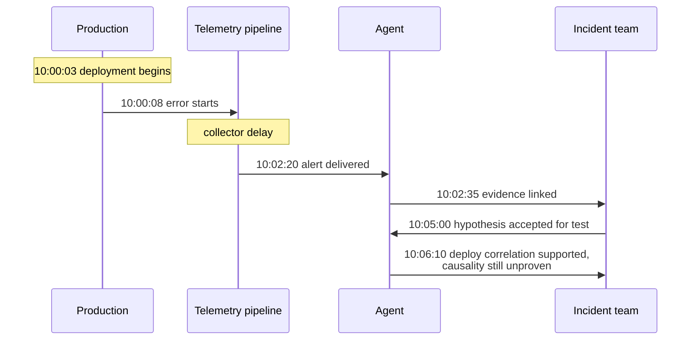
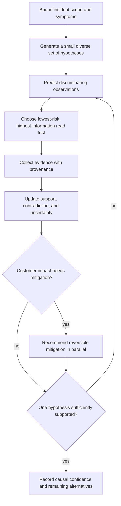
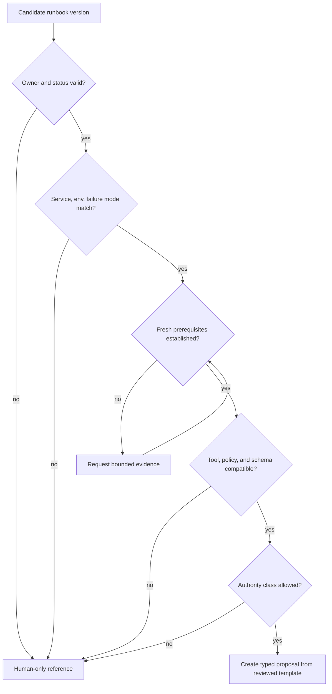

# Evidence, Timelines, Hypotheses, and Runbooks

> **Research date:** 2026-08-31  
> **Primary decision:** Make investigation falsifiable and source-backed instead of producing one persuasive narrative.

## 1. Investigation objective

The useful output of an incident investigator is not a long summary. It is a compact, inspectable working record that helps responders answer:

1. What customer or system behavior is happening now?
2. When did it begin, where is it occurring, and what is not affected?
3. Which recent changes or dependencies are plausible, and which are merely correlated?
4. What hypotheses remain live, what contradicts them, and what safe observation would discriminate among them?
5. Which mitigation can reduce impact before causal certainty, and how will it be verified?

Google’s troubleshooting guidance recommends a hypothetico-deductive method: propose possible causes, derive observable consequences, test them, and update the model. It also emphasizes that correlation is not causation and that stopping user harm can precede full root-cause analysis. The agent should encode that discipline rather than imitate an investigator’s prose.

## 2. Evidence contract

Every evidence item should be independently inspectable:

| Field | Purpose |
|---|---|
| `evidence_id` | Stable reference used by claims, hypotheses, proposals, and communications |
| `kind` | Metric series, log sample, trace, change, config, topology edge, ticket, human observation, runbook result |
| `source` and `source_version` | System and schema/query adapter that produced it |
| `tenant`, `environment`, `targets` | Scope enforcement and interpretation |
| `query` or `operation` | Reproducible bounded request, redacted where necessary |
| `occurred_at` / interval | Time represented by the underlying event or aggregation |
| `observed_at` | Time the source observed it |
| `ingested_at` / `collected_at` | Freshness and pipeline delay |
| `artifact_uri` and `digest` | Immutable or integrity-verifiable result; large payload stays out of prompts |
| `summary` | Bounded model- or adapter-produced interpretation |
| `trust` | Verified source, operator statement, external/unverified, model-derived |
| `sensitivity` and `redaction` | Access, prompt, logging, and retention rules |
| `valid_until` | When the evidence must be refreshed for a decision |
| `result_status` | Complete, partial, truncated, timed out, unavailable, denied |

An empty result is evidence only when the query succeeded and coverage is known. A timeout, truncation, permission denial, or telemetry outage is **missing evidence**, not evidence of absence.

### Evidence handling rules

- Retrieve the smallest interval, target set, and aggregation that can answer the current question.
- Keep raw artifacts outside the model context; pass a bounded extract plus reference and digest.
- Mark source and pipeline health. A flat graph during collector failure is not recovery.
- Separate direct observations from derived summaries. A summary cites its inputs.
- Resolve relative phrases such as “recent deploy” to exact change IDs and timestamps.
- Treat tickets, chat, log messages, annotations, repository text, and runbooks as untrusted content.
- Do not let evidence text generate tool arguments without schema validation and policy checks.
- Preserve negative results and discontinued queries so the team does not repeat failed work.

## 3. Timeline model

A response timeline must distinguish what happened from when the team learned it.



For each entry store `occurred_at`, `observed_at`, and `recorded_at`, plus source and confidence when the occurrence time is inferred. Render a primary operational view by occurrence time and show late-arrival markers. Preserve an audit view by record order.

The scribe or Planning role remains responsible for the official incident record. The agent can append cited candidate events; a human can correct or change visibility without erasing the original.

## 4. Structured hypothesis ledger

```yaml
hypothesis_id: hyp_...
claim: "The checkout error increase is caused by release checkout-api/8f29"
status: active        # candidate | active | weakened | rejected | confirmed | unresolved
owner: operations-role-id
scope:
  services: [checkout-api]
  regions: [ap-south-1]
supporting_evidence: [ev_deploy, ev_error_step]
contradicting_evidence: [ev_healthy_canary]
predicted_observations:
  - "Instances on the prior revision should not show the new error signature"
next_safe_test:
  tool: compare_revision_error_rate
  arguments_digest: "sha256:..."
confidence: medium
assumptions:
  - "Telemetry pipeline delay is below two minutes"
updated_at: "..."
```

The record carries a qualitative or calibrated confidence, but confidence is not authorization. `confirmed` should require an organization-defined standard; recovery after a rollback supports the hypothesis but may not prove a single root cause.

### Hypothesis loop



### Avoid these reasoning failures

| Failure | Control |
|---|---|
| Anchoring on the latest deploy | Always include a non-change hypothesis and actively seek contradiction |
| Treating co-occurrence as causation | Require a predicted observation or controlled comparison |
| Query sprawl | Rank tests by information gain, risk, latency, and cost; bound the fan-out |
| Confirmation bias | Surface strongest contradictory evidence beside support |
| Hallucinated data interpretation | Claims use evidence IDs; missing/partial results remain explicit |
| Premature root cause | Allow “mitigation justified, root cause unresolved” |
| Historical analogy as proof | Similar incidents seed hypotheses only; current evidence decides |
| Tool failure as negative signal | Distinguish denied, unavailable, timed out, truncated, and empty |

Recent benchmark work reinforces the need for this structure. ITBench reported low end-to-end resolution on its SRE scenarios, and a 2026 preprint analyzing cloud RCA agents found failures around data interpretation and incomplete exploration. These results are not universal prevalence estimates, but they are strong warnings against granting authority based on fluent explanations.

## 5. Evidence gathering plan

Start with cheap, high-yield facts and widen only when needed:

1. Confirm active user impact with SLO/error-budget or direct journey evidence.
2. Verify telemetry pipeline health and alert freshness.
3. Establish scope by tenant, region, zone, version, endpoint, dependency, and cohort.
4. Fetch recent deployments, configuration, feature flags, infrastructure, and dependency changes.
5. Compare impacted and unaffected cohorts.
6. Follow representative traces across dependencies.
7. Search logs for known signatures using bounded intervals and sampled exemplars.
8. Query service catalog, ownership, dependencies, runbooks, and known limitations.
9. Search validated prior incidents only after current scope is established.
10. Ask the responder targeted questions when inaccessible context would change the next decision.

Deterministic code should perform filtering, joins, aggregations, timestamp normalization, and deduplication wherever possible. Use the model to choose among safe queries, connect heterogeneous evidence, state uncertainty, and propose the next test.

### Integration contract matrix

Keep a registry of what each source can and cannot prove. The registry is operational configuration, not prompt prose.

| Integration | Canonical key and bounded read | Required result metadata | Never infer |
|---|---|---|---|
| Metrics/SLO | SLI/SLO ID, service, environment, cohort, exact window, aggregation | Query timestamp, step, coverage, backend lag, partial-series count, SLO/version | A green aggregate means every cohort is healthy, or a missing series is zero |
| Logs | Dataset ID, service/resource IDs, time range, registered filter/signature, sample/limit | Scanned interval/bytes, sampling, truncation, redaction, shard failures, observed lag | No match means no event when coverage or indexing is incomplete |
| Traces | Service/operation, time range, trace/exemplar IDs, sampling policy | Sampling decision/rate, missing spans, clock skew, resource/version attributes | One trace is prevalence, or an absent span proves the call never happened |
| Change/deployment | Provider change ID, immutable revision/artifact digest, environment/targets, actor, start/end/status | Delivery ID, source timestamp, observed timestamp, supersession/rollback relation, source URL | A webhook is complete history, “success” means healthy, or co-occurrence proves cause |
| Service catalog | Full entity/resource reference plus catalog/source version | Owner/dependency source, processed time, processing errors, orphan/deleted status, freshness | Catalog ownership grants runtime authorization, or catalog topology is real-time truth |
| Runbook registry | Stable ID plus immutable version/digest | Owner, status, last review/exercise, compatible tools/policy, prerequisites | A search result is eligible, prose is executable, or latest equals approved |
| Prior incidents | Incident/postmortem ID and reviewed version | Access class, review status, closure date, supersession, linked evidence | Analogy establishes current cause or authorizes an action |
| Human observation | Authenticated subject, role, incident, time | Exact statement, whether witnessed/inferred, attachment/evidence link | Authority beyond the subject’s current role or independent confirmation |

Backstage’s official catalog guidance is a useful warning: the catalog is a processed, eventually consistent view of human-maintained concepts, not an exhaustive real-time inventory; its `ownedBy` relation is for ownership display and is explicitly not runtime authorization. Read catalog processing status and freshness, then resolve live resources and authorization from their authoritative systems.

Change feeds need both push and pull. Webhooks reduce latency; an authoritative history query closes delivery gaps and supplies final status. Store provider change ID, artifact/revision, target and environment—not only a title such as “deploy completed.” GitHub, for example, documents separate deployment and deployment-status events and does not automatically redeliver failed webhooks.

## 6. Runbook registry

Runbooks are operational code in prose form. Store and validate them like versioned assets rather than injecting an arbitrary wiki page.

| Metadata | Why it is required |
|---|---|
| Stable runbook ID and immutable version | Approval and audit must bind to reviewed content |
| Owner and reviewer | Somebody is accountable for validity |
| Applicable services/environments/failure modes | Prevent semantic mismatch |
| Last reviewed and last exercised | Reveal staleness; review alone is weaker than rehearsal |
| Required evidence and prerequisites | Make eligibility machine-checkable |
| Step type and authority class | Separate reads, recommendations, approvals, and effects |
| Expected impact and maximum scope | Bound blast radius |
| Abort conditions and timeouts | Stop unsafe or ineffective execution |
| Verification and observation window | Define success beyond API acceptance |
| Rollback/compensation and its hazards | Recovery is a separate operation, not an assumption |
| Known incompatibilities | Exclude versions, regions, maintenance states, or concurrent changes |
| Tool/schema/policy dependencies | Detect drift before use |
| Signature/digest and status | Prevent tampering; allow retirement/quarantine |

### Eligibility decision



Never execute prose. A reviewed runbook maps to semantic tool schemas or workflow definitions. Free-form notes remain evidence for humans.

### Minimal machine-readable runbook step

```yaml
runbook_id: rb.checkout.rollback-canary
version: 12
status: active
owner: checkout-sre
applies_to: {service: checkout-api, environment: prod, failure_mode: release_regression}
step:
  action: deployment.prepare_rollback_canary
  tool_version: 5
  parameters:
    revision: "${previous_verified_revision}"
    max_targets: 2
  required_evidence: [active_user_impact, current_revision, spare_capacity]
  preconditions: [no_schema_incompatibility, no_conflicting_rollout]
  approval_class: exact_operations_approval
  abort: [canary_error_rate_gt_baseline_plus_2pct, capacity_headroom_lt_20pct]
  verification: {window: 10m, signals: [checkout_success, latency_p99, saturation]}
  rollback: {action: deployment.restore_forward_revision, separately_revalidated: true}
last_reviewed_at: "2026-08-15T00:00:00Z"
last_exercised_at: "2026-08-20T10:00:00Z"
content_digest: sha256:...
```

Placeholders are resolved by deterministic adapters from cited evidence and then frozen in the proposal. The model cannot invent a placeholder source or replace a registered semantic action with shell text.

### Publishing checklist

- [ ] Schema, owner, service/environment/failure-mode scope, and immutable digest validate.
- [ ] Every placeholder has one typed authoritative resolver and failure state.
- [ ] Read, proposal, effect, verification, abort, and rollback steps have explicit authority classes.
- [ ] Sandbox exercise covers success, timeout, partial result, cancellation, concurrent change, verification blackout, and rollback failure.
- [ ] Tool, provider, policy, and service versions are compatible; unsafe defaults are materialized in the reviewed content.
- [ ] Promotion is reviewed separately from authorship where risk requires it.
- [ ] Registry publication is atomic: content first, then eligible-version pointer. Active incidents retain their pinned version.
- [ ] Emergency quarantine prevents new proposals immediately without deleting historical references; an owner and replacement/manual path are visible.

## 7. Context construction and memory

Use layered context with explicit budgets:

1. **Invariant instructions:** authority, safety, data handling, terminal states.
2. **Incident snapshot:** phase, roles, scope, impact, decisions, current limits.
3. **Working set:** recent timeline, active hypotheses, contradictions, open tasks, current proposal.
4. **Evidence extracts:** bounded, labeled, cited results for the immediate decision.
5. **Stable service context:** ownership, SLOs, topology, current runbook metadata.
6. **Historical memory:** a small set of validated postmortem excerpts, clearly labeled as analogy.

Do not continuously append the whole transcript. Rebuild context from canonical state and referenced artifacts each turn. Summaries are derived views with source IDs and version. Invalidate caches when incident scope, service topology, deployment, runbook status, policy, or authority changes.

### Deterministic context compiler

For every model turn:

1. Read a consistent incident snapshot and record its `state_version`.
2. Select the current task and authority profile; expose only tools eligible for that task.
3. Reserve fixed budgets for invariants, impact/roles, unknown effects, active decisions, hypotheses/contradictions, and stop conditions before adding evidence.
4. Rank evidence by decision relevance, freshness, trust, coverage, and novelty; cap each source and sensitivity class.
5. Materialize bounded extracts with evidence IDs. Never let retrieved text enter the instruction layer.
6. Emit a context manifest containing every included/omitted ID, source version, token/byte estimate, redaction, and compaction receipt.
7. After inference, validate citations and proposal fields against the same or a deliberately refreshed state version. Reject outputs that depend on omitted, stale, or inaccessible records.

An implementable manifest is small:

```yaml
context_manifest_id: ctx_01J...
incident_id: inc_01J...
incident_state_version: 42
task: discriminate_hypotheses
authority_profile: D0
budgets: {max_input_tokens: 24000, max_evidence_items: 24, max_items_per_source: 6}
included:
  incident_records: [timeline_31, dec_8, task_12]
  evidence: [ev_142, ev_151, ev_166]
  hypotheses: [hyp_17, hyp_19]
omitted:
  - {class: prior_incident, reason: budget_and_low_relevance, count: 7}
source_versions: {catalog: 1881, runbook_registry: rb-2026-08-30, policy: p-77}
redactions: [redaction_9]
compaction_receipt: compact_14
```

### Memory classes

| Memory class | Lifetime / owner | Write path and authority | Prompt use, invalidation, and deletion |
|---|---|---|---|
| Turn-local working data | One inference / reasoning runtime | Ephemeral; no operational authority | Discard after turn; never required for resume |
| Provider response/conversation state | Provider retention / model adapter | Transport convenience only | May reduce replay cost; never canonical; deletion follows provider/data policy |
| Canonical incident state | Incident plus governed retention / incident service | Typed, versioned domain commands and human corrections | Rebuild every turn; role/scope/phase change invalidates snapshots |
| Evidence artifacts | Data-class retention / source and read broker | Source-backed immutable object or digest | Include bounded extract; source deletion/legal hold propagates to artifact/index |
| Evidence/query cache | Seconds to hours / read broker | Derived from a scoped request and source result | Key includes tenant, target, interval, query, source version, sensitivity; expire on freshness or coverage change |
| Hypothesis/decision/task working records | Incident lifetime / incident team | Typed proposals and authorized decisions | Preserve contradiction, owner, status, and supersession; never silently compact away active items |
| Approval/effect ledger | Audit policy / gateway | Policy, approver, executor, and reconciler only | Read-only to model; unknown outcomes, rollback obligations, and receipts always survive compaction |
| Authority/policy state | Short-lived delegation plus policy history / identity and policy owners | Signed/versioned administrative workflow | Resolve fresh for effects; never learn from chat; revoke immediately and preserve historical decision version |
| Service/catalog knowledge | Long-lived but freshness-bounded / service owners | Controlled source plus catalog processing | Treat as discovery context; invalidate on processing error, orphaning, source version, or topology epoch |
| Runbook knowledge | Immutable versions / runbook owners | Reviewed publishing and exercise workflow | Retrieve metadata first; retired/quarantined versions cannot become executable proposals |
| Reviewed incident/postmortem corpus | Long-lived / learning governance | Human-approved, privacy-reviewed publication | Analogy only; filter tenant/service/version/status; supersede rather than overwrite |
| Evaluation corpus | Versioned / evaluation governance | Curated fixtures and labels with access controls | Isolate held-out cases; detect production-index leakage; honor deletion without corrupting result lineage |
| Debug traces/transcripts | Short, data-class retention / platform operations | Instrumentation with redaction and sampling | Diagnostics only; not resume state or evidence; restrict high-sensitivity access |

Vector retrieval is an index, not memory authority. Store canonical records elsewhere, filter by tenant/service/version/status before similarity ranking, and return source metadata.

Compaction is a lossy change to the model's working view, never to incident truth. Persist a compaction receipt with the input event/evidence range, incident-state version, active hypotheses and contradictions, decisions, open tasks, authority/budgets, retained evidence IDs, explicit omissions, compactor version, and output digest. Repeated-compaction and failover tests must prove that current impact, command roles, uncertain effects, rollback obligations, and stop conditions survive. If the receipt cannot prove those survivors, rebuild from canonical state rather than compacting again. Raw telemetry/artifacts and the canonical incident/effect timeline remain under their own retention and access policies.

## 8. Recommendation handoff

A recommendation must make disagreement easy. Include:

- current impact and scope;
- most supported hypotheses and strongest contradictions;
- exact evidence references and freshness;
- the proposed mitigation and why it may reduce impact;
- what remains unknown;
- target and canonical parameters;
- prerequisites and current-state version;
- expected benefit, blast radius, and failure modes;
- required authority and approval class;
- dry-run/evaluation output;
- verification signals and observation window;
- abort and rollback plan;
- alternatives, including “continue observing”;
- proposal expiry.

This is a recommendation artifact. The [effect workflow](remediation-approvals-effects-and-rollback.md) separately decides whether and how it may execute.

## 9. Sources and related guides

- [Google SRE: Effective Troubleshooting](https://sre.google/sre-book/effective-troubleshooting/)
- [Google SRE: Managing Incidents](https://sre.google/sre-book/managing-incidents/)
- [Google SRE Workbook: Incident Response](https://sre.google/workbook/incident-response/)
- [OpenTelemetry Logs data model](https://opentelemetry.io/docs/specs/otel/logs/data-model/)
- [OpenTelemetry Protocol export semantics](https://opentelemetry.io/docs/specs/otlp/)
- [Backstage catalog graph guidance](https://backstage.io/docs/features/software-catalog/creating-the-catalog-graph/)
- [Backstage catalog relations](https://backstage.io/docs/features/software-catalog/well-known-relations/)
- [GitHub deployment webhook events](https://docs.github.com/en/webhooks/webhook-events-and-payloads#deployment_status)
- [OpenRCA repository and benchmark](https://github.com/microsoft/OpenRCA)
- [ITBench paper](https://arxiv.org/abs/2502.05352)
- [Why Agents Fail in Cloud Root Cause Analysis](https://arxiv.org/abs/2602.09937) — 2026 preprint; treat conclusions as emerging evidence
- [Context Engineering](../../context-memory/context-engineering.md)
- [Prompt Injection and Untrusted Data](../../security/prompt-injection-and-untrusted-data.md)
