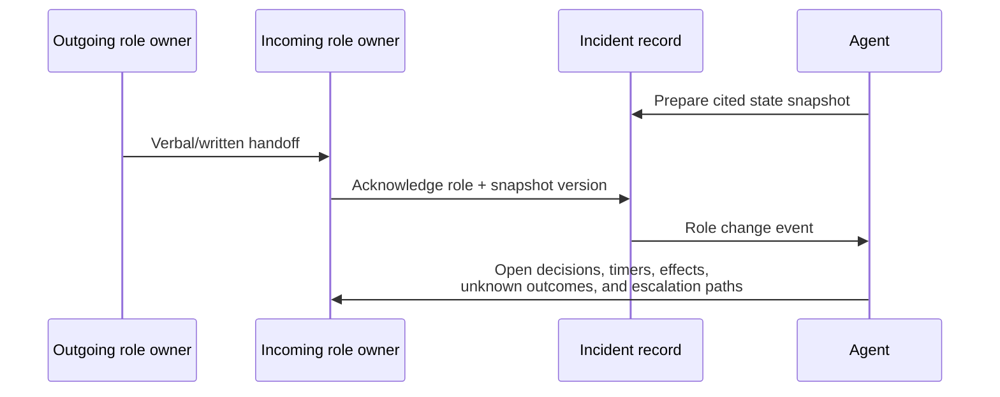
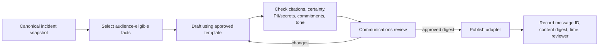
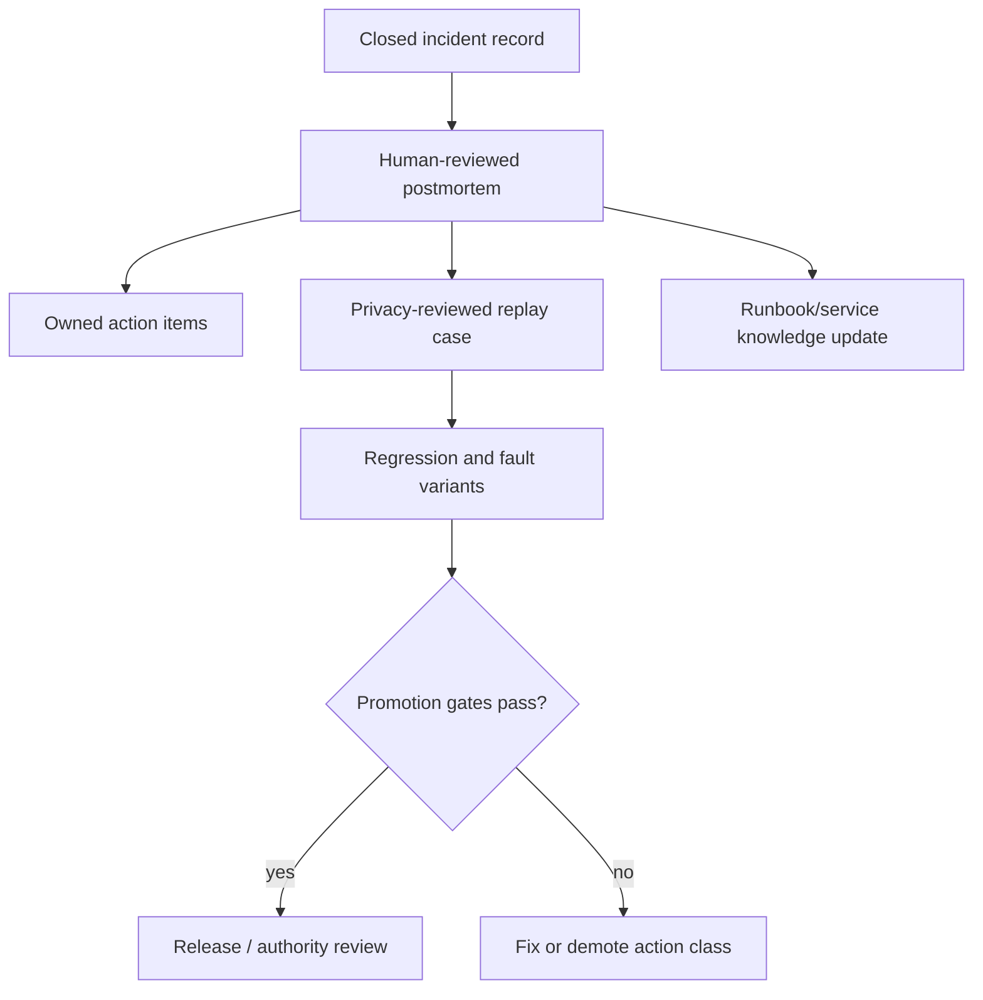

# Incident Roles, On-Call, Communications, and Postmortems

> **Research date:** 2026-08-31  
> **Primary decision:** The agent supports a human incident organization; it does not become the incident commander or silently publish on its behalf.

## 1. Preserve the response organization

Google’s SRE incident model adapts the Incident Command System into distinct functions: Incident Command coordinates; Operations mitigates; Communications manages updates; Planning/Scribe maintains the record and longer-horizon work. PagerDuty similarly emphasizes that the Incident Commander delegates and coordinates rather than personally performing every repair.

An agent can reduce toil in each function, but it must not blur accountability:

| Human function | Owns | Agent may assist | Agent must not do by implication |
|---|---|---|---|
| Incident Commander | Declare/close, severity, objectives, priorities, role assignment, escalation, final decisions | Summarize state, identify missing role, surface decision deadlines and conflicts | Become authority because it correlates alerts or writes a plan |
| Operations | Technical diagnosis and mitigation | Gather evidence, maintain hypotheses, locate runbooks, draft proposals, execute separately approved effects | Freelance production changes or expand scope |
| Communications | Audience, wording, cadence, status-page and stakeholder publication | Draft fact-constrained updates and flag stale/unsupported claims | Publish speculative cause, sensitive data, or customer commitments |
| Planning/Scribe | Timeline, action tracking, handoffs, future needs, incident document | Append cited candidate events, decisions, tasks, and evidence links | Rewrite history or mark hypotheses as facts |
| Service owner/SME | System-specific interpretation and risk | Retrieve ownership, architecture, known limits, and previous incidents | Overrule current owner knowledge using stale memory |
| Approver | Exact delegation under policy | Present canonical effect, risk, evidence, diff, verification, rollback | Infer approval from chat sentiment or severity |

Small incidents can combine human roles, but the responsibilities remain explicit. The same person performing Operations and Command is an organizational choice; it is not a reason for the software to collapse permissions.

## 2. Incident declaration and handoff

Declare early when coordinated response is likely to help. A model may recommend declaration based on configured signals, but deterministic policy or an authorized human changes the canonical incident state.

### Declaration packet

- incident ID, title, severity, start/detection times, and current phase;
- customer/system impact and affected/unaffected scope;
- source alerts and freshness/degradation notes;
- commander, operations, communications, and planning owners;
- command channel, incident document, dashboard, and bridge links;
- active hypotheses and strongest contradictions;
- actions completed/in progress, effect statuses, and next decision time;
- authority profile and whether automation is read-only, approved, paused, or disabled.

### Role handoff



The handoff is complete only after the incoming owner acknowledges the current state version. Explicitly call out unknown effect outcomes, pending approvals, automation state, observation windows, and next communication deadline.

## 3. On-call integration

The agent must improve actionable response rather than create a second paging system.

- Preserve the existing escalation policy and acknowledgment/resolve lifecycle.
- Page only through the organization’s defined alerting policy; agent notifications are enrichment unless deliberately classified otherwise.
- Put enrichment in the incident record/page extension asynchronously. Never wait for a model before delivering an actionable page.
- Coalesce repeated enrichment updates; do not page on every hypothesis change.
- Make “agent unavailable” visible without paging the service responder unless it affects a separately owned agent SLO.
- Respect ownership, timezone, schedule, and substitution from the authoritative on-call system.
- Never ask an agent to decide who is on call from cached memory.
- Evaluate alert quality independently: immediate human action, user impact, urgency, precision, recall, and sustainable load.

Google’s on-call guidance stresses that pages should require immediate human action. SLO burn-rate alerts are one established way to connect paging to customer impact; they do not eliminate symptom, security, capacity, or platform-specific alerts.

### Paging and incident-platform adapter

Declare one owner per field; avoid blind bidirectional synchronization:

| Field | Practical authority | Conflict behavior |
|---|---|---|
| Page delivery, escalation, ack/resolve lifecycle, current schedule | Paging system | Never overwrite from agent cache; surface API degradation and preserve native path |
| Incident ID and vendor object version | Incident platform | Upsert by stored remote ID/version; do not title-search and update a possible match |
| Roles, phase, severity, objectives | Organization-defined incident authority | Apply authenticated commands with expected version; conflicts require refresh/human resolution |
| Evidence, hypothesis, decision, task, effect records | Application incident event store | Append references/summaries to vendor UI; vendor text is not canonical replacement |
| Published update | Communications/status platform | Persist remote message ID, exact approved digest, author, and published time |

For PagerDuty Events API v2, a subsequent trigger/acknowledge/resolve affects an open alert only when both `dedup_key` and the original `routing_key` match; a trigger with the same key after resolution creates a new alert. Preserve the returned/source key and service integration identity rather than reconstructing lifecycle from incident titles.

Adapter operations should be semantic and idempotent: `append_incident_note(command_id, incident_id, expected_remote_version, content_digest)`, `assign_role(...)`, `record_acknowledgement(...)`, and `publish_approved_update(...)`. After timeout, read the remote object or message by command correlation before retrying. When the incident platform is unavailable, queue only expiry-bounded, idempotent records; never queue an approval or external update so long that its facts can become stale without re-review.

## 4. ChatOps is a view and command surface

Chat improves reach but has weak conversational semantics for authority. Treat each message, interaction, edit, delete, and retry as an event linked to canonical incident state.

### Inbound ChatOps rules

1. Verify the provider signature over raw bytes and enforce its replay window before parsing. Slack’s current signing guidance uses the raw body, request timestamp, HMAC-SHA256, constant-time comparison, and a five-minute freshness example.
2. Derive workspace/tenant, application, channel, thread, user, and event identity from verified fields. Slack documents a globally unique `event_id`; it may retry failed Events API delivery and expects a `2xx` within three seconds, so acknowledge after durable acceptance and process asynchronously.
3. Map the provider user to the enterprise identity and current incident role. Workspace membership, display name, channel membership, emoji, or quoted text does not grant command authority.
4. Treat messages and attachments as untrusted evidence. Edits/deletes append correction/tombstone events; they do not rewrite decisions already made.
5. Scope ordinary commands to the incident thread/channel binding. Reject copied buttons, cross-tenant shared-channel events, expired interactions, and commands for closed or different incidents.

### Approval through ChatOps

An approval button may be a front end to the approval service, but the service must render the canonical proposal digest and exact targets, require an eligible authenticated subject and any step-up authentication, record a single-use decision with expiry, and return the ledger result. Free-form “ship it,” reactions, polls, bot mentions, and message edits are never approvals.

### Outbound ChatOps rules

- Store `(tenant, channel, thread_ts, message_ts, content_digest, command_id)` and update only messages created by the integration identity.
- Coalesce drafts and respect provider rate limits; chat is not a high-volume log sink.
- Post links and bounded summaries rather than raw sensitive evidence.
- If publishing times out, look up the stored correlation/message state before retrying to avoid duplicate incident threads or updates.
- Preserve a manual bridge/status path during ChatOps outage; command and approval state stays in the incident/approval services.

## 5. Internal communications

Internal updates should be short, timestamped, and decision-oriented:

```text
State: Investigating | SEV-2 | 14:20 UTC
Impact: Checkout success is 91% in ap-south-1; other regions remain within SLO.
Evidence: ev_142 (fresh 14:19), ev_151 (partial: one shard unavailable).
Working hypotheses: release 8f29 supported; dependency saturation remains plausible.
Action: Two-instance rollback canary proposed; not yet approved.
Unknowns: telemetry gap for shard c; causal root remains unconfirmed.
Next: Operations review at 14:24; next update by 14:30.
```

The agent may draft from canonical records. A role owner approves material decisions and corrects interpretation. The update must distinguish fact, hypothesis, proposal, committed action, and verified result.

## 6. External communications

External updates have different confidentiality, legal, support, and expectation risks. Default to human review and publication.

### Drafting pipeline



### Rules

- Lead with observed impact and what users can expect, not an unproven cause.
- Use absolute times and a promised update window only when the organization can meet it.
- State mitigation progress accurately: “deploying,” “completed,” and “recovery verified” are different.
- Do not expose customer identifiers, credentials, sensitive architecture, attacker-useful details, or raw logs.
- Avoid estimates of full recovery unless supported by an accountable human decision.
- Track the exact source facts, approved digest, reviewer, platform message ID, and corrections.
- If facts regress, publish a correction; do not silently edit the incident record.
- Deterministic template auto-publication, if allowed at all, should be limited to preapproved low-risk facts such as “investigating” with a fixed audience and cadence.

PagerDuty recommends early awareness, continued updates, and reusable templates. Treat any suggested timing as an adaptable practice, not a universal service-level promise.

## 7. Decision and task tracking

The incident record should distinguish:

| Record | Minimum fields |
|---|---|
| Decision | Decision, alternatives, evidence, authority, owner, time, review trigger |
| Task | Objective, owner, status, dependency, due/next-check time, evidence/output |
| Proposal | Exact action, risk, preconditions, approval, expiry, verification, rollback |
| Effect | Attempt/operation identity, outcome, receipt, ambiguity, verification |
| Communication | Audience, facts, draft/reviewer/published digest, message ID |

Avoid a single free-form checklist. On every material update, the agent can flag orphaned tasks, overdue next checks, missing owners, unacknowledged handoffs, and effects still in observation or unknown-outcome states.

## 8. Resolution and recovery

Define recovery criteria before resolving:

- user-impact and SLO signals are within a declared range for an observation window;
- affected scope no longer grows;
- critical telemetry pipelines are healthy enough to support the conclusion;
- outstanding effects are verified, rolled back, or explicitly handed off;
- temporary mitigations and risks have owners;
- stakeholder communications reflect current state;
- follow-up monitoring and escalation are assigned.

Resolution does not require a fully proven root cause. Record causal status as confirmed, probable, competing, or unresolved. Reopen explicitly if impact returns.

## 9. Postmortem draft and review

The agent can assemble a first draft, but the incident team owns the learning. A strong postmortem separates observations from interpretation and avoids blame.

### Suggested structure

1. Metadata: incident ID, dates, severity, services, owners, reviewers.
2. Executive summary and customer impact.
3. Detection and response effectiveness.
4. Timeline using occurrence and awareness times.
5. Technical explanation with evidence and remaining uncertainty.
6. Contributing conditions, including organizational and tooling factors.
7. What went well, what went poorly, and where luck helped.
8. Mitigations and effects: proposed, approved, attempted, verified, rolled back.
9. Communications and coordination review.
10. Agent performance and near misses, including rejected/unsafe proposals.
11. Action items covering prevention, detection, mitigation, and response.
12. Evaluation cases and runbook/tool/policy updates derived from the event.

### Action-item quality

Every action needs a measurable outcome, owner, priority, due/review date, tracking reference, and validation method. Balance prevention with earlier detection and lower-impact mitigation. “Be more careful,” “add monitoring,” and “improve the agent” are not adequate without a concrete mechanism and success criterion.

Google and PagerDuty both emphasize blameless learning and action follow-through. Blameless does not mean accountability-free: examine system conditions and decisions without making personal fault the explanatory endpoint.

### Learning pipeline



Do not automatically index an unreviewed draft as operational memory. It may contain sensitive data, wrong causal claims, or the agent’s own confabulation. Preserve the reviewed version, source links, access rules, and supersession history.

### Convert learning into a behavioral release

Do not patch prompts or grant authority directly from a postmortem action item. Use a release artifact:

```yaml
behavior_release: sre-agent-2026-09-14.2
changes:
  prompt_bundle: prompt-19
  context_compiler: ctx-8
  tool_registry: tools-31
  runbook_registry: runbooks-77
  policy_bundle: policy-14
  model_routes: routes-6
derived_from: [inc_01J..., near_miss_44]
evaluation:
  corpus_digest: sha256:...
  held_out_cases: 184
  stochastic_runs_per_case: 5
  invariant_failures: 0
scope: {authority: D1, services: [checkout-api], tenants: [internal]}
owner: sre-agent-platform
rollback_to: sre-agent-2026-08-28.4
```

The release review must show which responder correction became which fixture or rule, what behavior changed, and which unrelated cases regressed. Shadow the complete bundle, canary it by service/tenant/authority class, compare responder usefulness and safety, then promote or roll back the bundle as one compatible tuple. Near misses and rejected unsafe proposals are first-class learning inputs. Production feedback remains quarantined until privacy, factuality, tenant, poisoning, and label review complete.

## 10. Role and communications tests

- Missing Incident Commander is surfaced; the agent does not self-assign authority.
- Operations and Command disagree; both positions and the final authorized decision are preserved.
- Handoff occurs during a pending approval and an unknown effect outcome; both are prominently acknowledged.
- On-call API is unavailable; original escalation continues and the agent avoids guessing a responder.
- Agent enrichment is late; page delivery is unaffected and late evidence is labeled.
- Draft includes an unconfirmed root cause; factuality check removes or labels it.
- Draft includes a secret/PII from logs; redaction and publication policy block it.
- Recovery metric is green while telemetry collector is failing; resolution is blocked or qualified.
- External update deadline is missed; the workflow escalates without inventing progress.
- A correction is published and linked; historical content remains auditable.
- Postmortem draft conflates hypothesis with fact; evidence-resolution test fails.
- Agent error becomes an owned system action and evaluation case, not hidden from review.
- A signed ChatOps interaction is replayed outside the accepted window and rejected.
- A user in the incident channel but without the required enterprise role clicks approve; approval service denies it.
- Slack-style Events API delivery retries; one `event_id` produces one domain command.
- Publishing times out after success; remote reconciliation finds the existing message and prevents a duplicate.
- The incident platform and local state version conflict on role assignment; the adapter refreshes and requires resolution rather than last-write-wins.

## 11. Sources and related guides

- [Google SRE: Managing Incidents](https://sre.google/sre-book/managing-incidents/)
- [Google SRE Workbook: Incident Response](https://sre.google/workbook/incident-response/)
- [Google SRE Workbook: On-Call](https://sre.google/workbook/on-call/)
- [Google SRE Workbook: Alerting on SLOs](https://sre.google/workbook/alerting-on-slos/)
- [Google SRE Workbook: Postmortem Culture](https://sre.google/workbook/postmortem-culture/)
- [PagerDuty response roles](https://response.pagerduty.com/before/different_roles/)
- [PagerDuty: During an Incident](https://response.pagerduty.com/during/during_an_incident/)
- [PagerDuty external communication guidelines](https://response.pagerduty.com/during/external_communication_guidelines/)
- [PagerDuty effective postmortems](https://response.pagerduty.com/after/effective_post_mortems/)
- [PagerDuty postmortem template](https://response.pagerduty.com/after/post_mortem_template/)
- [PagerDuty Events API v2 trigger and lifecycle behavior](https://github.com/PagerDuty/developer-docs/blob/main/docs/events-API-v2/02-Trigger-Events.md)
- [Slack request verification](https://docs.slack.dev/authentication/verifying-requests-from-slack/)
- [Slack Events API delivery and retries](https://docs.slack.dev/apis/events-api/)
- [Slack message retrieval and thread identity](https://docs.slack.dev/messaging/retrieving-messages/)
- [Slack Web API rate limits](https://docs.slack.dev/apis/web-api/rate-limits/)
