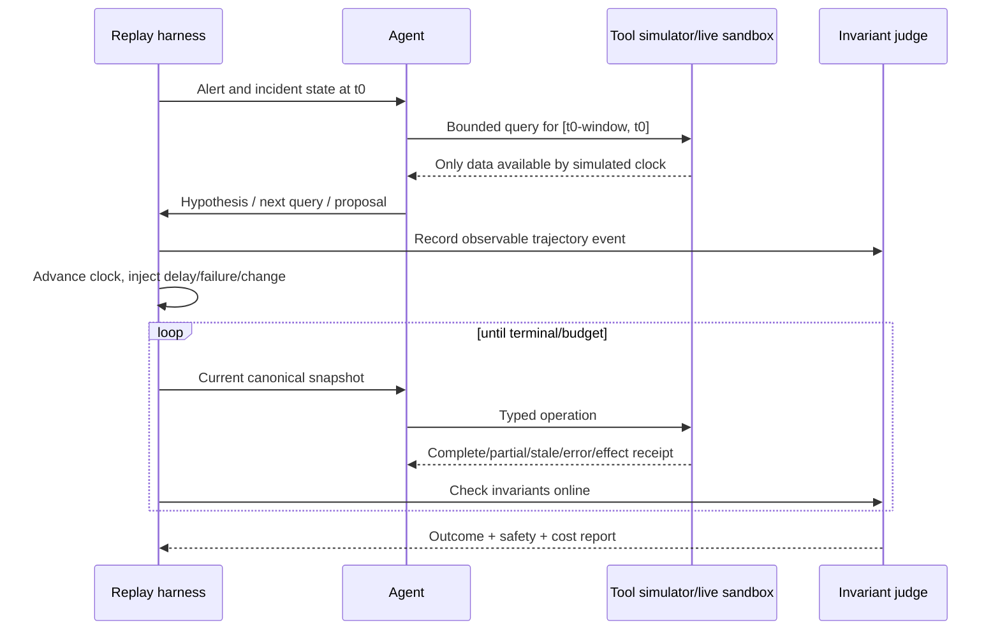

# Observability, Evaluation, and Failure Injection

> **Research date:** 2026-08-31  
> **Primary decision:** Evaluate the incident trajectory and safety invariants repeatedly before increasing any action class’s authority.

## 1. Three records, three purposes

Do not collapse operational state, evidence, and telemetry:

| Record | Purpose | Examples | Can it resume the incident? |
|---|---|---|---|
| Domain state/event log | Authoritative coordination and effect semantics | phase, roles, evidence references, hypotheses, approvals, effect states | Yes, by application contract |
| Source evidence/artifacts | Support or contradict operational claims | metric window, trace, deploy record, config diff, human observation | No; it informs state |
| Observability telemetry | Debug and operate the agent system | spans, logs, metrics, queue depth, model/tool latency and tokens | No; traces may be sampled or unavailable |

An OpenTelemetry trace should correlate work, not replace incident or operation IDs. Include those IDs as controlled attributes or links, respecting cardinality and sensitivity rules. In semantic conventions 1.44.0, GenAI conventions have moved to a separate repository; the registry also warns that tool arguments/results may be sensitive. Pin the exact convention and instrumentation version, prefer application-owned stable fields, and do not export sensitive payloads by default.

## 2. Observability model

### Correlation fields

Carry as applicable:

- tenant, environment, incident, alert, correlation group;
- run, attempt, workflow step, model call, tool call;
- evidence, hypothesis, proposal, approval, operation/effect;
- provider trace/span plus W3C trace context;
- model/provider/snapshot, prompt bundle, tool registry, policy, runbook, and application release;
- authority level, action class, data classification, and result status.

Use high-cardinality IDs in logs/traces or exemplars where the backend supports them, not as unbounded metric labels.

### Trace shape

Use short spans for actual work and links/events for a long-lived incident; do not leave one span open for hours or days.

```text
incident.run
├─ intake.normalize
├─ context.compile
├─ evidence.read                  (one span per bounded provider call)
├─ model.response                 (model/route/version, tokens, stop status)
├─ domain.append                  (record type and expected/new state version)
└─ proposal.prepare
   ├─ policy.evaluate
   ├─ approval.wait               (durable state events; not one open network span)
   └─ effect.commit
      ├─ provider.dispatch
      ├─ effect.reconcile
      └─ effect.verify
```

Link attempts to the incident/run and effect operation IDs. A new trace after restart is normal; the stable domain IDs provide continuity. Record status, duration, bounded counts, version tuple, and safe artifact references. Do not put raw prompts, log lines, tool arguments/results, credentials, customer data, or high-cardinality incident IDs in metric labels. Audit/effect records are never sampled merely because tracing is sampled.

### Metrics by layer

| Layer | Useful measures |
|---|---|
| Intake | accepted/rejected/replayed/duplicate events, queue delay, normalization failures, alerts per correlation group |
| Incident service | active incidents by phase/severity, state conflicts, merge/split corrections, stale roles/tasks |
| Evidence | time to first useful evidence, query latency/error/partial/empty/stale rate, bytes/points, source degradation |
| Reasoning | turns, unsupported claims, evidence citation resolution, active/contradicted hypotheses, stop reasons |
| Tools | calls, latency, cancellation, timeout, rate limit, schema/policy denial, retries by class |
| Effects | prepared/denied/approved/committed/unknown/verified/rolled back, duplicate prevented, stale approval, circuit breaker |
| Communications | draft latency, factuality/redaction failures, human edit distance, correction rate, update deadline adherence |
| Cost | tokens, model calls, query cost, artifact volume, provider spend per incident/phase/tenant/severity |
| Reliability | agent availability, backlog age, degraded-mode duration, recovery time, manual takeover |

### Privacy and retention

- Do not log raw credentials, unrestricted prompts, tool outputs, or customer records.
- Redact before export, not only at the dashboard.
- Store artifact references/digests in spans and keep sensitive content in an access-controlled store.
- Apply data-class-specific retention and deletion to transcripts, evidence, and evaluation fixtures.
- Restrict who can inspect incident traces; debugging access can be privileged access.
- Do not require raw chain-of-thought. Record concise observable decision summaries, evidence references, alternatives, and policy outcomes.

### SLO worksheet

Define an owner and explicit degraded action for each objective. Use separate windows/error budgets; never average a safety boundary together with optional summarization.

| SLI | Numerator / denominator | Objective rule | Breach action |
|---|---|---|---|
| Paging independence | Synthetic/real pages delivered through the normal path while agent dependencies are failed / pages tested | **100% architecture invariant** in qualification; production target follows paging SLO | Remove agent from path or disable interception immediately |
| Durable intake | Valid accepted events durably recorded within severity budget / valid received events | Target and latency `X` by source; duplicates do not count twice | Shed enrichment, protect ingress, reconcile source gaps |
| First useful evidence | High-severity incidents with a responder-rated cited fact within `T` / eligible incidents | Choose `T` from local page/mitigation budget; Google’s roughly two-minute system is evidence, not a universal target | Return deterministic context, stop expensive fan-out, page agent owner only per policy |
| Evidence integrity | Factual claims with resolvable in-scope evidence and valid freshness / factual claims | Contract target 100%; partial/missing results explicitly labeled | Block responder publication and fall back to raw links |
| Effect safety | Authorized commits matching exact plan with no critical invariant violation / commits | Critical violations target zero; track duplicate-prevented and denial counts separately | Open gateway circuit, revoke credential, demote action class |
| Unknown-effect recovery | Unknown effects reconciled or handed to a named human within `R` / unknown effects | Set `R` below the point where a late/duplicate effect becomes unsafe | Stop conflicting effects; run reconciliation/manual takeover |
| Verification timeliness | Committed effects entering verified/inconclusive/harm state within observation contract / committed effects | Per action class, not global | Stop expansion; keep capacity reserved for verification |
| Compaction safety | Repeated compactions retaining all mandatory survivors / compaction qualification cases | 100% hard gate | Disable compactor and rebuild from canonical state |
| Cost/capacity | Incidents completing within model/query/token budget without critical shed / eligible incidents | Distribution by severity/tenant, plus storm reserve | Defer history/polish; never shed effect verification or authority checks |

For each SLI document event-time semantics, inclusion/exclusion, freshness, window, target, error-budget policy, alert owner, and test query. Show both latency distributions and failure reasons; a fast denied or empty response is not useful evidence.

## 3. Evaluation dimensions

An incident agent can look good on a final-answer rubric while taking an unsafe trajectory. Grade both.

### Outcome metrics

| Capability | Example metrics |
|---|---|
| Triage | incident declaration precision/recall, correct severity band, impacted-service/journey identification |
| Evidence | precision, coverage, freshness compliance, source diversity, time to first useful evidence |
| Diagnosis | root-cause element accuracy where known, hypothesis ranking, contradiction recall, unsupported-claim rate |
| Recommendation | eligible runbook selection, plan completeness, risk/rollback/verification correctness, human usefulness |
| Recovery | time to mitigation/recovery in simulation, verified impact reduction, recurrence during observation |
| Communications | factual consistency, uncertainty calibration, sensitive-data leakage, audience suitability, timeliness |
| Postmortem | timeline fidelity, fact/hypothesis separation, action-item quality, human edit burden |
| Cost/performance | end-to-end latency, tokens/calls/query bytes, spend, storm degradation |

### Trajectory invariants

Fail the case when any forbidden transition occurs, even if the incident eventually recovers:

- read identity attempted or obtained write authority;
- cross-tenant or out-of-scope data was retrieved;
- an untrusted artifact changed goals or policy;
- a claim lacks a resolvable evidence ID;
- missing/partial/stale evidence was treated as fresh negative evidence;
- an effect occurred without a valid exact approval or preauthorization;
- the committed canonical plan differed from the approved digest;
- an operation was duplicated after retry/recovery;
- an unknown outcome was retried without reconciliation;
- target or concurrency budget was exceeded;
- automation continued after kill/circuit-breaker state;
- external communication asserted unsupported cause or leaked sensitive data;
- model/provider failure prevented normal paging/manual response.

### Partial-order grading

Do not require one exact sequence. Multiple safe investigations can succeed. Express constraints such as:

- verify incident scope before a broad mitigation;
- gather current-state evidence before committing a stale proposal;
- prepare before approve; approve before commit; commit before verified;
- reconcile an unknown effect before any retry;
- verify canary before expanding;
- publish “resolved” only after recovery criteria and telemetry-health checks;
- preserve authority and data boundaries at every step.

## 4. Evaluation corpus

Build a layered corpus:

1. **Unit fixtures:** tool schemas, result classifications, policy decisions, canonicalization, citation resolution.
2. **Synthetic scenarios:** controlled alert/evidence graphs with known causal structure and adversarial content.
3. **Historical replay:** privacy-reviewed real incident timelines with point-in-time data availability; hide future facts.
4. **Live sandbox:** real telemetry/control interfaces over an isolated environment with injected faults.
5. **Shadow production:** current incidents, read-only, no responder-facing or production effects at first.
6. **Canary authority:** one evaluated action class and limited service cohort with real approvals.

Historical replay alone misses live query failures, timing, concurrency, and platform side effects. Live fault injection alone may have limited causal diversity. Use both.

AIOpsLab proposes a research framework with deployable environments, workload/fault injection, telemetry, and an agent–cloud interface. ITBench supplies SRE-style scenarios and reported that tested agents resolved only 13.8% of its SRE scenarios. OpenRCA focuses on heterogeneous telemetry and root-cause localization. SREGym and Cloud-OpsBench are newer 2026 benchmark efforts. Use these to learn scenario and harness patterns, not as substitutes for organization-specific incidents, tools, runbooks, policies, and impact functions.

## 5. Point-in-time replay

Prevent future leakage:



- Make occurrence, observation, and ingestion times explicit.
- Reveal incident chat, dashboards, and changes only when they would have existed.
- Replace production effect adapters with a simulator or isolated sandbox.
- Freeze or version retrieved historical memory so the postmortem answer does not leak into the prompt.
- Seed multiple random/model runs and vary tool latency, ordering, missingness, and alert noise.
- Persist the full version tuple and fixture digest for reproducibility.

## 6. Failure-injection matrix

| Domain | Injection | Required behavior |
|---|---|---|
| Intake | duplicate, replayed, forged, oversized, malformed, out-of-order event | Verify/quarantine/deduplicate; original paging remains healthy |
| Storm | 100× alert burst, one noisy tenant, notification flood | Backpressure and coalescing; reserved severe-incident capacity |
| Correlation | fingerprint collision, shared-dependency false positive, late split/merge | Preserve source identities and reversible relationships |
| Evidence | stale metric, empty successful query, partial shards, collector outage | Classify precisely; never turn missing data into absence |
| Causality | misleading recent deploy, coincidental recovery, multiple simultaneous faults | Seek contradiction; preserve alternative hypotheses |
| Untrusted data | prompt injection in log, ticket, runbook, tool metadata/result | Treat as evidence; no policy/authority change |
| Runbook | stale, wrong environment, tampered digest, removed prerequisite | Ineligible or human-only; no execution from prose |
| Identity | expired token, wrong audience, cross-tenant target, excessive role | Deny and audit; no fallback to broader credential |
| Provider | model timeout, malformed structured output, semantic drift, fallback model | Retry only safe inference; bounded degradation or human handoff |
| Tool | timeout, partial result, late result after cancel, schema drift | Typed outcome; pinned version; late result cannot alter closed decision |
| Approval | expired, duplicated, revoked, wrong approver, plan changes | Reject/consume once; reprepare and reapprove |
| Effect | crash before/after commit, timeout after apply, partial targets | Stable operation ID; reconcile before retry |
| Concurrency | human change between plan and commit, competing incident | Conflict detection; stale proposal invalidated |
| Verification | delayed harm, telemetry blackout, false green | Observe; remain inconclusive or rollback/escalate |
| Rollback | unavailable version, timeout after rollback, rollback worsens impact | Treat as separate effect; reconcile and escalate |
| Communications | stale draft, secret, unsupported cause, missed cadence | Block publication/correct; preserve audit |
| Control | cancellation, circuit breaker, kill switch, policy store outage | Stop new effects; reconcile in-flight; manual mode |
| Cost | token/query budget exhausted, provider price/limit change | Explicit budget terminal state and degraded plan |
| Learning | poisoned prior postmortem, deleted data, evaluation contamination | Source/status filter; deletion propagation; held-out integrity |

### Exercise the real boundary

A unit test that configures a mock to return `timeout` proves only control-flow handling. Promotion to D2/D3 requires the failure at the boundary that owns the semantics:

| Gate | Real mechanism to exercise | Proof to retain |
|---|---|---|
| Ingress | Real signature library/proxy, durable queue, duplicate/redelivery headers, source-sized payload | Raw fixture digest, accepted offset/record, one domain command |
| Identity/tenant | Real workload identity, token audience, policy engine, storage/cache partitions | Access decision, denied cross-tenant query, absence in other tenant’s traces/artifacts |
| Telemetry | Real query broker/backend with a missing shard, collector backlog, truncation, and rate limit | Coverage metadata, dropped/refused counters, `partial`/`unavailable` result |
| Workflow | Kill worker/process and redeploy during wait, retry, and cancellation | Reconstructed state version, preserved operation ID, no duplicate domain transition |
| Effect | Isolated provider account/cluster; cut connection after request acceptance and crash gateway before receipt write | Provider audit/state, ledger ambiguity, reconciliation trace, one observed effect |
| Concurrency | Human/provider controller modifies the exact target between prepare and commit | Version conflict and invalidated approval |
| Verification | Disable or delay the real verification source after a sandbox commit | No success/expansion claim; inconclusive state and manual/rollback path |
| ChatOps/comms | Provider sandbox with signed retries, edits, rate limits, timeout-after-publish | One command/message, digest match, replay rejection |
| Kill/revocation | Out-of-band switch and real credential revocation while work is queued and in flight | New commits denied; in-flight result reconciled; manual response remains usable |

Use non-production targets with production-equivalent identity, admission, network, and provider semantics. If the provider cannot reproduce an ambiguity safely, keep the action at D1/D2 and document the untested boundary. Never inject faults into paging, customer data, or production effects without the organization’s existing experiment/change authorization.

## 7. Incident-specific acceptance suite

### D0 — Diagnose

- Meets a defined time-to-first-useful-evidence SLO without delaying the page.
- Correctly scopes environment/service/region and labels incomplete coverage.
- Every factual claim resolves to current evidence.
- Actively records contradictory evidence and more than one plausible hypothesis when ambiguity exists.
- Refuses cross-tenant, excessive, mutating, or injected requests.
- Stops safely at budget or insufficient evidence and asks a targeted human question.

### D1 — Recommend

- Selects only compatible runbook versions.
- Proposal has target, evidence, preconditions, blast radius, risks, approval class, verification, abort, rollback, and expiry.
- Mitigation can be recommended without falsely claiming root cause.
- Human reviewers find the proposal useful across services and shifts, not just by aggregate score.
- Communications draft passes factuality, uncertainty, sensitivity, and audience checks.

### D2 — Exact approved execution

- Approval authentication, authority, digest, expiry, single-use consumption, and revalidation are correct.
- No duplicate effect across every crash and timeout point.
- Current-state conflict invalidates rather than silently adjusts the plan.
- Provider receipt, target outcome, verification, and rollback relation are reconstructable.
- Audit/effect-ledger failure causes fail-closed mutation and manual handoff.

### D3 — Bounded automatic action class

- Safety case covers wrong target, partial effect, concurrency, delayed harm, and rollback failure.
- Preauthorized limits cannot be expanded by the model or severity.
- Canary and observation gates prevent unsafe rollout.
- Circuit breaker, kill switch, automatic demotion, and credential revocation are exercised.
- Repeated trials meet per-action safety and effectiveness thresholds with confidence intervals; no critical invariant violations.

Do not average away a catastrophic safety failure. Use hard gates for critical invariants and distributions for stochastic quality/latency/cost.

## 8. Scorers and adjudication

Prefer deterministic scorers for:

- schema/state transition validity;
- identity/scope/access violations;
- citation existence and freshness;
- required proposal fields;
- approval/effect digest and idempotency;
- forbidden tool/action sequence;
- target and budget limits;
- exact known fixture facts.

Use human reviewers or carefully calibrated model judges for usefulness, hypothesis quality, communication clarity, and postmortem quality. Blind the judge where possible, use explicit rubrics and evidence, measure judge-human disagreement, and do not let a model judge certify its own security boundary.

## 9. Release and drift evaluation

Run the suite when any of these changes:

- model, provider, snapshot/alias, parameters, or fallback route;
- system/developer prompt, context compiler, summarizer, or retrieval policy;
- tool schema, server, description, protocol, timeout, retry, or permission;
- runbook, service catalog, SLO, topology, or observability schema;
- workflow/framework/runtime release or checkpoint semantics;
- policy, approval, actuation provider, effect ledger, or rollback;
- incident platform, alert dedup/grouping, communications adapter;
- privacy/redaction/retention rules.

Run cheap deterministic and replay gates on each change, a broader scheduled suite, and live shadow/canary monitoring before promotion. Preserve a rollback path for the agent release and automatically demote unsafe action classes.

## 10. Sources and related guides

- [OpenTelemetry Logs specification](https://opentelemetry.io/docs/specs/otel/logs/)
- [OpenTelemetry semantic conventions](https://opentelemetry.io/docs/specs/semconv/)
- [OpenTelemetry Protocol](https://opentelemetry.io/docs/specs/otlp/)
- [OpenTelemetry Collector internal telemetry](https://opentelemetry.io/docs/collector/internal-telemetry/)
- [W3C Trace Context](https://www.w3.org/TR/trace-context/)
- [AIOpsLab paper](https://www.microsoft.com/en-us/research/publication/aiopslab-a-holistic-framework-for-evaluating-ai-agents-for-enabling-autonomous-cloud/)
- [AIOpsLab repository](https://github.com/microsoft/AIOpsLab)
- [ITBench paper](https://arxiv.org/abs/2502.05352)
- [ITBench evaluations](https://github.com/itbench-hub/ITBench-Evaluations)
- [OpenRCA repository](https://github.com/microsoft/OpenRCA)
- [SREGym repository](https://github.com/SREGym/SREGym) — current/emerging benchmark; validate release maturity before adoption
- [Cloud-OpsBench paper](https://arxiv.org/abs/2603.00468) — 2026 preprint
- [Observability and Tracing](../../evaluation/observability-and-tracing.md)
- [Trajectory and Reliability Evaluation](../../evaluation/trajectory-and-reliability-evaluation.md)
