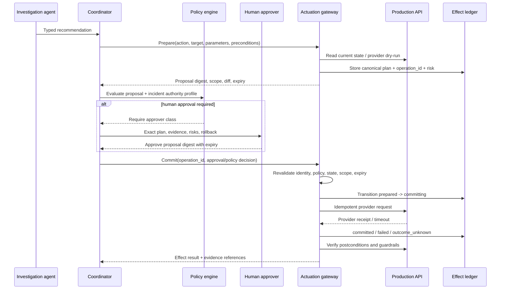
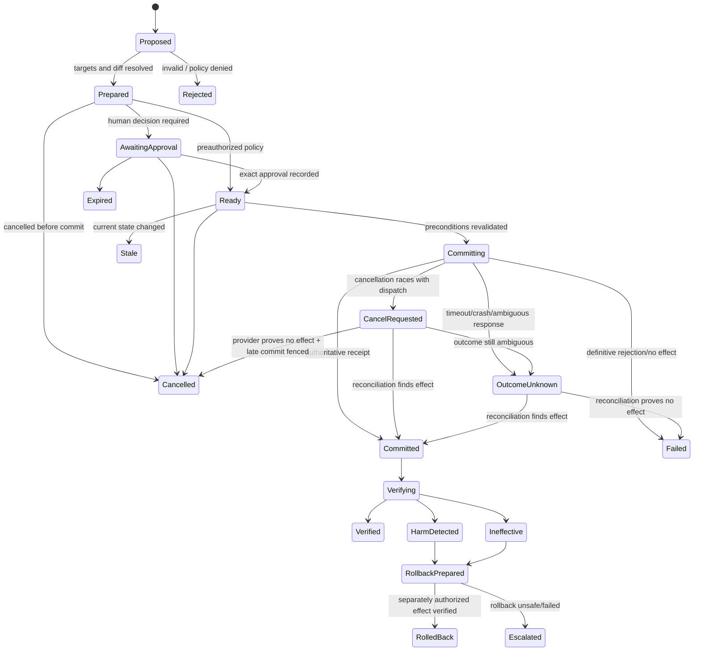
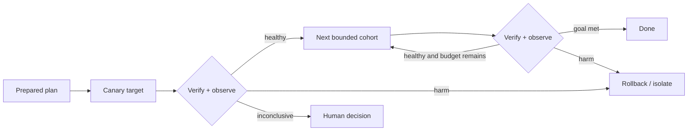

# Remediation, Approvals, Effects, and Rollback

> **Research date:** 2026-08-31  
> **Primary decision:** A model produces a proposal; only an isolated gateway may turn an eligible, current proposal into one identified production effect.

## 1. The effect boundary

Mutation is a distributed-systems and authorization problem, not a tool-calling feature. The safe unit is not a model turn or workflow step. It is a canonical **effect operation** with one stable identity, explicit authority, committed receipt, and observable outcome.



The gateway is not “the agent with fewer prompts.” It is deterministic application code with a much smaller API, separate identity, and independent kill controls.

## 2. Proposal contract

A proposal is immutable once approval begins:

| Field | Requirement |
|---|---|
| Proposal and operation IDs | Stable and globally unique within the effect domain |
| Incident, tenant, environment | Bound from authenticated/canonical state |
| Action class and tool version | Allowlisted semantic operation |
| Canonical target set | Fully resolved resource identities and computed count |
| Canonical parameters | Normalized ordering, defaults, units, and hashes |
| Rationale and evidence IDs | Support plus strongest contradiction/unknown |
| Expected impact | What user/system symptom should improve and when |
| Preconditions | State versions, health, capacity, quorum, maintenance, concurrent operations |
| Blast-radius budget | Maximum targets, regions, traffic, data, attempts, and duration |
| Risk classification | Deterministic policy inputs plus version |
| Evaluation/dry-run | Exact provider response, limitations, and timestamp |
| Verification | Signals, thresholds, comparison baseline, freshness, observation window |
| Abort conditions | When to stop before completing all targets |
| Rollback/compensation | Separate action, eligibility, hazards, and verification |
| Expiry | Maximum time before preparation and approval must repeat |

Canonicalize using a documented algorithm and hash the resulting representation. An approval binds to the digest, not a rendered explanation.

## 3. Prepare, evaluate, commit, verify

### Prepare

- Resolve logical targets through the current service/resource catalog.
- Fetch current resource versions and relevant health/capacity state.
- Compute provider request, target count, predicted diff, action risk, and rollback candidate.
- Run provider-side dry-run or validation where supported.
- Persist the operation as `prepared`; return a human-readable and machine-verifiable view.

### Evaluate

- Check tenant, incident phase, authority profile, action class, environment, target budget, data sensitivity, change freezes, concurrent effects, and approval class.
- Compare required evidence freshness and runbook/tool compatibility.
- Deny, require human approval, require stronger approval, or mark eligible for a preauthorized policy.
- Record the policy input digest, rule/version, decision, reasons, and obligations.

### Commit

- Reauthenticate the caller/delegation and consume an unexpired approval.
- Recompute or re-read every safety-critical precondition.
- Reject if the canonical effect or risk materially changed.
- Acquire a lease or use provider/application concurrency conditions.
- Mark `committing` durably before sending the provider request.
- Reuse the same operation/idempotency ID across retries.
- Persist the provider receipt or the explicit ambiguity state.

### Verify and observe

- Verify provider state and intended system/user condition independently.
- Check guardrails for new errors, saturation, data integrity, and expanded impact.
- Observe for the defined delay; initial success may precede harm.
- Mark `verified`, `ineffective`, `harm_detected`, or `verification_inconclusive`.
- Roll back or escalate according to preauthorized policy; never improvise an effect.

## 4. Approval semantics

An approval is a durable, auditable delegation:

```yaml
approval_id: apr_...
proposal_digest: sha256:...
operation_id: op_...
incident_id: inc_...
policy_version: policy-2026-08-17
incident_state_version: 42
approver:
  subject: user-or-role-id
  assurance: phishing-resistant-mfa
  delegated_role: operations-lead
scope:
  action_class: restart_workload
  targets: [workload-uid]
  max_targets: 2
decision: approved
issued_at: "..."
expires_at: "..."
single_use: true
conditions:
  - "error budget burn remains above threshold"
```

### Invalidate approval when

- target membership or count changes;
- parameters or defaults change;
- policy, runbook, tool, or provider schema changes materially;
- a required precondition is no longer true;
- incident scope, severity, authority profile, or environment changes;
- another operation changes the same resource;
- the approval expires, is revoked, or has already been consumed;
- rollback or verification plan changes materially.

A chat message such as “do it,” prior action, severity label, or standing broad role is not an exact approval unless the application deliberately translates it through an authenticated approval workflow.

## 5. Effect state machine



Do not transition `OutcomeUnknown` to `Failed` because a client timeout elapsed. Ask the provider by operation ID, inspect authoritative target state and audit records, or escalate.

### Effect record example

```yaml
effect_id: eff_01J...
operation_id: op_01J...          # stable across retries; new intentional effect gets a new ID
schema_version: 3
tenant_id: tenant_a
incident_id: inc_01J...
proposal_digest: sha256:...
approval_id: apr_01J...
action: {class: restart_workload, tool_version: 7}
targets:
  - {provider_uid: uid-7, expected_version: "88219"}
attempts:
  - attempt_id: att_1
    provider_request_id: req_91
    dispatched_at: "2026-08-31T14:25:03Z"
    status: timeout
status: outcome_unknown
receipt: null
reconciliation:
  next_check_at: "2026-08-31T14:25:13Z"
  probes: [provider_operation_lookup, target_version_read, provider_audit_lookup]
verification: {status: not_started, evidence_ids: []}
rollback_operation_id: null
```

Attempts are delivery history; `operation_id` is effect identity. Do not use the plan digest alone as the operation ID: two separately authorized, intentional repetitions of the same plan are different effects. Conversely, a transport/workflow retry of one operation must reuse the same ID even when it receives a new attempt ID.

## 6. Idempotency and concurrency

### Stable effect identity

Generate `operation_id` before the first provider call. Store it with the canonical plan and use it for:

- gateway deduplication;
- provider idempotency token when supported;
- resource annotations or change records when safe;
- logs, traces, metrics, approval, verification, and rollback linkage;
- reconciliation after restart or timeout.

Do not generate a new key for an automatic retry. A new plan after material state change gets a new operation ID and approval.

Provider idempotency retention may be shorter than the incident or ledger retention. Record the provider’s scope and expiry, keep the gateway ledger authoritative for duplicate suppression, and prohibit an automatic retry after the provider window expires unless reconciliation proves absence and policy authorizes a new operation.

### Concurrency controls

- Use expected resource versions, ETags, leases, or compare-and-set.
- Define conflict domains: resource, deployment, shard, service, region, or global control.
- Prevent incompatible operations from different incidents, humans, and automation.
- Make leases bounded and recoverable; a lost worker must not permanently block response.
- Re-read state at commit. Preparation snapshots become stale.
- Record partial target completion and never rerun completed targets blindly.

## 7. Dry-run and plan limitations

A dry-run is valuable evidence, not a guarantee:

- Kubernetes server-side dry-run performs authorization, defaulting, validation, and admission without persisting, but live state may change before commit and external systems may behave differently.
- Provider “plan” output may omit eventual effects, quotas, callbacks, controllers, or downstream dependencies.
- Read-only simulation cannot reproduce traffic races, cache dynamics, and delayed failures perfectly.
- A model’s natural-language prediction is not a dry-run.

Record which checks the dry-run performed, which it could not, its timestamp, and the state version. Pair it with canary scope, postconditions, guardrails, and rollback.

## 8. Progressive actuation

For an eligible action, use stages where the platform supports them:

1. Execute on the smallest representative target or canary.
2. Verify provider state and customer/system signals.
3. Wait the minimum meaningful observation window.
4. Expand only if guardrails remain healthy and the original budget permits.
5. Stop on inconclusive evidence when further expansion increases risk.



Target expansion is part of the approved plan. The agent cannot convert approval for a canary into global rollout.

## 9. Rollback is an effect

Rollback can be unsafe: schemas may be incompatible, traffic may have shifted, data migrations may be irreversible, the old version may contain a vulnerability, or a second change may have landed. Therefore:

- prepare and version rollback when the forward proposal is prepared;
- define conditions under which rollback is preauthorized;
- revalidate rollback targets and dependencies at execution time;
- use a distinct operation ID linked to the forward effect;
- enforce its own blast radius, concurrency, idempotency, and receipt;
- verify both restoration and new guardrail signals;
- escalate when rollback is unavailable, ambiguous, or harmful.

Configuration systems should make known-good rollback easy and avoid changes that lock responders out. Google’s configuration guidance notes that reverting can be safer and faster than constructing a new fix, but that is an operational tendency—not permission to roll back blindly.

## 10. Cancellation and reconciliation runbook

Cancellation means “stop work that has not irreversibly crossed its commit point.” It is not proof that work stopped and it is not rollback.

| Effect phase | Cancellation behavior |
|---|---|
| Proposed/prepared/awaiting approval/ready | Atomically mark `cancelled`, revoke or consume outstanding delegation as policy defines, release leases, and prevent commit |
| Provider request not yet dispatched | Persist cancellation before releasing the worker; no provider call is allowed afterward |
| Request in flight | Send provider cancellation only if supported, mark `cancel_requested`, and reconcile. The provider may have committed already |
| Partially applied | Stop undispatched targets, preserve per-target state, reconcile dispatched targets, then prepare compensation/rollback if authorized |
| Committed/verifying | Cancellation cannot erase the effect; stop further rollout/observation work only as policy permits and use a separate rollback operation |
| Outcome unknown | Keep `outcome_unknown`; a cancel response is additional evidence, not proof of no effect |

Reconcile in this order:

1. Look up the provider operation using the original operation/idempotency/request ID.
2. Read authoritative target state and versions without interpreting telemetry as configuration truth.
3. Inspect provider audit/change history for the dispatch interval.
4. Compare every target with the prepared plan and record `applied`, `not_applied`, or `unknown` independently.
5. Retry only the not-applied subset when provider semantics, idempotency window, current policy, and approval permit it. Otherwise escalate with a complete ambiguity packet.

A definitive `not_applied` result requires a provider guarantee or a fence that makes a late commit impossible. “The target still looks unchanged” is insufficient while an asynchronous request can still complete.

## 11. Circuit breakers and kill controls

Gateway circuit breakers should open on:

- target count or concurrency above approved budget;
- provider error, timeout, or ambiguous-outcome rates;
- verification or rollback failure rate;
- new SLO/customer harm beyond threshold;
- audit/effect-ledger unavailability;
- identity, policy, or catalog uncertainty;
- model/tool/runbook version outside the evaluated set;
- operator kill switch or credential revocation.

Fail closed for new mutations. Continue read-only response where safe. The kill path must work without the agent service, and responders need a visible manual takeover state.

## 12. Failure-injection tests for effects

- Crash before durable `committing`: resume can safely commit once or expire.
- Crash after provider accepted but before receipt persisted: reconciliation finds the existing effect.
- Provider returns timeout after applying only some targets: ledger records per-target uncertainty and does not repeat all.
- Workflow retry changes attempt ID but preserves operation ID.
- Approval expires one millisecond before commit: commit is rejected.
- Target selector expands after approval: canonical digest/precondition rejects.
- Human deploy races with commit: version conflict invalidates proposal.
- Dry-run succeeds but admission/provider state changes before commit: revalidation rejects or reprepares.
- Model requests a larger action after canary approval: policy denies expansion.
- Verification telemetry is unavailable: effect remains inconclusive; no success claim or automatic expansion.
- Guardrail breaches after an initially healthy response: observation loop triggers rollback/escalation.
- Rollback API times out after acceptance: rollback enters unknown outcome and reconciles.
- Effect ledger is unavailable: gateway performs no new mutation.
- Kill switch activates while work is queued: queued commits cancel; in-flight provider outcome is reconciled.
- Duplicate human approval messages consume one single-use approval.
- Cancellation is recorded before dispatch; a late worker cannot call the provider.
- Cancellation races with provider acceptance; the result remains unknown until reconciled and is never reported as cancelled-with-no-effect.
- Provider idempotency retention expires while an outcome remains unknown; automatic retry stays blocked.

## 13. Sources and related guides

- [Google SRE: AI in Reliability Engineering—2026 Practitioner’s Guide](https://sre.google/resources/practices-and-processes/ai-engineering-reliable-operations/)
- [Google SRE Workbook: Canarying Releases](https://sre.google/workbook/canarying-releases/)
- [Google SRE Workbook: Configuration Design and Best Practices](https://sre.google/workbook/configuration-design/)
- [Kubernetes API concepts, including server-side dry-run](https://kubernetes.io/docs/reference/using-api/api-concepts/)
- [AWS Systems Manager Change Manager](https://docs.aws.amazon.com/systems-manager/latest/userguide/change-manager.html) — useful workflow pattern; see the research packet for the 2025 new-customer limitation
- [Idempotency and Side Effects](../../reliability/idempotency-and-side-effects.md)
- [Durable Execution](../../runtime/durable-execution.md)
- [Run Controls](../../runtime/run-controls.md)
