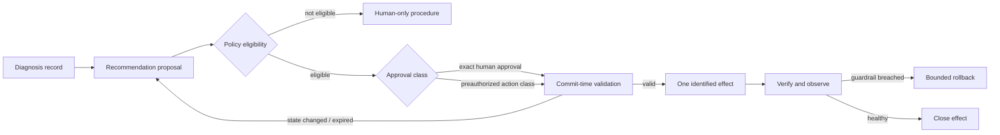
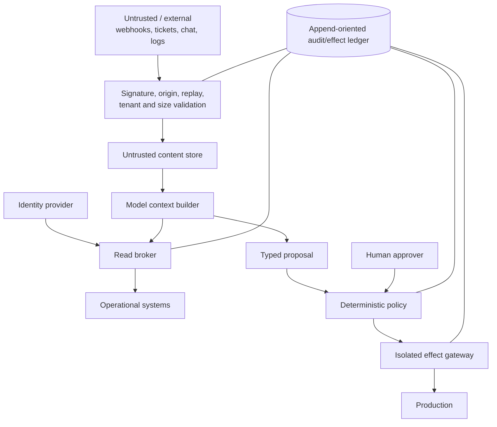

# Requirements, Authority, and Threat Model

> **Research date:** 2026-08-31  
> **Primary decision:** Define the safety boundary before selecting a model, framework, or tool protocol.

## 1. Purpose and non-goals

The system supports responders by turning fragmented operational signals into a cited incident record, proposing falsifiable investigations, locating validated runbooks, drafting bounded mitigations, and preserving a usable timeline. Its success criterion is safer and faster restoration—not the number of autonomous actions or the fluency of its narrative.

### In scope

- Verify, normalize, deduplicate, and enrich alert events.
- Correlate evidence into incident candidates while preserving original identities.
- Query approved metrics, logs, traces, deployment, configuration, topology, and ownership systems.
- Maintain an event timeline and structured, revisable hypotheses.
- Recommend mitigations with preconditions, blast radius, verification, abort, and rollback steps.
- Execute only separately authorized action classes through a deterministic gateway.
- Draft internal and external updates constrained by recorded facts.
- Produce a human-reviewed postmortem draft and track action items.
- Evaluate the full trajectory under replay, simulation, and fault injection.

### Explicit non-goals

- Replacing Incident Command, Operations, Communications, Planning, or service ownership.
- Making the model the source of truth for incident state or policy.
- Giving a diagnostic agent a production shell, cluster-admin credential, or general cloud role.
- Inferring authorization from urgency, user phrasing, model confidence, a runbook, or prior approval.
- Automatically publishing causal claims that have not been established.
- Guaranteeing root cause during the response; mitigation may precede causal closure.
- Making the agent, its provider, or its knowledge index a dependency for paging and manual response.
- Treating a benchmark score, vendor case study, or single successful replay as a general safety case.

## 2. Functional requirements

| ID | Requirement | Acceptance signal |
|---|---|---|
| F-01 | Preserve source event identity and provenance | Any incident fact can be traced to its original event or artifact |
| F-02 | Separate delivery dedup, alert fingerprinting, grouping, and incident correlation | Duplicate transport events do not create duplicate work; distinct failures can still split |
| F-03 | Maintain durable incident phase, roles, scope, timeline, decisions, and relationships | Restart or redeploy reconstructs the same state without replaying effects |
| F-04 | Gather only bounded, authorized evidence | Every query records tenant, target, interval, limits, caller, result digest, and freshness |
| F-05 | Represent hypotheses as testable records | Each active hypothesis has support, contradiction, predicted observations, and next safe test |
| F-06 | Select only eligible runbook versions | Ownership, environment, prerequisites, last validation, risk, rollback, and verification are checked |
| F-07 | Produce typed proposals | Proposal schema contains target, canonical parameters, impact, preconditions, risks, verification, abort, rollback, and expiry |
| F-08 | Bind approvals to exact proposals | Material parameter or state change invalidates approval |
| F-09 | Execute effects idempotently and reconcile uncertainty | Stable operation ID and authoritative receipt prevent duplicate effects |
| F-10 | Verify recovery and delayed harm | Postconditions, guardrails, observation window, and rollback state are explicit |
| F-11 | Draft factual communications | Every factual statement resolves to incident evidence or an approved decision |
| F-12 | Export an auditable post-incident record | Actual events, hypotheses, decisions, approvals, effects, and human edits remain distinguishable |

## 3. Non-functional requirements

| Quality | Requirement |
|---|---|
| Availability | Paging and manual response work without the agent. Agent degradation is visible and fail-closed for mutations. |
| Latency | Severity-aware budgets cover intake, first useful evidence, proposal creation, approval wait, commit, and verification. A missed budget degrades gracefully instead of returning an unbounded late answer. |
| Security | Least privilege, tenant isolation, scoped identities, secret non-disclosure, untrusted-data separation, signed event intake, and complete effect audit. |
| Reliability | Durable state, bounded retries, idempotency, cancellation, timeouts, reconciliation, concurrency control, and explicit terminal states. |
| Observability | Business, safety, workflow, tool, model, and cost telemetry correlate without storing unnecessary secrets or private reasoning. |
| Maintainability | Provider, framework, and protocol adapters do not define domain state or policy. Runbooks and tool schemas are versioned and owned. |
| Portability | The domain event model and proposal/effect contracts do not depend on one model provider or incident vendor. |
| Cost control | Per-incident budgets, bounded context and queries, model routing, storm backpressure, and reserved responder capacity. |
| Auditability | It is possible to reconstruct who or what observed, proposed, approved, executed, verified, rolled back, and communicated each change. |

## 4. Authority is a lattice, not a mode switch

A single “autonomous” boolean hides the decisions that matter. Evaluate authority across at least these dimensions:

- **Environment:** development, staging, canary, production, regulated production.
- **Target scope:** one instance, one shard, one service, one region, global.
- **Action class:** observe, simulate, restart, scale, drain, rollback, modify configuration, change data, alter access.
- **Trigger:** human request, approved runbook, policy event, agent recommendation.
- **Reversibility:** automatically reversible, manually reversible, compensatable, irreversible.
- **Evidence:** required signals, freshness, quorum, and health preconditions.
- **Budget:** attempts, targets, time, concurrency, error rate, and estimated impact.
- **Approval:** none for reads, exact human approval, two-person approval, or preauthorized policy.



The model may recommend an authority class, but deterministic policy computes whether the proposal is eligible. Model uncertainty can force escalation; high confidence cannot increase permission.

### Separation-of-duty matrix

| Capability | Intake | Investigator | Coordinator | Policy engine | Actuation gateway | Human role |
|---|---:|---:|---:|---:|---:|---:|
| Verify alert sender | Allow | — | — | — | — | Audit |
| Read bounded telemetry | — | Allow | Request | Enforce read policy | — | Allow |
| Update hypotheses/timeline | Append | Propose | Append | — | — | Correct/override |
| Declare incident/change severity | Suggest | Suggest | Apply policy | — | — | Own/override |
| Approve effect | — | — | Route | Validate | Consume | Own where required |
| Hold mutation credential | — | Never | Never | Never | Scoped only | Break-glass per policy |
| Publish external status | — | Draft | Route | Validate audience/rules | Publish adapter only | Communications owns |
| Disable automation | — | — | Request | — | Enforce | Out-of-band control |

### Resolve authority from authenticated state

Every consequential request should resolve to an authority tuple before work begins:

```text
(subject, tenant, incident_role, incident_id, action_class,
 target_scope, environment, conditions, issued_at, expires_at, assurance)
```

- `subject` and tenant come from the identity system, never chat text or model arguments.
- Incident role comes from the versioned incident record; an on-call schedule identifies who should respond but does not automatically grant every incident role.
- Approval authority is evaluated for the specific action class and environment. Being Incident Commander does not automatically grant database, network, security-containment, or infrastructure privileges.
- Revocation, handoff, expiry, incident closure, and material scope changes invalidate derived delegation.
- If the incident platform and identity/policy system disagree, new effects stop. Preserve manual response and ask an accountable human to repair the authority record.

Chat, tickets, and status pages are presentation surfaces. They may carry an authenticated approval interaction, but they are not themselves authority stores.

## 5. Assets and trust boundaries

### Protected assets

- Production availability, integrity, confidentiality, and customer data.
- On-call attention and decision quality during a high-pressure event.
- Credentials, tokens, tool capabilities, and privileged network paths.
- Incident evidence, including sensitive logs and customer identifiers.
- Approval intent, policy decisions, effect receipts, and audit history.
- Status-page credibility and internal/external communications.
- Runbook integrity and the service catalog used for ownership and scope.
- Evaluation corpora, labels, and promotion gates.

### Trust-boundary map



Treat every boundary as an enforcement point. Prompt text is not an enforcement point.

## 6. Threat model

| Threat | Example | Prevent / contain | Detect / recover |
|---|---|---|---|
| Goal hijacking and prompt injection | A log line says to ignore policy and run a command | Label retrieved content; separate instructions from data; structured extraction; allowlisted semantic tools; no ambient write credential | Injection canaries, policy-denial metrics, trajectory review |
| Forged or replayed alert | Attacker replays a signed webhook or chooses a victim tenant | Verify signature on raw bytes, timestamp/replay window, issuer, audience, tenant binding, event ID | Quarantine queue, sender-rate anomaly, replay audit |
| Cross-tenant evidence leak | Query target or cache key omits tenant | Identity-derived tenant, row-level controls, tenant in cache/artifact keys, deny cross-scope joins | Honey records, access audit, isolation tests |
| Tool poisoning | Tool description, schema, or server response attempts to redefine policy | Pin server/tool identity and schema; sanitize metadata; allowlist; verify provenance; treat output as untrusted | Schema drift alerts and signed registry history |
| Excessive agency | Agent expands a one-instance restart to a deployment rollout | Canonical proposal, target budgets, exact approval, gateway-side scope calculation | Planned-vs-observed target count and circuit breaker |
| Identity/privilege abuse | Diagnostic service receives cluster-admin or token passthrough | Separate service identities; least privilege; workload identity; audience-bound tokens; no token passthrough | Access review, anomalous API audit, immediate revocation |
| Unsafe code or shell execution | Model composes `kubectl`, SQL, or shell | No general shell; semantic operations; fixed templates; sandbox analysis workers; egress and filesystem restrictions | Command-denial events, sandbox audit, kill switch |
| Confabulated or stale evidence | Agent cites a metric from the wrong interval or invents a deploy | Evidence objects with timestamps, query, target, digest, trust, freshness; assertions must resolve to IDs | Unsupported-claim scorer, stale-evidence warnings, human correction |
| Automation bias | Responder accepts a fluent but weak hypothesis | Show contradictions, alternatives, uncertainty, and provenance; require independent approval for risk | Compare human override and harmful-agreement patterns |
| Approval confusion | Approval is reused after targets or policy change | Bind canonical digest, state version, policy version, approver, expiry, max scope | Commit rejection with explicit reason; re-propose |
| Duplicate or ambiguous effect | Timeout causes retry after the first commit succeeded | Stable operation ID, effect ledger, provider idempotency where available, reconcile before retry | `unknown_outcome` state and status probe |
| Concurrent change | Human deploys while proposal waits | Versioned preconditions, lease/optimistic concurrency, commit-time read | Conflict event, invalidate approval, refresh plan |
| Rollback harm | Rollback version is incompatible or affects more targets | Rollback is separately specified, scoped, authorized, tested, and verified | Post-rollback guardrails and escalation |
| Communication leak | Draft copies secrets or customer data from logs | Fact allowlist, redaction/DLP, audience policy, human publication | Publication audit and emergency correction path |
| Audit tampering | Same actor edits action history | Append-oriented store, immutable artifact digests, restricted correction events | Integrity checks and external audit export |
| Evaluation gaming | Agent optimizes a known replay or LLM judge style | Held-out incidents, deterministic invariants, repeated trials, mutation/fault variants | Drift monitoring and evaluator disagreement review |
| Resource exhaustion | Alert storm triggers thousands of expensive investigations | Coalesce work, severity queues, per-tenant/model/query budgets, backpressure, reserved capacity | Shed enrichment, preserve paging, storm dashboard |

Tenant isolation applies to every derived object, not just database rows: queue partitions, workflow/search keys, object-store paths and encryption context, caches, vector namespaces, model-provider project or routing policy, trace/log access, evaluation fixtures, and effect-ledger indexes. Test isolation with two simultaneously active tenants whose service names, alert fingerprints, incident titles, and tool arguments intentionally collide.

This model maps closely to NIST AI 600-1 risks such as confabulation, privacy, and human–AI configuration; and to OWASP’s 2026 agentic risks including goal hijacking, tool misuse, identity abuse, supply-chain compromise, and unexpected code execution. It must still be specialized to the organization’s services, credentials, regulations, and adversaries.

## 7. Security requirements by lifecycle

### Before an incident

- Inventory every evidence and effect integration, owner, identity, network route, data class, and maximum scope.
- Threat-model the actual runbook/action pair, not merely the overall agent.
- Sign or otherwise integrity-protect runbook versions and tool registry changes.
- Define promotion and automatic-demotion criteria for each action class.
- Exercise credential revocation, manual takeover, and kill switches.

### During an incident

- Freeze or explicitly record safety-critical configuration changes to the agent itself.
- Show source degradation, stale evidence, policy version, and authority level to responders.
- Do not let “SEV-1” become a universal bypass. Use a predefined emergency policy with stronger audit and narrower duration.
- Preserve negative results, conflicting evidence, rejected proposals, and human overrides.
- Escalate when the tool cannot establish a fresh precondition or an effect outcome.

### After an incident

- Rotate exposed credentials and revoke temporary delegation.
- Compare planned, approved, attempted, observed, and communicated outcomes.
- Add the trajectory to an evaluation set after privacy review.
- Treat agent mistakes and near misses as system defects, not operator blame.
- Demote an action class automatically when a safety gate or rollback expectation fails.

## 8. Minimal safety case per action class

Before D2 or D3, maintain a short, reviewable safety case:

1. **Claim:** the action improves a defined failure mode within a bounded scope.
2. **Eligibility:** observable prerequisites and exclusions are machine-checkable.
3. **Authority:** the identity, policy, approval class, expiry, and maximum effect are explicit.
4. **Hazards:** wrong target, wrong timing, repeated effect, concurrency, partial success, delayed harm, and rollback failure are analyzed.
5. **Controls:** dry-run/evaluation, preconditions, budgets, idempotency, verification, observation window, abort, and rollback exist.
6. **Evidence:** replay, staging, canary, fault injection, and repeated stochastic results meet thresholds.
7. **Operations:** owner, dashboard, pager, kill switch, audit, review cadence, and demotion rule exist.

If a proposal cannot be represented within this case, keep it human-executed.

## 9. Sources and related guides

- [NIST SP 800-61 Rev. 3: Incident Response Recommendations and Considerations](https://doi.org/10.6028/NIST.SP.800-61r3)
- [NIST AI 600-1: Generative AI Profile](https://doi.org/10.6028/NIST.AI.600-1)
- [OWASP Top 10 for Agentic Applications 2026](https://genai.owasp.org/resource/owasp-top-10-for-agentic-applications-for-2026/)
- [Google SRE: Managing Incidents](https://sre.google/sre-book/managing-incidents/)
- [Google SRE: AI in Reliability Engineering—2026 Practitioner’s Guide](https://sre.google/resources/practices-and-processes/ai-engineering-reliable-operations/)
- [Permissions, Sandboxing, and Secrets](../../security/permissions-sandboxing-and-secrets.md)
- [Prompt Injection and Untrusted Data](../../security/prompt-injection-and-untrusted-data.md)
- [Tool Contracts](../../tools/tool-contracts.md)
