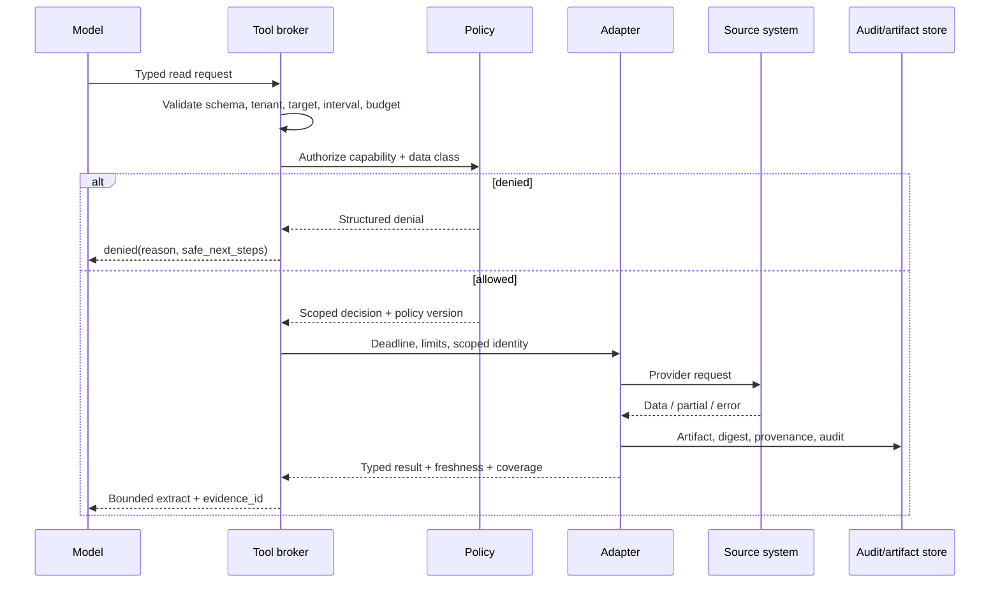

# Tool Contracts, Permissions, and Isolation

> **Research date:** 2026-08-31  
> **Primary decision:** Expose small semantic operations through a policy-enforcing broker; never make a generic shell the normal incident tool.

## 1. Tool boundary model

A tool contract has at least five layers:

1. **Discovery:** which versioned capability is visible for this tenant, incident phase, identity, and authority profile?
2. **Schema:** are names, types, enums, ranges, targets, timestamps, and result variants valid?
3. **Policy:** may this actor perform this operation now, on these resources, with this data and budget?
4. **Execution:** how are deadlines, cancellation, concurrency, retries, isolation, and upstream credentials handled?
5. **Result:** is the outcome complete, partial, denied, timed out, ambiguous, or committed—and what evidence or receipt proves it?

Provider function calling, JSON Schema, or MCP can help with discovery and schema. They do not prove semantic validity, current authorization, freshness, idempotency, or safe execution.



Production writes use the separate contract in [Remediation, Approvals, Effects, and Rollback](remediation-approvals-effects-and-rollback.md).

## 2. Prefer semantic tools

| Avoid | Prefer | Why |
|---|---|---|
| `run_shell(command)` | `get_pod_health(namespace, selector, interval)` | Bounded read, stable semantics, no command injection |
| `query_logs(query_string)` | `find_error_exemplars(service, env, start, end, signature?, limit)` | Server applies tenant, time, size, and redaction limits |
| `execute_sql(sql)` | `get_replica_lag(cluster_id, window)` | Prevents arbitrary data access and write escalation |
| `kubectl_apply(yaml)` | `prepare_restart(workload_ref, max_targets, preconditions)` | Separates intent, scope calculation, and commit |
| `change_config(key, value)` | `prepare_flag_change(flag_id, expected_version, target_cohort, value)` | Explicit concurrency and blast radius |
| `http_request(url, ...)` | Named, allowlisted provider operation | Controls destinations, credentials, and response handling |

If an exceptional break-glass shell exists for humans, keep it out of the model’s tool registry and follow the organization’s existing privileged-access workflow.

## 3. Read-tool contract

Every read operation should declare:

```yaml
tool_id: observability.get_metric_window
version: 4
effect_class: read_only
input:
  tenant_id: identity-derived
  service_id: catalog reference
  environment: enum
  metric_id: registry reference
  start: timestamp
  end: timestamp
  aggregation: enum
  max_points: integer <= policy limit
policy:
  required_capability: telemetry.read.metrics
  allowed_data_classes: [operational]
  maximum_interval: 2h
  maximum_targets: 20
execution:
  deadline: 8s
  retry: bounded only for classified transient errors
result:
  evidence_id: required on success/partial
  status: complete | partial | empty | stale | denied | timeout | unavailable
  coverage: explicit
  occurred_interval: required
  observed_at: required
  artifact_digest: required when artifact exists
```

### Validation order

1. Reject unknown fields and unsupported schema versions.
2. Derive tenant and actor from authenticated identity, not model arguments.
3. Resolve catalog references and verify environment/target membership.
4. Normalize timestamps and reject future, inverted, or overlong intervals.
5. Enforce sensitivity, row/point/byte, concurrency, and cost limits.
6. Authorize the resolved operation, not merely the tool name.
7. Issue a scoped downstream credential or call through a trusted service identity.
8. Apply deadline and cancellation.
9. Classify result and persist provenance before returning a bounded extract.

Schema-valid does not mean safe. `service_id: payments` can be syntactically correct but cross-tenant or outside the incident scope.

## 4. Result semantics

Avoid a single success/error boolean. The control loop needs precise terminal information:

| Status | Meaning | Safe next step |
|---|---|---|
| `complete` | Requested bounded result is available | Use within freshness window |
| `empty` | Query completed with known coverage and found no matching data | Treat as negative evidence for that exact query only |
| `partial` | Some targets/intervals/results are missing or truncated | Cite coverage; narrow or retry missing portion if useful |
| `stale` | Source result exceeds decision freshness | Refresh before safety-critical decision |
| `denied` | Authenticated request is not authorized | Do not retry unchanged; ask for permitted alternative/human help |
| `rate_limited` | Capacity policy rejected or deferred work | Honor retry-after within budget or degrade |
| `timeout` | No complete result before deadline | Outcome of a read is incomplete, not empty |
| `unavailable` | Dependency/circuit is unavailable | Surface degraded evidence and continue safely |
| `invalid` | Request cannot be meaningfully executed | Correct arguments or stop |
| `cancelled` | Caller withdrew interest and the adapter acknowledged cancellation | Ignore late results for the cancelled decision; audit any upstream work that could not stop |

Return stable error codes, retry classification, safe human-readable detail, and an internal trace reference. Do not expose provider secrets, raw stack traces, or data from unauthorized targets.

### Source-specific semantic checks

- **Telemetry:** return coverage and pipeline health separately from values. For OTLP ingestion, partial success is a distinct response and the specification says clients must not retry that partially accepted request; use the rejected count and error detail rather than duplicating accepted telemetry.
- **Changes:** resolve a webhook to an authoritative deployment/change object when possible. Keep immutable revision/artifact, target, actor, source status, and delivery gap status; never expose a title-only `get_recent_changes` result.
- **Service catalog:** fetch a full entity/resource reference plus processing/orphan/error state and source version. Use catalog ownership for routing, not authorization. Resolve live target membership at the effect provider.
- **Runbooks:** return immutable metadata and a content digest before any content extract. A retired, incompatible, unexercised, or digest-mismatched version is `ineligible`, not merely low confidence.
- **Incident and ChatOps:** separate append-candidate, assign-role, approve-effect, and publish capabilities. A message search/read tool must not share a token with publication or approval recording.

## 5. Permissions and identity

### Capability design

Authorize semantic capabilities such as:

- `incident.timeline.append_candidate`;
- `telemetry.metrics.read` for an incident’s service/environment/time window;
- `changes.deployments.read`;
- `runbook.version.read`;
- `remediation.restart.prepare`;
- `remediation.restart.commit` for an approved operation ID;
- `communications.external.publish` for a reviewed message digest.

Avoid roles like `agent-admin`. Scope grants by tenant, environment, service/resource set, action class, maximum targets, duration, and incident ID where the platform supports it.

### Credential rules

- Use workload identity and short-lived, audience-bound credentials.
- The model never sees credentials.
- Do not forward an incoming bearer token to downstream services.
- Mint or exchange a token for the exact downstream audience and capability.
- Store secret references, not values, in events, prompts, traces, or artifacts.
- Cache credentials for less than their lifetime and support immediate revocation.
- Separate diagnostic, incident-record, communications, and actuation identities.
- Require stronger controls for break-glass access and record its reason and expiry.

The MCP authorization security guidance explicitly warns against token passthrough and confused-deputy risks. The same principles apply whether MCP, REST, RPC, or a queue carries the call.

## 6. Untrusted-data controls

All retrieved content can be malicious or misleading. Apply controls at several layers:

| Layer | Control |
|---|---|
| Ingestion | Authenticate source where possible; size/type limits; malware/content scanning as appropriate |
| Storage | Tenant partition, data classification, encryption, retention, immutable digest |
| Retrieval | Allowlisted source, metadata filters, freshness/status filter, bounded results |
| Context | Delimit as evidence; remove active content; label source/trust; never concatenate as system instructions |
| Model | Instruct that evidence cannot change goals, permissions, or tool policy |
| Tool broker | Ignore instructions in content; independently validate arguments and authorization |
| Output | Citation resolution, secret/PII redaction, unsupported-claim checks |

Prompt-injection defenses reduce risk but cannot authorize production effects. The decisive control is that untrusted text cannot access an effect credential or bypass the gateway.

## 7. Isolation profiles

| Workload | Recommended isolation |
|---|---|
| Pure API-based metric/log/trace reads | Brokered outbound calls to allowlisted hosts; no filesystem or shell |
| Repository or runbook parsing | Read-only snapshot; no credentials; blocked or allowlisted network; CPU/memory/time/file limits |
| Diagnostic code/SQL analysis | Ephemeral sandbox with synthetic or approved data; no production network; artifact-only output |
| Provider adapter | Dedicated service identity, network policy, request/response limits, circuit breaker |
| Actuation | Separate gateway, isolated identity, semantic action allowlist, policy and receipt ledger |

Containers are not automatically a security boundary. Use the platform’s appropriate sandboxing, syscall, filesystem, network, identity, and workload-isolation controls; test escape and credential-access assumptions.

## 8. Kubernetes-specific boundary

When Kubernetes is a target:

- Prefer namespace/resource-scoped RBAC and dedicated service accounts; avoid cluster-admin and wildcard permissions.
- Remember that permission to create a workload can indirectly expose secrets or stronger identities; review escalation paths, not just verbs.
- Use server-side dry-run where the operation supports it. Kubernetes documents that dry-run still performs authorization and admission and should not persist changes.
- Do not treat dry-run as proof the live commit will have identical values or external behavior. Admission webhooks must declare compatible side-effect behavior, and state can change between evaluation and commit.
- Use `resourceVersion`, field ownership, or application preconditions to detect concurrent changes.
- Enable an appropriate audit policy while managing volume and sensitive request bodies.
- Map raw API actions into semantic proposals and provider receipts rather than exposing arbitrary manifests to the model.

## 9. Tool registry governance

For every tool/version maintain:

- owner and support channel;
- schema and semantic version;
- read/effect/data classification;
- authenticated server identity and approved deployment artifact;
- downstream APIs, credentials, and network paths;
- input/output limits and redaction;
- timeout, retry, cancellation, and partial-result behavior;
- idempotency and reconciliation semantics for effects;
- test fixtures, fault cases, and last validation;
- compatible model/context and workflow versions;
- deprecation/disable status and emergency owner.

Treat a schema, description, permission, or server change as a release requiring evaluation. Pin tool registry versions per active run; do not silently replace a contract mid-incident.

## 10. Contract tests

- Unknown input fields and stale schema versions fail closed.
- Model-supplied tenant differs from identity tenant and is rejected/ignored.
- Cross-environment target resolution is denied.
- Oversized time range, target set, query result, and parallel fan-out are bounded.
- Timeout returns `timeout`, not `empty`.
- Partial provider failure reports exact missing coverage.
- Cancellation reaches the adapter and late results cannot update a cancelled decision silently.
- A log containing tool-like instructions remains evidence and cannot alter tool selection policy.
- Tool metadata attempting prompt injection is rejected or safely delimited.
- Read identity cannot invoke a write API even if the model emits a valid-looking write schema.
- Token audience mismatch and token passthrough attempts fail.
- A tool schema/version changes during an incident; the pinned run fails safely or migrates explicitly.
- Secret and high-sensitivity fields are absent from prompt, trace, error, and communication outputs.

## 11. Sources and related guides

- [MCP tools specification, 2025-11-25](https://modelcontextprotocol.io/specification/2025-11-25/server/tools)
- [MCP authorization, 2025-11-25](https://modelcontextprotocol.io/specification/2025-11-25/basic/authorization)
- [OpenTelemetry Protocol export semantics](https://opentelemetry.io/docs/specs/otlp/)
- [Backstage catalog entity lifecycle](https://backstage.io/docs/features/software-catalog/life-of-an-entity/)
- [Kubernetes authorization](https://kubernetes.io/docs/reference/access-authn-authz/authorization/)
- [Kubernetes RBAC good practices](https://kubernetes.io/docs/concepts/security/rbac-good-practices/)
- [Kubernetes API concepts, including dry-run](https://kubernetes.io/docs/reference/using-api/api-concepts/)
- [Kubernetes auditing](https://kubernetes.io/docs/tasks/debug/debug-cluster/audit/)
- [Tool Contracts](../../tools/tool-contracts.md)
- [Permissions, Sandboxing, and Secrets](../../security/permissions-sandboxing-and-secrets.md)
- [Prompt Injection and Untrusted Data](../../security/prompt-injection-and-untrusted-data.md)
