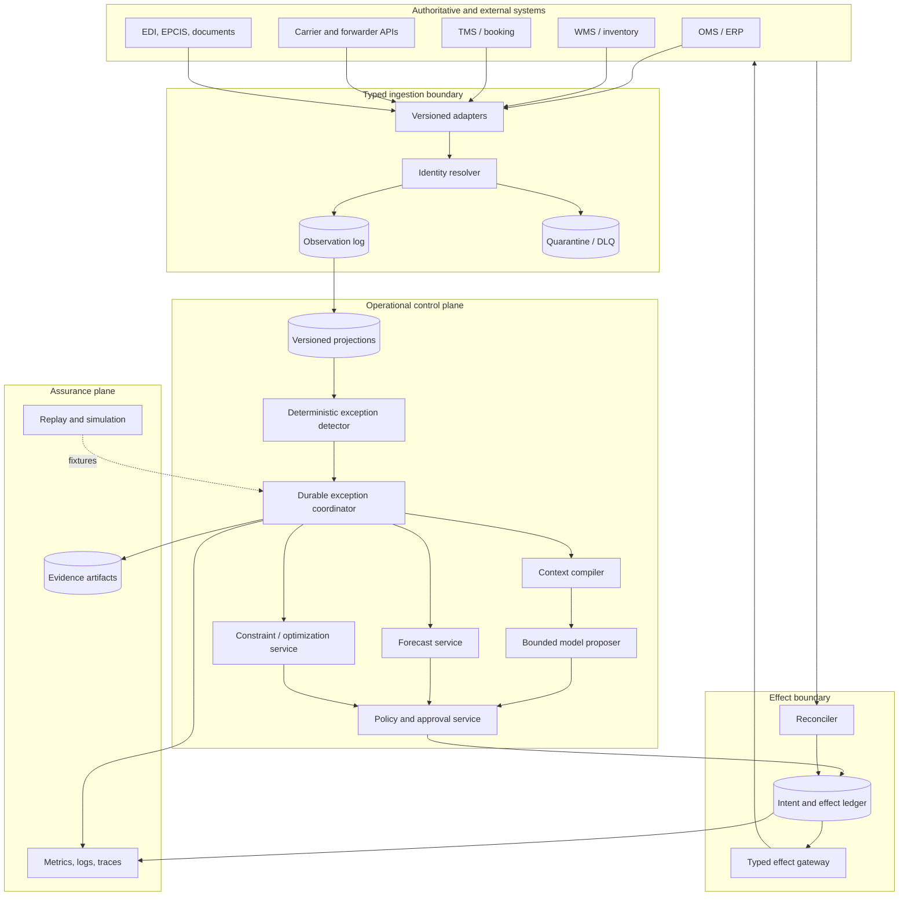
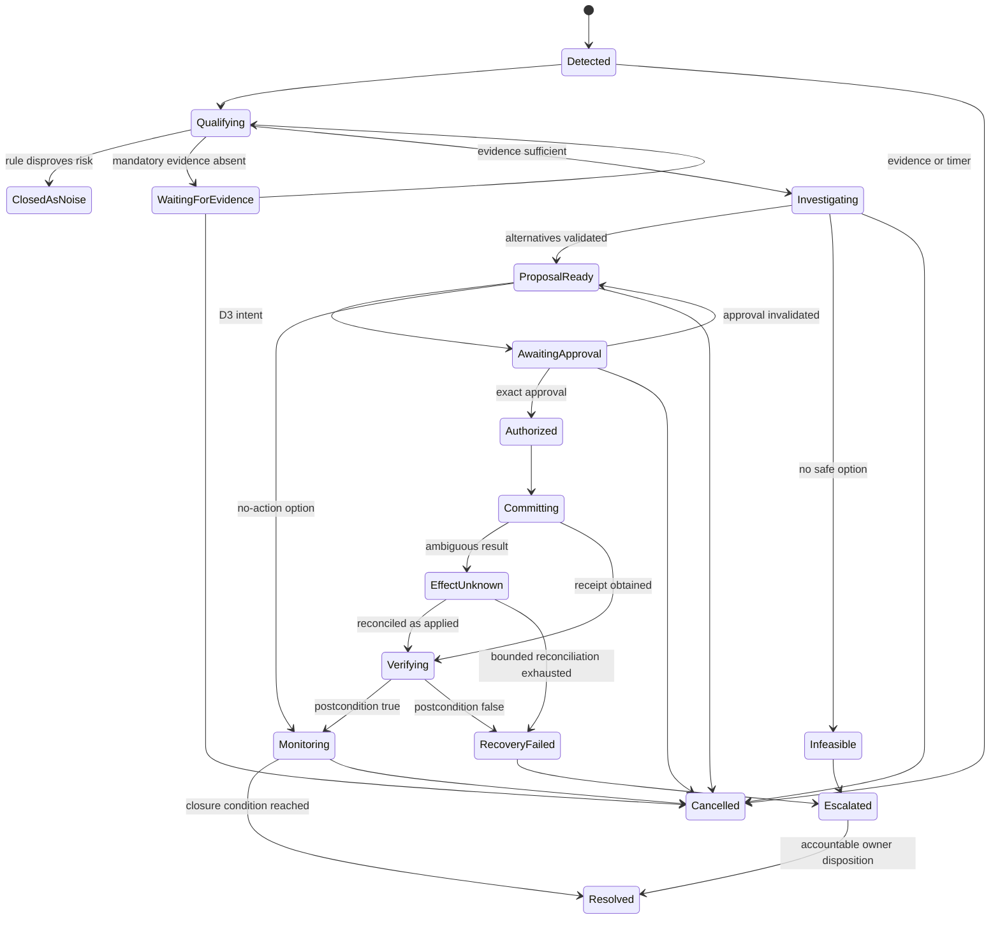

# Reference Architecture and Runtime Selection

Status: production design guide  
Last reviewed: 2026-08-31

The reliable architecture is a durable workflow around a small reasoning component, not an autonomous society of agents. Logistics already supplies the distribution: many systems, late events, inconsistent identities, long waits, physical irreversibility, and independent operators. Adding conversational agents does not make those boundaries safer.

## Reference architecture



This can begin as one deployable service plus workers and a relational database. The diagram represents responsibility boundaries, not mandatory microservices.

## Component contracts

| Component | Owns | Must not own |
|---|---|---|
| Adapter | Authentication, protocol/schema version, normalization, rate-limit behavior, raw receipt reference | Domain authority, exception policy, or natural-language decisions |
| Identity resolver | Namespace mapping, ambiguity and collision status, effective dates | Inventing a canonical match from similarity alone |
| Observation log | Immutable normalized observations and correction links | Current business truth by itself |
| Projection | Rebuildable current view under declared conflict/freshness rules | Hidden facts not derivable from evidence |
| Detector | Deterministic threshold and invariant evaluation | Open-ended cause analysis |
| Coordinator | Lifecycle, timers, retries, cancellation, durable waits, action order | Free-form agent autonomy |
| Context compiler | Query plan, evidence selection, token budget, provenance, redaction | Changing authoritative state or retaining unrestricted transcripts |
| Model proposer | Hypotheses, questions, evidence-linked explanation, typed alternative proposals | Feasibility, authorization, regulatory judgment, or effect execution |
| Forecast service | Versioned probabilistic ETA/demand outputs and quality metadata | Converting estimates into observations |
| Optimization service | Hard constraints, objectives, scenarios, result status and bound | Claiming optimality without solver proof |
| Policy/approval service | Risk tier, role, limits, state/version checks, exact approval | Accepting model text as authority |
| Effect gateway | Credential scope, preconditions, semantic operation ID, transport call | Deciding what should happen |
| Reconciler | Read-back, postcondition comparison, unknown-outcome resolution | Repeating a write because no response arrived |
| Telemetry | Diagnostic metrics, logs, sampled traces | Acting as the legal or operational effect record |

## The durable exception coordinator

Run one coordinator instance per exception aggregate. Its workflow is explicit:



The transition table, not the model, determines legal moves. A transition records its trigger, prior version, new version, actor, timestamp, policy decision, and evidence references. Long waits are persisted; process restarts are ordinary.

### Durable clocks, waits, and ownership

Every wait is a durable record, not an in-process sleep:

```yaml
workflow_clock:
  clock_id: clock_01J...
  exception_id: exc_01J...
  clock_type: tender_response_deadline
  due_at: 2026-08-31T10:45:00Z
  timezone_basis: UTC
  business_calendar_ref: carrier_response/in01/v3
  expected_state_version: 12
  owner_queue: carrier_exceptions_south_asia
  escalation_policy_ref: tender_timeout/high/v4
  status: active
```

Persist decision, approval, quote, appointment, hold, connector-retry, reconciliation, and manual-review clocks separately because they have different expiry semantics. A wake-up must compare its `expected_state_version`, clock status, current charter, and resource versions before acting. Closing, cancelling, replanning, or superseding work tombstones obsolete clocks; a late callback is recorded and becomes a no-op.

Workers acquire a lease with a monotonically increasing fencing token. Every state transition, outbox dispatch, and effect claim includes that token; storage rejects a lower token even if an old worker resumes after a pause. Queue visibility timeout alone is not fencing. Human queues expose owner, severity, decision deadline, oldest age, acknowledgement time, and backup escalation, and they never hide an unresolved effect behind a resolved UI case.

### Workflow activities

Keep activities short, typed, and retry-aware:

1. load an explicitly versioned projection snapshot;
2. validate identity, scope, freshness, and minimum evidence;
3. compute deterministic risk features and decision deadline;
4. compile bounded context and ask the model for a schema-constrained analysis;
5. call forecast or optimization services only when the charter requires them;
6. validate every alternative against hard constraints and policy;
7. publish the proposal or request exact approval;
8. execute one prepared intent through the gateway;
9. reconcile the expected postcondition and continue monitoring;
10. close only under the charter's closure condition.

Model calls and downstream API calls are activities, never workflow decisions that must replay identically. Store their typed outputs and version metadata. Workflow replay consumes recorded results rather than calling providers again.

## Planning strategy

Use three distinct planning mechanisms:

| Layer | Owner | Examples | Replanning rule |
|---|---|---|---|
| Macro workflow | Deterministic coordinator | qualify, investigate, propose, approve, commit, verify | Code/versioned transition table only |
| Operational optimization | Solver or rules | feasible routing, allocation, capacity, time windows, cost objective | New material snapshot or scenario |
| Local semantic reasoning | Model | explain conflicts, rank questions, form causes, draft operator summary | Bounded by budget and schema |

The model may propose which declared tools to call within one state, but it cannot invent operations, skip states, relax constraints, or create a recursive objective. Limit tool turns, wall time, tokens, and artifact size. Persist a stop reason such as `complete`, `insufficient_evidence`, `tool_budget_exhausted`, `constraint_failure`, or `human_required`.

### Replanning triggers

Replan only on a material trigger:

- source state version changed for a resource used by the proposal;
- a forecast crosses a charter threshold with configured hysteresis;
- evidence becomes stale or a required source recovers;
- the solver returns infeasible, invalid, timeout/unknown, or a materially better bounded result;
- approval expires or its bound resource/cost/constraint changes;
- an effect is reconciled to a result inconsistent with the intended postcondition;
- an operator changes the exception disposition.

Use hysteresis, minimum dwell time, and a replan budget to stop ETA oscillation or carrier event churn from producing repeated approvals and messages.

## Runtime selection

Select the smallest runtime that provides the failure semantics required by the stage.

| Runtime option | Appropriate use | Limit |
|---|---|---|
| Request/response service | D0/D1 prototype with no durable wait and no side effect | Not suitable for approvals, multi-hour carrier waits, or ambiguous commits |
| Queue plus relational state machine | One or a few exception types; team can implement leasing, timers, fencing, and replay carefully | Reliability behavior is application-owned and easy to get subtly wrong |
| Durable workflow engine | Long waits, retries, callbacks, cancellation, child workflows, effect sequencing, high audit needs | Additional operational system and deterministic workflow constraints |
| Existing enterprise workflow platform | The organization already has approvals, timers, audit, and reliable connectors | Ensure it supports typed state/effect reconciliation rather than transcript-only tasks |
| Multi-agent framework | Rarely justified; perhaps isolated specialists in separate trust or legal domains | Does not supply durable effects, identity correctness, policy, or reconciliation by itself |

A queue plus PostgreSQL is a sensible initial deployment if it supports atomic state transitions, leases with fencing tokens, delayed work, unique operation IDs, an outbox, and reconciliation workers. Choose a durable workflow engine when exception lifetimes, callbacks, cancellation, partial effects, or operational scale make those mechanisms a product requirement. See [custom loop vs framework vs workflow engine](../../comparisons/custom-loop-vs-framework-vs-workflow-engine.md) and [durable execution](../../runtime/durable-execution.md).

## Concurrency model

Parallelism is safe for independent reads, forecasts, rate quotes, and scenario solves against the same snapshot. Writes are serialized by the smallest authoritative resource that can violate an invariant.

| Operation | Suggested serialization key |
|---|---|
| Reserve or reallocate inventory | `tenant + item + location + inventory_segment` |
| Change one order line | `tenant + order + line` |
| Tender, cancel, or reroute | `tenant + shipment` or `tenant + shipment_leg` when the TMS guarantees leg isolation |
| Update logistics-unit association | `tenant + SSCC_or_internal_logistics_unit` |
| Send counterparty notice | `tenant + communication_purpose + resource + recipient` |

Acquire authority from current source versions immediately before a write. A stale model snapshot never becomes safe because a database lock was acquired later. If connectors provide ETags, version numbers, reservation IDs, or conditional writes, include them. If not, emulate a compare-before-commit gate and reconcile aggressively.

Use a global ordering only where a business invariant requires it. Event streams from carriers, WMS, and TMS do not share a reliable global clock.

## Multi-agent decision

Default: one coordinator, one model boundary, typed services.

Split into multiple agent roles only when all conditions hold:

- the role has a distinct data and credential boundary;
- its output is a small typed handoff, not a conversation transcript;
- the failure can be isolated and attributed;
- offline evaluation shows material quality or latency improvement;
- added model calls, coordination delay, and review burden fit the SLO and budget;
- no two agents can authorize or write the same resource concurrently.

Legitimate examples may include a customs evidence specialist isolated from general operations data or a regional coordinator constrained to one legal entity. "Planner agent," "critic agent," and "executor agent" are not boundaries if they share the same context and privileges. Use deterministic schema validation and policy instead of extra personas.

## Context and artifact flow

Do not pass a growing transcript between stages. Each invocation receives a compiled work packet:

```yaml
work_packet:
  exception_id: exc_01J...
  run_id: run_01J...
  scope: {tenant_id: tenant_acme, legal_entity_id: in01}
  snapshot:
    projection_version: 84721
    as_of: 2026-08-31T10:15:00Z
    freshness_policy_id: parcel_outbound/v4
  resources:
    order_lines: [ord_882/10]
    shipments: [shp_774]
    logistics_units: [urn:epc:id:sscc:...]
  constraints_ref: constraints:parcel_recovery/v12
  policy_ref: policy:logistics_effects/v9
  evidence_refs: [obs_..., forecast_..., solver_...]
  previous_effects: [eff_...]
  open_questions: [missing_departure_confirmation]
  allowed_tools: [read_carrier_status, quote_service, solve_recovery]
  budgets: {tool_calls: 6, tokens: 12000, wall_time_seconds: 45}
```

Large documents, event histories, and solver matrices remain artifacts referenced by immutable ID and hash. The context compiler selects the minimum relevant excerpts and records its query, redactions, and version. This makes the run reproducible without logging sensitive raw prompts forever.

## Failure containment

Contain each boundary independently:

- malformed or ambiguous ingress goes to quarantine and cannot update a trusted projection;
- identity collision blocks the affected aggregate, not every tenant;
- model failure yields deterministic evidence and manual escalation;
- forecast failure lowers confidence and disables dependent automations;
- optimizer timeout returns an explicit status and best bound if supported, never fabricated optimality;
- connector rate limits activate per-connector queues and stale-data policies;
- policy outage blocks new D2/D3 intents while reads and reconciliation continue;
- effect gateway outage leaves authorized intents queued with expiry rechecks;
- telemetry outage cannot erase effect evidence or authorize work;
- reconciliation has independent capacity so write bursts do not starve outcome verification.

## Architecture review checklist

- [ ] The model is outside the authority path.
- [ ] Source-system facts, projections, workflow state, evidence, effects, and diagnostics are separate stores or schemas.
- [ ] One exception aggregate has one durable coordinator and versioned transitions.
- [ ] Model and external calls are recorded activities, not replay-time code paths.
- [ ] Forecast and solver services have explicit contracts and statuses.
- [ ] Context is compiled from queries and artifacts, not transcript continuation.
- [ ] Reads can fan out; conflicting writes have declared serialization keys.
- [ ] Approvals and policy checks occur on the current snapshot before commit.
- [ ] Reconciliation capacity is independent from proposal generation.
- [ ] Each component has a safe failure state and an owner.
- [ ] Multi-agent decomposition, if any, passed a measured-boundary test.

Continue with [identities, state, events, and projections](03-identities-state-events-and-projections.md).
