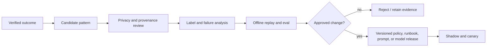

# Uncertainty, Constraints, Planning, and Context

Status: production design guide  
Last reviewed: 2026-08-31

Logistics decisions combine uncertain predictions with hard physical and policy constraints. Treating both as prose invites unsafe confidence: an ETA becomes a fact, a model invents capacity, or a plausible reroute violates a time window. The correct division is explicit: forecasts quantify uncertainty, deterministic rules and solvers establish feasibility, the model interprets mixed evidence and drafts alternatives, and people or policy grant authority.

## Epistemic contract

Every material value in a work packet declares how it is known:

| Evidence class | Representation | May support an effect? |
|---|---|---|
| Authoritative observation | Source, identity, version, event/record/ingest time, quality | Yes, if fresh and applicable |
| Partner declaration | Declaring party and confidence label | Only under a rule that accepts that declaration |
| Deterministic derivation | Input references and rule/version | Yes, within validated rule domain |
| Probabilistic estimate | Distribution/quantiles, as-of, horizon, model/version, evaluation slice | As a risk input, never as certain truth |
| Solver result | Model/constraint/objective versions, status, limits, bound/gap | Only if hard constraints passed and status is permitted |
| Model hypothesis | Evidence references and counterevidence | No; investigation aid only |
| Human judgment | Named role, decision, scope, reason, expiry | As defined by policy |

If a model-generated statement cannot be assigned one of these classes, it is narrative, not operational evidence.

## ETA and demand forecast contract

A point forecast is insufficient. Store a forecast object:

```yaml
forecast:
  forecast_id: forecast_eta_721
  target: {entity: shipment_leg, id: leg_774_2, measure: destination_arrival_time}
  as_of: 2026-08-31T10:00:00Z
  horizon: PT52H
  distribution:
    type: quantiles
    values:
      p10: 2026-09-02T08:00:00+02:00
      p50: 2026-09-02T12:30:00+02:00
      p90: 2026-09-02T19:00:00+02:00
  model: eta_lane_model/v17
  features_version: eta_features/v9
  data_cutoff: 2026-08-31T09:55:00Z
  evaluation_slice:
    mode: air
    lane: BLR-FRA
    horizon_bucket: 24h_to_72h
    disruption_regime: normal
  calibration_ref: calibration_report/2026_08_v17
  applicability: in_distribution
```

For quantity forecasts, include item/location hierarchy, unit, aggregation window, quantiles or samples, intermittency indicators, and reconciliation method across hierarchy levels. Demand at SKU-site-day level can be sparse even when an aggregate series appears smooth.

### Forecast release gates

- Use rolling-origin evaluation; random row splits leak future conditions.
- Evaluate quantiles with proper distributional metrics such as pinball loss and empirical interval coverage, not only mean error.
- Report calibration and sharpness together. A very wide interval can be calibrated but operationally unhelpful.
- Slice by horizon, lane, mode, site, carrier, item class, volume, season, geography, and disruption regime.
- Compare against simple seasonal, historical-quantile, and carrier-published baselines.
- Track missingness and delayed-label bias; a delivery label that arrives late can distort apparent freshness.
- Declare behavior for new lanes/items, sparse data, regime change, and out-of-distribution inputs.
- Never let an LLM invent a probability or confidence score from narrative evidence.

### Decision thresholds under uncertainty

Policy consumes forecast distributions explicitly. Examples:

- open an exception when `P(arrival > promise) >= 0.70` for two consecutive refreshes;
- allow monitor-only when the risk is below `0.40` and data is fresh;
- require human review when the forecast is out of distribution or the validated slice has inadequate coverage;
- compare alternatives using expected cost plus declared risk penalties, while separately enforcing hard service and safety constraints.

Use hysteresis and cooldowns. Opening at `0.70` and closing at `0.45` is more stable than toggling at a single threshold. Thresholds are policy versions, not prompt text.

## Constraint taxonomy

| Constraint class | Logistics examples | Enforcement |
|---|---|---|
| Physical hard | Vehicle/load capacity, item compatibility, nonnegative inventory, connection time, facility hours | Solver/rules; cannot be waived by model |
| Safety/regulatory hard | Dangerous-goods mode and packaging, customs status, sanctions, temperature limits | Authoritative policy/qualified role; fail closed |
| Commercial hard | Contracted carrier/service eligibility, maximum approved spend, customer prohibition | Policy and current contract data |
| Temporal hard | Appointment window, cut-off, maximum dwell, approval/effect deadline | Calendar and solver |
| Operational soft | Preferred carrier, consolidation, workload balance, fewer handoffs | Objective with documented weight |
| Economic soft | Transport cost, premium freight, holding cost, stockout cost | Scenario/objective; preserve currency and rate as-of |
| Service-risk soft | Lateness probability, promise buffer, disruption exposure | Forecast-derived objective or decision rule |
| Sustainability soft/hard | Emissions preference or regulated limit | Declared method, factor source, and policy classification |

No constraint is "hard" merely because the prompt uses emphatic language. It is hard only if an external validator rejects a violating proposal.

### Graph, topology, and shared-resource invariants

Represent a transport network as a versioned directed multigraph. Nodes are canonical facilities, ports, terminals, yards, or approved geospatial access points; edges name mode, carrier/service eligibility, schedules, capacity, transit distribution, cut-offs, transfer rules, and effective restrictions. A route is feasible only when every consecutive edge connects, required handoffs exist, time-dependent edges are active, equipment and commodity restrictions pass, and cumulative time respects calendars and appointment windows. Great-circle proximity or a mapping API polyline does not prove a commercial lane, border crossing, port call, or safe truck access.

Keep three graphs distinct:

- the planned graph pinned to the proposal and solver run;
- the observed custody/movement graph built from events and proofs;
- the currently eligible graph built from effective master data, contracts, capacity, closures, and regulatory policy.

Cycles, disconnected legs, duplicate active custody, impossible mode transitions, container/package parent cycles, and a child mapped to two active parents are hard invariant failures. Graph changes that affect an approved path invalidate the approval before commit.

### Allocation and prioritization fairness

Scarce inventory, carrier capacity, appointment slots, and operator attention must be allocated by an explicit policy, not by whichever exception invokes the model first. The allocator records the eligible population, priority features, protected/customer-service obligations permitted by policy, objective weights, tie-breaker, caps/floors, override authority, and per-group outcomes. It must prevent duplicate claims across child exceptions and expose who lost capacity and why.

Evaluate service level, stockout risk, cancellation, premium cost, delay, and manual-wait outcomes by customer/region/channel/service class and any legally or contractually relevant group. Test counterfactual priority policies and starvation under disruption. A human override requires a reason code and cannot silently become a learned preference. Commercial importance may be a declared business rule; proxying protected or disallowed attributes through geography, names, or free text is not.

## Optimization service boundary

The optimization input is a typed snapshot, not a narrative:

```yaml
optimization_request:
  request_id: solve_req_419
  problem_type: recovery_allocation_and_transport
  snapshot_ref: snapshot_84721
  candidates_ref: candidate_resources/129
  hard_constraints_ref: parcel_recovery/v12
  objective_ref: service_cost_risk/v6
  scenarios_ref: eta_samples/912
  limits:
    wall_time_seconds: 20
    solution_count: 5
    relative_gap: 0.05
  deterministic_seed: 4811
```

The response exposes solver semantics:

```yaml
optimization_result:
  run_id: solve_419
  status: feasible
  optimality_proven: false
  objective_value: 2740.50
  best_bound: 2592.00
  relative_gap: 0.0573
  runtime_seconds: 20.0
  alternatives_ref: alternatives/solve_419
  violations: []
  assumptions:
    - carrier_capacity_quote_valid_until_2026-08-31T10:25:00Z
  model_version: recovery_mip/v8
  solver_version: pinned-runtime-version
```

Google OR-Tools, for example, distinguishes success/partial/failure/timeout/invalid/infeasible states in routing and optimal/feasible/infeasible/model-invalid/unknown in CP-SAT. Preserve the actual library's result status. `feasible` is not `optimal`; `unknown` is not `infeasible`; and a timeout is not permission to let the model assert feasibility.

### Model-to-solver division

The model may:

- identify which declared scenarios deserve evaluation;
- translate an operator question into allowed objective preferences;
- surface missing constraint data;
- explain solver alternatives with evidence and uncertainty;
- ask a human to choose among policy-permitted trade-offs.

The model may not:

- create inventory, capacity, lane, handling, or regulatory facts;
- remove a hard constraint to get a solution;
- label an unvalidated route feasible;
- change solver status or optimality claims;
- turn a soft preference into authority;
- execute the selected alternative.

## Planning and replanning protocol

The durable workflow owns the macro-plan. Within `investigating`, bounded reasoning can produce a local plan:

```json
{
  "goal": "produce_recovery_proposal",
  "steps": [
    {"operation": "read_current_inventory", "resource": "item_1042@loc_blr_dc_01"},
    {"operation": "read_carrier_status", "resource": "shp_774"},
    {"operation": "quote_declared_services", "resource": "leg_774_2"},
    {"operation": "solve_recovery", "scenario_set": "approved_candidates"}
  ],
  "stop_conditions": ["minimum_evidence_missing", "deadline_exhausted", "safe_alternative_found"],
  "tool_budget": 6
}
```

The runtime validates each operation against the exception charter and state. Tool results may cause a new plan within the budget. They cannot cause recursive delegation or expand the goal.

Replanning invalidates any dependent proposal if a material snapshot changes. A materiality matrix should name fields such as inventory version, shipment status, service availability, cost beyond tolerance, ETA risk band, appointment, regulatory status, or approval expiry. Non-material telemetry or wording changes do not create churn.

Each exception also has a replan budget: maximum replans per clock window, minimum dwell, materiality threshold, improvement threshold, and owner when exhausted. The planner compares the new plan with the committed baseline and reports churn—changed carrier, route, inventory source, appointment, notifications, cost, and downstream effects—not only objective improvement. Once an effect is dispatched, replanning treats its outcome as pending or unknown until reconciled; it never plans from the wished-for postcondition. Network disruptions use a shared allocator and one versioned capacity snapshot so independent exceptions cannot consume the same scarce resource.

## Context compiler

The compiler builds a fresh, least-privilege work packet for each model call. It uses a declared query plan:

1. load exception scope, charter, state, and decision deadline;
2. load canonical resource identities and the pinned projection snapshot;
3. fetch only evidence relevant to the current question;
4. include active hard constraints and permitted actions;
5. include forecast/solver outputs with status and uncertainty intact;
6. include open effects, approvals, and unresolved conflicts;
7. redact or reference sensitive artifacts;
8. allocate tokens by safety priority, not recency alone;
9. record query, selected IDs, hashes, redaction policy, and compiler version.

Suggested priority order:

| Priority | Context content |
|---|---|
| P0 | Scope, canonical IDs, state/version, allowed operations, forbidden actions, hard constraints, open/unknown effects, approval status |
| P1 | Fresh observations, conflicts, forecasts and solver status, decision clock, operator question |
| P2 | Earlier hypotheses, alternative history, relevant runbook excerpts |
| P3 | Raw event detail, long documents, old narrative, repeated summaries |

P0 cannot be evicted. P3 should normally be stored as artifacts and retrieved by reference.

## Compaction continuity contract

Compaction is a deterministic transformation of model-facing context, not operational state. Its output must preserve:

```yaml
compaction_receipt:
  receipt_version: 1
  exception_id: exc_01J...
  state: investigating
  state_version: 9
  source_event_high_watermark: 144
  version_pins:
    charter: delivery_promise_at_risk/v1
    projection_rule: shipment_projection/v8
    policy: logistics_effects/v9
    constraints: parcel_recovery/v12
    forecast: eta_lane_model/v17
    solver_model: recovery_mip/v8
  scope: {tenant_id: tenant_acme, legal_entity_id: in01}
  snapshot_ref: snapshot_84721
  canonical_resources: [ord_882/10, shp_774, leg_774_2]
  hard_constraints_ref: parcel_recovery/v12
  material_uncertainty_refs: [forecast_eta_721]
  confirmed_facts: [obs_130]
  conflicts: [missing_departure_confirmation]
  rejected_alternatives:
    - {proposal: alternate_site, reason: inventory_infeasible, evidence: solve_411}
  approvals: []
  pending_effect_ids: []
  unknown_effect_ids: []
  active_clocks:
    - {clock_id: clock_31, type: decision_deadline, due_at: 2026-08-31T11:00:00Z, expected_state_version: 9}
  next_allowed_operations: [read_carrier_status, quote_service, solve_recovery]
  next_safe_action: read_carrier_status
  decision_deadline: 2026-08-31T11:00:00Z
  source_artifacts: [art_11, art_19]
  omitted_item_refs:
    - {kind: carrier_event_history, artifact: art_19, sha256: "...", reason: token_budget}
  behavior_release: logistics-agent/12
  compiler_version: context_compiler/v7
  compactor_release: logistics-compactor/v3
  invariants_hash: sha256:...
```

Before using a compacted record, require a supported `receipt_version`; resolve every pin and omitted-item reference; recompute the invariant hash over canonical scope, resources, constraints, clocks, approvals, and effects; and rehydrate live versions, freshness, policy, approvals, and effects from durable stores. Resume only if the receipt state/version and source high watermark form a valid prefix of durable history. If a pin is unavailable, an artifact hash differs, an active clock is missing, a material event exists above the watermark, or a pending/unknown effect cannot be resolved, fail closed to deterministic rebuild or human recovery. Reject a compaction that:

- drops tenant/legal-entity scope or canonical IDs;
- converts a hypothesis, declared cause, estimate, or plan into a confirmed fact;
- removes a hard constraint, unresolved conflict, approval expiry, or unknown effect;
- merges quantities with different units or inventory segments;
- hides solver status or forecast as-of time;
- omits why an alternative was rejected, causing looped reconsideration;
- contains executable instructions copied from an untrusted source.

Compaction evaluation uses downstream task equivalence: the compacted packet must produce the same allowed actions, forbidden actions, and escalation outcome as the full evidence set on safety-critical cases. Textual similarity is not enough. See [context engineering](../../context-memory/context-engineering.md) and [compaction and continuity](../../context-memory/compaction-and-continuity.md).

## Canonical memory-lifetime policy table

"Memory" is not one store. Use the minimum class that has a clear owner and deletion rule:

| Memory lifetime | Use or reject | Retention and deletion | Poisoning controls | Evaluation controls |
|---|---|---|---|---|
| Turn/scratch memory | Use for one compiled request, typed tool results, and disposable hypotheses; non-authoritative | Destroy after the call except separately approved evidence references; honor provider zero/limited-retention contract | Label untrusted excerpts, isolate instructions, schema-limit tools, redact secrets, and never persist model-written facts automatically | Injection, scope-leak, unsupported-claim, tool-budget, and discard verification |
| Working/run memory | Use by reference for the bounded run plan, attempts, budgets, and open questions | Expire at run end; checkpoint only durable IDs and material progress; deletion follows exception scope | Accept only typed results with provenance; quarantine retrieved or model-created content; cap size and recursion | Worker-loss rebuild equivalence, stale-result rejection, loop/churn, and budget tests |
| Session memory | Optional for authenticated UI navigation and a pending operator question; reject as authority or logistics truth | Short idle/absolute TTL; principal-, tenant-, and device-bound deletion on logout/revocation | No cross-session retrieval; sanitize free text; prevent another principal from inheriting state | Session fixation, cross-tenant, expiry, revocation, and clean-login tests |
| Durable workflow/task memory | Use for versioned exception state, evidence IDs, approvals, effects, decisions, owners, and clocks | Policy/audit retention; subject/artifact deletion and correction propagation with minimal legal-hold record separated | Writes only through typed transitions and authenticated actors; append corrections; integrity hashes, access audit, and no document-to-state path | Replay, migration, restore, concurrency/fencing, deletion, correction, and invariant equivalence tests |
| Domain knowledge memory | Use governed, effective-dated master data, contracts, policies, calendars, constraints, and runbooks | Retain releases required for replay; expire/supersede explicitly; revoke compromised releases and propagate cache deletion | Signed provenance, named owner, source allowlist, two-person review for policy, quarantine, and no runtime model writes | Retrieval applicability, stale-version, revocation, poisoning, rule regression, and source-drift tests |
| Long-term/preference memory | Reject learned behavioral preferences by default; allow reviewed display/convenience configuration only | Purpose-limited TTL with user/tenant view, edit, delete, and export; never legal hold by convenience | Allowlisted keys and values; cannot affect safety, constraints, priority, allocation, credentials, or authority | Deletion, consent, boundary, proxy-bias, and attempted-authority-escalation tests |
| Episodic/outcome memory | Optional curated incidents and verified outcomes; reject raw-nearest-neighbor precedent and automatic self-learning | De-identify, purpose-limit, effective-date, expire, remove on source deletion, and version evaluation/train splits | Provenance and outcome verification, injection review, contamination/dedup checks, restricted write path, and revocation list | Temporal holdout, leakage/dedup, poisoning, obsolete-policy, subgroup-harm, and downstream safety regression tests |

Do not make live decisions by nearest-neighbor retrieval over raw past exceptions. Old episodes may contain obsolete rates, policies, routes, identities, approvals, personal data, or attacker-controlled content. Retrieve a reviewed pattern or runbook, then validate it against current facts and policy.

## Governed feedback instead of self-learning

Production outcomes create feedback candidates, not automatic memory writes:



Operator overrides, approvals, and business outcomes are not clean preference labels. An approval may reflect urgency, incomplete alternatives, or a one-time exception. Record context and reason; review aggregates for bias and drift.

## Reasoning quality checklist

- [ ] Facts, declarations, derivations, forecasts, solver results, hypotheses, and judgments stay distinct.
- [ ] ETA and demand outputs include as-of, horizon, distribution, version, applicability, and calibration evidence.
- [ ] Forecasts are evaluated by rolling origin and operational slices against simple baselines.
- [ ] Hard constraints are external validators; soft constraints are declared objective terms.
- [ ] Solver status and optimality evidence survive every model summary.
- [ ] The workflow owns the macro-plan and enforces tool/step/time/token limits.
- [ ] Material replan triggers and hysteresis are versioned.
- [ ] P0 context survives compaction and is rehydrated from durable truth.
- [ ] Every memory class has purpose, owner, retention, privacy, and deletion behavior.
- [ ] Long-term learned preferences and direct episodic self-learning are disabled.

Continue with [integrations, tools, security, and privacy](05-integrations-tools-security-and-privacy.md).
