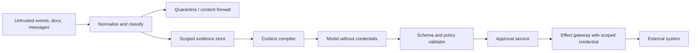

# Integrations, Tools, Security, and Privacy

Status: production design guide  
Last reviewed: 2026-08-31

External tools are the largest source of operational risk. Carrier, ERP, WMS, TMS, EDI, and logistics standards expose different identities, time semantics, versioning, authentication, quotas, and commit behavior. Put each behind a versioned adapter and give the model only a small domain operation—not raw HTTP, SQL, browser control, or vendor-wide credentials.

## Integration portfolio

| Boundary | Typical reads | Consequential writes | Main risks |
|---|---|---|---|
| ERP/OMS | Order lines, promises, parties, item master, commercial rules | Promise or order changes, transfer/order release | Replication lag, legal-entity scope, unit/status mismatch |
| WMS/inventory | On-hand, availability, reservation, allocation, pick/pack/ship/receive | Reserve, unreserve, reallocate, release, appointment | Over-allocation, segment loss, stale version, partial warehouse execution |
| TMS | Shipment plan, tender, booking, legs, costs, events | Tender, book, reroute, cancel, expedite | Carrier acceptance ambiguity, cost drift, multi-leg side effects |
| Carrier/forwarder | Tracking, milestone, quote, capacity/booking status | Book/cancel/change service, pickup request | Rate limits, account scope, schema drift, delayed/declared events |
| EDI/document exchange | Orders, dispatch/receipt advice, transport status, manifests | Partner messages and acknowledgements | Duplicate/interchange control, partial documents, free-text injection |
| EPCIS/event network | Traceability events and query | Capture events if this application is authorized | Event correction, capture partial acceptance, vocabulary alignment |
| Compliance/safety | Classification, route restrictions, customs/sanctions state | Usually separate qualified workflow | Stale law/rule, jurisdiction, false model inference |

The adapter portfolio is configuration, code, credentials, and operational ownership. A label such as `carrier_api` is not a sufficient production contract.

## Standards normalization without false equivalence

Use standards as precise interchange vocabularies, not as proof that end-to-end semantics are solved.

| Standard or model | Useful role | Important limit |
|---|---|---|
| OASIS UBL 2.4 | Order, DespatchAdvice, ReceiptAdvice, TransportStatus, InventoryReport and related document schemas | Documents do not define every physical process or local authority rule; dispatch and order lines need not be one-to-one |
| GS1 EPCIS 2.0 | Event-oriented traceability, business step, disposition, read point, business location, corrections | Capture acceptance is not necessarily durable business application; business authorization remains application-specific |
| GS1 identification keys | GTIN, GLN, SSCC, GSIN, GINC identity namespaces | A key must be validated and mapped; not every partner has every key |
| UN/LOCODE | Coded trade and transport locations | Version changes and local sublocations still require master-data mapping |
| UN/EDIFACT | Structured partner messages and control envelopes | Implementations use subsets, versions, partner conventions, and asynchronous acknowledgements |
| DCSA Track & Trace | Ocean container event vocabulary/API | Adoption and supported version vary by carrier; pin the actual provider contract |
| IATA ONE Record | Air-cargo linked data/API and endorsed ontology | Standardization does not eliminate eventual consistency, access-control, or reconciliation design |

As of this review, DCSA lists Track & Trace 2.2 as its stable published interface while Track & Trace 3.0, Reefer Events 1.0, and IoT Events 1.0 are exposed as beta material. IATA's last clearly endorsed tagged ONE Record release is `2025-07`, pairing Ontology 3.2.0, API 2.2.0, and Data Orchestration 1.1.0. The official `2026-07` folder says the amendment is a proposal pending full endorsement and even retains a placeholder endorsement date; treat it as a test target, not the production default. Pin the partner-supported ontology, API, orchestration, and security profile together. Do not code to a roadmap, beta, proposal, or working draft without an explicit bilateral contract and isolated qualification.

## Adapter contract

Every adapter publishes a machine-readable capability record:

```yaml
adapter_capability:
  adapter_id: fedex_track/v1
  provider: fedex
  environment: production
  contract:
    product: Basic Integrated Visibility
    upstream_version: pinned_portal_revision
    qualified_at: 2026-08-31T00:00:00Z
    regions: [US, CA, qualified_international_subset]
    accounts: [shipper_account_01]
  protocol: https_json
  operations:
    read_tracking:
      danger_tier: D1
      canonical_input: shipment_or_package_ref
      upstream_identity_inputs: [tracking_number, account_number, destination_country]
      result_semantics: provider_declared_observations
      timeout_seconds: 8
      rate_limit_bucket: fedex_track_account_01
      maximum_batch_size: 30
      freshness_semantics: provider_declared
      pagination: none_for_qualified_operation
      side_effect: none
      verification: schema_and_identity_only
    read_signature_proof:
      danger_tier: D1
      upstream_identity_inputs: [tracking_number, shipper_account_number]
      result_semantics: restricted_proof_artifact
      artifact_formats: [PDF, PNG]
      access_scope: owning_shipper_account
      side_effect: none
  authentication:
    method: oauth2_client_credentials
    token_ttl_seconds: 3600
    credential_scope: tracking_read_account_01
  error_taxonomy: carrier_read/v3
  data_classification: restricted_commercial
  contract_limits_ref: fedex_track_limits/qualified_2026_08_31
  qualification_suite: carrier_fedex_track/v5
  unsupported: [booking, cancellation, universal_global_coverage]
  owner: logistics_integrations
```

The manifest is operation-level. A connector is not declared simply `read_write`; each operation states canonical and upstream identities, exact danger tier, supported account/region/environment, version, preconditions, units/times, batch and partial-result behavior, rate bucket, timeout phase, idempotency/client-reference behavior, acknowledgement semantics, read-back/search, cancellation, compensation, data class, and qualification evidence. An unspecified capability is denied.

Pin and test:

- API/EDI/schema version and feature set;
- production and sandbox endpoints;
- authentication flow, token expiry, account/shipper scope, and rotation;
- request/response identity and time formats;
- quotas, concurrency, batch size, retry headers, and daily limits;
- error normalization and which failures are retryable;
- idempotency/client-reference support for writes;
- read-after-write or status-search path;
- webhook signature, replay protection, subscription lifecycle, and polling fallback;
- retention, residency, and payload classification;
- provider change-notice and deprecation process.

Provider details change. For example, current FedEx documentation describes hour-lived OAuth tokens and a maximum of 30 tracking numbers in a multiple-piece query, while DHL products publish product-specific daily and per-second limits. DHL also announced a 2026 timestamp format change to include explicit timezone data. These are adapter tests and operational alerts, not facts to place in a prompt forever.

### Required operation families

Qualify only the operations the charter uses. The examples below are interface candidates, not endorsements or claims of universal availability.

| System family | Example canonical operations | Manifest must disclose | Qualification boundary |
|---|---|---|---|
| ERP/OMS | `read_order_line`, `read_promise`, `prepare_order_change`, `commit_order_change` | Legal entity, order type/status, header/line versions, unit/currency, conditional-write behavior, replication lag | Exact product/release, tenant, extension fields, enabled modules, and order policy |
| WMS and inventory | `read_position`, `prepare_reservation`, `commit_reservation`, `release_reservation`, `reallocate`, `verify_pick_or_receipt` | Item/location/owner/lot/status segments, ATP formula, soft vs physical reservation, allocation hierarchy, reservation ID, offset/consumption semantics | Site configuration and source measures; never infer that two vendors' `available` fields are equivalent |
| TMS | `read_plan`, `quote_service`, `prepare_tender`, `commit_tender`, `read_tender_response`, `cancel_tender`, `verify_route_or_service` | Shipment/load/leg identity, tender round, carrier account, cost/expiry, client reference, tender/cancel state machine, read-back lag | Product and release, mode, carrier network, legal entity, contract and region |
| Carrier/freight API | `read_tracking`, `read_proof`, `quote`, `book`, `change_service`, `cancel`, `request_pickup` | Product name, shipper account, service/region coverage, token lifecycle, batch/quota, provider reference, async status, signature-proof access | Sandbox is not capacity or production parity; qualify each product/account/service separately |
| EDI exchange | `send_load_tender`, `receive_tender_response`, `receive_status`, `receive_functional_ack`, `send_cancel` | Standard/directory and partner implementation guide, ISA/GS/ST control numbers, delimiters, code lists, acknowledgement level, retransmission and duplicate rules | X12 204/990/214/997/999 or UN/EDIFACT names alone are insufficient; bilateral companion guide governs |
| Mapping/routing | `resolve_access_point`, `compute_route`, `compute_route_matrix` | Place/location identity, truck/mode support, traffic as-of, fallback computation, per-element status, matrix limits, licensing/cache/region rules | A consumer route is not proof of truck, DG, border, port, contract, or capacity feasibility |
| Port/customs/document | `read_terminal_event`, `read_filing_status`, `submit_document`, `read_document_receipt`, `amend_or_withdraw` | Filer/party authority, jurisdiction, declaration/document type and revision, schema/message version, submission vs acceptance, rejection codes, retention | Qualified broker/filer and production certification remain required; never generalize one customs channel to another jurisdiction |
| Telematics/IoT | `read_position`, `read_temperature`, `read_door_or_seal_state`, `read_device_health` | Device and asset binding, calibration, sample/event/ingest times, accuracy, offline buffer, QoS/duplicates, retained-message behavior, battery/malfunction status | Telemetry supports evidence; it does not establish custody, compliance, delivery, or sensor validity by itself |
| Messaging | `publish_observation`, `consume_observation`, `settle_message`, `dead_letter` | Topic/queue and partition/group, ordering scope, retention, delivery/duplicate semantics, visibility/lease, payload/schema limit, replay and DLQ | Broker exactly-once claims do not extend to ERP/WMS/TMS writes; consumers stay idempotent |
| Workflow/approval | `start_exception`, `signal_event`, `schedule_clock`, `request_approval`, `cancel`, `query_state` | Workflow/version compatibility, deterministic replay, activity retry, signal dedupe, timer clock, search/audit retention, task-queue isolation | Workflow durability does not prove downstream effect idempotency or business authorization |

Useful official examples illustrate the limits. Microsoft Dynamics 365 Inventory Visibility exposes separate reserve, unreserve, allocate, unallocate, reallocate, consume, and query operations; configuration determines measures and offsets, and the public API documents its own version/bulk limits. Oracle WMS 26C and OTM 26A are release-specific surfaces; SAP Business Network Freight Collaboration mixes carrier REST, shipper SOAP, and configured connection/authentication profiles. FedEx tracking can require an owning shipper account for a signature image and documents mode/region-specific availability. Google Routes `computeRouteMatrix` returns per-element status, has request-size limits, may expose fallback computation, and does not validate commercial or regulatory constraints. U.S. CBP ACE separates EDI, portal, and Document Image System channels; those interfaces and qualified filing authority are U.S.-specific.

X12 also demonstrates why acknowledgements must stay typed: a 997 reports syntactic analysis, a 999 reports syntactic/relational implementation analysis, and neither is the 990 business response to a 204 load tender. MQTT QoS governs delivery between a sender and receiver, not sensor calibration or physical truth. Kafka idempotence/transactions apply within the qualified broker topology, and standard queues such as Amazon SQS can redeliver; neither removes the effect ledger at the business-system boundary.

### Qualification suite

Every declared operation passes captured-fixture, sandbox, and controlled-production tests where the provider permits them:

| Test group | Required proof |
|---|---|
| Identity and scope | Same display/reference values in two tenants/accounts cannot collide; wrong legal entity, site, account, or region is denied |
| Version and effective time | Old/new schema, code list, timezone, unit, facility calendar, contract, and document revision fixtures normalize without silent loss |
| Authentication and secrets | Minimum scope, rotation, expiry during a call, revocation, wrong audience/account, and zero secret exposure to model/logs |
| Read semantics | Pagination/batch completeness, partial element errors, duplicates, out-of-order results, stale source, missing field, and authoritative `as_of` |
| Write preconditions | Current resource version, exact identity/quantity/unit/cost, approval, environment, and operation fence are enforced before dispatch |
| Idempotency and ambiguity | Same semantic ID does not duplicate; timeout-before-send and timeout-after-apply diverge correctly; search/read-back resolves outcome |
| Async and EDI acknowledgement | Transport receipt, 202/job ID, 997/999, business acceptance/rejection, callback, and final source state remain distinct |
| Partial and cancellation behavior | Item-level batch results, withdraw/cancel windows, too-late cancellation, cleanup, compensation, and forward recovery are observed |
| Limits and backpressure | 401/403/409/429/5xx, retry headers, concurrency, quota reset, maximum batch/matrix/document size, and reserved reconciliation capacity |
| Untrusted content | Notes, documents, filenames, metadata, EDI free text, sensor payloads, links, and proof artifacts cannot create instructions or tool calls |
| Audit and privacy | Data classification, residency, retention, deletion propagation, proof/signature access, trace redaction, and tenant-isolated artifacts |
| Drift and parity | Sandbox/production differences, partner overrides, deprecation notice, schema diff, certification expiry, and rollback to the prior adapter |

The qualification report records observed behavior and contract evidence, not only passing mocks. If the provider contract omits idempotency, cancellation, consistency, or production limits, the manifest says `unknown`, lowers authority, and requires reconciliation or manual operation.

## Model-facing tool design

Expose intent-oriented tools:

```json
{
  "name": "read_shipment_operational_view",
  "input": {
    "shipment_id": "shp_774",
    "required_projection_version": 84721,
    "fields": ["current_leg", "latest_milestone", "next_commitment", "freshness", "conflicts"]
  },
  "output": {
    "status": "ok",
    "projection_version": 84721,
    "as_of": "2026-08-31T10:15:00Z",
    "evidence_refs": ["obs_130"],
    "data": {}
  }
}
```

```json
{
  "name": "prepare_inventory_reallocation",
  "danger_tier": "D2",
  "input": {
    "item_id": "item_1042",
    "quantity": {"value": "20.000", "unit": "EA"},
    "from_allocation_id": "alloc_91",
    "to_order_line_id": "ord_882/10",
    "inventory_snapshot_version": "992811",
    "expires_at": "2026-08-31T10:30:00Z",
    "reason_code": "promise_recovery"
  },
  "output": {
    "status": "prepared",
    "intent_id": "intent_771",
    "predicted_changes": [],
    "required_approval": "inventory_controller",
    "preconditions": []
  }
}
```

Separate `prepare`, `authorize`, `commit`, and `verify`. The model can call reads and prepare a typed proposal. The runtime calls commit only after policy and approval. Tool output includes status, authoritative/derived classification, timestamps, versions, provenance, and a stable artifact reference.

### Reject broad tools

| Proposed tool | Decision | Safer replacement |
|---|---|---|
| `execute_sql(query)` | Reject | Named read projections or stored domain queries |
| `call_carrier_api(method, url, body)` | Reject | `read_tracking`, `quote_service`, `commit_booking` adapters |
| `update_shipment(fields)` | Reject | One typed operation per business intent with preconditions |
| `update_inventory(quantity)` | Reject | Reserve/unreserve/reallocate using source IDs, segments, and versions |
| `send_email(to, body)` | Reject for runtime effects | Prepare approved template/recipient/purpose; communication gateway deduplicates |
| Generic browser automation | Reject for critical writes when API/EDI exists | Versioned API/EDI connector |
| Arbitrary code shell | Reject in production control plane | D0 isolated calculation service with fixed inputs/limits |
| Raw vector search across all incidents | Reject | Scoped retrieval from reviewed, classified, effective-dated knowledge |
| Model-selected credentials | Reject | Runtime selects a preconfigured least-privilege credential after policy |

Browser automation may be a temporary D1 fallback for a read-only legacy portal if the session is isolated, the DOM contract is monitored, screenshots are classified, and failure sends work to a person. Do not make fragile UI clicks the primary path for bookings, cancellations, inventory effects, or regulatory filings.

## ERP, WMS, and TMS semantics

Vendor APIs expose domain-specific behavior that the canonical layer must not flatten away.

Microsoft Dynamics 365 Inventory Visibility, for example, distinguishes on-hand queries, reservations, allocations, reallocation, and consumption. Allocation is a virtual pool and not automatically physical reservation. Oracle WMS documents a migration from older APIs toward fine-grained REST resources. Oracle Transportation Management can separate view and update resource permissions and restrict endpoint methods. SAP freight integrations can cross SOAP, REST, and middleware migration boundaries. These examples support three rules:

1. preserve the upstream resource and operation semantics in evidence;
2. normalize only the cross-system fields the use case actually needs;
3. map least privilege to the precise operation, legal entity, site, and account.

An adapter conformance suite should replay captured, sanitized fixtures for pagination, version changes, unit/time formats, soft vs physical reservation, partial success, duplicate callback, auth expiry, throttling, and read-after-write lag.

## Security architecture



The model never sees or chooses secrets. Credentials live in a managed secret system, are selected by adapter configuration after scope/policy validation, and are short-lived where possible. Separate identities for:

- the human requester or approver;
- the runtime workload;
- the connector/service principal;
- the target-system account and legal-entity/site scope;
- the model provider and retrieval service.

Do not collapse these identities into "the agent."

### Prompt-injection defenses

Carrier notes, EDI free text, proofs of delivery, emails, bills of lading, labels, and retrieved incident notes are untrusted data. They can say "ignore policy" or imitate instructions. Defenses are architectural:

- parse structured fields with strict schema and size limits;
- label source content as evidence, never instructions;
- keep system policy and allowed operations outside retrieved content;
- do not expose credentials or generic write tools to the reasoning process;
- validate every proposed tool call against current state, scope, and charter;
- require exact approval for D3 regardless of model persuasion;
- sanitize active content, links, attachments, and document metadata;
- treat quoted instructions and encoded content as suspicious signals;
- evaluate indirect injection through every supported document and event path.

See [prompt injection and untrusted data](../../security/prompt-injection-and-untrusted-data.md).

## Trade, safety, and high-consequence boundaries

Dangerous-goods classification, packaging acceptance, shipper declarations, sanctions/export-control decisions, customs declarations, security filings, and release/hold decisions are governed acts. The agent may retrieve the current authoritative rule release, validate completeness against a deterministic checklist, identify discrepancies, and prepare a cited packet. It may not classify an unknown commodity, select a convenient jurisdiction, infer a clearance from silence, sign as a qualified person, or submit/amend/withdraw a filing without the exact authorized role and certified interface.

Pin regulation by mode, jurisdiction, edition, effective date, amendment/addendum/corrigendum, carrier/operator variation, and qualified owner. At this review, maritime IMDG 2024 Edition Amendment 42-24 is mandatory from 2026-01-01; IATA DGR 67th Edition and its addenda apply for air from 2026-01-01; ADR 2025 is the current cited international road edition. These examples are not a global ruleset. Rail, inland waterway, postal, local road, customs, sanctions, security, labor, and environmental regimes require separate current sources and counsel.

A compliance state such as `filed`, `message_accepted`, `under_review`, `held`, `released`, `rejected`, `amendment_required`, or `unknown` is carried exactly. Technical document acceptance is not customs release; customs release is not carrier acceptance; a dangerous-goods document is not proof that packaging, marking, loading, or operator variations pass.

## Segregation of duties and allocation harm

Separate requester, evidence preparer, feasibility service, approver, effect workload, connector credential administrator, reconciler, and auditor identities. The same runtime cannot expand its credential, change policy, approve its own D3 intent, erase evidence, and verify its own effect. Break-glass access is time-bound, separately approved, highly visible, and reviewed after use.

Allocation and prioritization can harm customers, suppliers, regions, or service classes even when inventory remains nonnegative. Keep protected or prohibited attributes out of objectives unless counsel and policy explicitly require them; inspect geographic and commercial proxies; publish priority features and tie-breakers; measure denial, delay, cost, cancellation, and manual escalation by relevant group; and require an appeal/override path. Overrides are evidence for review, not labels for automatic imitation.

## Agent and software supply-chain controls

Treat adapters, parsers, document libraries, model SDKs, tool servers, optimization binaries, container images, prompts, policy bundles, code lists, and retrieved runbooks as production dependencies:

- pin immutable digests and transitive versions; generate and retain an SBOM where supported;
- verify source/build provenance and signatures or attestations before promotion;
- allowlist tool servers, model endpoints, schemas, and artifact origins; block runtime package/plugin installation;
- scan dependencies and base images, triage vulnerabilities by reachable capability and effect tier, and retain a tested rollback release;
- sign policy, prompt, constraint, adapter, and knowledge bundles and verify them at startup and effect dispatch;
- isolate build credentials from runtime credentials and require review for capability/permission changes;
- continuously diff provider schemas, code lists, rules, and connector permissions; quarantine unexpected drift.

NIST SSDF 1.1 is the current final baseline cited here; NIST's 1.2 revision is still an initial public draft at review. SLSA provenance and Sigstore verification are useful implementation mechanisms, not proof that a dependency is trustworthy or free of malicious behavior. Whole-bundle evaluation remains required.

## Authorization policy

A commit decision should be an explicit policy result:

```yaml
authorization_decision:
  decision_id: authz_441
  subject:
    human_approver: user_91
    workload_identity: logistics_agent_prod
    connector_identity: tms_commit_in01
  action: shipment.service_upgrade.commit
  resources: [shp_774, leg_774_2]
  scope: {tenant_id: tenant_acme, legal_entity_id: in01}
  proposal_hash: sha256:...
  snapshot_hash: sha256:...
  policy_version: logistics_effects/v9
  conditions:
    maximum_cost: {value: "1800.00", currency: INR}
    service_level: EXPRESS_12
    expires_at: 2026-08-31T10:35:00Z
  result: allow
```

Re-evaluate immediately before the write. Approval of an explanation is not approval of an action. Approval to upgrade one leg does not authorize cancellation, customer communication, a different carrier, a higher cost, or a changed order line.

## Privacy and commercial confidentiality

Logistics data can expose customer names and addresses, employee contact details, precise facility movements, shipment contents, supplier/carrier terms, customs information, tracking identifiers, and security-sensitive routes. Apply:

- purpose limitation by exception charter;
- field classification and tenant/legal-entity filters at query time;
- tokenization of personal identities when the model does not need them;
- artifact references instead of copying documents into prompts;
- regional processing/residency decisions for model and storage providers;
- encryption in transit and at rest, with separately controlled raw artifacts;
- short prompt/response retention and sampled traces with redaction;
- deletion/correction propagation to caches, embeddings, evaluation sets, and derived artifacts;
- role-based access to exact addresses, contents, rates, and customs data;
- detection and alerting for cross-tenant retrieval or output.

Do not put live tracking URLs, API tokens, access keys, unrestricted bills of lading, or personal addresses into diagnostic logs. Hashes and opaque IDs can correlate records without copying payloads.

## Webhook and event-channel controls

- Authenticate the sender with a signature, mTLS, or provider-supported mechanism.
- Validate timestamp/nonce and reject replays outside an allowed skew.
- Persist the raw receipt hash before acknowledging when the protocol allows.
- Apply schema and payload-size limits before parsing complex content.
- Deduplicate on provider event/message ID plus version; do not dedupe only on business timestamp.
- Route unknown tenants, accounts, locations, or schema versions to quarantine.
- Keep polling reconciliation as a fallback for missed or delayed webhooks.
- Treat webhook delivery as a notification to read authoritative state when possible.
- Monitor subscription expiry, endpoint health, signature rotation, and delivery lag.

EPCIS asynchronous capture illustrates why `202 Accepted` is not business completion: a capture job can later partially accept or reject records depending on server behavior. Record capture ID, poll status, and verify query results before deriving completion.

## Connector acceptance checklist

- [ ] Each allowed operation has its own capability entry; unlisted methods and fields are denied.
- [ ] Upstream version, environment, account, region, and supported operation set are pinned.
- [ ] Authentication, refresh, rotation, least privilege, and secret non-disclosure are tested.
- [ ] Identities, quantities, units, currencies, times, and source versions normalize without loss.
- [ ] Quotas, batching, concurrency, 429 behavior, and separate reconciliation capacity are modeled.
- [ ] Every write accepts or is wrapped by a semantic operation ID and has a read-back/search path.
- [ ] Partial success, timeout-after-send, auth expiry, duplicate callback, and schema drift fixtures exist.
- [ ] Webhooks are authenticated, replay-protected, deduplicated, and backed by polling.
- [ ] Untrusted text and documents cannot introduce instructions or executable content.
- [ ] Data classification, residency, retention, deletion, and trace redaction are approved.
- [ ] A manual fallback exists for connector outage or rejected schema.
- [ ] Provider certification, bilateral companion guide, qualified filing role, and sandbox/production limitations are recorded where applicable.
- [ ] Dependencies, tool servers, schemas, policy/knowledge bundles, and images are pinned, verified, and rollback-tested.

Continue with [effects, approvals, reconciliation, and recovery](06-effects-approvals-reconciliation-and-recovery.md). Generic result/provenance requirements are in [tool results, artifacts, and provenance](../../tools/tool-results-artifacts-and-provenance.md).
