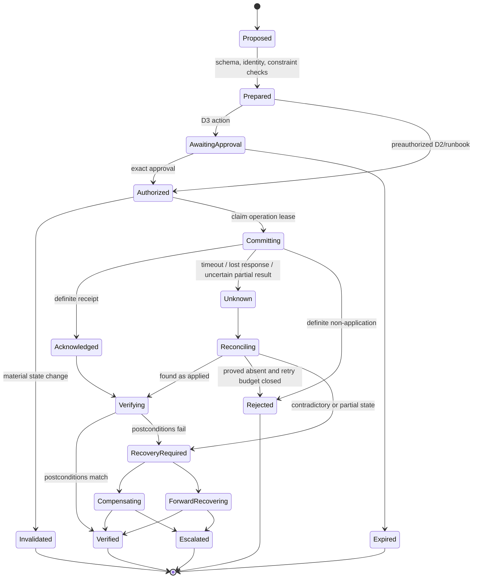
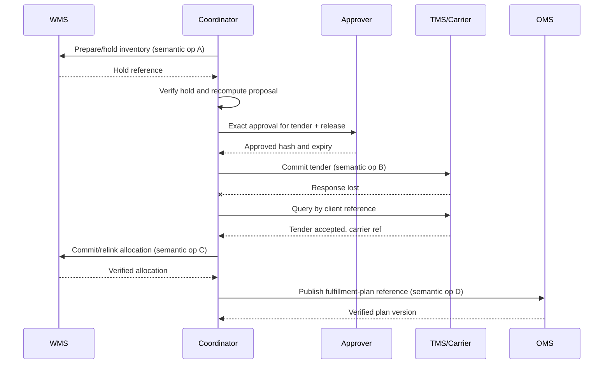

# Effects, Approvals, Reconciliation, and Recovery

Status: production design guide  
Last reviewed: 2026-08-31

A physical logistics action is not transactional across an agent, TMS, carrier, WMS, ERP, and human operators. A timeout can happen after the carrier accepted a booking. A reservation can succeed while a tender fails. A truck can depart while a cancellation is in flight. Build for ambiguous outcomes and forward recovery; do not pretend an HTTP response is a distributed transaction.

## Effect lifecycle



Only `Verified` proves the intended downstream postcondition. `Acknowledged` proves at most that a system received or accepted a request under its own semantics.

## Semantic operation identity

Create the operation before any write attempt:

```yaml
prepared_intent:
  effect_id: eff_01J...
  semantic_operation_id: tenant_acme:shipment_service_upgrade:shp_774:leg_2:prop_66
  action_type: shipment_service_upgrade
  scope: {tenant_id: tenant_acme, legal_entity_id: in01}
  resource: {shipment_id: shp_774, leg_id: leg_774_2}
  expected_versions:
    shipment: shipment-118
    projection: 84721
  parameters:
    service_level: EXPRESS_12
    maximum_cost: {value: "1800.00", currency: INR}
  preconditions_ref: preconditions/eff_01J
  postconditions_ref: postconditions/eff_01J
  approval_requirement: exact_D3
  expires_at: 2026-08-31T10:35:00Z
  intent_hash: sha256:...
```

The semantic operation ID represents business intent, not an attempt. All retries reuse it. Each transport attempt gets a separate attempt ID and request ID. Enforce uniqueness in the effect ledger, and pass the ID as the downstream idempotency key or client reference whenever supported.

Do not form keys from mutable timestamps or random values per retry. Do not reuse a key after changing item, quantity, target, carrier, service, cost, or purpose; that is a new intent requiring validation and often new approval.

## Exact approval contract

The approval view should show the operator what will happen, not just an explanation:

| Bound field | Example |
|---|---|
| Action and risk tier | Upgrade shipment leg service, D3 |
| Canonical resources | Shipment `shp_774`, leg `leg_774_2`, linked order line `ord_882/10` |
| Current versions | Shipment `118`, projection `84721`, inventory `992811` if applicable |
| From/to state | `STANDARD` to `EXPRESS_12` |
| Quantity and unit | Exact affected units or `not applicable` |
| Parties and locations | Carrier account, origin, destination, legal entity |
| Cost and currency | Quote, taxes/surcharges treatment, maximum allowed amount, quote expiry |
| Service outcome | ETA distribution before/after, promise-risk change, assumptions |
| Hard constraints | Passed checks and source/version for regulatory/safety status |
| Secondary effects | Cancellation, reservation, notice, capacity, or document implications |
| Recovery | Cancellation window, compensation/forward-recovery path, owner |
| Evidence | Observation, quote, forecast, solver, and policy references |
| Expiry | Approval and quote deadline |

Approval records the approver's authenticated identity, role, decision, reason, timestamp, proposal hash, snapshot hash, policy version, and expiry. Free-text "looks good" in a chat is not approval unless the approval system converts an authenticated UI action into this record.

### Approval invalidation matrix

| Change after approval | Result |
|---|---|
| Wording or non-material display order | Approval remains valid |
| Carrier, service level, route, item, location, quantity, order/shipment leg | Invalidate |
| Cost exceeds bound or quote expires | Invalidate |
| New shipment/inventory version affects a precondition | Re-evaluate; normally invalidate |
| ETA changes within declared non-material band | Policy-defined; preserve old/new values |
| Dangerous-goods, customs, sanctions, temperature, capacity, or handling state changes | Invalidate and fail closed |
| Approval role or policy changes | Invalidate unless policy explicitly preserves prior grants |
| Decision deadline passes | Expire; do not rush commit |

The coordinator must recheck immediately before commit, after acquiring its operation lease.

## Human queue, override, and closure contract

An escalation is not complete when a card appears in a queue. Persist `queue_id`, accountable owner role, currently assigned principal, reason code, severity, entered/acknowledged/due/escalated times, required decision, allowed dispositions, evidence snapshot, open clocks/effects, and backup path. Queue transfer records both principals and never resets age. If staffing capacity or the decision deadline is breached, the workflow follows a declared manual runbook or reduces authority; it does not auto-approve.

A human may `approve_exact`, `reject`, `request_evidence`, `choose_allowed_alternative`, `accept_residual_risk`, `pause`, or `escalate`. An override of a solver ranking or normal priority policy records the old/new choice, reason, role, policy basis, affected parties/resources, and expiry. It cannot override safety, regulatory, tenant, identity, or credential invariants. Direct changes made in ERP/WMS/TMS outside the agent are ingested as observations and material state changes; they are never fabricated into an agent approval after the fact.

The named exception owner remains accountable until the closure condition is evidenced, all pending/unknown effects and temporary holds are reconciled, required corrections/notices are verified, and any residual risk has a named accepting role. `handed_to_human`, `message_sent`, or `effect_acknowledged` is not closure.

## Commit protocol

Use a short deterministic protocol:

1. load the prepared intent by ID and verify immutable hash;
2. confirm workflow state and operation lease/fencing token;
3. reload current authoritative versions and policy;
4. validate exact approval, credential scope, expiry, rate limit, and target environment;
5. write an `attempt_started` record transactionally with an outbox dispatch;
6. call the narrow adapter with the semantic operation ID/client reference;
7. classify result as definite rejection, acknowledgement, or unknown;
8. persist receipt or unknown evidence before releasing the lease;
9. schedule independent read-back; never mark verified from the model/tool narrative;
10. compare authoritative state with typed postconditions.

If the process crashes after the downstream write but before saving its response, recovery finds `attempt_started` without a terminal attempt result and moves the effect to `unknown`. It searches downstream by client reference or reads resource state. It does not create a new semantic operation.

## Retry decision table

| Failure observation | Safe next action | Never do |
|---|---|---|
| Validation failed before dispatch | Fix or create new proposal | Retry unchanged indefinitely |
| Definite 4xx/business rejection with no application | Record rejection; replan if allowed | Treat as transient without provider evidence |
| Authentication expired before dispatch | Refresh within same scoped identity, recheck expiry, retry same operation | Switch to broader credential |
| 429 or declared transient before send | Honor retry-after/backoff within deadline | Burst around quota via other accounts |
| Connect failure known before request bytes sent | Retry same operation under bounded policy | Change idempotency key |
| Timeout or connection loss after possible send | Mark unknown; reconcile | Blind retry |
| 2xx/202 accepted | Store receipt; verify provider-specific completion | Call the business effect complete |
| Partial item/batch success | Record each item result; reconcile successes; retry only proved-absent items | Retry the entire batch |
| Read-back shows intended state | Mark verified with evidence | Issue another write "to be safe" |
| Read-back conflicts with intended state | Enter recovery; preserve both facts | Overwrite source to match the plan |

Retries have maximum attempts, elapsed time, jittered backoff, deadline awareness, and a terminal owner. The retry budget for proposal reads must not consume the separate capacity reserved for reconciliation.

## Reconciliation algorithm

Reconciliation compares three records:

- **intent:** exact desired transition and pre/postconditions;
- **receipt:** what the adapter/provider acknowledged, including item-level results;
- **actual:** fresh authoritative read-back from the downstream system and relevant correlated systems.

```text
if actual satisfies postconditions:
    effect = verified
elif actual proves no application and intent is still valid and retry budget remains:
    retry same semantic operation id
elif actual is unavailable or causality cannot be determined:
    effect = unknown; schedule bounded read-back and alert by age
else:
    effect = recovery_required; block conflicting effects
```

The comparator is typed. For inventory it checks item, location, segment, allocation/reservation ID, quantity, unit, source version, and linked order. For a tender it checks shipment/leg, carrier account, service, status, provider reference, cost bounds, and effective times. Text similarity is not reconciliation.

### Read-back hierarchy

Prefer, in order:

1. downstream lookup by the exact idempotency key/client reference;
2. downstream operation/job/capture status by receipt ID;
3. current resource state plus provider event history;
4. correlated acknowledgement or EDI control message;
5. qualified human confirmation with cited source evidence.

If no path can distinguish applied from absent, the connector is not ready for autonomous retry of that effect.

## Multi-system saga

Some recovery options require several effects. Model them as an explicit saga with an irreversible boundary:



Sequence reversible preparations before costly or physically irreversible steps. Do not assume an ACID rollback. If a tender succeeds but inventory commit fails, the correct response might be to keep the tender, find other inventory, cancel within a window, or escalate—not blindly cancel everything.

Each saga step has:

- its own semantic operation ID and postcondition;
- a dependency and deadline;
- a compensation or forward-recovery catalog;
- a resource serialization key;
- a maximum danger tier and approval relationship;
- explicit behavior when earlier state changes.

## Forward recovery catalog

| Partial or failed outcome | Candidate recovery | Required control |
|---|---|---|
| Inventory held, tender rejected | Release exact hold or retain briefly while replanning | Verify hold ID/quantity; expiry; same resource lock |
| Tender accepted, inventory unavailable | Alternative eligible stock, split, delay, or cancel within provider window | New feasibility and approval for materially changed intent |
| Carrier changed route unexpectedly | Assess ETA/safety/customs effect; contact carrier; alternate downstream connection | Treat carrier event as declaration; no silent source override |
| Duplicate booking found | Determine which booking is valid; cancel exact duplicate if authorized | Human review unless deterministic safe rule; preserve both receipts |
| Booking cancellation uncertain | Reconcile booking status and stop downstream assumptions | No replacement booking that risks duplicate capacity until disposition |
| Shipment physically departed before cancel | Stop cancellation loop; manage new route and downstream receipt | Forward recovery; physical movement is not rollback |
| Reallocation applied but ledger save failed | Read allocation by operation/reference; reconstruct receipt | Same semantic ID; no second allocation |
| External notice sent, plan changed | Send corrected notice only under communication policy | New purpose/version; link superseded notice; prevent spam |

Recovery actions can be more consequential than the original action. They need their own policy and approval unless covered by a deterministic preauthorized runbook.

## Disruption recovery workflow

For broad weather, port closure, carrier outage, strike, cyber incident, or facility loss, avoid spawning one unconstrained exception per affected shipment and flooding downstream systems.

1. create a disruption aggregate with authoritative evidence, scope, affected horizon, and owner;
2. freeze or lower authority for affected connectors/actions;
3. identify impacted resources from versioned projections;
4. prioritize by safety, customer commitment, perishability, recovery deadline, and declared business policy;
5. allocate scarce capacity through one deterministic optimization/control process;
6. create child proposals that reference the disruption allocation and share resource constraints;
7. stage operator approval in batches only when the approval view preserves item-level effects and limits;
8. rate-limit effects, reserve reconciliation capacity, and monitor network-level externalities;
9. re-optimize on material evidence with hysteresis and a change budget;
10. close only after all child unknown effects and resource holds are reconciled.

Do not let independent shipment agents bid against each other for the same inventory or carrier capacity. Network constraints require a shared deterministic allocator and serialization boundary.

## Full reference slice: promise-at-risk recovery

This slice shows the minimum evidence chain from event to verified action.

| Step | Record | Control |
|---|---|---|
| 1 | Carrier scan and TMS plan arrive as observations with source/event/record/ingest times | Schema, identity, duplicate, scope, and freshness validation |
| 2 | Shipment projection version `84721` is rebuilt | Deterministic authority/conflict rules |
| 3 | ETA service emits P10/P50/P90 with as-of and validated slice | Forecast applicability and calibration gate |
| 4 | Detector opens `delivery_promise_at_risk` under charter v1 | Hysteresis and decision deadline |
| 5 | Context compiler selects order promise, shipment evidence, inventory options, policy, and constraints | Least privilege, provenance, redaction, token budget |
| 6 | Model produces hypotheses and allowed candidate actions | JSON schema; no authority; citations required |
| 7 | Carrier quote reads and deterministic solver evaluate candidates | Pinned adapter; hard constraints; solver status |
| 8 | Runtime creates proposal `prop_66` bound to snapshot and cost/service limits | Policy validation and expiry |
| 9 | Named logistics manager approves exact hash | Authenticated role, reason, time, scope |
| 10 | Gateway rechecks versions/policy and creates `eff_01J` before calling TMS | Operation uniqueness, scoped credential, outbox |
| 11 | TMS call times out after send | Effect becomes unknown; no blind retry |
| 12 | Reconciler queries by client reference and finds accepted service change | Typed actual-vs-intent comparison |
| 13 | Shipment projection and ETA refresh; postcondition and risk reduction verified | Evidence refs; no forecast-to-fact conversion |
| 14 | Exception monitors until closure condition or new material trigger | Durable timer; replan/close rules |

The model participates in steps 6 and 8's explanation. It does not own any other control.

## Operational flow library

These are workflow skeletons, not universal process definitions. Each deployment binds them to an exception charter, source matrix, adapter manifest, policy, and qualified owner.

| Flow | Safe trajectory | Verified terminal evidence |
|---|---|---|
| Order/shipment planning | Pin order-line versions and promises; resolve item/facility identity; read inventory and eligible services; build a versioned topology snapshot; solve hard constraints and scenarios; present no-action plus feasible plans; approve exact plan; create shipment/leg effects in dependency order | OMS/TMS versions reference the intended order lines, quantities, route/legs, service, and plan version; no orphan reservation or duplicate shipment remains |
| Tender | Prepare load/shipment/leg, carrier account, service, equipment, schedule, cost bound, and tender round; transmit once under semantic ID; treat transport/997/999 acknowledgement separately; wait for API/EDI business response; expire or withdraw under policy; read back TMS/carrier status | Exact tender is accepted or definitely rejected/expired/withdrawn with carrier reference; any capacity hold and fallback tender is reconciled |
| Inventory exception | Detect short pick/ATP conflict on exact segments; freeze the affected allocation snapshot; enumerate substitute site/item/split/backorder options; run shared allocator; approve reallocation or reservation; serialize by item/location/segment; verify reservation and consumption/offset | WMS authoritative reservation/allocation IDs, units, segments, linked demand, quantity, expiry, and source version match; losing demands are requeued with reason |
| Delay and replan | Append carrier/telematics/port evidence; refresh calibrated ETA; test hysteresis/materiality; reconcile existing effects; pin eligible graph/capacity; solve alternatives and compare churn; invalidate stale approval; notify only after a verified plan change | New plan version and any carrier/appointment/inventory effects are read back; ETA remains an estimate; old plans/notices are linked as superseded |
| Customs or document exception | Quarantine/scan artifact; resolve issuer, document type/revision, shipment and filing; retrieve current jurisdiction/mode rules; deterministic completeness checks; qualified role corrects/signs/submits; distinguish transport receipt, technical acceptance, review, hold, release, and rejection | Official channel returns the exact filing/document revision and authoritative terminal status; rejected/superseded artifacts remain linked and access-controlled |
| Delivery proof | Correlate delivery event, package/logistics unit, recipient/facility, receipt advice, signature/photo/sensor artifact, and expected quantity; validate issuer/account access and artifact integrity; expose discrepancy or dispute to owner | Proof/receipt is verified for the exact subject and quantities, or a shortage/damage/missing-proof exception remains open; a status word alone is insufficient |
| Cancellation | Stop undispatched work; invalidate unused approval; fence stale workers; issue exact cancel/withdraw/release operations only where still valid; reconcile in-flight booking, tender, shipment, reservation, appointment, and notices; forward-recover if movement passed the irreversible boundary | Each affected resource is verified cancelled/released or explicitly too late with a new accountable recovery; no hold, duplicate capacity, or unknown effect is hidden |
| Unknown effect | Block conflicting intent; preserve attempt and request evidence; search by semantic/client reference, then receipt/job, resource state/history, correlated acknowledgement, and qualified human evidence; retry only after absence is proved and intent remains valid | Applied, absent, partial/contradictory, or still unknown is recorded with authoritative evidence, owner, age, and next clock; no blind retry occurred |
| Human override | Compile exact current evidence and baseline recommendation; authenticate role; show affected resources/parties, constraints, costs, uncertainty, and downstream effects; record reason and expiry; revalidate hard invariants; execute through the same gateway | Override decision, scope, policy basis, effect evidence, affected-group outcome, and closure/appeal path are auditable; override does not become automatic memory |

For multi-party flows, a partner's silence is neither rejection nor acceptance unless the bilateral contract defines it. Each row has explicit clocks and an owner for evidence wait, approval, external response, verification, and recovery. If any owner or terminal evidence is missing, keep the exception open or hand it to a named manual process.

## Cancellation semantics

Cancellation of an exception or run:

- prevents undispatched intents and invalidates unused approvals;
- signals cancellable reads, model calls, solver jobs, and queued preparations;
- does not assume an in-flight downstream write stopped;
- moves in-flight effects to reconciliation;
- preserves leases/fencing so stale workers cannot commit later;
- releases temporary holds only through verified cleanup effects;
- records who cancelled, why, at what workflow/effect versions;
- communicates any external correction through a separate authorized intent.

"Stop" is not evidence that physical or external work stopped.

## Effect-readiness checklist

- [ ] Every business intent has a stable semantic operation ID before dispatch.
- [ ] Attempt IDs are separate and reuse the same semantic ID on retry.
- [ ] Approval binds action, canonical resources, versions, quantities/units, cost, constraints, policy, and expiry.
- [ ] Material-change invalidation is deterministic and tested.
- [ ] `acknowledged`, `unknown`, `rejected`, and `verified` are distinct.
- [ ] A post-send timeout always reconciles before retry.
- [ ] Partial batch results are recorded item by item.
- [ ] Each effect has an authoritative search/read-back path and typed postcondition.
- [ ] Sagas define irreversible boundaries, compensation, and forward recovery.
- [ ] Resource serialization prevents concurrent inventory or shipment conflict.
- [ ] Disruptions use shared capacity/allocation controls rather than independent agents.
- [ ] Cancellation reconciles in-flight work and verified cleanup.
- [ ] Human queues preserve owner, clocks, scope, evidence, open effects, transfer age, and allowed dispositions.
- [ ] Every exception closes only with verified terminal evidence or a named acceptance of residual risk.

Continue with [observability, evaluation, and failure injection](07-observability-evaluation-and-failure-injection.md). Generic side-effect principles are in [idempotency and side effects](../../reliability/idempotency-and-side-effects.md).
