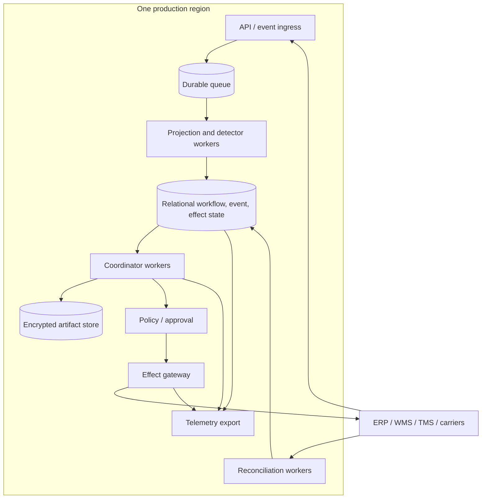
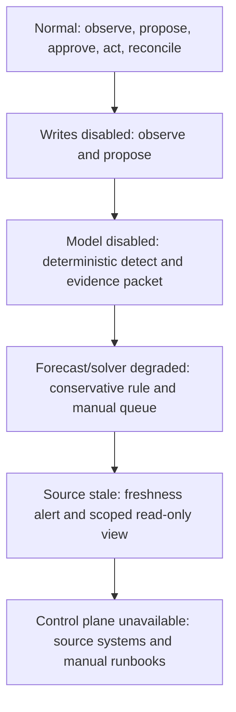

# Deployment, Scaling, Incidents, and Governed Evolution

Status: production design guide  
Last reviewed: 2026-08-31

Production readiness is the ability to reduce authority safely, preserve and reconcile work through failure, and change the system without silently changing its behavior. Begin with a small deployment and one exception type. Scale by isolated operating cells and versioned contracts, not by giving one agent a global prompt and more credentials.

## Minimal production topology



This may be one service image with separate worker pools. Separation of proposal and reconciliation capacity matters more than the number of deployables. Use managed relational storage and queues when available; do not create a distributed platform merely to appear scalable.

### Foundational infrastructure controls

- private network paths or provider-supported secure endpoints for business systems;
- managed workload identity and secret rotation, never model-visible secrets;
- encryption and classification-aware backup for state and artifacts;
- immutable release artifacts and signed configuration/policy bundles;
- transactional outbox or equivalent durable dispatch for external effects;
- leases with fencing tokens, dead-letter/quarantine queues, and delayed scheduling;
- point-in-time restore plus tested projection rebuild from observations;
- separate databases/schemas/roles for authoritative workflow/effects and diagnostic telemetry;
- time synchronization and explicit UTC storage with original source offsets retained;
- environment separation so a test approval or credential cannot reach production.

## Capacity model

Model each stage independently. A simple worker lower bound is:

`workers >= arrival_rate × p95_service_time / target_utilization`

Then apply concurrency and quota limits. For each operating cell, estimate:

| Resource | Demand driver | Binding limit |
|---|---|---|
| Ingestion | Events/second, average payload, bursts, replay | Provider webhook/poll quota, parser CPU, write IOPS |
| Projection | Affected aggregates per event, correction/rebuild rate | Database contention, hot shipment/item keys |
| Detection | Projection changes and timers | Rule CPU, time-window scans |
| Model | Exceptions needing semantic analysis × calls × tokens | Provider rate/token limits, latency, budget |
| Forecast | Shipments/items × refresh cadence × scenarios | Batch/GPU/CPU capacity, data freshness |
| Solver | Candidate exceptions × scenarios × time limit | CPU/memory, license/runtime limits, deadline |
| Effect gateway | Approved intents and external API limits | Per-account/provider quotas, serialization keys |
| Reconciliation | Acknowledged/unknown effects × polling schedule | Must remain available during provider failures |
| Human review | D3 proposals × review time and staffing schedule | Often the actual bottleneck |

Use measured distributions, not averages. Carrier disruption creates correlated bursts: more events, more exceptions, slower providers, more model/solver work, more approvals, and more unknown effects at once.

### Backpressure order

Protect work in this order:

1. authoritative effect reconciliation and safety alerts;
2. high-severity exceptions with near decision deadlines;
3. approved intents whose validity windows are closing, with fresh recheck;
4. mandatory source ingestion and projection;
5. deterministic detection and manual evidence packets;
6. model explanations and optional scenarios;
7. low-risk monitoring, enrichment, and offline analytics.

When saturated, coalesce repeated projection triggers by resource/version, debounce forecast refreshes, cap replan counts, and shed low-priority enrichments. Never drop an effect receipt or hide an unknown outcome.

## Isolation and scaling cells

Scale horizontally by an operating-cell key such as:

`tenant + legal_entity + region + business_flow`

Add mode, site group, or data-residency boundary when required. A cell owns its queues, quotas, policy scope, connector accounts, and SLO dimensions. Cross-cell network optimization is a separate deterministic service with an explicit snapshot and allocation contract; it must not make uncoordinated writes into each cell.

Within a cell:

- partition reads and projections by resource aggregate;
- serialize writes by item/location/segment, order line, shipment/leg, or communication purpose;
- use fairness so a hot carrier or disruption does not starve unrelated work;
- reserve reconciliation capacity and database connections;
- limit per-tenant model/solver spend and queue depth;
- isolate poison messages, schemas, and identity collisions;
- propagate scope through caches, artifact keys, traces, and deletion jobs.

Do not shard before measurements show the bottleneck. A relational store with careful indexes and partitioning can serve a substantial initial workload.

## Cost controls

Measure cost per verified resolution, not cost per prompt. Include:

- model input/output tokens, retries, and model-judge calls;
- forecast inference and feature computation;
- optimization CPU/memory and scenario count;
- carrier/ERP/WMS/TMS API or EDI charges;
- event, state, artifact, backup, and telemetry storage;
- network egress and residency duplication;
- human review, exception escalation, and incident response;
- premium-freight or inventory effects caused by chosen actions.

Use deterministic routing before model routing:

- rules close known duplicates/noise;
- templates summarize well-structured evidence;
- a smaller model handles bounded classification/extraction after passing evals;
- a stronger model handles only genuinely ambiguous, high-value analysis;
- solvers, calculators, and policy engines remain non-LLM services;
- cache immutable runbook fragments and master-data reads by version, not live decisions;
- batch forecasts and compatible read calls while preserving scope and deadlines.

Set per-exception call/token/tool/solver budgets and a monthly operating-cell budget. Budget exhaustion produces a deterministic evidence packet and owner escalation; it never weakens safety checks.

## Safe degradation ladder



Transitions can be per action, connector, tenant, cell, region, model release, or global. The incident controller should be able to:

- block new D2 preparations or D3 commits while reconciliation continues;
- disable one connector method without disabling safe reads elsewhere;
- route a model release to shadow only;
- pin a prior policy/context/adapter version;
- reduce replan and notification frequency;
- quarantine a source or artifact class affected by injection or corruption;
- drain approved-but-undispatched intents by expiring or manually reviewing them;
- display current degradation and freshness to operators.

Do not describe a degraded estimate as live truth. If a forecast, source, or projection is stale, surface its last as-of time and lower the authority of dependent runbooks.

## Availability and disaster recovery

Source systems remain operationally authoritative. The agent must be recoverable without pretending to be the ERP/WMS/TMS.

Declare:

| State class | Recovery objective | Recovery method |
|---|---|---|
| Observation and workflow/effect ledger | Strict RPO/RTO appropriate to effects and audit | Synchronous/managed durability, PITR, verified backups |
| Projections | Lower RPO; bounded rebuild time | Replay normalized observations under pinned rule versions |
| Raw artifacts | According to evidence/legal need | Replicated encrypted object storage and integrity hashes |
| Diagnostic telemetry | May tolerate limited loss | Separate exporter/buffer; never required for effect recovery |
| Model conversation scratch | No recovery requirement | Recompile from durable state/evidence |

Recovery procedure:

1. fence old workers and credentials;
2. restore workflow/effect state and verify release/policy manifests;
3. identify `committing`, `acknowledged`, `unknown`, `verifying`, and compensating effects;
4. reconcile downstream state before enabling any retries;
5. restore observations and rebuild projections, comparing checksums/counts;
6. rehydrate timers and callbacks with expected state versions;
7. validate source freshness, connector accounts, and cell scope;
8. enable reads/detection, then proposals, then tightly controlled writes;
9. retain recovery evidence and reconcile every potential duplicate window.

Test restore, failover, replay, and duplicate suppression. A backup that has never been restored is not a recovery plan.

## Release manifest

Every decision or effect points to an immutable manifest:

```yaml
release_manifest:
  id: logistics-agent/2026-08-31.3
  behavior_bundle_digest: sha256:...
  runtime_image: sha256:...
  software_bill_of_materials: sbom/cyclonedx/...
  build_provenance: slsa-provenance/...
  workflow_version: exception_coordinator/v11
  model_routes:
    evidence_analysis: provider_model_alias_pinned_2026_08
  prompts:
    evidence_analysis: sha256:...
  context_compiler: context_compiler/v7
  schemas:
    observation: v5
    proposal: v6
    effect: v4
  adapters:
    dhl_gf_tracking: v2.4
    tms_prod: v9.2
    wms_blr: v6.1
  policy_bundle: logistics_effects/v9
  constraint_bundle: parcel_recovery/v12
  forecast_models: [eta_lane_model/v17]
  optimization_model: recovery_mip/v8
  thresholds: promise_risk/v5
  knowledge_snapshot: runbooks/2026-08-20
  evaluation_suite: logistics_sim/v6
  dependency_vulnerability_snapshot: vulns/2026-08-31T00:00:00Z
```

Do not use mutable model aliases, prompts, adapter behavior, policy, or knowledge at effect time. Record provider-side parameters and tool/schema versions needed to reproduce the decision boundary even when exact stochastic output cannot be reproduced.

## Progressive delivery

Use a staged rollout:

1. offline fixtures and historical replay;
2. live read-only shadow detection;
3. shadow proposals hidden from operators, compared with actual handling;
4. operator-visible recommendations with explicit feedback but no effects;
5. D2 isolated drafts/preparations with expiry and cleanup;
6. one D3 effect under exact approval for a small lane/site/tenant canary;
7. expanded canary under SLO/error-budget monitoring;
8. one deterministic preauthorized runbook, only after separate evidence.

Canary by an isolation unit that limits blast radius but still represents production. Beware network externalities: changing allocation or carrier capacity for a canary shipment can affect non-canary work. Shadow optimization must not reserve real inventory or capacity.

Canary and rollback apply to the whole behavior bundle, not just the model: workflow transitions, model route and parameters, prompts/tool descriptions, context/compaction, retrieval/knowledge, schemas, adapters, source/freshness rules, policy/approval roles, constraints/objectives, forecasts, solver, thresholds/calendars, dependencies, and UI. Route one immutable bundle per exception from detection through closure; do not mix versions mid-effect. Compare safety invariants, proposal/verification latency, unknown-effect age, operator load, allocation slices, cost, and business outcomes against a concurrent or time-matched control.

Automatic stop conditions include any unauthorized, duplicate, cross-scope, hard-constraint, secret/privacy, compaction-continuity, or unverified-closure breach; a declared threshold breach for reconciliation age, operator critical misses, fairness slices, error budget, or cost also stops promotion. Stop new authority first, fence/drain undispatched work, keep reconciliation running under the original manifest, and route new exceptions to the prior safe bundle or manual path. Database/schema changes require backward/forward compatibility or an explicit restore migration; prompt/model rollback alone is not a system rollback.

### Promotion gate

- hard evaluation gates pass for the exact manifest;
- no unresolved high-severity known failure applies to the rollout slice;
- source/adapter schema and rate-limit contracts are current;
- operations, integration, security, privacy, compliance, and domain owners sign their scoped decisions;
- manual-review staffing and after-hours escalation match predicted load;
- dashboards, alerts, runbooks, kill switches, and recovery drills are exercised;
- current release and prior safe release can coexist during rollback;
- all outstanding D2/D3 intents have a version-aware drain/expiry plan.

Rollback means stop new authority first, not erase state. Reconcile in-flight effects under their original manifest, then pin the prior safe release for new work. Do not reinterpret old approvals or effects with new policy silently.

## Incident taxonomy

| Incident | First containment | Required investigation |
|---|---|---|
| Unauthorized or wrong-resource effect | Kill affected action/connector/cell; revoke credential; reconcile all recent intents | Identity, policy, approval, scope, release, and downstream impact |
| Duplicate booking/reservation/notice | Block action, search by semantic ID, prevent further conflicts | Attempt/receipt loss, idempotency mapping, fencing, batch behavior |
| Unknown-effect backlog | Stop or throttle new writes; reserve read-back capacity | Provider health, quota, read lag, reconciliation policy |
| Cross-tenant or privacy exposure | Isolate retrieval/model/export path; preserve security evidence | Scope propagation, caches/artifacts/traces, notification obligations |
| Prompt-injection success or poisoned knowledge | Disable affected artifact/source/tool combination; quarantine content | Content path, policy bypass, credential exposure, affected decisions |
| Inventory invariant violation | Stop inventory effects; snapshot WMS/ERP; involve inventory controller | Units, segments, concurrency, source version, partial effects |
| Forecast/solver regression | Disable dependent automation; use baseline/manual path | Slice drift, data cutoff, constraints/objective/version, status handling |
| Event/projection corruption | Quarantine source/schema; pin projection; rebuild under known rule | Adapter drift, correction/order logic, missing events, identity mappings |
| Queue/cell overload | Protect reconciliation/safety queues; shed enrichment/model work | Burst model, hot keys, quotas, staffing, backpressure |

## Incident command sequence

1. **Contain authority:** disable the narrowest affected D2/D3 operation; revoke or scope credentials; fence workers.
2. **Preserve evidence:** snapshot release manifests, workflow/effect rows, outbox, receipts, source versions, adapter payload hashes, approvals, policy decisions, and sanitized traces.
3. **Establish external truth:** read downstream resources and identify applied, absent, duplicate, partial, and unknown effects.
4. **Protect operations:** hand off to source-system/manual runbooks; disclose stale or degraded data clearly.
5. **Recover safely:** compensate or forward-recover under fresh authority; do not edit the ledger to make it appear clean.
6. **Correct the system:** patch the smallest root cause; add regression fixtures and monitoring.
7. **Re-release progressively:** replay, simulate, shadow, canary, and close the incident only after reconciliation and owner acceptance.

Incident responders need read access across diagnostic and effect evidence, but write authority should remain separated. A responder cannot silently change policy or source state merely because an incident exists.

## Governed evolution

Production behavior changes when any of these change:

- model or routing policy;
- system/developer prompt or tool descriptions;
- context selection, compaction, retrieval, or memory policy;
- observation/projection/proposal/effect schema;
- adapter version, authentication, error mapping, or quota behavior;
- source-of-truth and freshness matrix;
- constraint/objective/threshold/calendar/forecast/solver versions;
- approval policy, role mapping, autonomous ceiling, or credential scope;
- knowledge/runbook snapshot;
- workflow code, retry, reconciliation, or degradation policy.

Treat each as a release artifact with owner, diff, threat review, evaluation delta, rollback plan, and refresh trigger.

### Feedback governance

Operator actions and outcomes enter an offline review queue:

1. link feedback to the exact proposal, evidence, state, release, and eventual verified outcome;
2. classify whether the issue was identity, data freshness, forecast, constraint, objective, reasoning, policy, UX, integration, or operations;
3. remove or restrict personal/commercial content;
4. decide whether the remedy belongs in source data, adapter, deterministic rule, forecast/solver, prompt/context, policy, or training;
5. add representative and counterexample tasks to the eval suite;
6. release through shadow and canary;
7. monitor the intended slice and adjacent regressions.

No online self-modification of prompts, tool permissions, policy, memory, thresholds, solver objectives, or autonomous authority. Curated episodic examples are effective-dated, provenance-linked, removable, and cannot override current facts or policy.

## Refresh triggers

Re-research and revalidate when:

- a logistics standard, carrier API, ERP/WMS/TMS version, auth flow, rate limit, or timestamp schema changes;
- dangerous-goods, customs, sanctions, privacy, data-residency, or transport rules change;
- a new mode, geography, carrier, facility, item class, tenant, legal entity, or exception charter enters scope;
- source freshness or identity collision rates shift materially;
- forecast calibration, solver feasibility/runtime, or model/tool behavior regresses;
- unknown-effect age, duplicate attempts, approval invalidations, manual load, or cost breaches budget;
- a provider deprecates an API or a standards body promotes a working draft to an endorsed release;
- an incident shows that stated postconditions, reconciliation paths, or degradation behavior were incomplete.

Review dates are not enough. Each trigger has an owner and automated detection where possible.

## Stage 0–6 qualification exercises

The owning team sets workload-specific SLOs before testing. The evidence floors below prevent a stage from passing on a demo or a single happy path; stricter legal, safety, or business thresholds prevail.

| Stage | Required exercise | Measured exit evidence |
|---|---|---|
| 0 — Contract | Walk one normal and one failure case for every allowed/forbidden operation; enumerate every canonical entity, source field, constraint, owner, clock, effect, and terminal proof; threat-model untrusted data and cross-tenant paths | 100% of in-scope mutable fields have authority/freshness/conflict rules; 100% of effects have tier, semantic ID scheme, approval, read-back, cancellation/recovery, owner, and manual path; signed boundary/SoD/privacy/compliance record; no unresolved critical contract gap |
| 1 — Observe | Replay a representative peak period plus duplicate, late, correction, split/merge/repack, unit, timezone/DST, collision, schema-drift, and source-outage fixtures; rebuild projections twice | Zero cross-scope or silent-unit/time conversions; 100% deterministic replay checksum match for the pinned rule; all injected anomalies detected or quarantined; measured freshness/detection SLO and adjudicated projection error by field |
| 2 — Explain | Run temporal holdout cases and an adversarial corpus across every document/message/retrieval path; compare full versus compacted context and deterministic evidence packet | Zero instruction-to-authority escalation or prohibited disclosure; material-claim precision and correct-abstention thresholds met with confidence intervals; 100% safety-critical compaction action-equivalence; operator comprehension and critical-miss gate met |
| 3 — Propose | Compare agent, manual, rule, solver-only, no-action, and forecast baselines on frozen-`as_of` tasks; exercise optimal, feasible, unknown/timeout, infeasible, OOD forecast, shared scarcity, and replan churn | Zero hard-constraint violations or status/uncertainty misrepresentation; forecast calibration/coverage and baseline delta pass every automation slice; feasible-option recall/precision, cost/latency, allocation-harm, churn, and review-capacity thresholds met |
| 4 — Approve | Mutate every bound field after approval; race expiry/revocation/policy/resource changes against commit; attempt wrong-role, self-approval, cross-cell, replayed, and stale approvals | 100% material mutations invalidate or force reauthorization; zero unauthorized decisions; SoD and audit fields complete; p95 approval queue age and abandonment/escalation fit staffed decision clocks |
| 5 — Act | For each write operation, run at least 100 simulator trials spanning before-send failure, timeout-after-apply, lost receipt, duplicate callback, partial batch, version race, cancellation race, reconciliation outage, and forward recovery; add provider sandbox/controlled-production proof where permitted | Zero duplicate or unauthorized downstream effects; every trial ends verified, proved absent, recovery-required, or explicitly owned unknown—never false success; verification/unknown-age/cancellation SLOs pass; kill, drain, rollback, and manual recovery are observed |
| 6 — Scale | Load test at recorded peak and declared burst factor while slowing providers and approvers; fail a cell and regional data plane with in-flight effects; canary the whole behavior bundle; simulate dependency revocation and shared-capacity disruption | No reconciliation starvation or cross-cell leakage; queue/deadline, fairness, cost, and human-capacity budgets pass; RPO/RTO and active-clock recovery proven by restore; prior bundle rollback succeeds while original effects reconcile; incident exercise closes all potential duplicate windows |

Each exercise emits the evidence bundle defined in the evaluation guide: fixture/event versions, manifest, trajectory, external oracle, invariant results, metrics and intervals, human observations, faults, residual limitations, owners, and approval. A stage expires when its source, adapter, regulatory, policy, model, solver, workflow, or operating-unit assumptions materially change.

## Production roadmap

### Phase A: contract and simulator

- choose one exception charter and operating cell;
- map canonical identities, field authority, event/freshness rules, and constraint sources;
- implement typed observations, projections, workflow, proposal, approval, and effect records;
- create ERP/WMS/TMS/carrier fixtures and hard-gate scenarios;
- approve security/privacy boundary and manual runbook.

Exit: all Stage 0 contracts and simulator safety gates pass.

### Phase B: live observation

- deploy adapters and projections read-only;
- compare detections with operator cases;
- measure late/duplicate/conflict/freshness behavior;
- operate dashboards, quarantine, replay, and source-owner escalation.

Exit: Stage 1 replay and live shadow accuracy meet declared thresholds.

### Phase C: explanations and proposals

- add context compiler and bounded model analysis;
- add forecast/solver services only if the charter requires them;
- expose cited proposals in operator workflow;
- measure abstention, feasible alternatives, usefulness, latency, cost, and review capacity.

Exit: Stages 2–3 hard gates, calibration, and human review pass for the rollout slice.

### Phase D: one reconciled effect

- implement prepare/approval/commit/verify for one narrow action;
- add semantic IDs, outbox, fencing, unknown-outcome reconciliation, cancellation, and recovery;
- drill post-commit timeout, approval race, provider outage, and rollback/degradation;
- canary under exact approval.

Exit: Stages 4–5 produce zero unauthorized/duplicate effects and meet verification/unknown-age SLOs.

### Phase E: controlled network scale

- add cells, fairness, quotas, manual capacity, shared deterministic allocators, and disruption aggregates;
- validate new adapters, modes, regions, and exception charters independently;
- introduce a preauthorized runbook only after deterministic evidence and separate approval;
- operate release, incident, DR, and feedback governance continuously.

Exit: Stage 6 SLO, cost, isolation, DR, incident, and regression evidence remains healthy over representative peaks.

## Operational handoff checklist

- [ ] Minimal topology has durable queue/state, artifacts, outbox, fencing, and independent reconciliation workers.
- [ ] Capacity models cover correlated disruption bursts and staffed manual review.
- [ ] Backpressure protects reconciliation and decision-deadline work before enrichment.
- [ ] Isolation cells and resource serialization keys match business invariants.
- [ ] Cost is tracked per verified resolution with hard budgets and deterministic fallbacks.
- [ ] Degradation can disable writes, models, forecasts/solvers, or sources independently.
- [ ] Restore/replay begins with fencing and downstream reconciliation before retries.
- [ ] Every run/effect names the immutable release manifest.
- [ ] Shadow, canary, promotion, drain, and rollback behavior is version-aware.
- [ ] The complete behavior bundle—not only the model or prompt—passed its Stage 0–6 exercise and can roll back coherently.
- [ ] Incident tooling can kill narrowly, revoke credentials, preserve evidence, and expose external truth.
- [ ] Feedback cannot self-modify production policy, tools, prompts, memory, models, or authority.
- [ ] Standards, regulatory, provider, quality, cost, and incident refresh triggers have owners.

Return to the [blueprint overview](README.md) or consult the [research packet](../../research/packets/supply-chain-logistics-agent-blueprint.md) for source decisions and refresh notes. Shared operational guidance is in [scaling, capacity, and SLOs](../../operations/scaling-capacity-and-slos.md), [queues, scheduling, and backpressure](../../operations/queues-scheduling-and-backpressure.md), and [deployment, release, and incident response](../../operations/deployment-release-and-incident-response.md).
