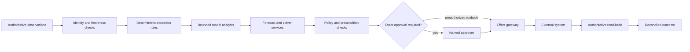

# Supply-Chain and Logistics Operations Agent Blueprint

Status: production blueprint, Pass 2 refined  
Last reviewed: 2026-08-31  
Research basis: [dated research packet](../../research/packets/supply-chain-logistics-agent-blueprint.md)

This blueprint explains how to build an agent that detects and investigates operational flow exceptions, proposes feasible recovery choices, and safely coordinates approved changes across order, shipment, and inventory systems. It is for post-award physical-flow operations: late or missing movements, inventory shortfalls, ETA risk, allocation conflicts, carrier and warehouse coordination, and disruption recovery.

The design is deliberately conservative. An LLM is useful for interpreting mixed evidence, forming hypotheses, and explaining alternatives. It is not the inventory ledger, route solver, source of regulatory truth, or authority to tender, reroute, expedite, reserve, reallocate, cancel, or notify a counterparty. Source systems retain business authority; deterministic services validate constraints; a durable coordinator records progress; and every consequential external effect is authorized and reconciled.

## Workload contract

Use this blueprint when the operating unit can identify all of the following:

- a canonical order, shipment, logistics unit, inventory item, location, and carrier identity;
- an authoritative system for each mutable fact;
- explicit service, cost, capacity, safety, customs, and handling constraints;
- a bounded exception lifecycle with an accountable human owner;
- narrow effect APIs whose results can be independently read back;
- measurable outcomes such as detection latency, proposal quality, verified recovery, reconciliation age, and exception recurrence.

Do not deploy this design as a generic supply-chain copilot with broad write credentials. Start with one exception class, one operating region or business unit, read-only evidence gathering, and a simulator or shadow workflow.

## Scope and ownership boundaries

| Concern | This agent may own | This agent must not own |
|---|---|---|
| Orders | Post-award order-line status, fulfillment dependencies, split/merge implications, promise risk | Supplier selection, negotiation, award, contract changes, or purchase authority |
| Inventory | Availability evidence, reservations, allocation proposals, approved reallocation effects, reconciliation | Inventory truth outside the designated system of record or silent accounting adjustments |
| Shipments | Booking and tender status, legs, logistics units, events, ETA risk, exceptions, approved reroute or expedite | Carrier commercial award strategy or unbounded transport procurement |
| Warehouses | Appointment and execution evidence, capacity constraints, handoff coordination | Equipment control, worker safety systems, or warehouse automation control loops |
| Manufacturing | Inbound and outbound material-flow evidence at the boundary | Production scheduling authority, plant equipment, process control, or product quality disposition |
| Data platform | Typed operational reads and documented projections | Owning databases, schemas, CDC pipelines, retention platforms, or general DataOps |
| Back office | Logistics-specific exception coordination | Generic case management, invoice handling, HR, finance, or document routing |

SCOR's `Source`, `Transform`, and `Fulfill` processes overlap in real organizations. This repository uses a stricter engineering boundary: procurement owns supplier selection and award; manufacturing owns production and equipment; this agent begins once an authorized order or movement exists and manages physical-flow exceptions against explicit policies.

## Core safety invariant

> The model may propose an operational intent. It never grants authority, establishes inventory truth, proves feasibility, or proves that an external effect occurred.

Every consequential action therefore passes through this chain:

The `effect gateway` is not a generic tool executor. It accepts a typed intent, a stable semantic operation ID, a fresh snapshot, a valid policy decision, and any required approval. A successful transport response is only a receipt. Verification comes from the downstream system of record.

## Zero-to-production path

| Stage | Capability | Permitted authority | Exit evidence |
|---|---|---|---|
| 0. Contract | Define one exception, identities, sources of truth, constraints, owner, and forbidden actions | None | Boundary review and typed contracts approved |
| 1. Observe | Ingest and normalize events; detect freshness, identity, and SLA problems | Read only | Replay accuracy, late/duplicate handling, and source reconciliation pass |
| 2. Explain | Compile evidence; generate hypotheses and cited summaries | Read only | Grounding, abstention, privacy, and injection tests pass |
| 3. Propose | Generate alternatives; call forecast and optimization tools; expose uncertainty | Drafts only | Feasibility, calibration, cost, and human usefulness gates pass |
| 4. Approve | Bind a proposal to exact resources, versions, costs, constraints, and expiry | Human-approved D3 only | Approval invalidation and unauthorized-action tests pass |
| 5. Act | Execute one narrow, reversible or recoverable effect; reconcile unknown outcomes | Scoped D2/D3 | Idempotency, unknown-outcome, cancellation, and recovery drills pass |
| 6. Scale | Add exception classes, regions, carriers, and bounded runbooks | Per-policy ceiling | Cell isolation, capacity, DR, incident, cost, and regression gates pass |

Promotion is monotonic in evidence, not authority. Adding a model, connector, region, or exception type does not inherit the previous approval envelope automatically.

## Guide map

1. [Mission, boundaries, and workload fit](01-mission-boundaries-and-workload-fit.md) defines the operating contract, ownership lines, risk tiers, and stage gates.
2. [Reference architecture and runtime selection](02-reference-architecture-and-runtime-selection.md) selects a durable, mostly deterministic architecture and rejects unnecessary multi-agent complexity.
3. [Identities, state, events, and projections](03-identities-state-events-and-projections.md) specifies canonical entities, observation semantics, lifecycle state, and projection rules.
4. [Uncertainty, constraints, planning, and context](04-uncertainty-constraints-planning-and-context.md) separates forecasts from facts, solvers from language reasoning, and memory from authoritative state.
5. [Integrations, tools, security, and privacy](05-integrations-tools-security-and-privacy.md) defines narrow adapters for ERP, WMS, TMS, carriers, EDI, and logistics standards.
6. [Effects, approvals, reconciliation, and recovery](06-effects-approvals-reconciliation-and-recovery.md) handles idempotency, ambiguous outcomes, partial failure, forward recovery, and disruption control.
7. [Observability, evaluation, and failure injection](07-observability-evaluation-and-failure-injection.md) provides trace contracts, simulators, adversarial scenarios, hard gates, and SLOs.
8. [Deployment, scaling, incidents, and governed evolution](08-deployment-scaling-incidents-and-evolution.md) covers capacity, cost, release control, degradation, DR, incident command, and change governance.

Read the guides in order for a new system. For an existing implementation, start with the workload contract, state/event contract, and effect protocol before changing prompts or models.

## Default decision record

| Decision | Default | Reason to deviate |
|---|---|---|
| Coordinator | One durable workflow per exception | A measured need for separate regulatory or regional trust domains |
| Model role | Evidence synthesis, hypothesis generation, bounded proposal drafting | A deterministic rule or solver cannot express the ambiguity economically |
| Authority | D1 reads; D2 isolated drafts; exact approval for D3 | A narrowly proven deterministic runbook with explicit preauthorization |
| State | Authoritative sources plus append-only agent event/effect records | Never replace ERP/WMS/TMS truth with chat memory |
| Planning | Fixed macro-workflow with bounded local replanning | Never use open-ended autonomous planning for physical effects |
| Optimization | Deterministic solver with explicit status and limits | A human-approved manual plan when the model is infeasible or unavailable |
| Forecasting | Versioned distributions or quantiles with calibration evidence | Explicitly label a fallback heuristic and lower authority |
| Parallelism | Parallel reads by independent resource; serialized writes per resource key | A downstream API supplies a stronger concurrency primitive |
| Recovery | Reconcile, compensate, or forward-recover | Physical movement is rarely truly reversible |
| Learning | Offline, reviewed, versioned release | Never let production outcomes rewrite prompts or policy automatically |

## Non-negotiable production invariants

- A shipment event does not overwrite a prior event; corrections are new, linked facts.
- Observed, planned, estimated, requested, committed, and verified times and quantities remain distinct.
- An ETA or demand forecast carries an `as_of` time, horizon, version, quantiles or distribution, and evaluation slice.
- Inventory is not available because a message says it is. The designated source and freshness policy decide.
- A feasible solver result is not necessarily optimal; timeout, partial, unknown, invalid, and infeasible are explicit states.
- No model output can relax a hard constraint, approval rule, regulatory rule, or credential boundary.
- Approval binds the exact proposal and expires. A material state change invalidates it.
- A timeout after a write becomes `effect_unknown`; the system reconciles before retrying.
- The same semantic intent cannot produce two tenders, reservations, reallocations, cancellations, or counterparty notices.
- Tenant, legal-entity, region, item, location, carrier, and resource scopes survive retrieval, compaction, tool calls, logs, and effects.
- Diagnostic traces are not the authoritative effect ledger.
- Disabling writes leaves a useful read-only and manual-escalation path.

## Failure posture

The agent must become less powerful as evidence degrades. Missing identity, stale inventory, contradictory milestones, an uncalibrated forecast, an infeasible optimization problem, expired approval, uncertain downstream outcome, or unavailable policy service causes abstention, a manual queue, or a lower-risk proposal. It never causes the model to guess a fact or widen authority.

Use the shared controls as normative companions:

- [Agent state and event contracts](../../runtime/agent-state-and-event-contracts.md)
- [Durable execution](../../runtime/durable-execution.md)
- [Idempotency and side effects](../../reliability/idempotency-and-side-effects.md)
- [Tool contracts](../../tools/tool-contracts.md)
- [Compaction and continuity](../../context-memory/compaction-and-continuity.md)
- [Agent threat model](../../security/agent-threat-model.md)
- [Trajectory and reliability evaluation](../../evaluation/trajectory-and-reliability-evaluation.md)
- [Deployment, release, and incident response](../../operations/deployment-release-and-incident-response.md)

## Definition of production-ready

Production-ready means the team can prove, for the released manifest and scoped workload, that the agent:

- reconstructs current work from durable records without relying on transcript continuity;
- preserves authoritative identities, versions, constraints, approvals, and effect receipts through compaction and restart;
- exposes uncertainty and abstains when forecast or evidence quality is outside the validated envelope;
- blocks infeasible, unauthorized, stale, cross-tenant, and policy-violating actions deterministically;
- resolves ambiguous writes without blind retries and reconciles every committed effect;
- degrades safely during provider, carrier, ERP/WMS/TMS, solver, queue, and policy outages;
- meets declared service, cost, manual-review, and reconciliation objectives under expected and burst load;
- supports kill, rollback, replay, evidence preservation, and post-incident learning without self-modifying production behavior.

Anything less is a pilot, even if it can produce an impressive recovery plan in a demo.
