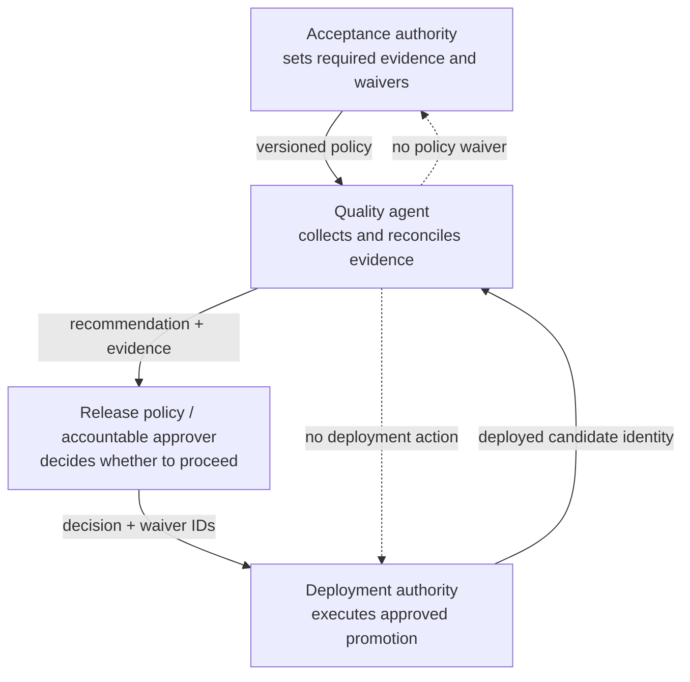
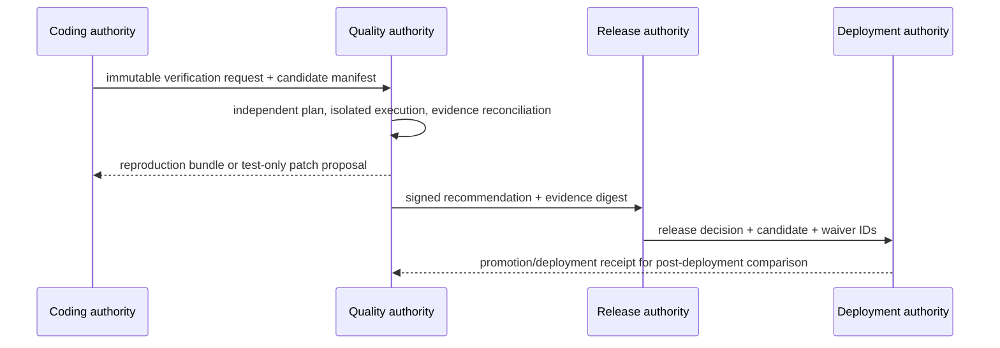

# Mission, Boundaries, and Reference Architecture

> Parent: [Test and Quality Engineering Agent](README.md)  
> Evidence: [research packet](../../research/packets/test-quality-engineering-agent-blueprint.md)  
> Last reviewed: 2026-08-31

## Mission

The agent’s mission is to convert a candidate, acceptance intent, risk policy, and available test capabilities into **independent, reproducible, bounded quality evidence**.

Its work ends in one or more of these products:

- a versioned test plan with explicit omissions and oracles;
- normalized test attempts and immutable artifacts;
- a minimal or best-known reproduction bundle;
- a flaky-test assessment with attempt-level evidence;
- a multi-dimensional coverage and residual-risk report;
- an advisory release-quality recommendation with uncertainty.

The mission is not “make the build green.” A red result may be the correct outcome. An `UNKNOWN` result may be safer and more accurate than a forced verdict.

## Ownership contract

### The quality agent owns

- independent risk analysis for the verification campaign;
- test-design proposals and selection of registered test capabilities;
- generation of ephemeral tests, fixtures, data, probes, and workload descriptions inside an isolated workspace;
- environment and fixture lease requests through policy-enforcing adapters;
- bounded execution, follow-up experiments, and evidence reconciliation;
- reproduction, minimization, failure fingerprinting, and flake investigation;
- precise reporting of coverage dimensions, omissions, invalid evidence, and residual risk;
- creation of an advisory recommendation that is bound to immutable evidence.

### The quality agent does not own

- product requirements or acceptance policy;
- feature or defect-fix implementation;
- permanent repository mutation, merge, branch protection, or code-owner approval;
- production deployment, release promotion, rollback, or traffic management;
- severity, risk acceptance, or compliance sign-off when those belong to accountable humans;
- security exploitation beyond an explicitly authorized test plan;
- customer data collection or production load generation by implication.

### Test asset boundary

Generating a test is not the same as modifying the product. The agent may create an ephemeral test asset when all of the following are true:

1. the asset lives in a campaign-specific writable overlay;
2. the candidate revision remains immutable;
3. the generated asset and its generator inputs are retained;
4. the asset executes under the same sandbox and network policy as untrusted code;
5. the result identifies the asset as generated, not repository-owned;
6. promotion into the repository enters the coding and review workflow.

If a test only passes after changing the system under test, the original result remains a failure. The changed candidate is a new candidate and requires a new campaign.

## Quality authority versus release authority



Keep the four records distinct:

| Record | Authoritative producer | Meaning |
| --- | --- | --- |
| Acceptance policy | product, risk, security, compliance, or release owner | what evidence is required and who may waive it |
| Quality recommendation | quality service | what the captured evidence supports |
| Release decision | policy engine or accountable human | whether the organization accepts the evidence and residual risk |
| Promotion receipt | deployment system | what candidate was actually moved where |

The quality agent can detect a mismatch—for example, a promotion receipt names a different digest—but cannot repair it by redeploying.

## Coding and deployment handoff protocol

Independence must survive the actual handoff, not only the architecture diagram.



| Boundary message | Required fields | Receiver rule |
| --- | --- | --- |
| Verification request | repository, source/build digests, change base, requirements/policy references, declared known gaps, coding-agent test receipts | quality resolves identities independently and does not treat author tests as acceptance |
| Reproduction bundle | original candidate, test/oracle/environment/fixture identities, minimal input/steps, confirming and contradicting attempts, limitations | coding path may create a fix, but must submit a new candidate rather than mutate the campaign |
| Test-only patch proposal | overlay diff/artifact digest, generated-test provenance, intended oracle, failing-before/passing-after evidence | coding/review authority decides whether the permanent repository change is valid |
| Quality recommendation | candidate, plan/policy versions, evidence closure, findings/unknowns, expiry, signature/digest | release authority decides; it cannot infer missing promotion permission from a favorable enum |
| Release decision | exact candidate, recommendation, accepted waivers, approver/policy identity, expiry | deployment path revalidates freshness and remains the only promotion authority |
| Promotion receipt | environment, deployed artifact/config digests, rollout identity, timestamps, outcome | quality may compare post-deployment evidence but cannot roll back or redeploy without a separate delegated role |

Reject the handoff when identities disagree, required artifacts are unavailable, the candidate changed, a waiver expired, or one service identity is simultaneously acting as candidate author, quality approver, and deployment committer without an explicitly reviewed exception. Coding-owned checks can inform selection; they never become independent evidence merely because the quality agent imports their report.

## Trust zones

```mermaid
flowchart LR
    subgraph U["Zone U: untrusted content"]
        PR["PR source and scripts"]
        WEB["pages and API responses"]
        LOG["logs, reports, test names"]
        EXT["issues and test-management text"]
    end

    subgraph R["Zone R: restricted reasoning"]
        CC["context compiler"]
        LM["model"]
        PS["plan proposal"]
    end

    subgraph C["Zone C: trusted control plane"]
        PV["schema validation"]
        PE["policy and approval engine"]
        CL["campaign ledger"]
        ER["evidence reconciler"]
    end

    subgraph X["Zone X: isolated execution"]
        WS["candidate workspace"]
        TR["test runners"]
        TF["leased fixtures"]
    end

    subgraph S["Zone S: protected services"]
        SB["secret broker"]
        AS["artifact store"]
        CI["CI / issue / test-management adapters"]
    end

    U -->|typed excerpts and references| CC
    CC --> LM --> PS --> PV --> PE
    PE -->|capability token| X
    SB -->|injected at runner, never model| X
    X -->|normalized result + digest| CL
    X --> AS
    CL --> ER
    AS --> ER
    ER --> CI
```



### Trust-boundary rules

| Crossing | Required control |
| --- | --- |
| Untrusted content to model | provenance label, size limit, delimiter/structured field, no instruction authority, sensitive-data filter |
| Model plan to control plane | strict schema, capability allowlist, scope validation, budgets, approval class |
| Control plane to runner | short-lived scoped token, immutable command, idempotency key, environment lease |
| Secret broker to runner | direct injection, redaction, purpose binding, expiry; never round-trip through model or report |
| Runner to evidence store | outcome normalization, content digest, media type, size policy, malware/content handling, partial-upload status |
| Evidence to external system | idempotent adapter, field allowlist, rate-limit handling, receipt reconciliation |
| Durable state to future context | typed projection, provenance, trust label, retention/ACL check, no automatic instruction promotion |

## Components and responsibilities

### Intake and scope normalizer

The intake layer resolves:

- candidate source and build identities;
- change base and affected dependency graph version;
- acceptance policy and required evidence classes;
- target platforms and authorized environments;
- data classification and test-account constraints;
- deadline, priority, cost, worker, device, and external-write budgets;
- accountable owner and escalation path.

It rejects mutable branch names as the only candidate identity. A branch may be recorded for convenience, but execution binds to a commit and build digest.

### Capability registry

The registry describes what the platform can actually do. Each capability declares:

- stable capability and schema version;
- runner image, binary, browser, driver, plugin, or scanner versions;
- supported test type, platform, target class, and data class;
- required permissions and network destinations;
- timeout, concurrency, artifact, and cost limits;
- isolation strength and known fidelity gaps;
- result and error schemas;
- owner, deprecation state, and health.

The model does not invent a runner or flag. It selects a registered capability or emits a gap.

### Planner and selector

The planner produces a bounded directed acyclic graph of test jobs and decision points. The selector combines deterministic dependency mapping with risk rules and historical evidence. The plan explicitly names:

- selected and omitted scope;
- reason for each selection or omission;
- oracle and invalidation criteria;
- environment and fixture needs;
- parallelism groups and resource locks;
- stop conditions and follow-up experiment budget;
- approvals and publication intent.

See [Test design, selection, oracles, and risk](02-test-design-selection-oracles-and-risk.md).

### Policy and approval engine

Policy is code or a deterministic ruleset, not prose interpreted opportunistically by the model. It decides:

- which capability may target which environment;
- whether untrusted code may receive a credential or network route;
- whether active scan, load, fault, physical-device, production read, or external write requires approval;
- maximum concurrency, duration, data volume, and retry count;
- mandatory suites and fallback behavior;
- who may accept a waiver and its expiry.

### Environment and fixture broker

The broker allocates time-bounded, uniquely named resources and returns a manifest. It owns reset, teardown, orphan cleanup, quota, collision avoidance, and data-class enforcement. The model asks for a logical capability such as `postgres.ephemeral.v2`; it does not receive cloud-administrator credentials.

### Runner adapters

Adapters translate a typed command into a runner-specific invocation, enforce timeouts and resource constraints, and normalize the result. Shell construction belongs inside a reviewed adapter. Arbitrary model-authored shell is not a default capability.

### Campaign ledger

The ledger is the source of truth for campaign state. It stores append-only commands, attempts, events, approvals, leases, artifact references, plan versions, and recommendations. A materialized current view may be updated for efficient reads, but history is retained.

### Artifact store

The artifact store holds reports, logs, screenshots, traces, videos, device logs, HAR files, profiles, crash inputs, corpora, generated tests, fixture manifests, and recommendation bundles. Objects are content-addressed where practical and carry retention and access metadata.

### Evidence reconciler

The reconciler verifies that:

- the expected plan nodes reached terminal states;
- results match the candidate, environment, and toolchain manifests;
- required artifacts exist and their digests match;
- retries and invalid attempts remain visible;
- mandatory test classes and risk controls are closed or explicitly unknown;
- external publication receipts do not masquerade as test outcomes.

It constructs the machine-readable recommendation; the model may write the human explanation from the same records.

## Runtime choice

### Deterministic workflow only

Choose a deterministic workflow when inputs, test set, environment, oracle, and fallback are known. This is the preferred design for required pre-merge gates and periodic baselines.

### Single bounded model loop

Choose one planner/triage loop when the agent needs to design tests or choose a small number of follow-up experiments. A simple loop is easier to inspect than a multi-agent hierarchy.

```text
scope -> plan proposal -> policy validation -> execute ready jobs
      -> reconcile -> at most N evidence-driven follow-ups -> recommend or unknown
```

### Durable workflow engine

Add durable orchestration when campaigns outlive a process, wait on device/environment capacity, require approvals, span many jobs, or need reliable external publication. Durability does not expand authority; it persists the same bounded state machine.

### Multiple specialized reasoning roles

Use multiple model roles only when evals demonstrate that separation improves outcomes enough to justify more cost and coordination risk—for example, an independent evidence critic for high-risk releases. They share no implicit memory and communicate through typed artifacts. A “panel of agents” is not independent evidence if all roles see the same contaminated context and grade one another.

## Authority matrix

| Capability | Default | Approval class | Notes |
| --- | --- | --- | --- |
| Read repository at immutable revision | allow | none within campaign | source is untrusted data |
| Build untrusted candidate | allow in isolated worker | none within resource budget | no privileged token or broad egress |
| Generate ephemeral test/fixture | allow in overlay | none within plan | retain content and provenance |
| Run registered unit/integration/contract tests | allow | none within plan | typed command and timeout |
| Run browser or emulator tests | allow on registered targets | none within quota | isolated profile/device reset |
| Use physical device lab | constrained | policy or quota approval | device identity and cleanup required |
| Create shared test data | constrained | environment-owner policy | unique namespace and teardown lease |
| Run load test | deny unless authorized | target owner and capacity window | hard RPS/VU/duration caps |
| Run active security scan/fuzz target | deny unless authorized | security/target owner | method and target allowlists |
| Read production telemetry | deny by default | incident or production-read role | minimize and redact data |
| Mutate production | deny | outside quality-agent role | use deployment/operations authority |
| Publish check result | constrained allow | policy-scoped service identity | idempotent, evidence-linked |
| Create/update defect | constrained allow | policy or human depending severity | deterministic dedupe key and receipt |
| Commit/merge test patch | deny | coding/review workflow | quality agent emits proposal |
| Approve/promote deployment | deny | outside quality-agent role | recommendation only |
| Admit long-term memory | deny by default | reviewed admission workflow | TTL, provenance, ACL, revocation |

## Invariants at the architecture boundary

```text
recommendation.candidate_digest == every_required_attempt.candidate_digest
recommendation.plan_version     == reconciled_plan.version
every attempt has exactly one terminal outcome class
retry attempts never delete or replace earlier attempts
external publication state never changes runner outcome
unknown required evidence cannot evaluate to pass
model output cannot grant a new capability
deployment receipt cannot be emitted by the quality identity
```

Implement these as storage constraints, reconciliation rules, and contract tests—not prompt reminders.

## Failure containment

| Failure | Containment behavior |
| --- | --- |
| Model unavailable or malformed plan | continue deterministic mandatory suites; mark adaptive design unavailable |
| Selector unavailable or stale | use conservative full/baseline suite required by policy |
| Environment provisioning fails | classify infrastructure failure; do not attribute to candidate |
| Runner crashes or report is malformed | retain raw output; classify invalid/infrastructure; bounded retry if policy permits |
| Artifact upload partial | mark evidence incomplete; preserve local lease until upload or expiry policy resolves |
| External issue/test-management outage | queue idempotent publication; recommendation remains locally durable |
| Schema mismatch | reject command/result; do not coerce unknown fields into success |
| Candidate changes during campaign | terminate or fork a new campaign with a new identity |
| Secret detected in artifact | quarantine object, restrict access, rotate if exposed, continue only under incident policy |
| Prompt injection detected | discard instruction semantics, retain evidence as untrusted, reduce model exposure if needed |

## Architecture review checklist

- [ ] Can deterministic CI operate when the model plane is disabled?
- [ ] Does every execution bind to immutable candidate and environment identities?
- [ ] Is generated test code isolated and labeled separately from repository code?
- [ ] Can a model output expand permissions, target production, or create an unbounded command?
- [ ] Are acceptance policy, quality recommendation, release decision, and promotion receipt different records?
- [ ] Are retries and invalid attempts visible to downstream consumers?
- [ ] Can every material finding be traced to immutable artifacts?
- [ ] Does incident mode stop active tests, external writes, and memory admission independently?
- [ ] Can schema, runner, model, prompt, and policy versions be rolled back as an upgrade bundle?
- [ ] Has the organization named the human authority for waivers, severe findings, and production-target tests?

## Next guides

- Design what to test: [Test design, selection, oracles, and risk](02-test-design-selection-oracles-and-risk.md)
- Define safe execution: [Tool contracts, environments, fixtures, and isolation](03-tool-contracts-environments-fixtures-and-isolation.md)
- Define durable control: [State, context, planning, parallelism, and memory](05-state-context-planning-parallelism-and-memory.md)
