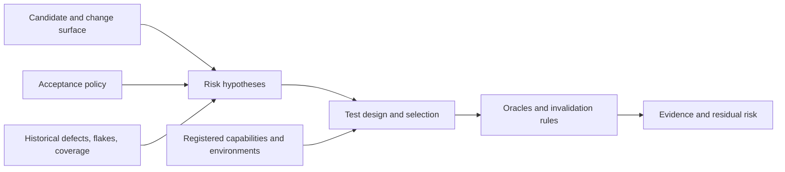
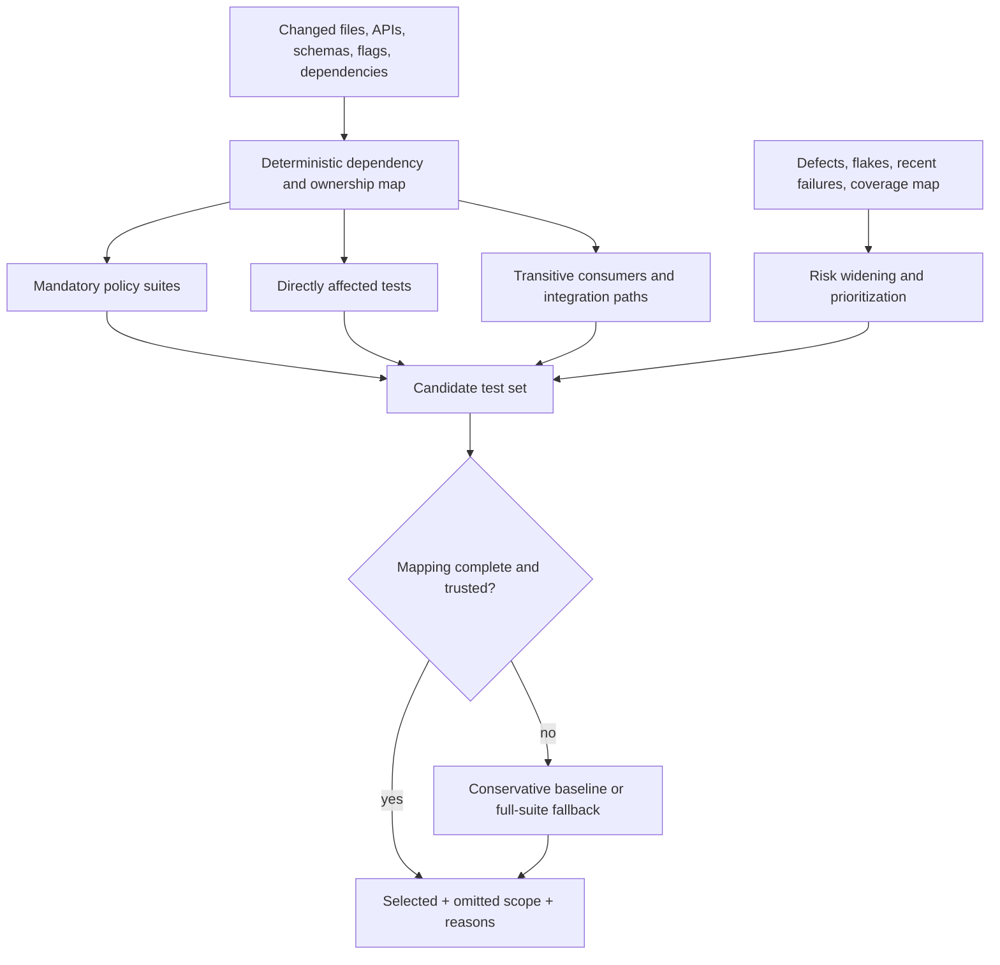
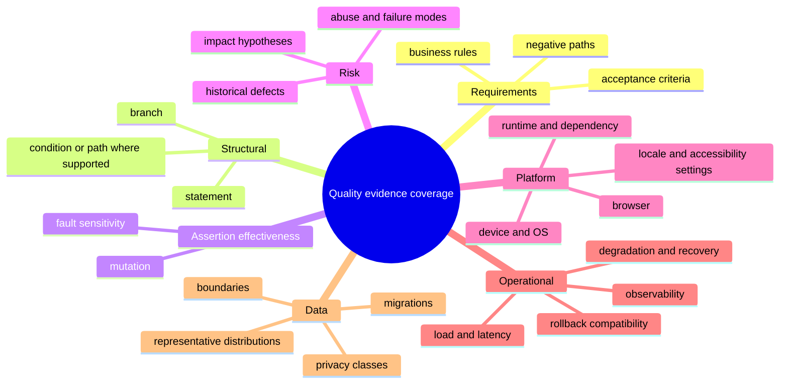

# Test Design, Selection, Oracles, and Risk

> Parent: [Test and Quality Engineering Agent](README.md)  
> Evidence: [research packet](../../research/packets/test-quality-engineering-agent-blueprint.md)  
> Last reviewed: 2026-08-31

## Purpose

The planning problem is not “run more tests.” It is to choose the smallest defensible set of observations that can expose the important failures for a specific immutable candidate, while making omissions and uncertainty visible.

A production plan connects five things:



If any link is missing, a large suite can still produce weak evidence.

## Inputs to a test plan

| Input | Required properties | Failure behavior |
| --- | --- | --- |
| Candidate | immutable source and build digest; base revision | reject mutable-only identity |
| Change surface | changed files, APIs, schemas, dependencies, configuration, flags, migrations | widen selection when incomplete or stale |
| Acceptance intent | requirement IDs, scenarios, constraints, explicit non-goals | report ambiguity; do not invent binding policy |
| Quality policy | mandatory suites, risk classes, thresholds, approval rules, fallback | fail closed for missing required policy |
| Platform matrix | supported browsers, devices, OS/runtime versions, locales, data classes | identify unsupported or deferred cells |
| Capability registry | exact tools, versions, isolation, permissions, outcome schemas | emit capability gap rather than imaginary tool |
| History | relevant defects, flakes, changed-test mappings, prior campaigns | use as evidence, not instruction authority |
| Budgets | deadline, compute, workers, devices, load, tokens, external writes | degrade by explicit priority, never silently omit |

## Risk model

Avoid a single opaque model-generated score. Represent risk as reviewable factors and policy rules.

```yaml
risk_hypothesis:
  id: RH-014
  statement: "Retry behavior may duplicate payment authorization"
  evidence:
    changed_components: ["payments/retry-policy", "payments/idempotency-store"]
    requirement_ids: ["PAY-22", "PAY-31"]
    historical_defects: ["DEF-918"]
  factors:
    impact: critical
    change_complexity: high
    blast_radius: multi_tenant
    detectability_after_release: low
    reversibility: low
    historical_failure_frequency: medium
  required_evidence:
    - property: "same idempotency key produces one authorization"
    - fault: "timeout after provider acceptance"
    - concurrency: "duplicate requests overlap"
  owner: "payments-quality"
```

Useful factors include:

- user, financial, security, privacy, safety, compliance, and operational impact;
- breadth of dependency and data-model change;
- novelty, complexity, and coupling;
- reversibility and time to detect after release;
- historical defect density and regression patterns;
- uncertainty in the change map or environment fidelity;
- platform reach and concurrency exposure.

The model may propose factors and hypotheses. Deterministic policy maps accepted factors to required evidence and approval classes.

## Test-design portfolio

Use complementary techniques. Each exposes different failure classes.

| Technique | Best for | Oracle | Important limitation |
| --- | --- | --- | --- |
| Example/scenario tests | known user behavior and acceptance criteria | exact state/output or observable behavior | misses unenumerated cases |
| Boundary and equivalence classes | ranges, validation, limits, encodings | accepted/rejected partition and boundary behavior | partitions may be modeled incorrectly |
| Decision tables | interacting business rules | expected action per rule combination | grows quickly; invalid combinations need constraints |
| Pairwise/t-way combinatorial | configuration and platform interactions | expected invariant for generated rows | chosen interaction strength may miss higher-order failures |
| Property-based tests | broad input spaces and invariants | property over generated input | bad property gives broad false confidence |
| Stateful/model-based tests | sequence and lifecycle behavior | reference model or state invariant | model can share the implementation’s mistake |
| Metamorphic tests | no exact expected output | relation between transformed inputs/outputs | relation must truly hold in the domain |
| Differential tests | independent implementations or versions | controlled comparison | correlated bugs and allowed differences complicate adjudication |
| Mutation tests | assertion effectiveness | mutation killed by suite | equivalent/unreachable mutants and compute cost |
| Coverage-guided fuzzing | parsers, protocols, native boundaries | crash, sanitizer, invariant, differential result | harness and corpus quality dominate |
| Fault injection | retries, timeouts, partial failure, recovery | system invariant under a named fault | can be destructive without target controls |
| Exploratory charters | ambiguity and novel interactions | skilled observation against charter | less deterministic; needs notes and evidence |

### Escalation order

Start with the cheapest technique that can answer the risk hypothesis:

1. reuse a known deterministic test;
2. parameterize or add a boundary/example in the isolated overlay;
3. use a deterministic generator such as a decision table or combinatorial model;
4. use property, stateful, mutation, fuzz, differential, or fault testing when the risk requires it;
5. escalate to a human exploratory, accessibility, security, domain, or safety review when no reliable automated oracle exists.

This order is a cost heuristic, not a quality hierarchy.

## Oracle design

An oracle decides whether an observation supports the expected property. It must be explicit before execution.

### Oracle classes

| Oracle class | Example | Main risk |
| --- | --- | --- |
| Exact deterministic | returned record equals expected record | brittle incidental fields or incorrect fixture |
| Invariant | balance never goes below allowed limit | incomplete invariant |
| Reference implementation | new serializer matches established implementation | shared behavior may itself be wrong |
| Differential | output agrees across independent implementations | allowed variation or common-mode defect |
| Metamorphic | sort permutation preserves multiset and ordering property | invalid relation for edge cases |
| Statistical | p95 and error rate remain within predeclared bounds | insufficient samples or non-comparable environment |
| Visual/perceptual | approved baseline plus deterministic tolerance | dynamic content and false differences |
| Security rule | scanner finding mapped to pinned rule and confidence | false positives/negatives; target authorization |
| Accessibility rule | pinned ACT/tool rule | automated rule coverage is not full conformance |
| Human/domain | expert adjudicates evidence against criteria | availability, consistency, and auditability |

### Oracle contract

```json
{
  "$schema": "https://json-schema.org/draft/2020-12/schema",
  "schema_name": "quality.oracle",
  "schema_version": "1.0.0",
  "oracle_id": "OR-PAY-IDEMPOTENCY-1",
  "kind": "invariant",
  "statement": "For one tenant and idempotency key, at most one provider authorization is committed.",
  "inputs": ["attempt.events", "provider.stub.calls", "database.snapshot"],
  "normalization": "quality://normalizers/payment-events/v2",
  "pass_condition": "committed_authorizations <= 1",
  "invalid_when": [
    "provider_stub_digest_mismatch",
    "event_stream_incomplete",
    "fixture_namespace_reused"
  ],
  "owner": "payments-quality",
  "policy_version": "release-quality/2026-08-20"
}
```

Do not permit the agent to change `pass_condition` after it sees a failure. A corrected oracle creates a new version, records the reason, and causes a re-run; prior observations remain.

### Model-assisted oracles

A model can help classify screenshots, text, or exploratory output only when:

- the task and rubric are versioned;
- inputs and outputs are retained within data policy;
- deterministic prechecks catch obvious invalid evidence;
- calibration is measured on independently labeled examples;
- high-impact or low-confidence cases go to a human;
- the same model is not the sole generator and judge of a test;
- recommendation logic preserves uncertainty and model version.

Model disagreement is evidence of uncertainty, not automatic failure or majority truth.

## Test selection

### Selection pipeline



### Deterministic selection first

Prefer:

- build-system dependency graphs;
- package/module ownership and public API relationships;
- schema, migration, configuration, and feature-flag consumers;
- test-to-source mappings from instrumentation;
- platform tags and test metadata;
- mandatory policy suites.

Historical and statistical selectors may prioritize or add tests, but should not silently remove mandatory coverage without measured safety and a fallback.

### Conditions that widen selection

- dependency graph, change base, or test map is missing, stale, or incompatible;
- lockfile, build logic, compiler, runtime, runner, test framework, shared fixture, or base image changes;
- public schema, authorization, persistence, concurrency, retry, caching, or migration behavior changes;
- previously unknown component or generated source is touched;
- a high-impact defect pattern matches;
- selection model confidence is below policy;
- release-candidate, periodic baseline, or regulated gate requires a fixed suite;
- a canary of omitted tests detects excess misses.

### Selected and omitted scope

Every plan emits both lists.

| Field | Example |
| --- | --- |
| Selected | `payments-unit`, contract tests for `authorize`, retry property suite, one browser checkout path |
| Reason | direct dependency, public contract, high-impact idempotency risk |
| Omitted | unrelated catalog visual snapshots, legacy admin browser matrix |
| Omission basis | no dependency path, unchanged shared components, low-risk periodic coverage retained elsewhere |
| Fallback | full payments suite if build graph version differs or selected run exposes shared-fixture failure |
| Residual risk | mobile background/resume behavior deferred to nightly physical-device campaign |

An agent cannot claim “all relevant tests passed” without defining relevance and omissions.

## Coverage model

### Keep dimensions separate



Do not combine these into one average. A 95% branch result does not compensate for zero evidence about migration rollback, screen-reader use, authorization abuse, or overload behavior.

### Mutation evidence

Use mutation testing selectively for high-risk or frequently changed logic. Record:

- mutation tool and version;
- mutation operators and excluded code;
- killed, survived, no-coverage, timeout, and error outcomes;
- reviewed equivalent or infeasible mutants;
- baseline comparison and sampling method.

Do not enforce an unexplained universal score. A small targeted mutation campaign can be more actionable than a prohibitively expensive whole-repository run.

### Historical coverage is advisory

Past tests and defects help prioritize, but old absence of failure is not proof of safety. History can also be poisoned by misclassified defects, changed behavior, biased test selection, or a flaky suite. Preserve source, time range, ownership, and confidence.

## Generated test and fixture design

### A generated test must be reviewable

Retain:

- generator/model identity and prompt/template version;
- candidate and requirement inputs used;
- generated source and dependency manifest;
- declared oracle and invalidation conditions;
- sandbox policy and network access;
- formatter/compiler/linter output;
- all attempts and artifacts;
- decision to discard, rerun, propose for promotion, or reject.

Generated tests should target public behavior and stable interfaces unless the plan explicitly requires a lower-level diagnostic probe. A test that only re-implements the changed code is a weak oracle.

### Fixture principles

- minimum data necessary;
- synthetic or approved masked data by default;
- unique tenant/user/schema/bucket namespace;
- deterministic seed and clock where feasible;
- explicit state precondition and cleanup lease;
- no dependence on execution order;
- no production identity or secret reuse;
- captured digest and schema version;
- data retention and deletion evidence.

## Planning contract

```yaml
schema_name: quality.test_plan
schema_version: 1.0.0
campaign_id: qcamp_01J...
plan_version: 3
candidate:
  source_revision: 9e6c1b7...
  build_digest: sha256:4b9...
  base_revision: 1a2b3c4...
policy:
  id: release-quality
  version: 2026-08-20
change_map:
  graph_digest: sha256:ace...
  confidence: high
risk_hypotheses:
  - id: RH-014
    required_evidence: [OR-PAY-IDEMPOTENCY-1]
jobs:
  - id: job-contract-payments
    capability: pact-provider.verify.v2
    test_selector:
      contract_tags: ["authorize", "retry"]
    environment_profile: integration-payments-v5
    oracle_ids: [OR-CONTRACT-VERIFY-2]
    depends_on: []
    resource_locks: ["provider-stub:campaign"]
    timeout_seconds: 900
    max_attempts: 2
    retry_on: ["infrastructure_failure"]
omissions:
  - scope: physical-ios-background-resume
    reason: device-lab capacity unavailable before deadline
    residual_risk: medium
fallbacks:
  - when: graph_digest_mismatch
    action: run_required_payments_baseline
stop_conditions:
  max_plan_steps: 20
  max_follow_up_experiments: 3
  wall_clock_seconds: 3600
  cost_units: 250
publication:
  external_writes: draft_only
```

Plan validation rejects:

- unknown schemas, capabilities, targets, environments, or oracle IDs;
- mutable candidate references without resolved digests;
- unsupported retry classes or missing timeouts;
- jobs whose permission/data/target profile exceeds the campaign grant;
- cyclic dependencies or unbounded fan-out;
- hidden omissions of mandatory policy evidence;
- plan changes that overwrite a prior version.

## Alternative planning strategies

| Strategy | Use when | Trade-off |
| --- | --- | --- |
| Static suite manifest | stable product and fixed release gate | simplest and most reliable; can be slow or broad |
| Dependency-graph selection | trustworthy monorepo/build graph | fast and auditable; misses undeclared/runtime relationships |
| Tag/ownership selection | mature test metadata | understandable; tags drift without governance |
| Coverage-based selection | accurate per-test coverage maps | captures observed reach; historical execution misses latent paths |
| Historical/statistical selection | very large suite with measured safety | can reduce cost; needs drift monitoring and conservative fallback |
| Model-proposed selection | ambiguous semantic change or incomplete metadata | can surface novel risk; not authoritative enough to omit required tests alone |
| Human-authored charter | high ambiguity, safety, UX, accessibility, or domain judgment | strong judgment; slower and less mechanically repeatable |

The practical default is hybrid: deterministic mandatory and dependency selection, risk-based widening, model-proposed additions, and explicit fallback.

## Plan review checklist

- [ ] Is the candidate immutable and is the change base correct?
- [ ] Does each risk hypothesis name an observable failure and required evidence?
- [ ] Does each test name an oracle and invalidation conditions?
- [ ] Are mandatory, selected, omitted, deferred, and unsupported scopes separate?
- [ ] Would graph, runner, fixture, policy, or environment drift trigger a safe fallback?
- [ ] Are generator seeds, versions, and minimized examples retainable?
- [ ] Are performance, security, accessibility, browser, mobile, and API claims phrased within their real scope?
- [ ] Are follow-up experiments limited and evidence-driven?
- [ ] Can a reviewer tell what was not tested and why?
- [ ] Does the plan stop with `UNKNOWN` when the necessary oracle or capability does not exist?

## Next guides

- Execute the plan safely: [Tool contracts, environments, fixtures, and isolation](03-tool-contracts-environments-fixtures-and-isolation.md)
- Apply domain-specific boundaries: [Domain validation boundaries](04-domain-validation-boundaries.md)
- Reconcile observations: [Defects, flaky tests, coverage, and release evidence](06-defects-flaky-tests-coverage-and-release-evidence.md)
