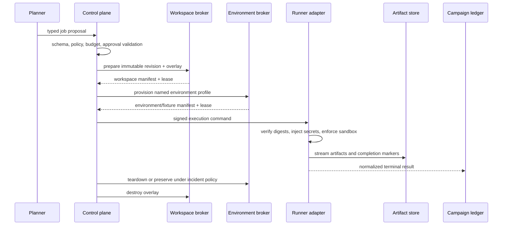
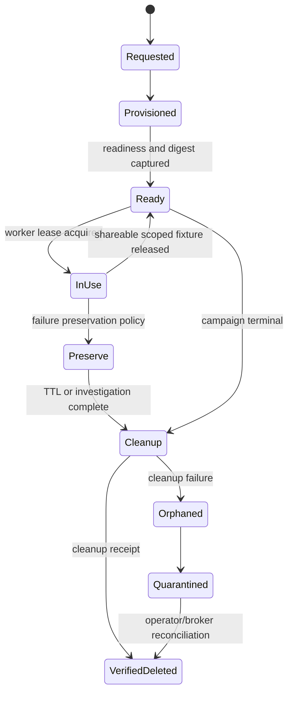
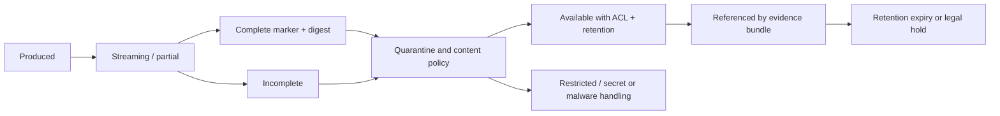

# Tool Contracts, Environments, Fixtures, and Isolation

> Parent: [Test and Quality Engineering Agent](README.md)  
> Evidence: [research packet](../../research/packets/test-quality-engineering-agent-blueprint.md)  
> Last reviewed: 2026-08-31

## Purpose

The execution plane turns an approved test plan into evidence without giving the model an unrestricted shell, cloud account, browser profile, device, database, scanner, or issue-tracker session.

The design has four independent contracts:

1. **candidate workspace** — exactly what source and build are under test;
2. **environment and fixture lease** — what dependencies, data, and targets exist and for how long;
3. **runner command** — what test action is allowed;
4. **normalized result** — what happened, including invalid and partial outcomes.



## Contract design rules

- Declare a schema name, semantic version, and JSON Schema dialect.
- Use enums for outcome and authority classes; do not infer them from prose.
- Resolve logical names to immutable digests before execution.
- Make timeouts, budgets, data class, target class, network policy, and artifact policy explicit.
- Use an idempotency key for every state-changing broker or integration call.
- Return one terminal result for each accepted command, even after cancellation or worker loss reconciliation.
- Store large or sensitive content as an artifact reference, not inline model context.
- Separate domain failure from test/infrastructure invalidity.
- Reject unknown required fields and incompatible major versions; never coerce a malformed result to pass.
- Treat adapter logs and third-party reports as untrusted content.

## Candidate workspace contract

```json
{
  "$schema": "https://json-schema.org/draft/2020-12/schema",
  "schema_name": "quality.workspace_request",
  "schema_version": "1.0.0",
  "request_id": "wreq_01J...",
  "idempotency_key": "qcamp_01J:workspace:9e6c1b7",
  "campaign_id": "qcamp_01J...",
  "source": {
    "repository_id": "payments-service",
    "revision": "9e6c1b7a0f...",
    "tree_digest": "sha256:48c...",
    "submodules": "pinned"
  },
  "mode": "immutable_base_with_writable_test_overlay",
  "build_profile": "ci-linux-amd64-v12",
  "network_profile": "dependency-mirror-only",
  "resource_limits": {
    "cpu": 4,
    "memory_mb": 8192,
    "disk_mb": 20480,
    "wall_clock_seconds": 1800
  },
  "expires_at": "2026-08-31T14:30:00Z"
}
```

The broker returns:

- resolved revision and tree digest;
- workspace and overlay IDs;
- build image and toolchain digests;
- dependency lock and cache-policy digests;
- sandbox, user, filesystem, process, and network policies;
- lease expiry and cleanup receipt requirements.

### Repository isolation

Use separate paths or snapshots for:

- immutable system under test;
- generated or diagnostic test overlay;
- build outputs;
- runner temporary files;
- exported evidence.

Do not let generated test code overwrite the candidate. When a framework insists on colocated files, mount an overlay that records every changed path and is destroyed after the campaign. Publish the overlay diff as an artifact if it affected a result.

### Build isolation

Capture:

- runner/container/VM image digest;
- compiler, runtime, package manager, test framework, browser, driver, plugin, and scanner versions;
- dependency lockfile and resolved dependency digest where feasible;
- build flags, feature flags, locale, timezone, clock mode, and random seeds;
- hardware or device characteristics that materially affect behavior;
- cache inputs and hit/miss state.

A cache is an optimization. If it cannot be keyed and validated safely, disable it for reproduction and release evidence. Never allow a shared writable cache to carry secrets or attacker-controlled executables into a privileged job.

## Environment lease contract

```yaml
schema_name: quality.environment_lease_request
schema_version: 1.0.0
request_id: ereq_01J...
idempotency_key: qcamp_01J:env:integration-payments-v5
campaign_id: qcamp_01J...
profile: integration-payments-v5
target_class: ephemeral_test
data_class: synthetic
components:
  - capability: postgres.ephemeral.v2
    version: "16.4"
  - capability: payment-provider.stub.v3
    scenario_set: retry-and-timeout-v2
network:
  ingress: campaign_workers_only
  egress: deny
fixtures:
  namespace: qcamp_01J
  seed: 742901
  clock: "2026-08-31T10:00:00Z"
lease:
  ttl_seconds: 3600
  heartbeat_seconds: 60
  preserve_on_failure_seconds: 900
cleanup:
  required: true
  evidence_receipt: true
```

The returned manifest records actual component image or service versions, endpoints by opaque handle, fixture digests, account/tenant IDs, network rules, creation timestamps, snapshot IDs, readiness probes, and cleanup state.

### Environment fidelity ladder

| Environment | Use | Default authority | Evidence caveat |
| --- | --- | --- | --- |
| In-process fake/mock | unit behavior and injected failures | automatic | weak fidelity for protocols, concurrency, and provider behavior |
| Ephemeral real dependency | integration and persistence behavior | automatic within quota | topology and managed-service differences remain |
| Isolated system environment | cross-service and end-to-end validation | policy-scoped | shared control planes may create contention |
| Staging/pre-production | release-path, migration, scale, compatibility | approval or scheduled policy | configuration/data drift from production |
| Production read/observe | post-deployment evidence or incident support | explicit production-read role | privacy and operational impact |
| Production active/load/security | rare bounded experiment | accountable target owner plus operations/security approval | potential customer and service impact |

“Containerized” is not synonymous with “production-equivalent.” Each profile declares known differences and the claims it is allowed to support.

## Fixture lifecycle



### Fixture rules

- Allocate a unique namespace for each campaign and, when necessary, each test.
- Prefer deterministic synthetic data and record the generator version and seed.
- Masked production-derived data requires an approved transformation, data owner, retention, and re-identification review.
- Treat fixture files and seed scripts as executable/untrusted supply-chain inputs.
- Freeze or virtualize time only when the test declares it; record clock behavior.
- Make cleanup idempotent and broker-owned.
- Keep a lease heartbeat and reclaim abandoned resources.
- Preserve a failed fixture only for a bounded investigation window and under its original access policy.
- Record cleanup success; do not assume process exit deleted remote resources.

### Testcontainers guidance

On-demand real dependencies are useful for isolation and fidelity. Reusable-container modes trade isolation and cleanup for speed and may be explicitly unsuitable for CI. If reuse is enabled locally, label the evidence lower fidelity and reproduce release-blocking findings in a fresh environment.

## Runner command contract

```json
{
  "$schema": "https://json-schema.org/draft/2020-12/schema",
  "schema_name": "quality.test_execution_command",
  "schema_version": "1.0.0",
  "command_id": "cmd_01J...",
  "idempotency_key": "qcamp_01J:job-contract-payments:attempt-1",
  "campaign_id": "qcamp_01J...",
  "plan_version": 3,
  "job_id": "job-contract-payments",
  "attempt": 1,
  "candidate": {
    "revision": "9e6c1b7a0f...",
    "build_digest": "sha256:4b9..."
  },
  "workspace_lease_id": "wlease_01J...",
  "environment_lease_id": "elease_01J...",
  "capability": {
    "id": "pact-provider.verify",
    "version": "2.1.0"
  },
  "selector": {
    "contract_tags": ["authorize", "retry"]
  },
  "execution": {
    "timeout_seconds": 900,
    "graceful_stop_seconds": 20,
    "workers": 1,
    "seed": 742901
  },
  "network_policy": "integration-payments-isolated-v4",
  "secret_handles": ["secret://payment-stub/test-token"],
  "artifact_policy": "release-evidence-standard-v2",
  "approval_grant_id": null
}
```

The model never writes `argv`, a shell pipeline, or environment-secret values in this public contract. A reviewed adapter maps capability-specific typed fields to the safe invocation.

### When a generic command runner is unavoidable

If legacy systems require a generic command:

- select a repository-owned command template by immutable digest;
- restrict parameters to typed fields and allowlisted values;
- use an argument array without shell interpolation;
- run as an unprivileged user in a disposable workspace;
- set filesystem, process, syscall, resource, and network limits;
- strip inherited environment variables;
- inject secret handles directly into the child process;
- record the resolved executable and arguments after redaction;
- kill the process tree and reconcile artifacts on timeout.

Do not expose `bash -c`, `powershell -Command`, `cmd /c`, or equivalent free-form interpretation to model-authored text by default.

## Normalized result contract

```json
{
  "$schema": "https://json-schema.org/draft/2020-12/schema",
  "schema_name": "quality.test_execution_result",
  "schema_version": "1.0.0",
  "command_id": "cmd_01J...",
  "campaign_id": "qcamp_01J...",
  "job_id": "job-contract-payments",
  "attempt": 1,
  "candidate_digest": "sha256:4b9...",
  "environment_manifest_digest": "sha256:e17...",
  "runner_manifest_digest": "sha256:5a3...",
  "accepted_at": "2026-08-31T10:02:00Z",
  "started_at": "2026-08-31T10:02:08Z",
  "finished_at": "2026-08-31T10:08:12Z",
  "terminal_status": "completed",
  "outcome_class": "assertion_failure",
  "summary": {
    "discovered": 81,
    "executed": 81,
    "passed": 80,
    "failed": 1,
    "skipped": 0,
    "flaky": 0
  },
  "failed_test_ids": ["contract.authorize.timeout-after-acceptance"],
  "artifacts": [
    {
      "role": "normalized_report",
      "uri": "artifact://sha256/92e...",
      "digest": "sha256:92e...",
      "media_type": "application/vnd.quality.test-report+json",
      "complete": true
    }
  ],
  "adapter_receipt": "adapter-receipt://pact/4fa...",
  "redactions": 2
}
```

### Terminal status versus outcome class

| Terminal status | Meaning |
| --- | --- |
| `completed` | runner reached a normal terminal point and produced a parseable result |
| `timed_out` | deadline expired and process-tree termination was attempted |
| `cancelled` | control plane requested stop |
| `worker_lost` | lease expired or worker disappeared |
| `rejected` | command failed schema, policy, capability, or grant validation |

| Outcome class | Attributed to candidate? | Example |
| --- | --- | --- |
| `pass` | supports expected behavior | all declared assertions pass |
| `assertion_failure` | usually yes, pending reproduction | expected and actual differ |
| `crash` | possibly | application process or device app crashes |
| `performance_failure` | possibly | predeclared threshold fails in valid environment |
| `security_finding` | needs triage | pinned rule finds suspected vulnerability |
| `accessibility_finding` | needs scoped interpretation | automated/manual rule fails |
| `setup_failure` | no | fixture could not reach declared precondition |
| `infrastructure_failure` | no | worker, device, dependency, network, or capacity failure |
| `report_invalid` | no verdict | malformed, truncated, incompatible, or duplicate IDs |
| `policy_blocked` | no execution | requested action exceeded authority |
| `unknown` | no verdict | cannot determine a safer class |

A terminal status of `completed` can still carry `assertion_failure`. A report upload can succeed while the test failed. Keep these axes separate.

## Retry policy

Retry by failure class, not by a generic count.

| Failure class | Default retry | Required change/evidence |
| --- | --- | --- |
| Assertion failure | no blind retry | preserve first attempt; reproduce under a declared experiment |
| Infrastructure transient | bounded automatic | new worker/lease; same candidate, plan, oracle; backoff |
| Setup failure | bounded after broker repair | new fixture manifest; classify old attempt invalid |
| Worker lost | bounded if budget remains | reconcile whether prior side effects or artifacts completed |
| Rate limited | honor server hint and campaign deadline | idempotency key and same operation identity |
| Report invalid | one reparse or rerun after confirmed parser/transport issue | retain raw report and parser version |
| Timeout | no automatic retry unless policy defines wider budget experiment | record partial artifacts and process termination |

If a failed test passes on a repeat, classify the campaign evidence as intermittent until the cause is understood or policy explicitly accepts the risk. Never delete attempt 1.

## Test discovery contract

Discovery is an independent operation because a zero-test run can appear green.

Return:

- discovery command and capability versions;
- discovered stable test IDs and metadata;
- filters applied and filters that matched nothing;
- expected versus discovered counts when known;
- duplicates, parse errors, unsupported tags, and disabled/quarantined tests;
- manifest digest used by execution.

Policy can then reject unexpected zero tests, duplicate IDs, missing mandatory tags, or discovery/execution manifest mismatch.

## Artifact lifecycle



Artifact metadata includes campaign/job/attempt, producer identity, candidate and environment digests, media type, size, content digest, completeness, redaction, sensitivity, retention, and parent artifacts. A screenshot or HAR can contain credentials and personal data; a report can contain terminal escape sequences or prompt injection. Content-addressing does not remove those risks.

## Cleanup and recovery

The control plane reconciles independently of the model:

1. accepted commands without heartbeats;
2. workers whose lease expired;
3. environments and fixtures past TTL;
4. partial artifact uploads;
5. commands with no terminal result;
6. duplicate callbacks or results;
7. external publication without a recorded receipt;
8. secrets or high-sensitivity artifacts that require quarantine.

Cleanup is idempotent and retries use the original resource identity. An orphaned environment becomes a security/operations alert, not a model todo.

## Isolation review checklist

- [ ] Can untrusted candidate or generated test code write outside its overlay and output paths?
- [ ] Are build and runner images pinned by digest and their provenance verified where required?
- [ ] Is dependency/network access deny-by-default and logged?
- [ ] Are secrets injected after plan validation and hidden from model, command text, logs, and artifacts?
- [ ] Does test discovery prevent an unexpected zero-test pass?
- [ ] Does every command have time, CPU, memory, disk, process, worker, and cost limits?
- [ ] Are fixture namespace, seed, clock, schema, readiness, lease, and deletion receipt recorded?
- [ ] Can every result distinguish candidate failure from setup, infrastructure, parser, and policy failure?
- [ ] Are all attempts retained and reconciled after cancellation or worker loss?
- [ ] Is environment fidelity stated rather than assumed?

## Next guides

- Bind tools to their real testing domains: [Domain validation boundaries](04-domain-validation-boundaries.md)
- Prove each runner and integration preserves these contracts: [Adapter qualification and conformance](10-adapter-qualification-and-conformance.md)
- Persist and schedule work safely: [State, context, planning, parallelism, and memory](05-state-context-planning-parallelism-and-memory.md)
- Protect identities and integrations: [Security, identity, integrations, and provenance](07-security-identity-integrations-and-provenance.md)
