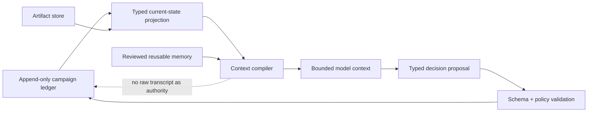
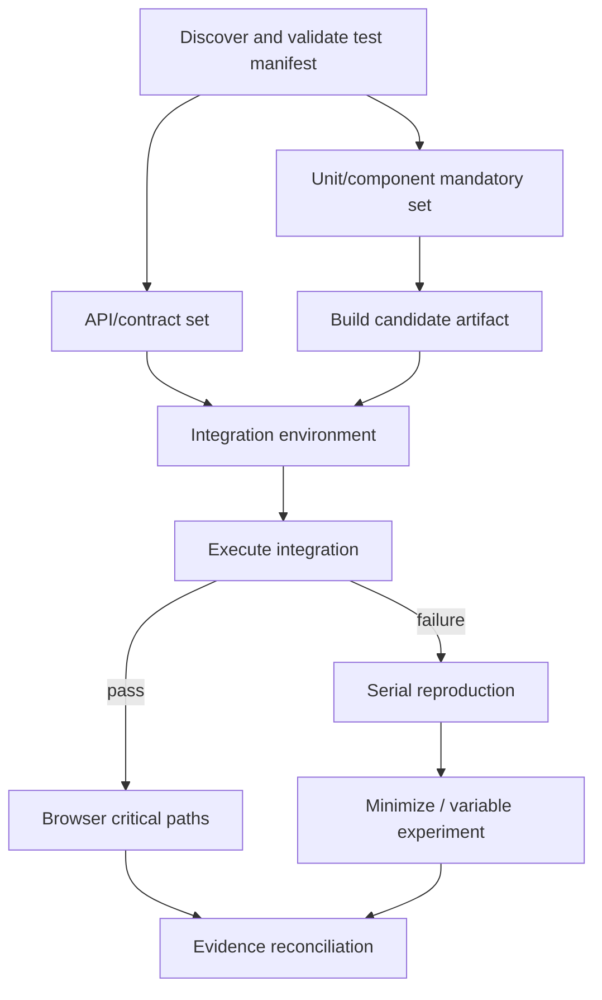
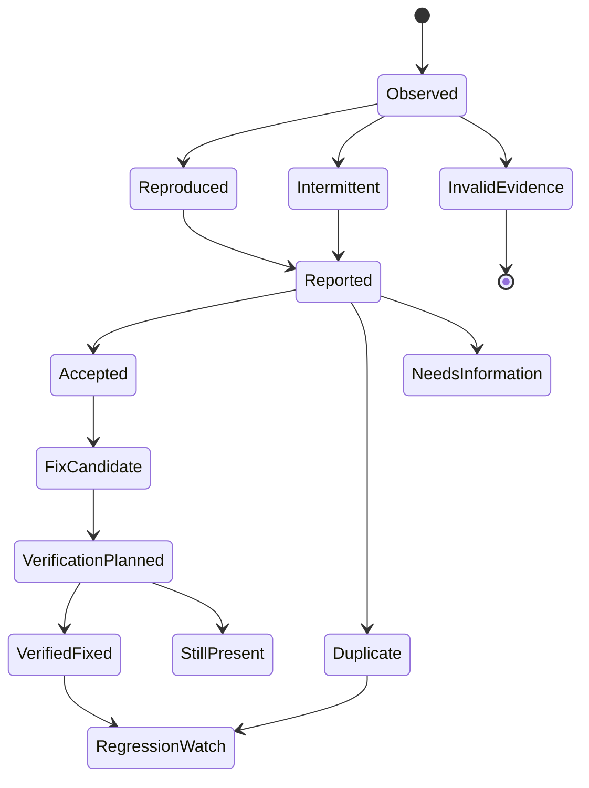

# State, Context, Planning, Parallelism, and Memory

> Parent: [Test and Quality Engineering Agent](README.md)  
> Evidence: [research packet](../../research/packets/test-quality-engineering-agent-blueprint.md)  
> Last reviewed: 2026-08-31

## Purpose

Long quality campaigns accumulate requirements, source excerpts, test inventories, plans, environment manifests, failures, retries, traces, defects, and external receipts. Putting all of it in a model transcript makes the system expensive, vulnerable to prompt injection, and hard to recover.

Use three different mechanisms:

1. **durable campaign state** for authoritative facts and events;
2. **short-term reasoning state** for the active decision;
3. **optional reviewed memory** for reusable knowledge whose future value exceeds its poisoning and staleness risk.



## State model

### Durable entities

| Entity | Identity | Mutable by | Retention purpose |
| --- | --- | --- | --- |
| Campaign | campaign ID + candidate digest | control-plane transitions | audit, recommendation reconstruction |
| Plan version | campaign ID + monotonically increasing version | validated planner proposal | preserve why scope changed |
| Job | campaign + plan + job ID | scheduler state machine | dependencies, budget, ownership |
| Attempt | command ID + attempt number | append-only terminal result/reconciliation | first failure, retries, attribution |
| Environment/fixture lease | broker resource ID | broker/reconciler | isolation, cleanup, orphan recovery |
| Artifact | content digest + logical role | artifact service metadata policy | evidence and provenance |
| Finding | finding ID + fingerprint version | evidence reconciler and adjudication workflow | dedupe without erasing instances |
| Defect record | defect ID + revision | approved adapter/workflow | cross-campaign ownership and status |
| Recommendation | campaign + recommendation version | reconciler | advisory decision record |
| Approval/waiver | grant ID + policy version | accountable authority | authority and expiry |
| External receipt | integration + operation ID | adapter/reconciler | idempotency and publication state |

Do not store a campaign as one mutable JSON document. Use an append-only event stream or transactional tables with immutable attempts and versioned plans, plus materialized views for current status.

### Minimum campaign events

```text
CampaignScoped
PlanProposed
PlanAccepted | PlanRejected
EnvironmentLeaseGranted | EnvironmentLeaseFailed
JobReady | JobDispatched
AttemptStarted | AttemptHeartbeat | AttemptTerminal
ArtifactDeclared | ArtifactCompleted | ArtifactQuarantined
FindingObserved | FindingReproduced | FindingAdjudicated
PlanSuperseded
RecommendationCreated
PublicationRequested | PublicationSucceeded | PublicationFailed
CampaignCancelled | CampaignClosed
CleanupVerified | ResourceOrphaned
```

Every event includes event ID, schema version, campaign ID, causation ID, correlation/trace ID, actor identity, timestamp, idempotency key where relevant, and payload digest.

## Short-term reasoning state

The model needs a concise, task-specific projection rather than the complete ledger.

### Context compiler inputs

| Input | Trust | Representation |
| --- | --- | --- |
| System mission and authority policy | trusted, versioned | fixed instruction block and policy IDs |
| Current decision request | trusted control-plane request | typed objective, allowed outputs, budgets |
| Candidate/change map | untrusted facts from repository tooling | structured paths, symbols, dependency edges, digests |
| Requirements/acceptance text | mixed trust | quoted excerpts with source IDs and ambiguity flags |
| Capability registry | trusted control-plane metadata | relevant allowlisted capability subset |
| Plan/current state | authoritative | typed projection with terminal/pending jobs |
| Test results | untrusted observation | normalized summary plus artifact references |
| Logs/pages/reports/issues | untrusted | size-limited escaped excerpts; never instruction role |
| Reviewed memory | conditionally trusted | scoped typed records with expiry/provenance |

### Context budget order

1. mission, authority, policy, candidate, and current decision;
2. unresolved blocking facts and exact artifact IDs;
3. relevant test/attempt summaries and prior decisions;
4. source or report excerpts necessary to reason;
5. optional historical and memory context;
6. omit redundant transcript and raw artifacts.

If the context cannot fit, reduce evidence by deterministic summarization and references. Do not drop candidate identity, plan version, unresolved blockers, attempt history, or approval constraints.

## Compaction and continuity

Model/provider compaction can preserve continuity for a long session, but it is opaque and can evolve. Treat it as a cache of reasoning continuity, not the system of record.

At each milestone, persist a model-independent checkpoint:

```yaml
schema_name: quality.reasoning_checkpoint
schema_version: 1.0.0
campaign_id: qcamp_01J...
decision_id: decide_follow_up_4
candidate_digest: sha256:4b9...
active_plan_version: 3
source_event_high_watermark: 1174
completed_actions:
  - job-contract-payments: assertion_failure
  - job-unit-payments: pass
active_assumptions:
  - id: A-7
    statement: "provider accepted the first request before client timeout"
    evidence: ["artifact://sha256/7c1..."]
    confidence: medium
unresolved_blockers:
  - "server-side provider receipt is incomplete"
important_ids:
  attempts: ["cmd_01J...:1", "cmd_01K...:1"]
  environment_lease: elease_01J...
next_goal: "distinguish duplicate client send from duplicate server commit"
remaining_budgets:
  follow_up_experiments: 2
  wall_clock_seconds: 1300
context_builder_release: quality-context/4.2.0
checkpoint_sha256: "..."
```

### Compaction receipt

The reasoning checkpoint above says what the next decision needs. Record a separate compaction receipt whenever a provider/session compaction or an application-owned context reduction changes what the model will see. The receipt does not need to expose opaque provider state or chain-of-thought; it proves which authoritative inputs were represented and which were deliberately omitted.

```yaml
schema_name: quality.compaction_receipt
schema_version: 1.0.0
receipt_id: qcompact_01J...
campaign_id: qcamp_01J...
decision_id: decide_follow_up_4
source:
  event_high_watermark: 1174
  reasoning_checkpoint_digest: sha256:...
  prior_context_manifest_digest: sha256:...
output:
  context_manifest_digest: sha256:...
  provider_continuation_reference: opaque-and-access-controlled
preserved:
  required_identity_fields: [candidate_digest, plan_version, policy_version]
  terminal_effect_ids: [effect_01J...]
  unresolved_effect_ids: [effect_01K...]
  blockers: [blocker_provider_receipt]
omitted:
  - class: raw_artifact_body
    replacement: artifact://sha256/7c1...
  - class: superseded_hypothesis
    replacement: event://1182
invariant_check:
  required_fields_present: true
  unresolved_effects_present: true
  approval_constraints_present: true
created_by: quality-context/4.2.0
created_at: 2026-08-31T10:21:00Z
```

Reject or rebuild the compacted context when its receipt omits the current candidate, policy, accepted plan, remaining budget, blocking finding, active lease, or unresolved effect. Persist the receipt with the context manifest so an eval can distinguish a model error from context loss.

On resume:

1. load authoritative campaign projection and latest checkpoint;
2. verify candidate, plan, policy, capability, and environment versions;
3. reconcile running jobs and leases rather than assuming transcript state;
4. reconstruct a fresh bounded context;
5. ask the model for the next typed decision;
6. reject actions already terminal or outside remaining budgets.

Repeated compaction must not duplicate tool calls. Idempotency and ledger state—not memory of having acted—prevent duplication.

## Planning model

### Plan as a bounded DAG



Each node declares:

- input artifact and manifest digests;
- capability, target, environment, fixture, and oracle;
- prerequisites and resource locks;
- timeout, worker count, attempts, cost estimate, and priority;
- retryable outcome classes;
- output artifact requirements;
- skip and cancellation semantics;
- approval class and side-effect scope.

### Plan revisions

A follow-up experiment appends a plan version with:

- evidence that motivated the change;
- hypothesis being distinguished;
- one or more intentionally varied factors;
- factors held constant;
- added cost and remaining budget;
- stop condition and expected information gain;
- policy/approval result.

The prior plan remains queryable. The model may not endlessly refine scope: `max_plan_versions`, `max_follow_up_experiments`, and campaign deadline are hard controls.

## Bounded parallelism

### Parallelize only independent experiments

Safe examples:

- isolated unit-test shards against the same immutable build;
- independent browser profiles with separate contexts/accounts;
- separate read-only API contract groups with isolated provider state;
- platform cells on separate emulators/devices;
- artifact parsing and report normalization.

Serialize or lock:

- tests sharing a mutable tenant, database schema, queue, account, device, port, clock, or rate budget;
- migrations and rollback checks against one environment;
- load and active security tests on the same target;
- reproduction experiments where concurrency is the variable;
- external defect creation or recommendation publication.

### Concurrency controls

```yaml
scheduler:
  global:
    max_active_jobs: 100
  tenant:
    max_active_campaigns: 5
    max_active_jobs: 20
  campaign:
    max_active_jobs: 4
    max_devices: 2
    max_browser_workers: 4
    max_load_generators: 0
  capability:
    physical_device_ios: 12
    active_security_scan: 2
  resource_lock:
    lease_seconds: 120
    heartbeat_seconds: 30
  admission:
    reserve_for_release_gate_percent: 30
```

Numbers are illustrative. Set them from measurements and service objectives.

### Fail-fast versus evidence preservation

Use fail-fast when:

- a prerequisite build/environment is invalid;
- candidate identity or policy cannot be verified;
- a severe safety/security stop condition fires;
- continuing cannot add useful evidence.

Continue independent work when:

- multiple mandatory domains must report all blockers;
- a failure in one shard does not invalidate others;
- the release review benefits from a complete defect inventory;
- a suspected flake needs attempt evidence.

Cancellation is a state transition. Workers stop gracefully, upload partial artifacts, return a terminal result, and release resources.

## Short-term defect and campaign state

Working hypotheses are ephemeral but explicit:

| Field | Purpose |
| --- | --- |
| Hypothesis ID and statement | avoid vague narrative drift |
| Supporting and contradicting evidence IDs | grounding and falsifiability |
| Confidence | calibrated communication, not probability theater |
| Variables considered | prevents repeating experiments |
| Next discriminating experiment | bounded progress |
| Stop condition | prevents infinite diagnosis |
| Disposition | supported, contradicted, unresolved, superseded |

Do not store chain-of-thought. Store decisions, assumptions, evidence references, and action rationale sufficient for review.

## Durable campaign and defect state

Campaign state is candidate-specific and expires according to evidence policy. Defect state can outlive one campaign because it tracks observation across candidates.

### Defect state machine



The external issue tracker may use different statuses. Preserve the internal evidence state and map through a versioned adapter instead of adopting ambiguous external names as the source of truth.

## Memory lifetime policy

“Memory” is not one retrieval collection. Each lifetime has a different owner, authority, retention rule, and failure mode:

| Memory class | Quality-engineering use | Admission and authority policy |
|---|---|---|
| Turn/scratch memory | One model call's candidate hypotheses, parsing, and temporary calculations | Ephemeral and non-authoritative; discard after the trace-retention window |
| Working/run memory | Current bounded plan, job/tool results, budgets, evidence pointers, assumptions, and blockers | Typed checkpointed run state; authoritative campaign/job records win on conflict |
| Session memory | Authenticated reviewer clarifications, active candidate/campaign, and UI presentation state | Bound to tenant, actor, campaign, and expiry; cannot carry authorization or release judgment into another session |
| Durable workflow/campaign memory | Campaign, plan, test job/attempt, environment lease, defect, evidence decision, approval, and publication/reconciliation state | Authoritative application data with schemas, fencing, audit, correction, retention, and deletion |
| Domain knowledge memory | Versioned quality policy, test manifests, capability registry, environment topology, oracle contracts, ownership and release criteria | Curated by named owners and source systems; effective-dated and never silently inferred from logs or repository text |
| Long-term/preference memory | Reviewed failure fingerprints, stable troubleshooting guidance, closed defects, and approved terminology | Off by default; require evidence, scope/version, owner, TTL/review, ACL, correction/deletion, poisoning defense, and measured eval value |
| Episodic/outcome memory | Selected closed campaign trajectories, flaky diagnoses, human corrections, incidents, and escape defects | Reviewed and minimized/de-identified where permitted; used to create evals before it can influence behavior and never authoritative for a new candidate |
| User preference memory | Formatting or notification convenience only | Rejected for test policy, coverage requirements, severity, approval, release recommendation, or evidence truth |
| Raw vector/conversation memory | Unbounded logs, screenshots, pages, issue comments, repository instructions, prompts, or test output | Rejected as a production source of truth; use permissioned artifact/evidence retrieval with lineage instead |

## Long-term memory: admission is exceptional

The system can function without long-term model memory. Add it only when evals show repeated, transferable value that a deterministic database/query cannot provide more safely.

### Good candidates

- reviewed failure fingerprints and known flake mechanisms with current owners;
- approved environment troubleshooting playbooks;
- closed defects with minimal reproducers and affected-version ranges;
- stable test-selection relationships that are not available from the build graph;
- explicit organization terminology and quality policy explanations;
- tool limitations and version-scoped workarounds.

### Bad candidates

- raw logs, screenshots, browser pages, issue comments, test output, or repository instructions;
- credentials, tokens, personal/customer data, or full production payloads;
- an agent’s unverified root-cause guess;
- transient runner outages or branch-specific facts without expiry;
- accepted-risk decisions without scope and end date;
- “always ignore this failure” notes;
- opaque embeddings without source, ACL, deletion, and version scope.

### Admission record

```yaml
schema_name: quality.memory_record
schema_version: 1.0.0
memory_id: qmem_01J...
kind: flaky_failure_fingerprint
scope:
  repository: storefront
  test_id: checkout.retry-idempotency
  runner_major: 3
statement: "Failures with device disconnect code X during emulator snapshot restore are infrastructure-attributed after broker health check Y fails."
source_evidence:
  - artifact://sha256/91a...
  - defect://QA-1842
review:
  reviewer: quality-platform-owner
  reviewed_at: 2026-08-29T12:00:00Z
confidence: high
trust: reviewed_internal
not_instructions: true
expires_at: 2026-11-30T00:00:00Z
revalidation_trigger:
  - emulator_image_change
  - runner_major_change
acl: [quality-platform, storefront-quality]
```

### Memory poisoning controls

- Admit only through a typed workflow separate from ordinary model output.
- Require evidence, scope, reviewer, expiry, and revalidation triggers.
- Keep content descriptive; it cannot grant capability or override policy.
- Preserve supporting and contradicting evidence.
- Retrieve by tenant/repository/component/version ACL before semantic ranking.
- Label retrieved memory as potentially stale evidence.
- Detect sudden mass writes, repeated source concentration, contradictory entries, and suspicious instruction-like content.
- Support correction, revocation, deletion, and downstream cache invalidation.
- Freeze admission during incidents or detected prompt-injection campaigns.

## Retention and deletion

Use separate schedules:

| Data | Typical retention driver | Deletion requirement |
| --- | --- | --- |
| Campaign metadata and recommendation | release/audit policy | preserve minimal decision record; delete expired sensitive details |
| Raw logs/traces/HAR/video | debugging value versus sensitivity/cost | shortest practical TTL; redact/quarantine; legal hold separately |
| Generated fixtures and test data | reproduction and privacy | delete environment data promptly; retain synthetic recipe/digest if allowed |
| Reproduction bundle | defect lifecycle and regression value | retain through fix and defined regression window |
| Memory record | demonstrated reuse | TTL and revalidation; delete on source revocation or policy request |
| Telemetry | operations/SLO/eval need | aggregate low-cardinality metrics; minimize raw payloads |

Deletion must cover primary store, search/index/vector projection, caches, replicas according to platform policy, and future context retrieval. Record a deletion receipt where compliance requires it.

## Context and state failure modes

| Failure | Detection | Response |
| --- | --- | --- |
| Compacted context omits a blocking failure | compare decision inputs to authoritative projection | rebuild context; reject decision missing required IDs |
| Duplicate tool call after resume | idempotency conflict or terminal job state | return original receipt/result; do not rerun |
| Plan references expired environment | lease validation | reprovision and create new manifest/attempt |
| Stale defect memory misattributes failure | version/scope mismatch or contradictory evidence | suppress memory, open revalidation, use current evidence |
| Parallel jobs collide on fixture | lock/namespace conflict | cancel/mark invalid, repair broker allocation |
| Lost worker returns late result | lease epoch mismatch | retain as late artifact but exclude from authoritative result pending reconciliation |
| Event schema newer than consumer | compatibility check | quarantine event, stop dependent transition, page owner |
| Memory deletion leaves embedding | reconciliation audit | delete projection and caches; prevent retrieval until verified |

## Review checklist

- [ ] Is the campaign ledger authoritative over model transcript and compaction state?
- [ ] Are plans, attempts, recommendations, and approvals versioned or immutable?
- [ ] Can resume reconcile workers, leases, and receipts before issuing new actions?
- [ ] Is context assembled from typed projections with trust labels and artifact references?
- [ ] Does every context reduction produce a compaction receipt that proves identity, authority, blockers, budgets, and unresolved effects were preserved?
- [ ] Are plan depth, versions, follow-up experiments, workers, devices, time, tokens, and spend bounded?
- [ ] Are parallel jobs truly isolated or protected by resource locks?
- [ ] Does cancellation preserve terminal status and partial evidence?
- [ ] Is long-term memory unnecessary by default and admitted only through review?
- [ ] Can memory be scoped, expired, revalidated, corrected, revoked, and fully removed from retrieval?
- [ ] Does incident mode freeze active tests, external writes, and memory admission independently?

## Next guides

- Use attempts to diagnose and recommend: [Defects, flaky tests, coverage, and release evidence](06-defects-flaky-tests-coverage-and-release-evidence.md)
- Protect durable state and adapters: [Security, identity, integrations, and provenance](07-security-identity-integrations-and-provenance.md)
- Operate the scheduler and state plane: [Reliability, observability, evaluation, and operations](08-reliability-observability-evaluation-and-operations.md)
