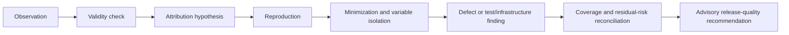

# Defects, Flaky Tests, Coverage, and Release Evidence

> Parent: [Test and Quality Engineering Agent](README.md)  
> Evidence: [research packet](../../research/packets/test-quality-engineering-agent-blueprint.md)  
> Last reviewed: 2026-08-31

## Purpose

The value of a quality agent is not the number of tests it launches. It is the quality of the evidence chain from observation to defect and from campaign to recommendation.



Each arrow can end in `UNKNOWN`. The agent must not fill gaps with confidence-sounding prose.

## Failure taxonomy

Classify before diagnosing.

| Layer | Example | Candidate attribution |
| --- | --- | --- |
| Discovery | zero tests after unexpected filter mismatch | invalid evidence |
| Build | compiler error tied to candidate | candidate failure when environment valid |
| Setup/fixture | seed migration fails before precondition | invalid/setup; may expose candidate incompatibility after reproduction |
| Infrastructure | lost runner, device unavailable, registry outage | not candidate by default |
| Test/harness | assertion code crash, stale selector, bad mock | test defect or unknown |
| Oracle | expected value/rule is wrong or inapplicable | invalid until oracle adjudicated |
| Product assertion | valid expected behavior differs from actual | candidate defect hypothesis |
| Product crash | application crashes under valid test | candidate defect hypothesis |
| Performance | valid comparable run breaches declared threshold | candidate/environment capacity finding according to scope |
| Security/accessibility tool | rule emits a finding | finding pending scope and triage |
| Artifact/report | truncated report, missing trace, duplicate test IDs | evidence incomplete/invalid |
| Publication | check/issue/test-management write fails | integration failure; test result unchanged |

Do not collapse all nonzero exits into “test failed.” Keep raw exit code, adapter mapping, and parser result.

## Validity gate

Before attributing a failure, verify:

- candidate source/build digest matches the command and artifacts;
- environment and fixture manifests match the plan and reached readiness;
- runner/test manifest, tool versions, schema, and oracle match the accepted plan;
- target, auth role, feature flags, clock, locale, network, and data profile are correct;
- required artifacts are complete and parseable;
- test discovery and filter counts are plausible;
- no lease, worker, disk, memory, device, or external dependency failure invalidated the run;
- the action stayed inside safety policy.

A candidate may reveal a fixture or harness weakness. Record both observations instead of selecting the more convenient owner.

## Reproduction protocol

### Step 1: preserve the first observation

Freeze or retain:

- exact candidate and base revision;
- generated test overlay and fixture recipe;
- environment, runner, browser/device/plugin, dependency, and policy manifests;
- test ID, order, shard, worker, seed, clock, locale, flags, and account/tenant;
- command and attempt IDs;
- expected and actual values;
- raw reports, logs, traces, screenshots/video, dumps, profiles, network evidence, and server correlation IDs;
- resource pressure and dependency health.

### Step 2: repeat under the same declared conditions

Use a fresh worker and reset state unless shared state is the hypothesis. A passing rerun does not erase the first failure; it creates intermittent evidence.

### Step 3: reduce uncontrolled dimensions

Reproduce serially, on a dedicated fixture/environment, with stable seed/clock and minimal external dependencies. Do not “clean up” the evidence by changing several variables at once.

### Step 4: isolate one hypothesis at a time

Examples:

- same test alone versus after predecessor;
- same seed versus different seed;
- one worker versus production concurrency;
- frozen versus real clock;
- clean versus warm cache;
- one locale/timezone versus failing profile;
- recorded stub versus real test dependency;
- candidate versus base revision in the same environment;
- old versus new runner/tool/image in the same candidate.

### Step 5: minimize

Minimize test steps, generated input, fixture, concurrency schedule where possible, and revision range. Use property/fuzz shrinking, delta debugging, or `git bisect` under a stable environment. Mark untestable revisions; do not coerce them to good/bad.

### Step 6: confirm the claim

Differentiate:

- observed symptom;
- minimal reproducer;
- affected candidate/range;
- suspected causal component;
- confirmed root cause;
- fix verification.

Only call a root cause confirmed when an intervention or independent evidence supports causality.

## Reproduction bundle contract

```yaml
schema_name: quality.reproduction_bundle
schema_version: 1.0.0
reproduction_id: repro_01J...
campaign_id: qcamp_01J...
finding_id: find_01J...
candidate:
  source_revision: 9e6c1b7a0f...
  build_digest: sha256:4b9...
test:
  stable_id: contract.authorize.timeout-after-acceptance
  source: repository
  manifest_digest: sha256:82a...
environment:
  profile: integration-payments-v5
  manifest_digest: sha256:e17...
fixture:
  recipe_digest: sha256:f16...
  seed: 742901
steps:
  artifact: artifact://sha256/4e2...
expected:
  "one committed authorization for the idempotency key"
actual:
  "two committed authorizations"
attempts:
  confirming: [cmd_01J:1, cmd_01K:1]
  contradicting: []
minimal_input:
  artifact: artifact://sha256/5d9...
first_bad_revision:
  value: 8aa1d21...
  confidence: medium
  bisect_log: artifact://sha256/b51...
artifacts:
  - artifact://sha256/7c1...
  - artifact://sha256/92e...
limitations:
  - "provider implementation is represented by pinned stub v3"
replay:
  capability: quality.replay_bundle.v1
  approval_class: isolated_test
```

The replay contract resolves artifact references and secret handles at execution time. It does not embed live credentials.

## Failure fingerprinting and deduplication

Use a layered fingerprint:

1. stable test or risk-hypothesis ID;
2. normalized failure class and assertion/rule ID;
3. application exception type and normalized top frames;
4. minimized input or request digest;
5. affected component and environment/tool major versions;
6. optional semantic similarity for candidate suggestions.

Semantic similarity cannot close or merge defects by itself. Keep each occurrence linked to its campaign and attempts. A dedupe decision records method/version, candidate duplicates, confidence, human/owner disposition, and reversal history.

Avoid fingerprints that include volatile timestamps, random ports, request IDs, line numbers alone, or full sensitive payloads.

## Flaky-test evidence

### Definition

A test is observed intermittent when materially equivalent executions against the same intended candidate and profile produce different outcomes. “Flaky” is an observation class; it does not identify the mechanism or absolve the candidate.

Potential mechanisms include:

- order dependence or leaked global/process/browser/device state;
- shared fixture, account, database, queue, port, cache, file, or external dependency;
- time, timezone, locale, randomness, eventual consistency, or scheduling;
- race, deadlock, data race, resource pressure, or timeout budget;
- environment image, device, browser, driver, network, DNS, or service instability;
- test/harness bug, stale selector, non-idempotent setup/cleanup, or weak wait;
- real nondeterministic product behavior.

### Attempt matrix

```yaml
schema_name: quality.flake_assessment
schema_version: 1.0.0
test_id: checkout.retry-idempotency
candidate_digest: sha256:4b9...
profile_digest: sha256:44d...
observations:
  - attempt_id: cmd_01J:1
    outcome: assertion_failure
    worker: w-17
    order_position: 42
    seed: 742901
    concurrency: 4
  - attempt_id: cmd_01K:1
    outcome: pass
    worker: w-22
    order_position: 1
    seed: 742901
    concurrency: 1
classification: observed_intermittent
suspected_mechanism: order_or_concurrency_sensitive
confidence: low
experiments_remaining: 2
quarantine:
  state: proposed
  owner: checkout-team
  expires_at: 2026-09-14T00:00:00Z
release_effect: policy_blocking_until_adjudicated
```

### Rerun strategy

Reruns should answer a question. Useful sequences:

1. same test/profile on a fresh worker;
2. isolated serial run with same seed;
3. repeat under original order/concurrency;
4. controlled variation of one suspected factor;
5. base/candidate comparison if candidate-induced nondeterminism is plausible.

Set a maximum attempts and time budget before starting. Report the observed pass/fail count and conditions, not a false precise “true flake rate” from a handful of repetitions. If statistical estimates are used, include method, interval, censoring, and sample-selection caveats.

### Retry versus quarantine

| Mechanism | Appropriate use | Dangerous use |
| --- | --- | --- |
| Retry | preserve intermittent evidence; tolerate classified infrastructure transient | turn first failure into an invisible pass |
| Quarantine | temporarily remove an owned flaky test from a blocking lane with replacement coverage, owner, defect, and expiry | permanent ignore list or automatic quarantine of new candidate failures |
| Suppression | mute a known scanner/tool false positive scoped to rule/version/target and expiry | suppress by message substring forever |

Quarantine is a debt instrument. Require owner, reason, evidence, replacement coverage, scope, review/expiry, and visible release effect.

## Coverage reconciliation

### Evidence matrix

| Dimension | Planned | Valid evidence | Gap | Release effect |
| --- | ---: | ---: | --- | --- |
| Requirements | 18 criteria | 17 | payment retry ambiguity | blocking unknown |
| Structural | branch baseline on changed modules | 87% branch | generated error branch unexecuted | policy threshold met; risk remains |
| Assertion effectiveness | targeted mutations 34 | 31 killed, 2 survived, 1 equivalent review | retry guard mutant survives | blocking for high-risk module |
| Risk hypotheses | 7 | 6 closed | concurrent idempotency unresolved | blocking unknown |
| Platform | Chromium, Firefox, iOS current, Android current-1 | Chromium, Firefox, Android | iOS lab unavailable | accepted only with waiver |
| Operational | bounded load, timeout fault, recovery | load and timeout valid | recovery trace incomplete | recommendation with risk or unknown by policy |
| Security | pinned SAST/passive DAST/auth checks | all valid | active scan deferred | explicit residual risk |
| Accessibility | automated rules + keyboard charter | automation valid | manual keyboard incomplete | cannot claim conformance |

This matrix is more informative than one composite score.

### Baseline comparison

Compare only when candidate and baseline runs are compatible in:

- test and oracle versions;
- environment topology and capacity;
- fixture/data distribution and cache state;
- toolchain, browser/device, plugin, and rule versions;
- workload model and time window effects;
- known infrastructure health.

If not comparable, report two observations without claiming regression/improvement.

## Recommendation construction

### Evidence closure

For each required item, one of these must exist:

- `PASS` — valid evidence satisfies the oracle;
- `FAIL` — valid evidence violates the oracle;
- `ACCEPTED_RISK` — authorized waiver names scope, owner, reason, and expiry;
- `UNKNOWN` — evidence missing, invalid, contradictory, or unsupported.

Only policy can decide whether a particular `ACCEPTED_RISK` or `UNKNOWN` permits recommendation.

### Recommendation contract

```json
{
  "$schema": "https://json-schema.org/draft/2020-12/schema",
  "schema_name": "quality.release_recommendation",
  "schema_version": "1.0.0",
  "recommendation_id": "qrec_01J...",
  "campaign_id": "qcamp_01J...",
  "candidate": {
    "source_revision": "9e6c1b7a0f...",
    "build_digest": "sha256:4b9..."
  },
  "plan_version": 4,
  "policy": {
    "id": "release-quality",
    "version": "2026-08-20"
  },
  "recommendation": "DO_NOT_RECOMMEND",
  "required_evidence": {
    "pass": 41,
    "fail": 1,
    "accepted_risk": 1,
    "unknown": 0
  },
  "blocking_findings": ["find_01J..."],
  "intermittent_findings": ["find_01K..."],
  "invalid_attempts": ["cmd_01M:1"],
  "omitted_scope": ["physical-ios-background-resume"],
  "waiver_ids": ["waiver_88c..."],
  "evidence_bundle": {
    "uri": "artifact://sha256/ab2...",
    "digest": "sha256:ab2..."
  },
  "created_at": "2026-08-31T12:30:00Z",
  "expires_at": "2026-09-02T12:30:00Z",
  "supersedes": null,
  "promotion_authority": false
}
```

### Recommendation semantics

| Value | Deterministic precondition | Human explanation should emphasize |
| --- | --- | --- |
| `RECOMMEND` | every mandatory evidence item passes or has policy-permitted accepted risk; no blocker | scope, key evidence, residual non-blocking risk |
| `RECOMMEND_WITH_RISK` | minimum gate met; explicit accepted non-blocking risk remains | owner, scope, expiry, detection/mitigation |
| `DO_NOT_RECOMMEND` | valid policy-blocking evidence exists | reproducible blocker and affected behavior |
| `UNKNOWN` | material required evidence is missing/invalid/contradictory/unsupported | what cannot be concluded and the next safe action |

Do not let the model choose the enum from prose. The reconciler evaluates policy; the model explains the machine result and cites evidence.

### Freshness and invalidation

A recommendation expires or becomes invalid when:

- candidate source/build digest changes;
- relevant test, oracle, policy, fixture, environment, runner, tool, browser/device, plugin/rule, or schema version changes outside compatibility policy;
- a blocking later result arrives;
- an evidence artifact is lost, quarantined, or found corrupted;
- a waiver expires or is revoked;
- the change base or release bundle changes materially;
- an incident invalidates the environment or test system.

Promotion consumers must verify freshness and digest binding at decision time.

## Independent verification of a fix

When a coding agent or engineer submits a fix:

1. create a new immutable candidate and campaign;
2. replay the minimal reproducer unchanged where compatible;
3. run the relevant original test and regression set;
4. run a negative/control case so a broken harness cannot appear fixed;
5. widen to affected consumers and required baseline;
6. preserve any test/oracle changes as separate reviewed inputs;
7. update the defect state only from the new evidence;
8. issue a new recommendation; never edit the old one.

If the fix changes the requirement, the acceptance authority must version the policy/criteria. The quality agent cannot retroactively redefine the old behavior as correct.

## Evidence anti-patterns

- Reporting only the last retry.
- Calling every failure a product defect before validating environment and oracle.
- Calling a non-reproducible observation “not a bug.”
- Duplicating defects based on log-message similarity alone.
- Treating a high coverage percentage as proof of assertion quality.
- Treating mutation survivors as definite product defects.
- Comparing performance runs from materially different environments.
- Converting scanner alerts to confirmed vulnerabilities automatically.
- Claiming accessibility conformance from automated rules.
- Producing a “ship/no-ship” paragraph with no machine-readable policy or evidence closure.
- Letting an issue tracker or CI dashboard overwrite the authoritative campaign result.
- Reusing a recommendation after candidate, toolchain, policy, or evidence changed.

## Evidence review checklist

- [ ] Was the first failure preserved before any retry or repair?
- [ ] Are candidate, environment, fixture, runner, test, oracle, seed, order, concurrency, and artifact identities complete?
- [ ] Is candidate failure separated from setup, infrastructure, test, oracle, and publication failure?
- [ ] Do reproduction experiments change one intended factor and preserve controls?
- [ ] Does the defect distinguish symptom, reproduction, suspected cause, confirmed cause, and fix verification?
- [ ] Is intermittent evidence visible, with bounded attempts and no false precision?
- [ ] Do quarantine and suppression have owners, scope, evidence, expiry, and replacement coverage?
- [ ] Are coverage dimensions separate and are gaps explicit?
- [ ] Is baseline comparison valid before calling a regression?
- [ ] Does the recommendation bind immutable evidence and explicitly deny promotion authority?

## Next guides

- Protect the evidence chain: [Security, identity, integrations, and provenance](07-security-identity-integrations-and-provenance.md)
- Evaluate and operate recommendation quality: [Reliability, observability, evaluation, and operations](08-reliability-observability-evaluation-and-operations.md)
- Stage the implementation: [Build roadmap and reference contracts](09-build-roadmap-and-reference-contracts.md)
