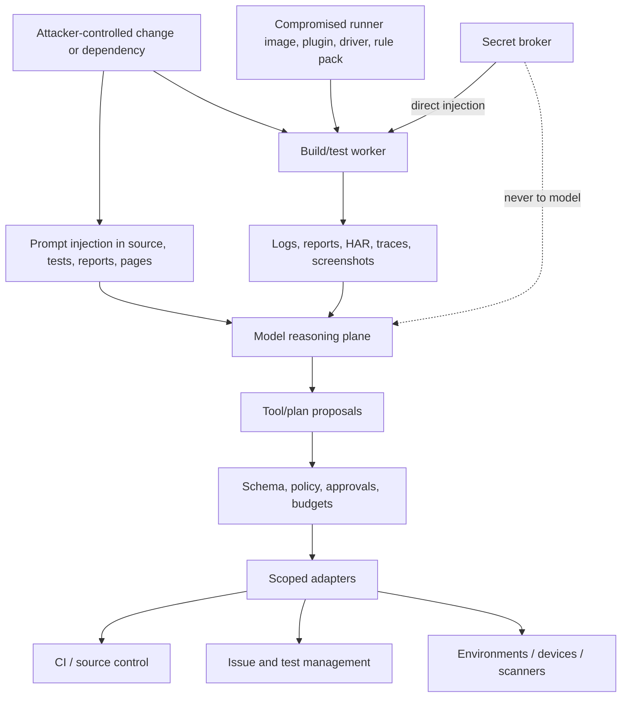
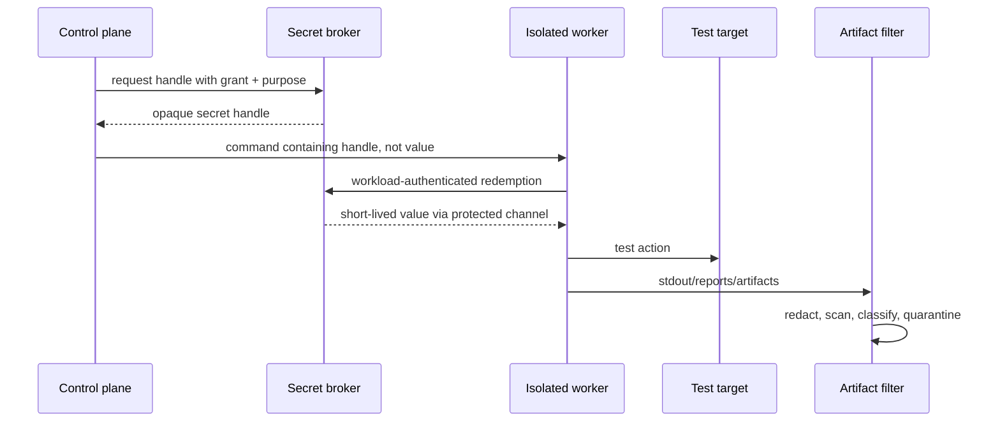
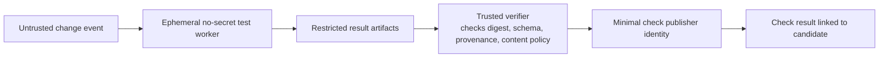
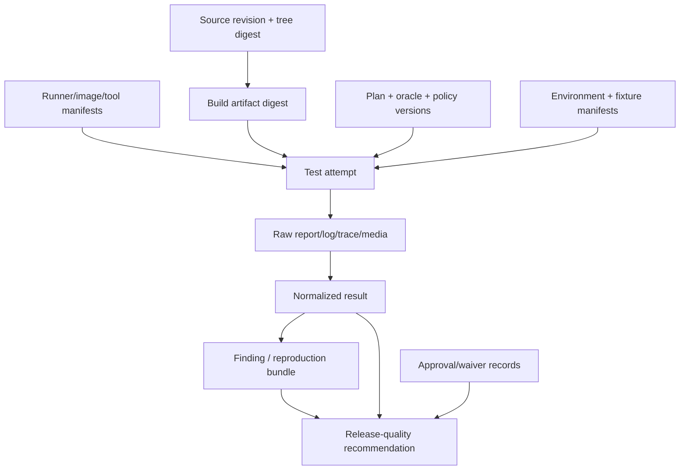

# Security, Identity, Integrations, and Provenance

> Parent: [Test and Quality Engineering Agent](README.md)  
> Evidence: [research packet](../../research/packets/test-quality-engineering-agent-blueprint.md)  
> Last reviewed: 2026-08-31

## Security position

Quality systems execute attacker-controlled repositories, dependency manifests, build logic, test code, web pages, mobile apps, APIs, reports, logs, and artifacts. They also connect to high-value CI, issue, test-management, artifact, device, and environment systems.

The correct baseline is:

> Treat all test content as untrusted data, keep the model unprivileged, grant each adapter a short-lived task-specific identity, and make evidence lineage verifiable without assuming that provenance proves correctness.

## Threat model



### Protected assets

- repository integrity, branch protections, checks, and release decisions;
- CI identities, runner fleet, caches, and artifact stores;
- environment and device control planes;
- test accounts, secrets, certificates, signing keys, and production-read credentials;
- customer, production-derived, security-finding, and regulated data;
- defect and test-management integrity;
- campaign ledger, recommendation, waiver, and provenance records;
- long-term memory and retrieval indexes.

### Representative attacks

| Attack | Example | Primary controls |
| --- | --- | --- |
| Goal hijack/prompt injection | source comment or web page tells model to ignore policy | trust labels, structured excerpts, fixed authority, adapter validation |
| Tool misuse | model requests shell/network/issue write outside plan | capability allowlist, typed schemas, short-lived grants, approvals |
| Privilege theft | untrusted test reads inherited CI token | no privileged credentials in untrusted worker; direct scoped injection |
| CI “pwn request” | privileged workflow checks out fork code | event separation, read-only token, isolated ephemeral runner, trusted publisher |
| Supply-chain compromise | malicious browser driver, Appium plugin, scanner add-on, package | pin/verify sources and digests, inventory, sandbox, upgrade gate |
| Cache poisoning | untrusted build writes executable used by trusted job | separate trust-domain caches, content keys, read-only promotion |
| Artifact exfiltration | HAR/video/report contains token or customer data | redaction, quarantine, ACL, shortest retention, secret scanning |
| Evidence forgery | runner publishes result for another digest | workload identity, signed receipt, candidate/environment binding, reconciliation |
| Memory poisoning | issue/log text admitted as durable “known fact” | reviewed typed admission, provenance, TTL, revocation, no authority in memory |
| External-write amplification | retries create hundreds of defects | deterministic idempotency, receipts, rate-limit backoff, reconciliation |
| Human trust exploitation | fluent model summary hides omissions | machine recommendation contract, direct artifact citations, explicit unknowns |
| Cascading failure | agent retries load/security probes during outage | circuit breakers, incident mode, stop controls, approval expiry |

## Identity architecture

### Separate identities by trust and effect

| Identity | Minimum permissions | Prohibited permissions |
| --- | --- | --- |
| Intake reader | read candidate metadata and policy | repository write, issue write, environment mutation |
| Untrusted build/test worker | read immutable source; write own overlay/artifacts; reach approved mirrors/test targets | CI admin, source write, production secret, broad cloud/device control |
| Environment broker | create/delete named test resources within tenant quota | repository/issue/release permissions |
| Artifact writer | append objects to campaign namespace | overwrite completed artifact, change recommendation |
| Evidence reconciler | read ledger/artifacts; create recommendation | run arbitrary code, deploy, waive policy |
| CI/check publisher | update one campaign/check scope | execute candidate, merge, administer repo |
| Defect/test-management adapter | create/update approved project fields | arbitrary project administration or status transition |
| Production-read observer | time-bound read of allowlisted telemetry | mutation, secret listing, customer-data export |
| Deployment identity | not held by quality system | all promotion authority remains outside quality role |

Use workload identity or short-lived credentials where possible. Bind a grant to campaign, job, capability, target, method, resource, data class, expiry, and maximum use. Revoke on cancellation, policy change, or incident.

### Human versus service identity

Do not run the agent under a broad human account. Preserve:

- requesting human/service identity;
- accountable approver and scope;
- quality service identity;
- runner workload identity;
- adapter identity;
- external system actor/receipt.

This chain prevents a generated defect or check from looking like an unaudited human assertion.

## Secret handling



### Secret rules

- Never include secret values in model context, plan JSON, command text, issue body, memory, trace attributes, or recommendation.
- Strip inherited environment variables; inject only requested handles after policy validation.
- Prefer single-purpose test credentials, test tenants, and revocable short TTLs.
- Prevent fork/untrusted-change jobs from receiving privileged repository or deployment tokens.
- Restrict credential audience and target; do not pass one service token through to another service.
- Redact known values and structural patterns, but assume redaction can miss transformed/encoded secrets.
- Quarantine suspect artifacts and rotate credentials when exposure is plausible.
- Audit request, grant, redemption, expiry, and revocation without logging the value.

## Prompt injection and content handling

### Untrusted instruction surfaces

- repository files, comments, test names, fixtures, snapshots, dependency metadata;
- build output, stack traces, test reports, terminal escape/control sequences;
- browser DOM, accessibility tree, screenshots/OCR, downloads, HAR/network payloads;
- API responses, error messages, OpenAPI descriptions, contract/provider-state text;
- mobile UI hierarchy, notifications, clipboard, device logs;
- issue descriptions/comments, test cases, CI annotations, artifact filenames;
- retrieved defect history and long-term memory.

### Context transformation pipeline

```text
raw artifact
  -> content-type and size validation
  -> malware/archive-bomb/control-character handling
  -> secret/PII classification and redaction
  -> parser in a low-privilege sandbox
  -> structured fields plus quoted, length-limited excerpts
  -> provenance and trust labels
  -> context compiler
```

Model instructions state that untrusted content is evidence only. More importantly, the control plane enforces this structurally: model output still passes schemas, capability and target allowlists, approval checks, and budgets.

### Indirect injection response

If suspicious content attempts to request tools, secrets, memory writes, policy changes, or external publication:

1. preserve it as a restricted artifact;
2. prevent it from changing authority or plan state;
3. reduce or terminate model processing if safe parsing is uncertain;
4. flag the campaign security event;
5. review whether credentials/artifacts were exposed;
6. invalidate poisoned checkpoints or memory projections;
7. continue deterministic tests if their isolation remains sound.

## Untrusted CI boundary

Privileged workflow events must not execute untrusted pull-request code. A safe pattern is:



Controls:

- use a read-only token or no repository token in the execution job;
- do not use a privileged trigger to check out and run fork code;
- use ephemeral self-hosted runners for untrusted repositories or equivalent isolation;
- separate caches by trust domain and avoid restoring untrusted writable caches into privileged jobs;
- treat artifacts as untrusted even when produced by CI;
- make the trusted publisher parse a narrow signed/attested result schema rather than execute uploaded content;
- restrict publisher permission to one check/status scope;
- bind the status to the exact candidate digest.

## Supply-chain controls

### Inventory

Track:

- runner VM/container images and base layers;
- compilers, runtimes, package managers, test frameworks, reporters, coverage/mutation/fuzz tools;
- browser binaries, drivers, Appium drivers/plugins, device images, emulators/simulators;
- security scanner add-ons/rule packs, accessibility engines/rules, load generators;
- fixture images, service stubs, contract brokers, report parsers, artifact processors;
- model, provider API/SDK, prompt bundle, tool schemas, policy, and context compiler.

### Controls by lifecycle

| Lifecycle | Controls |
| --- | --- |
| Source | approved registry/repository, owner, license/security review as required |
| Resolve | lockfile/version, immutable digest, dependency graph/SBOM where appropriate |
| Build | isolated build, provenance, reproducible controls where practical |
| Admit | signature/attestation verification, vulnerability/policy scan, capability tests |
| Execute | least privilege, read-only mount, egress and resource limits |
| Observe | version/digest in every attempt and trace |
| Upgrade | replay, compatibility, security, shadow, canary, rollback gate |
| Revoke | denylist/quarantine, stop new work, identify affected campaigns/recommendations |

Artifact attestation answers provenance questions. It does not establish that a runner is safe or that a test result is semantically correct. A consumer policy must verify and interpret it.

## Artifact provenance graph



For each edge retain producer identity, timestamp, input/output digest, schema/tool version, and completeness. A model summary is a derived artifact and must cite the graph; it is not the graph.

## Third-party integration architecture

### Adapter pattern

```mermaid
sequenceDiagram
    participant L as Campaign ledger
    participant O as Outbox
    participant A as Integration adapter
    participant X as External system
    participant R as Reconciler

    L->>O: transactionally enqueue typed operation
    O->>A: operation + idempotency key
    A->>X: bounded API call
    alt success
        X-->>A: external ID/version/receipt
        A-->>R: publication succeeded
    else rate limit/transient
        X-->>A: 429/5xx + retry hint
        A-->>O: retry after bounded backoff
    else permanent/schema/auth
        A-->>R: publication failed + classified error
    end
    R->>L: append receipt/result; never change test outcome
```

### Common contract

```yaml
schema_name: quality.external_operation
schema_version: 1.0.0
operation_id: extop_01J...
idempotency_key: "github-check:repo-42:sha-4b9:quality-v4"
campaign_id: qcamp_01J...
adapter: github-checks.v3
action: upsert_quality_check
target:
  repository_id: repo-42
  candidate_digest: sha256:4b9...
payload:
  recommendation_id: qrec_01J...
  title: "Quality evidence: do not recommend"
  summary_artifact: artifact://sha256/ab2...
authorization_grant: grant_01J...
retry:
  max_attempts: 5
  deadline: "2026-08-31T13:00:00Z"
expected_receipt:
  fields: [external_id, version, updated_at]
```

### CI and check systems

Keep separate:

- runner exit/outcome;
- report parsing;
- artifact upload;
- quality reconciliation;
- check/status publication;
- branch/release policy decision.

GitLab’s JUnit UI report, for example, does not itself set job success. The script exit and authoritative normalized result remain separate. GitHub check publication is an external presentation, not a new test execution.

### Issue trackers

- Create a draft or finding before a confirmed defect when policy requires triage.
- Use fingerprint/version and project/component scope as an idempotency/dedupe key.
- Do not copy raw sensitive logs into an issue; link an ACL-protected artifact.
- Map severity, priority, owner, and workflow states through reviewed configuration.
- Record issue version/ETag where supported and handle concurrent edits.
- Never close, waive, or reassign a human-owned defect solely from model inference.

### Test-management systems

- Preserve the internal stable test ID and map it to external case/run/result IDs.
- Use bulk endpoints where supported and within documented limits.
- Handle `429` with server retry guidance and a campaign deadline.
- Treat partial batch acceptance explicitly; reconcile each item.
- Do not create a new run on every retry; identify one campaign and attempt history.
- Keep external case text untrusted and do not allow it to override policy.

### Artifact systems

- distinguish report artifacts from generic paths when a platform requires both;
- record platform retention, expiry, and deletion constraints;
- verify size, digest, completeness, and ACL after upload;
- avoid relying on short-lived CI storage as the only release evidence store;
- make destructive delete an explicit authorized operation with an audit receipt.

## Idempotency and reconciliation

External APIs may time out after committing. Retrying without a stable identity creates duplicates.

Derive idempotency keys from the semantic operation, not a request attempt:

```text
hash(adapter, action, external_scope, candidate_digest,
     campaign_id, recommendation_or_finding_version)
```

On ambiguity:

1. query by idempotency marker/external key if supported;
2. compare expected candidate and evidence version;
3. record the discovered receipt;
4. retry only when non-commit is established or the API is idempotent;
5. route unresolved ambiguity to reconciliation/dead letter.

## Data handling and retention

| Artifact/data | Default classification | Default handling |
| --- | --- | --- |
| Source/build logs | internal/untrusted | scan, redact, bounded retention |
| Test report | internal; may contain payloads | structured parse, raw restricted artifact |
| Screenshot/video/DOM/accessibility tree | potentially personal/confidential | minimum capture, access-controlled, short TTL |
| HAR/network/body | sensitive by default | sanitized capture; restricted raw only when approved |
| Device logs/crash dumps | sensitive | symbolization in controlled service; restrict raw dump |
| Security finding/exploit input | restricted security | need-to-know ACL, no broad issue copy |
| Production telemetry sample | production-sensitive | minimize, pseudonymize/redact, approval and purpose binding |
| Recommendation | internal release record | retain with evidence digests; avoid raw sensitive payloads |
| Long-term memory | conditionally trusted | reviewed admission, scope, TTL, revocation |

## Security stop conditions

Stop affected work and alert when:

- candidate or generated code escapes the sandbox or accesses a forbidden target;
- a privileged secret appears in an untrusted worker or artifact;
- target identity, route, method, load, scan, or data scope differs from approval;
- a dependency/runner/plugin/image is revoked or provenance verification fails;
- the model repeatedly proposes forbidden actions after hostile content exposure;
- external writes exceed expected volume or idempotency guarantees fail;
- memory admission or retrieval crosses tenant/repository ACL;
- evidence ledger/artifact digests disagree;
- cleanup fails for a sensitive environment or device.

Continue unaffected deterministic work only after containment confirms isolation.

## Security review checklist

- [ ] Is untrusted code separated from privileged workflow events and tokens?
- [ ] Does each component use a distinct least-privilege identity and short-lived grant?
- [ ] Can the model ever see, request by value, or exfiltrate a secret?
- [ ] Are repository, page, API, report, issue, test-management, and memory contents always untrusted data?
- [ ] Are shell, browser, device, scan, load, issue, and production-read actions typed and target-bounded?
- [ ] Are runner images, dependencies, drivers, plugins, rule packs, and schemas inventoried and pinned?
- [ ] Is provenance verified where it drives a trust decision without being misrepresented as correctness?
- [ ] Are external writes idempotent, rate-limited, reconciled, and separately authorized?
- [ ] Are sensitive artifacts minimized, redacted, quarantined, access-controlled, and deleted on schedule?
- [ ] Can incident mode revoke grants, stop active work, freeze external writes/memory, and identify affected recommendations?

## Next guides

- Qualify each third-party boundary: [Adapter qualification and conformance](10-adapter-qualification-and-conformance.md)
- Operate and evaluate the secured service: [Reliability, observability, evaluation, and operations](08-reliability-observability-evaluation-and-operations.md)
- Build the controls in order: [Build roadmap and reference contracts](09-build-roadmap-and-reference-contracts.md)
- Revisit authority boundaries: [Mission, boundaries, and reference architecture](01-mission-boundaries-and-reference-architecture.md)
