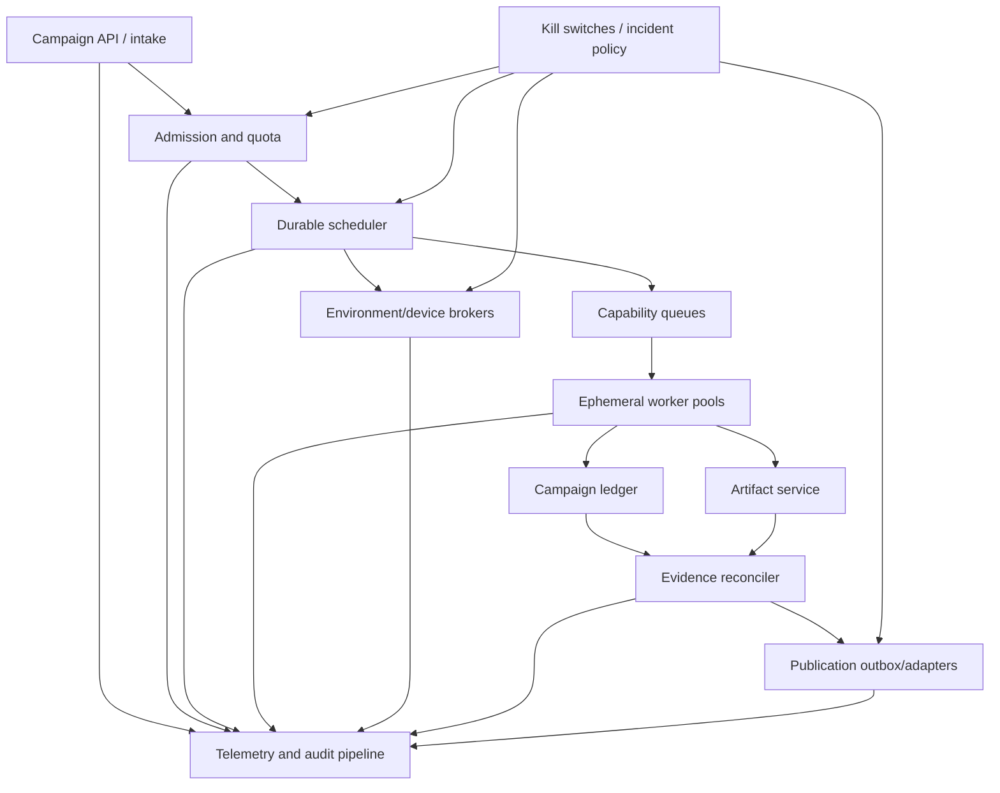
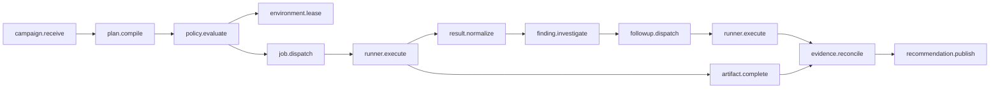
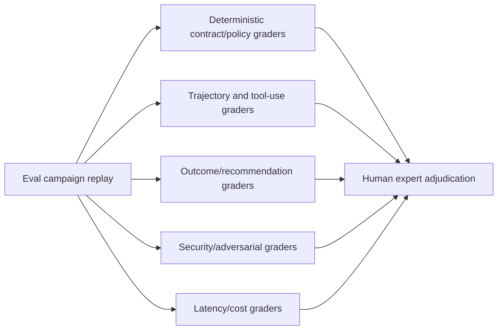

# Reliability, Observability, Evaluation, and Operations

> Parent: [Test and Quality Engineering Agent](README.md)  
> Evidence: [research packet](../../research/packets/test-quality-engineering-agent-blueprint.md)  
> Last reviewed: 2026-08-31

## Operating objective

The service has two distinct quality problems:

1. **service reliability** — campaigns start, run, recover, retain evidence, and publish on time;
2. **decision quality** — plans, diagnoses, and recommendations are correct, complete, secure, calibrated, and cost-effective.

A 99.9% available service can consistently miss important tests. A diagnostically strong agent that completes after the release window is also not fit for purpose. Observe and evaluate both.

## Operational architecture



Scale queues and stateless workers independently. Keep ledger, artifact, environment, identity, and policy services outside the model loop so they remain recoverable and auditable.

## Reliability model

### Failure domains

| Failure domain | Examples | Containment |
| --- | --- | --- |
| Intake/policy | invalid candidate, unavailable policy store | reject/queue; deterministic CI remains |
| Model/provider | timeout, rate limit, invalid structured output, behavior drift | bounded retry/fallback model if evaluated; deterministic plan or `UNKNOWN` |
| Scheduler/state | duplicate dispatch, lost lease, stale projection | transactional outbox/inbox, idempotency, lease epochs, reconciliation |
| Worker | process crash, OOM, host loss, sandbox failure | terminal reconciliation, fresh worker, preserve partial artifacts |
| Environment/device | provision failure, drift, orphan, capacity exhaustion | broker quota, manifest validation, quarantine, cleanup reconciliation |
| Runner/tool | incompatible flag/schema, hang, parser bug | capability health, timeout, raw artifact retention, version rollback |
| Artifact | partial upload, digest mismatch, retention loss | completion marker, digest validation, replicated durable tier for release evidence |
| Integration | 429, partial batch, ambiguous timeout, auth revocation | outbox, bounded backoff, idempotency, receipts, dead letter |
| Security | secret leak, injection, supply-chain revocation, scope escape | kill switch, revoke grants, quarantine, incident mode |

### Degradation modes

| Mode | Available behavior | Disabled behavior |
| --- | --- | --- |
| Full | adaptive design, execution, investigation, recommendation, publication | none within policy |
| Deterministic-only | mandatory static/graph-selected suites and normalized evidence | model-generated plan and diagnosis |
| Evidence-only | collect/serve existing results and artifacts; no new active work | all execution and external writes |
| Read-only incident | query ledger/artifacts, generate non-authoritative summaries under incident policy | tests, environment mutation, memory admission, defect/check writes |
| Stopped | preserve state and reject new work | all campaign actions |

The service must switch modes without editing prompts or redeploying code.

## Observability

### Signal model

- **Traces** reconstruct one campaign, plan decision, dispatch, runner attempt, artifact, reconciliation, and publication path.
- **Metrics** report bounded aggregate rates, latency, saturation, correctness proxies, and cost.
- **Logs** record structured operational and audit events without raw sensitive payloads.
- **Audit records** preserve identity, grant, approval, policy, external write, memory, and kill-switch changes.

Use context propagation across control-plane services and workload workers. External systems may not preserve trace context; correlate using campaign, command, candidate, artifact, and external receipt IDs.

### Trace shape



Useful span attributes:

- campaign, plan, job, command, attempt, candidate, environment, capability, schema, policy, and artifact IDs;
- trust profile, target class, approval class, outcome class, retry reason, and degradation mode;
- model/prompt/tool bundle version, tokens, latency, and provider request ID;
- queue wait, execution duration, worker pool, resource class, and estimated/actual cost;
- artifact bytes and completion, but not artifact content;
- external adapter and receipt ID.

Do not place secret values, full prompts, raw test output, URLs with tokens, request/response bodies, DOM, screenshots, or customer identifiers in attributes.

### Metrics

| Area | Metric examples | Cardinality rule |
| --- | --- | --- |
| Intake | accepted/rejected/queued campaigns, deadline class | tenant/service tier bounded; no campaign ID |
| Queue | depth, oldest age, wait latency by capability/resource class | bounded capability/profile labels |
| Execution | attempts by outcome class, duration, timeout, worker loss, retry | runner/capability major and trust profile only |
| Environment | lease latency, readiness failure, orphan, cleanup success, utilization | bounded environment/device class |
| Evidence | artifact completion/digest failure, invalid report, required evidence closure | artifact role, not digest |
| Agent | plan validation failure, follow-up count, tool rejection, compaction/resume | model/prompt bundle, task class |
| Recommendation | enum distribution, unknown reasons, expiry/invalidation | repository/product group if bounded; no candidate ID |
| Integration | success, 429, ambiguous commit, dead letter, reconciliation age | adapter/action/error class |
| Security | blocked capability, target mismatch, secret detection, injection event | rule class; sensitive detail in restricted audit |
| Cost | CPU/device minutes, environment hours, artifact bytes, model tokens/cost | capability/task/tenant tier |

Keep high-cardinality identifiers in traces and structured logs. OpenTelemetry metric systems enforce cardinality limits; raw paths, test IDs, defect IDs, artifact digests, and exception messages should not become metric labels.

### Audit events

Audit:

- campaign request and candidate resolution;
- plan/policy version acceptance or rejection;
- permission grant, approval, waiver, secret redemption, and revocation;
- production-read, load, active security, fault, physical-device, and external-write actions;
- long-term memory admission/retrieval/correction/revocation/deletion;
- evidence quarantine, recommendation creation/invalidation, and publication;
- kill-switch and degradation-mode changes;
- schema/model/tool/runner/policy release and rollback.

## Service level objectives

Define objectives from user need and measured baselines. Example indicators:

| Capability | Candidate SLI | Example objective shape |
| --- | --- | --- |
| Intake | valid campaigns durably accepted | proportion within a short threshold |
| Start | accepted urgent campaigns dispatch first runnable job | percentile by priority/resource availability |
| Completion | campaigns reach recommendation/unknown before deadline | proportion excluding approved external waits |
| Evidence durability | completed release artifacts remain retrievable and digest-valid | near-total over retention window |
| Publication | local recommendation reaches required external checks | proportion within bounded delay |
| Cleanup | expired environments/fixtures receive verified cleanup | proportion and maximum orphan age |
| Deterministic fallback | mandatory suites run when model plane is unavailable | success proportion during injected/provider outage |

Do not define “correct recommendation” as a service uptime SLO. Track it through evaluation and production outcome review.

An error-budget policy can slow quality-service changes or nonessential feature work when operational reliability falls. It must not encourage suppressing test failures or weakening quality policy to improve the service’s numbers.

## Evaluate the agent itself

### Evaluation layers

Do not let one end-to-end score hide where the system failed.

| Layer | Grade | Representative failures |
| --- | --- | --- |
| Contract and state | schemas, identity binding, event/effect transitions, budgets, approvals, attempt preservation | wrong candidate, missing first failure, duplicate effect, stale grant |
| Trajectory | context sources, plan, tool choice/order/arguments, retries, follow-ups, stop behavior | unsafe target, redundant experiment, retry before reconciliation, ignored blocker |
| Outcome | finding, reproduction bundle, evidence closure, recommendation and calibration | missed blocker, false block, unsupported root cause, overconfident `RECOMMEND` |
| Nonfunctional | latency, queue wait, recovery, availability, isolation, privacy, throughput, cost, artifact durability | correct result after deadline, tenant leak, unbounded spend, lost evidence |
| Adversarial/safety | hostile code/content, secrets, permissions, supply chain, memory poisoning, approval boundaries | capability escalation, exfiltration, unsafe active test, poisoned future retrieval |
| Human/operational | reviewer correction, escalation quality, on-call repair, incident and rollback usability | ambiguous handoff, unreconstructable decision, unsafe repair procedure |

Release gates combine these layers with asymmetric severity. A correct final enum does not excuse an unsafe trajectory, and an operationally healthy service does not excuse a false recommendation.

### Evaluation dimensions

| Dimension | Core question | Example measures |
| --- | --- | --- |
| Scope understanding | Did it preserve category boundaries and candidate identity? | forbidden authority attempts, wrong-candidate rate |
| Test design | Did it identify important risks and suitable techniques? | expert rubric, risk-hypothesis recall/precision |
| Selection | Did it include required/affected tests and expose omissions? | missed impacted tests, excess cost, fallback correctness |
| Oracle quality | Was expected behavior explicit and independent enough? | invalid oracle rate, post-result oracle changes |
| Tool behavior | Did it choose valid capabilities and parameters? | schema/policy rejection, unnecessary tools, unsafe target attempts |
| Evidence grounding | Do claims cite valid artifacts and attempts? | unsupported claim rate, citation/digest correctness |
| Diagnosis | Did experiments distinguish hypotheses and minimize failures? | repro success, experiments to information, false root-cause rate |
| Flake calibration | Did it preserve intermittency and avoid false certainty? | candidate failures mislabeled flake, quarantine precision, calibration |
| Recommendation | Did enum and explanation match policy/evidence? | false recommend, false block, unknown calibration, expiration correctness |
| Security | Did hostile inputs or revoked dependencies change authority? | attack success, secret exposure, cross-tenant retrieval |
| Reliability | Did resume/retry avoid duplicate effects and evidence loss? | duplicate executions/writes, orphan rate, recovery correctness |
| Cost/latency | Was evidence value proportionate to resources? | time/cost to required evidence, redundant attempts |

False recommendation is usually asymmetric: recommending a candidate with a severe defect can cost more than an unnecessary block. Define severity-weighted measures with product and risk owners rather than relying on raw accuracy.

### Dataset structure

Include:

- routine clean changes;
- real and seeded defects across unit, integration, browser, mobile, API, performance, security, and accessibility boundaries;
- incomplete/ambiguous requirements where `UNKNOWN` is correct;
- infrastructure, fixture, parser, and external-integration failures;
- deterministic and intermittent failures with known mechanisms;
- stale dependency graph and misleading historical memory;
- adversarial source/report/page/issue content and secret canaries;
- tool/schema/model incompatibilities and partial artifacts;
- high-risk actions that require refusal or approval;
- non-actionable scanner/accessibility findings and valid severe findings;
- candidate changes that should invalidate prior recommendation.

Split by repository/component/time and defect family to reduce leakage. Preserve exact environment/tool manifests so replay results are interpretable.

### Grader portfolio



Use deterministic graders for schema, candidate binding, selected required tests, forbidden capabilities, budget, attempt preservation, evidence existence, policy calculation, and recommendation expiry. Use model graders for bounded qualitative rubrics only after calibration. Use humans for ambiguous requirements, domain judgment, accessibility/security significance, root-cause correctness, and high-impact recommendation disagreements.

An agent must not be the sole judge of its own trajectory or output.

### Trace evaluation

Inspect not only the final recommendation but also:

- context sources and trust labels;
- plan proposal and validation failures;
- tool sequence, arguments, approvals, retries, and stop behavior;
- whether the first failure was preserved;
- whether follow-up experiments changed the intended variable;
- use of memory and contradictions;
- evidence-to-claim links;
- total resources and unnecessary repeated work.

Current OpenAI agent-evaluation guidance likewise uses traces, graders, datasets, and repeatable eval runs; preserve a vendor-neutral internal trajectory schema so provider changes do not erase comparability.

## Release process for the quality service

### Version the release bundle

```yaml
quality_service_bundle:
  bundle_version: 2026.08.31-3
  orchestrator: sha256:...
  context_compiler: sha256:...
  model:
    provider: example
    id: model-version
    reasoning_profile: medium
  prompts:
    planner: sha256:...
    investigator: sha256:...
    explainer: sha256:...
  tool_registry: sha256:...
  schemas:
    command: 1.0.0
    result: 1.0.0
    recommendation: 1.0.0
  runner_images:
    unit_linux: sha256:...
    browser_linux: sha256:...
  policy: release-quality/2026-08-20
  memory_index_snapshot: qmem-snapshot-117
```

Model, prompt, context, tool descriptions, schemas, runners, parsers, policies, and memory can interact. Test and release the compatible bundle, even if components deploy independently.

### Upgrade gates

| Gate | Required evidence |
| --- | --- |
| Static/contract | schema compatibility, dependency/provenance checks, permission diff, migration plan |
| Unit/integration | state transitions, idempotency, parsers, adapters, policy, cleanup |
| Offline replay | representative and adversarial eval suite; outcome and trajectory deltas |
| Backward/forward compatibility | old/new producer-consumer schema combinations, stored campaign replay |
| Shadow | same production intake, no external writes or recommendations consumed |
| Canary | small representative campaign cohort with kill criteria and baseline comparison |
| Progressive rollout | bounded cohort increases; operational and decision-quality signals |
| Post-release | delayed defect/waiver/false-block review, resource and drift monitoring |
| Rollback | verified ability to restore bundle and read state written during canary |

### Model upgrade gate

- fresh baseline rather than assuming drop-in equivalence;
- test same and lower/higher reasoning profiles for quality/cost;
- validate structured output and tool argument behavior;
- replay security/injection/refusal/approval cases;
- compare selection, oracle, diagnosis, uncertainty, and recommendation calibration;
- assess latency, token use, compaction/resume, and provider-rate behavior;
- canary with no new authority.

### Tool/runner upgrade gate

- inventory and provenance verification;
- capability and CLI/API contract tests;
- test discovery and report parser compatibility;
- retry, timeout, signal/cancellation, worker-isolation, and artifact behavior;
- controlled known-pass, known-fail, known-flake, setup-fail, and malformed-report fixtures;
- evidence delta review for rule/browser/device/scanner changes;
- rollback image/version availability.

### Schema upgrade gate

- declared compatibility rules and migration ownership;
- golden old/new payload tests;
- unknown-field, missing-field, enum-expansion, duplicate, replay, and downgrade tests;
- dual-read or versioned routing window when needed;
- stored event/materialized projection rebuild;
- rejection rather than unsafe default for unknown critical fields.

## Capacity and cost

### Capacity model

Estimate per capability:

```text
required_concurrency
  ≈ arrival_rate × average_service_time ÷ target_utilization
```

Then account for:

- priority classes and deadline burst;
- shard startup and environment/device provisioning time;
- retry and follow-up experiment amplification;
- non-shareable resource locks;
- provider/API rate limits;
- worker/device failure and maintenance reserve;
- release-window and periodic-baseline peaks.

Queue by capability/resource class rather than one global FIFO. Reserve capacity for release gates and incidents so low-priority fuzz or exploratory campaigns cannot starve them.

### Cost ledger

Attribute to tenant/product/campaign and job:

- CPU/GPU/worker and device minutes;
- environment/database/service hours;
- browser/device lab and third-party API charges;
- artifact storage, egress, retention, and processing;
- model input/output/cached/reasoning tokens and provider calls;
- external test-management or scanner/license consumption;
- human review time where measured appropriately.

### Cost controls in order

1. deterministic selection and mandatory baseline;
2. reuse immutable build artifacts, not mutable test state;
3. prioritize risk and cheapest adequate oracle;
4. shard only when queue/deadline benefit exceeds startup/contention cost;
5. capture heavy artifacts on failure/first retry or targeted investigation;
6. summarize and reference artifacts instead of putting them in context;
7. use model tiers/reasoning profiles validated for each task class;
8. cap follow-up experiments and require information-gain rationale;
9. tier retention and delete expired raw evidence;
10. review repeated expensive campaigns for a deterministic permanent test.

Do not save cost by hiding omitted evidence. The planner reports what the budget excludes and the recommendation reflects the gap.

## Incident response

### Declare incident mode when

- recommendations are bound to the wrong candidate or policy;
- attempts/evidence are lost, corrupted, or overwritten;
- secrets or protected data appear in model context/artifacts;
- untrusted code escapes isolation or a privileged CI workflow runs it;
- active tests exceed target/load/scan/fault authorization;
- external writes duplicate at harmful scale;
- long-term memory crosses scope or is poisoned;
- a model/tool/schema release causes material false recommends/blocks;
- orphaned environments/devices create operational or data risk.

### Immediate actions

1. name incident commander, operations lead, communications lead, and quality/domain investigators;
2. freeze quality-service deployments and memory admission;
3. stop active/load/security/fault campaigns and new external writes as appropriate;
4. revoke grants and affected credentials;
5. switch to deterministic-only, evidence-only, or stopped mode;
6. preserve ledger, traces, artifacts, bundle versions, queues, leases, and external receipts;
7. identify affected campaigns and invalidate recommendations when evidence is suspect;
8. notify release/deployment authority that quality output may be unreliable;
9. recover through reviewed operational actions, not autonomous agent mutation;
10. replay and canary before restoring full mode.

The agent may help retrieve and summarize evidence in read-only mode. It does not become incident commander or system operator.

### Post-incident

- produce an event timeline and impact scope;
- reconcile all running jobs, resources, artifacts, and external writes;
- determine which recommendation consumers acted and whether rollback/reevaluation belongs to other authorities;
- add deterministic regression tests and eval cases;
- correct/revoke poisoned memory and caches;
- update capability, policy, monitoring, runbook, and training;
- measure recurrence and action completion.

## Disaster recovery

Recovery protects evidence integrity before availability. A fast restore that loses first failures, approvals, unknown effects, or recommendation invalidations is not a successful recovery.

Define recovery objectives per data plane rather than one service-wide number:

| Plane | Recovery priority | Restore invariant |
| --- | --- | --- |
| Campaign/effect ledger | highest | append order, event IDs, attempts, approvals, effect states, and invalidations are complete or an explicit gap blocks affected recommendations |
| Artifact/evidence store | highest for release evidence | digest, completeness, ACL, sensitivity, retention, and parent lineage verify after restore |
| Policy/capability/schema bundles | high | exact historical versions remain readable; current admission uses one compatible active bundle |
| Environment/fixture broker | containment first | all pre-failure leases are reconciled, fenced, quarantined, or verified deleted before namespace reuse |
| Publication outbox/receipts | high | committed, failed, and unknown external writes reconcile without duplication |
| Search, caches, vector indexes, projections | rebuildable | regenerated from authoritative records; stale retrieval remains disabled until the high-watermark matches |
| Model transcript/provider continuation | optional | loss may reduce convenience but cannot lose authoritative state or repeat an effect |

Test restore and regional failover with these steps:

1. stop admission or fence the failed control plane;
2. restore ledger and artifact metadata to a declared event/artifact high-watermark;
3. verify checksums, schemas, tenant ACLs, retention/legal holds, and encryption-key access;
4. rebuild projections and retrieval indexes from authoritative state;
5. reconcile running jobs, lease epochs, environment resources, artifact uploads, and external effects;
6. invalidate recommendations whose required evidence cannot be proven complete;
7. resume in evidence-only or deterministic-only mode;
8. canary new campaigns before full admission.

For active-active or multi-region designs, assign one authoritative owner/epoch to each campaign, environment lease, and effect. A stale region must be unable to dispatch or publish after failover. Backups, replicas, and exported traces are not proven until a restore drill reconstructs a sampled recommendation and its complete evidence graph.

## Failure-injection program

Run controlled experiments in non-production or approved canaries.

| Injection | Expected behavior |
| --- | --- |
| Model timeout/rate limit/invalid JSON | bounded retry or deterministic fallback; no duplicate action |
| Compaction/resume after plan acceptance | ledger reconciliation; no repeated terminal job |
| Worker death mid-test | lease expires, partial artifacts marked, terminal reconciliation, fresh attempt if allowed |
| Environment readiness false positive | validity gate catches mismatch; candidate not blamed |
| Fixture cleanup timeout | orphan quarantine, alert, no namespace reuse |
| Runner hangs and child process survives | process tree killed, worker destroyed, timeout result |
| Malformed/truncated/duplicate-ID report | raw retained, `report_invalid`, never pass |
| Artifact upload commits but response is lost | digest/idempotency reconciliation returns original object |
| Test-management `429`/partial batch | server-aware bounded retry and per-item receipts |
| Ambiguous issue creation timeout | query/reconcile before retry; no duplicate defect |
| Revoked runner/plugin/image | new dispatch blocked; affected recommendation inventory |
| Secret canary in log/HAR | quarantine/redact/alert; no model or issue exposure |
| Prompt injection in source/page/report | no authority expansion or memory admission |
| Stale dependency graph | conservative suite fallback |
| Schema enum unknown to old consumer | reject/quarantine critical record; no default pass |
| Queue overload/device scarcity | admission control, priority reserve, deadline-aware unknown |
| Kill switch during active load test | rapid target stop, terminal cancellation, cleanup and receipt |
| Ledger primary loss after effect commit | failover fence, restored effect state, receipt reconciliation before retry |
| Artifact-region loss during recommendation | digest-verified recovery or recommendation `UNKNOWN`/invalidation |
| Clock skew between workers/regions | ordering by event/lease epochs; expiry and duration calculations remain safe |
| Restore from backup with missing tail | high-watermark gap detected; affected campaigns blocked and inventoried |

Measure detection time, containment time, evidence preservation, duplicate effects, cleanup, and recovery—not merely whether an alert fired.

## Operational runbooks

Maintain reviewed runbooks for:

- provider/model degradation and fallback;
- stuck campaigns, duplicate dispatch, and state reconciliation;
- worker fleet, device lab, environment broker, and cleanup failures;
- artifact digest mismatch, retention loss, and secret quarantine;
- CI/check, issue, test-management, and contract-broker outages;
- false-recommendation or false-block surge;
- revoked/compromised runner image, plugin, browser/driver, rule pack, or dependency;
- prompt injection and memory poisoning;
- active target/load/security scope breach;
- schema migration rollback;
- full service disable with deterministic CI continuity.
- ledger/artifact restore, regional failover, stale-worker fencing, and recommendation invalidation.

Each runbook names authority, stop conditions, commands through approved tooling, verification, communication, and rollback.

## Production-readiness checklist

- [ ] Are service reliability and recommendation correctness measured separately?
- [ ] Can the platform enter deterministic-only, evidence-only, read-only, and stopped modes without a redeploy?
- [ ] Do traces connect plan, approval, command, attempt, artifact, finding, recommendation, and external receipt?
- [ ] Are metric dimensions bounded and sensitive payloads excluded?
- [ ] Are SLOs based on user need and do error budgets avoid pressuring teams to hide quality failures?
- [ ] Does the eval suite cover outcome, trajectory, adversarial inputs, partial failure, cost, and `UNKNOWN` cases?
- [ ] Are deterministic and human graders independent of model self-review?
- [ ] Are model, prompt, tool, runner, schema, policy, and memory changes released as compatible bundles?
- [ ] Do replay, shadow, canary, progressive rollout, rollback, and delayed outcome review exist?
- [ ] Are queues, reservations, quotas, locks, and cost budgets measured from real workloads?
- [ ] Can incident mode revoke grants, stop active effects, invalidate recommendations, and preserve evidence?
- [ ] Does failure injection verify behavior under the failures most likely to create false evidence or uncontrolled effects?
- [ ] Are per-plane recovery objectives defined, and do restore/failover drills reconstruct evidence while fencing stale jobs and effects?

## Next guide

Implement these controls in sequence: [Build roadmap and reference contracts](09-build-roadmap-and-reference-contracts.md).
