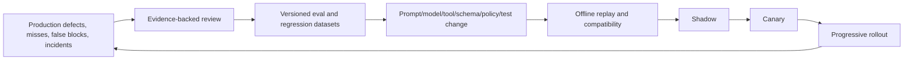

# Build Roadmap and Reference Contracts

> Parent: [Test and Quality Engineering Agent](README.md)  
> Evidence: [research packet](../../research/packets/test-quality-engineering-agent-blueprint.md)  
> Last reviewed: 2026-08-31

## Roadmap principle

Build the deterministic quality and evidence platform first. Add the smallest bounded reasoning loop second. Expand authority only after evaluation shows value and controls show that failures remain contained.


Do not skip a phase because a framework provides a similarly named feature. Framework state, tracing, approvals, or tool wrappers do not prove your candidate binding, isolation, evidence semantics, or release-policy separation.

## Phase 0: deterministic tooling is enough

### Build

- immutable candidate and build identity;
- registered test discovery and execution adapters;
- adapter qualification fixtures for known pass/fail/invalid/zero-test/cancel outcomes;
- typed command and normalized result schemas;
- isolated workspaces, environments, fixture namespaces, and cleanup receipts;
- deterministic mandatory suites and conservative test selection;
- outcome taxonomy that separates assertion, setup, infrastructure, parser, and policy failures;
- artifact store with digests, completeness, ACL, sensitivity, and retention;
- machine-readable policy and CI gate independent of any model;
- traces, metrics, logs, and audits for the deterministic path.

### Do not build yet

- adaptive model loop;
- long-term memory;
- automatic defect publication;
- active load/security/fault actions;
- production access;
- permanent generated tests;
- model-based pass/fail oracle.

### Phase 0 gate

- A known-pass, known-fail, setup-fail, infrastructure-fail, timeout, zero-test, malformed-report, and cancellation fixture all normalize correctly.
- The same immutable candidate/profile can be replayed from manifests.
- First failures and every retry remain queryable.
- Untrusted tests cannot access privileged tokens or escape the workspace/network boundary.
- Missing required evidence cannot produce a pass.
- Every active runner/parser pair passes the common and family-specific [adapter conformance suite](10-adapter-qualification-and-conformance.md).

If this phase solves the product need, stop. A deterministic platform is a successful outcome.

## Phase 1: first bounded loop

### Narrow use case

Choose one task where adaptive reasoning has measurable value, such as:

- design a risk-based test plan for one service/change class;
- choose from registered test capabilities and propose additions;
- select at most two follow-up experiments for a valid failure;
- summarize a reproduction bundle from normalized evidence.

### Loop

```text
1. load candidate, policy, capabilities, and current campaign projection
2. compile bounded context with untrusted evidence labels
3. request exactly one typed decision
4. validate schema, authority, target, budget, and plan invariants
5. execute ready deterministic jobs through registered adapters
6. append results and artifacts to the ledger
7. reconcile required evidence
8. allow at most N evidence-driven follow-ups
9. stop with a typed recommendation or UNKNOWN
```

### Reference pseudocode

```typescript
async function runCampaign(campaignId: string): Promise<void> {
  while (true) {
    const state = await ledger.reconcile(campaignId);

    if (state.isTerminal) return;
    if (state.budgets.exhausted) {
      await reconciler.createUnknown(state, "campaign_budget_exhausted");
      return;
    }

    const deterministic = await scheduler.dispatchReadyJobs(state);
    if (deterministic.dispatched > 0) continue;

    const closure = await reconciler.checkEvidence(state);
    if (closure.canRecommend) {
      await reconciler.createRecommendation(state, closure);
      return;
    }

    if (!closure.needsReasoning || state.followUps.remaining === 0) {
      await reconciler.createUnknown(state, closure.reason);
      return;
    }

    const context = await contextCompiler.forDecision(state, closure);
    const proposal = await model.proposeDecision(context);
    const decision = await policy.validateProposal(state, proposal);

    if (!decision.accepted) {
      await ledger.appendDecisionRejected(campaignId, decision.errors);
      if (!decision.retryable) {
        await reconciler.createUnknown(state, "invalid_agent_decision");
        return;
      }
      continue;
    }

    await ledger.appendPlanVersion(campaignId, decision.planDelta);
  }
}
```

The scheduler, reconciler, policy, and ledger are authoritative. The loop cannot execute model text directly.

### Phase 1 gate

- plan schema validity and unsafe-action rejection are deterministic;
- the agent never invents a capability or expands a target;
- plan steps, revisions, follow-ups, workers, time, tokens, and cost are hard-bounded;
- disabling the model returns to phase 0 behavior;
- offline evals show improvement over the deterministic baseline on the chosen use case.

## Phase 2: safe MVP

### Phase 2 additions

- plan DAG with dependencies and resource locks;
- generated tests/fixtures in an isolated writable overlay;
- secret broker with opaque handles and runner-side injection;
- deny-by-default network and target policies;
- explicit approvals for external writes and higher-effect test classes;
- prompt-injection/content transformation pipeline;
- immutable reproduction and recommendation bundles;
- advisory-only recommendation vocabulary;
- trusted publisher separated from untrusted execution;
- security and audit events plus kill switches.

### Scope ceiling

The safe MVP can:

- read an immutable candidate and approved requirements;
- create ephemeral test assets in its overlay;
- execute registered low-effect unit/integration/API/browser/emulator capabilities on ephemeral test targets;
- perform bounded evidence-driven follow-up experiments;
- draft or publish an approved check/finding through a scoped adapter;
- recommend without promotion authority.

It cannot:

- commit/merge code;
- deploy/promote/rollback;
- use broad production credentials;
- run production load, active security, or destructive fault tests;
- auto-admit long-term memory;
- silently quarantine or suppress a new failure.

### Phase 2 gate

- adversarial source, log, report, page, API, and issue content cannot change authority;
- secret canaries do not enter model context, artifacts after filtering, or external systems;
- generated tests cannot mutate the candidate or privileged cache;
- ambiguous external writes reconcile without duplication;
- recommendation always binds candidate, plan, policy, and evidence digests;
- incident kill switches stop execution, external writes, and memory independently.

## Phase 3: reliable v1

### Phase 3 additions

- durable campaign workflow and append-only events;
- leases, heartbeats, epochs, transactional outbox/inbox, and reconciliation;
- resume after process/model compaction/provider interruption;
- attempt-aware retry by failure class;
- structured reproduction, minimization, flake assessment, dedupe, quarantine, and suppression workflows;
- multi-dimensional coverage and evidence-closure matrix;
- external CI/check, issue, test-management, contract-broker, and artifact adapters;
- versioned adapter capability manifests, conformance reports, canaries, health states, and revocation;
- explicit degraded modes and deterministic fallback;
- bounded reviewed long-term memory only if eval evidence justifies it.

### Phase 3 gate

- duplicate events, callbacks, dispatches, artifact responses, and external writes are safe;
- late workers, expired leases, orphan fixtures, partial artifacts, and schema mismatch reconcile correctly;
- compaction/resume never repeats a terminal effect;
- retry and quarantine never hide first-attempt failure;
- external publication outage does not change the authoritative result;
- old recommendations invalidate on candidate, policy, toolchain, evidence, or waiver changes;
- reviewed reproduction bundle succeeds or states exact fidelity limitations.

## Phase 4: production readiness

### Phase 4 additions

- production SLOs and error-budget policy for the quality service;
- distributed tracing, bounded-cardinality metrics, restricted logs, and audit retention;
- representative, adversarial, trajectory, outcome, security, and cost evals;
- human/domain adjudication and delayed production-outcome review;
- versioned service release bundle;
- replay, compatibility, shadow, canary, progressive rollout, and rollback;
- on-call ownership, runbooks, incident modes, recommendation invalidation, and customer/release communications;
- failure injection for evidence-corrupting and effect-amplifying faults;
- privacy/security review and data-retention deletion verification.

### Phase 4 gate

- recommendation false-positive/false-negative trade-offs are measured by severity class;
- service uptime and decision quality are separate dashboards and review cadences;
- all critical paths have alerts tied to actionable runbooks;
- model/tool/schema/policy upgrades cannot bypass replay and canary;
- incident exercises demonstrate stop, revoke, preserve, invalidate, reconcile, and recover;
- deterministic CI continues during a model-plane outage.

## Phase 5: scale and resilience

### Add only when measured demand requires it

- capability-specific queues and worker pools;
- fair tenant quotas, release/incident reservations, and deadline-aware admission;
- sharding, platform/device matrices, fuzz/load campaign pools, and artifact tiers;
- regional placement or failover where evidence/data policy permits;
- capacity forecasts and cost attribution;
- selection/prioritization models with conservative fallback and drift monitoring;
- deduplicated immutable build artifacts and trusted caches separated by trust domain;
- load shedding and lower-priority campaign pause/cancel semantics.

### Phase 5 gate

- load tests show queue and deadline behavior at expected peak and failure reserve;
- one tenant, repository, plugin, device pool, target, or adapter cannot exhaust all capacity;
- retry/follow-up amplification is bounded during dependency outages;
- sharding does not corrupt isolation or flake attribution;
- evidence durability, cleanup, and external reconciliation meet objectives under partial failure;
- cost per useful evidence class is visible and regressions trigger review.

Do not introduce a distributed multi-agent organization to solve a queueing problem. Scale workers and deterministic orchestration first.

## Phase 6: continuous evolution

### Feedback loop



### Practice

- version every behavior bundle: model, prompts, context compiler, compaction policy, tool/capability registry, adapters, runner/parser images, schemas, policy, memory snapshot, and graders;
- promote minimal confirmed reproducers into durable tests through the coding path;
- convert repeated agent investigation into deterministic diagnostics or selection metadata;
- mine only controlled, reviewed failure material: missed defects, false recommends, false blocks, unknowns, waivers, quarantines, incidents, unsafe near misses, and operator corrections;
- minimize and de-identify mined cases, preserve provenance and affected bundle ranges, check train/eval leakage, and send them to a held-out eval set before changing behavior;
- refresh standards, browser/device matrices, rule packs, tool capabilities, and evidence policy;
- review long-term memory value, poison attempts, staleness, TTL, and deletion;
- remove unused tools, adapters, prompts, memory classes, and special cases;
- re-evaluate whether the model is still justified for each task.

### Phase 6 gate

- every material miss or unsafe action becomes a regression/eval case or documented non-automatable control;
- evaluation datasets have provenance, leakage controls, ownership, and refresh policy;
- drift and delayed production outcomes can invalidate a model/selector policy;
- each behavior-bundle change has an explicit hypothesis, target metrics, stop thresholds, shadow/canary comparison, and tested rollback;
- a mined failure cannot directly become long-term memory, a suppression, or a prompt rule without review and replay evidence;
- memory records are revalidated or expired on trigger;
- the system can simplify or retire agent behavior when deterministic tooling catches up.

## Reference contract set

Use separate schemas for separate facts.

| Schema | Immutable/versioned fields | Important invariant |
| --- | --- | --- |
| `quality.campaign_request` | candidate, policy, targets, budgets, requester | immutable candidate resolved before work |
| `quality.test_plan` | plan version, risks, jobs, omissions, fallbacks | new plan appends; no overwrite |
| `quality.test_identity` | stable ID, source, manifest digest, parameter identity | display-name changes do not merge or lose tests |
| `quality.oracle` | statement, inputs, pass and invalid conditions | cannot change after observation without new version |
| `quality.workspace_manifest` | tree/build/image/toolchain digests, sandbox | every attempt references exact manifest |
| `quality.environment_manifest` | profile and realized components, network, fidelity, lease | requested name cannot hide realized drift |
| `quality.fixture_manifest` | namespace, recipe/generator, data digest, seed, clock, lease | no shared or changed state is implied equivalent |
| `quality.job` | campaign, plan, dependencies, oracle, resources, budgets | scheduling state is separate from execution attempts |
| `quality.test_execution_command` | candidate, capability, selector, environment, limits, grant | accepted once per idempotency key |
| `quality.attempt` | command, attempt number, lease epoch, worker, timestamps | retries and late workers remain independently visible |
| `quality.test_execution_result` | terminal/outcome classes, manifests, artifacts | one authoritative terminal result per accepted attempt |
| `quality.finding` | observation, fingerprint, evidence, scope, state | dedupe links instances, never deletes them |
| `quality.defect` | finding links, external mappings/versions, owner, state | issue-tracker state cannot erase internal evidence |
| `quality.reproduction_bundle` | exact replay inputs and limitations | no live secrets; evidence digests verify |
| `quality.flake_assessment` | attempt matrix, varied factors, confidence, quarantine | pass-on-retry remains intermittent evidence |
| `quality.evidence_decision` | input event watermark, closure items, policy/bundle versions | model prose cannot select or rewrite evidence closure |
| `quality.release_recommendation` | candidate, plan, policy, evidence closure, expiry | advisory; promotion authority false |
| `quality.effect` | semantic operation ID, canonical intent, target/version, grant | one effect identity can have many delivery attempts |
| `quality.effect_attempt` | effect ID, delivery attempt, lease/fence, response | ambiguous outcomes reconcile before another commit |
| `quality.external_operation` | effect ID, target, action, payload ref | publication state does not change test result |
| `quality.compaction_receipt` | source watermark, context/checkpoint digests, preserved/omitted fields | context reduction cannot drop blockers or unresolved effects silently |
| `quality.memory_record` | scope, evidence, reviewer, TTL, trust, revocation | memory cannot grant authority |

The relationships are intentional:

```text
campaign -> plan version -> job -> command -> attempt -> result/artifacts
                                  oracle -----^          |
fixture/environment/workspace ----------------^          v
finding -> defect/reproduction -> evidence decision -> recommendation
effect -> effect attempt -> external receipt -----------> reconciliation
```

A `job` describes intended evidence. An `attempt` describes one execution under one lease epoch. An `effect` describes one semantic external change, while an `effect_attempt` describes one delivery. An evidence decision deterministically reconciles facts; a release recommendation communicates that decision without gaining promotion authority.

## Reference enums

```yaml
terminal_status:
  - completed
  - timed_out
  - cancelled
  - worker_lost
  - rejected

outcome_class:
  - pass
  - assertion_failure
  - crash
  - performance_failure
  - security_finding
  - accessibility_finding
  - setup_failure
  - infrastructure_failure
  - report_invalid
  - policy_blocked
  - unknown

evidence_closure:
  - PASS
  - FAIL
  - ACCEPTED_RISK
  - UNKNOWN

recommendation:
  - RECOMMEND
  - RECOMMEND_WITH_RISK
  - DO_NOT_RECOMMEND
  - UNKNOWN

effect_state:
  - proposed
  - authorized
  - committing
  - committed
  - failed
  - unknown
  - reconciled
  - cancelled
```

Unknown future enum values on a safety-critical field must not default to success.

## Minimum database invariants

Illustrative relational constraints:

```sql
-- Pseudocode: adapt to the chosen database.
UNIQUE (campaign_id, plan_version)
UNIQUE (command_id, attempt_number)
UNIQUE (adapter_id, idempotency_key)

CHECK (attempt_number >= 1)
CHECK (max_attempts >= attempt_number)
CHECK (recommendation IN
  ('RECOMMEND', 'RECOMMEND_WITH_RISK', 'DO_NOT_RECOMMEND', 'UNKNOWN'))

FOREIGN KEY (candidate_digest) REFERENCES campaign(candidate_digest)
FOREIGN KEY (environment_manifest_digest) REFERENCES artifact(digest)
FOREIGN KEY (evidence_bundle_digest) REFERENCES artifact(digest)
```

Also enforce in application/reconciliation logic:

- a recommendation references a terminal evidence-closure projection;
- required `FAIL` cannot map to `RECOMMEND` unless policy explicitly models an authorized waiver as `ACCEPTED_RISK`;
- required `UNKNOWN` cannot be silently omitted;
- publication and deployment receipts cannot be created by the recommendation writer;
- a plan cannot schedule a capability outside its accepted grant;
- a later incompatible event invalidates dependent projections and recommendation freshness.

## Approval policy template

```yaml
schema_name: quality.approval_policy
schema_version: 1.0.0
rules:
  - when:
      target_class: ephemeral_test
      effect: read_or_test_fixture_write
      data_class: synthetic
      capability_risk: low
    decision: allow_within_campaign_budget

  - when:
      effect: external_issue_or_check_write
      scope: approved_project
    decision: service_policy_grant

  - when:
      capability_type: [load, active_security, fault_injection]
    decision: require_target_owner_approval
    grant_must_include: [target, methods, maximum_load, time_window, stop_contact]

  - when:
      target_class: production
    decision: deny_unless_explicit_production_test_policy

  - when:
      effect: [merge, deploy, promote, rollback]
    decision: deny_outside_quality_agent_role
```

## Build-versus-buy decisions

| Component | Prefer existing product/library when | Own regardless |
| --- | --- | --- |
| CI/workflow engine | durable jobs, approvals, retries, queues already fit | quality state, authority boundary, result semantics |
| Test runners | ecosystem runner is mature | capability adapter, versions, outcome normalization |
| Browser/device farm | matrix and operations exceed local capacity | target/data policy, profiles, evidence manifests |
| Environment broker/Testcontainers | dependency lifecycle is supported | fidelity claims, leases, cleanup receipts, quotas |
| Contract broker/test management | team already uses it | internal stable IDs, idempotency, source of truth, receipts |
| Artifact store/attestation | retention, ACL, digest, signing supported | evidence lineage and verification policy |
| Agent framework/SDK | tool loop, tracing, state helpers reduce work | schemas, policy, approvals, isolation, idempotency, evals |
| Model provider eval platform | accelerates trace/dataset/grader workflows | vendor-neutral trajectories, golden cases, release decision |

The simplest reliable system often combines mature deterministic tools with a small custom quality control plane.

## Acceptance test matrix for the platform

| Scenario | Expected platform behavior |
| --- | --- |
| Clean immutable candidate | valid pass evidence and recommendation according to policy |
| Real seeded defect | preserved first failure, reproduction bundle, blocker recommendation |
| Broken fixture | setup failure, no candidate blame, bounded broker repair |
| Lost worker after artifact upload | reconciled artifact and terminal attempt without duplicate work |
| Zero tests due to wrong filter | discovery mismatch and invalid evidence, never pass |
| Pass on retry | intermittent classification with both attempts |
| Malformed JUnit/report | raw retained, report invalid, no inferred result |
| Stale selector graph | conservative baseline/full fallback |
| Prompt injection in source/report/page | no capability/authority change or memory write |
| Secret in HAR/log | quarantine/redact/alert; no model/external issue exposure |
| External API timeout after commit | receipt reconciliation, no duplicate check/defect/run |
| Model unavailable | deterministic mandatory suites continue; adaptive result unknown |
| Compaction/restart | checkpoint plus ledger resume, no terminal action repeated |
| Model/tool/schema bundle mismatch | command/result rejected and rollout halted |
| Active load/security request without grant | policy blocked before target connection |
| Recommendation consumed for different digest | consumer rejects as stale/mismatched |
| Incident kill switch | active effects stop, artifacts preserved, grants revoked, state reconciled |

## Final go-live checklist

### Mission and authority

- [ ] The quality agent is independent from candidate implementation and deployment promotion.
- [ ] Permanent test/product changes follow coding and review authority.
- [ ] Recommendation, release decision, and promotion receipt are separate records and identities.

### Contracts and execution

- [ ] Candidate, plan, oracle, workspace, environment, fixture, runner, attempt, artifact, finding, and recommendation are typed and versioned.
- [ ] Job, defect, evidence-decision, effect, effect-attempt, compaction-receipt, and external-receipt identities remain separate and reconstructible.
- [ ] Test discovery prevents unexpected zero-test success.
- [ ] Untrusted code runs isolated with no privileged tokens and deny-by-default egress.
- [ ] All retries, invalid attempts, cancellations, and publication failures remain visible.

### Evidence and quality

- [ ] Test selection has deterministic inputs, reasons, omissions, and conservative fallback.
- [ ] Coverage dimensions and residual risks are separate.
- [ ] Defects include replayable or best-known reproduction evidence and limitations.
- [ ] Flaky classification is attempt-based and quarantine is owned and expiring.
- [ ] `UNKNOWN` is accepted as a first-class safe outcome.

### Security and data

- [ ] Secrets bypass model context and are purpose-bound to runner identities.
- [ ] Prompt injection, hostile artifacts, supply chain, memory poisoning, and CI trust boundaries are tested.
- [ ] Load, security, fault, production, physical-device, and external-write actions have explicit authority.
- [ ] Provenance is verified where consumed and never represented as proof of correctness.
- [ ] Retention, redaction, quarantine, access, deletion, and legal hold are implemented by data class.

### Operations and evolution

- [ ] Service reliability and decision quality have separate measures.
- [ ] Traces and audits reconstruct actions without leaking payloads or exploding metric cardinality.
- [ ] Offline replay, shadow, canary, rollback, incident mode, and failure injection are exercised.
- [ ] Capacity, queues, quotas, reservations, cleanup, and cost are measured.
- [ ] Model, prompt, tool, runner, schema, policy, and memory changes pass bundle upgrade gates.
- [ ] Third-party adapters pass provider-specific conformance and can be degraded, revoked, or rolled back without losing evidence or repeating effects.
- [ ] The service can fall back to deterministic-only mode or be disabled cleanly.

## Smallest production-worthy endpoint

Start with one repository/service class, one immutable CI candidate type, a few registered deterministic runners, an ephemeral test environment, artifact digests, advisory recommendations, and one check publisher. Prohibit production targets, active tests, long-term memory, permanent writes, and deployment authority.

Only expand when evals and incident exercises demonstrate that the next capability improves useful evidence without weakening independence or containment.
