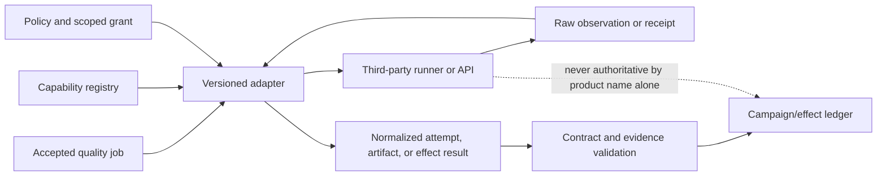
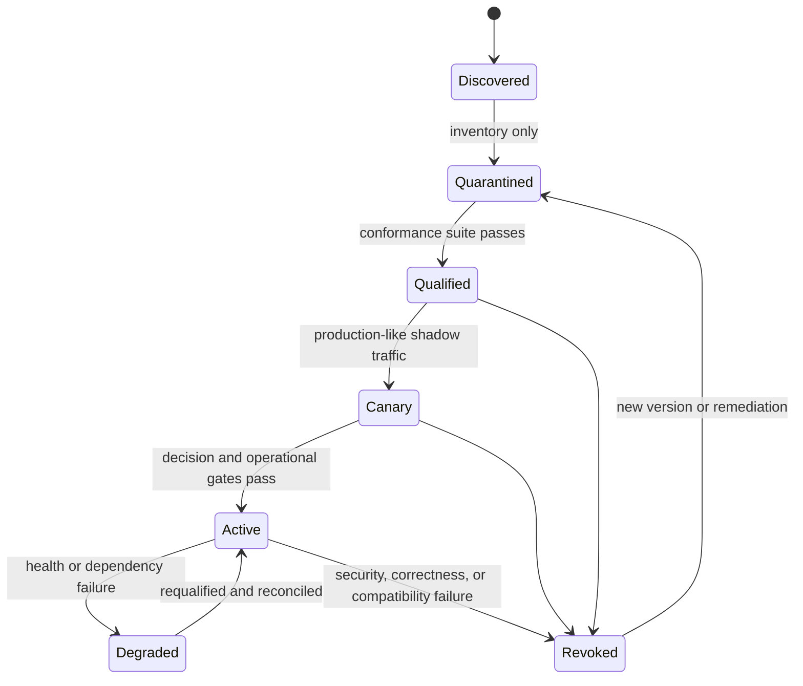

# Adapter Qualification and Conformance

> Parent: [Test and Quality Engineering Agent](README.md)  
> Evidence: [research packet](../../research/packets/test-quality-engineering-agent-blueprint.md)  
> Last reviewed: 2026-08-31

## Purpose

A typed adapter is not trustworthy merely because it wraps an official SDK or emits the expected JSON on a successful run. Test runners, CI systems, browsers, device farms, contract brokers, scanners, artifact stores, and issue trackers disagree about retries, cancellation, exit codes, report completeness, stable identities, and partial failure. Those differences can turn missing evidence into a pass, retry one semantic write twice, or attach a result to the wrong candidate.

Qualify each adapter against the quality platform's contracts before it can enter a campaign. Qualification establishes a bounded claim such as:

> `playwright-test.v1` can execute a pinned project/test selection in a Linux browser worker, preserve every retry, stop its process tree, and emit the platform's normalized attempt contract.

It does **not** establish that the tests are sufficient, the oracle is correct, or the candidate is safe to release.

## The adapter boundary



The adapter owns translation and normalization. The control plane still owns candidate binding, authorization, budgets, semantic effect identity, evidence closure, and recommendation policy.

## Qualify capabilities, not product names

One product can expose materially different capabilities. Record them separately instead of creating one broad `playwright`, `appium`, `jira`, or `zap` permission.

```yaml
schema_name: quality.capability_manifest
schema_version: 1.0.0
capability_id: browser.playwright.functional
adapter_release: playwright-adapter/4.3.1
upstream:
  product: playwright-test
  version: 1.x-pinned-in-lockfile
  package_digest: sha256:...
contract:
  command_schema: quality.browser_command/1.2.0
  result_schema: quality.test_execution_result/1.1.0
scope:
  target_classes: [ephemeral_test, isolated_preproduction]
  effects: [browser_session, fixture_write]
  data_classes: [synthetic, approved_test_account]
isolation:
  worker_profile: browser-linux-untrusted-v6
  network_profile: browser-test-egress-v4
limits:
  timeout_seconds_max: 1800
  workers_max: 4
  artifact_bytes_max: 2147483648
qualification:
  suite_release: adapter-conformance/3.2.0
  report_digest: sha256:...
  status: canary
  qualified_at: 2026-08-31T09:00:00Z
known_limits:
  - "browser context isolation does not isolate the host worker"
refresh_on:
  - upstream_minor_or_major_change
  - browser_binary_change
  - reporter_schema_change
owner: quality-platform-browser
```

Do not use a floating upstream version, browser channel, driver, device image, plugin, rule pack, action tag, container tag, or API behavior as the only identity. Resolve the actual version or digest into the attempt manifest.

## Identity chain

Each stage needs an independent, stable identity. Reusing a display name such as `test`, `main`, or `staging` is not enough.

| Object | Stable identity material | Why it must be separate |
| --- | --- | --- |
| Candidate | repository/source revision, tree and build digests | branch or pull-request names can move |
| Test | framework-neutral stable test ID, manifest digest, source class | runner display names can collide or be renamed |
| Oracle | oracle ID/version, statement, pass/fail/invalid rules, tolerance | expected behavior cannot change after observation invisibly |
| Workspace | immutable base digest, overlay ID, toolchain and sandbox manifests | generated tests must not mutate the candidate |
| Environment | profile and realized manifest digests, target class, fidelity declaration | a logical environment name can drift |
| Fixture | namespace, recipe/generator version, data digest, seed, clock | shared or changed state invalidates attribution |
| Capability | capability ID, adapter release, upstream version/digest, result schema | product behavior changes independently of the control plane |
| Job | campaign, plan version, job ID, dependency and resource-lock set | a plan node is not an execution attempt |
| Attempt | command ID plus attempt number and lease epoch | retries and late workers must remain distinguishable |
| Artifact | content digest, logical role, producer attempt, completeness | a path or URL can be overwritten or expire |
| Finding/defect | finding ID plus fingerprint version; external defect ID/version | dedupe must link observations rather than erase them |
| Decision | decision ID, input projection watermark, policy/bundle versions | the same evidence can be reconsidered under a new policy |
| Effect | semantic operation ID, canonical intent hash, target version, idempotency key | delivery attempts must not duplicate a check, issue, run, or cleanup |

An adapter must fail closed if it cannot preserve the identity fields required for the claim. It may return a lower-fidelity observation, but it must label that limitation rather than synthesize missing identity.

## Capability lifecycle



Only `Active` capabilities are selected automatically. `Canary` capabilities run with their outputs withheld from release decisions. `Degraded` capabilities can finish already-safe work only if policy allows it; they do not accept new high-risk jobs. `Revoked` capabilities stop new dispatch, fence outstanding grants, and trigger an affected-campaign/recommendation inventory.

## Common conformance suite

Every adapter family runs the common suite before domain-specific qualification.

| Conformance case | Required observation |
| --- | --- |
| Known pass, failure, skip, and invalid setup | distinct normalized outcomes; raw exit/result retained |
| Zero discovered tests | explicit discovery mismatch unless zero was declared acceptable |
| Duplicate or missing test IDs | parser invalidity or collision record; never silent loss |
| Malformed, truncated, oversized, or unknown-version report | restricted raw artifact plus `report_invalid`; never inferred pass |
| First failure followed by successful retry | both attempts retained and intermittent classification available |
| Adapter timeout | deadline event, attempted process/job cancellation, partial artifacts, terminal attempt |
| Cooperative cancellation ignored | commit/lease fence blocks late authority; process tree or remote job reconciled |
| Worker loss after upstream commit | stable command/effect identity discovers original result without duplicate work |
| Duplicate callback or webhook | inbox dedupe returns the same semantic result |
| Artifact upload response lost | lookup by digest/operation identity before retry |
| Stale environment or fixture lease | command rejected before execution; new manifest requires new attempt |
| Unknown enum or schema major | record quarantined; safety-critical field does not default to success |
| Prompt injection/control characters in report | content remains untrusted; no plan, authority, or memory change |
| Secret canary in stdout, HAR, screenshot, or dump | quarantine/redaction event; no model, trace attribute, or external issue exposure |
| Forbidden network/target request | sandbox/policy block before connection and auditable denial |
| Dependency/rate-limit outage | bounded retry only for safe attempts; deadline, backpressure, and degradation visible |
| Tenant collision attempt | no cross-tenant test, artifact, fixture, credential, cache, or external write |

Test the adapter with the real upstream binary/API and with a faulting fake that can produce ambiguous responses impossible to arrange safely against a hosted service.

## Runner and report adapters

Qualify each runner/report pair. A runner upgrade and a reporter/parser upgrade are different changes.

Required tests include:

- selection by stable ID, file, tag, project, shard, and exact empty selection;
- discovery count before execution where supported;
- setup/collection failure, assertion failure, crash, timeout, cancellation, and worker loss;
- nested suites, parameterized cases, duplicate names, Unicode, very long output, and binary/control characters;
- runner-level retries, framework-level retries, and control-plane attempts without double-counting;
- parallel worker/shard identity and deterministic merge of partial reports;
- signal handling and descendant-process cleanup on every supported operating system;
- raw report retention when normalization fails;
- source location and artifact attachment mapping without trusting paths outside the workspace.

Do not assume JUnit XML has one universal semantics. Products parse different subsets, impose different limits, and may ignore duplicate test names. GitLab documents that its JUnit report is presentation data and does not itself set job status. Preserve script/runner termination, parser validity, and normalized outcome as separate inputs.

## CI and check adapters

Keep five operations distinct:

1. receive candidate metadata;
2. execute untrusted candidate code;
3. ingest untrusted result artifacts;
4. publish a check/status;
5. let repository policy decide whether the check is required or sufficient.

Qualification must prove:

- candidate SHA/digest mapping for push, pull-request, merge-queue, retry, and manual events;
- trusted workflow definition and untrusted candidate code cannot be confused;
- fork/untrusted-change execution has no privileged token, secret, cache-write, or internal-network authority;
- the trusted publisher parses a narrow result schema and never executes uploaded content;
- check creation/update is idempotent and bound to candidate plus recommendation version;
- rerun/cancel supersedes the correct check without mutating historical attempts;
- API permission changes, branch-protection configuration, and check-name changes are detected;
- artifacts expiring in CI cannot silently delete the durable evidence of a still-valid recommendation.

GitHub's current guidance warns against executing untrusted pull-request code under privileged events and treats artifacts from other workflows as untrusted. Treat that as a provider-specific example of a broader trust split, not as proof that a particular YAML file is safe.

## Browser adapters

Qualify the runner, browser binaries, operating-system image, device/project configuration, and reporter as one compatible set.

Test:

- isolated browser context/profile creation and teardown;
- cookies, local/session storage, service workers, downloads, clipboard, permissions, and cache leakage between tests;
- page/popup/frame/download lifecycle and timeout cancellation;
- browser crash, renderer crash, navigation race, disconnected target, and trace/video finalization;
- retry behavior and whether a failed worker is replaced;
- browser/project matrix identity and unsupported capability behavior;
- secret and personal-data handling in DOM, accessibility tree, screenshots, videos, console, and HAR;
- target allowlist, DNS rebinding protections where relevant, and download quarantine.

Browser functional automation is not a protocol load generator. Browser metrics may contribute to a performance observation, but a browser adapter must not translate a small UI run into a throughput or capacity claim.

## Mobile, emulator, simulator, and device-farm adapters

Treat Appium core, each driver, each plugin, client library, platform tooling, device image, and farm API as separate supply-chain and compatibility components. Appium extensions can add endpoints and behavior beyond the base server, so qualifying the server alone is insufficient.

Prove:

- device UDID/serial, OS/build, model/hardware class, image/snapshot, locale, timezone, and orientation capture;
- clean install/uninstall, app-data reset, permission state, account/tenant reset, and clipboard/media cleanup;
- emulator/simulator boot readiness and snapshot provenance;
- physical-device lease exclusivity, health, charging/thermal/network state, and post-run sanitation;
- driver/plugin endpoint inventory and rejection of unregistered extension commands;
- session cancellation, lost device, farm timeout, server restart, and late result handling;
- logcat/syslog/crash/screenshot/video artifact sensitivity and retention;
- explicit fidelity label: emulator/simulator evidence does not silently become physical-device evidence.

## API, schema, and contract adapters

Separate schema conformance, consumer/provider compatibility, and functional side effects.

For direct API/schema adapters, test:

- exact target, method, auth role, protocol, schema version, timeout, redirect, and body-size controls;
- status/header/body parsing including streaming, compression, invalid encodings, and partial responses;
- state reset and correlation IDs;
- tolerant versus strict compatibility policy and versioned exception handling;
- cleanup of created resources using semantic effect identities.

For consumer-driven contracts, preserve consumer, provider, interaction, pact/contract digest, provider-state identity, broker revision/tag/branch semantics, and verification result. Pact provider states establish scenario preconditions and its interactions should be isolated; they do not prove unused API behavior or functional side effects. A contract-broker success must not become a claim of complete API correctness.

## Performance adapters

Qualify workload generation separately from threshold evaluation.

Required manifest fields include workload model, scenario/executor, arrival or virtual-user schedule, duration, target, request mix, data distribution, connection behavior, generator topology, generator resource headroom, environment capacity, warm-up, clock, and metric/threshold version.

Conformance cases include:

- declared thresholds pass and fail with known metric fixtures;
- invalid threshold syntax fails before useful execution;
- target errors, generator saturation, dropped iterations, late samples, and partial summaries remain distinct;
- abort/cancel stops new load quickly and reports residual in-flight work;
- distributed generators preserve one campaign identity and clock-skew bounds;
- metric aggregation and percentile semantics match the pinned tool release;
- an invalid or overloaded generator cannot be reported as an application regression.

k6 documents thresholds as pass/fail criteria that can produce a nonzero exit status. The adapter must still retain metric evidence and validity conditions; the exit status alone does not diagnose why a threshold failed.

## Security-scanner adapters

Register passive analysis, active scanning, fuzzing, and exploitation-like validation as different capabilities and approval classes.

Qualification proves:

- target and method allowlists, authentication context, scan policy/rule-pack digest, strength, concurrency, duration, and stop contact;
- passive and active phases are not conflated;
- scanner completion/errors/warnings are separate from finding risk and triage state;
- finding identity includes rule/plugin version, target scope, evidence, confidence, and suppression/exception version;
- a parser cannot convert warnings, missing rules, authentication failure, or incomplete crawl into a clean scan;
- cancellation and emergency stop are exercised against a safe target;
- rule/plugin updates replay known true findings, known false positives, and authorization boundaries.

ZAP's Automation Framework can derive configurable process exit values from plan errors, warnings, and alert levels. Therefore the adapter must pin and capture the plan and `exitStatus` policy rather than treating `0`, `1`, or `2` as timeless universal meanings.

## Environment and fixture adapters

The broker adapter must distinguish requested profile from realized resources. Qualify:

- create/readiness/lease/heartbeat/extend/preserve/cleanup/get-status operations;
- deterministic namespace, seed, clock, data recipe, and component image resolution;
- concurrent duplicate create and cleanup calls under one idempotency key;
- lost create/delete response followed by lookup/reconciliation;
- readiness false positives, drift after readiness, quota exhaustion, and partial topology creation;
- orphan discovery after worker/control-plane loss;
- tenant, network, credential, snapshot, volume, and cache isolation;
- cleanup receipt and quarantine when verified deletion is impossible.

Testcontainers reusable containers are explicitly experimental and documented as unsuitable for CI. If an organization enables reuse elsewhere, register it as a separate lower-isolation capability; do not let it satisfy a fresh-environment release gate.

## Artifact and provenance adapters

Prove:

- multipart/stream upload completion, content digest, size, media type, logical role, and parent attempt;
- lookup by digest/semantic operation after a lost response;
- immutable completion marker and rejection of overwrite;
- ACL, tenant, data-class, retention, legal-hold, redaction, quarantine, and deletion behavior;
- link expiry versus underlying-object expiry;
- restore/read verification from the disaster-recovery copy;
- attestation verification and signer/workflow identity where policy consumes provenance.

An attestation can establish where and how an artifact was produced. It does not prove that the producer, test, oracle, or artifact content was correct. Keep provenance verification and quality/security evaluation as separate decisions.

## Issue-tracker and test-management adapters

These are effectful adapters even when they only “publish results.” Qualify:

- create versus update semantics and tenant/project scope;
- deterministic finding, campaign, run, case, result, and attachment mappings;
- optimistic concurrency or external-version checks where supported;
- timeout after commit, partial bulk acceptance, duplicate delivery, reorder, and stale update;
- server `Retry-After`, per-resource and tenant/global rate limits, shared distributed backpressure, and campaign deadlines;
- field/status/severity/priority/owner mappings under administrator changes;
- restricted artifact links instead of copied sensitive payloads;
- webhook loops and human edits that conflict with internal state;
- dead-letter and operator reconciliation without changing the underlying test outcome.

Jira's current Cloud rate-limit model has multiple independently enforced categories and is explicitly evolving. Do not hard-code one request-per-second number as an adapter guarantee. Parse documented response signals, centralize quota state across workers, and keep rate-limit behavior behind a versioned provider profile.

## Qualification evidence and gates

An adapter release report contains:

```yaml
schema_name: quality.adapter_qualification_report
schema_version: 1.0.0
adapter_release: jira-cloud-adapter/2.8.0
upstream_profile: jira-cloud/2026-08-28
contract_versions:
  external_operation: 1.0.0
  external_receipt: 1.1.0
suite_release: adapter-conformance/3.2.0
environment_digest: sha256:...
cases:
  total: 74
  passed: 73
  failed: 0
  waived: 1
waivers:
  - id: qual-waiver-118
    case: provider_does_not_offer_native_idempotency_key
    compensating_control: lookup_by_embedded_operation_marker_before_retry
    owner: quality-integrations
    expires_at: 2026-10-01T00:00:00Z
known_limits:
  - "bulk partial response ordering is not stable; reconcile by external item ID"
artifacts:
  transcript_digest: sha256:...
  fault_matrix_digest: sha256:...
decision: qualified_for_canary
```

No self-authored adapter test report approves itself. The qualification runner validates the external state, number of semantic effects, artifacts, and receipts independently.

## Upgrade, drift, and rollback

Treat the adapter, upstream API/binary, parser, command/result schemas, runtime image, policy profile, and conformance suite as a behavior bundle.

1. inventory the change and permission/endpoint/schema diff;
2. run static supply-chain and contract checks;
3. execute common and family-specific conformance suites;
4. replay known pass/fail/flake/invalid/security/failure cases;
5. shadow production-shaped jobs with all external writes withheld;
6. canary a bounded cohort and compare raw plus normalized evidence;
7. promote while retaining the prior compatible adapter and state reader;
8. monitor parser invalidity, outcome shifts, retries, unknown effects, cost, and latency;
9. roll back and inventory affected campaigns if a stop threshold fires.

Pin an active campaign to one compatible bundle. Do not switch a runner/parser midway through a flake experiment or baseline comparison unless the version change is itself the declared variable and a new attempt records it.

## Refresh triggers and contradiction register

Open a qualification review when any of these change:

- upstream major/minor behavior, API version, SDK, browser, driver, plugin, rule pack, device image, runner image, or hosted-service rollout;
- CLI flags, defaults, exit semantics, retry classification, cancellation, report schema, test IDs, pagination, or rate-limit headers;
- permissions, event trust, token behavior, artifact retention, supported regions, tenancy, or pricing/quota;
- adapter/schema/policy/runtime version;
- a production observation contradicts normalized evidence;
- a recommendation is invalidated by lost/misparsed evidence;
- a new attack bypasses isolation, redaction, provenance, or idempotency controls.

Maintain disagreements explicitly:

| Provider/tool surface | Local contract | Resolution |
| --- | --- | --- |
| CI UI shows a report as green while test process failed | runner and parser evidence remain separate; required evidence cannot pass | normalized reconciler wins |
| Runner labels pass-on-retry successful | first failure plus retry remain; campaign may classify intermittent | attempt ledger wins |
| Scanner exits successfully with warnings or filtered alerts | completion, finding, and policy gate are different fields | pinned scan/exit policy plus evidence closure wins |
| Contract verification passes | only exercised interactions are supported | do not infer unused API or functional-side-effect coverage |
| Attestation verifies | provenance is established, not correctness or safety | separate admission and quality policies decide |
| Hosted API accepted a write but response timed out | effect state is unknown | reconcile by semantic identity before retry |

## Adapter readiness checklist

- [ ] Is the capability narrower than the product and tied to exact schemas, upstream versions/digests, permissions, targets, and data classes?
- [ ] Are candidate, test, oracle, environment, fixture, job, attempt, artifact, decision, and effect identities preserved?
- [ ] Does the common suite cover zero tests, invalid reports, retries, cancellation, late workers, lost responses, hostile content, secrets, and tenant isolation?
- [ ] Does a family-specific suite validate real semantics instead of only happy-path API connectivity?
- [ ] Can the platform distinguish runner completion, result validity, finding state, recommendation, publication, and promotion?
- [ ] Are mutable defaults, limits, and known incompatibilities recorded with refresh triggers?
- [ ] Can a revoked adapter fence new work, inventory affected evidence, and roll back without replaying effects?
- [ ] Are conformance reports, waivers, faults, upstream manifests, and external receipts retained for review?

## Related guides

- Define the base command/result boundary: [Tool contracts, environments, fixtures, and isolation](03-tool-contracts-environments-fixtures-and-isolation.md)
- Apply domain-specific claim limits: [Domain validation boundaries](04-domain-validation-boundaries.md)
- Protect third-party identities and writes: [Security, identity, integrations, and provenance](07-security-identity-integrations-and-provenance.md)
- Release and operate compatible bundles: [Reliability, observability, evaluation, and operations](08-reliability-observability-evaluation-and-operations.md)
