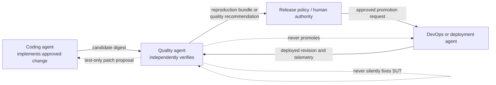
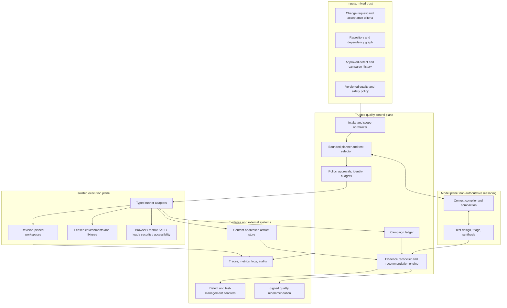
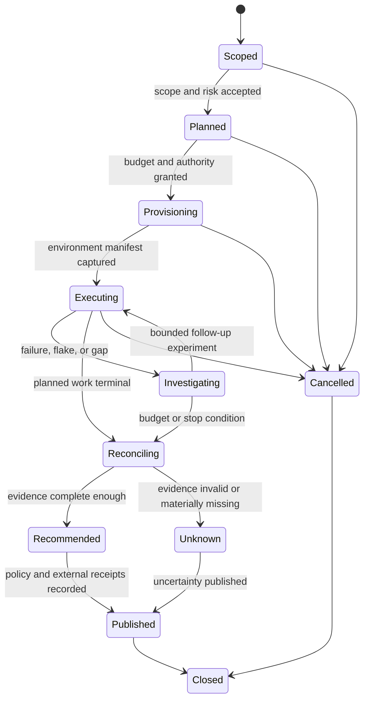

# Test and Quality Engineering Agent

> Status: Production blueprint  
> Last researched: 2026-08-31  
> Evidence: [dated research packet](../../research/packets/test-quality-engineering-agent-blueprint.md)  
> Scope: independent verification evidence, test design, environment and fixture generation, defect reproduction, flaky-test diagnosis, coverage and risk analysis, functional and nonfunctional validation, and advisory release-quality recommendations

## Production position

A test and quality engineering agent is an **independent evidence producer**. It determines what must be tested, invokes deterministic tools inside controlled environments, investigates ambiguous failures, and produces a reproducible defect record or an uncertainty-aware release recommendation.

It is not a second coding agent. It does not implement product features, merge arbitrary patches, or repair the system under test while judging it. It is not a deployment agent. It does not promote a candidate, change rollout policy, or operate production infrastructure merely because its recommendation is favorable.

The most important architectural rule is:

> Models may plan, select, generate, correlate, and explain. Versioned runners, typed tool contracts, deterministic oracles, policy, and captured artifacts establish what actually happened.

## Do you need an agent?

Use the least capable mechanism that meets the verification need.

| Verification need | Best default | Why |
| --- | --- | --- |
| Run a known suite on every change | deterministic CI workflow | inputs, command, oracle, and gate are already known |
| Enforce a coverage floor or performance threshold | runner plus policy engine | a model adds interpretation risk to a fixed rule |
| Select tests from a trusted dependency graph | deterministic selector with conservative fallback | faster, cheaper, and auditable |
| Turn incomplete acceptance criteria into a risk-based test design | bounded quality agent | requires interpretation and explicit uncertainty |
| Reproduce or minimize an intermittent cross-layer failure | bounded quality agent plus deterministic experiments | evidence must guide the next experiment |
| Correlate browser traces, API logs, device state, and recent changes | bounded quality agent | evidence synthesis spans tools and artifacts |
| Decide whether missing evidence is tolerable for this candidate | quality agent recommendation plus policy/human authority | judgment is useful, but promotion authority stays separate |

Do not add an agent until the deterministic test platform can discover tests, provision an isolated environment, execute a specified subset, classify runner outcomes, and preserve artifacts without model assistance.

## Category separation



| Boundary | Quality agent may | Quality agent must not do by default |
| --- | --- | --- |
| Product source | read and analyze; build an isolated candidate; propose a test-only patch | implement or merge a feature/fix, mutate the review candidate, hide a failure by changing the SUT |
| Test assets | generate ephemeral tests, fixtures, probes, seeds, and harness adapters in a campaign workspace | commit permanent assets without the coding/review path |
| Environments | lease approved test environments; reset owned fixtures; use bounded faults in authorized targets | alter shared or production state outside an explicit test contract |
| Defects | reproduce, minimize, fingerprint, draft, and publish through approved adapters | declare root cause without evidence; close or reclassify owner decisions silently |
| Release quality | issue `RECOMMEND`, `RECOMMEND_WITH_RISK`, `DO_NOT_RECOMMEND`, or `UNKNOWN` with evidence | merge, deploy, promote, waive policy, or overrule an accountable approver |

See [Mission, boundaries, and reference architecture](01-mission-boundaries-and-reference-architecture.md) for the authority matrix.

## Non-negotiable guarantees

1. **Candidate immutability.** Every result binds to a source revision, build digest, environment manifest, test-plan version, toolchain version, and policy version.
2. **Independent observation.** The agent does not modify the system under test during an acceptance campaign except through an explicit, recorded test action.
3. **Attempt preservation.** First failures, retries, cancellations, invalid runs, and publication failures remain visible.
4. **No invented pass.** Missing, malformed, timed-out, or unverifiable evidence is `UNKNOWN` or `INVALID`, never an inferred pass.
5. **Oracle authority.** The agent may choose or propose an oracle; it cannot rewrite a deterministic assertion after seeing the result unless a new plan version is approved and the prior result remains retained.
6. **Least privilege.** Untrusted-change tests run without production secrets, write-capable repository tokens, or unrestricted egress.
7. **Bounded execution.** Wall time, attempts, workers, devices, environments, load, external writes, tokens, and spend all have hard limits.
8. **Artifact lineage.** Findings cite immutable evidence or report why evidence could not be retained.
9. **Advisory quality output.** Recommendation and promotion are separate events owned by separate authorities.
10. **Safe degradation.** On model, tool, schema, artifact, or integration failure, deterministic tests can continue and the agent can fall back to evidence-only or stop safely.

## Reference architecture



The model never receives raw credentials and does not call a shell, browser, device, scanner, or issue tracker through an untyped general-purpose escape hatch. Adapters validate commands, enforce policy, capture receipts, normalize results, and return artifact references.

## Campaign lifecycle



A campaign is immutable in identity but versioned in plan. Follow-up experiments append to the ledger; they do not overwrite the original selection, failure, or oracle.

## Reader path: from deterministic tools to production

| Stage | Read first | Exit condition |
| --- | --- | --- |
| 0. Deterministic tooling is enough | this guide; [tool and environment contracts](03-tool-contracts-environments-fixtures-and-isolation.md) | runners can execute a specified immutable candidate and emit normalized results without a model |
| 1. First bounded loop | [test design and selection](02-test-design-selection-oracles-and-risk.md); [roadmap](09-build-roadmap-and-reference-contracts.md) | agent can design one plan, call only allowlisted read/test tools, and stop on fixed budgets |
| 2. Safe MVP | [security and integrations](07-security-identity-integrations-and-provenance.md) | isolated untrusted-change execution, no production secrets, immutable evidence, advisory output only |
| 3. Reliable v1 | [defects, flakes, coverage, and release evidence](06-defects-flaky-tests-coverage-and-release-evidence.md); [state and planning](05-state-context-planning-parallelism-and-memory.md); [adapter qualification](10-adapter-qualification-and-conformance.md) | retries, dedupe, leases, recovery, compaction, reproduction bundles, and qualified adapters survive partial failure |
| 4. Production readiness | [reliability, evaluation, and operations](08-reliability-observability-evaluation-and-operations.md) | evaluated recommendation calibration, SLOs, canary, rollback, incident mode, upgrade gates |
| 5. Scale and resilience | [domain validation boundaries](04-domain-validation-boundaries.md); [operations](08-reliability-observability-evaluation-and-operations.md) | bounded sharding, queues, quotas, failure isolation, backpressure, and measured cost |
| 6. Continuous evolution | [roadmap](09-build-roadmap-and-reference-contracts.md) | production failures and eval gaps enter controlled datasets; memory and policy changes are reviewable |

## Guide map

| Guide | Primary decision |
| --- | --- |
| [Mission, boundaries, and reference architecture](01-mission-boundaries-and-reference-architecture.md) | What does this agent own, and where are the trust and authority boundaries? |
| [Test design, selection, oracles, and risk](02-test-design-selection-oracles-and-risk.md) | What should run, why, and what constitutes a valid observation? |
| [Tool contracts, environments, fixtures, and isolation](03-tool-contracts-environments-fixtures-and-isolation.md) | How does the agent execute without gaining a dangerous escape hatch? |
| [Domain validation boundaries](04-domain-validation-boundaries.md) | How do browser, mobile, API, load, security, and accessibility validation differ? |
| [State, context, planning, parallelism, and memory](05-state-context-planning-parallelism-and-memory.md) | What state persists, how is context compacted, and how is work bounded? |
| [Defects, flaky tests, coverage, and release evidence](06-defects-flaky-tests-coverage-and-release-evidence.md) | How are failures made reproducible and recommendations calibrated? |
| [Security, identity, integrations, and provenance](07-security-identity-integrations-and-provenance.md) | How are untrusted inputs, secrets, supply chain, and external writes controlled? |
| [Reliability, observability, evaluation, and operations](08-reliability-observability-evaluation-and-operations.md) | How is the agent evaluated, operated, scaled, upgraded, and stopped? |
| [Build roadmap and reference contracts](09-build-roadmap-and-reference-contracts.md) | What is the smallest safe implementation sequence? |
| [Adapter qualification and conformance](10-adapter-qualification-and-conformance.md) | How are CI, runner, browser, device, API, contract, load, scanner, environment, artifact, and issue adapters proven safe enough to use? |

## Output contracts

The primary outputs are evidence products, not prose summaries.

| Output | Required content | Consumer |
| --- | --- | --- |
| Test plan | candidate, scope, risks, selected and omitted tests, oracle, environment, budgets, approvals | runner control plane, reviewer |
| Test attempt | command contract, exact environment, timestamps, outcome class, raw report/artifact digests | campaign ledger, reconciler |
| Reproduction bundle | minimal steps/input, seed, fixture digest, build and environment, expected/actual, traces/logs | coding agent or engineer |
| Flake assessment | attempt matrix, changed variables, observed rate and uncertainty, suspected mechanism, quarantine state | test owner, release policy |
| Coverage/risk report | structural, mutation, requirement, risk, platform, operational dimensions and known gaps | release reviewer |
| Release-quality recommendation | immutable candidate, evidence closure, blocking findings, accepted risk, unknowns, recommendation, policy version | human/policy authority, deployment workflow |

## Recommendation vocabulary

Use a small vocabulary whose semantics do not depend on model tone.

| Recommendation | Meaning |
| --- | --- |
| `RECOMMEND` | all required evidence is valid and no policy-blocking finding remains |
| `RECOMMEND_WITH_RISK` | evidence meets the minimum gate, but explicitly accepted non-blocking risks remain |
| `DO_NOT_RECOMMEND` | valid evidence shows a policy-blocking defect, regression, or unacceptable risk |
| `UNKNOWN` | material evidence is missing, invalid, irreproducible, or outside the agent’s authority |

The policy engine or accountable human decides whether a recommendation is sufficient to continue. The deployment system consumes the decision; it does not ask the quality agent to promote the candidate.

## Safe minimum configuration

```yaml
quality_agent:
  mode: advisory
  candidate:
    immutable_revision_required: true
  execution:
    max_plan_steps: 12
    max_parallel_jobs: 2
    max_follow_up_experiments: 3
    wall_clock_minutes: 30
    network_egress: deny_by_default
    production_targets: deny
  repositories:
    write_access: isolated_overlay_only
    permanent_changes: proposal_only
  secrets:
    expose_to_model: false
    untrusted_change_scope: test_only_ephemeral
  evidence:
    artifact_digest_required: true
    preserve_all_attempts: true
  publication:
    external_writes: approval_or_policy_scoped
    deploy_or_promote: false
  memory:
    long_term_admission: reviewed_only
```

This is an illustrative policy shape, not a vendor configuration. The [reference contracts](09-build-roadmap-and-reference-contracts.md) make the normative fields explicit.

## When not to use this blueprint

Do not use an autonomous quality loop when:

- the test action can cause uncontrolled physical, financial, safety, privacy, or production impact;
- a regulator or safety case requires a qualified human to design, witness, or sign the test;
- the environment cannot isolate untrusted code or distinguish test data from real data;
- there is no authoritative candidate identity or artifact provenance;
- the product has no stable or reviewable acceptance criteria and the agent would be inventing them;
- the only available oracle is the same model judging its own output without independent evidence;
- the organization intends to treat the recommendation as silent deployment authorization.

Use the agent as a read-only planner or evidence assistant until those controls exist.

## Explicit non-goals

This blueprint does not define:

- a universal QA process, coverage target, retry count, severity scale, or release policy;
- a replacement for unit, integration, contract, system, exploratory, security, performance, accessibility, or human testing disciplines;
- an automatic root-cause oracle;
- a production exploit agent or unrestricted scanner;
- a browser or device farm implementation;
- a CI/CD platform, source-control workflow, issue tracker, or test-management product;
- a self-healing mechanism that edits assertions until tests pass;
- permission to collect production data, customer sessions, credentials, or personal information;
- evidence that a passed campaign proves absence of defects.

## Definition of done

A production deployment of this blueprint is not done because it can call a test runner. It is done when:

- a reviewer can reconstruct exactly what candidate, plan, environment, fixtures, tools, tests, attempts, and policies produced a recommendation;
- a missing artifact, parser error, retry, model failure, stale selector, or integration outage cannot become an accidental pass;
- untrusted repository, browser, API, report, issue, and log content cannot grant itself authority;
- defect reproduction works from the preserved bundle or is explicitly classified as non-reproducible;
- every third-party runner and integration is qualified as a narrow versioned capability, with known limits, conformance evidence, and a revocation/rollback path;
- recommendation correctness and calibration are evaluated independently of service uptime;
- model, prompt, tool, runner, image, plugin, schema, and policy upgrades pass replay, shadow, canary, and rollback gates;
- the quality agent can be disabled while deterministic CI and stored evidence continue to function.
- a restore or failover can reconstruct the evidence graph, fence stale work, and invalidate recommendations whose completeness cannot be proven.

## Related canonical guides

- [Execution boundaries](../../runtime/execution-boundaries.md)
- [Run controls](../../runtime/run-controls.md)
- [Agent state and event contracts](../../runtime/agent-state-and-event-contracts.md)
- [Context engineering](../../context-memory/context-engineering.md)
- [Compaction and continuity](../../context-memory/compaction-and-continuity.md)
- [Memory architecture](../../context-memory/memory-architecture.md)
- [Tool contracts](../../tools/tool-contracts.md)
- [Tool registries, versioning, and lifecycle](../../tools/tool-registries-versioning-and-lifecycle.md)
- [Tool results, artifacts, and provenance](../../tools/tool-results-artifacts-and-provenance.md)
- [Permissions, sandboxing, and secrets](../../security/permissions-sandboxing-and-secrets.md)
- [Prompt injection and untrusted data](../../security/prompt-injection-and-untrusted-data.md)
- [Failure taxonomy](../../reliability/failure-taxonomy.md)
- [Idempotency and side effects](../../reliability/idempotency-and-side-effects.md)
- [Observability and tracing](../../evaluation/observability-and-tracing.md)
- [Trajectory and reliability evaluation](../../evaluation/trajectory-and-reliability-evaluation.md)

## Evidence limitations

The research baseline is current as of the stated date. Tool semantics, CI permissions, mobile runners, standards, model APIs, and test-management rate limits evolve. Bind the architecture to local repository topology, supported platforms, data classification, threat model, release policy, historical defect distribution, and measured runner behavior before selecting thresholds or autonomy.
