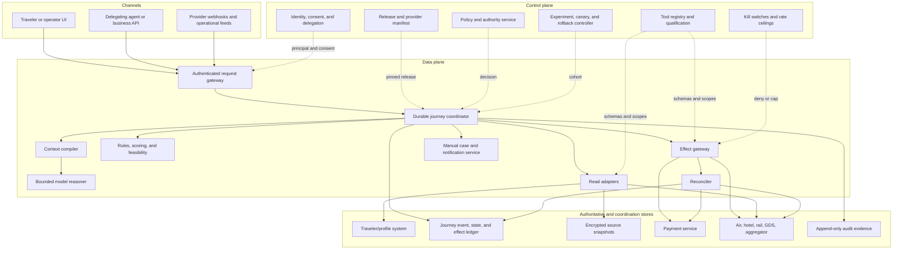
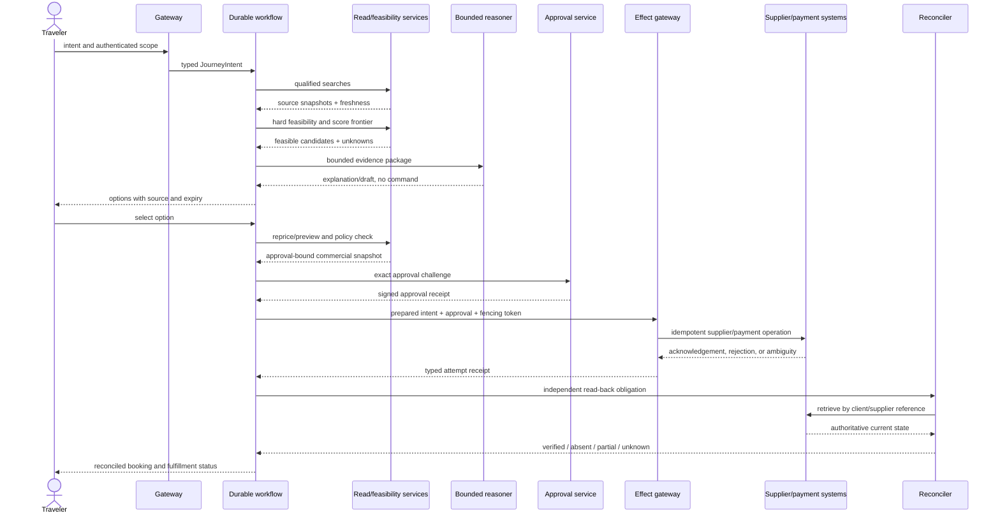

# Reference Architecture, Control/Data Planes, and Runtime

Status: production design guide  
Last reviewed: 2026-08-31

The safest architecture is a durable, mostly deterministic transaction coordinator with a bounded reasoner—not a society of autonomous travel agents. One workflow owns one journey or after-sales case, typed services own facts and effects, and the model is invoked only where language interpretation improves the result.

## Selected architecture



The control plane changes what a deployment may do. The data plane performs one travel workflow under a pinned control-plane snapshot. Do not let a prompt fetch “latest policy” and interpret it at commit time; the coordinator requests a signed deterministic decision and records the policy version.

## Control-plane contract

| Component | Owns | Must not do |
|---|---|---|
| Release manifest | Model, prompt, tool schema, adapter, policy, context, compaction, evaluator, and feature versions | Mutate an in-flight effect's semantics |
| Provider registry | Qualified content sources, actions, versions, regions, credentials, quotas, read-back, known gaps | Infer capability from protocol name alone |
| Authority policy | Action tier, spend, jurisdiction, traveler/product restrictions, approval and preauthorization rules | Store payment credentials or execute supplier calls |
| Identity/consent | Authenticated principal, traveler, delegation, assurance, consent purpose/scope/expiry | Treat a chat participant as the passenger automatically |
| Kill controls | Global, tenant, provider, action, payment, and disruption write disablement | Depend on the model or affected provider to activate |
| Release controller | Shadow/canary cohort, hold, promote, rollback, compatibility checks | Roll back an already committed supplier transaction |

Control-plane changes are audited, two-person reviewed for T3/T4 authority, and propagated with bounded delay. A workflow pins a manifest at creation; before a high-risk effect it may adopt only a backward-compatible emergency policy deny. An allow-expansion requires a new prepared intent and approval.

## Data-plane responsibilities

### Authenticated gateway

It verifies session/service identity, tenant, acting principal, delegation, request replay protection, and rate limits. It creates a correlation ID and strips unneeded channel metadata. It never forwards channel cookies or browser session credentials to tools.

### Durable journey coordinator

Use one coordinator per `journey_id` for pre-travel and in-travel continuity, plus a child workflow per effect or after-sales case where independent deadlines justify it. The coordinator owns:

- state transitions, deadlines, timers, and bounded retry schedules;
- snapshot and projection references, not copied supplier truth;
- serialization keys and fencing leases for effects;
- approval and policy bindings;
- the effect ledger and reconciliation obligations;
- manual case creation and notifications;
- recovery after process, model, queue, or region restart.

For a durable-execution engine such as Temporal, keep workflow code deterministic. Put network I/O, model calls, clock reads, and provider interactions in activities. Pin activity behavior and use version markers during workflow migrations. Activity retries do not make non-idempotent travel effects safe; the effect protocol still must.

### Context compiler and reasoner

The compiler selects typed evidence within a budget, labels trust/source/freshness, removes prohibited fields, and emits a continuity receipt. The reasoner can:

- resolve ambiguous soft preferences and ask targeted questions;
- explain already validated options and material differences;
- summarize raw fare/rate text without converting absence into certainty;
- propose a recovery choice set from deterministic candidates;
- prepare structured drafts that a validator must accept.

It cannot call arbitrary URLs, manufacture IDs, select credentials, change policy, grant approval, or emit an executable supplier payload.

### Deterministic feasibility and scoring

This service handles hard constraints and makes soft criteria visible. Examples include passenger/occupancy limits, airport/station windows, connection rules, hotel check-in/out fit, elapsed time, budget, travel policy, accessibility requirements, route risk, and known service support. A solver may enumerate multi-component itineraries; it returns `feasible`, `infeasible`, `partial`, `timeout`, or `unknown`, never only a natural-language plan.

### Read adapters

Read adapters query only qualified endpoints and return an envelope with source, provider version, request scope, observation time, expiry, raw artifact reference, normalized data, warnings, and parser version. Reads can fan out in parallel within quotas because they do not change inventory. Search fan-out must still be bounded to prevent cost and supplier abuse.

### Effect gateway and reconciler

The gateway is the sole network path for T2–T4 writes. It validates a prepared intent and dispatches a provider-specific request. The reconciler independently retrieves supplier and payment state until it can prove applied, prove absent, identify contradiction/partial fulfillment, or escalate. Neither component accepts model prose.

## Request-to-commit sequence



An approval occurs after a fresh quote and before the commit deadline. If payment step-up changes the elapsed time enough to expire the quote, reprice and reapprove rather than silently accepting drift.

## Identity and tenant isolation

Travel data is unusually linkable: names, contacts, routes, dates, payment references, loyalty accounts, document fields, accessibility needs, and disruption location can reveal identity and behavior. Make scope a structural field, not a filter added later.

### Identity tuple

Every state, snapshot, event, tool request, effect, approval, and audit record carries:

```text
(tenant_id, legal_entity_id?, acting_principal_id, traveler_id,
 delegation_id?, journey_id, point_of_sale, region, environment)
```

The acting principal and traveler can differ. A travel arranger, parent, support operator, or delegating agent must present an unexpired delegation for the exact purpose. Do not infer delegation from shared surname, email domain, calendar access, or prior bookings.

Use risk-based identity assurance informed by NIST SP 800-63-4. Search may require a lower assurance than releasing a ticket, changing contact details, or canceling a journey. Step up through the identity service; do not ask the model to collect authentication secrets.

### Isolation controls

| Layer | Required control |
|---|---|
| Storage | Tenant-scoped partition/row policy, encrypted sensitive columns, separate keys where risk requires, deny-by-default service roles |
| Retrieval | Scope compiled into the query; post-query invariant verifies every returned object; no cross-tenant embedding index |
| Cache | Key includes tenant, point of sale, traveler class/occupancy, currency, provider, and search signature; sensitive or live data has tight TTL |
| Workflow | Partition and lease key includes tenant and journey/order; no global mutable conversation object |
| Tools | Short-lived, audience-bound, tenant/provider/action-scoped tokens; no inherited developer or browser credential |
| Logs/traces | Structured allowlist, redaction before export, pseudonymous IDs, restricted raw snapshot links |
| Manual cases | Queue and operator authorization match tenant/region/data class; access is audited |
| Analytics/evals | Deidentified fixtures or approved protected environment; never copy production PNR/passport/payment data into public model evals |

Any cross-tenant observation activates the tenant/data kill path, blocks effects, preserves evidence, and enters the privacy incident runbook.

## Provider and tool qualification at runtime

The registry returns a capability record, not just a tool name:

```yaml
qualified_capability:
  capability_id: air_provider_a.order.create.v2.IN
  provider: air_provider_a
  product: air
  content_sources: [GDS, NDC]
  action: order_create
  api_version: v2
  schema_hash: sha256:...
  qualified_at: 2026-08-20T00:00:00Z
  expires_at: 2026-11-20T00:00:00Z
  regions: [IN]
  traveler_limits: {maximum: 9, infants_supported: false}
  operation_semantics:
    external_effect: creates_supplier_order
    acknowledgement_is_final: false
    terminal_postcondition: expected_products_and_fulfillment_retrieved
  idempotency:
    field: client_reference
    scope: provider_account_and_action
    retention: provider_tested_72h
    semantics: provider_tested
  readback:
    lookup_by_client_reference: true
    order_retrieve: true
    maximum_proven_absent_delay_seconds: 45
  concurrency:
    serialization_key: provider_account_plus_client_reference
    stale_write_precondition: expected_order_version
  clock_contract:
    offer_expiry_source: response.expires_at
    commit_margin_seconds: 120
    provider_clock_skew_limit_seconds: 5
  payment_modes: [provider_token]
  after_sales: [void_quote, cancel_quote]
  known_gaps: [involuntary_refund, exchange]
  credential_profile: air_provider_a_write_IN
  contract_test_suite: air-order-create-2026-08-20
```

At dispatch, the gateway checks capability ID, schema hash, qualification expiry, region, content source, traveler/product limits, credential audience, quota, and kill state. A connector passing search tests has no implied write authority.

The manifest is operation-level because finality, idempotency scope/retention, read-back, clocks, credential audience, and regional behavior often differ within one provider. `search`, `reprice`, `create`, `fulfill`, `retrieve`, `change_quote`, `change`, `cancel_quote`, `cancel`, `refund`, and webhook ingest are separate records. A missing field is a qualification failure, not permission to inherit behavior from a neighboring operation.

## State, event, and storage layout

Use separate stores or logical boundaries:

| Store | Contents | Mutation model | Retention posture |
|---|---|---|---|
| Journey event ledger | Intent revisions, state transitions, approvals refs, effect state, deadlines, projections | Append-only events; deterministic projections | Business/audit schedule, subject to legal and deletion policy |
| Source snapshot vault | Provider request/response artifacts, parsed fields, terms/rules | Immutable versioned artifacts | Minimum needed for transaction/dispute; encrypted and access logged |
| Effect ledger | Prepared intent, semantic ID, attempts, receipts, read-backs, reconciliation | Append-only attempts plus monotonic effect status | At least operational/audit requirement; no secrets |
| Traveler/profile store | Verified identity refs, contacts, preferences, consent, loyalty/service needs | Owned profile APIs | Purpose-specific; do not duplicate into journey memory |
| Payment service | Tokens, authentication, authorization/capture/refund states | Payment-domain controls | PCI/payment policy |
| Context cache | Redacted compiled inputs and continuity receipts | Ephemeral/versioned | Short TTL; no raw credential/document payloads |
| Audit store | Who/what/why/when for access, policy, approval, effects, overrides | Tamper-evident append | Compliance and incident schedule |

Avoid a single “agent memory” database. It obscures authority, retention, access, and replay semantics.

## Concurrency model

Parallelize independent reads; serialize conflicting writes.

- Search different qualified providers concurrently under fan-out and quota budgets.
- Reprice one chosen offer through its originating channel; do not mix identifiers across providers.
- Hold a lease keyed by `tenant_id + supplier_order_or_booking_id` for after-sales writes.
- Also fence the journey when a change affects downstream components or active disruption planning.
- Reject stale `expected_version` and stale approval hashes rather than last-write-wins.
- Treat duplicate and out-of-order webhooks as normal. Deduplicate by provider event ID when present; otherwise use a stable content key while retaining raw evidence.
- Route search, booking, reconciliation, disruption, and notification through separate queues so search bursts cannot starve unknown-effect recovery.

For multi-product trips, do not hold one database transaction across providers. Use an explicit saga and state the partial-trip policy before the first commit.

## Long waits and clock semantics

The coordinator persists clocks as obligations; no worker sleeps for the duration and no chat session owns a deadline.

| Clock | Source and representation | Wake behavior | Expiry behavior |
|---|---|---|---|
| Offer/preview/after-sales quote | Provider instant plus received time, measured skew, internal safety margin | Revalidate shortly before approval/commit | Invalidate proposal and grant; never extend from cached text |
| Hold/workbench | Provider hold ID, binding terms, destination/provider time basis, release path | Observe before safe margin and after expected auto-release | Block dependent commit; retrieve/release/escalate |
| Ticketing/fulfillment | Issuer/provider time limit with zone/source | Prioritize fulfillment read-back/recovery | Preserve PNR/order, stop recreation, escalate issuer path |
| Hotel/car cancellation or no-show | Destination-local IANA zone, offset and source, provider convention | Notify with local and traveler-visible time | Requote; do not calculate fee from stale schedule |
| Payment challenge/authorization | Payment-service state/expiry | Resume only from authenticated callback or retrieve | Reprice/reapprove when commercial binding expired |
| Refund/reconciliation | Provider/payment/policy deadline refs | Bounded polling with jitter and age escalation | Never close as returned funds without owning evidence |
| Departure/disruption/contact | Supplier schedule plus duty-of-care/communication policy | Rebuild priority as slack changes | Escalate; silence is not consent |
| Retention/deletion/legal hold | Data-policy service decision | Execute store-specific deletion/restriction workflow | Record lawful exception; never silently retain everywhere |

Store the original zone/offset and the resolved UTC instant. On time-zone database update, recompute future derived instants, preserve the prior derivation/version, and invalidate affected feasibility or approval. Virtual-time tests advance every clock through restart, failover, daylight-saving gaps/overlaps, and late/out-of-order events.

## Runtime selection

| Option | Suitable use | Limitation |
|---|---|---|
| Database-backed state machine + queue | Small, well-bounded pilot with few timers/effects and strong in-house discipline | Team must implement leases, timers, replay, signal dedupe, visibility, and workflow migration correctly |
| Durable workflow engine | Long-running journeys, many timers, webhooks, unknown effects, disruption recovery, audit/replay | Operational complexity and determinism/versioning discipline |
| Serverless function chain | Stateless search normalization or isolated adapter activity | Poor fit as the sole coordinator for days/months-long state and ambiguous effects |
| Open-ended agent runtime | Offline research prototype | Unbounded plans, weak effect semantics, transcript dependence; not a booking control plane |

Prefer the simplest option that provides durable timers, deterministic replay into one logical workflow history, and visible stuck work. Replay-safe workflow progression still does not make an external supplier effect exactly once.

## Model and agent topology

Use one reasoner per decision point. A separate model may be justified for a sharply different offline task—such as a redacted rule-text evaluator—but it communicates through typed artifacts and has no shared credentials or authority.

Multiple agents are not justified by air/hotel/rail labels alone. Provider adapters and deterministic services already isolate those protocols. Adding debating or supervisory agents increases context, latency, cost, and cascading failure without improving source truth.

Model routing should be capability and risk based:

- no model for schema validation, rule evaluation, state transitions, retries, price arithmetic, identity, or effects;
- smaller validated model for classification or field-grounded summaries;
- stronger model for bounded multi-option explanations or ambiguous preference elicitation;
- no automatic fallback to an unqualified model for T1/T2 content;
- if all qualified models fail, return deterministic options and manual handoff.

## Failure and degradation matrix

| Failure | Data-plane response | Preserved capability |
|---|---|---|
| Model unavailable | Skip explanation; show deterministic feasible options and evidence | Search, retrieve, approval/effect state, manual case |
| Search provider unavailable | Open circuit, show provider-specific staleness and partial coverage | Other qualified providers; no implied market completeness |
| Policy unavailable | Deny new T2–T4 operations; preserve already committed recovery duties | Read-only status and escalation |
| Payment unavailable/challenge | Do not collect credentials; pause before supplier commit or reconcile according to provider sequence | Quote if still valid, manual handoff |
| Supplier write timeout | Mark effect unknown and prioritize read-back | Status evidence and reconciliation |
| Supplier read-back unavailable | Keep unknown, suppress conflicting writes, escalate by age | Other journey reads and traveler communication with uncertainty |
| Snapshot store unavailable | Do not form new approval; never use transcript copy as replacement | Retrieve existing durable state and manual case |
| Queue saturation | Backpressure search/proposals first; reserve booking, reconciliation, and disruption capacity | Critical in-travel and unknown-effect work |
| Region failure | Fence old writer, recover pinned workflow in declared home/failover region | Read-only replica if writer safety is not proven |
| Kill switch active | Deny targeted writes before adapter dispatch | Evidence, retrieval, export, and manual runbook |

## Architecture decision records

| ADR | Decision | Consequence |
|---|---|---|
| A-01 | Supplier/profile/payment systems remain authoritative | Agent records references, observations, and coordination state; never repairs source truth locally |
| A-02 | One durable coordinator per journey/case | Continuity and effects are explicit; model topology stays simple |
| A-03 | Control and data planes are separate | Releases and authority are governed; in-flight behavior is pinned |
| A-04 | Read and write adapters are separate capabilities | Search credentials cannot become booking credentials by tool choice |
| A-05 | Every write passes through effect gateway and reconciler | Unknown outcomes are recoverable; success text is insufficient |
| A-06 | Hard feasibility and scoring are deterministic | Model cannot relax constraints or hide a dominated choice |
| A-07 | Context is compiled from typed references | Transcript and long-term memory cannot become booking truth |
| A-08 | Parallel reads, serialized resource writes | Latency improves without racing supplier orders |
| A-09 | Deployment is cell-based by trust/failure boundary | Provider or tenant failures are contained; capacity and rollback are measurable |

## Exercises and exit criteria

1. Draw the path for an assistant booking travel for another person. Identify each principal, traveler, delegation, point of sale, credential, approval, and audit record. Exit: no component relies on email-domain or conversation inference.
2. Crash the coordinator after provider dispatch but before receipt persistence. Exit: replay creates no second semantic operation and starts reconciliation.
3. Disable the model, policy service, one provider, and the global write path independently. Exit: each declared degraded mode matches the matrix and produces no unauthorized fallback.
4. Inject one cross-tenant search snapshot. Exit: post-query invariant detects it, effects are blocked, evidence is preserved, and privacy response is opened.
5. Change an adapter schema while a workflow is running. Exit: the pinned manifest either remains compatible or pauses safely; it never silently remaps an approval-bound field.

Architecture is ready for implementation when every box has an owner, API contract, credential scope, SLO, data classification, failure behavior, and test fixture—and no arrow bypasses policy, effect, or audit controls.

Continue with [traveler, itinerary, order, state, and events](03-traveler-itinerary-order-state-and-events.md). The shared [durable execution guide](../../runtime/durable-execution.md), [agent state/event contracts](../../runtime/agent-state-and-event-contracts.md), and [execution boundaries](../../runtime/execution-boundaries.md) provide the repository-wide foundation.
