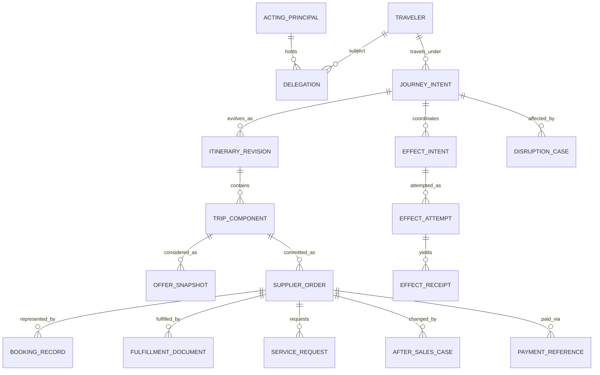
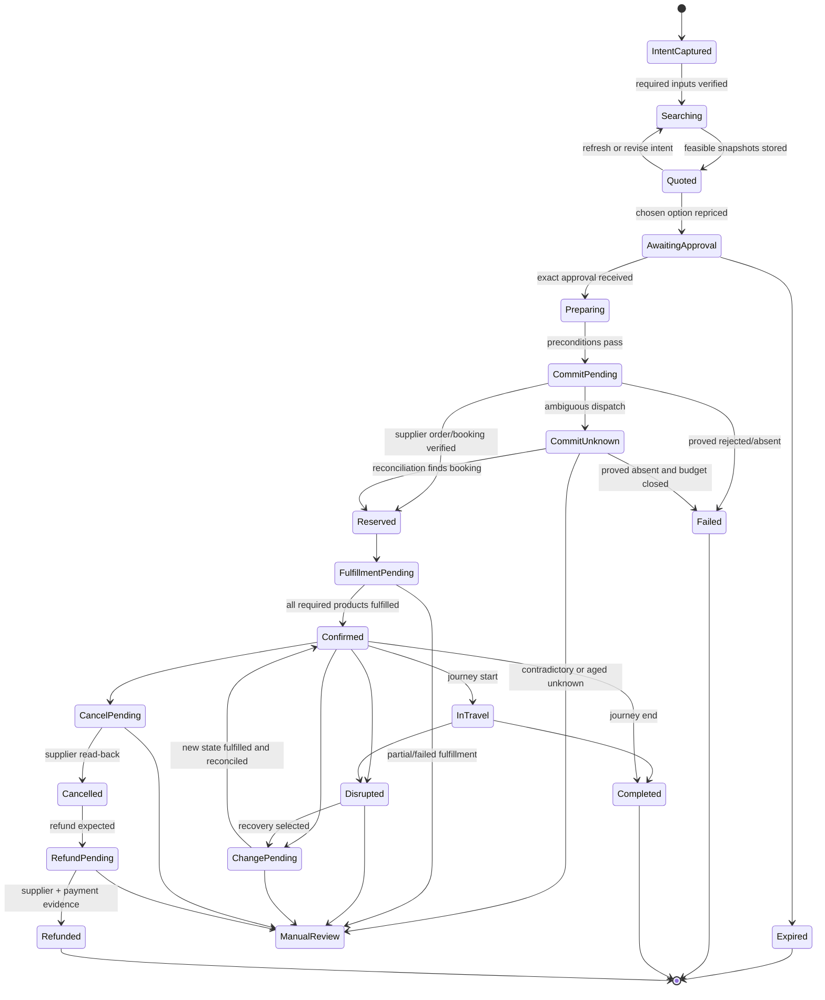

# Traveler, Itinerary, Order, State, and Events

Status: production design guide  
Last reviewed: 2026-08-31

Travel systems use overlapping identifiers and lifecycle words. A PNR may contain several passengers and segments; a carrier order may coexist with a passive GDS record; tickets and EMDs fulfill parts of an airline order; a hotel booking can contain multiple rooms/products; rail can separate booking and fulfillment. Safe coordination starts by preserving those distinctions rather than forcing all providers into one “reservation” object.

## Canonical identity graph



Canonical IDs locate records inside the coordination domain. Provider IDs remain typed aliases; never copy an opaque identifier into a different provider/channel field.

## Entity catalog and authority

| Entity | Purpose | Authority | Critical rules |
|---|---|---|---|
| `TravelerRef` | Reference a verified person and profile version | Identity/profile service | No passport image, PAN, CVV, or inferred medical detail |
| `ActingPrincipalRef` | Identify who requested or approved | Identity service | May differ from traveler; bind assurance and session |
| `DelegationRef` | Prove scoped right to act for traveler/tenant | Delegation/consent service | Purpose, actions, spend, expiry, revocation, traveler list |
| `JourneyIntent` | Store approved objective, hard/soft constraints, open questions | Traveler-approved coordination record | Immutable revisions; never overwrite the original request |
| `ItineraryRevision` | Proposed or committed trip topology | Coordination domain | Status distinguishes proposed, approved, committed, superseded |
| `TripComponent` | Air, hotel, rail, car, transfer, or manually managed dependency | Coordination domain referencing supplier | Time/place/product constraints retain source |
| `OfferSnapshot` | Time-bounded commercial observation | Provider response | Source, request scope, observed/expiry, raw ref, normalized fields, hashes |
| `SupplierOrder` | Canonical view of a committed provider order | Supplier is authoritative | Store current observation and source version; do not invent lifecycle mapping |
| `BookingRecord` | PNR, hotel booking, rail booking, carrier locator, passive record | Supplier/channel | Multiple records may represent one order; record relationship explicitly |
| `FulfillmentDocument` | Ticket, EMD, voucher, rail fulfillment/document | Supplier/issuer | Document presence/status is distinct from booking |
| `ServiceRequest` | Accessibility, meal, baggage, seat, check-in, or special service request | Supplier fulfils; traveler owns need | Separate requested, normalized, acknowledged, confirmed, rejected |
| `PaymentReference` | Opaque link to payment workflow | Payment service | Amount/currency/status snapshots only; no credential material |
| `ApprovalGrant` | Authenticated exact authorization | Approval service | Binds snapshot hashes, action, actor, policy, expiry, scope |
| `EffectIntent` | Immutable desired external transition | Coordination/effect gateway | Stable semantic operation ID and pre/postconditions |
| `AfterSalesCase` | Change, exchange, cancel, void, refund, or supplier waiver lifecycle | Supplier plus coordination | Voluntary/involuntary and requested/applied/settled remain distinct |
| `DisruptionCase` | Travel-impacting event and recovery obligations | Provider feeds + duty-of-care policy + coordination | Evidence confidence, deadlines, traveler reachability, affected components |

## Canonical identity, version, and effective-time contract

Do not overload an ID with “current.” Every mutable record carries a stable canonical identity, immutable revision identity, provider aliases, source version where available, business-effective interval, observation/recording times, and correction lineage:

```yaml
temporal_identity:
  canonical_id: sord_55
  revision_id: sord_55@000018
  revision: 18
  provider_aliases:
    - {namespace: air_provider_a.order, value_ref: protected://orders/ord_0000A3}
  valid_from: 2026-08-31T04:11:59Z
  valid_to: null
  occurred_at: 2026-08-31T04:11:59Z
  observed_at: 2026-08-31T04:12:00Z
  recorded_at: 2026-08-31T04:12:00.120Z
  source_version: etag:920
  supersedes_revision_id: sord_55@000017
  correction_of_event_id: null
  authority: air_provider_a
```

`occurred_at` is when the domain event happened if known; `valid_from`/`valid_to` describe when the fact applies in the business domain; `observed_at` is when the source was read; `recorded_at` is when this system durably stored it. Unknown source time remains unknown—never replaced with ingestion time. A later observation may be fresher without being a correction, and a late correction may change the projection for an earlier effective interval without rewriting history.

| Record family | Stable identity and aliases | Revision/finality semantics | Effective-time and correction rule |
|---|---|---|---|
| Tenant and legal entity | `tenant_id` is the isolation principal; `legal_entity_id` names the contracting/financial entity and never defaults from email domain | Version the tenant/legal-entity relationship, region, accreditation, policy and provider-account bindings | Authorization uses the relationship effective at effect time; merger/rename/correction appends a new interval and never rekeys old effects |
| Acting principal and delegate | `principal_id` identifies the authenticated actor; `delegation_id` identifies one grant, never the traveler | Bind subject, traveler set, purpose, actions, spend, assurance, grant/revoke versions; revoked/expired is terminal for new effects | Evaluate grant/revocation as of approval and dispatch; late revocation events block future dispatch but do not falsify earlier authorized history |
| Traveler | `traveler_id` is internal and provider passenger/customer IDs are scoped aliases; never merge on name/contact | Profile revisions are immutable observations; identity assertions, contacts, loyalty and needs have independent versions | Use travel-date applicability and freshest authorized assertion; corrections preserve prior supplier disclosures and trigger impact review |
| Journey, itinerary, and revision | `journey_id` is durable intent; `itinerary_id` is the topology lineage; `itinerary_revision_id` is immutable | Proposed, selected, approved, committed, superseded, abandoned are explicit; revision number alone is not an ID across journeys | Each revision has `valid_from`, creation cause and predecessor mapping; out-of-band changes create a new observed revision, not an overwrite |
| Segment and component | Stable component IDs survive revisions when business identity is retained; provider segment/product aliases include channel | Replacement, split, merge, retained and cancelled links are explicit; marketing flight/train labels are not identity | Local scheduled time, IANA zone, offset, UTC derivation and schedule source/version are retained; corrections recompute dependencies |
| Quote, offer, and rule | `quote_snapshot_id` is one observation; provider offer/rate/rule IDs remain channel-scoped opaque aliases | A refresh creates a new snapshot; expired/superseded/invalid are final for approval use, not deleted | Carry provider expiry, observed time, rule applicability interval, point of sale and request signature; later terms never rewrite accepted terms |
| Supplier and product | `supplier_id` distinguishes retailer, aggregator, merchant, operator and fulfiller; `product_id` is scoped to provider order/offer | Supplier/product catalog versions do not prove live availability; brand/fare/room/car-class names are attributes, not stable identity | Record role effective for the component and source version; operating-supplier changes are material and create a new itinerary/approval basis |
| Order, booking, PNR, ticket, and voucher | Canonical supplier-order ID maps typed provider order, reservation, locator/PNR, ticket/EMD, hotel/rental voucher aliases | Reservation, payment and fulfillment sub-states advance independently; provider “confirmed” is not global finality | Every read-back is a dated revision; coupon/product/fulfillment corrections preserve both channel images and open reconciliation on conflict |
| Traveler document and service request | Document IDs point to a protected record/assertion; service-request IDs retain traveler/product/leg scope | Document assertion, request, acknowledgement, confirmation, rejection, delivery and withdrawal are separate revisions | Check document assertion at travel/action time; route/operator change invalidates applicability; correction never exposes protected payload to general context |
| Payment and refund | Payment/refund IDs are opaque references to the owning service; merchant/acquirer/supplier refs are typed aliases | Authorization, challenge, capture, reversal, refund request, refund processing, settlement and dispute remain distinct | Amount/currency/beneficiary and status observation time are versioned; provider refund correction cannot create finance settlement truth |
| Approval | `proposal_id` identifies presented terms; `grant_id` identifies one authenticated decision | Grant binds hashes/versions/scope/expiry; consumed, revoked, expired and invalidated are monotonic terminal states for that prepared intent | Evaluate at dispatch against current evidence and revocation; a correction to bound input creates a new proposal/grant rather than editing the old one |
| Effect | `effect_id` identifies coordination; `semantic_operation_id` identifies one business transition; attempt IDs identify network tries | Prepared/authorized/committing/acknowledged/unknown/verified/recovery states are append-only; only typed postconditions establish finality | `commit_started_at`, possible-dispatch interval, provider occurrence/observation times and reconciliation cursor survive restart; corrections append comparator evidence |
| Disruption and correction | `disruption_case_id` groups impact; individual observation IDs retain supplier/risk/traveler sources; `correction_event_id` points to the fact corrected | Open/assessing/options/awaiting-choice/recovering/reconciled/closed are distinct from the underlying supplier event | Keep source occurrence, publication, ingestion, retraction and correction times; a retracted alert may close a watch but never undo an already committed recovery effect |

Canonical equality requires the same namespace and isolation scope. Alias resolution is a privileged, audited operation with one-to-many and time-bounded mappings; ambiguous matches never auto-merge. Projection queries state both `effective_as_of` and `known_as_of` so incident replay can answer what was true and what the system knew at a past decision.

## Traveler and consent model

```yaml
traveler_ref:
  tenant_id: tenant_acme
  traveler_id: trv_01JZ...
  profile_version: "42"
  identity_assurance: IAL2
  contact_refs: [contact_mobile_primary]
  loyalty_refs: [loyalty_air_a]
  service_need_refs: [need_mobility_3]
  document_assertion_refs: [passport_assertion_9]
  consent_receipts:
    - consent_id: cns_17
      purposes: [air_search, air_booking, supplier_transmission]
      data_classes: [identity_core, contact, loyalty, service_request]
      recipients: [air_provider_a]
      granted_at: 2026-08-30T10:00:00Z
      expires_at: 2026-09-30T00:00:00Z
      revocable: true
```

References point to controlled stores. A document assertion can say a verified issuer, type, issuing country, and expiry check passed without exposing the document number to the model. Reveal the minimum supplier-required fields only inside the qualified adapter.

Consent is not a generic “remember me” flag. Record purpose, data class, recipient/category, action, time, scope, expiry, and revocation path. IATA One ID's consent and selective-disclosure direction is useful architecture guidance; it does not by itself authorize any implementation or remove local legal obligations.

### Accessibility/service-need representation

Do not reduce a person's need to an SSR code:

```yaml
service_request:
  request_id: sr_204
  traveler_id: trv_01JZ...
  traveler_description_ref: protected://needs/need_mobility_3
  normalized_need:
    category: mobility_assistance
    assistance_points: [terminal_entry, security, gate, boarding, arrival]
    equipment:
      traveler_device: true
      dimensions_ref: protected://equipment/eq_8
  provider_encoding:
    code: WCHR
    free_text_ref: protected://supplier-text/sr_204
    standard_version: provider_contract_2026_08
  status:
    requested_at: 2026-08-31T04:00:00Z
    acknowledged_at: 2026-08-31T04:00:08Z
    confirmed_at: null
    rejected_at: null
  evidence_refs: [snapshot_air_order_91]
```

“Requested,” “acknowledged,” “confirmed,” and “delivered” are different. Preserve the traveler's language, but redact it from general context and analytics. Never infer diagnosis, severity, or service sufficiency from a code.

## Journey intent and itinerary revisions

Hard constraints are eligibility boundaries; soft preferences influence ranking. Every constraint records its source and confidence.

```yaml
journey_intent:
  journey_id: jny_740
  revision: 7
  tenant_id: tenant_acme
  acting_principal_id: usr_17
  traveler_ids: [trv_01JZ..., trv_01KA...]
  point_of_sale: IN
  currency: INR
  objective: attend_customer_meeting
  constraints:
    - id: c1
      kind: arrive_before
      value: 2026-10-08T08:30:00+05:30
      hardness: hard
      source: traveler_confirmation
    - id: c2
      kind: maximum_total_price
      value: {amount: "150000.00", currency: INR}
      hardness: hard
      source: travel_policy
    - id: c3
      kind: avoid_overnight_connection
      value: true
      hardness: soft
      weight: 0.7
      source: traveler_profile_explicit
  unresolved_questions: []
  approved_at: 2026-08-31T04:00:00Z
  supersedes_revision: 6
```

Use decimal strings plus ISO 4217 currency; never binary floating point for commercial totals. Store local date/time, IANA time-zone ID, offset at observation, and UTC instant where resolvable. Do not assume an airport, hotel, or station time zone from the user session. Keep ambiguous local times explicit during daylight-saving transitions.

An `ItineraryRevision` contains stable component IDs. A change creates a new revision and links retained, replaced, and cancelled components. This makes downstream hotel nights, transfers, document checks, and disruption recovery computable.

## Offer snapshot contract

```yaml
offer_snapshot:
  snapshot_id: ofs_air_827
  tenant_id: tenant_acme
  journey_id: jny_740
  itinerary_revision: 7
  provider: air_provider_a
  channel: NDC
  provider_offer_id: off_0000AH
  request_signature: sha256:...
  traveler_signature: sha256:...
  point_of_sale: IN
  observed_at: 2026-08-31T04:05:12Z
  expires_at: 2026-08-31T04:35:12Z
  provider_synced_at: 2026-08-31T04:05:11Z
  parser_version: air-provider-a-v2.13.0
  schema_hash: sha256:...
  currency: INR
  totals:
    base: "100000.00"
    taxes: "18000.00"
    mandatory_fees: "1000.00"
    total: "119000.00"
  products_ref: artifact://offers/ofs_air_827/products
  conditions_ref: artifact://offers/ofs_air_827/conditions
  condition_completeness:
    change_before_departure: known
    refund_before_departure: unknown
    baggage: known
  raw_artifact_ref: vault://provider/air/response_991
  price_hash: sha256:...
  terms_hash: sha256:...
  topology_hash: sha256:...
  freshness: current
```

The request signature includes origins/destinations, dates, passenger types/ages where required, cabin, occupancy, point of sale, currency, residency/nationality inputs only where contractually required, and other material inputs. A cache hit with a different signature is invalid.

`expires_at` is provider-supplied when available. Otherwise store a conservative internal `refresh_by` derived from tested provider behavior and label it as an internal limit—not a supplier guarantee.

## Supplier order, booking, and fulfillment

The canonical projection must preserve provider distinctions:

```yaml
supplier_order_projection:
  supplier_order_id: sord_55
  provider: air_provider_a
  content_source: NDC
  provider_order_id: ord_0000A3
  booking_records:
    - type: carrier_locator
      value_ref: protected://locators/loc_1
    - type: passive_gds_pnr
      value_ref: protected://locators/loc_2
  status:
    reservation: confirmed
    payment: authorized
    fulfillment: partial
  products:
    - product_id: air_product_1
      traveler_id: trv_01JZ...
      segment_ids: [seg_1, seg_2]
      fulfillment_refs: [ticket_1]
    - product_id: air_product_2
      traveler_id: trv_01KA...
      segment_ids: [seg_1, seg_2]
      fulfillment_refs: []
  fulfillment_documents:
    - fulfillment_id: ticket_1
      type: electronic_ticket
      document_number_ref: protected://documents/ticket_1
      coupon_statuses: [open, open]
      observed_at: 2026-08-31T04:12:00Z
  synced_at: 2026-08-31T04:12:00Z
  raw_snapshot_ref: vault://provider/order/readback_122
```

The projection can say `fulfillment: partial` even if a provider calls the overall order confirmed. User-facing status is derived from expected products and documents, not copied from one top-level string.

### Status vocabulary

| User-visible claim | Minimum evidence |
|---|---|
| Option available | Current provider observation; explicitly not guaranteed until commit |
| Price confirmed for approval | Successful reprice/preview or documented binding hold, within expiry |
| Held | Supplier hold reference, conditions, expiry, release/read-back path |
| Booked/reserved | Supplier order/booking reference plus retrieval showing expected travelers/products |
| Ticketed/fulfilled | Expected ticket/EMD/voucher/rail fulfillment exists and maps to products/travelers |
| Service requested | Provider request accepted for processing; not promised delivery |
| Service confirmed | Provider explicitly confirms service at relevant points; still monitor changes |
| Rental ready | Reservation retrieved with expected driver, station/time, rate/terms, payment/deposit obligations and voucher/confirmation; vehicle class is not a guaranteed make/model unless contractually stated |
| Cancelled | Supplier read-back shows intended products cancelled/released |
| Refund requested | Supplier accepted a refund operation/case |
| Refund processed by supplier | Supplier shows refund completion/reference |
| Funds returned | Payment/finance system confirms movement/settlement under its semantics |

## Journey lifecycle



This is a journey projection. Each supplier order and effect has its own state machine. Never derive effect completion solely from a journey transition.

## Event envelope

Use a CloudEvents-compatible envelope or equivalent:

```json
{
  "specversion": "1.0",
  "id": "evt_01K42Z...",
  "type": "travel.supplier_order.fulfillment_observed.v1",
  "source": "adapter/air-provider-a",
  "subject": "tenant_acme/journeys/jny_740/orders/sord_55",
  "time": "2026-08-31T04:12:00Z",
  "datacontenttype": "application/json",
  "dataschema": "schema://travel/fulfillment-observed/v1",
  "traceparent": "00-...-...-01",
  "data": {
    "tenant_id": "tenant_acme",
    "journey_id": "jny_740",
    "supplier_order_id": "sord_55",
    "provider_event_id": "air_a_991",
    "provider_observed_at": "2026-08-31T04:11:59Z",
    "ingested_at": "2026-08-31T04:12:00Z",
    "source_version": "etag:920",
    "raw_artifact_ref": "vault://provider/order/readback_122",
    "payload_hash": "sha256:...",
    "scope": {
      "tenant_id": "tenant_acme",
      "point_of_sale": "IN",
      "environment": "production"
    }
  }
}
```

Keep provider occurrence time, observation time, ingestion time, and projection time separate. Late facts can correct the current projection without rewriting the event history.

### Event rules

- Events are immutable. Corrections append a linked correction event.
- Event IDs deduplicate transport delivery, not business meaning. A provider may send two distinct updates with the same status.
- Provider sequence/ETag/version is used when documented; otherwise apply cautious ordering and retrieve fresh state after suspicious sequences.
- Webhook signature verification, replay window, source allowlist, and tenant/provider routing occur before persistence.
- Unknown enum values are preserved in raw form and mapped to `provider_unknown`, not dropped or coerced.
- Parser upgrades create a new derived projection with parser version; they do not mutate the raw artifact.
- The event stream records requests and observations. It does not contain raw secrets or unrestricted document data.

## Projection semantics

Projectors are deterministic and versioned. A projection field carries enough lineage to explain it:

```yaml
field_evidence:
  path: supplier_orders.sord_55.fulfillment.status
  value: partial
  derived_by: fulfillment-projector-v4.2.0
  source_events: [evt_101, evt_104]
  source_artifacts: [vault://provider/order/readback_122]
  as_of: 2026-08-31T04:12:00Z
  confidence: authoritative_provider_observation
```

Model inferences live in a separate `analysis` projection with prompt/model/source set and confidence. They cannot overwrite commercial or operational fields.

### Conflict policy

| Conflict | Projection behavior | Operational behavior |
|---|---|---|
| Search says available; reprice says sold out | Keep both; current candidate unavailable | Remove from approval set; optionally search again once |
| GDS PNR and carrier order differ | Mark channel conflict; record both observation times | Prefer contract-defined source for action; retrieve both; block conflicting writes |
| Supplier booking confirmed; ticket missing | `reserved + fulfillment_partial/pending` | Ticketing recovery or manual queue; do not notify “ticketed” |
| Payment authorized; supplier order unknown | Keep payment and effect states distinct | Reconcile supplier before retry; payment service may hold/reverse per runbook |
| Service request acknowledged; carrier app lacks it | `service_state_conflict` | Retrieve contracted source; escalate before travel if material |
| Supplier says refund complete; payment/finance absent | `supplier_refund_complete + funds_unconfirmed` | Reconcile payment/finance; communicate precise status |

## Planning and obligation records

The state store also tracks obligations that outlive one turn:

```yaml
obligation:
  obligation_id: obl_711
  journey_id: jny_740
  kind: verify_ticket_fulfillment
  resource_ref: supplier_order/sord_55
  due_at: 2026-08-31T04:17:00Z
  severity: critical
  owner: reconciliation_service
  escalation_owner: queue_air_fulfillment
  success_predicate_ref: predicate://tickets/all_expected_open
  status: open
  attempts: 1
  evidence_refs: [effect/eff_81/receipt_1]
```

Obligations include quote expiry, hold release, ticketing time limit, hotel cancellation deadline, payment challenge, service-request confirmation, schedule monitoring, disruption contact, refund aging, and data deletion. A chat reminder is not an obligation system.

## Retention and deletion

Classify every field:

| Class | Examples | Default posture |
|---|---|---|
| Operational identifiers | Journey/order IDs, hashed locators, effect IDs | Retain for workflow, audit, dispute, then delete/anonymize by policy |
| Direct identity/contact | Name, email, phone | Profile-owned; copy only supplier-required snapshot with restricted access |
| Travel behavior/location | Itinerary, disruptions, timestamps | Sensitive; purpose-limited, encrypted, restricted analytics |
| Identity documents/API | Passport/visa document fields | Reveal only to qualified adapter/authority path; minimal retention; never general memory |
| Accessibility/health-adjacent | Assistance description, equipment, SSR text | Strict purpose/access; raw description outside model unless minimally required |
| Payment | Token refs, last four, auth/capture/refund statuses | Payment service; coordination retains opaque reference/status only |
| Model artifacts | Compiled context, output, evaluation | Redacted and short-lived; durable only with explicit operational purpose |

Deletion must consider legal hold, passenger-rights/refund disputes, financial retention, and security evidence. Those are policy decisions with counsel and data owners; the agent cannot invent a universal retention period.

## Exercises and exit criteria

1. Model an NDC carrier order with a passive GDS PNR and two travelers where only one ticket was issued. Exit: no field claims full fulfillment and the exact missing obligation is queryable.
2. Replay duplicated and reversed-order provider events. Exit: the same projection results, with conflicts surfaced rather than silently overwritten.
3. Change a journey date after hotel approval. Exit: a new itinerary revision invalidates the bound offer/approval and exposes affected obligations.
4. Receive a new unknown provider enum. Exit: ingestion succeeds under tolerant reading, raw value is retained, write automation pauses if semantics are material.
5. Fulfill a cancellation but delay the payment refund. Exit: user-facing status distinguishes cancelled, supplier refund processing, and funds returned.

The domain model is ready when a fresh process can reconstruct every journey, product, approval, effect, fulfillment gap, and deadline from typed records without reading a chat transcript or guessing provider semantics.

Continue with [search, quotes, rules, inventory, and planning](04-search-quotes-rules-inventory-and-planning.md).
