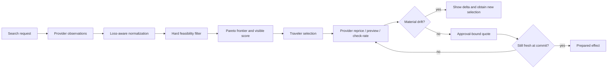
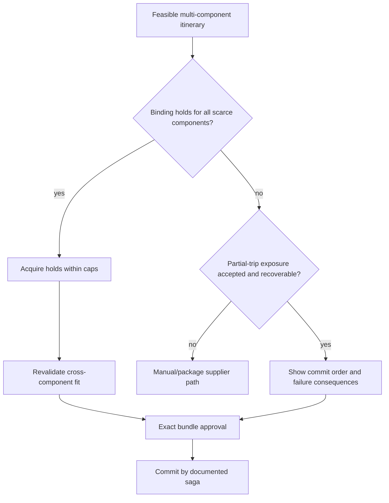

# Search, Quotes, Rules, Inventory, and Planning

Status: production design guide  
Last reviewed: 2026-08-31

Travel search returns expiring observations from heterogeneous channels. The core planning problem is therefore not “find the cheapest trip.” It is: retrieve correctly scoped evidence, reject hard-infeasible combinations, compare total value without erasing conditions, refresh the chosen product, and bind an approval to what can actually be committed.

## Commercial evidence lifecycle



Do not merge search and booking into one opaque model tool. Each transition has different evidence and authority.

## Search request contract

Canonicalize only after confirming ambiguity with the traveler:

```yaml
search_request:
  request_id: srch_443
  journey_id: jny_740
  itinerary_revision: 7
  point_of_sale: IN
  currency: INR
  travelers:
    - traveler_id: trv_01JZ...
      provider_passenger_type: ADT
      age_at_travel: 36
    - traveler_id: trv_01KA...
      provider_passenger_type: ADT
      age_at_travel: 34
  components:
    - type: air
      origin: {type: airport, code: DEL}
      destination: {type: airport, code: BLR}
      departure_window:
        start: 2026-10-07T13:00:00+05:30
        end: 2026-10-07T19:00:00+05:30
      cabin: economy
      maximum_connections: 1
    - type: hotel
      location: {type: geo, latitude: 12.9716, longitude: 77.5946}
      check_in: 2026-10-07
      check_out: 2026-10-09
      occupancies:
        - adults: 2
          children_ages: []
  hard_constraints_ref: constraints://jny_740/rev_7/hard
  soft_preferences_ref: constraints://jny_740/rev_7/soft
  service_need_refs: [need_mobility_3]
  signature: sha256:...
```

Passenger type, residency, nationality, age, occupancy, room count, point of sale, and currency can alter availability or price. Include only the provider-required attributes and log the purpose. Never reuse results across materially different signatures.

## Provider freshness is contractual

Examples verified on 2026-08-31 illustrate why freshness belongs in adapter policy:

| Provider/channel example | Publicly documented behavior | Engineering consequence |
|---|---|---|
| Duffel air offers | Offer usually expires in roughly 30 minutes and exposes `expires_at`; provider recommends retrieving current offer and does not guarantee availability until booking | Persist exact expiry and retrieve/reprice before approval/commit; never invent a universal 30-minute TTL |
| Travelport Flights v11 | Public guide documents distinct cache/workbench windows, including different GDS and NDC behavior | Pin channel/content source and provider guide version; a GDS cache rule cannot be copied to NDC |
| Booking.com Demand Orders | `/orders/preview` validates allocation/final price/payment and returns a token documented with a 15-minute expiry | Approval binds the preview token/terms; create uses the exact products from preview |
| Expedia Rapid lodging | Price Check produces a short-lived booking link/token and can return changed-price or unavailable responses | Treat Price Check as the approval boundary; follow returned links rather than constructing URLs |
| Hotelbeds | `rateKey` is opaque; CheckRate is required when a rate is marked `RECHECK` | Never parse or mutate the key; conditional recheck belongs to the adapter |
| OSDM rail | Offer/booking behavior and version support vary by retailer/provider implementation | Qualify exact tagged schema and implementation; do not infer behavior from “OSDM 3.x” alone |
| Booking.com Demand Cars | Stable v3.1/v3.2 public flow is search/look/redirect; end-to-end availability, terms and order creation are documented as specially enabled v3.2 beta | Keep stable search/retrieve separate from beta write capability; never promote beta endpoints or tokens by provider name alone |

These are examples, not cross-provider rules. Store provider-tested behavior in the capability registry and expire it for requalification.

### Freshness state

```text
current     provider quote/offer is inside documented expiry and inputs match
refresh_due internal conservative threshold reached, though provider expiry may remain
expired     provider or internal hard limit passed
superseded  a newer snapshot for the same selected product exists
invalid     traveler/itinerary/point-of-sale/material input changed
unknown     provider did not expose sufficient semantics or clock uncertainty is material
```

Clock synchronization is a dependency. Store provider time when supplied, local receipt time, measured skew, and a safety margin. A deadline within the uncertainty margin is not safe to commit.

## Loss-aware normalization

Normalize fields needed for comparison, but retain raw provider artifacts and provider-native conditions.

### Air fields

- marketing and operating carrier, flight/train/bus segment type, aircraft/equipment where supplied;
- origin/destination, terminal, local time, time-zone/offset, UTC instant, elapsed and connection time;
- cabin and booking class, brand/fare family, passenger-level products;
- total/base/taxes/mandatory fees, currency, point of sale, payment fee treatment;
- included/chargeable baggage by traveler/segment, seats, meals, lounge, priority, emissions if sourced;
- change/refund/void conditions before and after departure, no-show, minimum/maximum stay where supplied;
- ticketing time limit, offer/order expiry, hold terms, validating/fulfilling party;
- service-request support/acknowledgement and accessibility data.

Check minimum connection time using a qualified source for airport, terminals, carriers, international/domestic transition, and date. A model estimate is not a connection rule. Codeshare presentation must expose operating carrier because service, rights, check-in, baggage, and accessibility handling can differ.

### Hotel fields

- property stable/provider ID, location and map confidence, check-in/out local time and time zone;
- room/product ID, occupancy, bed type as requested/guaranteed/unknown, accessibility attributes with evidence;
- nightly/total price, taxes, property charges, mandatory on-site fees, pay-now/pay-later, currency and conversion terms;
- cancellation/no-show schedule with deadline, destination-local time, amount/percentage/nights, and source;
- meal plan, resort/destination fees, deposit, preauthorization, special request guarantee status;
- supplier/property confirmation IDs, check-rate/preview token, expiry and rate comments.

Do not compare room “names” as stable products. Bind provider product/rate IDs and occupancy. A special request is not a guaranteed room feature unless the contract says so.

### Rail fields

- retailer/provider, operator(s), service/train, station codes, local times/time zones, interchange details;
- fare/product, class, reservation/seat, passenger type, route validity and carrier restrictions;
- fulfillment method/document, collection requirement, booking/fulfillment expiry;
- exchange/refund fees and deadlines, after-sales capability, promotion/discount entitlement;
- assistance/service request and station/boarding dependencies.

Through-ticket or passenger-rights implications are jurisdictional and product-specific. Do not infer protection merely because segments appear in one itinerary display.

### Car-rental fields

- retailer/intermediary, rental company/fulfiller, depot identity, pickup/drop-off address, opening hours, terminal/shuttle instructions and local zone;
- driver identity reference, age at pickup, residency/licence assertions only where required, additional drivers, country/one-way/cross-border restrictions;
- vehicle category/class, transmission, seats, baggage capacity, fuel/energy policy, mileage, emissions-zone/equipment facts and make/model guarantee status;
- base/estimated total, mandatory taxes/fees, young/senior driver/one-way/location fees, deposit/preauthorization, pay-now/pay-at-counter, charge currency and conversion;
- included/optional protection and excess/deductible with issuer/scope/exclusions, without presenting insurance/legal adequacy as model advice;
- extras such as child seat, accessibility controls or snow equipment as requested/confirmed/collected states;
- availability/terms/search token, cancellation/no-show schedule, late-arrival policy, flight-number need, voucher/confirmation and after-sales owner.

“Or similar” means a category promise, not the pictured make/model. A reservation does not prove a vehicle is physically ready at pickup, an optional extra is installed, the driver's licence will be accepted, or the payment card/deposit requirement is satisfied. Keep those as explicit confirmation or counter-verification states.

## Party, entitlement, and loyalty scope

One search request can contain people whose prices, eligibility, fulfillment and after-sales rights differ. Preserve the provider's grouping rules rather than assuming a homogeneous party.

| Product | Party constraints to model | Safe failure behavior |
|---|---|---|
| Air | Passenger type/age on travel date, infant-to-adult association, fare availability for all passengers, married segments, name/document timing, loyalty/benefit applicability per operating/marketing carrier | If one traveler cannot price or fulfill, return a typed partial/infeasible result; never silently split the party or reclassify a passenger |
| Hotel | Room-by-room adult/child ages, maximum occupancy, bed/accessibility guarantee, lead guest, multi-room atomicity and property-age rules | Preserve room-level results; a partial room set is not a valid whole-party option unless explicitly accepted |
| Rail | Passenger age/discount card/residency entitlement, reservation availability, companion/dependent relationship, through-ticket/product coupling | Validate entitlement at travel date and fulfillment; never apply one traveler's discount or seat to the party |
| Car | Primary/additional driver age, licence/residency assertions, cardholder/deposit, cross-border/one-way permissions, child/accessibility equipment | Fail closed or hand off at material unknown; never substitute driver, payment holder, depot or vehicle category silently |

Loyalty numbers and status are profile-owned references with version, consent, program and traveler scope. Benefits are treated as provider-observed entitlements, not assumed from stored status; a price that depends on membership must disclose that scope. Do not let loyalty value override safety, accessibility, policy, or fair disruption prioritization.

## Conditions are three-valued

For every material term use `known`, `unknown`, or `not_applicable`, plus the parsed value and raw source. Do not encode missing data as `false` or `free`.

```yaml
condition:
  kind: voluntary_refund_before_departure
  knowledge: unknown
  value: null
  parser_reason: provider_returned_null
  source_ref: artifact://offers/ofs_air_827/conditions
  observed_at: 2026-08-31T04:05:12Z
  user_disclosure: Refund conditions were not supplied in a structured form.
  action: retrieve_raw_rule_or_manual_review
```

Duffel explicitly documents that null order conditions mean unknown, not necessarily disallowed. Apply that discipline across providers unless a contract establishes different semantics.

### Rule processing pipeline

1. Store the raw rule/rate/cancellation artifact.
2. Parse only fields supported by a versioned adapter.
3. Validate currency, units, time zone, applicability, passenger/product/segment scope, no-show and before/after-departure context.
4. Mark unsupported or contradictory clauses `unknown`.
5. Run deterministic rule calculations where the provider supplies enough structure.
6. If a model explains raw prose, give it the exact excerpt and prohibit eligibility/fee calculation beyond parsed fields.
7. Show the source, observation time, scope, and unresolved uncertainty at approval.
8. Re-retrieve or quote the after-sales action before commit; original-booking rules are not a live refund quote.

## Feasibility before ranking

Hard filters should include applicable:

- traveler/passenger and occupancy eligibility;
- origin/destination/date/time windows and local-day semantics;
- ticketing, check-in, arrival, connection, and hotel check-in/out compatibility;
- provider-supported route/content/product/payment/after-sales capability;
- total spend and travel policy, including fees known at the decision point;
- passport/document validity assertions only if sourced and policy-defined, never border eligibility conclusions;
- confirmed support for required accessibility/service needs or an explicit escalation path;
- provider limits such as passenger count, infant handling, room count, split tender, group booking, or offline fulfillment;
- conflict with already committed itinerary products;
- safety/duty-of-care restrictions from the owning policy service.

An unknown hard condition produces `unknown`, not `feasible`. The policy decides whether `unknown` means exclude, manual review, or show with a strong warning; T3 commit should fail closed for material unknowns.

### Deterministic itinerary planner

Represent the trip as a time-dependent graph whose edges are source-backed products and whose nodes include location plus local/UTC time state. Add cross-component constraints such as transfer time and hotel night coverage. The planner returns a bounded set:

```yaml
planner_result:
  status: feasible
  solver_version: travel-constraint-solver-3.4.1
  input_snapshot_ids: [ofs_air_827, ofs_hotel_228, transfer_matrix_77]
  hard_constraints_version: constraints-jny740-r7
  candidates: [itc_1, itc_2, itc_3]
  rejected_counts:
    arrival_window: 42
    connection_rule: 8
    budget: 11
    service_need_unconfirmed: 2
  optimality: pareto_frontier_complete_within_input_set
  elapsed_ms: 87
```

If enumeration times out, expose `partial` and the searched boundary. Do not let the model call a partial set “best.”

## Transparent ranking

After hard feasibility, calculate normalized soft criteria and present a Pareto frontier where appropriate.

```text
score = 0.30 * total_price
      + 0.25 * arrival_fit
      + 0.15 * elapsed_time
      + 0.10 * connection_burden
      + 0.10 * changeability
      + 0.10 * explicit_preference_match
```

The exact weights are a product decision and must be visible, versioned, and testable. Never infer a hidden willingness to pay from wealth, employer, device, browsing history, protected characteristics, or prior emergencies. Loyalty and stored preferences require purpose/consent and should not override hard safety/accessibility needs.

Show at least:

- total payable at the relevant step and what may still be charged at property/supplier;
- operating suppliers, times/time zones, stops/connections/transfers;
- included and excluded products;
- known change/refund/cancellation conditions;
- accessibility/service confirmation status;
- freshness/expiry and coverage limitations;
- why it was ranked and which feasible trade-offs differ.

Avoid dark patterns: no preselected insurance/ancillary, false scarcity, hidden sponsored ranking, or unexplained default substitution.

## Material-change policy

Compare the fresh approval quote to the selected snapshot field by field.

| Change | Material by default? | Response |
|---|---|---|
| Any traveler/passenger/occupancy | Yes | New intent/quote and approval |
| Origin, destination, airport/station/property, date, segment topology | Yes | New option selection and approval |
| Operating/fulfilling supplier | Yes | Re-run service, risk, policy, and terms checks |
| Total amount or currency | Yes | Show exact delta and reapprove; do not auto-accept even a decrease unless policy explicitly permits presentation-only refresh |
| Tax/mandatory fee composition | Yes when payable/rights/accounting changes | Reapprove and retain before/after |
| Cabin/class/brand/room/rate/fare/product | Yes | Revalidate entitlements and conditions |
| Baggage, meals, bed/occupancy, accessibility, seat/reservation | Yes if requested, promised, or policy-relevant | Reapprove or escalate |
| Change/refund/cancellation/no-show terms | Yes | Reapprove; unknown fails closed if material |
| Time/terminal/platform | Policy-defined, usually material near constraints | Re-run feasibility; reapprove if outside disclosed band |
| Provider-generated locator formatting | No if identity unchanged and verified | Record evidence; no commercial reapproval |
| Wording-only explanation | No | Retain same quote hash; audit presentation version |

Compute three hashes: topology/product, price, and terms. Approval stores all three, not one opaque response hash, so operators can see why it invalidated.

## Approval-ready alternative schema

```yaml
approval_proposal:
  proposal_id: prop_66
  action: air_order_create_and_fulfill
  journey_id: jny_740
  itinerary_revision: 7
  traveler_ids: [trv_01JZ..., trv_01KA...]
  provider_capability_id: air_provider_a.order.create.v2.IN
  quote:
    snapshot_id: ofs_air_911
    provider_offer_id: off_0000BJ
    observed_at: 2026-08-31T04:20:12Z
    expires_at: 2026-08-31T04:35:12Z
    price_hash: sha256:...
    terms_hash: sha256:...
    topology_hash: sha256:...
    amount: "119000.00"
    currency: INR
  products_ref: proposal://prop_66/products
  conditions_summary_ref: proposal://prop_66/conditions
  material_unknowns: []
  service_requests:
    - request_id: sr_204
      current_status: supported_for_request
      confirmation_expected_after_booking: true
  payment_reference: paymethod_tok_8
  policy_decision_ref: policy://decision/921
  consequences:
    cancellation: provider_quote_required
    change: manual_only_in_this_release
    fulfillment: electronic_ticket_expected_for_each_traveler_segment
  approval_expires_at: 2026-08-31T04:33:12Z
  proposal_hash: sha256:...
```

The approval UI expands product and condition records; it never asks the traveler to approve a hidden reference. Keep approval expiry earlier than provider expiry by a tested commit safety margin.

## Quote and search caching

Cache only when semantics permit:

| Data | Cache posture |
|---|---|
| Static airport/station/property content | Versioned cache with source update policy; provider IDs retained |
| Car depot/supplier/class content | Versioned cache with operating-hours and location freshness; never proof of live vehicle or counter availability |
| Schedule-like content | Short TTL and operational refresh; not proof of current operation |
| Search results | Signature-scoped, short-lived observation cache; display observed time |
| Reprice/preview/offer | Never reuse across material input change; honor exact expiry |
| Raw rules/conditions | Snapshot with source; re-retrieve for current after-sales quote |
| Provider order | Cache as observation but retrieve before consequential action |
| Document/entry/advisory information | Versioned source and jurisdiction; aggressive freshness and explicit verification boundary |

Cache invalidation follows provider webhooks/events where documented, but an event never extends a quote's commercial validity unless the provider contract says so.

## Planning under multiple suppliers

Air + hotel + rail rarely offers atomic inventory. Before the first effect, compute:

- commit order and why (expiry, reversibility, scarcity, ticketing/hold window);
- the irreversible boundary for each component;
- maximum acceptable partial-trip exposure and spend;
- which holds are truly binding and how they release;
- compensation/cancellation feasibility and expected fees;
- the traveler communication and manual escalation path;
- whether the entire bundle should stay manual.



Never market application-level compensation as an atomic package guarantee. Consumer package-travel rights may apply in some jurisdictions; obtain legal classification and encode it in a policy service rather than inferring it from the UI.

## Failure behavior

| Failure | Safe response |
|---|---|
| One provider returns slowly | Respect deadline; show partial market coverage; do not call result globally cheapest |
| Offer expires during comparison | Mark expired, retain historical evidence, refresh only after user choice or bounded policy |
| Reprice increases price | Show exact old/new totals and term deltas; require new approval |
| Reprice decreases price | Update exact quote and approval; never silently swap product or terms |
| Rate becomes unavailable | Remove from approval set; bounded new search; preserve user preference |
| Structured rule is null | Mark unknown; retrieve raw/details if supported; escalate if material |
| Currency conversion shown | Separate provider charge currency from estimated display currency and rate/time/source |
| Solver times out | Return partial labeled set or deterministic fallback; never invent optimality |
| Required SSR unsupported | Exclude or escalate per traveler need; do not downgrade need silently |
| Property special request unguaranteed | Say unconfirmed; seek a rate/property with evidence or obtain traveler decision |

## Anti-patterns

- Normalizing all supplier conditions into booleans and losing unknown/applicability.
- Ranking before feasibility, then asking the model to excuse a violation.
- Caching by route/date but omitting passenger types, occupancy, point of sale, currency, or product constraints.
- Comparing provider totals without mandatory-at-property charges and currency semantics.
- Treating a hotel image/description, airline brand name, or rail product label as contractual fulfillment.
- Letting the model calculate cancellation/refund amounts from prose when a provider quote endpoint exists.
- Auto-accepting small price drift without an explicitly reviewed materiality policy.
- Calling a limited provider set “the market” or “the cheapest available.”
- Combining independently bookable components and implying atomicity.

## Exercises and exit criteria

1. Search the same route for one adult, an adult + child, and two adults under two points of sale. Exit: signatures and caches cannot cross-contaminate.
2. Reprice an option with the same total but a different operating carrier and refund condition. Exit: approval invalidates for material terms even without price drift.
3. Return `null` refund and change conditions. Exit: the UI, ranker, model explanation, and commit gate all preserve unknown.
4. Produce an air option arriving after hotel check-in cutoff in another time zone. Exit: the deterministic planner rejects or explicitly handles the dependency.
5. Simulate provider time skew near offer expiry. Exit: commit blocks inside the safety margin.
6. Build an air + hotel saga with no hotel hold. Exit: approval displays partial-trip exposure and the workflow has a named recovery owner.

This layer is ready when every displayed option is scoped, sourced, dated, and feasible; every selected option is freshly repriced; every material delta is visible; and no user or model can turn a search observation into an executable effect.

Continue with [providers, tools, security, privacy, and accessibility](05-providers-tools-security-privacy-and-accessibility.md).
