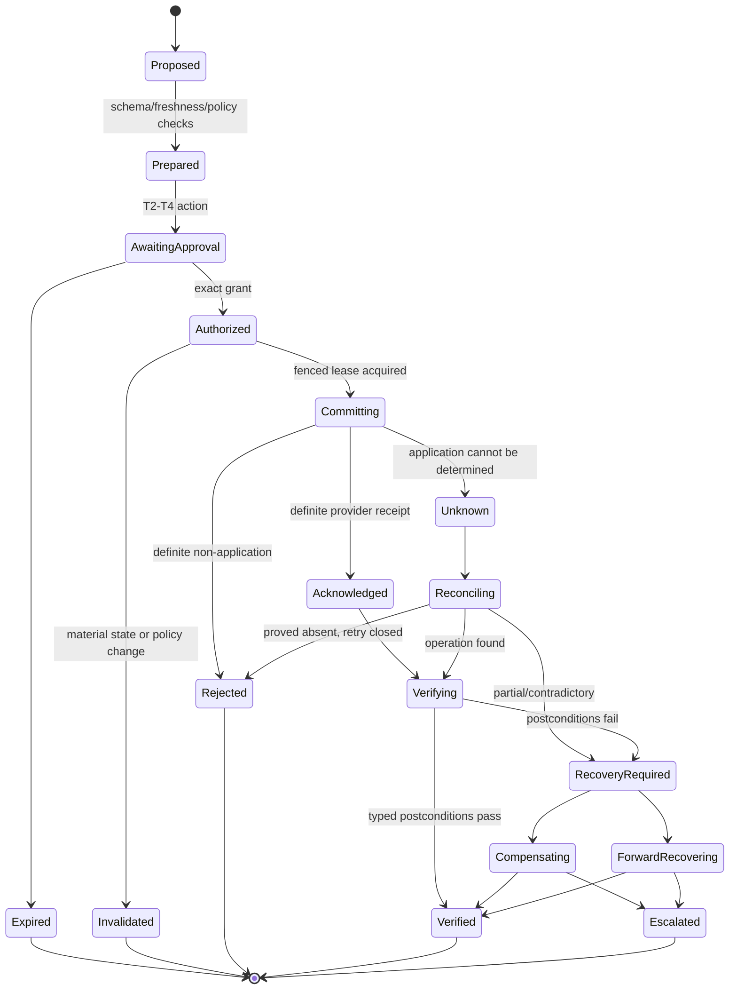
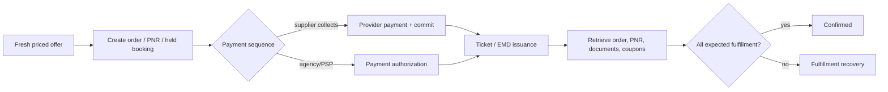
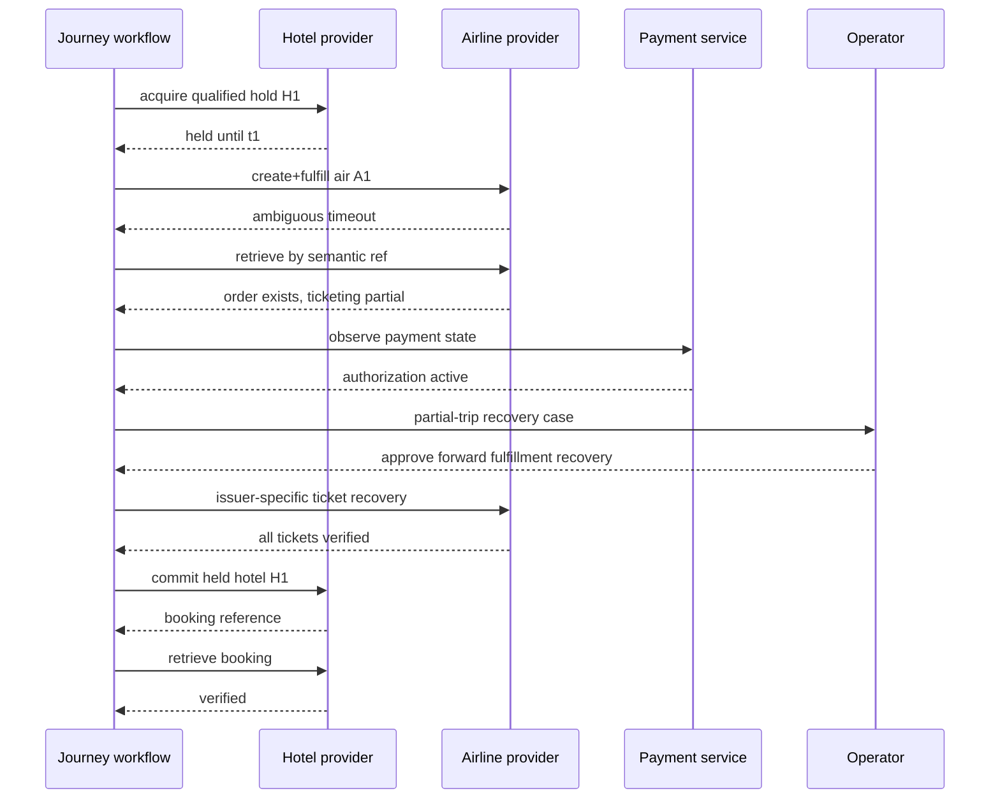

# Booking, Ticketing, Changes, Refunds, and Reconciliation

Status: production design guide  
Last reviewed: 2026-08-31

Travel writes cross inventory, reservation, fulfillment, payment, settlement, notification, and human systems that do not share one transaction. A timeout can happen after a room was booked. A PNR can exist without tickets. One passenger can be ticketed while another fails. A cancellation can succeed while a refund remains pending. Build for precise intermediate states, ambiguous outcomes, and forward recovery.

## Effect protocol

Every consequential action follows:

```text
prepare → authorize → commit → observe → reconcile
```

- **Prepare:** bind exact current state, quote/terms, traveler/products, provider capability, policy, intended transition, pre/postconditions, and recovery.
- **Authorize:** obtain exact authenticated approval or prove a narrow unexpired preauthorization.
- **Commit:** claim a fenced operation lease and dispatch one provider-defined action with the same semantic operation identity across safe retries.
- **Observe:** record acknowledgement/rejection/ambiguity without upgrading it to business completion.
- **Reconcile:** retrieve authoritative supplier/payment state and compare typed postconditions; compensate or forward-recover when partial.



Only `Verified` proves the intended supplier postcondition. An effect can be verified as “booking absent” after a definite rejection; keep outcome and intended-success flags distinct.

## Prepared intent schema

```yaml
prepared_effect:
  effect_id: eff_81
  semantic_operation_id: tenant_acme:air_order_create:jny_740:rev_7:prop_66
  action: air_order_create_and_fulfill
  risk_tier: T3
  tenant_id: tenant_acme
  journey_id: jny_740
  itinerary_revision: 7
  acting_principal_id: usr_17
  traveler_ids: [trv_01JZ..., trv_01KA...]
  provider_capability_id: air_provider_a.order.create.v2.IN
  provider_resource:
    offer_id: off_0000BJ
    content_source: NDC
  expected_versions:
    journey_projection: "188"
    traveler_profiles: {trv_01JZ...: "42", trv_01KA...: "16"}
  commercial_binding:
    quote_snapshot_id: ofs_air_911
    price_hash: sha256:...
    terms_hash: sha256:...
    topology_hash: sha256:...
    total: "119000.00"
    currency: INR
    provider_expires_at: 2026-08-31T04:35:12Z
    commit_deadline: 2026-08-31T04:33:12Z
  payment_reference: paymethod_tok_8
  service_request_ids: [sr_204]
  preconditions_ref: predicates://effects/eff_81/pre
  postconditions_ref: predicates://effects/eff_81/post
  recovery_plan_ref: runbooks://air/create-and-fulfill/v3
  policy_decision_ref: policy://decision/921
  approval_requirement: exact_T3
  prepared_at: 2026-08-31T04:21:00Z
  intent_hash: sha256:...
```

The semantic operation ID represents one business intent, not one network attempt. A retry reuses it. Any material change creates a new proposal/effect and approval. Enforce uniqueness in the effect ledger before dispatch and pass the provider's documented idempotency/client reference field.

## Exact approval

The approval record binds:

- authenticated approver and acting-for/traveler relationship;
- action and authority tier;
- all travelers, components, products, provider/channel, and operating/fulfilling parties;
- exact total, currency, taxes/fees treatment, payment reference, and maximum if applicable;
- departure/stay dates/times/time zones and product attributes;
- change/refund/cancellation/no-show terms and material unknowns;
- service requests and whether they are requested, acknowledged, or confirmed;
- quote, itinerary, terms, price, topology, provider capability, policy, and prepared-intent hashes;
- expiry and material-change policy;
- expected fulfillment and recovery/partial-trip consequences.

Free text such as “looks good,” a prior trip policy approval, or selection of a search result is not permission to book. The approval service emits a signed grant after an accessible confirmation interaction. Immediately before dispatch, recheck identity assurance, delegation, grant, quote, provider qualification, policy, versions, and kill switches.

### Invalidation rules

Invalidate when a bound traveler, date, place, product, supplier, itinerary topology, price/currency, material term, service request, payment reference, policy outcome, provider capability, or expected source version changes. A deny-only emergency control can stop an approved action. No policy refresh may silently broaden an existing approval.

## Commit transaction boundary

Inside the coordination database, atomically:

1. verify the prepared intent is immutable and unique;
2. acquire a fencing lease for journey + supplier booking/order key;
3. re-evaluate preconditions and exact grant;
4. append `effect.commit_started` with attempt ID and intent hash;
5. enqueue an outbox dispatch referencing the already stored intent.

The network call happens outside the database transaction. The adapter stores request hash, provider request ID/client reference, connection phase evidence, response artifact, parsed result, and timestamps. A process crash after dispatch but before response persistence is `unknown`, not “not sent.”

## Retry classification

| Observation | Classification | Safe action |
|---|---|---|
| Local validation fails before outbox | Definite not sent | Correct input through a new prepared intent if material |
| Credential unavailable before connection | Definite not sent | Refresh same scoped credential if quote/approval remain valid |
| Provider 4xx/business rejection documented as non-application | Definite rejected | Record, explain, optionally replan; no blind retry |
| 429/5xx documented safe before provider processing | Contract-specific transient | Same semantic ID, bounded backoff, deadline awareness |
| Connect failure proved before request bytes | Definite not sent under transport evidence | Bounded retry same intent/key |
| Timeout/reset after possible send | Unknown | Reconcile before another write |
| 2xx/202 with provider reference | Acknowledged | Retrieve by reference; verify expected products/documents |
| Response parse/schema error after 2xx | Unknown | Preserve raw artifact and retrieve; do not assume failure |
| Partial per-traveler/item result | Partial | Preserve successful items; block batch replay; recovery plan |
| Payment success but supplier unknown | Cross-domain partial/unknown | Reconcile supplier; coordinate payment hold/reversal by runbook |

Retry limits include attempts, elapsed time, quote/approval deadline, provider quota, and a named terminal owner. Search retries cannot consume the quota or queue capacity reserved for write reconciliation.

## Reconciliation comparator

Compare three evidence sets:

1. **Intent:** exact desired state and expected travelers/products/documents.
2. **Attempt/receipt:** what transport/provider acknowledged, including item-level outcomes.
3. **Actual:** fresh supplier order/PNR/booking/fulfillment plus payment status where relevant.

```text
if actual satisfies all typed postconditions:
    mark verified; close obligations; publish precise outcome
elif actual proves no application and intent remains fresh/authorized and retry budget remains:
    retry the same semantic operation id
elif actual is unavailable or causality cannot be established:
    keep unknown; schedule bounded read-back; suppress conflicting writes; escalate by age
else:
    mark recovery_required; preserve partial state; execute approved compensation/forward recovery
```

### Read-back hierarchy

Prefer:

1. lookup by provider idempotency/client/affiliate reference;
2. operation/job status by receipt ID;
3. order/booking retrieve using returned supplier identifiers;
4. current provider resource plus its event/history endpoint;
5. paired channel/carrier record where the contract requires both;
6. qualified human confirmation with captured source evidence.

Email is a notification artifact, not the first authoritative source. If no method can distinguish applied from absent, do not enable automatic create retries.

### Booking postcondition example

```yaml
postconditions:
  supplier_order:
    provider: air_provider_a
    expected_travelers: [trv_01JZ..., trv_01KA...]
    expected_segments: [seg_1, seg_2]
    expected_products: [air_product_1, air_product_2]
    total:
      amount: "119000.00"
      currency: INR
      tolerance: "0.00"
  fulfillment:
    required_documents:
      electronic_ticket:
        count: 2
        coupon_mapping: every_traveler_every_air_segment
    service_requests:
      sr_204: at_least_acknowledged
  payment:
    reference: payment_case_77
    permitted_states: [authorized, captured]
  freshness:
    supplier_readback_max_age_seconds: 30
```

The comparator understands provider product mapping. Text similarity, a top-level `confirmed` flag, or the model's interpretation cannot satisfy it.

## Air booking and ticketing

Provider flows differ, but the coordinator should preserve these stages:



Travelport documents GDS ticket issuance through a host and NDC fulfillment directly with the airline; other providers and carriers vary. Keep `reservation`, `payment`, and `fulfillment` sub-states even if an API combines calls.

### Ticketing time limits and voids

A held booking or PNR may have a ticketing time limit distinct from quote/hold expiry. Record the provider source and a timer. If fulfillment does not complete before the safe margin, retrieve, stop conflicting actions, and escalate.

A void is not a refund. It generally applies within a provider/market/issuer window and restores ticket state under specific rules. Quote or verify void eligibility immediately before the action, bind exact documents, and read back coupon/payment consequences.

### Partial fulfillment

If a PNR/order exists but one ticket or EMD fails:

- preserve the live reservation and every issued document;
- do not replay the whole booking request;
- retrieve carrier/GDS order and coupon/document status;
- identify ticketing time limit and passenger/product affected;
- follow the issuer/provider recovery path or create a manual ticketing case;
- coordinate payment authorization/capture state without guessing reversal;
- inform the traveler using precise `reserved, fulfillment incomplete` language;
- block downstream check-in/confirmation claims until reconciled.

## Hotel booking

The generic safe flow is Search → CheckRate/Price Check/Preview when required → exact approval → Create → Retrieve. Provider-specific tokens/links are opaque and short-lived.

Expedia publicly advises reusing the same `affiliate_reference_id` for a retry and retrieving when a response is missing; its common-error guidance emphasizes retrieve to establish final booking status. Hotelbeds advises against blind resend on errors, documents a sufficiently long booking timeout, and requires CheckRate only for `RECHECK`. Booking.com documents preview as final allocation/price/payment validation. Encode each provider's semantics independently.

### Hotel postconditions

Verify:

- property, check-in/out dates and destination-local zone;
- exact room/product count, occupancy and traveler mapping;
- rate/payment model, total and currency, mandatory/property charges known at booking;
- cancellation/no-show schedule and local deadlines;
- property/supplier confirmation references;
- special/accessibility request state without upgrading an unguaranteed request;
- payment status and pay-at-property obligations;
- retrieve status after create, including partial/multi-room cases.

A 204 or success body that requires later retrieval remains acknowledged until retrieve proves the booking.

### Holds

A provider hold has its own semantic ID, release obligation, expiry, price/inventory guarantee, and retrieval path. Auto-release is still an external provider behavior to observe. If hold/release outcome is unknown, do not acquire a replacement that could create duplicated scarce inventory without applying the provider-specific recovery policy.

## Rail booking and fulfillment

OSDM separates offers, bookings, fulfillments, and after-sales conceptually, but exact retailer/provider support varies. Bind the exact negotiated media version and implementation.

Verify retailer, product provider/operator, passengers, legs, fare/products, reservations/seats, fulfillment documents or collection instructions, price/currency, validity, and after-sales conditions. A booking can require a separate fulfillment operation; do not call it travel-ready until the required document/delivery state exists.

## Car-rental booking and pickup readiness

Qualify Search → Availability → Terms → Preview → Create → Retrieve separately. As of 2026-08-31, Booking.com publicly documents stable car search/look/redirect and order reporting, while end-to-end v3.2 availability/terms/booking and live post-booking functions are beta/specially enabled. That makes it a useful qualification example, not a default production write path.

Verify before presenting the reservation as ready:

- exact driver(s), pickup/drop-off depot and destination-local date/time, opening hours, shuttle/terminal instructions and late-arrival policy;
- rental supplier/intermediary, vehicle category and guaranteed attributes, not merely an example make/model;
- base/total/mandatory-counter charges, charge currency, deposit/preauthorization, pay-now/counter collection and payment-card-holder requirements;
- mileage, fuel/energy, one-way/cross-border, driver-age/licence/residency, no-show/cancellation, protection/excess and extras terms;
- provider order/reservation and voucher/confirmation retrieval, cancellation/modify owner and supplier contact path.

Keep these states separate: `reserved`, `voucher_issued`, `pickup_requirements_disclosed`, `supplier_counter_verified`, `vehicle_collected`, `vehicle_returned`, `counter_charge_pending`, and `deposit_release_unconfirmed`. The agent cannot verify licence acceptance, physical vehicle availability, installed extras, damage, return condition or deposit release from the booking response.

If the counter cannot honor the booking, retrieve the reservation and accepted terms, record supplier evidence, evaluate safe transport alternatives, and escalate. A replacement rental is a new purchase; a category substitution, new deposit, different fuel/protection term, new driver, or different depot requires exact informed choice unless a tested standing instruction covers it.

## Changes and exchanges

A change is not an edit to an itinerary row. It can require repricing residual travel, collecting additional amount, refunding residual value, exchanging/reissuing documents, creating new fulfillment, cancelling old coupons/products, and preserving service requests.

### Change workflow

1. Retrieve current supplier order/booking and all fulfillment/coupon/product states.
2. Classify voluntary versus involuntary/schedule-change path using provider evidence and policy.
3. Request provider-supported change/exchange options or quote; never calculate from original rule prose alone.
4. Build before/after topology, price, fees, residual/refund, supplier, service, and document comparison.
5. Re-run feasibility, downstream component dependencies, accessibility and document-information checks.
6. Obtain exact approval unless a specific disruption preauthorization applies.
7. Commit with a new semantic operation ID for this change, linked to the original order.
8. Retrieve new and old order/document/coupon states.
9. Verify old products are in the intended exchanged/cancelled state and new products are fulfilled.
10. Reconcile additional collection/refund and update downstream journey obligations.

Travelport's public v11 material distinguishes exchange, refund, void, cancel, GDS, NDC, voluntary and involuntary functions and documents capability gaps. Never expose a generic `change_trip` effect that hides those choices.

## Cancellation

Cancellation is a consequential effect with its own quote, approval, commit, and verification.

```yaml
cancellation_proposal:
  supplier_order_id: sord_55
  scope:
    travelers: [trv_01JZ...]
    products: [air_product_1]
    documents: [ticket_1]
  provider_quote:
    quoted_at: 2026-09-03T08:00:00Z
    expires_at: 2026-09-03T08:10:00Z
    cancellation_fee: {amount: "6000.00", currency: INR}
    estimated_refund: {amount: "53500.00", currency: INR}
    knowledge: known
  consequences:
    other_traveler_may_be_affected: false
    downstream_hotel_requires_review: true
    service_requests_cancelled: [sr_204]
  provider_quote_ref: artifact://aftersales/cq_91
  proposal_hash: sha256:...
```

Before commit, re-retrieve current coupon/product state and requote if required. After commit, verify exact cancellation scope. Do not assume cancelling one passenger/product is supported or isolated; provider behavior controls.

### Cancellation is not compensation

If a later component fails after an earlier booking succeeds, cancelling the earlier component is a new action that may be impossible, costly, slow, or require a separate approval. “Compensating transaction” means an explicit business recovery action, not a database rollback and not guaranteed restoration.

## Refunds and money state

Keep this ladder:

```text
refund eligibility/quote
→ refund action approved
→ supplier refund request acknowledged
→ supplier refund processed/reference issued
→ acquirer/PSP/payment rail observes movement
→ finance settles/reconciles
→ customer-facing funds-returned claim, if supported by evidence
```

Jurisdictional obligations can alter who must refund, whether it is automatic, timing, form of payment, and ancillary treatment. The U.S. DOT 2024 automatic-refund rule defines cancellation/significant-change and timing obligations, but DOT's ticket-refund pages also list later enforcement actions/discretion through July 2026. EU EC261 and rail Regulation 2021/782 have different scopes and remedies. Do not encode legal deadlines in a prompt. A versioned jurisdiction/policy service with legal review returns applicable obligations and source/effective date.

### Refund record

```yaml
refund_case:
  refund_case_id: rfd_22
  trigger: traveler_requested_cancellation
  jurisdiction_decision_ref: policy://passenger-rights/dec_778
  supplier_order_id: sord_55
  document_refs: [ticket_1]
  provider_quote_ref: artifact://aftersales/rq_92
  approved_amount: {amount: "53500.00", currency: INR}
  original_payment_ref: payment_case_77
  supplier:
    request_status: processed
    refund_reference: rfr_111
    processed_at: 2026-09-03T08:05:00Z
  payment:
    status: pending
    last_observed_at: 2026-09-03T08:06:00Z
  finance:
    status: unreconciled
  next_check_at: 2026-09-04T08:06:00Z
  escalation_deadline_ref: policy://passenger-rights/dec_778
```

No model-generated expected arrival date is shown as fact. If the payment service gives a range, cite it as that service's estimate.

## Multi-supplier saga

There is no distributed transaction across airline, hotel, rail, payment, and traveler communications.



Choose order using documented hold/expiry, irreversibility, scarcity, payment exposure, and recovery capability. Record the decision. If partial exposure is unacceptable, use a package/retailer/manual path that contractually owns it.

### Saga record

| Field | Meaning |
|---|---|
| Component/effect graph | Dependencies and serialization keys |
| Commit order | Exact reason and expiry assumptions |
| Irreversible boundary | Point after which cancellation/compensation may cost or fail |
| Exposure cap | Maximum amount/duration/components allowed in partial state |
| Compensation candidates | Provider-quoted actions, required approvals, deadlines, fees |
| Forward-recovery candidates | Complete fulfillment, rebook alternative, extend hold, manual issue |
| Traveler communication | Precise templates for partial/unknown state |
| Terminal owner | Staffed queue with authority and supplier contacts |

## Supplier and accounting reconciliation

Run three layers:

### Immediate effect reconciliation

Seconds/minutes after each write, prove provider state and expected fulfillment. This closes unknown transport outcomes.

### Operational journey reconciliation

On schedule and before key milestones, compare itinerary projection with supplier order/PNR/booking, tickets/vouchers/rail documents, service requests, schedule/status, and contact obligations. Detect out-of-band supplier/agent changes.

### Financial/settlement reconciliation

Daily or contract-driven jobs match supplier sales/refunds/fees, payment authorization/capture/refund, BSP/GDS/provider reports, and finance entries. The travel agent creates discrepancies and evidence; finance owns journal/settlement correction.

```yaml
reconciliation_discrepancy:
  discrepancy_id: rec_991
  type: supplier_refund_without_payment_movement
  supplier_order_id: sord_55
  supplier_evidence_ref: artifact://supplier/refund_111
  payment_reference: payment_case_77
  finance_reference: null
  amount: {value: "53500.00", currency: INR}
  first_detected_at: 2026-09-05T00:05:00Z
  age_seconds: 172800
  severity: high
  owner: finance_reconciliation_queue
  travel_case_owner: queue_travel_ops_india
  status: open
```

Do not automatically create accounting entries from model output or supplier narrative. Use deterministic matching, tolerances, and finance approval.

## Out-of-band changes

Travelers, carriers, hotels, rail operators, consolidators, or support staff may modify bookings outside the agent. Provider retrieval can supersede the local projection, but not silently:

1. store new raw observation and source/version;
2. compare with the last verified projection;
3. classify the delta and likely source if evidenced;
4. invalidate stale proposals/approvals;
5. recompute downstream itinerary/service/document obligations;
6. notify traveler/operator according to policy;
7. never “restore” prior state with an automated write unless a new approved recovery action exists.

## Cancellation and compensation decision table

| Situation | First response | Possible recovery | Prohibited shortcut |
|---|---|---|---|
| Create definitely rejected | Record absent; release/payment action per sequence | Reprice alternative and reapprove | Retry with new key without fixing cause |
| Create timeout, no locator | Reconcile by client ref and resource state | Same-key retry only after proved absent | Blind create |
| PNR/booking exists, fulfillment missing | Retrieve documents/time limits/payment | Complete fulfillment or manual issuer path | Recreate whole order |
| One room/passenger succeeds | Preserve success, block batch retry | Complete remaining, cancel exact success if approved, or forward-recover | Replay entire batch |
| Hotel succeeds, air fails | Evaluate hold/cancel terms and traveler exposure | New air, approved hotel cancellation, manual bundle resolution | Assume hotel cancellation is free |
| Cancellation accepted, refund absent | Track refund case and policy deadline | Supplier/payment/finance escalation | Say “refunded” |
| New booking succeeds, old exchange state unclear | Retrieve both orders/documents/coupons | Provider exchange recovery/manual case | Cancel old product speculatively |
| Provider data contradicts payment | Preserve both and open cross-domain reconciliation | Evidence-led operator resolution | Modify one store to match the other |

## Runbook: commit outcome unknown

1. Stop retries and conflicting writes for the resource/journey.
2. Preserve attempt, request hash, connection/timeout evidence, provider request/client reference, quote/approval, and payment state.
3. Query the provider by semantic/client reference, then receipt/job, then order/booking search under the contract.
4. If found, retrieve all travelers/products/documents and compare postconditions.
5. If proved absent and quote/approval remain valid, retry the same semantic operation under the bounded policy; otherwise reprice/reapprove.
6. If partial or contradictory, enter recovery; do not batch replay.
7. Escalate at the provider/action-specific age threshold with deadlines and supplier contacts.
8. Communicate `processing/verification required`, never false failure or success.
9. Close only with verified applied, verified absent, or a human resolution receipt.

## Runbook: suspected duplicate booking

1. Activate provider/action write kill for the affected semantic key scope.
2. Retrieve bookings/orders by traveler, trip, client refs, supplier refs, and payment refs using authorized tools.
3. Build a comparison without exposing locators broadly.
4. Identify which effect/attempt created each booking; preserve audit and raw responses.
5. Do not auto-cancel either booking until fulfillment, rules, payment, traveler intent, deadlines, and downstream components are known.
6. Route to an operator with supplier authority; obtain exact cancellation/void quote and approval or incident-authorized recovery.
7. Reconcile payment/refund and notify the traveler precisely.
8. Keep the write capability disabled until the retry/idempotency defect is contained and regression-tested.

## Human takeover and restart-safe operator commands

Handoff is a state transition, not a transcript paste or transfer of an unrestricted provider session.

```yaml
operator_case_claim:
  case_id: case_991
  scope: {tenant_id: tenant_acme, journey_id: jny_740, effect_id: eff_81}
  reason: fulfillment_partial
  claimed_by: operator_44
  role: air_ticketing_IN
  assurance_ref: authn://stepup/771
  lease: {epoch: 8, expires_at: 2026-08-31T04:45:00Z}
  allowed_commands: [retrieve_order, retrieve_tickets, request_manual_issue, propose_void]
  forbidden_commands: [new_order_create, change_traveler, expose_payment_credential]
  continuity_receipt_ref: ctr_944
  evidence_high_watermark: "1902"
```

1. The workflow fences automated conflicting writes, snapshots its signed continuity receipt, and creates an accessible case with facts, inferences, unknowns, clocks, effects and source links.
2. The operator authenticates and claims a short lease for the exact resource/action. The provider session/credential is audience- and role-scoped; protected values open only in the controlled workbench.
3. Every operator action is a typed command with preconditions. Consequential supplier actions still create a semantic effect, require approval/incident authority, and pass through the effect ledger where technically possible.
4. Manual phone/terminal/provider-portal work records channel, authenticated operator, supplier contact/reference, request/response evidence, occurrence/observation time and confidence. Prose cannot directly set `verified`.
5. Automation resumes only after lease release/expiry, ingestion of all manual receipts, fresh supplier/payment read-back, effect comparison, version/fence advance and continuity verification.
6. If operator and automated observations conflict, writes remain blocked. An authorized adjudication/correction event selects the projection basis without deleting either observation.

After process or region restart, the same case, effect identity, operator lease epoch, clocks and unknown/partial state are reloaded before any adapter call. A lost UI session does not release inventory authority or authorize replay.

## Invariants and gates

- A semantic operation produces at most one intended external business effect.
- All retries reuse the same semantic identity; attempts remain separately observable.
- No dispatch occurs without current policy, exact approval/preauthorization, qualified capability, fresh quote where required, and fencing lease.
- Acknowledgement is not verification.
- No user-facing fulfillment claim exceeds evidence.
- Unknown/partial effects suppress conflicting writes and have an owner/deadline.
- Cancellation, void, exchange, refund request, supplier refund, payment refund, and financial settlement remain distinct.
- Multi-supplier actions declare partial exposure and recovery before the first write.
- Manual overrides create typed, authenticated, reasoned receipts and never rewrite history.

## Exercises and exit criteria

1. Inject a timeout after each byte/response boundary in air, hotel, and rail creates. Exit: no duplicate confirmed order and every unknown has a deterministic next step.
2. Issue one of two expected tickets. Exit: the system says reserved/partially fulfilled, does not batch replay, and meets the fulfillment escalation SLO.
3. Expire the quote after payment step-up. Exit: supplier commit does not occur; a new quote and approval are required.
4. Cancel one traveler from a shared booking where provider support is unknown. Exit: action stays manual and no other traveler is silently affected.
5. Complete supplier refund but withhold payment movement. Exit: the system communicates the exact stage and creates a finance-owned discrepancy.
6. Modify a booking out of band. Exit: stale approvals invalidate and downstream hotel/service obligations recompute without an automatic restoring write.

Stage 5 is ready only after production-like failure injection proves zero duplicate confirmed effects, complete audit/effect records, reliable supplier read-back, bounded unknown age, precise partial-state communication, and staffed recovery for every qualified action.

Continue with [context, memory, compaction, and continuity](07-context-memory-compaction-and-continuity.md). The shared [idempotency and side-effects guide](../../reliability/idempotency-and-side-effects.md) is normative.
