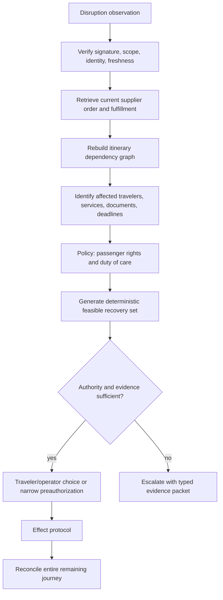

# Disruptions, Duty of Care, Documents, and Escalation

Status: production operations guide  
Last reviewed: 2026-08-31

Disruption turns a planned itinerary into a time-critical coordination problem with unreliable data, shrinking inventory, changing rights, accessibility dependencies, and unreachable travelers. The agent should accelerate evidence gathering and feasible recovery, while becoming less autonomous as facts, authority, or provider capability degrade.

## Disruption contract

A `DisruptionCase` begins from a source-backed observation, not a model prediction presented as fact:

```yaml
disruption_case:
  case_id: dis_301
  journey_id: jny_740
  detected_at: 2026-10-07T10:02:00Z
  trigger:
    type: air_schedule_change
    provider: air_provider_a
    source_event_id: carrier_evt_991
    observed_at: 2026-10-07T10:01:45Z
    confidence: authoritative_provider_event
  affected:
    supplier_order_ids: [sord_55]
    segments: [seg_1]
    downstream_components: [hotel_1, transfer_1]
    travelers: [trv_01JZ..., trv_01KA...]
  impact:
    old_departure: 2026-10-07T15:00:00+05:30
    new_departure: null
    current_provider_status: cancelled
    destination_arrival_constraint_at_risk: true
  clocks:
    traveler_decision_due_at: 2026-10-07T10:30:00Z
    next_supplier_refresh_at: 2026-10-07T10:04:00Z
  reachability:
    status: pending
    channels: [app_push, sms]
  service_requests: [sr_204]
  duty_of_care_decision_ref: risk://decision/991
  passenger_rights_decision_ref: rights://decision/223
  state: assessing
```

Predicted risk may open a lower-severity watch case, but it cannot cancel, rebook, or state that an operation changed without corroborating supplier evidence.

## Detection and impact analysis

Sources may include supplier/GDS/carrier/rail webhooks, schedule/order retrieval, airport/station feeds, weather/safety/advisory services, duty-of-care feeds, traveler reports, or operators. Record source authority and freshness separately.



The dependency graph must consider:

- married/linked air segments, ticket coupons, through itineraries, codeshare and operating carrier;
- rail interchanges, reservation/fulfillment, last-train and station transfer constraints;
- hotel check-in cutoff, first-night/no-show/cancellation consequences, guaranteed arrival arrangements;
- ground transfers, events/meetings, and manually managed components;
- service/accessibility requests at every new operating supplier, airport/station/property;
- document/entry/transit information for new routes and airports;
- traveler location/reachability, traveling party splits, minors/dependents, bags, check-in and airport control;
- payment/approval/standing-instruction limits and partial-trip exposure.

## Evidence hierarchy under disruption

| Evidence | Use | Caution |
|---|---|---|
| Fresh supplier order/operational status | Current booked product and provider action | GDS/carrier/channel can diverge; retrieve the contractually relevant sources |
| Provider-issued disruption alternatives/waiver | Involuntary servicing and commercial rights | Waiver eligibility, expiry, channel, and authority may be specific |
| Current live search/reprice | Candidate availability and price | Not guaranteed before commit; may not encode protected disruption rights |
| Passenger-rights policy decision | Applicable obligations/options with source/effective date | Legal scope and facts must be verified; drafts/enforcement changes are not universal |
| Duty-of-care risk decision | Organizational restrictions and assistance | ISO 31030 applies to organizational travel risk, not a universal leisure rule |
| Government advisory/entry source | Dated safety/entry information | Advisory is not admission decision; can change quickly |
| Traveler report | Location, needs, observed situation | Valuable but may not prove supplier system state |
| News/social media/model inference | Early signal only | Never sole basis for consequential action |

## Recovery decision model

Hard constraints are evaluated first:

- traveler safety and duty-of-care policy;
- current location and physically achievable transfer/check-in time;
- supplier/rights path, ticket/product/coupon state, and available servicing channel;
- required document/transit information and verification boundary;
- accessibility/service/equipment/baggage continuity;
- traveler group cohesion or explicit permission to split;
- deadline, spend, cabin/class/rate, and maximum additional burden;
- downstream hotel/rail/meeting dependencies;
- provider qualification and ability to read back the recovery effect.

Then construct a Pareto set across arrival time, number/burden of changes, price/fee/refund implications, overnight/ground transfer, service confirmation, traveler preferences, and recovery reliability. Label provider-protected versus new-purchase alternatives.

### Recovery proposal

```yaml
recovery_proposal:
  proposal_id: recprop_18
  disruption_case_id: dis_301
  evidence_as_of: 2026-10-07T10:08:00Z
  option_type: carrier_involuntary_reaccommodation
  supplier_quote_ref: artifact://disruption/option_881
  passenger_rights_ref: rights://decision/223
  duty_of_care_ref: risk://decision/991
  before_itinerary_ref: itinerary://jny_740/rev_9
  after_itinerary_ref: itinerary://jny_740/rev_10
  arrival_delta_minutes: 165
  additional_collection: {amount: "0.00", currency: INR}
  refund_or_residual: unknown
  travelers: [trv_01JZ..., trv_01KA...]
  service_requests:
    sr_204: must_be_re_requested_and_confirmed
  document_information:
    new_transit_country: none
    verification_required: false
  downstream_actions:
    - notify_hotel_late_arrival
    - revalidate_transfer
  material_unknowns: [checked_bag_transfer_status]
  expires_at: 2026-10-07T10:18:00Z
  authority: exact_traveler_approval_required
```

If bag status is material, the workflow cannot hide it because the alternative otherwise looks optimal.

## Autonomy during disruption

Default to proposal + exact choice. T4 preauthorized recovery is permitted only for a narrow tested envelope:

```yaml
standing_recovery_instruction:
  instruction_id: sri_22
  traveler_id: trv_01JZ...
  journey_id: jny_740
  triggers: [supplier_confirmed_cancellation, misconnection_confirmed]
  allowed_actions: [accept_supplier_reaccommodation]
  bounds:
    same_travelers: true
    same_origin_destination: true
    departure_shift_minutes: {min: -60, max: 360}
    arrival_delay_minutes_max: 360
    cabin_no_lower_than: economy
    additional_cost_max: {amount: "0.00", currency: INR}
    additional_connections_max: 0
    overnight: false
    new_transit_country: false
    split_party: false
    required_services_must_be_confirmable: true
  excluded: [new_purchase, cancellation, refund_choice, document_uncertainty]
  granted_at: 2026-10-01T00:00:00Z
  expires_at: 2026-10-10T00:00:00Z
  revocation_ref: consent://revoke/sri_22
  signature: ...
```

Even inside the envelope, the effect gateway checks live evidence, provider path, policy, deadlines, and kill state. Notify the traveler immediately with an undo/escalation path where the supplier action allows it. If the standing instruction cannot be proved or any bound is unknown, revert to proposal/escalation.

## Passenger rights and refunds

Rights depend on journey facts, operating carrier/operator, jurisdiction, cause, notice, product/ticket relationship, traveler choice, and current law/enforcement. Examples:

- U.S. DOT's 2024 final rule covers automatic refunds for airline cancellation/significant change and ancillary service failures under defined conditions, with card/other-payment timing; DOT's current refund hub also records later enforcement developments through 2026.
- EU Regulation 261/2004 establishes reimbursement/rerouting/care/compensation concepts for flights within its scope; proposals to amend it are not law merely because they exist.
- EU Regulation 2021/782 defines rail refund/rerouting/assistance and through-ticket-related rights within its scope.
- Accessibility rights and assistance obligations follow separate regimes such as the U.S. Air Carrier Access Act and EU Regulation 1107/2006.

The agent requests a deterministic, versioned `rights_decision`:

```yaml
rights_decision:
  decision_id: rights_223
  jurisdiction: EU
  instrument: Regulation_EC_261_2004
  policy_version: passenger-rights-eu-2026-08-20
  effective_as_of: 2026-10-07
  facts_used_ref: facts://dis_301/rights/v2
  applicable: needs_human_validation
  candidate_obligations: [reimbursement_or_rerouting, care]
  compensation: undetermined
  traveler_choice_required: true
  primary_source_refs: [source://eur-lex/32004R0261]
  expires_at: 2026-10-07T11:08:00Z
  legal_review_owner: travel_legal_eu
```

The model can explain this decision. It cannot determine extraordinary circumstances, eligibility, compensation amount, or legal deadline from memory where the policy service says undetermined.

## Duty of care

ISO 31030:2021 provides organizational travel-risk guidance and was under systematic review on the ISO page as of 2026-04; it explicitly concerns organizations, not consumer leisure travel. Use it to structure an employer's risk program, not as a direct automated travel decision rule.

The duty-of-care owner supplies:

- traveler coverage and risk tier;
- approved/forbidden locations, suppliers, transport modes, or time windows;
- alert thresholds and authoritative intelligence sources;
- reachability/check-in cadence and privacy limits;
- evacuation, shelter, medical/security assistance, and emergency-provider paths;
- who can authorize exceptions and emergency spend;
- local/regional escalation and incident command;
- post-incident review and traveler wellbeing follow-up.

The agent may surface a policy decision and coordinate travel effects. It does not produce a threat assessment from news, diagnose health, dispatch emergency services without a qualified path, or expose traveler location beyond purpose and consent.

### Safety overrides

An emergency deny can stop new travel effects. Any affirmative emergency effect must still come from an authenticated incident authority or preauthorized runbook. “Safety” is not a blanket reason to bypass identity, consent, payment, supplier, or audit controls.

## Document, visa, health, and entry boundary

IATA Timatic supplies current passport, visa, and health requirement information through commercial products; ICAO publishes machine-readable travel document standards and API/PNR guidance. Governments, consulates/embassies, carriers at check-in, and border authorities retain their respective decisions.

The agent may:

- collect minimal trip/document assertions with consent through a protected UI;
- query a qualified authoritative requirements service for exact itinerary/nationality/document facts;
- display the source, checked time, assumptions, transit points, and expiry;
- explain that requirements can change and direct the traveler to the responsible government/embassy/provider;
- create reminders/escalations for expiring documents or unresolved requirements;
- re-run checks after itinerary or transit-country change.

It must not:

- say a traveler “will be admitted,” “does not need a visa,” or is legally eligible based only on model reasoning;
- infer citizenship, residence, passport type, visa, vaccination, or health status;
- copy document images/numbers into prompts, general logs, tickets, or memory;
- answer a different transit/entry scenario using an old lookup;
- complete a legal declaration or attest facts the traveler/authority did not verify;
- bypass carrier/government checks or discourage official verification.

### Information receipt

```yaml
document_information_receipt:
  receipt_id: docinfo_44
  journey_id: jny_740
  itinerary_revision: 10
  traveler_assertion_refs: [passport_assertion_9]
  route_signature: sha256:...
  provider: qualified_requirements_service
  source_updated_at: 2026-10-07T09:55:00Z
  queried_at: 2026-10-07T10:09:00Z
  assumptions:
    residence_country: IN
    document_type: ordinary_passport
    transit_airside: true
  result_ref: protected://document-rules/docinfo_44
  unresolved: []
  validity_for_action_until: 2026-10-07T10:39:00Z
  authority_boundary: Government and carrier/border authorities make final decisions.
```

If a provider says requirements are current but a government practice differs, preserve the conflict and route to verification. IATA itself notes Timatic data and government practice can diverge.

## Accessibility continuity during disruption

Schedule or operator changes can invalidate a previously accepted service request. For every recovery candidate:

1. load the traveler's current functional need and consent from the protected source;
2. map requirements to new suppliers, stations/airports, transfers, equipment, and time;
3. submit provider-specific service requests only after the new product is prepared/committed as the provider requires;
4. distinguish request, acknowledgement, confirmation, and actual delivery;
5. revalidate minimum transfer time with assistance needs, not standard traveler assumptions;
6. keep party/equipment/battery/dimensions/medical-clearance boundaries explicit;
7. escalate if the requested service cannot be confirmed or the provider response conflicts.

Never trade away confirmed assistance for earlier arrival without the traveler's exact informed choice and a safe alternative.

## Escalation packet

Every manual case is actionable without reading the transcript:

```yaml
escalation_packet:
  case_id: case_991
  severity: critical
  queue: in_travel_air_disruption_IN
  tenant_id: tenant_acme
  journey_id: jny_740
  traveler_reachability: pending
  current_location_ref: protected://locations/jny_740/current
  facts:
    - claim: booked_segment_cancelled
      evidence_ref: artifact://provider/status_991
      observed_at: 2026-10-07T10:01:45Z
  inferences:
    - claim: meeting_arrival_constraint_at_risk
      derived_by: itinerary-impact-v4.0
      source_refs: [status_991, itinerary_rev_9]
  unknowns: [checked_bag_status, service_request_on_alternative]
  supplier_state_refs: [supplier_order/sord_55]
  effect_states: []
  deadlines:
    - {kind: provider_option_expiry, at: 2026-10-07T10:18:00Z}
    - {kind: traveler_decision, at: 2026-10-07T10:30:00Z}
  candidate_actions: [accept_option_1, search_protected_alternatives, supplier_manual_reaccommodation]
  forbidden_actions: [new_purchase_without_approval, cancel_original, infer_document_eligibility]
  policy_refs: [rights_223, risk_991]
  service_request_refs: [sr_204]
  provider_contacts_ref: runbook://air-provider-a/escalation
  continuity_receipt_ref: ctr_944
```

Facts, inferences, and unknowns are separate. Protected contact/location/document values remain links with operator authorization.

## Operational runbooks

### Runbook: mass schedule disruption

1. Activate incident command and event/provider-level disruption mode; preserve provider writes required for already authorized recovery.
2. Deduplicate and validate events; retrieve current orders for affected journeys in prioritized batches.
3. Partition by in-travel/stranded, departure proximity, accessibility/dependent need, provider deadline, and duty-of-care severity—not customer spend.
4. Backpressure new search/proposals; reserve read-back, recovery, notification, and manual capacity.
5. Apply provider waivers/rights policy through versioned services; do not make each model interpret notices.
6. Generate deterministic feasible choices with bounded provider fan-out; expose partial market coverage.
7. Execute only exact approvals or qualified standing instructions.
8. Reconcile new/old bookings, tickets, service requests, payments, downstream components, and communications.
9. Track backlog age, traveler reachability, option expiry, unknown effects, queue capacity, and supplier errors on one incident view.
10. End automation progressively, preserve evidence, and run a traveler-impact and fairness review.

### Runbook: traveler unreachable

1. Verify allowed contact channels, consent, quiet-hours/emergency policy, and current identity/contact versions.
2. Send deduplicated accessible notification with facts, deadline, safe default/what happens if no response, and human channel.
3. Attempt channels in policy order; never expose itinerary/location to an unverified recipient or voicemail by default.
4. If a standing instruction exactly covers the case, revalidate every bound and execute through the effect protocol.
5. Otherwise preserve supplier-provided default handling or do nothing unless a policy/incident authority explicitly authorizes an action.
6. Escalate before the earliest irreversible deadline. Record attempts and delivery receipts, not speculative “seen” status.
7. Do not treat silence as consent for new purchase, cancellation, downgrade, party split, or document declaration.

### Runbook: provider disruption API degraded

1. Open provider circuit for new nonessential calls; keep reserved reconciliation and operational retrieval budget.
2. Show provider-specific data staleness and stop claims of current completeness.
3. Use documented alternate channel/manual contact only if qualified and identity/authority remains intact.
4. Never replay write effects across channels unless the same business operation can be correlated and the provider contract supports it.
5. Queue deadlines with priority; shed option-explanation/model work first.
6. Notify travelers of known facts and verification delay without declaring cancellation/recovery success.
7. Reconcile all queued and manually executed actions when the provider returns.

### Runbook: document requirement conflict

1. Stop booking/rebooking if the unresolved issue is material to the route.
2. Preserve exact traveler assertions, itinerary revision, provider query, government/embassy source, update times, and conflicting statements.
3. Do not copy raw document numbers/images into the case; grant a qualified operator controlled access.
4. Direct the traveler to the responsible authority and carrier/document service; record their decision as a sourced assertion, not model fact.
5. If itinerary changes, discard the old route decision and query again.
6. Resume only under the versioned policy's evidence requirement; otherwise keep manual.

### Runbook: accessibility service rejected or lost

1. Contact the traveler through their preferred accessible channel; confirm functional need without asking for unnecessary diagnosis.
2. Retrieve provider request/confirmation and current operating product.
3. Identify alternate supplier/product/service paths and passenger-rights/duty-of-care owner.
4. Do not commit a substitute until the required service state and transfer feasibility meet policy or the traveler makes an informed choice.
5. Escalate to the carrier/station/property accessibility desk and travel operator; preserve acknowledgements.
6. Revalidate every downstream leg after recovery and monitor until handoff/delivery as the operating process supports.

## Communication rules

- Say what the source currently shows and when it was observed.
- Distinguish confirmed, expected, estimated, requested, unknown, and under verification.
- Identify operating supplier and the action owner.
- Show local and traveler-relevant time zones for deadlines.
- State market/provider coverage limitations.
- Never pressure a traveler with fabricated scarcity or a hidden countdown.
- Provide accessible, non-chat, and human alternatives.
- Avoid legal conclusions; link the source/policy decision and verification path.
- Do not reveal another traveler, tenant, or sensitive service detail in group notifications.

## Anti-patterns

- Letting a prediction cancel or rebook before supplier confirmation.
- Searching the open web during an incident and treating snippets as operational truth.
- Auto-rebooking to a new transit country without a fresh document-information check.
- Reusing old SSR confirmation after carrier/equipment/segment change.
- Ranking stranded travelers by revenue, loyalty value, or ability to complain.
- Interpreting silence as consent.
- Calling a provider waiver “the law” or a draft legal amendment current law.
- Exposing live traveler locations broadly in dashboards or prompts.
- Opening unlimited provider/model fan-out during mass disruption.
- Sending “your trip is fixed” before old/new orders, documents, service, and payments reconcile.

## Exercises and exit criteria

1. Cancel the first segment of an air + hotel itinerary and make the provider API intermittently fail. Exit: affected dependencies, rights/duty decisions, deadlines, and precise uncertainty remain visible.
2. Re-route through a new transit country. Exit: prior document receipt invalidates and no commit occurs without a current qualified result or manual decision.
3. Make the traveler unreachable with an option expiring in 20 minutes. Exit: silence never becomes consent; standing-instruction bounds or escalation determine the outcome.
4. Lose an acknowledged accessibility request after operating-carrier change. Exit: service returns to unconfirmed, recovery candidates include assistance feasibility, and the traveler receives an accessible handoff.
5. Inject 100,000 schedule-change events. Exit: critical in-travel and reconciliation queues meet their reserved capacity while new search degrades visibly.
6. Conflict carrier and government document guidance. Exit: the agent presents dated sources and authority boundary, blocks material action, and preserves protected data.

Disruption readiness requires proven event freshness, impact dependency reconstruction, rights/risk policy services, accessible communication, bounded recovery, staffed escalation, reserved capacity, and full old/new supplier/payment reconciliation. A fast answer without these controls increases traveler harm.

Continue with [evaluation, observability, and failure injection](09-evaluation-observability-and-failure-injection.md).
