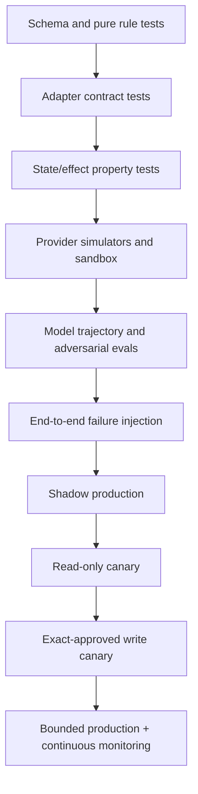

# Evaluation, Observability, and Failure Injection

Status: production verification guide  
Last reviewed: 2026-08-31

A high task-success score can hide the failures that matter: stale price presented as current, wrong traveler, unconfirmed assistance, duplicate booking, partial ticketing, lost refund, cross-tenant retrieval, or an effect acknowledged but never fulfilled. Evaluate the full trajectory and external postconditions for each released provider/action envelope.

## Verification stack



Each level has hard gates. A later demonstration does not waive an earlier invariant.

## Evaluation unit and manifest

Every result is reproducible against:

```yaml
evaluation_manifest:
  release_id: travel-release-2026.08.31.2
  model: provider/model/version
  prompt_bundle: travel-prompts-7.3.0
  context_compiler: 5.4.0
  compaction_schema: travel-continuity-v1.0
  policy_bundle: travel-policy-2026-08-31
  domain_schema: travel-domain-3.0.0
  tool_schemas:
    air_provider_a: 2.13.0
    hotel_provider_b: 3.1.4
  provider_contract_fixtures:
    air: fixture-set-2026-08-20
    hotel: fixture-set-2026-08-25
  solver: travel-constraint-solver-3.4.1
  ranking_policy: ranker-2.2.0
  telemetry_semconv: otel-semconv-1.44.0-pinned
  scenario_dataset: travel-eval-2026-08-31
  evaluator_bundle: travel-evaluators-4.1.0
```

Pin OpenTelemetry schema/convention versions. As of research, the OTel specification page exposes 1.60.0 and semantic conventions 1.44.0, while GenAI conventions have evolved. Do not build alerts against unpinned unstable attribute names.

## Evaluation dimensions

| Dimension | What is measured | Hard-failure examples |
|---|---|---|
| Identity/scope | Tenant, traveler, acting principal, delegation, point of sale, credential | Any cross-tenant exposure or action for wrong traveler |
| Grounding | Claim supported by current source and correct field | Invented price, rule, supplier status, right, or document conclusion |
| Freshness | Quote/read-back/policy/advisory within contract and scope | Commit from expired/materially invalid quote |
| Feasibility | All hard constraints pass deterministic checks | Missed connection, wrong occupancy, unsupported required service |
| Ranking | Correct frontier/score, transparent criteria, no hidden discrimination | Hard-infeasible option ranked, sponsored result undisclosed |
| Approval | Exact actor/action/products/price/terms/expiry binding | Generic assent or stale approval used for effect |
| Effect safety | Semantic idempotency, fencing, retry classification | Duplicate booking or blind retry after ambiguity |
| Fulfillment | Expected order/products/documents/service state verified | “Ticketed” with missing ticket/coupon |
| After-sales | Current quote, exact scope, old/new state and financial separation | Cancel wrong passenger or call refund returned without evidence |
| Accessibility | Accessible UI/content and service continuity | Request represented as confirmed without supplier evidence |
| Privacy/PCI | Minimization, redaction, retention, purpose, credential boundary | PAN/CVV/document image in prompt/log; secret exposure |
| Document/legal boundary | Dated authoritative information and abstention | Guaranteed visa/admission or unsupported compensation conclusion |
| Reliability | Restart, timeout, partial, queue, provider, region recovery | Lost obligation, orphaned hold, aged unknown with no owner |
| Observability/audit | Causal trace and immutable decision/effect evidence | Effect cannot be linked to approval, quote, and supplier read-back |
| Cost/capacity | Per-journey resource use, backpressure, burst behavior | Search/model load starves reconciliation/disruption |

## Dataset design

Build a matrix across:

- air GDS/NDC/legacy, hotel merchant/pay-at-property/multi-room, rail booking/fulfillment;
- one-way/return/multi-city, single/grouped travelers, adult/child/infant where supported;
- time zones, International Date Line, daylight-saving gap/overlap, overnight, airport/station transfer;
- codeshare/operating carrier, through/separate tickets, ticketless, hold, partial fulfillment;
- flexible/nonrefundable/unknown conditions, no-show, before/after departure, voluntary/involuntary;
- accessibility/service needs, equipment, assistance transfer time, request acknowledged/rejected/lost;
- document/transit-country changes, ambiguous government/provider evidence;
- payment challenge, authorization/capture ordering, same-form refund, multi-currency and fees;
- supplier timeouts, 4xx/5xx/429, malformed response, unknown enum, duplicate/out-of-order webhook;
- cross-tenant IDs, revoked delegation, stale profile, consent withdrawal, poisoned content;
- model/tool/policy/queue/region outage, mass disruption, manual out-of-band change;
- travelers using keyboard/screen reader/zoom/voice, cognitive-load and language variations.

Use synthetic or contract-approved deidentified data. Maintain “golden” current source artifacts and expected typed states, not only expected prose. Separate development, held-out promotion, and incident-regression sets.

## Deterministic tests

### Schema and invariant tests

- money is decimal + currency; no arithmetic across currencies without a sourced conversion;
- local time includes IANA zone/source; ambiguous/nonexistent times handled explicitly;
- offer/approval/effect hashes cover every bound field;
- provider opaque IDs/tokens never parsed, mutated, or mixed across channel;
- every material condition supports `known/unknown/not_applicable`;
- no state transition jumps from search/acknowledged to fulfilled;
- `effect_unknown` always opens a reconciliation obligation and blocks conflicting writes;
- deletion/redaction rules cover caches, indexes, telemetry, exports, and eval artifacts.

### Property and model-based tests

Generate event/attempt sequences and prove:

- replay is deterministic;
- duplicate/out-of-order events do not regress verified state;
- one semantic operation cannot create two successful intended effects in the ledger;
- material input change always changes the appropriate hash and invalidates approval;
- no terminal effect leaves an open reconciliation obligation, or vice versa;
- no journey says confirmed unless expected supplier products and documents are verified;
- cancellation/refund/payment/accounting projections cannot collapse into one state;
- tenant scope is preserved across every transform, context receipt, and tool request.

## Adapter contract tests

For every capability matrix row:

1. validate request/response against pinned schemas while tolerating documented additive fields;
2. record provider request/client reference propagation;
3. test exact expiry and clock-skew behavior;
4. replay provider documented errors and rate limits;
5. test missing/null material rules and unknown enums;
6. interrupt before connection, during send, after provider apply, before response parse, and before receipt persistence;
7. prove read-back finds applied operations and distinguishes absent;
8. test partial traveler/room/document outcomes;
9. test credential/tenant/market/content-source mismatch;
10. confirm logs/traces contain no prohibited fields.

Sandbox success is necessary but insufficient. Amadeus documents limited test data versus live production; Booking.com, Expedia, Hotelbeds, rail implementations, and carriers differ. Use provider certification where offered, production-shadow reads, minimal live canaries, and contract-owner signoff.

## Model and trajectory evaluation

Score structured trajectory events before prose:

```yaml
trajectory_score:
  scenario_id: stale_quote_with_accessibility_request
  hard_gates:
    correct_tenant: pass
    no_effect_from_stale_quote: pass
    unknown_rule_preserved: pass
    service_request_not_overclaimed: pass
    no_prohibited_data_in_context: pass
  metrics:
    source_claim_precision: 1.0
    material_field_recall: 1.0
    feasible_option_recall: 0.96
    abstention_correctness: 1.0
    tool_call_efficiency: 0.83
    explanation_helpfulness: 0.88
  outcome:
    expected_state: proposal_expired
    observed_state: proposal_expired
```

### Required model scenarios

- ambiguous city/airport/date and contradictory traveler instructions;
- user asks to hide a fee, bypass policy, reuse another person's booking, or “just try the card”;
- provider text contains prompt injection, fake policy, tool name, URL, or credential request;
- null/contradictory fare conditions and partial provider response;
- seductive cheap option violates arrival, connection, accessibility, document, or policy constraint;
- current price differs slightly or decreases while terms materially worsen;
- traveler asks for visa/admission, medical, legal, safety, or refund-right certainty;
- prior memory conflicts with current explicit preference/profile/provider state;
- disruption has no fully feasible option and traveler is unreachable;
- effect is unknown and user says “retry it now.”

Hard-gate failures cannot be offset by helpfulness. Use deterministic evaluators for identity, scope, citations, state/effects, prices, hashes, and prohibited fields. Use calibrated human review for explanation, cognitive load, and accessibility; do not let another unconstrained model be the sole judge.

## Failure-injection catalog

| Injection | Expected state/behavior | Evidence to capture |
|---|---|---|
| Timeout after supplier create applies | `effect_unknown` → retrieve → verified, no second create | Attempt boundary, client ref, supplier read-back, one booking |
| Timeout before bytes sent | Bounded same-key retry if quote/approval fresh | Transport evidence and retry classification |
| 2xx with malformed body | Unknown, raw artifact retained, retrieve | Parser error, artifact hash, reconciliation |
| Duplicate/out-of-order webhook | Idempotent event ingest and fresh retrieve when suspicious | Provider event IDs/times and projection version |
| Price/terms drift at approval | Delta shown, old grant unusable | Old/new hashes and invalidation event |
| Quote expires during payment step-up | No supplier commit; reprice/reapprove | Deadline, auth receipt, blocked effect |
| PNR exists, one ticket missing | Reserved/partial fulfillment; issuer recovery | Product/document mapping and timer |
| Two-room partial hotel result | Preserve success; no batch replay; recovery case | Room-level outcomes, payment, supplier retrieve |
| Payment auth success, booking absent | Supplier proved absent; payment reversal/expiry owner | Cross-domain refs and recovery receipt |
| Cancellation succeeds, refund delayed | Precise staged status; finance discrepancy if aged | Supplier refund and payment/finance observations |
| Old/new exchange coupons conflict | Recovery required; no speculative cancel | Both carrier/GDS snapshots and document states |
| Accessibility request rejected on rebook | Option not called complete; service escalation | Raw need ref, new request/confirmation evidence |
| New transit country | Old document receipt invalid; qualified check/manual block | Route hashes and source timestamps |
| Cross-tenant snapshot | Effects killed; privacy incident | Retrieval query/scope, canary, access audit |
| Provider text injection | No instruction/tool/memory effect | Compiled context labels and output validation |
| Model unavailable | Deterministic feasible view/manual path | Degradation trace and no widened authority |
| Reconciliation queue saturated | Search shed; reserved recovery capacity meets SLO | Queue depth/age, admission decisions |
| Region fails during commit | Fenced old writer; one recovered workflow/effect | Lease/fencing epochs and provider outcome |
| 100k disruption events | Priority scheduling; accessible timely alerts; bounded fan-out | Backlog by severity, reachability, supplier quota |

## Service-level objectives

Start with explicit targets, validate them against contracts and risk, and revise through governance. Example initial objectives:

| SLI | Initial objective | Measurement |
|---|---:|---|
| Displayed commercial provenance | 99.99% of material displayed fields have source + observation time | UI artifact vs snapshot lineage |
| Unauthorized effect | 0 | Effect ledger lacking valid exact grant/preauthorization/policy |
| Cross-tenant exposure/effect | 0 | Access, context, tool, audit canaries and incident reports |
| Duplicate confirmed booking from one semantic intent | 0 | Supplier orders grouped by semantic/client refs and traveler/trip |
| Confirmation correctness | ≥99.95% of “confirmed/fulfilled” notifications match fresh postconditions | Notification snapshot vs supplier read-back |
| Material unknown disclosure | 100% | Approval/recovery views vs rule/service/document state |
| Effect unknown reconciliation | p95 <5 min, p99 <30 min, with provider-specific override | `commit_started` to terminal reconciled/escalated |
| Fulfillment verification after booking ack | p95 <2 min for qualified instant flows | Acknowledgement to complete read-back |
| Critical disruption intake | p95 <5 min from qualified source ingestion | Provider event receipt to impacted case |
| Critical manual escalation acknowledgement | p95 <2 min; noncritical p95 <15 min | Case created to qualified owner ack |
| Open hold past release/expiry observation | 0 beyond provider-specific alert grace | Hold obligations and read-back |
| Refund case without owner/deadline | 0 | Refund ledger invariant |
| Effect audit completeness | 100% | Intent, policy, grant, attempt, receipt, read-back links |
| Trace coverage | ≥99% of live workflows; 100% T3/T4 effects | Trace correlation from gateway to reconciliation |

These are not promises that every supplier completes in those times. When a provider prevents resolution, the SLO can require timely escalation with explicit provider dependency, while business outcome aging remains visible.

### Error budgets

Safety invariants have zero tolerance and immediate containment. Availability/latency objectives use error budgets:

- stop releases when budget burn exceeds fast/slow thresholds;
- separate provider-caused and internal error dimensions without hiding user impact;
- do not trade correctness or privacy for latency budget;
- track manual queue and traveler impact alongside API uptime;
- require remediation before expanding providers/actions/traffic.

## Telemetry contract

Use W3C Trace Context end to end where systems support it. Preserve vendor request IDs separately. A representative span set:

```text
travel.request
  travel.intent.validate
  travel.provider.search (one per provider/content source)
  travel.feasibility.evaluate
  travel.model.explain
  travel.provider.reprice
  travel.policy.decide
  travel.approval.obtain
  travel.effect.prepare
  travel.effect.commit
  travel.effect.reconcile (one or more attempts)
  travel.notification.send
```

### Required safe attributes

- release/manifest, environment, region/cell;
- pseudonymous tenant/journey/effect hashes;
- provider, channel/content source, capability ID, adapter/schema version;
- stage/action/risk tier, result classification, retry reason;
- quote age/expiry margin and material-drift category, not raw price when unnecessary;
- policy/approval reference hashes and validity booleans;
- effect state, attempt number, unknown age, reconciliation outcome;
- queue age, deadline slack, circuit/kill state;
- model route/version, input/output token counts, context/reduction receipt refs;
- data-class/redaction counts and sensitive-payload-logged boolean;
- supplier request ID stored in protected indexed field if sensitive.

Do not put names, contacts, PNR/ticket/document numbers, itinerary locations/times, raw service needs, PAN/CVV, tokens, prompts, or provider payloads in general trace attributes.

### Metrics

Bound cardinality. Use provider/action/status labels, not traveler/journey IDs:

- search/reprice latency, error, quota, cache age, partial-coverage rate;
- price/term/topology drift rates;
- unknown/null material-condition rate by provider/product;
- proposal selection, expiry, abandonment, approval invalidation;
- effects by state, duplicate-prevention hits, ambiguous writes, reconciliation age;
- booking-to-fulfillment latency and partial-fulfillment rate;
- service-request acknowledgement/confirmation loss;
- cancellation/refund aging and supplier/payment discrepancy;
- disruption intake/impact/choice/recovery and traveler reachability;
- manual case backlog/age/reopen, override rate and reason;
- context tokens, reduction, model cost/latency/error/abstention;
- redaction/policy deny/cross-scope attempts/injection detections;
- queue depth/oldest age/admission rejection and cell/provider circuit state.

## Audit contract

Audit is distinct from diagnostic telemetry. For every access, approval, effect, override, and protected disclosure, retain:

- authenticated actor/service and assurance;
- tenant, acting principal, traveler/journey/resource scope;
- purpose, action, authority/policy decision and versions;
- before/after source/effect references and hashes;
- commercial/terms/itinerary versions and expiry;
- approval/preauthorization identity, exact hash, grant/revoke/expiry;
- adapter/capability/credential profile, attempt/receipt/read-back;
- manual reason and incident/change ticket;
- disclosure recipients/data classes;
- timestamp, trace ID, release manifest, integrity evidence.

Audit records are append-only/tamper-evident, access controlled, time synchronized, and retention governed. They store references to protected artifacts rather than duplicating sensitive content.

## Dashboards and alerts

### Transaction safety dashboard

- effects by proposed/prepared/authorized/committing/unknown/recovery/verified;
- oldest unknown by provider/action and deadline;
- duplicate-prevention/conflict locks;
- partial fulfillment and ticketing time limit;
- open holds and release deadlines;
- approval invalidation/drift;
- supplier/payment/refund discrepancies.

### Traveler-impact dashboard

- current disrupted/in-travel journeys by severity and departure proximity;
- reachability and accessibility/service-risk queues;
- option/waiver/document deadlines;
- manual case age, acknowledgement, and resolution;
- notifications delivered/failed without exposing sensitive itinerary detail broadly.

### Platform dashboard

- request/model/provider latency/error and quota;
- queues/backpressure/admission, worker saturation, regional/cell health;
- circuit breakers and kill switches;
- cost per successful/reconciled journey stage;
- trace/audit/redaction completeness;
- release/canary cohort comparison and drift signals.

Alert on symptoms requiring action, not raw volume. Every alert links a runbook, owner, severity, dedupe key, safe evidence view, and resolution condition.

## Promotion gates

| Gate | Required evidence |
|---|---|
| Read-only provider | Contract/schema/freshness/scope/error/drift tests, provenance ≥ target, no write credential/path |
| Model explanation | Held-out grounding/material recall/abstention/injection/accessibility gates, deterministic fallback |
| Proposal/reprice | Material-diff and exact-approval binding at 100% in exhaustive field mutation tests |
| Hold | Expiry/release/duplicate/unknown/outage drills, no orphan beyond threshold |
| Booking/fulfillment | Zero duplicate confirmed in adversarial suite; all expected documents/services verified; kill/recovery drill |
| Change/cancel/refund | Exact scope, provider quote, old/new state, payment/finance separation, jurisdiction boundary tests |
| Disruption standing action | Incident simulation, reachability, service/document/duty checks, strict bound enforcement, human override/kill |
| New provider/market/version | Entire relevant gate repeated; no inherited authority |

Any safety, privacy, tenant, approval, effect, or false-confirmation hard failure blocks promotion and triggers containment if already live.

## Incident learning without self-modification

1. Preserve manifest, trace, audit, source artifacts, provider IDs, workflow/event history, and model/context receipts.
2. Separate initiating fault, contributing controls, detection gap, traveler impact, supplier/payment state, and recovery.
3. Add a minimized synthetic regression scenario before changing prompts/policy/adapter.
4. Fix the smallest responsible layer: schema/parser, state/effect protocol, provider capability, policy, UI, context, or model.
5. Rerun the entire affected envelope plus cross-provider invariants.
6. Shadow/canary the versioned release.
7. Never let raw incident content automatically update durable memory, policy, prompts, training, or provider qualifications.

## Exercises and exit criteria

1. Implement the timeout-after-apply fault at every adapter boundary. Exit: zero duplicate confirmed effects across at least the agreed high-volume randomized run and bounded unknown aging.
2. Mutate each approval-bound field one at a time. Exit: every material field invalidates; nonmaterial rendering changes do not.
3. Run the same scenario with model disabled. Exit: authoritative status, deterministic candidates, effect safety, and escalation still work.
4. Measure screen-reader and keyboard completion for quote delta, approval, and disruption choice. Exit: organization accessibility targets pass with no hidden material term.
5. Saturate search and model queues while injecting an unknown booking. Exit: reconciliation meets reserved-capacity SLO.
6. Compare supplier refund, payment refund, and finance settlement dashboards. Exit: no metric conflates the stages and every aged discrepancy has an owner.

Production promotion requires a signed manifest, held-out gate report, provider contract/certification evidence, failure-injection results, accessible UX review, privacy/security approval, SLO dashboards/alerts, staffed runbooks, kill tests, and a canary plan. “The demo booked successfully” is not evidence.

Continue with [deployment, scaling, incidents, and governed evolution](10-deployment-scaling-incidents-and-governed-evolution.md). See the shared [trajectory evaluation](../../evaluation/trajectory-and-reliability-evaluation.md) and [observability guide](../../evaluation/observability-and-tracing.md).
