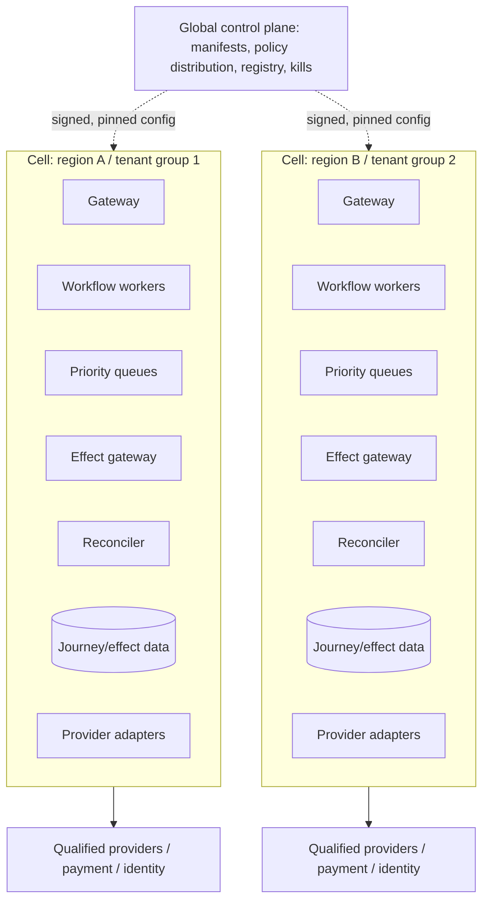
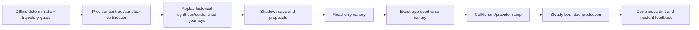

# Deployment, Scaling, Incidents, and Governed Evolution

Status: production operations guide  
Last reviewed: 2026-08-31

Travel load is bursty, deadline-sensitive, and provider-limited. A weather event can multiply schedule changes, searches, notifications, and after-sales work while provider APIs are degraded. Scale by protecting effect reconciliation and in-travel obligations, not by letting more model loops fan out.

## Deployment topology

Use cells aligned to real trust and failure boundaries:



A cell has isolated credentials, quotas, queues, effect leases, data partitions, telemetry, and kill switches. Choose boundaries from tenant/data residency, point of sale/accreditation, provider accounts, region, and blast radius. Do not create cells for aesthetic microservice symmetry.

### Home and failover regions

Assign each journey/effect a writer home. Replicate for recovery according to data policy, but allow one fenced writer epoch. Active-active reads are possible; active-active external writes are unsafe unless the workflow lease, provider semantic key, and downstream contract all prevent duplicate business effects.

Failover requires:

- durable event/effect/approval/outbox replication within declared RPO;
- fencing token/lease epoch that the old region cannot reacquire;
- provider credentials/allowlists and payment/identity connectivity in the target;
- pinned release/tool/policy compatibility;
- recovery of timers, open holds, quote/approval expiry, unknown effects, refunds, and disruption cases;
- provider rate-limit and client-reference continuity;
- proof through game day that no duplicate write occurs during split brain.

If fencing is uncertain, fail over read-only and manual operations. Availability does not outrank duplicate-booking safety.

## Queue architecture

Do not share one FIFO queue.

| Queue | Priority | Admission/backpressure | Reserved capacity |
|---|---|---|---|
| `effect_reconciliation` | Highest | Never shed; coalesce redundant reads; escalate on age | Yes, per provider/action |
| `in_travel_disruption` | Highest | Deduplicate events, prioritize departure/reachability/service risk | Yes, per cell/provider |
| `fulfillment_deadline` | High | Ticket/hold/check-in/cancellation deadline order | Yes |
| `payment_refund_reconciliation` | High | Batch reads when provider supports; never lose deadline | Yes |
| `approved_effect_dispatch` | High | Deny when quote/approval slack insufficient or provider circuit open | Yes, tightly bounded |
| `manual_escalation_notification` | High | Accessible multi-channel with recipient/dedupe controls | Yes |
| `operational_status_read` | Medium | Cache only valid observations; per-journey coalescing | Limited |
| `quote_reprice` | Medium | Deadline-aware; provider quota/token bucket | Limited |
| `new_search` | Low | Shed, sample, defer, or reduce provider fan-out | No |
| `model_explanation` | Low | Fall back to deterministic views; cap per journey | No |
| `offline_eval/analytics` | Background | Pause during incident | No |

Priority includes deadline slack, not only a static label. Add aging to prevent indefinite starvation, while never letting low-risk work consume safety reserves.

### Backpressure sequence

1. Pause offline analytics/evals and speculative prefetch.
2. Reduce new-search provider fan-out and result count.
3. Disable optional model explanations; show deterministic structured results.
4. Reject/queue new exploratory searches with a truthful retry status.
5. Preserve reprices already awaiting approval only when deadlines and capacity allow.
6. Preserve approved effect dispatch, fulfillment, reconciliation, in-travel disruption, refund obligations, and manual escalation.
7. If critical queues exceed safe capacity, activate incident command, provider/action admission limits, and explicit manual/partner routing.

Never hide backpressure by timing out after the user approved and before durable acceptance. Either durably accept the obligation with a deadline or reject before approval.

## Capacity model

Model each resource independently:

```text
required_concurrency ≈ arrival_rate × p95_service_time × burst_factor / target_utilization

provider_request_rate = admitted_journeys × calls_per_stage × retry_factor

reconciliation_capacity >= ambiguous_write_rate × mean_readbacks_per_unknown × disruption_factor
```

Use measured distributions, not averages. Include:

- normal and disruption arrival rates by journey stage;
- search fan-out and provider quotas/429 behavior;
- reprice/approval expiry slack;
- model tokens/latency and fallback rate;
- effect dispatch and reconciliation call distributions;
- webhook duplicates and burst size;
- ticket/hold/refund timers and manual case arrival;
- provider-specific outage/recovery behavior;
- notification provider quotas;
- database/workflow history and snapshot storage growth;
- operator staffing by time zone, language, supplier skill, and authority.

### Capacity gate example

For each cell, prove under a declared mass-disruption test:

- critical reconciliation and in-travel queues remain below their age SLO;
- no provider quota is exceeded by retry storms;
- new search degrades before critical work;
- database, workflow history, and audit writes have headroom;
- manual case creation rate does not exceed the staffed escalation plan without an explicit overflow partner;
- cost guardrails activate without suppressing safety work.

## Provider resilience

Each adapter has its own:

- concurrency semaphore and token-bucket rate limiter;
- timeout split by connect/headers/body and provider documented minimums;
- retry classifier and budget by operation;
- circuit breaker separated for search, reprice, create, retrieve, after-sales, and webhooks;
- bulkhead/worker pool and reconciliation reserve;
- schema-drift detector and last-known-good parser;
- kill switch and manual alternate-channel runbook;
- health view based on real action semantics, not a shallow `/health` endpoint.

Do not route a create to another provider/channel as a transparent retry. Content/identifiers/merchant/authority differ. That is a new proposal or a contractually correlated recovery.

### Circuit behavior

| Circuit | Open condition | Open behavior | Probe |
|---|---|---|---|
| Search | Error/latency/quota budget burn | Remove provider from fresh coverage, disclose partial results | Low-rate qualified search fixture |
| Reprice | Error/drift/invalid token spike | Block new approvals for provider; expire safely | Known non-live fixture or contract-approved call |
| Create/effect | Ambiguity/duplicate/schema/auth anomaly | Stop new writes, keep read-back/reconciliation | Operator-controlled canary after containment |
| Retrieve/reconcile | Read errors or stale/conflicting state | Keep effects unknown, suppress conflicting writes, escalate | Provider-specific resource retrieve |
| Webhook | Signature/replay/schema anomaly | Quarantine events, poll authoritative state if safe | Signed fixture and source validation |

## Data, workflow history, and retention operations

Long-lived workflows can produce large histories. Use child workflows/continue-as-new or equivalent at tested thresholds, but only after emitting a continuity receipt and preserving open effects/obligations. Archive source artifacts separately from workflow commands.

Partition/query by tenant + journey/effect/provider and time. Protect hot indexes for:

- open unknown/recovery effects and oldest age;
- upcoming quote/hold/ticketing/cancellation/departure deadlines;
- in-travel disruptions and unreachable travelers;
- partial fulfillment and service-request gaps;
- refund/payment/finance discrepancies;
- open manual cases and incident cohorts.

Test backup restore, point-in-time recovery, deletion propagation, audit integrity, encryption-key recovery/rotation, and reindexing without cross-tenant leakage.

## Disaster recovery objectives

Declare RTO/RPO per capability, not one number:

| Capability | Example posture | Reason |
|---|---|---|
| New search/explanation | Higher RTO; RPO can be zero because queries can be redone | No durable traveler effect |
| Journey/effect/approval ledger | Low RPO, low RTO | Prevent duplicate/lost effects and preserve authority |
| Reconciliation/timers | Low RTO | Unknown effects and ticket/hold deadlines age quickly |
| Source snapshots/audit | Low RPO with immutable backup | Dispute, incident, and state reconstruction |
| Preference/profile refs | Profile system objectives | Owned outside travel runtime |
| Payment | Payment service objectives and recovery contract | Travel system does not restore payment truth |
| Offline analytics | High RTO/RPO | Noncritical during incident |

Numbers must come from risk/business analysis and provider/operator capability. Exercise loss of a region, queue, workflow cluster, snapshot vault, key service, identity/policy service, payment path, and individual provider.

### DR game-day exit criteria

- one writer epoch survives and old workers are fenced;
- all prepared/committing/unknown effects reappear with the same semantic IDs and attempts;
- no expired quote/approval is committed;
- every timer/obligation is restored or escalated if overdue;
- provider/payment/client references remain usable;
- traveler communications remain deduplicated and precise;
- protected data/audit access remains scoped;
- measured RTO/RPO and backlog recovery meet the declared envelope.

## Cost engineering

Measure cost per verified outcome, not per model call:

```text
cost_per_verified_booking =
  provider/search fees
  + model inference
  + workflow/queue/compute
  + snapshot/telemetry storage
  + payment/fraud costs
  + notification
  + manual operations
  + incident/refund/duplicate loss allocation
```

### Cost controls that preserve correctness

- Use deterministic forms/rules/templates before models.
- Filter hard-infeasible and dominated options before model context.
- Cache static content and valid signature-scoped observations; never cache live quote as durable truth.
- Coalesce identical read-backs for the same provider resource while preserving each obligation.
- Batch operational/reconciliation reads only where the provider contract supports it.
- Use a smaller qualified model for bounded summaries; route high complexity only when needed.
- Cap candidates, provider fan-out, tool calls, replans, tokens, and per-stage/journey spend.
- Store raw artifacts once by content hash with access-controlled references, subject to data policy.
- Disable optional explanation under load before critical effect/reconciliation work.
- Reduce incidents/duplicates/manual rework; the cheapest unsafe system is operationally expensive.

Do not save money by omitting a fresh reprice, supplier read-back, audit, accessibility support, or staffed recovery.

## Release manifest and compatibility

One immutable release manifest pins:

```yaml
release_manifest:
  release_id: travel-release-2026.08.31.2
  domain_schema: 3.0.0
  workflow_code: git:sha256...
  workflow_migrations: [travel-v2-to-v3-marker]
  prompts: travel-prompts-7.3.0
  model_routes: model-routing-2.1.0
  context_compiler: 5.4.0
  memory_policy: travel-memory-2026-08-31
  compaction_schema: travel-continuity-v1.0
  policy_bundle: travel-policy-2026-08-31
  provider_registry: registry-snapshot-2026-08-31T00:00Z
  adapters:
    air_provider_a: 2.13.0
    hotel_provider_b: 3.1.4
  tool_schema_hashes: {...}
  solver: travel-constraint-solver-3.4.1
  ranker: ranker-2.2.0
  evaluator_bundle: travel-evaluators-4.1.0
  telemetry_schema: travel-otel-3.0.0
  data_migrations: [journey_projection_v12]
  sbom_and_attestation_ref: supplychain://release/...
```

An in-flight workflow stays pinned unless a compatible migration is explicitly tested. A provider schema change can disable a capability without changing the workflow release. Emergency deny policies may reduce authority immediately; allow changes require normal promotion.

## Release path



### Shadow

Run the new release on copied allowed events/snapshots with write tools physically unavailable. Compare state, feasibility, ranking, material terms, abstention, tool plan, context, cost, and latency. Never shadow real payment/document data into a model route lacking the same approval and region.

### Canary

Canary one dimension at a time: model/prompt, adapter/schema, provider content source, policy, context compiler, or runtime. Start with employees/test tenants and reversible/read-only workloads. For a write canary, use exact approval, low exposure, staffed observation, provider support window, and immediate kills.

Compare:

- hard gate failures and policy denies;
- quote drift/expiry and confirmation correctness;
- unknown/partial effects and reconciliation age;
- duplicate-prevention hits and provider errors;
- service/accessibility/document escalations;
- manual handoff/reopen and traveler complaints;
- latency, queue impact, token/provider/manual cost;
- data redaction, cross-scope attempts, trace/audit completeness.

### Promotion and rollback

Promotion requires the signed gate report, change owner, time window, on-call/runbook, live dashboards, provider capacity, rollback/kill drill, and no unresolved high-severity regression.

Rollback affects future decisions and uncommitted workflow code/model/adapter routing. It cannot undo a booked room, issued ticket, cancellation, or refund request. In-flight effects remain on their original recovery protocol, with compatibility adapters available until terminal reconciliation.

Rollback triggers include any cross-tenant/credential leakage, unauthorized effect, duplicate confirmed booking, false fulfillment/refund claim, material-condition loss, approval bypass, reconciliation regression, accessibility harm, schema drift on a material field, severe provider quota incident, or error-budget burn.

## Provider/version migration

1. Record exact old/new API/schema, content, region, credential, commercial, error, idempotency, read-back, and after-sales differences.
2. Generate/review client and mapper changes; retain raw unknown fields.
3. Build paired contract fixtures and semantic diff reports.
4. Run old/new shadow reads against allowed traffic and compare normalized material fields.
5. Keep writes on old version until new read-back and unknown-outcome tests pass.
6. Canary a bounded provider/action cell; never mix offer IDs across versions/channels.
7. Pin in-flight orders to the adapter that can service their originating channel, while testing compatible retrieval in the new path.
8. Preserve rollback adapter and credential until all old orders' required after-sales horizon has an owner.
9. Update the provider registry, research packet/operational source record, runbooks, and requalification date.

Protocol conformance does not eliminate carrier/property/operator variation. Migration gates run at representative supplier/content slices.

## Drift detection

| Drift | Signal | Response |
|---|---|---|
| Response/schema | Unknown/missing fields, parse warnings, enum changes, hash mismatch | Disable affected effect capability; retain raw; contract investigation |
| Capability | Endpoint succeeds but provider no longer supports an action/product/market | Update registry; invalidate qualification; manual path |
| Commercial | Price/term drift or null-condition rate changes materially | Review cache/reprice/parser/provider behavior and ranking |
| Model | Grounding/abstention/tool-plan/cost changes by slice | Hold model/prompt promotion or rollback |
| Policy/legal | New effective rule, enforcement position, source supersession | Legal review, versioned policy release, targeted regression suite |
| Operational | Unknown effects, partial fulfillment, refund age, manual cases rise | Provider/action circuit and root-cause review |
| Accessibility | More unconfirmed/lost requests or channel completion failures | Stop expansion; supplier/UI/service review |
| Security/privacy | Redaction, injection, cross-scope, secret/access anomalies | Kill affected path and incident response |
| Preference/feedback | Opt-out, override, complaint, correction patterns | Product review; never automatic authority expansion |

Use control charts/cohort comparisons with minimum sample rules; do not wait for statistical significance when a zero-tolerance invariant fails.

## Incident command

Define severity using traveler harm, unauthorized/duplicate effects, data exposure, stranded travelers, critical deadline, financial exposure, provider scope, and recovery uncertainty.

Roles:

- incident commander;
- travel operations/supplier lead;
- effect/reconciliation lead;
- identity/security/privacy lead;
- payment/finance lead;
- accessibility/duty-of-care lead where applicable;
- communications/support lead;
- engineering/runtime/provider adapter lead;
- legal/compliance liaison.

First actions are evidence preservation, scope, kill/admission controls, critical-obligation protection, provider/payment contact, precise traveler communication, and ownership. Do not begin by tuning the prompt.

## Incident runbooks

### Runbook: PII, document, or payment-data exposure

1. Stop affected model/tool/log/export path and revoke/rotate credentials or tokens as appropriate.
2. Preserve access/audit/config/release evidence without replicating exposed values.
3. Scope tenants, travelers, data classes, recipients, regions, duration, and downstream processors.
4. Activate security/privacy/PCI incident owners and notification/legal timelines under policy.
5. Restrict or purge exposed data through governed procedures; verify caches, traces, indexes, backups, eval datasets, and vendor retention.
6. Keep critical travel operations running through a clean restricted path where safe; otherwise manual escalation.
7. Add synthetic regression canaries and repair the responsible boundary.
8. Resume only after containment, rotation, validation, and approval. Never paste exposed data into the incident chat.

### Runbook: reconciliation backlog

1. Freeze nonessential search/model work and reserve provider quota/workers for unknown and partial effects.
2. Partition backlog by effect age, provider/action, traveler departure, fulfillment/payment risk, and deadline.
3. Deduplicate obligations for the same resource while preserving each effect/audit link.
4. Open provider circuits if new writes would worsen ambiguity.
5. Scale workers only within provider quotas and database capacity; avoid retry storms.
6. Route aged/contradictory cases to trained operators with evidence packets.
7. Communicate precise verification delays; do not declare failure/success.
8. Reconcile downstream notifications, refunds, and manual provider actions before clearing incident.

### Runbook: bad behavior release

1. Activate release/cohort/model/prompt/adapter/policy kill or rollback for future work.
2. Block new T2–T4 actions in affected cells while preserving unknown-effect reconciliation.
3. Identify in-flight workflows by manifest and stage; do not migrate committing effects casually.
4. Preserve context receipts, outputs, tool plans, source artifacts, audit, and user impact.
5. Rerun deterministic state from source events where safe; compare affected projections.
6. Remediate live proposals/notifications manually if they contain material error.
7. Add regression, fix smallest responsible layer, shadow, and canary anew.
8. Do not self-edit the prompt in production without a manifest and gates.

### Runbook: provider outage

1. Open per-action circuits and enforce admission/backpressure.
2. Keep read-back/reconciliation capacity if endpoint remains reliable; otherwise age unknowns and escalate.
3. Never redirect identifiers/writes across providers or channels transparently.
4. Protect in-travel, fulfillment deadline, hold release, cancellation deadline, and refund obligations.
5. Use contract-approved manual/alternate channel with typed receipts and semantic correlation.
6. Disclose stale/partial coverage and verification delay.
7. On recovery, ramp probes, drain reconciliation before new search volume, and reconcile all manual actions.

### Runbook: duplicate booking incident

Use the detailed runbook in guide 6. At platform level, also kill the provider/action/cohort, query semantic-ID collision and retry metrics, inspect lease/outbox/adapter behavior, estimate financial/traveler exposure, and add a boundary-specific fault test before re-enable.

## Feedback governance

Collect explicit traveler/operator feedback tied to a release, decision, evidence, and outcome. Separate:

- factual correction (route to source/profile/supplier owner);
- preference update (explicit consent and scope);
- explanation/UX/accessibility feedback;
- provider capability/quality issue;
- policy disagreement or exception request;
- incident/safety report;
- model/ranking evaluation label.

Feedback never directly changes weights, prompts, memories, provider qualification, policies, or standing authority. Curate, deidentify, review bias/coverage, add offline tests, version the change, and promote normally. Track silent failures and abandonment, not only thumbs-up.

### Fairness and traveler impact review

Slice outcomes by permitted operational categories such as language/channel/accessibility need, region, provider, journey complexity, and disruption state while applying privacy governance. Look for worse option quality, higher manual burden, slower contact, lost service requests, denied access, or disproportionate false risk. Do not use protected/sensitive attributes to personalize price or reduce service.

## Operational readiness checklist

- [ ] Cells isolate data, credentials, quotas, queues, effects, and kills along declared boundaries.
- [ ] One writer/fencing epoch prevents active-active effect races.
- [ ] Critical queues have reserved capacity and deadline-aware backpressure.
- [ ] Capacity tests include disruption bursts, provider quotas, retries, manual staffing, and cost.
- [ ] RTO/RPO are declared per capability and proven in game days.
- [ ] Release manifests pin every behavior-bearing component and in-flight compatibility.
- [ ] Shadow/read/write canaries, hard rollback triggers, and provider migration protocol are rehearsed.
- [ ] Drift covers schemas, commercial terms, models, policies, operations, accessibility, and security.
- [ ] Incident roles/runbooks preserve reconciliation during containment.
- [ ] Cost optimization cannot remove freshness, read-back, audit, accessibility, or human recovery.
- [ ] Feedback flows through offline reviewed releases, never self-modification.

## Final production exit criteria

The scaled service is ready when it can sustain the declared normal and disruption workloads while:

- meeting critical queue/reconciliation/traveler-impact SLOs inside provider limits;
- producing zero unauthorized, cross-tenant, or duplicate confirmed effects in tests and live monitoring;
- failing over without split-brain writes, expired approvals, or lost obligations;
- degrading new search/model work before fulfillment, reconciliation, disruption, refund, or manual escalation;
- rolling forward/backward releases without changing in-flight effect semantics;
- containing provider, cell, model, payment, and data incidents through rehearsed kills and runbooks;
- reconciling supplier, payment, and finance records with named ownership;
- measuring total verified-outcome cost and traveler impact, including accessibility and manual burden;
- refreshing provider/legal/standard evidence on schedule and demoting stale qualifications.

Return to the [blueprint README](README.md) for the complete learning path. Use the shared [queue/backpressure guide](../../operations/queues-scheduling-and-backpressure.md), [scaling/SLO guide](../../operations/scaling-capacity-and-slos.md), and [deployment/release/incident guide](../../operations/deployment-release-and-incident-response.md) as normative companions.
