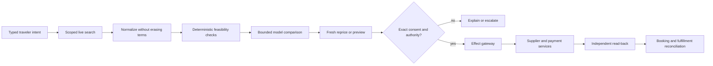

# Travel Booking and Itinerary Operations Agent Blueprint

Status: production blueprint, Pass 2 refined  
Last reviewed: 2026-08-31  
Research basis: [dated research packet](../../research/packets/travel-booking-agent-blueprint.md)

This blueprint explains how to build an agent that turns a traveler's bounded intent into fresh, comparable options; stages and commits an exactly approved booking; proves fulfillment; and coordinates changes, cancellations, refunds, disruptions, and supplier reconciliation. It covers air, hotel, rail, and qualified car-rental paths while treating each provider's actual contract as decisive. Profile, document-information, payment, expense, duty-of-care, messaging, and workflow systems remain separately owned integrations rather than hidden subtools.

The design is deliberately transactional. Search results are observations, not inventory. A price is not bookable merely because it appeared in a response. A reservation is not necessarily ticketed or fulfilled. A payment authorization is not a booking. A successful HTTP response is not proof of the final supplier state. The model may interpret constraints and explain alternatives, but supplier systems retain inventory and fulfillment truth, the payment service retains payment truth, policy services retain rules, and a durable coordinator owns progress and recovery.

## Workload contract

Use this blueprint only when the operating unit can name:

- the traveler and acting principal, tenant, point of sale, itinerary revision, and applicable consent;
- an authoritative source for every mutable fact: quote, booking, ticket or voucher, payment, service request, schedule, cancellation, and refund;
- provider-specific repricing, commit, read-back, and after-sales paths;
- exact authority limits for holds, purchases, changes, cancellations, refunds, and disruption recovery;
- a human owner for ambiguous effects, document questions, accessibility failures, and stranded travelers;
- measurable outcomes such as quote provenance, duplicate-booking rate, confirmation correctness, reconciliation age, disruption response, escalation time, and refund aging.

Do not deploy this as a generic browser agent with a stored card and broad permission to “book whatever looks best.” Start with deterministic trip capture and search comparison. Add one qualified provider and one recoverable effect at a time.

## Ownership boundary

| Concern | This agent may own | Adjacent owner or boundary |
|---|---|---|
| Intent and itinerary | Traveler constraints, itinerary revisions, option comparison, approval presentation, journey continuity | Executive or personal operations owns the broader calendar, meeting, and life objective; it delegates a typed travel intent |
| Traveler truth | Scoped identity references, verified contacts, loyalty references, consent receipts, accessibility/service needs | Identity platform proves identity; profile store owns the record; the agent does not invent or silently merge traveler data |
| Commercial search | Live searches, quote snapshots, rule provenance, freshness, ranking within declared constraints | Supplier/GDS/aggregator owns inventory, price, fare/rate/rental conditions, and availability |
| Booking and fulfillment | Prepared intents, exact approval, commit coordination, read-back, ticket/voucher/rental-confirmation/fulfillment status | Supplier fulfills; accredited agency, consolidator, carrier, hotel, rail retailer, or rental intermediary may retain issuing or servicing authority |
| Payment | Payment-reference selection, amount/currency binding, step-up handoff, status observation | Payment service and finance own credentials, authorization, capture, settlement, disputes, and accounting truth |
| Changes and refunds | Quote and explain after-sales choices, commit exactly approved action, track supplier outcome | Supplier rules and jurisdictional policy decide eligibility; finance owns ledger recognition and cash reconciliation |
| Disruption | Detect travel-impacting events, revalidate the trip, propose recovery, execute only preauthorized or approved actions | Carrier/hotel/rail supplier controls operations; duty-of-care owner controls risk policy; customer support owns general case handling |
| Documents and entry | Present dated, sourced information and direct the traveler to authoritative authorities | Governments and border officials decide admission; the agent never guarantees visa, passport, health, or entry eligibility |
| Support | Travel-specific evidence packet and escalation context | Customer-support agent owns generic support queues, empathy scripts, SLAs, and cross-product case management |

The boundary test is simple: this agent owns the travel transaction's coordination record, never another system's authoritative business truth.

## Safety invariant

> The model may recommend or prepare a travel action. It cannot make a stale quote current, grant consent, authorize spend, prove a supplier effect, decide legal admissibility, or widen its own authority.

The effect gateway accepts typed intents, a stable semantic operation ID, fresh commercial evidence, a valid policy decision, and an exact approval or narrow preauthorization. It serializes writes by supplier order and traveler journey. It never treats prose as a command.

## Truth ladder

When records disagree, prefer higher, fresher, correctly scoped evidence; never collapse the layers:

1. static content and marketing descriptions;
2. search observation;
3. repriced offer, hotel preview, or rail booking offer with expiry and conditions;
4. hold, PNR, reservation, or supplier order;
5. ticket, EMD, voucher, rail fulfillment, or confirmed hotel product;
6. fresh supplier read-back, including coupon/product status;
7. payment settlement and accounting reconciliation in their owning systems.

A higher layer does not erase the lower-layer evidence. Keeping the chain is how the system explains price drift, detects partial fulfillment, and resolves disputes.

## Zero-to-production path

| Stage | Capability | Maximum authority | Measurable exit evidence |
|---|---|---|---|
| 0. Deterministic baseline | Typed intent, constraint checks, static policy links, manual supplier workflow | None | Boundary, schema, ownership, privacy, and manual runbooks approved |
| 1. Observe | Read-only provider search and reservation retrieval; normalize snapshots | Read only | Contract tests, provenance, freshness, tenant isolation, replay, and provider-readback tests pass |
| 2. Explain | Cite and compare feasible options; disclose unknown rules and accessibility state | Read only | Grounding, abstention, ranking, injection, accessibility, and document-boundary tests pass |
| 3. Propose | Reprice and prepare exact book/change/cancel alternatives | Draft only | Material-change detection, rule rendering, cost, calibration, and usefulness gates pass |
| 4. Stage | Create a qualified hold or booking workbench where reversible and supported | Exact approval for the staged action | Hold expiry, release, duplicate prevention, and recovery drills pass |
| 5. Commit | Book and fulfill one scoped product; reconcile unknown outcomes | Exact approval; no broad autonomy | Idempotency, payment-step-up, ticket/voucher verification, refund, and incident gates pass |
| 6. Operate at scale | Add suppliers, journeys, narrow disruption runbooks, regions, and cells | Per-policy ceiling, independently earned | Capacity, SLO, DR, canary, supplier-outage, mass-disruption, privacy, and cost gates pass |

Promotion is evidence-based. Adding a new carrier, rate type, rail distributor, payment path, jurisdiction, model, prompt, or tool schema creates a new qualification envelope.

## Guide map and learning path

1. [Mission, boundaries, workload fit, and stages](01-mission-boundaries-workload-fit-and-stages.md) defines risk tiers, authority, deterministic alternatives, and Stage 0–6 gates.
2. [Reference architecture, control/data planes, and runtime](02-reference-architecture-control-data-planes-and-runtime.md) selects a durable single-coordinator design and explains tenant isolation and bounded model loops.
3. [Traveler, itinerary, order, state, and events](03-traveler-itinerary-order-state-and-events.md) defines canonical identities, lifecycle state, evidence, event semantics, and projections.
4. [Search, quotes, rules, inventory, and planning](04-search-quotes-rules-inventory-and-planning.md) handles freshness, material drift, comparison, deterministic feasibility, ranking, and approval-ready alternatives.
5. [Providers, tools, security, privacy, and accessibility](05-providers-tools-security-privacy-and-accessibility.md) qualifies air, hotel, rail, car, GDS/NDC/OSDM/search, identity/profile/document, payment, expense/duty-of-care, messaging, and workflow connectors operation by operation.
6. [Booking, ticketing, changes, refunds, and reconciliation](06-booking-ticketing-changes-refunds-and-reconciliation.md) specifies prepare-authorize-commit-observe-reconcile, unknown outcomes, after-sales, compensation, and supplier/accounting handoffs.
7. [Context, memory, compaction, and continuity](07-context-memory-compaction-and-continuity.md) defines explicit memory layers, budgets, typed loss-aware receipts, retention, and poisoning defenses.
8. [Disruptions, duty of care, documents, and escalation](08-disruptions-duty-of-care-documents-and-escalation.md) provides recovery decisions, document boundaries, accessibility continuity, and operational runbooks.
9. [Evaluation, observability, and failure injection](09-evaluation-observability-and-failure-injection.md) defines scenario suites, SLOs, trace/audit contracts, adversarial tests, and promotion gates.
10. [Deployment, scaling, incidents, and governed evolution](10-deployment-scaling-incidents-and-governed-evolution.md) covers queues, backpressure, failover, capacity, cost, DR, releases, rollback, drift, and feedback.

Read in order for a new build. For an existing system, audit guides 1, 3, 5, and 6 before tuning the prompt: most catastrophic failures come from an undefined owner, an ambiguous identity, an unqualified connector, or a blind retry—not weak prose generation.

## Default decision record

| Decision | Default | Deviate only when |
|---|---|---|
| Coordinator | One durable workflow per journey or after-sales case | Legal or regional isolation demands separately fenced workflows |
| Agent topology | One bounded reasoner using typed tools | Independent trust domains require an explicit protocol; “specialized personas” alone do not |
| Planning | Fixed macro-workflow, bounded local comparison/replanning | A deterministic optimizer cannot express the validated choice space |
| Search | Parallel qualified reads; no writes | Provider quotas, fairness, or latency policy requires controlled fan-out |
| Writes | Serialized per supplier order/booking and journey | A provider documents a stronger concurrency contract and it is tested |
| Authority | Inform, recommend, or stage by default; exact approval for commit | A narrow disruption runbook is explicitly preauthorized with caps and kill controls |
| State | Supplier/profile/payment truth plus append-only coordination/effect records | Never use chat history as the booking ledger |
| Pricing | Reprice/preview immediately before approval and commit | A supplier-issued hold makes price and inventory binding under documented terms |
| Recovery | Reconcile first; retry only proved-absent effects; compensate or forward-recover | Never assume a distributed rollback across travel products |
| Learning | Offline, reviewed, versioned release | Production outcomes never self-modify prompts, policies, memories, or authority |

## Non-negotiable invariants

- Every search, quote, rule, policy, advisory, and supplier read carries source, scope, observed time, version where available, and freshness status.
- `unknown` is a first-class rule value. Missing change/refund conditions do not mean prohibited or free.
- Approval binds exact travelers/drivers, itinerary revision, products, operating/marketing/fulfilling suppliers, price, currency, taxes/fees/deposit treatment, conditions, service requests/extras, payment reference, expiry, and material-change policy.
- Every canonical record separates stable identity from revision, provider alias, business-effective time, observation time, and correction/supersession; a current projection never erases the evidence that produced it.
- A material change invalidates approval. The system never silently substitutes an airport, date, traveler, product, room, cabin, train, operator, payment amount, or refund outcome.
- “Booked” requires a supplier reference and read-back. “Ticketed” or “fulfilled” requires the expected fulfillment documents. “Refunded” requires supplier and payment/accounting evidence appropriate to the workflow.
- A write timeout becomes `effect_unknown`; reconciliation runs before any retry.
- Cancellation is a new external effect, not an automatic rollback and not proof of a refund.
- Payment credentials, CVV, identity-document images, authentication secrets, and raw sensitive service details never enter model prompts, general memory, or telemetry.
- Accessibility needs retain the traveler's own description, a normalized request, supplier acknowledgement, and confirmed delivery state separately.
- Document and entry information is dated and sourced. The traveler is told who makes the legal decision and how to verify it.
- Tenant, traveler, legal entity, point of sale, credential, and provider scopes survive retrieval, tool calls, compaction, logs, and effects.
- Disabling models or writes leaves a useful deterministic search, evidence, and manual-escalation path.

## Exercises

Use these across the guides:

1. Trace a two-traveler air + hotel trip from intent through ticket/voucher read-back. Identify every owner and expiry.
2. Inject a timeout after the airline accepted the order but before the adapter stored its response. Prove that replay cannot double-book.
3. Change a hotel cancellation deadline across a daylight-saving boundary. Show the traveler the destination-local deadline and its source.
4. Make an air fare's change condition `unknown`, not `false`. Verify the ranker, approval view, and escalation behavior.
5. Confirm an SSR at search but reject it at booking. Prove the system does not claim assistance is arranged.
6. Fail ticket issuance after a PNR and payment authorization. Execute the defined recovery path without inventing atomicity.
7. Compact the run immediately before commit. Verify that the continuity receipt preserves every approval-bound field and explicitly lists omissions.
8. Trigger a mass schedule change while the provider API is degraded. Exercise backpressure, priority queues, read-only degradation, and human escalation.

## Definition of production-ready

The released system is production-ready only when it can prove, for each provider/action/jurisdiction envelope, that it:

- reconstructs work from durable records without transcript continuity;
- preserves traveler scope, exact intent, source lineage, commercial freshness, rules, approval, and effect history across restart and compaction;
- chooses deterministic rules or optimization for feasibility and uses the model only for bounded interpretation and explanation;
- blocks stale, materially changed, unauthorized, unconfirmed, cross-tenant, and document-risk actions;
- prevents duplicate effects, reconciles every ambiguous write, and exposes aged unknown or partially fulfilled states;
- distinguishes reservation, fulfillment, supplier reconciliation, payment status, refund, and accounting settlement;
- remains useful during model, provider, payment, policy, queue, region, and notification failures;
- meets declared correctness, latency, accessibility, privacy, reconciliation, cost, and escalation objectives under normal and disruption load;
- supports kill, rollback, replay, evidence preservation, supplier cutover, and incident review without widening in-flight authority.

Anything less is a pilot, even if it can produce an attractive itinerary.
