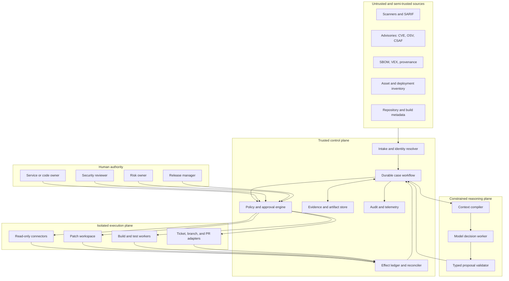

# Mission Boundaries and Reference Architecture

The safest useful design is a durable case workflow around an untrusted reasoning component. Deterministic services own identity, policy, state transitions, credentials, effect execution, and evidence retention. The model may interpret contradictory evidence and propose treatment, but it cannot merge, deploy, contain, or accept risk.

## Workload fit

Use this agent when the unit of work is a vulnerability occurrence on a named asset, artifact, repository revision, package, or dependency path and the desired output is a reviewed remediation or defensible disposition.

Choose the least complex mechanism that can produce the required evidence:

| Work shape | Best default | Promotion condition |
|---|---|---|
| Exact package/version or rule match with a trusted subject inventory and a deterministic action | Scanner, rules engine, or dependency bot | Add a workflow only when ownership, approvals, timers, exceptions, or deployed proof must survive retries and waits. |
| Known sequence with no semantic ambiguity, such as open ticket → await owner → verify deployment digest | Deterministic durable workflow without a model | Add bounded model reasoning only when contradictory advisories, incomplete applicability evidence, or patch semantics measurably defeat rules. |
| Conflicting sources, ecosystem-specific applicability, scoped code change, or evidence synthesis across systems | This remediation agent, with deterministic control and a constrained model worker | Keep it only if it beats scanner/rules/human baselines on verified outcomes without worsening false closure, authority violations, latency, or cost. |
| Active compromise, destructive exploit validation, safety-critical change, or a case with no trustworthy subject/evidence | Human-led security, engineering, or risk process; possibly no automation beyond evidence collection | Do not introduce an agent until authority, ground truth, isolation, and rollback are defined and tested. |

“No agent” is a valid production decision. If deterministic matching plus an accountable owner already achieves the required quality and response time, model reasoning adds attack surface, cost, and calibration risk without a compensating benefit.

Do not use it as:

- a live incident responder when compromise is suspected;
- a generic code-maintenance bot for unrelated features or refactors;
- a release orchestrator or production change controller;
- an authoritative vulnerability database;
- an automatic exception signer;
- a substitute for asset inventory, SBOM generation, CI, or an independent assessor.

If evidence suggests active exploitation on an owned asset, emit a sealed handoff to the security-investigation workflow. Continue only read-only preservation and remediation planning authorized by incident command; do not compete with containment.

## Reference architecture

### Trust boundaries

| Boundary | Rule |
|---|---|
| Source to intake | Treat advisory prose, repository files, issue text, scanner output, SBOM properties, and VEX statements as untrusted claims with provenance. |
| Model to control plane | Accept only schema-valid proposals; recompute authorization and current state outside the model. |
| Control to execution | Mint short-lived, target-scoped capabilities for one operation; package managers and build scripts never receive control-plane secrets. |
| Tenant to tenant | Separate namespace, encryption context, queues, artifact keys, credentials, and retrieval filters before model context assembly. |
| Preparation to production | A prepared patch or control has no production authority. Merge, promotion, and mitigation activation use separate human-owned systems. |
| Evidence to closure | Evidence is immutable and content-addressed; a decision references it but never overwrites it. |

## Authority classes

| Class | Examples | Default authority | Required control |
|---|---|---|---|
| `A0_OBSERVE` | Read advisory, repository, asset record, build result | Automatic within tenant and case scope | Read policy, provenance, freshness, redaction |
| `A1_DRAFT` | Create internal assessment, patch plan, exception proposal | Automatic | Schema validation, budget, versioned decision record |
| `A2_PREPARE` | Edit isolated worktree, resolve dependencies, run tests | Policy-granted | Contained executor, target revision fence, network allowlist, resource limits |
| `A3_PUBLISH_REVERSIBLE` | Open ticket, branch, or pull request | Policy or exact human approval | Idempotency key, content preview, destination and audience checks |
| `A4_HIGH_IMPACT` | Broad security patch, production control, merge, release | Human-owned; agent may only propose | Change review, segregation of duties, rollback plan, release controls |
| `A5_ACCEPT_RISK` | Accept or renew exception, waive gate | Human risk owner only | Named authority, scope, rationale, expiry, review cadence, audit receipt |
| `A6_INCIDENT_RESPONSE` | Isolate host, revoke credentials, eradicate | Out of scope | Security-investigation or incident-response authority |

Approval binds the exact subject digest, proposed diff or control, destination, effect class, requester, approver role, expiry, and policy version. A materially changed patch, newer base revision, different artifact, changed deployment scope, or expired approval invalidates it.

## Component responsibilities

### Intake and identity resolver

It normalizes aliases without erasing source disagreement. A logical vulnerability, a product advisory, a scanner rule, and a concrete occurrence receive distinct identifiers. It resolves package coordinates, versions, dependency paths, repository revisions, artifact digests, and asset identities using deterministic adapters.

### Durable case workflow

It is the only writer of case state. It enforces allowed transitions, leases work, records checkpoints, budgets retries, schedules freshness rechecks, and blocks closure until the proof policy passes. Model output is a command proposal, not state.

### Evidence store

It retains raw source artifacts separately from normalized projections. Every evidence reference records content digest, source, retrieval time, subject, trust class, parser version, coverage, truncation, and retention policy. Sensitive exploit details can be separately encrypted and access-controlled.

### Policy and approval engine

It evaluates principal, tenant, resource, operation, constraints, current time, current target revision, and approval receipt immediately before an effect. It also prevents self-approval and ensures the human approver has the required organizational role.

### Reasoning worker

It receives a compiled, least-privilege context and returns typed observations to request, conflicts to resolve, assessments to propose, and next steps. It never receives ambient credentials or direct network access.

### Isolated executors

Separate read-only connectors from patch, build, and publication workers. Patch workers use disposable workspaces and immutable bases. Build workers assume project scripts are hostile, enforce network and secret policy, and emit signed result manifests. Publication adapters use semantic operation identifiers and reconciliation.

## Technology choices

The blueprint deliberately does not mandate a language or agent framework. Select the runtime already operated well by the organization, provided it supports durable workflows, transactional state, typed schemas, isolated workers, OpenTelemetry export, cancellation, and versioned adapters.

| Need | Practical default | Why |
|---|---|---|
| Workflow | Existing durable job/workflow service | Recovery and timers matter more than agent-framework novelty. |
| Transactional state | Relational database with uniqueness and compare-and-swap semantics | Cases, decisions, approvals, and effect receipts need strong invariants. |
| Raw evidence | Tenant-scoped object storage with content digests | Large scan, SBOM, log, and build artifacts should not live in prompts. |
| Search | Indexed metadata plus authorized artifact retrieval | Exact identifiers and structured filters precede semantic retrieval. |
| Execution | Disposable container or VM workers by trust profile | Package managers, build scripts, and patches can execute hostile code. |
| Messaging | Durable queue with admission control and dead-letter handling | Scanner bursts and KEV events require backpressure and replay. |
| Model | Replaceable provider behind typed decision contracts | The model is not the system of record or an authority boundary. |

Do not add a vector database, graph database, multi-agent coordinator, or event-streaming platform until an observed requirement exceeds the simpler stores. A relational dependency-edge table and object evidence store are sufficient for the first bounded deployment.

## System invariants

1. No decision exists without evidence references and a policy/model/rule version.
2. No side effect exists without a preallocated semantic effect identifier.
3. No not-affected decision is based solely on absence of scanner or call-graph evidence.
4. No patch preparation changes the authoritative repository or production environment.
5. No exception becomes accepted because the model recommends it.
6. No case closes on PR creation, merge status, or CI success alone.
7. No cross-tenant artifact enters retrieval, context, logs, or evaluation datasets.
8. No ambiguous effect is retried until reconciliation establishes whether it occurred.

## Alternative designs and rejection criteria

| Alternative | Useful when | Why it is not the default |
|---|---|---|
| Scanner-native auto-fix only | Homogeneous repositories and low-risk dependency bumps | It cannot reliably own asset identity, exceptions, deployed verification, or cross-tool contradictions. |
| General coding agent with a security prompt | One-off developer assistance | Prompting does not create durable evidence, authority, risk, or closure contracts. |
| SOAR playbook | Active incident containment and deterministic response | This blueprint targets backlog remediation and proof, not live compromise command. |
| Fully deterministic rules | Version matching and known workflows | Rules cannot resolve all advisory conflicts or propose code fixes, but should remain the default where they can. |
| Autonomous agent swarm | Research experiments with bounded authority | Shared context and writes create duplication, inconsistent decisions, and difficult accountability without proven outcome gains. |

## Architecture acceptance checklist

- [ ] A concrete occurrence, immutable subject, raw evidence, assessment, treatment, effect, and proof are separately addressable.
- [ ] The case workflow can recover without replaying model text as truth.
- [ ] Credentials are brokered outside the model and scoped to one operation.
- [ ] Patch and build execution is disposable, network-controlled, resource-bounded, and secret-free by default.
- [ ] Exact approvals are revalidated at commit time and cannot be reused after material changes.
- [ ] Tenant routing occurs before retrieval and before a worker lease is granted.
- [ ] Active-compromise signals trigger a SOC handoff, not autonomous containment.
- [ ] Release promotion and risk acceptance cannot be reached through any agent tool.
