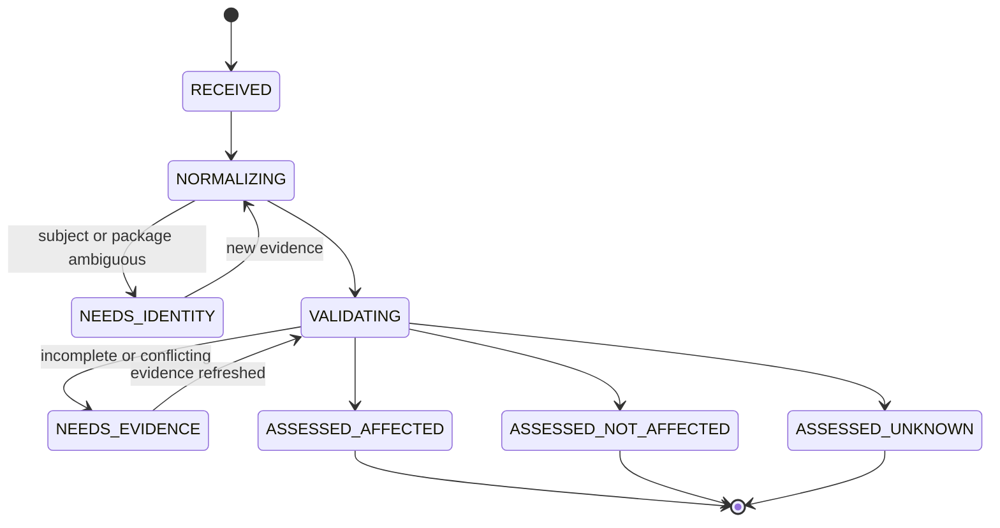

# Finding Intake, Identity, and Validation

The first job is to decide what the claim actually refers to. Vulnerability feeds and scanners disagree about identifiers, affected ranges, package ecosystems, products, severity, and fixes. The agent must preserve those claims, bind them to an immutable subject, and produce a validation decision without collapsing uncertainty.

## Separate the records

| Record | Meaning | Example |
|---|---|---|
| Vulnerability claim | What one source asserts | An OSV entry says package `pkg:maven/x/y` is affected in a range. |
| Logical vulnerability | Alias cluster used for navigation | A CVE, GHSA, and vendor ID judged to describe the same defect. |
| Subject | Immutable thing assessed | Repository commit, container digest, package release, host snapshot. |
| Occurrence | Claim intersected with one subject/component | CVE-X in package Y on image digest Z. |
| Observation | Raw or normalized fact without treatment judgment | Lockfile contains version 1.2.3 through path A → B → Y. |
| Evidence artifact | Immutable bytes and provenance supporting an observation | SBOM, lockfile, SARIF, asset export, advisory JSON, build log. |
| Assessment decision | Versioned interpretation | `AFFECTED`, confidence high, because affected range and reachable path agree. |
| Case | Durable work coordinating the occurrence | Validation through proof and closure. |

Deduplicate occurrences by tenant, normalized subject identity, component coordinate, source claim or alias cluster, and relevant context such as deployment/environment. Do not globally merge findings merely because they share a CVE.

## Identity and temporal semantics

Every record needs both an identity rule and a time rule. Store the source's original identifier and bytes; add normalized keys as versioned projections. Three clocks remain distinct:

- **source time**: when the publisher says a record was published, modified, withdrawn, or effective;
- **observation time**: when the exact asset, artifact, deployment, configuration, or control was observed; and
- **ingestion time**: when this system retrieved and persisted the bytes.

Never overwrite one clock with another or use ingestion order as proof of source order. A current decision is a temporal join across snapshots, not a merge into one timeless “vulnerability” row.

| Entity | Stable key or binding | Version and time semantics | Do not conflate |
|---|---|---|---|
| Asset | Tenant plus authoritative inventory namespace and native asset ID | Snapshot owner, environment, criticality, lifecycle state, `observed_at`, effective interval, source revision, and coverage; mutable fields create a new observation | Repository, component, image, or deployment |
| Component | Subject-local component key, normally PURL/CPE/SWID or file digest plus location/relationship | Bound to an artifact digest or host snapshot and generator/parser version; a component in another artifact is another observation | Package name alone or asset identity |
| Package release | Registry/distribution, ecosystem, namespace/name, version string, and downloaded artifact digest | Preserve original version and registry URL; compare only with the tested ecosystem adapter; record yanks, retractions, deprecations, and download time | Mutable tag, latest channel, upstream source repository, or equivalent distro build |
| Version | Original string plus ecosystem and comparison-adapter version | Ordering is scheme-specific; epochs, revisions, prereleases, pseudo-versions, and vendor backports may change the apparent order | Universal SemVer |
| Container image | Registry, repository, manifest digest, and platform-manifest digest where applicable | Tags are locators only; record resolution and pull time, platform, config digest, and deployment observation interval | Tag, image index, running workload, or source commit |
| Finding | Tenant, producer installation, scan execution, rule/query ID and version, exact subject, location/fingerprint, and producer-native result ID | Scanner state is a mutable projection; preserve first/last observed, rule/database/config versions, suppression state, and raw run digest | CVE, weakness class, or affected occurrence |
| CVE | CVE ID plus raw CVE Record Format version, provider container, update metadata, and content digest | The ID persists while a record can be updated or rejected; keep every retrieved revision and CNA/ADP assertions | Product applicability, CWE, scanner finding, or remediation status |
| CWE | CWE ID plus CWE List version | A living weakness taxonomy; names, mappings, relationships, and status can change between list releases | A concrete vulnerability or proof that a finding is exploitable |
| CVSS | Assessor/source, CVSS standard and document revision, complete vector, assessed subject/scope, and assessment time | Multiple legitimate vectors can coexist; recompute score with the pinned implementation because a vector carries metrics, not its numeric score | Organizational risk, EPSS, reachability, or priority |
| EPSS | CVE ID, score date, model generation, dataset/snapshot digest, probability, and percentile | Daily estimate; segment time series at model-generation changes; API `v1` is not the EPSS model generation | Local applicability, impact, or observed exploitation |
| KEV | CVE ID plus catalog snapshot/version digest | Membership has `dateAdded`, remediation guidance, and possibly a due date; retain first/last observation and removal/correction history | Proof that non-listed CVEs are unexploited or that federal deadlines bind every tenant |
| Exploit evidence | Publisher/native record ID and artifact digest, or tenant event ID for an observed attempt | Distinguish exploit-code availability, claimed exploitation, known exploitation, and a tenant-observed attack; record source, collection window, confidence, and retraction | Successful compromise or universal exploitability |
| Advisory | Publisher namespace, advisory ID, document revision/version, and raw digest | Preserve publisher time, retrieval time, revision history, withdrawal/supersession, affected product tree, and authenticated channel | CVE alias cluster or vendor truth outside the advisory's product scope |
| SBOM | Document namespace/serial number, BOM version, subject digest, raw digest, generator/version, and lifecycle phase | Immutable snapshot of declared/discovered composition with explicit completeness and generation time; a new build needs a new SBOM observation | Complete runtime inventory or vulnerability assessment |
| VEX | Issuer, document ID/version, statement ID, vulnerability, product/component identity, and raw digest | Preserve issue/update time, status, justification, action/impact statements, authority, supersession, and recheck time | Internal disposition, truth, or deletion of the original finding |
| Remediation | Case-owned treatment ID and plan version bound to occurrences | A treatment proposal evolves through explicit plan versions and decisions; it may be patch, mitigation, avoidance, transfer, or exception | Patch bytes, production change, or deployed proof |
| Patch candidate | Immutable base commit/artifact plus diff digest and candidate commit/artifact digest | Rebase, conflict resolution, regenerated lockfile, or changed tests creates a new candidate and invalidates exact approvals/results | Review approval, merge, release, or remediation completion |
| Change | Provider change/ticket/branch/PR ID plus provider revision and semantic effect ID | External mutable state is observed through receipts and reconciled snapshots; approval binds the exact payload and expiry | Patch candidate or deployment |
| Deployment | Tenant, environment, service/workload, deployment revision/rollout ID, artifact digest, and observed scope | Record intended and observed start/end times, partial rollout, supersession, rollback, and observer/source | Merge event, release label, or “latest” image tag |
| Verification | Plan/check ID, test-definition digest, tool/rules/database versions, exact subject/environment, result digest, and execution time | Results expire when subject, test, toolchain, rule set, environment, or required evidence changes | Scanner-alert disappearance or deployment proof |
| Exception | Tenant, exception ID, immutable scope digest, decision version, human authority receipt, start, and expiry | Renewal is a new decision; evidence, scope, owner, control, policy, KEV, or expiry changes can invalidate it | Agent proposal, permanent suppression, or remediation |

CVE Record Format 5.2 can carry optional unversioned PURLs alongside structured affected versions; that does not eliminate ecosystem-specific matching. CWE 4.20 identifies weakness types, not vulnerability instances. Treat both as versioned external taxonomies.

## Intake contract

```yaml
finding_occurrence:
  schema_version: "1.0"
  tenant_id: "t-42"
  occurrence_id: "occ_01J..."
  case_id: "case_01J..."
  received_at: "2026-08-31T08:00:00Z"
  claim:
    source: "osv"
    source_record_id: "GHSA-..."
    source_record_version: "sha256:..."
    source_artifact_ref: "evidence://t-42/sha256/..."
    aliases: ["CVE-...", "GHSA-..."]
    asserted_package:
      ecosystem: "Maven"
      name: "example.group:library"
      purl: "pkg:maven/example.group/library"
    asserted_ranges: []
    asserted_fix_versions: []
  subject:
    kind: "container_image"
    identity: "registry.example/app@sha256:..."
    snapshot_at: "2026-08-31T07:55:00Z"
    deployment_scope: ["service:checkout", "environment:production"]
  component_observation:
    coordinate: "pkg:maven/example.group/library@1.2.3"
    discovered_by: ["sbom", "lockfile"]
    dependency_paths: ["app -> framework -> library"]
  coverage:
    inventory_complete: false
    version_resolved: true
    dependency_path_resolved: true
    truncated: false
  correlation:
    dedupe_key: "sha256:..."
    related_occurrence_ids: []
```

Validate this structure in two phases: a schema validator checks types and required fields; domain validators check ecosystem-specific version syntax, identifier formats, subject existence, evidence digests, timestamp order, and tenant ownership.

## Intake workflow



### Deterministic steps first

1. Verify tenant and source authorization.
2. Persist raw bytes and compute a content digest before parsing.
3. Validate source schema and record parser/adaptor version.
4. Resolve the subject to an immutable revision or digest.
5. Normalize component coordinates using ecosystem rules; retain original strings.
6. Query alias records without overwriting individual source assertions.
7. Evaluate version ranges using the source ecosystem's semantics.
8. Locate direct and transitive dependency paths.
9. Deduplicate or attach to an existing open case using a versioned rule.
10. Request model judgment only for documented ambiguity or contradictory evidence.

## Version and identity rules

- Prefer artifact digests and repository commits over tags and branch names.
- Record both package ecosystem/name and Package URL when available; a PURL is not a substitute for verifying the actual installed artifact.
- Evaluate ranges with the ecosystem's real version comparison rules. Do not force every ecosystem into semantic versioning.
- For OSV ranges, prefer an explicit `fixed` boundary when present; treat `last_affected` according to the OSV schema rather than guessing the next version.
- Preserve vendor product/version and CPE matches as claims. CPE matching can be broad or ambiguous and requires asset validation.
- Treat aliases as a versioned resolver decision with source evidence, not as an immutable universal truth.
- A mutable SBOM or asset record must be snapshotted. A later snapshot creates new evidence and may create or update an occurrence; it must not rewrite history.

## Source disagreement

The resolver records every claim and a separate reconciliation decision:

```yaml
advisory_reconciliation:
  occurrence_id: "occ_01J..."
  decision_id: "dec_01J..."
  decision_version: 3
  compared_records:
    - ref: "evidence://.../osv-record"
      says: "affected below 1.2.4"
    - ref: "evidence://.../vendor-advisory"
      says: "affected below 1.2.5 when feature Q is enabled"
  conflict_type: "affected_range_and_precondition"
  resolution: "use vendor range for vendor build; retain OSV range as unresolved for upstream builds"
  applies_to: "artifact@sha256:..."
  confidence: "MEDIUM"
  produced_by:
    ruleset: "advisory-resolution/4"
    model: "model-family-and-snapshot"
    prompt: "sha256:..."
  evidence_refs: []
  review_after: "2026-09-07T08:00:00Z"
```

Prefer a first-party vendor advisory for that exact vendor build, but do not automatically discard independent disclosures or ecosystem advisories. Escalate when the chosen source lacks an authenticated publication channel, the advisory changed without an explainable version, the fix is disputed, or exploitation claims conflict.

## Validation decision

Use explicit applicability states:

| State | Meaning | Minimum requirement |
|---|---|---|
| `AFFECTED` | The exact subject meets affected conditions | Subject identity, component/version or code match, and required preconditions supported by evidence |
| `NOT_AFFECTED` | A documented exclusion applies to the exact subject | Positive evidence for an exclusion plus bounded scope and freshness |
| `FIXED` | The defect is absent from the assessed subject because the fix is present and verified | Exact fixed subject plus source/build/security verification; deployment proof is separate |
| `UNDER_INVESTIGATION` | Evidence collection is active | Owner, missing evidence, next action, deadline |
| `UNKNOWN` | Current evidence cannot decide | Conflicts or gaps listed; no implicit downgrade |

These states align conceptually with VEX, but the internal assessment remains distinct from any VEX document received or published.

## Failure handling

| Failure | Required behavior |
|---|---|
| Malformed or oversized source | Quarantine raw bytes, record parser error and digest, do not prompt the full payload |
| Source unavailable | Use last-known record only if policy permits; mark age and schedule refresh |
| Mutable tag or branch | Resolve to digest/commit or keep `NEEDS_IDENTITY`; never prepare against the moving name alone |
| Unknown ecosystem semantics | Stop range evaluation and request a supported adapter or human review |
| Conflicting aliases | Retain separate logical vulnerabilities until reviewed; avoid false deduplication |
| Inventory incomplete | Preserve `coverage.inventory_complete=false`; absence is not a not-affected decision |
| Duplicate event delivery | Return the existing occurrence and event receipt using the dedupe key |
| Suspected poisoned advisory | Quarantine, compare authenticated first-party records, notify connector owner |

## Exit gate for validated intake

- [ ] The occurrence points to an immutable or explicitly unresolved subject.
- [ ] Raw evidence and normalized observations are separate and content-addressed.
- [ ] Package and version semantics use a tested ecosystem adapter.
- [ ] Source conflicts remain visible and the reconciliation decision is versioned.
- [ ] Coverage, freshness, confidence, and truncation are explicit.
- [ ] The decision is `AFFECTED`, `NOT_AFFECTED`, `FIXED`, `UNDER_INVESTIGATION`, or `UNKNOWN`; there is no silent dismissal.
- [ ] Any active-compromise indicator has produced a SOC handoff event.

## Evaluation set

Maintain adjudicated cases across direct/transitive dependencies, forks, distro backports, vendor builds, renamed packages, prereleases, epoch/revision syntax, CPE collisions, alias conflicts, mutable tags, partial SBOMs, malformed feeds, duplicate deliveries, and deliberately poisoned metadata. Measure exact occurrence identity, version-range correctness, deduplication precision/recall, conflict preservation, unknown calibration, and false not-affected rate. The last metric is a non-compensating safety gate.

## Primary references

- [OSV schema](https://ossf.github.io/osv-schema/) — ecosystem-aware affected ranges, aliases, and package identity.
- [CVE Record Lifecycle](https://www.cve.org/about/Process), [CNA Rules 4.1](https://www.cve.org/ResourcesSupport/AllResources/CNARules), and [CVE Record Format 5.2.0](https://github.com/CVEProject/cve-schema/releases) — CVE roles, record rules, current schema, and PURL/version separation.
- [CWE List 4.20](https://cwe.mitre.org/data/index.html) and [Package URL / ECMA-427](https://github.com/package-url/purl-spec/blob/main/docs/specification/README.md) — versioned weakness taxonomy and package-coordinate syntax.
- [FIRST CVSS v4.0 Consumer Implementation Guide](https://www.first.org/cvss/v4.0/implementation-guide) — assessor/vector/score handling for CVSS consumers.
- [OASIS SARIF 2.1.0](https://docs.oasis-open.org/sarif/sarif/v2.1.0/) — static-analysis result interchange.
- [CycloneDX 1.7](https://cyclonedx.org/specification/overview/) and [SPDX 3.0.1](https://spdx.github.io/spdx-spec/v3.0.1/) — component and vulnerability evidence formats.
- [NIST OSCAL POA&M model](https://pages.nist.gov/OSCAL/learn/concepts/layer/assessment/poam/) — machine-readable separation of observations, risks, remediation, and deviations.
