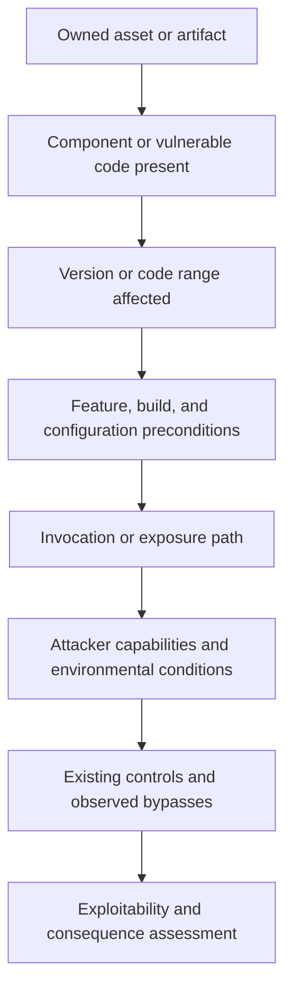

# Asset, Dependency, Reachability, and Exploitability Evidence

Applicability is a chain of claims, not a binary scanner label. The agent must establish what is deployed, whether the affected component or code is present, whether vulnerability preconditions hold, whether a plausible path reaches the vulnerable behavior, and what controls alter that path. Each link keeps its own evidence and uncertainty.

## Evidence ladder



Evidence may stop at any rung. The decision should then be `UNKNOWN` or qualified—not an invented yes or no.

## Evidence classes and the model boundary

The model does not turn analysis into validation merely by sounding confident. Each assertion records its evidence class, proposition, method, coverage, counterevidence, and expiry.

| Evidence class | Examples | What it can establish | Model role |
|---|---|---|---|
| Deterministic validation | Schema conformance, digest/signature check, package-version comparison, exact configuration predicate | That a stated machine-checkable condition held under a pinned validator | None beyond explaining a failure; the validator result is authoritative for its bounded predicate. |
| Direct subject observation | Artifact inventory, runtime package query, deployment digest, config snapshot, trace | What was observed on the exact subject during a stated window | Summarize and identify gaps; never alter the observation. |
| Controlled security validation | Safe reproduction, targeted regression, control-bypass test, instrumented call/data path | That behavior occurred or was blocked in an authorized environment with recorded preconditions | Propose a test or interpret multiple results; execution and pass/fail policy remain external. |
| External intelligence assertion | Vendor advisory, OSV/GHSA/NVD entry, KEV snapshot, exploit report, VEX | What an identified issuer asserted at a time | Reconcile contradictions and scope; cannot promote an assertion to tenant fact. |
| Bounded model analysis | Code explanation, missing-precondition hypothesis, likely path, patch rationale | A reviewable hypothesis or synthesis referencing other evidence | Must declare assumptions, alternative explanations, disconfirming test, confidence, and unsupported fields. It cannot by itself justify `NOT_AFFECTED`, `FIXED`, control effectiveness, or closure. |

For a high-impact exclusion, require positive non-model evidence for every decisive predicate. For an affected decision, bounded model analysis may route investigation when exact exploitability is unresolved, but priority policy must retain `UNKNOWN` rather than convert uncertainty into a low-risk score.

## Asset identity and inventory

An asset observation should include:

- tenant, environment, owner, service, and data classification;
- artifact digest, source revision, build provenance reference, and deployment observation time;
- runtime form: source checkout, package installation, image, function bundle, firmware, appliance, or host;
- exposure: public, partner, internal, administrative, batch-only, or isolated;
- lifecycle and criticality fields supplied by the organization's authoritative catalog;
- inventory source, observed freshness, expected coverage, and confidence.

Never let the model infer criticality from a service name. When inventory sources conflict, the resolver records the conflict and chooses an authoritative source according to policy. A repository containing a dependency is not proof that a production asset contains it; a production asset may also include dependencies absent from the repository's current default branch.

## Dependency and component evidence

Prefer an ordered evidence set:

1. observed deployed artifact or host package inventory;
2. SBOM generated from that exact artifact;
3. signed build provenance binding artifact to source and builder;
4. lockfile or package-manager resolved graph at the assessed revision;
5. manifest declaration;
6. heuristic source or binary discovery.

Higher-ranked evidence is not infallible. Record generator and parser versions, SBOM completeness, omitted scopes, platform variants, vendored code, static linking, build profiles, optional features, and post-build mutation.

```yaml
applicability_evidence:
  occurrence_id: "occ_01J..."
  subject_ref: "image@sha256:..."
  assertions:
    - assertion_id: "asrt_presence"
      type: "COMPONENT_PRESENT"
      value: true
      evidence_refs: ["evidence://.../artifact-sbom"]
      method: "artifact_sbom"
      coverage: "runtime image filesystem"
      confidence: "HIGH"
    - assertion_id: "asrt_path"
      type: "DEPENDENCY_PATH"
      value: "app -> framework -> vulnerable-library"
      evidence_refs: ["evidence://.../resolved-lockfile"]
      method: "package_manager_graph"
      confidence: "HIGH"
    - assertion_id: "asrt_reach"
      type: "REACHABILITY"
      value: "NO_OBSERVED_PATH"
      evidence_refs: ["evidence://.../call-analysis"]
      method: "static_call_graph"
      limitations: ["reflection", "runtime plugin loading", "native calls"]
      confidence: "LOW"
  freshness:
    asset_observed_at: "2026-08-31T07:55:00Z"
    advisory_retrieved_at: "2026-08-31T08:01:00Z"
    recheck_after: "2026-09-01T08:01:00Z"
```

## Reachability vocabulary

Avoid a single boolean. Use a state that describes the evidence:

| State | Interpretation |
|---|---|
| `CONFIRMED_REACHABLE` | A test, trace, call/data path, or known invoked feature reaches the vulnerable operation under relevant conditions. |
| `PLAUSIBLY_REACHABLE` | Component and path are present and preconditions could hold, but execution is not directly observed. |
| `NO_OBSERVED_PATH` | A bounded analysis did not find a path; documented blind spots prevent exclusion. |
| `BLOCKED_BY_VERIFIED_CONTROL` | A current, tested control prevents the required path for the assessed scope. |
| `CODE_NOT_PRESENT` | The exact vulnerable code is positively absent from the assessed artifact. |
| `UNKNOWN` | Evidence is missing, stale, contradictory, or unsupported. |

Only positive exclusion evidence such as code-not-present, feature-not-compiled, exact configuration, or a verified control can support `NOT_AFFECTED`. Even then, bind the decision to the artifact and environment and set a revalidation trigger.

### Static, dynamic, and configuration evidence

| Method | Strength | Common blind spots |
|---|---|---|
| Static call/data-flow graph | Repeatable path evidence without executing code | Reflection, dynamic dispatch, plugins, native code, generated code, framework magic, incomplete entry points |
| Runtime tracing or coverage | Observes real execution paths | Workload coverage, dormant endpoints, rare error paths, sampling, environment differences |
| Targeted exploit or security test | Strong precondition and consequence evidence | Test safety, incomplete variants, false negatives, test artifacts that differ from production |
| Configuration/build inspection | Can prove feature disabled or code omitted | Drift, overrides, runtime flags, mutable control plane |
| Perimeter/control test | Shows a mitigation works for scoped traffic | Alternate paths, internal attackers, fail-open behavior, control drift |
| Manual code review | Handles semantics tools miss | Reviewer variance, scale, hidden runtime behavior |

Use multiple independent methods for high-impact not-affected decisions. A language-specific call-analysis feature must pass an adoption corpus before being used as evidence. For example, OSV-Scanner v2 exposes call-analysis output, but coverage depends on ecosystem and implementation; the current result field name still signals evolving semantics. Trivy documentation explicitly says it does not perform code-graph analysis. Adapter capabilities therefore live in versioned manifests, not marketing assumptions.

## Exploitability assessment

CVSS Attack Vector or Attack Complexity is not the same as observed reachability in this environment. The assessment should combine:

- vulnerability preconditions from primary advisories and technical analysis;
- reachable interface and required attacker position;
- authentication, privileges, and user interaction;
- feature/configuration/build conditions;
- data-flow or call-path evidence;
- deployed controls and their failure modes;
- known exploitation evidence and recency;
- consequence on the specific asset and adjacent trust boundaries.

The agent may summarize a safe proof-of-concept supplied by an authorized source, but should not retrieve or execute weaponized exploit code by default. Exploit tests require an isolated authorized target, explicit scope, rate/resource limits, no production secrets, a stop condition, and a human-approved safety plan when the test may be destructive.

## VEX handling

VEX communicates an issuer's status assertion such as affected, not affected, fixed, or under investigation. Treat it as evidence with:

- authenticated issuer and distribution channel;
- document and statement version;
- product and component identity, preferably immutable digest where supported;
- status, justification, impact statement, action statement, and timestamps;
- scope and environmental assumptions;
- issuer authority for that product;
- supersession and revalidation rules.

A signed VEX proves who signed the assertion and protects integrity; it does not prove the assertion is correct. Third-party or internal VEX still requires trust policy. For `not_affected`, require the claimed justification to match independently observed facts when risk warrants it. Never suppress the raw finding; attach the VEX assessment as a reversible decision.

## Revalidation triggers

Schedule a new assessment when any of these change:

- subject digest, deployment, package graph, build flags, or runtime configuration;
- advisory range, aliases, exploitation status, or fix guidance;
- KEV membership or other verified exploitation intelligence;
- EPSS model generation or material score change;
- network exposure, identity requirements, data classification, or compensating control;
- scanner, parser, reachability analyzer, SBOM generator, or policy version;
- exception expiry or owner change;
- new evidence contradicting the decision.

## Failure modes and safeguards

| Failure | Safeguard |
|---|---|
| Stale CMDB says an asset is retired | Require recent deployment/inventory observation; mark discrepancy and notify asset owner. |
| Package name collision | Resolve ecosystem, namespace, PURL, distribution/vendor build, and artifact evidence. |
| SBOM omits statically linked or vendored code | Record generator coverage; supplement with binary/source analysis. |
| Negative call graph becomes false dismissal | Use `NO_OBSERVED_PATH`, enumerate blind spots, and forbid automatic not-affected mapping. |
| VEX suppresses a real occurrence | Retain original finding, scope VEX to exact product, check issuer and freshness, periodically reassess. |
| Control claimed but not tested | Keep as proposed or unverified; do not reduce exposure until a scoped test receipt exists. |
| Exploit test harms a target | Default to non-destructive isolated tests; require explicit authorization and abort controls. |
| Inventory query crosses tenant | Enforce tenant in connector credential, query, storage key, and returned envelope. |

## Exit gate

- [ ] Asset, artifact, package, dependency path, and configuration claims cite immutable evidence.
- [ ] Every negative result lists method coverage and blind spots.
- [ ] Reachability and exploitability use separate states.
- [ ] VEX issuer, identity, scope, status, justification, and freshness are validated.
- [ ] Controls are observed and tested rather than inferred from policy documents.
- [ ] An affected/not-affected/unknown decision has a revalidation trigger.
- [ ] Dangerous testing is explicitly authorized and isolated.

## Primary references

- [CISA SBOM Framing, 2024](https://www.cisa.gov/sites/default/files/2024-10/SBOM%20Framing%20Software%20Component%20Transparency%202024.pdf) — component transparency and the role of VEX.
- [CISA Minimum Requirements for VEX](https://www.cisa.gov/sites/default/files/2023-04/minimum-requirements-for-vex-508c.pdf) — minimum statuses and not-affected justification.
- [CycloneDX VEX](https://cyclonedx.org/capabilities/vex/) and [CycloneDX 1.7](https://cyclonedx.org/docs/1.7/proto/) — analysis states, justifications, and responses.
- [OASIS CSAF 2.0](https://docs.oasis-open.org/csaf/csaf/v2.0/os/csaf-v2.0-os.html) — advisory and VEX profile semantics.
- [OSV-Scanner v2 output and call analysis](https://google.github.io/osv-scanner/output/) — current call-analysis behavior and result structure.
- [Trivy VEX repository documentation](https://trivy.dev/docs/latest/guide/supply-chain/vex/repo/) — experimental status and limitations.
