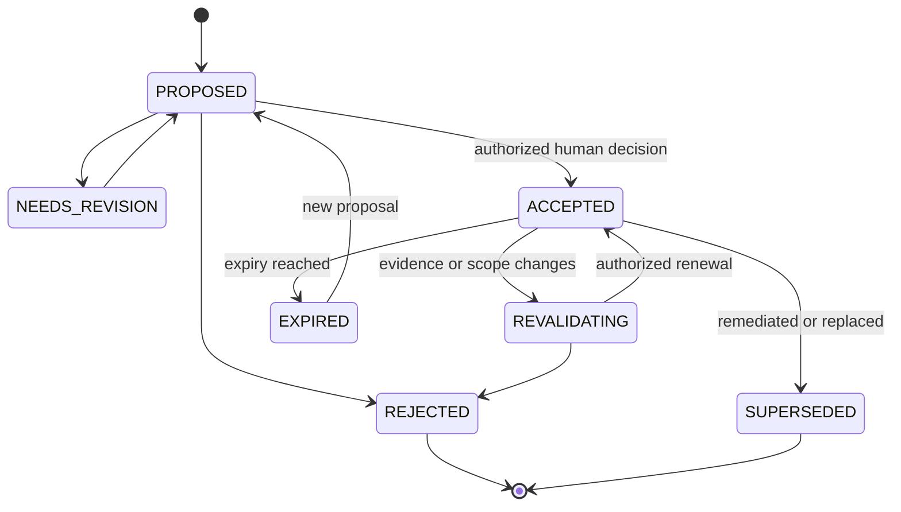

# Risk Prioritization, Compensating Controls, and Exceptions

Prioritization is a reviewable decision over evidence, not a formula that turns one public score into organizational risk. The agent should expose the factors, missing data, policy thresholds, and reason for the recommended queue position. It can propose a treatment; accountable humans set risk tolerance, approve high-impact mitigations, and accept residual risk.

## Keep the signals distinct

| Signal | What it contributes | What it does not establish |
|---|---|---|
| CVSS v4.0 | Standardized severity characteristics; Threat and Environmental metrics can add current and local context | Organizational risk, asset presence, reachability, or exploitation in this tenant |
| EPSS | Daily probability estimate that a published CVE will be observed exploited in the wild in the next 30 days, plus percentile | Asset applicability, impact, control effectiveness, or a complete risk score |
| CISA KEV | Strong evidence that a listed vulnerability has known exploitation and an action-oriented catalog record | Absence of exploitation when not listed; universal legal deadlines outside covered FCEB agencies |
| SSVC | A customizable decision-tree method for action outcomes such as Track, Track*, Attend, and Act | A mandatory universal tree or fixed business policy |
| Asset and exposure evidence | Ownership, deployment, reachability, data, blast radius, and mission impact | Global exploit activity |
| Compensating controls | Tested reduction in likelihood or consequence for a scoped environment | Removal of the defect or permanent closure |

CVSS Base is intentionally intrinsic and generally worst-case. NVD enriches CVEs with CVSS Base information but does not supply the organization's Threat and Environmental metrics. Preserve vector strings and version, not only a rounded numeric score.

As of the research date, FIRST publishes EPSS model **v5** data beginning 2026-06-15. EPSS API `v1` labels the API contract, not the model generation. Persist score date and model generation because scores from different generations are not necessarily comparable. The API is documented as beta, so isolate it behind an adapter and cache signed or digested daily snapshots used for decisions.

## Explainable priority decision

Use an organization-owned policy function rather than a model-authored score:

```yaml
priority_decision:
  occurrence_id: "occ_01J..."
  decision_id: "prio_01J..."
  policy_version: "vuln-priority/12"
  evaluated_at: "2026-08-31T09:00:00Z"
  inputs:
    applicability: "AFFECTED"
    reachability: "PLAUSIBLY_REACHABLE"
    cvss:
      version: "4.0"
      vector: "CVSS:4.0/..."
      base_score: 8.7
      source_ref: "evidence://..."
    epss:
      model_generation: "v5"
      score_date: "2026-08-31"
      probability: 0.18
      percentile: 0.94
      source_ref: "evidence://..."
    kev:
      listed: false
      catalog_observed_at: "2026-08-31T08:30:00Z"
    exposure: "INTERNET_AUTHENTICATED"
    asset_criticality: "HIGH"
    data_classification: "RESTRICTED"
    existing_controls:
      - control_id: "waf-rule-17"
        verification_ref: "evidence://..."
        residual_limitations: ["internal path not covered"]
    evidence_confidence: "MEDIUM"
  output:
    queue: "P1"
    target_policy_window: "org-policy-reference"
    rationale_codes:
      - "AFFECTED_HIGH_VALUE_ASSET"
      - "EXTERNALLY_REACHABLE"
      - "CONTROL_PARTIAL"
    uncertainty: ["runtime path not directly observed"]
    next_reassessment_at: "2026-09-01T09:00:00Z"
```

Do not hard-code example `P1` windows in the agent blueprint. Each organization must define response targets from risk appetite, regulation, contracts, system criticality, exploit activity, operational constraints, and capacity. The system stores a policy reference and exact version used.

## Decision order

1. Confirm applicability or retain `UNKNOWN`.
2. Apply mandatory policy signals, including jurisdiction- or sector-specific rules.
3. Evaluate active exploitation evidence, exposure, attacker prerequisites, and control effectiveness.
4. Evaluate consequence using asset criticality, data, privileges, blast radius, safety, and mission dependency.
5. Check fix availability, patch complexity, operational risk, and compensating controls.
6. Recommend a queue, treatment, owner, due policy, and reassessment trigger.
7. Have deterministic policy validate the recommendation and route human review where required.

### Deterministic priority gates

The model can explain evidence but cannot invent thresholds, deadlines, weights, or exceptions. Evaluate gates in policy order and persist every matched rule:

| Gate | Deterministic input | Required outcome |
|---|---|---|
| Identity and applicability | Exact tenant/subject; assessment state and evidence freshness | `UNKNOWN` or incomplete identity routes to investigation; it cannot receive a low-priority dismissal. |
| Mandatory obligation | Jurisdiction, sector, contract, asset class, catalog entry, due-policy version | Apply only the organization's mapped obligation; retain the external source and scope decision. |
| Active exploitation or compromise | Authenticated KEV/intelligence record or tenant observation with confidence policy | Urgent human/security routing; suspected compromise transfers to incident response. |
| Consequence floor | Organization-owned criticality, data, safety, privilege, blast-radius fields | Enforce minimum queue/reviewer set; never infer values from names or model prose. |
| Exposure and controls | Fresh path/exposure observation and verified control receipts | Apply only tested, in-scope reductions; stale, partial, or bypassable controls retain residual uncertainty. |
| Fix and change risk | Supported fix, compatibility class, change class, rollback feasibility | Select remediation, mitigation, investigation, or exception proposal; do not let “easy fix” erase impact. |
| Capacity and deadline | Queue state, owner, target window, service capacity, escalation policy | Schedule transparently; capacity pressure cannot silently lower priority or extend an exception. |

Policy output includes `matched_rule_ids`, `unmatched_required_inputs`, `policy_version`, `input_digest`, and `next_reassessment_at`. A model recommendation that conflicts with a hard rule is rejected, recorded, and evaluated as a policy-disagreement failure.

If the record is in KEV, use it as a high-priority action signal. Do not claim that Binding Operational Directive 22-01 deadlines govern every organization; they apply to U.S. federal civilian executive branch agencies, while CISA recommends broader use of the catalog.

SSVC trees are useful for making policy explicit, but CERT/CC describes the published decision points as suggestions that organizations may customize. Record the tree version, decision-point values, outcome, and timestamp. Re-evaluate time-varying inputs rather than treating an outcome as permanent.

## Treatment selection

| Treatment | Agent output | Human-owned decision |
|---|---|---|
| Remediate | Minimal patch or upgrade plan, compatibility analysis, tests, rollback proposal | High-impact change approval, merge, release |
| Mitigate | Testable compensating-control proposal with coverage and residual risk | Production activation and operational ownership |
| Avoid | Proposal to disable/remove exposed functionality or asset | Product/operations approval and production execution |
| Transfer/share | Contractual or service-provider coordination package | Legal, procurement, or business decision |
| Accept | Exception proposal with evidence and expiration | Explicit acceptance by accountable risk owner |
| Investigate | Missing-evidence plan with owner and deadline | Resource commitment and escalation |

## Compensating-control contract

```yaml
control_proposal:
  proposal_id: "ctrl_01J..."
  occurrence_id: "occ_01J..."
  control_type: "NETWORK_POLICY"
  target_scope:
    resources: ["service:checkout"]
    environments: ["production"]
    immutable_refs: ["deployment-revision:..."]
  intended_effect: "block unauthenticated access to vulnerable endpoint"
  preconditions: ["all external ingress traverses gateway X"]
  implementation_plan_ref: "artifact://..."
  verification_plan_ref: "artifact://..."
  rollback_plan_ref: "artifact://..."
  limitations: ["internal east-west path remains"]
  residual_risk: "MEDIUM"
  owner_required: "network-service-owner"
  review_after: "2026-09-07T00:00:00Z"
  authority: "PROPOSAL_ONLY"
```

A control stays `PROPOSED` until the production owner activates it and a separate observation confirms both deployment and effectiveness. A mitigation should not automatically close the vulnerability occurrence; it changes priority and residual risk while remediation remains tracked unless policy explicitly permits another state.

## Exception lifecycle



```yaml
exception:
  exception_id: "exc_01J..."
  occurrence_ids: ["occ_01J..."]
  proposal:
    rationale: "vendor fix unavailable; service retirement planned"
    residual_risk: "HIGH"
    compensating_control_refs: ["ctrl_01J..."]
    remediation_owner: "team-checkout"
    milestone_refs: ["ticket://..."]
    requested_until: "2026-10-15T00:00:00Z"
    reassessment_schedule: "policy:vuln-exception/high"
  decision:
    status: "ACCEPTED"
    decided_by: "human-principal-id"
    authority_role: "system-risk-owner"
    decided_at: "2026-09-01T10:00:00Z"
    approval_receipt_ref: "receipt://..."
    exact_scope_digest: "sha256:..."
  invalidation_conditions:
    - "KEV_LISTING"
    - "MATERIAL_EPSS_CHANGE"
    - "ASSET_EXPOSURE_CHANGE"
    - "FIX_AVAILABLE"
    - "CONTROL_FAILURE"
```

The proposal and the acceptance are separate records. The agent can create and update the proposal, but only a human principal with current authority can populate the acceptance receipt. Expiry automatically removes the decision's active status; renewal requires a new decision, not a date edit.

## Escalation rules

Escalate immediately when:

- evidence indicates active exploitation or compromise;
- a high-value exposed asset is affected and no owner accepts the case;
- a mandatory remediation deadline is approaching or breached;
- controls fail, drift, or leave an unassessed alternate path;
- a fix requires a breaking change, data migration, cryptographic rotation, or broad production mitigation;
- source conflicts materially change the priority;
- the proposed approver lacks authority or segregation-of-duties requirements cannot be met;
- a cross-tenant or sensitive-data exposure is suspected.

## Anti-patterns

- Sorting solely by CVSS Base score.
- Multiplying CVSS and EPSS into an unexplained pseudo-risk number.
- Treating low EPSS or KEV absence as a dismissal.
- Letting the model invent business impact or deadlines.
- Using a VEX `not_affected` status without subject-level evidence.
- Allowing an exception without owner, exact scope, expiry, milestones, control evidence, and revalidation triggers.
- Counting an unverified WAF rule or configuration toggle as remediation.
- Letting the person or agent proposing an exception approve it.

## Exit gate

- [ ] Priority inputs retain source, timestamp, version, and uncertainty.
- [ ] CVSS, EPSS, KEV, SSVC, exposure, and impact retain their distinct meanings.
- [ ] Policy—not model prose—maps evidence to queue and review requirements.
- [ ] Proposed controls define scope, preconditions, test, rollback, owner, residual risk, and review date.
- [ ] Accepted exceptions have a human receipt, authority proof, immutable scope, expiry, milestones, and invalidation conditions.
- [ ] Active exploitation and deadline breaches route to an accountable human immediately.

## Primary references

- [FIRST CVSS v4.0 specification](https://www.first.org/cvss/v4.0/specification-document) and [implementation guide](https://www.first.org/cvss/v4.0/implementation-guide) — metric semantics and environmental use.
- [NVD vulnerability metrics](https://nvd.nist.gov/vuln-metrics/cvss) — why CVSS is severity, not risk.
- [FIRST EPSS](https://www.first.org/epss/), [FAQ](https://www.first.org/epss/faq), and [data/change log](https://www.first.org/epss/data.html) — prediction meaning, limitations, and model generations.
- [CISA KEV Catalog](https://www.cisa.gov/known-exploited-vulnerabilities-catalog) and [directives](https://www.cisa.gov/news-events/directives) — known exploitation and directive scope.
- [CERT/CC SSVC](https://certcc.github.io/SSVC/) and [CISA SSVC guide](https://www.cisa.gov/sites/default/files/publications/cisa-ssvc-guide%20508c.pdf) — decision-tree approach and outcomes.
- [NIST OSCAL POA&M](https://pages.nist.gov/OSCAL/learn/concepts/layer/assessment/poam/) — risks, remediation plans, and deviations including acceptance.
