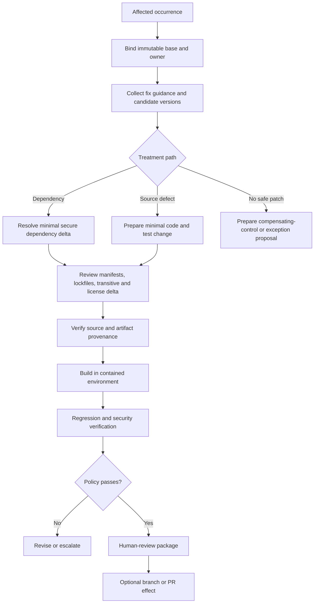

# Secure Patching and Dependency Upgrades

The agent prepares the smallest safe remediation against an immutable base in an isolated workspace. It does not merge, promote, deploy, or activate high-impact production controls. A fixed version is an input to planning, not proof that an upgrade is compatible, authentic, or complete.

## Preparation workflow



## Patch-plan contract

```yaml
patch_plan:
  plan_id: "patch_01J..."
  plan_version: 2
  occurrence_ids: ["occ_01J..."]
  repository:
    tenant_id: "t-42"
    repo_id: "repo-checkout"
    base_commit: "40-hex-or-provider-immutable-id"
    workspace_id: "ws_01J..."
  treatment:
    kind: "DEPENDENCY_UPGRADE"
    rationale: "minimum candidate outside all reconciled affected ranges"
    files_expected: ["pom.xml", "pom.lock"]
    candidate_changes:
      - package: "pkg:maven/example.group/library"
        from: "1.2.3"
        to: "1.2.5"
        direct: false
        resolution_strategy: "upgrade direct parent dependency"
    alternatives_rejected:
      - option: "force transitive override"
        reason: "violates project dependency policy"
  constraints:
    forbidden_paths: ["deployment/production/"]
    max_changed_files: 8
    max_dependency_delta: 20
    network_profile: "package-registry-readonly"
    secrets: "NONE"
  validation:
    required_commands: ["project-native unit test command"]
    security_test_refs: ["artifact://security-regression-plan"]
    dependency_review_required: true
    provenance_verification_required: true
  rollback:
    strategy: "revert patch commit before promotion"
    limitations: ["runtime data migration not expected"]
  authority: "PREPARE_ONLY"
```

The patch worker receives the plan, immutable base, and one scoped capability. It verifies the base before editing and again before publication. Unexpected generated files, registry changes, install scripts, dependency explosions, or protected-path changes stop the run.

## Deterministic preparation and change gates

Gates fail closed independently; a high aggregate score never compensates for a failed required gate.

| Gate | Deterministic evidence | Failure outcome |
|---|---|---|
| Subject gate | Occurrence, repository, base commit, affected component/path, tenant, and owner agree | `NEEDS_IDENTITY`; do not create a workspace. |
| Fix gate | Candidate exits every applicable reconciled affected range or implements the reviewed root-cause correction | Revise candidate or request adjudication; never trust a release label alone. |
| Source-integrity gate | Registry/repository allowlist, downloaded digest, lock integrity, signature/provenance policy, publisher/namespace checks | Quarantine candidate and open a supply-chain review. |
| Compatibility gate | Runtime/toolchain support, API/ABI/schema/config constraints, platform matrix, migration/release notes, project compatibility tests | `NEEDS_OWNER_REVIEW` or reject; the model cannot waive unsupported combinations. |
| Dependency-delta gate | Direct/transitive graph diff, licenses, registries, maintainers, install scripts, binaries, and configured budgets | Stop broad or unexpected churn and propose a narrower option. |
| Change-class gate | Protected paths and organization taxonomy for auth, crypto, CI/CD, data, infrastructure, safety, and multi-service effects | Require the configured human reviewers and approvals; never self-downgrade the class. |
| Execution gate | Disposable worker, exact base, no ambient secrets, allowed egress, resource/time limits | Terminate, preserve receipts, and invalidate outputs from the untrusted run. |
| Verification gate | Required functional, security, build, scan, and compatibility checks on the exact candidate | Reject the candidate; do not average or omit the failed check. |
| Publication gate | Current branch/base, payload digest, destination, audience, exact approval, semantic effect ID | Deny or enter reconciliation; do not silently rebase or open a duplicate change. |

## Dependency-upgrade procedure

1. Reconcile affected and fixed ranges across authoritative sources for the exact distribution.
2. Enumerate direct and transitive paths and identify which manifest controls resolution.
3. Inspect upstream release notes, migration guides, security advisories, signatures or provenance, supported runtime constraints, and known regressions.
4. Choose the smallest candidate that exits every applicable affected range and complies with project policy. A later version may be safer when the minimum fixed release is unsupported or itself defective; document the choice.
5. Run the package manager in a disposable environment with registry allowlists, no production credentials, and install scripts disabled where the ecosystem and project permit.
6. Capture manifest, lockfile, dependency graph, package source, checksums, signatures/attestations, license, maintainer or namespace changes, and transitive delta.
7. Reject or escalate unexpected package substitutions, new registries, mutable sources, unpinned VCS references, binary downloads, broad transitive churn, or lifecycle-script network behavior.
8. Build and test with the same supported toolchain and platform variants used by the project.
9. Rescan the candidate artifact and verify the original occurrence plus newly introduced dependencies.
10. Produce a reviewable patch and proof preview; publishing a branch or PR is a separate effect.

Provider-native remediation tools may be adapters, not the source of truth. Dependabot security updates generally target an available secure version but ecosystem and transitive-update limitations vary. Renovate vulnerability-alert flows are configurable. OSV-Scanner v2 has an **experimental** guided `fix` mode whose formats can change in a minor release; its documentation also warns that package managers can execute project scripts and access external registries. Each adapter must therefore run under the same containment, evidence, and verification policy.

## Source patch procedure

For source defects, the agent:

- reproduces or establishes the vulnerable behavior safely;
- identifies the smallest change that removes the root cause rather than only hiding the scanner pattern;
- follows existing repository conventions and supported APIs;
- adds a security regression test that fails on the immutable base and passes on the candidate when feasible;
- runs relevant unit, integration, static, type, lint, build, and compatibility checks;
- records changed files and hunks, reasoning, test selection, toolchain versions, and unresolved risks;
- refuses unrelated refactors, feature work, dependency modernization, or formatting churn.

General code changes that are not necessary to remediate the occurrence transfer to the coding-agent backlog. The remediation agent may request a coding-agent contribution, but the remediation case remains the evidence and acceptance coordinator.

### Safe coding handoff

A coding handoff is a typed request, not a prose instruction to “fix the CVE”:

```yaml
coding_handoff:
  handoff_id: "handoff_01J..."
  occurrence_refs: ["occurrence://occ_01J..."]
  base_commit: "immutable-commit"
  affected_behavior_ref: "evidence://safe-reproduction"
  root_cause_claim_ref: "decision://root-cause/2"
  allowed_paths: ["src/parser/", "tests/security/"]
  forbidden_changes: ["deployment", "credentials", "unrelated refactor"]
  required_security_property: "untrusted entity expansion cannot read local files"
  required_checks: ["security-regression", "project-unit", "compatibility-matrix"]
  workspace_profile: "isolated-no-secrets-controlled-egress"
  return_contract:
    - "base and candidate commit"
    - "diff digest and changed-file list"
    - "test-definition and result digests"
    - "dependency/build provenance"
    - "unresolved assumptions and failures"
  authority: "PATCH_PREPARATION_ONLY"
```

The receiving coding system cannot widen paths, change the base, publish, merge, or declare remediation complete. Any necessary scope expansion returns a revised proposal to the case owner and invalidates prior exact approvals.

## Supply-chain safeguards

| Threat | Control |
|---|---|
| Compromised or typosquatted replacement | Registry and namespace allowlist, checksum/signature/provenance validation, maintainer/source review, dependency diff |
| Malicious install/build script | Disposable worker, no ambient secrets, read-only base, controlled egress, resource/time limits, captured process tree |
| Dependency confusion | Approved registries, namespace ownership, lockfile integrity, explicit source resolution |
| Mutable tag or artifact | Resolve to commit/digest and retain downloaded artifact digest |
| Build substitution | Bind source, builder, parameters, and output digest with provenance where available |
| Stale or rollback update metadata | Trusted update metadata, freshness/rollback protections, cached evidence, fail closed where policy requires |
| Compromised CI workflow | Treat workflow changes as high impact; do not run untrusted code in privileged workflows |
| Generated-code concealment | Review generator and input changes; compare generated output; apply file/path limits |

SLSA provenance describes where and how an artifact was produced. Sigstore or similar mechanisms can authenticate signatures and attestations. The Update Framework and in-toto address update and supply-chain integrity properties. None proves a release is vulnerability-free or behaviorally safe; they complement, not replace, testing and review.

## CI trust split

Run patched repository code in a low-trust workflow with minimal read permissions and no production or publishing secrets. Privileged publication, attestations, deployment, or comments that need elevated tokens consume only validated artifacts/results and run separately. In GitHub Actions, do not combine untrusted pull-request checkout with `pull_request_target` privileges; GitHub explicitly warns that doing so can expose secrets and write tokens.


## Publication effect

```yaml
effect_intent:
  effect_id: "eff_pr_repo-checkout_patch_01J_v2"
  operation: "CREATE_OR_UPDATE_REMEDIATION_PR"
  tenant_id: "t-42"
  target:
    repository: "repo-checkout"
    base_commit: "..."
    branch: "security/remediate-occ_01J"
  payload_digest: "sha256:patch-and-description"
  approval_ref: "approval://optional-exact-policy-or-human-receipt"
  idempotency_key: "tenant/repo/plan-version"
  expected_state:
    branch_absent_or_owned_by_effect: true
  timeout_seconds: 30
```

If the provider times out, store `UNKNOWN`. Reconcile by idempotency marker, branch head, commit digest, PR metadata, and provider audit records. Never create a second PR merely because the response was lost.

## High-impact change triggers

High-impact patches are human-owned. When a proposed change affects authentication/authorization, cryptography, deserialization, network policy, data schema or migration, security logging, secrets, CI/CD, infrastructure, public APIs, safety-critical behavior, broad dependency trees, or multiple independently owned services, the agent stops at an analysis, test plan, and patch design. It may prepare a bounded draft only after an accountable human explicitly commissions that exact work; human review is still required before publication, and merge/deployment remain human-owned. Also escalate when tests are missing, nondeterministic, or cannot cover the exploited path.

## Failure handling

| Failure | Response |
|---|---|
| Base revision moved | Rebase only by creating a new plan version; invalidate stale approval and rerun verification. |
| No fixed version | Propose source backport, control, or exception; do not invent a safe version. |
| Fix versions disagree | Preserve sources and use the conservative supported candidate or human adjudication. |
| Resolver changes many dependencies | Stop at delta budget and request owner review. |
| Tests pass but security reproduction still succeeds | Fail the security gate; never average it with regression success. |
| Package manager needs secrets or open egress | Request a narrowly brokered source or human-run path; never reuse developer/production credentials. |
| Upstream artifact lacks expected integrity | Quarantine candidate and escalate supply-chain concern. |
| PR effect ambiguous | Enter `RECONCILING`; query provider state before retry. |

## Exit gate for a prepared remediation

- [ ] Plan is bound to an immutable base and exact occurrences.
- [ ] The diff is necessary, scoped, provenance-recorded, and free of unrelated changes.
- [ ] Dependency and supply-chain deltas are reviewed against policy.
- [ ] Project-native and security-specific verification passes on the candidate.
- [ ] Tests run in an isolated low-trust environment with no ambient secrets.
- [ ] Rollback and compatibility limitations are explicit.
- [ ] The review package states that merge, promotion, production mitigation, and exception acceptance remain human-owned.
- [ ] Publication effect is idempotent and reconcilable.

## Primary references

- [NIST SP 800-40 Rev. 4](https://csrc.nist.gov/pubs/sp/800/40/r4/final) — identify, prioritize, acquire, install, and verify enterprise patches.
- [NIST SSDF SP 800-218](https://csrc.nist.gov/pubs/sp/800/218/final) — secure development and remediation practices.
- [NIST SP 800-53 Release 5.2.0](https://csrc.nist.gov/pubs/sp/800/53/r5/upd1/final) — flaw remediation, testing, configuration management, and root-cause analysis controls.
- [OSV-Scanner v2 experimental guided remediation](https://google.github.io/osv-scanner/experimental/guided-remediation/), [usage](https://google.github.io/osv-scanner/usage/), and [migration guide](https://google.github.io/osv-scanner/migration-guide.html) — current maturity, supported strategies, and package-manager cautions.
- [GitHub Dependabot security updates](https://docs.github.com/en/code-security/concepts/supply-chain-security/dependabot-security-updates) and [dependency review](https://docs.github.com/en/code-security/concepts/supply-chain-security/dependency-review) — provider-native update and diff behavior.
- [GitHub secure use of `pull_request_target`](https://docs.github.com/en/actions/reference/security/securely-using-pull_request_target) — privileged-workflow threat model.
- [SLSA v1.2 build provenance](https://slsa.dev/spec/v1.2/build-provenance), [The Update Framework security](https://theupdateframework.io/docs/security/), and [in-toto specification](https://in-toto.io/docs/specs/) — artifact and update integrity.
