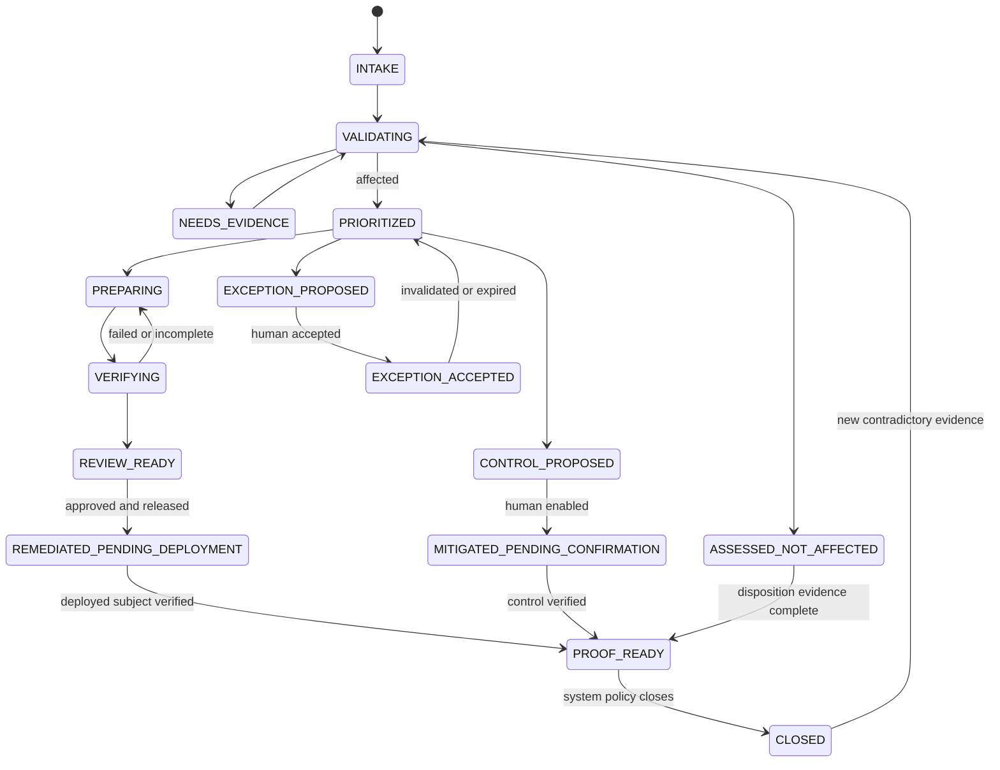

# Verification, Remediation Proof, and Handoff

Verification answers two independent questions: did the change remove or contain the vulnerability, and did it preserve required behavior? Remediation proof then binds those results to the exact reviewed change and the exact deployed subject. A source-tree pass cannot prove that production is remediated.

## Verification layers

| Layer | Required question | Typical evidence |
|---|---|---|
| Reproduction | Did the known vulnerable behavior exist on the base? | Safe test, trace, vulnerable call path, scanner result with exact subject |
| Patch intent | Does the candidate remove the root cause or affected component? | Diff review, fixed version/range reconciliation, configuration delta |
| Security regression | Does the relevant attack/precondition now fail safely? | Targeted negative/positive tests, property test, analyzer result |
| Functional regression | Does required behavior still work? | Unit, integration, contract, end-to-end, compatibility tests |
| Build and supply chain | Is the candidate reproducibly tied to reviewed source and trusted inputs? | build manifest, dependency diff, provenance, signatures, digests |
| Candidate scan | Did the original occurrence disappear without unacceptable new findings? | SCA/SAST/image scan on candidate artifact plus triage |
| Deployment observation | Is the reviewed candidate actually deployed to the intended scope? | deployment record, runtime/package version, image digest, attestation |
| Post-deployment validation | Does the deployed subject remain fixed or effectively controlled? | rescan, safe probe, config/control observation, telemetry |

Security and regression gates are non-compensating. A high unit-test pass rate cannot offset a reproduced exploit. A clean scanner cannot offset failing functionality. A signed artifact cannot offset a vulnerable result.

## Verification plan

```yaml
verification_plan:
  verification_id: "verify_01J..."
  occurrence_ids: ["occ_01J..."]
  base_subject: "repo@commit:..."
  candidate_subject: "repo@commit:..."
  policy_version: "remediation-proof/8"
  checks:
    - check_id: "security-regression"
      type: "SECURITY_TEST"
      command_ref: "project-command://security-test-vuln-X"
      required: true
      expected: "vulnerable payload rejected without side effect"
      environment_profile: "isolated-untrusted"
    - check_id: "dependency-diff"
      type: "DEPENDENCY_REVIEW"
      required: true
      limits:
        max_new_dependencies: 5
        deny_unapproved_registries: true
    - check_id: "project-tests"
      type: "PROJECT_NATIVE_TESTS"
      required: true
      selection_basis: "changed dependency and affected service"
  invalid_if:
    - "candidate subject changes"
    - "test definition changes without review"
    - "toolchain outside supported manifest"
```

Store test definitions and their versions separately from results. If the patch changes the test that proves the defect, require an independent review or immutable baseline reproduction to avoid self-validating tests.

## Proof bundle

```yaml
remediation_proof:
  proof_id: "proof_01J..."
  proof_schema_version: "1.0"
  tenant_id: "t-42"
  case_id: "case_01J..."
  occurrence_ids: ["occ_01J..."]
  assessment:
    decision_ref: "decision://assessment/7"
    evidence_refs: ["evidence://advisory", "evidence://artifact-sbom"]
  treatment:
    kind: "PATCH"
    plan_ref: "artifact://patch-plan/2"
    reviewed_diff_digest: "sha256:..."
    source_commit: "..."
    candidate_artifact_digest: "sha256:..."
  authority:
    review_receipts: ["receipt://security-review", "receipt://code-owner"]
    release_receipt: "receipt://deployment-system"
  verification:
    policy_version: "remediation-proof/8"
    result_manifest_ref: "artifact://verification-results"
    required_checks_passed: true
    residual_findings: []
  deployment:
    intended_scope: ["service:checkout", "environment:production"]
    observed_subjects: ["image@sha256:..."]
    observed_at: "2026-09-02T14:00:00Z"
    observation_refs: ["evidence://deployment-record", "evidence://runtime-inventory"]
  post_change:
    rescan_ref: "evidence://post-deploy-scan"
    safe_probe_ref: "evidence://post-deploy-probe"
    control_ref: null
  residual_risk:
    state: "NONE_KNOWN_FOR_OCCURRENCE"
    exception_ref: null
  conclusion:
    recommendation: "CLOSE"
    produced_at: "2026-09-02T14:15:00Z"
    bundle_digest: "sha256:..."
```

The agent may recommend `CLOSE`; the owning system applies its closure policy. A mitigation or accepted exception normally yields `MITIGATED` or `EXCEPTION_ACCEPTED`, not falsely `REMEDIATED`.

## Change, rollout, rollback, and control effects

Preparation receipts and production receipts have different owners. The remediation workflow observes the latter; it does not gain their authority.

| Effect | Agent authority | Required binding/receipt | Failure or ambiguity |
|---|---|---|---|
| Patch or dependency candidate | Prepare in isolated workspace | Base commit, diff/candidate digest, toolchain and patch-plan versions | Discard or version a new candidate; no authoritative repository mutation. |
| Build and test | Request in low-trust worker or approved CI | Candidate digest, workflow/test-definition commit, environment, complete check manifest, logs by reference | Missing, cancelled, stale, or partial checks are not passing. |
| Branch, ticket, or PR | Reversible publication only when policy/approval permits | Semantic effect ID, destination, payload digest, provider ID/revision | Timeout becomes `UNKNOWN`; reconcile before retry. |
| Merge, release, or deployment | No direct tool | Human/release-system approval and immutable artifact/deployment receipts | Stay pending; never infer deployment from merge or release labels. |
| Canary or phased rollout | Propose observation and abort criteria; deployment system executes | Cohort/scope, artifact digest, start/end, health/security signals, decision owner | Partial rollout remains explicit; unhealthy/unknown canary blocks proof and transfers action to release/incident owners. |
| Rollback | Propose and observe only | Rollback change ID, prior artifact/config digest, scope, approver, completion observation | A requested rollback is not a completed rollback; reconcile the actual deployed state and reopen affected cases. |
| Compensating control | Propose and define a test | Exact config/control revision, production owner activation, coverage/effectiveness observation, residual paths | Unverified, drifted, partial, or unknown control cannot reduce priority or close the defect. |

Cancellation prevents new intents but cannot erase a committed branch, CI child process, deployment, or control change. After cancellation, wait for or reconcile every in-flight receipt, revoke temporary credentials, preserve already produced evidence, and report the final external state.

## Case state machine



`RECONCILING`, `CANCEL_REQUESTED`, `CANCELLED`, and `FAILED_TERMINAL` are workflow overlays rather than treatment conclusions. An ambiguous external write moves to `RECONCILING`. Cancellation prevents new effects and waits for running workers or reconciliation; it cannot pretend already committed effects disappeared.

## Handoff contracts

### To code or service owner

Include occurrence and priority, immutable base, minimal diff, dependency and compatibility delta, test evidence, unresolved risk, requested reviewers, approval boundaries, and rollback notes. Never send hidden model reasoning or secrets.

### To test/quality engineering

Send the behavior and security claims to verify, exact candidate, test environment constraints, evidence gaps, and known blind spots. The verifier should be able to reject the remediation independently.

### To deployment/release

Send reviewed artifact digest, provenance, required approval receipts, verification manifest, deployment scope, rollout/rollback notes, and post-deploy observation requirements. Do not send a command that bypasses the release system.

### To security investigation

When active compromise is suspected, send immutable source artifacts, affected subjects, timestamps, observed indicators, assessment confidence, actions already performed, and preservation requirements. Do not relabel hypotheses as facts or begin containment.

### To risk owner

Send residual risk, scope, impact, controls and their evidence, remediation blockers, milestones, requested expiry, reassessment triggers, and the explicit statement that acceptance is a human decision.

## Independent verification

For high-risk changes, use a verifier with separate policy context and no patch-write authority. Independence may be a human reviewer, a separate test service, or a differently configured model-assisted evaluation. Multiple agents are not automatically independent if they share the same evidence omissions, model failure mode, prompt, write access, or success incentive.

## Closure failures

| Failure | Required state |
|---|---|
| PR opened but not merged | `REVIEW_READY` |
| Merged but no deployment evidence | `REMEDIATED_PENDING_DEPLOYMENT` |
| Deployment effect timed out | `RECONCILING` |
| New artifact digest differs from reviewed candidate | `VALIDATING` with mismatch alert |
| Post-deploy scanner cannot reach asset | `NEEDS_EVIDENCE`, not closed |
| Original alert absent due to rule/feed drift | Re-evaluate with pinned old and current rules; no automatic proof |
| Mitigation observed but alternate path unknown | `MITIGATED_PENDING_CONFIRMATION` or exception review |
| Exception expired | Reactivate prioritization and escalate owner |
| Previously closed occurrence reappears | Reopen with a new decision version and link prior proof |

## Proof-policy checklist

- [ ] The base was demonstrated affected or the exact source assertion was otherwise validated.
- [ ] The candidate is bound to the reviewed diff and artifact digest.
- [ ] Security-specific and functional verification both passed under recorded environments.
- [ ] Tool, rule, advisory, policy, model, prompt, dependency, and build versions are recorded.
- [ ] Human review and release receipts are authentic, current, and exactly scoped.
- [ ] The intended production scope is compared with the observed deployed subjects.
- [ ] Post-change evidence is fresh and is not merely the disappearance of an alert.
- [ ] Residual findings, mitigations, unknowns, and active exceptions are visible.
- [ ] The proof bundle is immutable, content-addressed, access-controlled, and retention-classified.

## Evaluation

Use historical and synthetic cases with base/candidate/deployed triples. Inject a wrong deployed digest, stale SBOM, silently disabled scanner rule, test that never ran, forged receipt, partial rollout, regression in an unrelated service, ambiguous provider response, expired exception, and mitigation drift. Grade vulnerability removal, regression detection, proof completeness, exact-subject binding, false closure, reconciliation, and correct human routing. False closure and unauthorized release/acceptance are hard release blockers.

## Primary references

- [NIST SP 800-40 Rev. 4](https://csrc.nist.gov/pubs/sp/800/40/r4/final) — patch verification as part of enterprise patch management.
- [NIST SP 800-53 Release 5.2.0](https://csrc.nist.gov/pubs/sp/800/53/r5/upd1/final) — testing updates for effectiveness and side effects before installation and incorporating remediation into configuration management.
- [NIST SSDF SP 800-218](https://csrc.nist.gov/pubs/sp/800/218/final) — secure-development and vulnerability-response practices.
- [SLSA v1.2](https://slsa.dev/spec/v1.2/) — provenance and build-track guarantees.
- [GitHub dependency review](https://docs.github.com/en/code-security/concepts/supply-chain-security/dependency-review) — dependency delta and vulnerability information between revisions.
